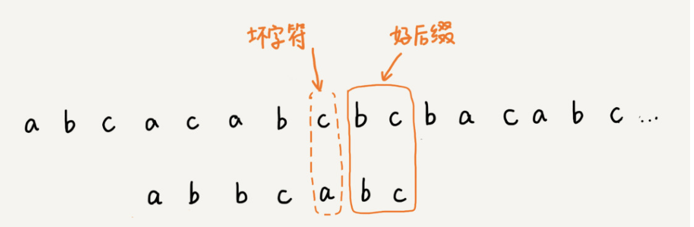
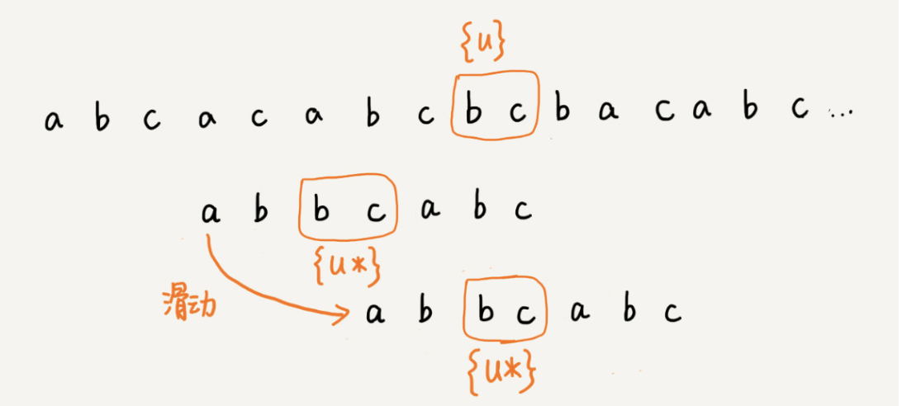
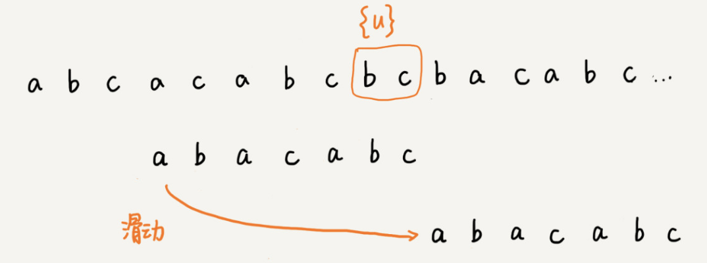
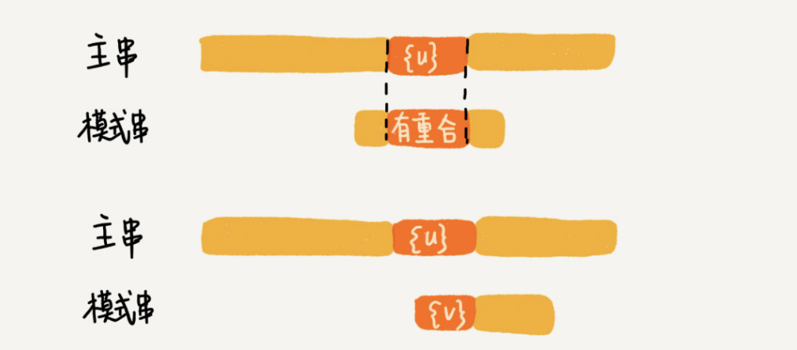
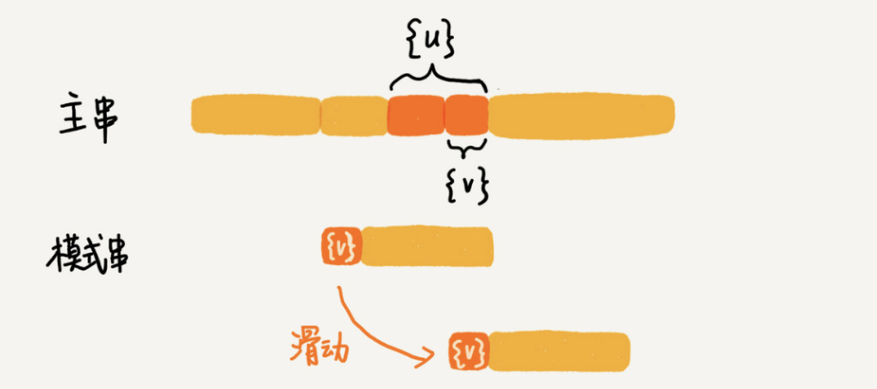
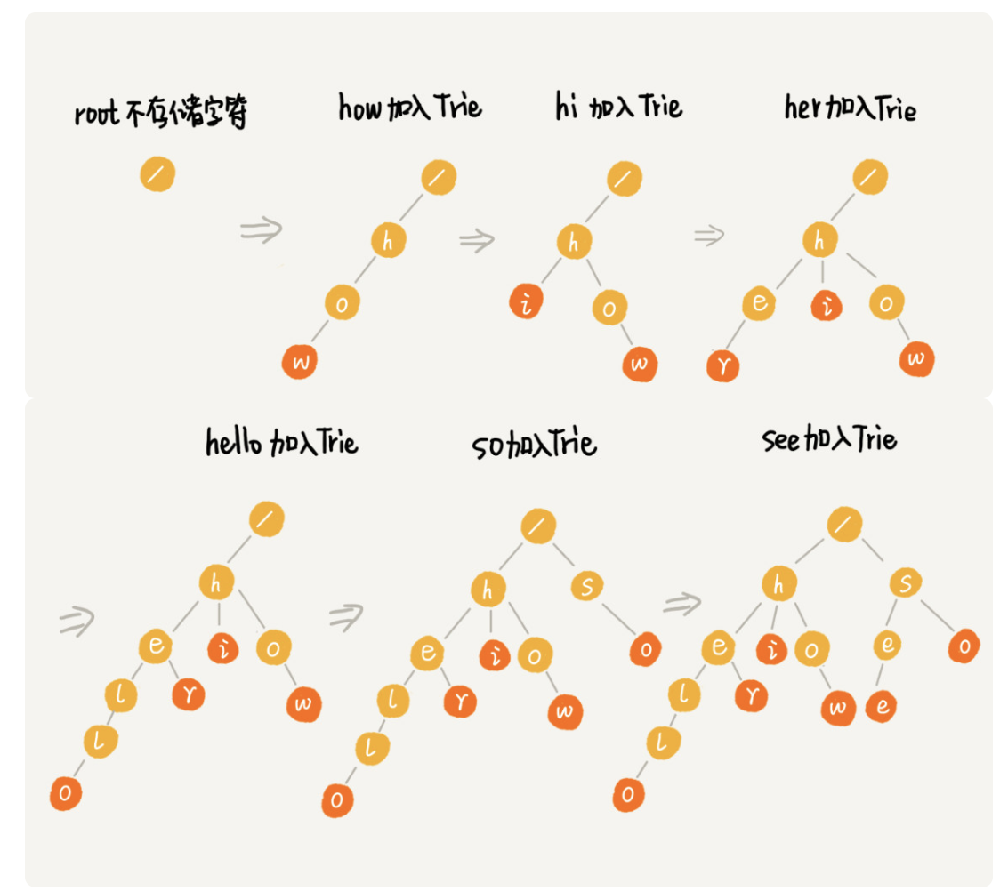

# 数据结构与算法

### 10个数据结构 数组、链表、栈、队列、散列表、二叉树、堆、跳表、图、trie树
### 10个算法 递归、排序、二分查找、搜索、哈希算法、贪心算法、分治算法、回溯算法、动态规划、字符串匹配算法

### 常见的复杂度量级（按数量级递增）
    * 常量阶 O(1)
    * 对数阶 O(logN)
    * 线性阶 O(N)
    * 线性对数阶 O(NlogN)
    * 平方阶 O(N*N)
    * 指数阶 O(2的N次幂)
    * 阶乘阶 O(N!)

数据结构就是指一组数据的存储结构。算法就是操作数据的一组方法。
数据结构是为算法服务的，算法要作用在特定的数据结构之上。

### 当同一块代码在不同的情况下，时间复杂度有量级的差距，才会使用三种复杂度（最好、最坏、平均时间复杂度）

数组是一种 **线性**的表数据结构，它用一组连续的内存空间，来存储一组具有相同类型的数据。同属于线性表结构的还有链表、队列、栈。与线性表对应的是 **非线性表**，比如二叉树、堆、图。

### 缓存淘汰策略常见的有三种：
    * 先进先出FIFO
    * 最少使用 Least Frequently Used
    * 最近最少使用 Least Recently Used

### 常用链表：单链表、双向链表、循环链表
链表的头结点记录链表的基地址，通过他遍历整条链表，尾节点指针指向一个空地址NULL
链表删除节点：
* 删除节点中”值等于某个给定值“的节点
* 删除给定指针指向的节点
对于第一种情况，单链表与双链表查找的时间复杂度都为O(n);
第二种情况，单链表为O(N),而双链表为O(1)。
插入、删除双链表都有优势，对于有序链表，双向链表的查询效率也较高。因为可以记录上次查找的位置P，每次查询时，与P比较，决定往前还是往后查找。

|     排序算法     | 时间复杂度  | 是否基于比较 |
| :--------------: | :---------: | :----------: |
| 冒泡、插入、选择 |   O(n*n)    |      是      |
|    快排、归并    | O（n*logn） |      是      |
|  捅、计数、基数  |    O(n)     |      否      |

如何分析一个排序算法：
### 执行效率
1、最好、最坏、平均情况时间复杂度

2、时间复杂度的系数、常数、低阶

3、比较次数和交换（移动）的次数
### 内存消耗
原地排序，特指空间复杂度是O（1）的排序算法
### 排序算法的稳定性
待排序的序列中存在等值元素，经过排序之后，顺序不变

### 有序度与逆序度
有序度：如果i<j 则a[i]<=a[j]

数组 2，4，3，1，5，6 有序度为11，因为有序元素对为11个：
（2，4）（2，3）（2，5）（2，6）
（4，5）（4，6）（3，5）（3，6）
（1，5）（1，6）（5，6）

对于一个完全有序的数组：有序度为**n*** **(n-1)/2**，把这种完全有序的数组的有序度叫满有序度。

插入排序比冒泡排序更受欢迎？原地排序算法？稳定的排序算法？

冒泡与插入时间复杂度都是**O（N*****N）**，都是原地排序算法，也是稳定的排序算法。但是冒泡排序需要数据交换，要三个复制操作，而插入排序只需要移动数据一次。大数据量下冒泡的时间是插入排序的7倍左右。

## 快速排序与归并排序
归并排序处理的过程由下到上，先处理子问题，然后再合并。快速排序正好相反，处理过程由上到下，先分区，再处理子问题。归并排序虽然是稳定的、时间复杂度为O（n*logN）的排序算法，但是它是非原地排序算法。
快速排序原定、不稳定的排序算法，大部分情况下时间复杂度可以做到 **O（N** **logN）**，极端情况下，会退化到 **O（N** **N）**

### 线性排序算法

桶排序、计数排序、基数排序

基数排序对要排序的数据有要求，需要可以分割出独立的“位”来比较，而且位之间有递进的关系，如果 a 数据的高位比b数据大，那剩下的低位就不用比较了。除此之外，每一位的数据范围不能太大，要可以用线性算法来排序，否则，基数排序时间复杂度无法做到O（n）。

桶排序和基数排序都是针对范围不大的数据，将数据划分成不同的桶来实现。基数排序要求数据可以划分成高低位，位之间有递进关系。比较两个数，我们只需要比较高位，高位相同的再比较低位。而且每一位的数据范围不能太大，因为基数排序算法需要借助桶排序或者计数排序来完成每一个位的排序工作

### 二分查找
数组元素中，留心下标是否越界。例如求中间元素时，如果mid=（low+high）/2,就有可能产生越界问题。
可改写成：mid=low+（high-low）>>1

### 解决Hash冲突的办法
1、开放寻址法
数据直接存储在数组中，有效利用CPU缓存加快查询速度。这种方法实现的散列表，序列化起来比较简单。链表法包含指针，序列化起来没那么容易。
开放寻址法中，由于所有数据在一个数组中，所以冲突的代价更高。所以开放寻址法解决冲突的散列表，装载因子的上限不能太大。所以也这种方法比较浪费内存空间。

当数据量比较小，装载因子小的时候，适合用开放寻址法。这也是Java ThreadLocalMap使用开放寻址法解决散列冲突的原因。

2、链表法
链表法对内存的利用率比开放寻址法高。比起开放寻址法，对大装载因子的容忍度更高。开放寻址法只能适用装载因子小于1的情况，接近1时，可能就会有大量的散列冲突，导致大量的探测、再散列，性能会下降。对于链表法来说，只要散列函数的值随机均匀，即便装载因子变成10，也就是链表的长度变成了，查找效率会下降，但比顺序查找还是快很多。
因为链表要存储指针，所以对于小对象存储，比较耗内存，还有可能让内存的消耗翻倍。而且因为链表中的节点是零散分布的，不连续的，所以对CPU缓存不友好。可将链表法中的链表改为其他高效的动态数据结构，比如跳表、红黑树。即使出现散列冲突，极端情况下，所有数据散列到同一个桶，查找时间O（logN）。**基于链表的散列冲突处理方法比较适合存储大对象、大数据量的散列表，比起开放寻址法，更加灵活，支持更多的优化策略，比如用红黑树代替链表**

### 哈希算法

将任意长度的二进制值串映射为固定长度的二进制值串，这个映射的规则叫 **哈希算法**，通过原始数据映射之后得到的二进制值串就是 **哈希值**。优秀哈希算法满足的要求：

- 从哈希值不能反向推导出原始数据(所以哈希算法也叫单向哈希算法)

- 对输入数据非常敏感，哪怕原始数据只修改了一个Bit，最后得到的哈希值也大不相同

- 散列冲突的概率要很小，对于不同的原始数据，哈希值相同的概率非常小

- 哈希算法的执行效率要尽量高效，针对较长的文本，也能快速的计算出哈希值。

  

哈希算法的应用：

安全加密、数据校验、唯一标识、散列函数、负载均衡、数据分片、分布式存储

关于"树"的概念，高度、深度、层
节点的高度 = 节点到叶子节点的最长路径（边数）
节点的深度 = 根节点到这个节点所经历的边的个数
节点的层数 = 及诶点的深度 + 1
树的高度 = 根节点的高度

二叉查找树：
在树中的任意一个节点，其左子树中的每个节点的值，都要小于这个节点的值，而右子树节点的值都大于这个节点的值。
支持快速插入、删除、查找操作，各个操作的时间复杂度跟树的高度成正比，理想情况下，时间复杂度是O（logN）

平衡二叉树：
二叉树中任意一个节点的左右子树的高度相差不能大于1。
平衡二叉查找树中"平衡"的意思，是让整棵树左右看起来比较"对称"，比较"平衡"，不要出现左子树很高、右子树很矮的情况。这样就能让整棵树的高度相对来说低一些，相应的插入、删除、查找等操作的效率高一些。

**红黑树由2-3树的演变**
<<<<<<< HEAD:算法/DataStructAndAlgorithm.md

#### 字符串匹配算法之----BF算法、RK算法、BM算法和KMP算法

1、BF算法

Brute Force的缩写，中文也叫暴力匹配算法，朴素匹配算法。其思想是：在主串中，检查起始位置分别是0、1、2…n-m且长度为m的n-m+1个子串，看有没有跟模式串匹配的，其中主串长度为n，模式串长度为m。时间复杂度比较高，是O(n*m),n、m表示主串和模式串的长度。

2、RK算法

全称叫Rabin-Karp算法，算法的思路：通过哈希算法对主串中的 n-m+1个子串分别求哈希值，然后逐个与模式串的哈希值比较大小。哈希算法的设计：假设要匹配的字符串的字符集中只包含K个字符，我们可以用一个K进制数来表示一个子串，这个K进制数转化成十进制数，作为子串的哈希值。比如要处理的字符串只包含a~z这26个小写字母，则用二十六进制来表示一个字符串。a~z映射0~25这26个数字，a表示0，b表示1……z表示25.那么cba=c X26X26+bX26+aX1=1353。通过这种特殊的哈希算法，只需要扫描一遍主串就能计算出所有子串的哈希值了。RK算法的时间复杂度是O(n),跟BF算法相比，效率提高了很多，但是效率取决于哈希算法的设计。如果存在大量哈希冲突，极端情况下，会退化为O(n*m)。

3、BM算法

Boyer-Moore算法，核心思想是，利用模式串本身的特点，在模式串中某个字符与主串不能匹配的时候，讲模式串往后多滑几位，以此来减少不必要的字符比较，提高匹配效率。BM算法构建的规则有两类，坏字符规则和好后缀规则。好后缀规则可以独立于坏字符规则使用。坏字符规则的实现比较耗内存，为了省内存，可以只用好后缀规则来实现BM算法。

3.1 坏字符规则

BM算法的匹配顺序是按照模式串下标从大到小的顺序，倒着匹配。

当发现某个字符没法匹配的时候，把这个没有匹配的字符叫**坏字符**，比如上图中c是坏字符。当发生不匹配的时候，我们把坏字符对应的模式串中的字符下标记作 si。如果坏字符在模式串中存在，我们把这个坏字符在模式串中的下标记作 xi。如果不存在，我们把 xi 记作 -1。那模式串往后移动的位数就等于 si-xi。（注意，我这里说的下标，都是字符在模式串的下标）。如果坏字符在模式串里多次出现，我们在计算Xi的时候，选择最靠后的那个，因为这样不会让模式串滑动过多，导致本来可能匹配的情况被滑过。如下图：

单纯使用坏字符规则还是不够的，因为根据si-xi计算出来的移动位数，可能是负数，比如主串aaaaaaaaaaaaaaa，模式串baaa。这种不但不会向后滑动模式串，还可能倒退。所以，BM算法还需要用到"好后缀规则"。

3.2好后缀规则

好后缀规则跟坏字符规则类似，滑动过程中，匹配到的字符称为好后缀，未匹配的称为坏字符，如下图：

我们把已经匹配的bc叫好后缀，记为{u}。拿它在模式串中查找，如果找到了另一个跟{u}相匹配的子串{u*}，那么就将模式串滑动到子串{u\*}对齐的位置。如图：

如果模式串中找不到另一个等于{u}的子串，就直接将模式串，滑动到主串中{u}的后面，因为之前的任何一次往后滑动，都没有匹配主串中{u}的情况。如图：

但是上述的这种情况有时候也会滑动过头，来看下边这个例子，bc是好后缀，尽管在模式串中没有另外一个相匹配的子串{u\*},但是如果我们将模式串移动到好后缀的后面，会错过模式串和主串可以匹配的情况。如图：

如果好后缀在模式串中不存在可匹配的子串，那在我们一步一步往后滑动模式串的过程中，只要主串中的{u}与模式串有重合，那肯定就无法完全匹配。但是当模式串滑动到前缀与主串中{u}的后缀有部分重合的时候，并且重合的部分相等的时候，就有可能会存在完全匹配的情况。如图：

针对这种情况，不仅要看好后缀在模式串中，是否有另一个匹配的子串，我们还要考察好后缀的后缀子串，是否存在跟模式串的前缀子串匹配的。所谓某个字符串 s 的后缀子串，就是最后一个字符跟 s 对齐的子串，比如 abc 的后缀子串就包括 c, bc。所谓前缀子串，就是起始字符跟 s 对齐的子串，比如 abc 的前缀子串有 a，ab。我们从好后缀的后缀子串中，找一个最长的并且能跟模式串的前缀子串匹配的，假设是{v}，然后将模式串滑动到如图所示的位置。

当模式串和主串中的某个字符不匹配的时候，**我们分别计算好后缀和坏字符往后滑动的位数，然后取两个数中最大的，作为模式串往后滑动的位数**。

### BM算法的实现

“坏字符规则”，当遇到坏字符时，要计算往后移动的位数 si-xi，其中 xi 的计算是重点，我们如何求得 xi 呢？或者说，如何查找坏字符在模式串中出现的位置呢？如果我们拿坏字符，在模式串中顺序遍历查找，这样就会比较低效，势必影响这个算法的性能。有没有更加高效的方式呢？我们之前学的散列表，这里可以派上用场了。我们可以将模式串中的每个字符及其下标都存到散列表中。这样就可以快速找到坏字符在模式串的位置下标了。关于这个散列表，我们只实现一种最简单的情况，假设字符串的字符集不是很大，每个字符长度是 1 字节，我们用大小为 256 的数组，来记录每个字符在模式串中出现的位置。数组的下标对应字符的 ASCII 码值，数组中存储这个字符在模式串中出现的位置。如下图：

代码如下：

~~~go
var size = 256
func generateBc(searchBytes []byte,hash [256]int){
	for i := 0; i < size; i ++ {
		hash[i] = -1
	}
	for i := 0; i < len(searchBytes); i++ {
		ascii := int(searchBytes[i])
		hash[ascii] = i
	}
}
~~~

仅用坏字符规则，我们把 BM 算法代码的大框架写好，先不考虑好后缀规则，仅用坏字符规则，并且不考虑 si-xi 计算得到的移动位数可能会出现负数的情况。代码：

~~~go
func BM(mainBytes []byte,searchBytes []byte) int {
	index := -1
	mainL := len(mainBytes)
	searchL := len(searchBytes)
	if searchL <= mainL {
		index = 0
	}
	hash := [256]int{}//记录模式串中每个字符最后出现的位置
	generateBc(searchBytes,hash)//生成坏字符哈希表
	var i int //i表示主串与模式串对齐的第一个字符
	for i <= mainL - searchL {
		var j int
		for j = searchL - 1; j >= 0; j-- {//模式串从后往前匹配
			if mainBytes[i+j] != searchBytes[j]{//坏字符对应模式串中的下标是j
				break
			}
		}
		if j < 0 {
			return i // 匹配成功，返回主串与模式串第一个匹配的字符的位置
		}
		i = i + (j - hash[int(mainBytes[i+j])])
	}

	return index
}
~~~

过程如图：

接下来实现好后缀规则：

好后缀规则其核心内容有两点，一是在模式串中，查找跟好后缀匹配的另一个子串；二是在好后缀的后缀子串中，查找最长的、能跟模式串前缀子串匹配的后缀子串。在不考虑效率的情况下，这两个操作都可以用很“暴力”的匹配查找方式解决。但是，如果想要 BM 算法的效率很高，这部分则有一定的技巧。**因为好后缀也是模式串本身的后缀子串，所以，我们可以在模式串和主串正式匹配之前，通过预处理模式串，预先计算好模式串的每个后缀子串，对应的另一个可匹配子串的位置。**因为后缀子串的最后一个字符的位置是固定的，下标为 m-1，我们只需要记录长度就可以了。通过长度，我们可以确定一个唯一的后缀子串。如下图：

现在我们引入suffix数组，suffix 数组的下标 k，表示后缀子串的长度，下标对应的数组值存储的是，在模式串中跟好后缀{u}相匹配的子串{u*}的起始下标值。如图：

但是，如果模式串中有多个（大于 1 个）子串跟后缀子串{u}匹配，那 suffix 数组中该存储哪一个子串的起始位置呢？为了避免模式串往后滑动得过头了，我们肯定要存储模式串中最靠后的那个子串的起始位置，也就是下标最大的那个子串的起始位置。实际上，仅仅是选最靠后的子串片段来存储是不够的。我们不仅要在模式串中，查找跟好后缀匹配的另一个子串，还要在好后缀的后缀子串中，查找最长的能跟模式串前缀子串匹配的后缀子串。如果我们只记录刚刚定义的 suffix，实际上，只能处理规则的前半部分，也就是，在模式串中，查找跟好后缀匹配的另一个子串。所以，除了 suffix 数组之外，我们还需要另外一个 boolean 类型的 prefix 数组，来记录模式串的后缀子串是否能匹配模式串的前缀子串。如图：

接下来去填充这两个数组：

我们拿下标从 0 到 i 的子串（i 可以是 0 到 m-2）与整个模式串，求公共后缀子串。如果公共后缀子串的长度是 k，那我们就记录 suffix[k]=j（j 表示公共后缀子串的起始下标）。如果 j 等于 0，也就是说，公共后缀子串也是模式串的前缀子串，我们就记录 prefix[k]=true。如图：

代码实现：

~~~go
func generateGS(searchBytes []byte, suffix []int, prefix []bool){
	m := len(searchBytes)
	for i := 0; i < m; i++ {
		suffix[i] = -1
		prefix[i] = false
	}
	for i := 0; i < m - 1; i++ {
		j := i
		var k int
		for j >= 0 && searchBytes[j] == searchBytes[m-1-k] {
			j--
			k++
			suffix[k] = j+1
		}
		if j == -1 {
			prefix[k] = true
		}
	}
}
~~~

#### 有了上边两个数组之后，遇到不能匹配的字符时，如何根据好后缀规则计算往后滑动的位数？

假设好后缀的长度是 k。我们先拿好后缀，在 suffix 数组中查找其匹配的子串。如果 suffix[k] 不等于 -1（-1 表示不存在匹配的子串），那我们就将模式串往后移动 j-suffix[k]+1 位（j 表示坏字符对应的模式串中的字符下标）。

如果 suffix[k] 等于 -1，表示模式串中不存在另一个跟好后缀匹配的子串片段。我们可以用下面这条规则来处理。好后缀的后缀子串 b[r, m-1]（其中，r 取值从 j+2 到 m-1）的长度 k=m-r，如果 prefix[k] 等于 true，表示长度为 k 的后缀子串，有可匹配的前缀子串，这样我们可以把模式串后移 r 位。如图：

如果两条规则都没有找到可以匹配好后缀及其后缀子串的子串，我们就将整个模式串后移 m 位。如图：

#### 字符串匹配KMP算法

在模式串和主串匹配的过程中，把不能匹配的那个字符仍然叫做**坏字符**，把已经匹配的那段字符串叫**好前缀**。

当遇到坏字符的时候，把模式串往后滑动，滑动的过程中，只要模式串和好前缀有上下重合，前面几个字符的比较，就相当于拿好前缀的后缀子串，跟模式串的前缀子串比较。如下图：

我们只需要拿好前缀本身，在它的后缀子串中，查找最长的那个可以跟好前缀的前缀子串匹配的。假设最长的可匹配的那部分前缀子串是{v}，长度是 k。我们把模式串一次性往后滑动 j-k 位，相当于，每次遇到坏字符的时候，我们就把 j 更新为 k，i 不变，然后继续比较。

我把好前缀的所有后缀子串中，最长的可匹配前缀子串的那个后缀子串，叫作最长可匹配后缀子串，对应的前缀子串，叫作最长可匹配前缀子串。

通过预处理，可以求模式串的最长可匹配前缀和后缀子串。类似BM酸奶法中的bc、suffix、prefix数组，KMP中我们把数组定义为next数组，也叫失效函数(failure function)。

数组的下标是每个前缀结尾字符下标，数组的值是这个前缀的最长可以匹配前缀子串的结尾字符下标。如图：

失效函数的计算方法：

我们按照下标从小到大，依次计算 next 数组的值。当我们要计算 next[i] 的时候，前面的 next[0]，next[1]，……，next[i-1] 应该已经计算出来了。利用已经计算出来的 next 值，我们是否可以快速推导出 next[i] 的值呢？

如果 next[i-1]=k-1，也就是说，子串 b[0, k-1] 是 b[0, i-1] 的最长可匹配前缀子串。如果子串 b[0, k-1] 的下一个字符 b[k]，与 b[0, i-1] 的下一个字符 b[i] 匹配，那子串 b[0, k] 就是 b[0, i] 的最长可匹配前缀子串。所以，next[i] 等于 k。但是，如果 b[0, k-1] 的下一字符 b[k] 跟 b[0, i-1] 的下一个字符 b[i] 不相等呢？这个时候就不能简单地通过 next[i-1] 得到 next[i] 了。

我们假设 b[0, i] 的最长可匹配后缀子串是 b[r, i]。如果我们把最后一个字符去掉，那 b[r, i-1] 肯定是 b[0, i-1] 的可匹配后缀子串，但不一定是最长可匹配后缀子串。所以，既然 b[0, i-1] 最长可匹配后缀子串对应的模式串的前缀子串的下一个字符并不等于 b[i]，那么我们就可以考察 b[0, i-1] 的次长可匹配后缀子串 b[x, i-1] 对应的可匹配前缀子串 b[0, i-1-x] 的下一个字符 b[i-x] 是否等于 b[i]。如果等于，那 b[x, i] 就是 b[0, i] 的最长可匹配后缀子串。

如何求得 b[0, i-1] 的次长可匹配后缀子串呢？次长可匹配后缀子串肯定被包含在最长可匹配后缀子串中，而最长可匹配后缀子串又对应最长可匹配前缀子串 b[0, y]。于是，查找 b[0, i-1] 的次长可匹配后缀子串，这个问题就变成，查找 b[0, y] 的最长匹配后缀子串的问题了。

按照这个思路，我们可以考察完所有的 b[0, i-1] 的可匹配后缀子串 b[y, i-1]，直到找到一个可匹配的后缀子串，它对应的前缀子串的下一个字符等于 b[i]，那这个 b[y, i] 就是 b[0, i] 的最长可匹配后缀子串。

#### Trie树

Trie树的本质，就是利用字符串之间的公共前缀，将重复的前缀合并在一起。假如有6个字符串，how,hi,her,hello,so,see。构造成trie树结构如下：

其中，根节点不包含任何信息。每个节点表示一个字符串中的字符，从根节点到红色节点的一条路径表示一个字符串。(红色节点并不都是叶子节点哦)。构造过程如下：

匹配过程：