​	

# 数据结构与算法

总览大纲：

### 必须掌握的数据结构与算法：

- 10个数据结构  数组、链表、栈、队列、散列表、二叉树、堆、跳表、图、trie树
- 10个算法 递归、排序、二分查找、搜索、哈希算法、贪心算法、分治算法、回溯算法、动态规划、字符串匹配算法

**我们学习数据结构和算法，要学习它的由来、特性、适用的场景以及它能解决的问题。**

---

### 时间复杂度

时间复杂度分析：

1. 只关注循环执行次数最多的一段代码
2. 加法法则，总复杂度等于量级最大的那段代码的复杂度
3. 乘法法则：嵌套代码的复杂度等于嵌套内外代码复杂度的乘积

常见的复杂度量级（按数量级递增）

    * 常量阶 O(1)
    * 对数阶 O(logN)
    * 线性阶 O(N)
    * 线性对数阶 O(NlogN)
    * 平方阶 O(N*N)
    * 指数阶 O(2的N次幂)
    * 阶乘阶 O(N!)

对于刚罗列的复杂度量级，我们可以粗略地分为两类，**多项式量级**和**非多项式量级**。其中，非多项式量级只有两个：O(2的N次幂) 和 O(n!)。当同一块代码在不同的情况下，时间复杂度有量级的差距，才会使用三种复杂度（最好、最坏、平均时间复杂度<也叫加权平均时间复杂度或者期望时间复杂度>）。

比较特殊的均摊时间复杂度：对一个数据结构进行一组连续操作中，大部分情况下时间复杂度都很低，只有个别情况下时间复杂度比较高，而且这些操作之间存在前后连贯的时序关系，这个时候，我们就可以将这一组操作放在一块儿分析，看是否能将较高时间复杂度那次操作的耗时，平摊到其他那些时间复杂度比较低的操作上。而且，在能够应用均摊时间复杂度分析的场合，一般均摊时间复杂度就等于最好情况时间复杂度。例如以下例子，每一次 O(n) 的插入操作，都会跟着 n-1 次 O(1) 的插入操作，所以把耗时多的那次操作均摊到接下来的 n-1 次耗时少的操作上，均摊下来，这一组连续的操作的均摊时间复杂度就是 O(1)。

~~~java

 // array表示一个长度为n的数组
 // 代码中的array.length就等于n
 int[] array = new int[n];
 int count = 0;
 
 void insert(int val) {
    if (count == array.length) {
       int sum = 0;
       for (int i = 0; i < array.length; ++i) {
          sum = sum + array[i];
       }
       array[0] = sum;
       count = 1;
    }

    array[count] = val;
    ++count;
 }
~~~

数据结构就是指一组数据的存储结构。算法就是操作数据的一组方法。数据结构是为算法服务的，算法要作用在特定的数据结构之上。

---

## 数据结构

### 1、数组

数组是一种 **线性**的表数据结构，它用一组**连续的内存空间**，来存储一组具有相同类型的数据。同属于线性表结构的还有链表、队列、栈。

与线性表对应的是 **非线性表**，比如二叉树、堆、图。

不同语言中的容器

Java ArrayList,C++ vector

ArrayList 最大的优势就是可以将很多数组操作的细节封装起来。比如前面提到的数组插入、删除数据时需要搬移其他数据等。另外，它还有一个优势，就是支持动态扩容。如果使用 ArrayList，我们就完全不需要关心底层的扩容逻辑，ArrayList 已经帮我们实现好了。每次存储空间不够的时候，它都会将空间自动扩容为 1.5 倍大小。

- Java ArrayList 无法存储基本类型，比如 int、long，需要封装为 Integer、Long 类，而 Autoboxing、Unboxing 则有一定的性能消耗，所以如果特别关注性能，或者希望使用基本类型，就可以选用数组。
- 如果数据大小事先已知，并且对数据的操作非常简单，用不到 ArrayList 提供的大部分方法，也可以直接使用数组。
-  当要表示多维数组时，用数组往往会更加直观。比如 Object[][] array；而用容器的话则需要这样定义：ArrayList<ArrayList<object> > array。

数组用一块连续的内存空间，来存储相同类型的一组数据，最大的特点就是支持随机访问，但插入、删除操作也因此变得比较低效，平均情况时间复杂度为 O(n)。在平时的业务开发中，我们可以直接使用编程语言提供的容器类，但是，如果是特别底层的开发，直接使用数组可能会更合适。

数组下标从0开始，从数组存储的内存模型上来看，“下标”最确切的定义应该是“偏移（offset）”。前面也讲到，如果用 a 来表示数组的首地址，a[0] 就是偏移为 0 的位置，也就是首地址，a[k] 就表示偏移 k 个 type_size 的位置，所以计算 a[k] 的内存地址只需要用这个公式：a[k]_address = base_address + k *type_size，但是，如果数组从 1 开始计数，那我们计算数组元素 a[k] 的内存地址就会变为：a[k]_address = base_address + (k-1)*type_size，对CPU来说，会多一次减法指令。

---

### 2、链表

缓存淘汰策略常见的有三种：

* 先进先出FIFO
* 最少使用 Least Frequently Used
* 最近最少使用 Least Recently Used（典型的链表应用场景）

链表通过指针，将零散的内存卡串联起来，所以不像数组那样，需要连续的内存空间。下图表明了数组与链表的底层存储结构。

常用链表：单链表、双向链表、循环链表

#### 2.1 单链表：

链表的头结点记录链表的基地址，通过他遍历整条链表，尾节点指针指向一个空地址NULL。在进行数组的插入、删除操作时，为了保持内存数据的连续性，需要做大量的数据搬移，所以时间复杂度是 O(n)。而在链表中插入或者删除一个数据，我们并不需要为了保持内存的连续性而搬移结点，因为链表的存储空间本身就不是连续的。所以，在链表中插入和删除一个数据是非常快速的。针对链表的插入和删除操作，我们只需要考虑相邻结点的指针改变，所以对应的时间复杂度是 O(1)。链表要想随机访问第 k 个元素，就没有数组那么高效了。因为链表中的数据并非连续存储的，所以无法像数组那样，根据首地址和下标，通过寻址公式就能直接计算出对应的内存地址，而是需要根据指针一个结点一个结点地依次遍历，直到找到相应的结点。

**头指针的概念** 链表中第一个节点的存储位置叫做头指针，如果链表有头结点，那么头指针就是指向头结点数据域的指针。如下图所示：

如果单链表没有头结点，则如下：

#### 2.2循环链表

循环链表是一种特殊的单链表。实际上，循环链表也很简单。它跟单链表唯一的区别就在尾结点。我们知道，单链表的尾结点指针指向空地址，表示这就是最后的结点了。而循环链表的尾结点指针是指向链表的头结点。

#### 2.3 双向链表

单向链表只有一个方向，结点只有一个后继指针 next 指向后面的结点。而双向链表，顾名思义，它支持两个方向，每个结点不止有一个后继指针 next 指向后面的结点，还有一个前驱指针 prev 指向前面的结点。

从结构上来看，双向链表可以支持 O(1) 时间复杂度的情况下找到前驱结点，正是这样的特点，也使双向链表在某些情况下的插入、删除等操作都要比单链表简单、高效。

链表删除节点：

* 删除节点中”值等于某个给定值“的节点
* 删除给定指针指向的节点

对于第一种情况，单链表与双链表查找的时间复杂度都为O(n)；第二种情况，单链表为O(N),而双链表为O(1)。
插入、删除双链表都有优势，对于有序链表，双向链表的查询效率也较高。因为可以记录上次查找的位置P，每次查询时，与P比较，决定往前还是往后查找。

指针：**将某个变量赋值给指针，实际上就是将这个变量的地址赋值给指针，或者反过来说，指针中存储了这个变量的内存地址，指向了这个变量，通过指针就能找到这个变量。**

注意链表的边界检查，比较容易出错：

- 如果链表为空时，代码是否能正常工作？
- 如果链表只包含一个结点时，代码是否能正常工作？
- 如果链表只包含两个结点时，代码是否能正常工作？
- 代码逻辑在处理头结点和尾结点的时候，是否能正常工作？

---

### 3、栈

后进者先出，先进者后出，这是典型的”栈“结构。栈是一种操作受限的线性表，只允许在一端插入和删除数据。**当某个数据集合只涉及在一端插入和删除数据，并且满足后进先出、先进后出的特性，我们就应该首选“栈”这种数据结构。**栈既可以用数组来实现，也可以用链表来实现。用数组实现的栈，我们叫作**顺序栈**，用链表实现的栈，我们叫作**链式栈**。

不管是顺序栈还是链式栈，我们存储数据只需要一个大小为 n 的数组就够了。在入栈和出栈过程中，只需要一两个临时变量存储空间，所以空间复杂度是 O(1)。注意，这里存储数据需要一个大小为 n 的数组，并不是说空间复杂度就是 O(n)。因为，这 n 个空间是必须的，无法省掉。所以我们说空间复杂度的时候，是指除了原本的数据存储空间外，算法运行还需要额外的存储空间。

栈比较经典的应用场景就:

**1.函数调用栈**。操作系统给每个线程分配了一块独立的内存空间，这块内存被组织成“栈”这种结构, 用来存储函数调用时的临时变量。每进入一个函数，就会将临时变量作为一个栈帧入栈，当被调用函数执行完成，返回之后，将这个函数对应的栈帧出栈。

~~~java
int main() {  
  int a = 1;   
  int ret = 0;  
  int res = 0;  
  ret = add(3, 5);  
  res = a + ret;  
  printf("%d", res);   
  reuturn 0;}
int add(int x, int y) {
  int sum = 0;  
  sum = x + y;  
  return sum;
}
~~~

入栈情况如下图：

**2.表达式求值** 

比如对于四则运算：3+5*8-6  实际上，编译器就是通过两个栈来实现的。其中一个保存操作数的栈，另一个是保存运算符的栈。我们从左向右遍历表达式，当遇到数字，我们就直接压入操作数栈；当遇到运算符，就与运算符栈的栈顶元素进行比较。如果比运算符栈顶元素的优先级高，就将当前运算符压入栈；如果比运算符栈顶元素的优先级低或者相同，从运算符栈中取栈顶运算符，从操作数栈的栈顶取 2 个操作数，然后进行计算，再把计算完的结果压入操作数栈，继续比较。过程如图：

**3.栈在括号匹配中的应用**

我们假设表达式中只包含三种括号，圆括号 ()、方括号 [] 和花括号{}，并且它们可以任意嵌套。比如，{[] ()[{}]}或 [{()}([])] 等都为合法格式，而{[}()] 或 [({)] 为不合法的格式。我们用栈来保存未匹配的左括号，从左到右依次扫描字符串。当扫描到左括号时，则将其压入栈中；当扫描到右括号时，从栈顶取出一个左括号。如果能够匹配，比如“(”跟“)”匹配，“[”跟“]”匹配，“{”跟“}”匹配，则继续扫描剩下的字符串。如果扫描的过程中，遇到不能配对的右括号，或者栈中没有数据，则说明为非法格式。当所有的括号都扫描完成之后，如果栈为空，则说明字符串为合法格式；否则，说明有未匹配的左括号，为非法格式。

**4.类似浏览器前进、后退的功能**

我们使用两个栈，X 和 Y，我们把首次浏览的页面依次压入栈 X，当点击后退按钮时，再依次从栈 X 中出栈，并将出栈的数据依次放入栈 Y。当我们点击前进按钮时，我们依次从栈 Y 中取出数据，放入栈 X 中。当栈 X 中没有数据时，那就说明没有页面可以继续后退浏览了。当栈 Y 中没有数据，那就说明没有页面可以点击前进按钮浏览了。

---

### 4、队列

#### 4.1 普通队列

队列也是操作受限的数据结构，最基本的操作也是两个：入队 enqueue()，放一个数据到队列尾部；出队 dequeue()，从队列头部取一个元素。典型场景是先进先出，与栈的对比如下：

对于栈来说，一个栈顶指针就可以了，但对于队列，需要两个指针，一个是head指针，指向队头；一个是tail指针，指向队尾。下图中，a，b，c，d依次入队之后，head指针指向下标为0的位置，tail指针指向下标为4的位置。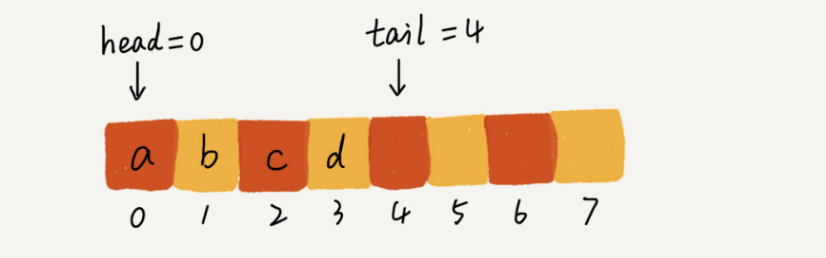

当调用两次出队操作之后，head指针指向下标为2的位置，tail仍然指向下标为4的位置，如图：

当不停的入队、出队之后，head和tail会持续后移。当tail移动到最右边，即使数组中还有空闲空间，也无法继续添加数据了，此时，需要**转移数据**。当入队时，如果没有空闲空间，集中触发一次数据搬移操作。当队列的 tail 指针移动到数组的最右边后，如果有新的数据入队，我们可以将 head 到 tail 之间的数据，整体搬移到数组中 0 到 tail-head 的位置。如图：

队列如果用链表实现，同样需要两个指针：head指针和tail指针，分别指向链表的第一个结点和最后一个结点。入队时，tail->next = new_node,tail = tail ->next;出队时，head = head ->next。

如图：

#### 4.2 循环队列

在用数组实现的非循环队列中，队满的判断条件是 tail == n，队空的判断条件是 head == tail。对于循环队列，队列为空的判断条件仍然是head == tail，但队列满的条件跟普通队列有点不一样，就像图中画的队满的情况，tail=3，head=4，n=8，所以总结一下规律就是：(3+1)%8=4。多画几张队满的图，你就会发现，当队满时，**(tail+1)%n=head。**

#### 4.3 阻塞队列

阻塞队列是在队列的基础上增加了阻塞操作，当队列为空的时候，从队头取数据会被阻塞，因为此时没有数据可取，直到队列中有了数据才能返回；如果队列已经满了，那么插入数据会被阻塞，直到队列中有空闲位置后再插入数据，然后再返回。利用阻塞队列，可以实现“生产者-消费者模型”。

#### 4.4 并发队列

线程安全的队列我们叫**并发队列**。最简单的实现方式是直接在enqueue()、dequeue()方法上加锁，但是锁粒度大并发度会比较低，同一时刻仅允许一个存或者取操作。实际上，基于数组的循环队列，利用 CAS 原子操作，可以实现非常高效的并发队列。这也是循环队列比链式队列应用更加广泛的原因。

队列在请求排队时非常有效，而且基于链表和基于数组实现的队列也有一定的区别。基于链表的实现方式，可以实现一个支持无限排队的无界队列（unbounded queue），但是可能会导致过多的请求排队等待，请求处理的响应时间过长。所以，针对响应时间比较敏感的系统，基于链表实现的无限排队的线程池是不合适的。而基于数组实现的有界队列（bounded queue），队列的大小有限，所以线程池中排队的请求超过队列大小时，接下来的请求就会被拒绝，这种方式对响应时间敏感的系统来说，就相对更加合理。不过，设置一个合理的队列大小，也是非常有讲究的。队列太大导致等待的请求太多，队列太小会导致无法充分利用系统资源、发挥最大性能。

---

## 算法

### 1、排序算法

|     排序算法     | 时间复杂度  | 是否基于比较 |
| :--------------: | :---------: | :----------: |
| 冒泡、插入、选择 |   O(n*n)    |      是      |
|    快排、归并    | O（n*logn） |      是      |
|  桶、计数、基数  |    O(n)     |      否      |

### 2、如何分析一个排序算法：

- 执行效率 1、最好、最坏、平均情况时间复杂度 2、时间复杂度的系数、常数、低阶 3、比较次数和交换（移动）的次数

- 内存消耗 ，是否原地排序，特指空间复杂度是O（1）的排序算法

- 排序算法的稳定性  待排序的序列中存在等值元素，经过排序之后，顺序不变。稳定性这个概念在实际开发中很重要，比如Demo：订单有下单时间和金额两个属性，先要要对十万订单，按照金额从小到大对数据排序，对于相同金额的订单，希望按照下单时间从早到晚有序。 如果我们先按照金额对订单数据进行排序，然后，再遍历排序之后的订单数据，对于每个金额相同的小区间再按照下单时间排序。这种排序思路理解起来不难，但是实现起来会很复杂。所以更好的实现是：我们先按照下单时间给订单排序，注意是按照下单时间，不是金额。排序完成之后，我们用稳定排序算法，按照订单金额重新排序。两遍排序之后，我们得到的订单数据就是按照金额从小到大排序，金额相同的订单按照下单时间从早到晚排序的。因为稳定排序算法可以保持金额相同的两个对象，在排序之后的前后顺序不变。第一次排序之后，所有的订单按照下单时间从早到晚有序了。在第二次排序中，我们用的是稳定的排序算法，所以经过第二次排序之后，相同金额的订单仍然保持下单时间从早到晚有序。

**有序度与逆序度的概念：**

有序度：如果i<j 则a[i]<=a[j]

数组 2，4，3，1，5，6 有序度为11，因为有序元素对为11个：
（2，4）（2，3）（2，5）（2，6）
（4，5）（4，6）（3，5）（3，6）
（1，5）（1，6）（5，6）

对于一个完全有序的数组：有序度为**n*** **(n-1)/2**，把这种完全有序的数组的有序度叫满有序度。逆序度 = 满有序度 - 有序度。我们排序的过程就是一种增加有序度，减少逆序度的过程，最后达到满有序度，就说明排序完成了。

### 3、相关算法

#### 3.1 递归

如果满足以下条件，可以用递归求解：

- 一个问题的解可以分解为几个子问题的解
- 这个问题与分解之后的子问题，除了数据规模不同，求解思路完全一样
- 存在递归终止条件

递归代码存在的弊端：堆栈溢出、重复计算、函数调用耗时多、空间复杂度高。

手写算法：

1. 斐波那契数列求值f(n)=f(n-1)+f(n-2)
2. 编程实现求阶乘n!
3. 编程实现一组数据集合的全排列

#### 3.2 快速排序

个人理解：选取一个基数，比此基数小的放左边，或者比此基数大的放右边，循环进行挪动，最后变成有序，时间复杂度：O(n*logN)，go语言实现:

~~~go
  func quickSort(a []int,l,h int){
  if l >= h{
    return
  }
  i := partition(a,l,h)
  quickSort(a,0,i-1)
  quickSort(a,i+1,h)
}
//第一种方式 比基数小的往左移
func partition1(a []int,l,h int)int{
  base := a[h]
  p := l
  for i:=l;i<h;i++{
    if a[i] < base {
      a[i],a[p] := a[p],a[i]
      p++
    }
  }
  a[p],a[h] := a[h],a[p]
  return p
}
    //第二种方式 比基数大的往右移
func partition2(a []int,l,h int)int{
  base := a[h]
  p := h
  for i := l;i < h;i++{
    if a[i] > base {
       a[i],a[p] := a[p],a[i]
       p--
    }
  }
   a[p],a[h] := a[h],a[p]
  return p
} 
~~~

利用快排，可以在O(n)时间复杂度内，求无序数组元素中的第K大元素。比如：4，2，5，12，3 第三大元素就是4。某些情况下，快排的最坏情况时间复杂度是O($n^2$)。为了提高排序算法的性能，尽可能让每次分区都比较平均。常用的分区算法：

1.三数取中法 我们从区间的首、尾、中间，分别取出一个数，然后对比大小，取这 3 个数的中间值作为分区点。这样每间隔某个固定的长度，取数据出来比较，将中间值作为分区点的分区算法，肯定要比单纯取某一个数据更好。但是，如果要排序的数组比较大，那“三数取中”可能就不够了，可能要“五数取中”或者“十数取中”。

2. 随机法 每次从要排序的区间中，随机选择一个元素作为分区点。这种方法并不能保证每次分区点都选的比较好，但是从概率的角度来看，也不大可能会出现每次分区点都选的很差的情况，所以平均情况下，这样选的分区点是比较好的。时间复杂度退化为最糟糕的 O(n2) 的情况，出现的可能性不大。

快排的时间复杂度分析：

~~~
//最好的情况：
T(1) = 1;
T(n) = 2*T(n/2) + a*n;(a为常数，每次合并时，复杂度为O(n))
= 2*(2*T(n/4)+a*n/2) + a*n
= 4*T(n/4) + 2*a*n
= 4*(2*T(n/8)+a*n/4) + 2*a*n
= 8*T(n/8) + 3*a*n
=......
= 2^k*T(1) + k*a*n  (其中n==2^k,即k=log2(n))
= n + a*n*log2(n);
所以时间复杂度为O(nlogn)
~~~

#### 3.3 归并排序

归并排序是建立在归并操作上的一种有效的排序算法，也是分治法的一个典型应用。首先我们考虑如何将两个有序数组合并，直接从第一个数依次比较，取小的加入新的数组即可，且时间复杂度为O(n)。如果要排序一个数组，我们先把数组从中间分成前后两部分，然后对前后两部分分别排序，再将排好序的两部分合并在一起，这样整个数组就都有序了。归并就是这样，将数组一直切分，最终分出来的小组只有一个数时，可以认为达到了有序，然后合并就可以了。所谓归并归并，实际也就是先递归，再合并。go语言实现：

~~~go
func MergeSort(a []int)[]int{
	if len(a) <= 1 {
		return a
	}
	m := len(a)>>1
	m1 := MergeSort(a[:m])
	m2 := MergeSort(a[m:])
	return merge(m1,m2)
}

func merge(a,b []int)[]int{
	var r []int
	var i,j int
	for i < len(a) && j < len(b) {
		if a[i] < b[j] {
			r = append(r,a[i])
			i++
		}else{
			r = append(r,b[j])
			j++
		}
	}
	r = append(r,a[i:]...)
	r = append(r,b[j:]...)
	return r
}
~~~

小结：快速排序与归并排序时间复杂度都是**O（N** **logN）**，不同之处在于归并排序处理的过程由下到上，先处理子问题，然后再合并。快速排序正好相反，处理过程由上到下，先分区，再处理子问题。归并排序虽然是稳定的、时间复杂度为O（n*logN）的排序算法，但是它是非原地排序算法。快速排序是原地、不稳定的排序算法，大部分情况下时间复杂度可以做到 **O（N** **logN）**，极端情况下，会退化到 **O（N** **N）**

对比如图：

#### 3.4 冒泡排序

冒泡排序只会操作相邻的两个数据。每次冒泡操作都会对相邻的两个元素进行比较，看是否满足大小关系要求。如果不满足就让它俩互换。一次冒泡会让至少一个元素移动到它应该在的位置，重复 n 次，就完成了 n 个数据的排序工作。排序过程中可增加标识，减少排序次数，go语言实现：

~~~go
func BubleSort(a []int)[]int{
	if len(a) <= 1 {
		return a
	}
	var flag bool
	for i := 0;i<len(a);i++ {
		for j := 1;j < len(a)-i;j++{
			if a[j-1] > a[j]{
				a[j-1],a[j] = a[j],a[j-1]
				flag = true
			}
		}
		if !flag {
			break
		}
	}
	return a
}
~~~

冒泡的过程只涉及相邻数据的交换操作，只需要常量级的临时空间，所以它的空间复杂度为 O(1)，是一个原地排序算法。在冒泡排序中，只有交换才可以改变两个元素的前后顺序。为了保证冒泡排序算法的稳定性，当有相邻的两个元素大小相等的时候，我们不做交换，相同大小的数据在排序前后不会改变顺序，所以冒泡排序是稳定的排序算法。最好情况下，要排序的数据已经是有序的了，我们只需要进行一次冒泡操作，就可以结束了，所以最好情况时间复杂度是 O(n)。而最坏的情况是，要排序的数据刚好是倒序排列的，我们需要进行 n 次冒泡操作，所以最坏情况时间复杂度为 O($n^2$)。

#### 3.5 插入排序 

一个有序的数组，我们往里面添加一个新的数据后，如何继续保持数据有序呢？很简单，我们只要遍历数组，找到数据应该插入的位置将其插入即可。如图：

假如这个数组就只有5个元素，6在第5个，前四位已经有序了，先把6所在的位置的值拿出去，把位置空出来，然后向左遍历，比该元素大的挨个往右移动。

~~~go
func insertSort(a []int)[]int{
	l := len(a)
	if l <= 1 {
		return a
	}
	for i := 1;i < l;i++{
		v := a[i] //把值存起来 位置空出来
		j:= i-1 //向左去遍历
		for ;j>=0;j--{
			if a[j] > v {
				a[j+1]= a[j]
			}else{
				break
			}
		}
		a[j+1]=a[i]
	}
	return a
}
~~~

从实现过程可以很明显地看出，插入排序算法的运行并不需要额外的存储空间，所以空间复杂度是 O(1)，也就是说，这是一个原地排序算法。在插入排序中，对于值相同的元素，我们可以选择将后面出现的元素，插入到前面出现元素的后面，这样就可以保持原有的前后顺序不变，所以插入排序是稳定的排序算法。如果要排序的数据已经是有序的，我们并不需要搬移任何数据。如果我们从尾到头在有序数据组里面查找插入位置，每次只需要比较一个数据就能确定插入的位置。所以这种情况下，最好是时间复杂度为 O(n)。注意，这里是从尾到头遍历已经有序的数据。如果数组是倒序的，每次插入都相当于在数组的第一个位置插入新的数据，所以需要移动大量的数据，所以最坏情况时间复杂度为 O($n^2$)。

**冒泡与插入对比：**

冒泡排序不管怎么优化，元素交换的次数是一个固定值，是原始数据的逆序度。插入排序是同样的，不管怎么优化，元素移动的次数也等于原始数据的逆序度。冒泡与插入时间复杂度都是**O（$n^2$）**，都是原地排序算法，也是稳定的排序算法。但是冒泡排序需要数据交换，要三个复制操作，而插入排序只需要移动数据一次。大数据量下冒泡的时间是插入排序的7倍左右。

#### 3.6 选择排序

选择排序算法的实现思路有点类似插入排序，也分已排序区间和未排序区间。但是选择排序每次会从未排序区间中找到最小的元素，将其放到已排序区间的末尾。原理：

代码实现：

~~~go
func selectSort(a []int)[]int{
	l := len(a)
	if l <= 1 {
		return a
	}
	for i := 0;i < l;i++{
		t := i
		for j := i+1;j<l;j++{
			if a[j] < a[t]{
				t = j
			}
		}
		a[i],a[t] = a[t],a[i]
	}
	return a
}
~~~

选择排序空间复杂度为 O(1)，是一种原地排序算法。选择排序的最好情况时间复杂度、最坏情况和平均情况时间复杂度都为 O($n^2$)。选择排序是一种不稳定的排序算法，因为选择排序每次都要找剩余未排序元素中的最小值，并和前面的元素交换位置，这样破坏了稳定性。

### 线性排序算法

桶排序、计数排序、基数排序

桶排序，顾名思义，会用到“桶”，核心思想是将要排序的数据分到几个有序的桶里，每个桶里的数据再单独进行排序。桶内排完序之后，再把每个桶里的数据按照顺序依次取出，组成的序列就是有序的了。

计数排序只能用在数据范围不大的场景中，如果数据范围 k 比要排序的数据 n 大很多，就不适合用计数排序了。而且，计数排序只能给非负整数排序，如果要排序的数据是其他类型的，要将其在不改变相对大小的情况下，转化为非负整数。

基数排序对要排序的数据有要求，需要可以分割出独立的“位”来比较，而且位之间有递进的关系，如果 a 数据的高位比b数据大，那剩下的低位就不用比较了。除此之外，每一位的数据范围不能太大，要可以用线性算法来排序，否则，基数排序时间复杂度无法做到O（n）。

桶排序和基数排序都是针对范围不大的数据，将数据划分成不同的桶来实现。基数排序要求数据可以划分成高低位，位之间有递进关系。比较两个数，我们只需要比较高位，高位相同的再比较低位。而且每一位的数据范围不能太大，因为基数排序算法需要借助桶排序或者计数排序来完成每一个位的排序工作

---

### 二分查找

二分查找针对的是一个有序的数据集合，查找思想有点类似分治思想。每次都通过跟区间的中间元素对比，将待查找的区间缩小为之前的一半，直到找到要查找的元素，或者区间被缩小为 0。二分查找在有序数组中查找非常高效，其时间复杂度是O(logN)。

二分查找的局限性：

- 二分查找依赖的顺序表结构，直白点说就是数组，因为依赖随机访问元素
- 二分查找针对的是有序数据
- 数据量太大或者太小都不太适合二分查找

利用二分查找，可以方便的查找

**数组元素中，留心下标是否越界。例如求中间元素时，如果mid=（low+high）/2,就有可能产生越界问题。
可改写成：mid=low+（high-low）>>1**

### 跳表

对于一个单链表来讲，即便链表中存储的数据是有序的，如果我们要想在其中查找某个数据，也只能从头到尾遍历链表。这样查找效率就会很低，时间复杂度会很高，是 O(n)。为了提高查找效率，我们像下图那样，对链表建立一级”索引“，每两个结点提取一个结点到上一级，我们把抽出来的那一级叫作索引或索引层。如下图：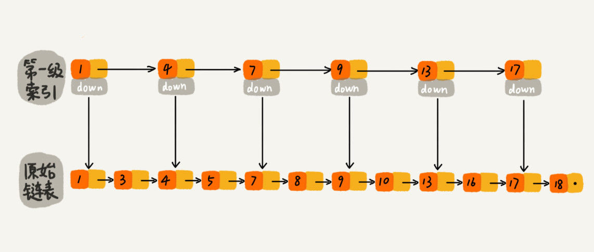

**链表加多级索引的结构，就是跳表**

n个节点的链表（每两个结点提取一个结点到上一级），查询时间复杂度分析

第一级索引的结点个数大约就是 n/2，第二级索引的结点个数大约就是 n/4，第三级索引的结点个数大约就是 n/8，依次类推，也就是说，第 k 级索引的结点个数是第 k-1 级索引的结点个数的 1/2，那第 k级索引结点的个数就是 n/($2^k$)。假设索引有 h 级，最高级的索引有 2 个结点。通过上面的公式，我们可以得到 n/(2h)=2，从而求得 h=log2n-1。如果包含原始链表这一层，整个跳表的高度就是 log2n。我们在跳表中查询某个数据的时候，如果每一层都要遍历 m 个结点，那在跳表中查询一个数据的时间复杂度就是 O(m*logn)。按照前面这种索引结构，我们每一级索引都最多只需要遍历 3 个结点，这跟上面抽象索引时有关，假设我们要查找的数据是 x，在第 k 级索引中，我们遍历到 y 结点之后，发现 x 大于 y，小于后面的结点 z，所以我们通过 y 的 down 指针，从第 k 级索引下降到第 k-1 级索引。在第 k-1 级索引中，y 和 z 之间只有 3 个结点（包含 y 和 z），所以，我们在 K-1 级索引中最多只需要遍历 3 个结点，依次类推，每一级索引都最多只需要遍历 3 个结点。如图：

通过上面的分析，我们得到 m=3，所以在跳表中查询任意数据的时间复杂度就是 O(logn)。这个查找的时间复杂度跟二分查找是一样的。 但是这种查询效率的提升，前提是建立了喝多级索引，也就是空间换时间的思路。其空间复杂度是O(n)。

跳表的查找时间复杂度是O(logN)，实际上，其动态插入、删除操作的时间复杂度也是O(logN)。在单链表中，一旦定位好要插入的位置，插入结点的时间复杂度是很低的，就是 O(1)。但是，这里为了保证原始链表中数据的有序性，我们需要先找到要插入的位置，这个查找操作就会比较耗时。对于纯粹的单链表，需要遍历每个结点，来找到插入的位置。但是，对于跳表来说，我们讲过查找某个结点的的时间复杂度是 O(logn)，所以这里查找某个数据应该插入的位置，方法也是类似的，时间复杂度也是 O(logn)。插入过程如图：

跳表删除：如果这个结点在索引中也有出现，我们除了要删除原始链表中的结点，还要删除索引中的。因为单链表中的删除操作需要拿到要删除结点的前驱结点，然后通过指针操作完成删除。所以在查找要删除的结点的时候，一定要获取前驱结点。当然，如果我们用的是双向链表，就不需要考虑这个问题了。

跳表索引动态更新：

当我们不停地往跳表中插入数据时，如果我们不更新索引，就有可能出现某 2 个索引结点之间数据非常多的情况。极端情况下，跳表还会退化成单链表。作为一种动态数据结构，我们需要某种手段来维护索引与原始链表大小之间的平衡，也就是说，如果链表中结点多了，索引结点就相应地增加一些，避免复杂度退化，以及查找、插入、删除操作性能下降。跳表通过随机函数来维护这种”平衡性“。我们通过一个随机函数，来决定将这个结点插入到哪几级索引中，比如随机函数生成了值 K，那我们就将这个结点添加到第一级到第 K 级这 K 级索引中。如图：

**Redis Sorted Set 跳表**

Redis 中的有序集合支持的核心操作主要有下面这几个：

- 插入一个数据；
- 删除一个数据；
- 查找一个数据；
- 按照区间查找数据（比如查找值在 [100, 356] 之间的数据）；
- 迭代输出有序序列。

其中，插入、删除、查找以及迭代输出有序序列这几个操作，红黑树也可以完成，时间复杂度跟跳表是一样的。但是，按照区间来查找数据这个操作，红黑树的效率没有跳表高。对于按照区间查找数据这个操作，跳表可以做到 O(logn) 的时间复杂度定位区间的起点，然后在原始链表中顺序往后遍历就可以了。这样做非常高效。当然，Redis 之所以用跳表来实现有序集合，还有其他原因，比如，跳表更容易代码实现。虽然跳表的实现也不简单，但比起红黑树来说还是好懂、好写多了，而简单就意味着可读性好，不容易出错。还有，跳表更加灵活，它可以通过改变索引构建策略，有效平衡执行效率和内存消耗。

---

### 散列表 Hash Table

散列表用的是数组支持按照下标随机访问数据的特性，所以散列表其实就是数组的一种扩展，由数组演化而来。可以说，如果没有数组，就没有散列表。散列表用的就是数组支持按照下标随机访问的时候，时间复杂度是 O(1) 的特性。我们通过散列函数把元素的键值映射为下标，然后将数据存储在数组中对应下标的位置。当我们按照键值查询元素时，我们用同样的散列函数，将键值转化数组下标，从对应的数组下标的位置取数据。

散列函数的要求：

- 散列函数计算得到的散列值是一个非负整数；
- 如果 key1 = key2，那 hash(key1) == hash(key2)；
- 如果 key1 ≠ key2，那 hash(key1) ≠ hash(key2)。

关于第三点，解决散列冲突的办法：

1、开放寻址法

开放寻址法的核心思想是，如果出现了散列冲突，我们就重新探测一个空闲位置，将其插入。关于如何探测新的位置，可以使用比较简单的探测方法----**线性探测**。当我们往散列表中插入数据时，如果某个数据经过散列函数散列之后，存储位置已经被占用了，我们就从当前位置开始，依次往后查找，看是否有空闲位置，直到找到为止。

在散列表中查找元素的过程有点儿类似插入过程。我们通过散列函数求出要查找元素的键值对应的散列值，然后比较数组中下标为散列值的元素和要查找的元素。如果相等，则说明就是我们要找的元素；否则就顺序往后依次查找。如果遍历到数组中的空闲位置，还没有找到，就说明要查找的元素并没有在散列表中。

对于线性探测法，当散列表中插入的数据越来越多时，散列冲突发生的可能性就会越来越大，空闲位置会越来越少，线性探测的时间就会越来越久。极端情况下，我们可能需要探测整个散列表，所以最坏情况下的时间复杂度为 O(n)。同理，在删除和查找时，也有可能会线性探测整张散列表，才能找到要查找或者删除的数据。

对于开放寻址冲突解决方法，除了线性探测方法之外，还有另外两种比较经典的探测方法，二次探测（Quadratic probing）和双重散列（Double hashing）。

所谓二次探测，跟线性探测很像，线性探测每次探测的步长是 1，那它探测的下标序列就是 hash(key)+0，hash(key)+1，hash(key)+2……而二次探测探测的步长就变成了原来的“二次方”，也就是说，它探测的下标序列就是 hash(key)+0，hash(key)+12，hash(key)+22……

所谓双重散列，意思就是不仅要使用一个散列函数。我们使用一组散列函数 hash1(key)，hash2(key)，hash3(key)……我们先用第一个散列函数，如果计算得到的存储位置已经被占用，再用第二个散列函数，依次类推，直到找到空闲的存储位置。

当散列表中空闲位置不多的时候，散列冲突的概率就会大大提高。为了尽可能保证散列表的操作效率，一般情况下，我们会尽可能保证散列表中有一定比例的空闲槽位。我们用装载因子（load factor）来表示空位的多少。其计算公式：`散列表的装载因子=填入表中的元素个数/散列表的长度。` 装载因子过大时，我们可以动态的扩容，利用均摊法分析时间复杂度，为O(1)。

2、链表法

当通过哈希函数获得相同的哈希值时，通过链表把值串起来，形成一个链表。

#### 如何避免低效扩容？

极端情况下，散列表扩容，然后重新对数据计算哈希值，把数据从原散列表搬移到新的散列表，会非常耗时。为了解决一次性扩容耗时过多的情况，我们可以将扩容操作穿插在插入操作的过程中，分批完成。当装载因子触达阈值之后，我们只申请新空间，但并不将老的数据搬移到新散列表中。当有新数据要插入时，我们将新数据插入新散列表中，并且从老的散列表中拿出一个数据放入到新散列表。每次插入一个数据到散列表，我们都重复上面的过程。经过多次插入操作之后，老的散列表中的数据就一点一点全部搬移到新散列表中了。这样没有了集中的一次性数据搬移，插入操作就都变得很快了。操作如图：

这期间的查询操作怎么来做呢？对于查询操作，为了兼容了新、老散列表中的数据，我们先从新散列表中查找，如果没有找到，再去老的散列表中查找。通过这样均摊的方法，将一次性扩容的代价，均摊到多次插入操作中，就避免了一次性扩容耗时过多的情况。这种实现方式，任何情况下，插入一个数据的时间复杂度都是 O(1)。

#### 冲突解决方法对比

- 优点：对开放寻址法来说，数据直接存储在数组中，能有效利用CPU缓存加快查询速度。这种方法实现的散列表，序列化起来比较简单。链表法包含指针，序列化起来没那么容易。	
- 缺点：用开放寻址法解决冲突的散列表，删除数据的时候比较麻烦，需要特殊标记已经删除掉的数据。开放寻址法中，由于所有数据在一个数组中，所以冲突的代价更高。所以开放寻址法解决冲突的散列表，装载因子的上限不能太大。所以也这种方法比较浪费内存空间。

**适用场景：当数据量比较小，装载因子小的时候，适合用开放寻址法。这也是Java ThreadLocalMap使用开放寻址法解决散列冲突的原因。**

2、链表法
链表法对内存的利用率比开放寻址法高。比起开放寻址法，对大装载因子的容忍度更高。开放寻址法只能适用装载因子小于1的情况，接近1时，可能就会有大量的散列冲突，导致大量的探测、再散列，性能会下降。对于链表法来说，只要散列函数的值随机均匀，即便装载因子变成10，也就是链表的长度变成了，查找效率会下降，但比顺序查找还是快很多。
但是因为链表要存储指针，所以对于小对象存储，比较耗内存，还有可能让内存的消耗翻倍。而且因为链表中的节点是零散分布的，不连续的，所以对CPU缓存不友好。可将链表法中的链表改为其他高效的动态数据结构，比如跳表、红黑树。即使出现散列冲突，极端情况下，所有数据散列到同一个桶，查找时间O（logN）。

**适用场景：基于链表的散列冲突处理方法比较适合存储大对象、大数据量的散列表，比起开放寻址法，更加灵活，支持更多的优化策略，比如用红黑树代替链表**

#### 散列表+链表应用

1、LRU缓存淘汰算法	通过链表实现LRU缓存淘汰算法时，维护一个按照访问时间从大到小有序排列的链表结构。因为缓存大小有限，当缓存空间不够，需要淘汰一个数据的时候，我们就直接将链表头部的结点删除。当要缓存某个数据的时候，先在链表中查找这个数据。如果没有找到，则直接将数据放到链表的尾部；如果找到了，我们就把它移动到链表的尾部。因为查找数据需要遍历链表，所以单纯用链表实现的 LRU 缓存淘汰算法的时间复杂很高，是 O(n)。对缓存系统的操作主要包含几个：

- 往缓存中添加一个数据；
- 从缓存中删除一个数据；
- 在缓存中查找一个数据。

如果单纯地采用链表的话，时间复杂度只能是 O(n)。如果我们将散列表和链表两种数据结构组合使用，可以将这三个操作的时间复杂度都降低到 O(1)。具体结构如下：

我们使用双向链表存储数据，链表中的每个结点处理存储数据（data）、前驱指针（prev）、后继指针（next）之外，还新增了一个特殊的字段 hnext。一个链是刚刚我们提到的双向链表，另一个链是散列表中的拉链。前驱和后继指针是为了将结点串在双向链表中，hnext 指针是为了将结点串在散列表的拉链中。

我们再来看，前面讲到的缓存的三个操作，是如何做到时间复杂度是 O(1) 的？

首先，我们来看如何查找一个数据。我们前面讲过，散列表中查找数据的时间复杂度接近 O(1)，所以通过散列表，我们可以很快地在缓存中找到一个数据。当找到数据之后，我们还需要将它移动到双向链表的尾部。

其次，我们来看如何删除一个数据。我们需要找到数据所在的结点，然后将结点删除。借助散列表，我们可以在 O(1) 时间复杂度里找到要删除的结点。因为我们的链表是双向链表，双向链表可以通过前驱指针 O(1) 时间复杂度获取前驱结点，所以在双向链表中，删除结点只需要 O(1) 的时间复杂度。

最后，我们来看如何添加一个数据。添加数据到缓存稍微有点麻烦，我们需要先看这个数据是否已经在缓存中。如果已经在其中，需要将其移动到双向链表的尾部；如果不在其中，还要看缓存有没有满。如果满了，则将双向链表头部的结点删除，然后再将数据放到链表的尾部；如果没有满，就直接将数据放到链表的尾部。

这整个过程涉及的查找操作都可以通过散列表来完成。其他的操作，比如删除头结点、链表尾部插入数据等，都可以在 O(1) 的时间复杂度内完成。所以，这三个操作的时间复杂度都是 O(1)。至此，我们就通过散列表和双向链表的组合使用，实现了一个高效的、支持 LRU 缓存淘汰算法的缓存系统原型。

2、Redis有序集合

实际上，在有序集合中，每个成员对象有两个重要的属性，key（键值）和 score（分值）。我们不仅会通过 score 来查找数据，还会通过 key 来查找数据。

Redis有序集合的操作，包含：

- 添加一个成员对象；
- 按照键值来删除一个成员对象；
- 按照键值来查找一个成员对象；
- 按照分值区间查找数据，比如查找积分在 [100, 356] 之间的成员对象；
- 按照分值从小到大排序成员变量；

其实有序集合单独使用字典或跳跃表其中一种数据结构都可以实现，但是这里使用两种数据结构组合起来，原因是假如我们单独使用 字典，虽然能以 O(1) 的时间复杂度查找成员的分值，但是因为字典是以无序的方式来保存集合元素，所以每次进行范围操作的时候都要进行排序；假如我们单独使用跳跃表来实现，虽然能执行范围操作，但是查找操作有 O(1)的复杂度变为了O(logN)。因此Redis使用了两种数据结构来共同实现有序集合。

3、Java LinkedHashMap

LinkedHashMap 是通过双向链表和散列表这两种数据结构组合实现的。LinkedHashMap 中的“Linked”实际上是指的是双向链表，并非指用链表法解决散列冲突。

~~~java
HashMap<Integer, Integer> m = new LinkedHashMap<>();
m.put(3, 11);
m.put(1, 12);
m.put(5, 23);
m.put(2, 22);

for (Map.Entry e : m.entrySet()) {
  System.out.println(e.getKey());
}//3,1,5,2 按照插入顺序遍历数据
~~~

每次调用 put() 函数，往 LinkedHashMap 中添加数据的时候，都会将数据添加到链表的尾部，所以，在前四个操作完成之后，链表中的数据是下面这样：

~~~java
// 10是初始大小，0.75是装载因子，true是表示按照访问时间排序
HashMap<Integer, Integer> m = new LinkedHashMap<>(10, 0.75f, true);
m.put(3, 11);
m.put(1, 12);
m.put(5, 23);
m.put(2, 22);

m.put(3, 26);
m.get(5);

for (Map.Entry e : m.entrySet()) {
  System.out.println(e.getKey());
}//1,2,3,5
~~~

前4行put完之后，再次将键值为 3 的数据放入到 LinkedHashMap 的时候，会先查找这个键值是否已经有了，然后，再将已经存在的 (3,11) 删除，并且将新的 (3,26) 放到链表的尾部。此时变成这样了：

当访问到 key 为 5 的数据的时候，我们将被访问到的数据移动到链表的尾部。所以，get(5)之后，链表中的数据是下面这样：

所以最后输出1，2，3，5，其实现原理跟上边提到的LRU缓存淘汰策略的缓存系统一样。

---

### 哈希算法

将任意长度的二进制值串映射为固定长度的二进制值串，这个映射的规则叫 **哈希算法**，通过原始数据映射之后得到的二进制值串就是 **哈希值**。优秀哈希算法满足的要求：

- 从哈希值不能反向推导出原始数据(所以哈希算法也叫单向哈希算法)

- 对输入数据非常敏感，哪怕原始数据只修改了一个Bit，最后得到的哈希值也大不相同

- 散列冲突的概率要很小，对于不同的原始数据，哈希值相同的概率非常小

- 哈希算法的执行效率要尽量高效，针对较长的文本，也能快速的计算出哈希值。

  

#### 哈希算法的应用：

- 安全加密 常用于加密的哈希算法：**MD5**、**SHA** 对用于加密的哈希算法来说，有两点格外重要。第一点是很难根据哈希值反向推导出原始数据，第二点是散列冲突的概率要很小。
- 数据校验   BT 下载的原理是基于 P2P 协议的。我们从多个机器上并行下载一个 2GB 的电影，这个电影文件可能会被分割成很多文件块（比如可以分成 100 块，每块大约 20MB）。等所有的文件块都下载完成之后，再组装成一个完整的电影文件就行了。我们通过哈希算法，对 100 个文件块分别取哈希值，并且保存在种子文件中。我们在前面讲过，哈希算法有一个特点，对数据很敏感。只要文件块的内容有一丁点儿的改变，最后计算出的哈希值就会完全不同。所以，当文件块下载完成之后，我们可以通过相同的哈希算法，对下载好的文件块逐一求哈希值，然后跟种子文件中保存的哈希值比对。如果不同，说明这个文件块不完整或者被篡改了，需要再重新从其他宿主机器上下载这个文件块。
- 唯一标识 我先来举一个例子。如果要在海量的图库中，搜索一张图是否存在，我们不能单纯地用图片的元信息（比如图片名称）来比对，因为有可能存在名称相同但图片内容不同，或者名称不同图片内容相同的情况。我们可以给每一个图片取一个唯一标识，或者说信息摘要。比如，我们可以从图片的二进制码串开头取 100 个字节，从中间取 100 个字节，从最后再取 100 个字节，然后将这 300 个字节放到一块，通过哈希算法（比如 MD5），得到一个哈希字符串，用它作为图片的唯一标识。通过这个唯一标识来判定图片是否在图库中，这样就可以减少很多工作量。如果还想继续提高效率，我们可以把每个图片的唯一标识，和相应的图片文件在图库中的路径信息，都存储在散列表中。当要查看某个图片是不是在图库中的时候，我们先通过哈希算法对这个图片取唯一标识，然后在散列表中查找是否存在这个唯一标识。    
- 散列函数 散列函数也是哈希算法的一种应用。散列函数对于散列算法计算得到的值，是否能反向解密也并不关心。散列函数中用到的散列算法，更加关注散列后的值是否能平均分布，也就是，一组数据是否能均匀地散列在各个槽中。除此之外，散列函数执行的快慢，也会影响散列表的性能，所以，散列函数用的散列算法一般都比较简单，比较追求效率。
- 负载均衡  我们可以通过哈希算法，对客户端 IP 地址或者会话 ID 计算哈希值，将取得的哈希值与服务器列表的大小进行取模运算，最终得到的值就是应该被路由到的服务器编号。 这样，我们就可以把同一个 IP 过来的所有请求，都路由到同一个后端服务器上。
- 数据分片 
  	1. **如何统计“搜索关键词”出现的次数？**假如我们有 1T 的日志文件，这里面记录了用户的搜索关键词，我们想要快速统计出每个关键词被搜索的次数。我们可以先对数据进行分片，然后采用多台机器处理的方法，来提高处理速度。具体的思路是这样的：为了提高处理的速度，我们用 n 台机器并行处理。我们从搜索记录的日志文件中，依次读出每个搜索关键词，并且通过哈希函数计算哈希值，然后再跟 n 取模，最终得到的值，就是应该被分配到的机器编号。这样，哈希值相同的搜索关键词就被分配到了同一个机器上。也就是说，同一个搜索关键词会被分配到同一个机器上。每个机器会分别计算关键词出现的次数，最后合并起来就是最终的结果。实际上，这里的处理过程也是 MapReduce 的基本设计思想。
   	2. **如何快速判断图片是否在图库中？**假设现在我们的图库中有 1 亿张图片，很显然，在单台机器上构建散列表是行不通的。因为单台机器的内存有限，而 1 亿张图片构建散列表显然远远超过了单台机器的内存上限。我们同样可以对数据进行分片，然后采用多机处理。我们准备 n 台机器，让每台机器只维护某一部分图片对应的散列表。我们每次从图库中读取一个图片，计算唯一标识，然后与机器个数 n 求余取模，得到的值就对应要分配的机器编号，然后将这个图片的唯一标识和图片路径发往对应的机器构建散列表。当我们要判断一个图片是否在图库中的时候，我们通过同样的哈希算法，计算这个图片的唯一标识，然后与机器个数 n 求余取模。假设得到的值是 k，那就去编号 k 的机器构建的散列表中查找。
- 分布式存储  一致性哈希的应用，假设我们有 k 个机器，数据的哈希值的范围是 [0, MAX]。我们将整个范围划分成 m 个小区间（m 远大于 k），每个机器负责 m/k 个小区间。当有新机器加入的时候，我们就将某几个小区间的数据，从原来的机器中搬移到新的机器中。这样，既不用全部重新哈希、搬移数据，也保持了各个机器上数据数量的均衡。一致性哈希算法的基本思想就是这么简单。

---

### 树

关于"树"的概念，高度、深度、层
节点的高度 = 节点到叶子节点的最长路径（边数）
节点的深度 = 根节点到这个节点所经历的边的个数
节点的层数 = 节点的深度 + 1
树的高度 = 根节点的高度

我们把没有子节点的节点叫作叶子节点或者叶节点

#### 二叉树

每个结点最多有两个子树的树结构，常被用于实现二叉查找树和二叉堆。

下图都为二叉树：

- **满二叉树** 深度为K(从1开始)，且有2^K-1个节点的二叉树，叫满二叉树。这种树的特点是每一层上的节点数都是最大节点数。也可以这么说：叶子节点全都在最底层，除了叶子节点之外，每个节点都有左右两个子节点，这种二叉树就叫作满二叉树。编号 2 的二叉树
- **完全二叉树** 若设二叉树的高度为h，除第 h 层外，其它各层 (1～h-1) 的结点数都达到最大个数，第h层有叶子结点，并且叶子结点都是从左到右依次排布，这就是完全二叉树。具有n个节点的完全二叉树深度为floor（log2n）+1。深度为k的完全二叉树，最少的节点2^(k-1)个叶子节点，最多2^k - 1个节点。编号 3 的二叉树中，叶子节点都在最底下两层，最后一层的叶子节点都靠左排列，并且除了最后一层，其他层的节点个数都要达到最大，这种二叉树叫作完全二叉树。

#### 二叉树的存储：基于指针或者引用的二叉链式存储和基于数组的顺序存储

##### 链式存储：

每个节点有三个字段，其中一个存储数据，另外两个是指向左右子节点的指针。我们只要拎住根节点，就可以通过左右子节点的指针，把整棵树都串起来。这种存储方式我们比较常用。大部分二叉树代码都是通过这种结构来实现的。如图：

基于数组的**顺序存储法**

如果节点 X 存储在数组中下标为 i 的位置，下标为 2 * i 的位置存储的就是左子节点，下标为 2 * i + 1 的位置存储的就是右子节点。反过来，下标为 i/2 的位置存储就是它的父节点。通过这种方式，我们只要知道根节点存储的位置（一般情况下，为了方便计算子节点，根节点会存储在下标为 1 的位置），这样就可以通过下标计算，把整棵树都串起来。如图：

刚存储的是一棵完全二叉树，所以仅仅浪费了一个下标为0的存储位置。如果是非完全二叉树，会浪费比较多的数组存储空间。如下图：

如果某棵二叉树是一棵完全二叉树，那用数组存储无疑是最节省内存的一种方式。因为数组的存储方式并不需要像链式存储法那样，要存储额外的左右子节点的指针。这也是为什么完全二叉树会单独拎出来的原因，也是为什么完全二叉树要求最后一层的子节点都靠左的原因。

#### 二叉树的遍历

**DFS 深度优先搜索**： 前序遍历、中序遍历、后续遍历

二叉树的前、中、后序遍历就是一个递归的过程。比如，前序遍历，其实就是先打印根节点，然后再递归地打印左子树，最后递归地打印右子树。

 **BFS 广度优先搜索** 我们按照高度顺序一层一层的访问整棵树，高层次的节点将会比低层次的节点先被访问到。

#### 二叉查找树：

也叫二叉搜索树，**在树中的任意一个节点，其左子树中的每个节点的值，都要小于这个节点的值，而右子树节点的值都大于这个节点的值**。如下图，支持快速插入、删除、查找操作，各个操作的时间复杂度跟树的高度成正比，理想情况下，时间复杂度是O（logN）

##### 二叉查找树的查找：

首先，我们看如何在二叉查找树中查找一个节点。我们先取根节点，如果它等于我们要查找的数据，那就返回。如果要查找的数据比根节点的值小，那就在左子树中递归查找；如果要查找的数据比根节点的值大，那就在右子树中递归查找。

~~~java
public class BinarySearchTree {
  private Node tree;

  public Node find(int data) {
    Node p = tree;
    while (p != null) {
      if (data < p.data) p = p.left;
      else if (data > p.data) p = p.right;
      else return p;
    }
    return null;
  }

  public static class Node {
    private int data;
    private Node left;
    private Node right;

    public Node(int data) {
      this.data = data;
    }
  }
}
~~~

##### 二叉查找树的插入：

二叉查找树的插入过程有点类似查找操作。新插入的数据一般都是在叶子节点上，所以我们只需要从根节点开始，依次比较要插入的数据和节点的大小关系。如果要插入的数据比节点的数据大，并且节点的右子树为空，就将新数据直接插到右子节点的位置；如果不为空，就再递归遍历右子树，查找插入位置。同理，如果要插入的数据比节点数值小，并且节点的左子树为空，就将新数据插入到左子节点的位置；如果不为空，就再递归遍历左子树，查找插入位置。

~~~java
public void insert(int data) {
  if (tree == null) {
    tree = new Node(data);
    return;
  }

  Node p = tree;
  while (p != null) {
    if (data > p.data) {
      if (p.right == null) {
        p.right = new Node(data);
        return;
      }
      p = p.right;
    } else { // data < p.data
      if (p.left == null) {
        p.left = new Node(data);
        return;
      }
      p = p.left;
    }
  }
}
~~~

##### 二叉查找树的删除

针对要删除节点的子节点个数的不同，我们需要分三种情况来处理：

1. 如果要删除的节点没有子节点，我们只需要直接将父节点中，指向要删除节点的指针置为 null。比如图中的删除节点 55。
2. 如果要删除的节点只有一个子节点（只有左子节点或者右子节点），我们只需要更新父节点中，指向要删除节点的指针，让它指向要删除节点的子节点就可以了。比如图中的删除节点 13。
3. 如果要删除的节点有两个子节点，这就比较复杂了。我们需要找到这个节点的右子树中的最小节点，把它替换到要删除的节点上。然后再删除掉这个最小节点，因为最小节点肯定没有左子节点（如果有左子结点，那就不是最小节点了），所以，我们可以应用上面两条规则来删除这个最小节点。比如图中的删除节点 18。

~~~java
public void delete(int data) {
  Node p = tree; // p指向要删除的节点，初始化指向根节点
  Node pp = null; // pp记录的是p的父节点
  while (p != null && p.data != data) {
    pp = p;
    if (data > p.data) p = p.right;
    else p = p.left;
  }
  if (p == null) return; // 没有找到

  // 要删除的节点有两个子节点
  if (p.left != null && p.right != null) { // 查找右子树中最小节点
    Node minP = p.right;
    Node minPP = p; // minPP表示minP的父节点
    while (minP.left != null) {
      minPP = minP;
      minP = minP.left;
    }
    p.data = minP.data; // 将minP的数据替换到p中
    p = minP; // 下面就变成了删除minP了
    pp = minPP;
  }

  // 删除节点是叶子节点或者仅有一个子节点
  Node child; // p的子节点
  if (p.left != null) child = p.left;
  else if (p.right != null) child = p.right;
  else child = null;

  if (pp == null) tree = child; // 删除的是根节点
  else if (pp.left == p) pp.left = child;
  else pp.right = child;
}
~~~

实际上，关于二叉查找树的删除操作，还有个非常简单、取巧的方法，就是单纯将要删除的节点标记为“已删除”，但是并不真正从树中将这个节点去掉。这样原本删除的节点还需要存储在内存中，比较浪费内存空间，但是删除操作就变得简单了很多。而且，这种处理方法也并没有增加插入、查找操作代码实现的难度。

除了插入、删除、查找操作之外，二叉查找树中还可以支持快速地查找最大节点和最小节点、前驱节点和后继节点。**二叉查找树除了支持上面几个操作之外，还有一个重要的特性，就是中序遍历二叉查找树，可以输出有序的数据序列，时间复杂度是 O(n)，非常高效。因此，二叉查找树也叫作二叉排序树。**

散列表的插入、删除、查找操作的时间复杂度可以做到常量级的 O(1)，非常高效。而二叉查找树在比较平衡的情况下，插入、删除、查找操作时间复杂度才是 O(logn)，使用二叉查找树的原因：

第一，散列表中的数据是无序存储的，如果要输出有序的数据，需要先进行排序。而对于二叉查找树来说，我们只需要中序遍历，就可以在 O(n) 的时间复杂度内，输出有序的数据序列。

第二，散列表扩容耗时很多，而且当遇到散列冲突时，性能不稳定，尽管二叉查找树的性能不稳定，但是在工程中，我们最常用的平衡二叉查找树的性能非常稳定，时间复杂度稳定在 O(logn)。

第三，笼统地来说，尽管散列表的查找等操作的时间复杂度是常量级的，但因为哈希冲突的存在，这个常量不一定比 logn 小，所以实际的查找速度可能不一定比 O(logn) 快。加上哈希函数的耗时，也不一定就比平衡二叉查找树的效率高。

第四，散列表的构造比二叉查找树要复杂，需要考虑的东西很多。比如散列函数的设计、冲突解决办法、扩容、缩容等。平衡二叉查找树只需要考虑平衡性这一个问题，而且这个问题的解决方案比较成熟、固定。

最后，为了避免过多的散列冲突，散列表装载因子不能太大，特别是基于开放寻址法解决冲突的散列表，不然会浪费一定的存储空间。

#### 平衡二叉树：

二叉树中任意一个节点的左右子树的高度相差不能大于1。
平衡二叉查找树中"平衡"的意思，是让整棵树左右看起来比较"对称"，比较"平衡"，不要出现左子树很高、右子树很矮的情况。这样就能让整棵树的高度相对来说低一些，相应的插入、删除、查找等操作的效率高一些。

所以，如果我们现在设计一个新的平衡二叉查找树，只要树的高度不比 log2n 大很多（比如树的高度仍然是对数量级的），尽管它不符合我们前面讲的严格的平衡二叉查找树的定义，但我们仍然可以说，这是一个合格的平衡二叉查找树。

平衡二叉查找树其实有很多，比如，**Splay Tree（伸展树）、Treap（树堆）**等，但是我们提到平衡二叉查找树，听到的基本都是**红黑树**。它的出镜率甚至要高于“平衡二叉查找树”这几个字，有时候，我们甚至默认平衡二叉查找树就是红黑树，那我们现在就来看看红黑树。

红黑树是一种不严格的平衡二叉查找树，它的定义不符合平衡二叉查找树的定义。我们来看看红黑树的定义：红黑树中的节点，一类被标记为黑色，一类被标记为红色。除此之外，一棵红黑树还需要满足这样几个要求：

- 根节点是黑色的；
- 每个叶子节点都是黑色的空节点（NIL），也就是说，叶子节点不存储数据；
- 任何相邻的节点都不能同时为红色，也就是说，红色节点是被黑色节点隔开的；
- 每个节点，从该节点到达其可达叶子节点的所有路径，都包含相同数目的黑色节点；

下图是严格意义的红黑树：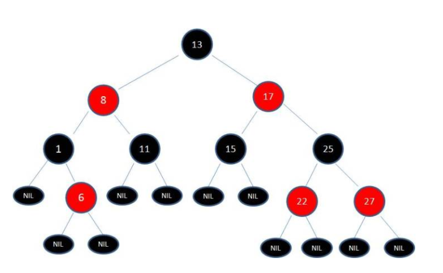

红黑树是一种平衡二叉查找树。它是为了解决普通二叉查找树在数据更新的过程中，复杂度退化的问题而产生的。红黑树的高度近似 log2n，所以它是近似平衡，插入、删除、查找操作的时间复杂度都是 O(logn)。因为红黑树是一种性能非常稳定的二叉查找树，所以，在工程中，但凡是用到动态插入、删除、查找数据的场景，都可以用到它。不过，它实现起来比较复杂，如果自己写代码实现，难度会有些高，这个时候，我们其实更倾向用跳表来替代它。

#### 红黑树的基本操作：旋转与反色

旋转：逆时针旋转称为左旋，顺时针旋转称为右旋。红黑树的旋转操作是为了在保证二叉搜索树和红黑树的性质的前提下，来转换红链接的位置。

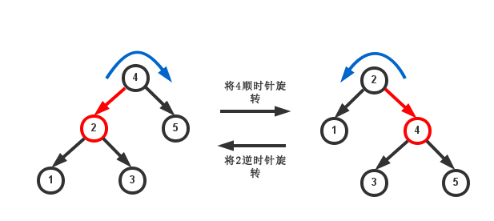

可以看出顺时针旋转就是将节点的左儿子提上来，将自己变做它的右儿子，将左儿子的右子树接到自己的左子树中，同时转变红链接。可以将其想象成把`4->2`这条边顺时针旋转了一下。逆时针旋转也是类似的做法。同时顺时针旋转和逆时针旋转可以视为一对逆操作，因为一次左旋和一次右旋可以变回原来的样子。

~~~python
# 顺时针旋转
def cw_rotate(h):
    assert h is not None and h.left is red  # h是非空节点并且左儿子为红色

    x = h.left
    h.left = x.right
    x.right = h
    x.color = h.color
    h.color = red

    return x  # 返回被提上来的左儿子

# 逆时针旋转
def ccw_rotate(h):
    assert h is not None and h.right is red  # h是非空节点并且左儿子为红色

    x = h.right
    h.right = x.left
    x.left = h
    x.color = h.color
    h.color = red

    return x  # 返回被提上来的左儿子

h = cw_rotate(h)  # 将h顺时针旋转
~~~

反色：如同在2-3树中一样，红黑树要能够处理4-节点。对于4-节点，我们只有两种操作：合成一个4-节点和分解一个4-节点。

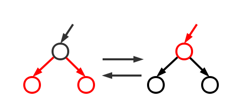

对照一下2-3树，这个操作就显而易见了。

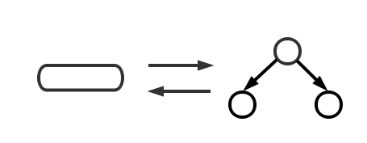

反色操作会将两个儿子的父节点变为红色，是因为在2-3树中，中间取出来的键要向上传递并结合进去。此外，反色操作会导致出现右边的红链接，然而这没有关系，因为4-节点是临时的，我们最终会通过逆时针旋转将其变为左边的红链接或者再次反色将这个4-节点分解。

~~~python
def flip_color(h):
    assert h.color is different from h.children.color  # h的颜色和它的儿子相反

    h.color = (h.color == RED ? BLACK : RED)
    h.left.color = (h.left.color == RED ? BLACK : RED)
    h.right.color = (h.right.color == RED ? BLACK : RED)

    return h

h = flip_color(h)  # 将h反色
~~~

详细可见此处：https://riteme.site/blog/2016-3-12/2-3-tree-and-red-black-tree.html

#### 支持动态查找的数据结构对比：

散列表：插入删除查找都是O(1), 是最常用的，但其缺点是不能顺序遍历以及扩容缩容的性能损耗。适用于那些不需要顺序遍历，数据更新不那么频繁的。

跳表：插入删除查找都是O(logn), 并且能顺序遍历。缺点是空间复杂度O(n)。适用于不那么在意内存空间的，其顺序遍历和区间查找非常方便。

红黑树：插入删除查找都是O(logn), 中序遍历即是顺序遍历，稳定。缺点是难以实现，去查找不方便。其实跳表更佳，但红黑树已经用于很多地方了。

这里的动态数据结构是指支持动态的更新操作，里面存储的数据是时刻在变化的，通俗一点讲，它不仅仅支持查询，还支持删除、插入数据。而且，这些操作都非常高效。如果不高效，也就算不上是有效的动态数据结构了。所以，这里的红黑树算一个，支持动态的插入、删除、查找，而且效率都很高。链表、队列、栈实际上算不上，因为操作非常有限，查询效率不高。

##### 红黑树由2-3树的演变

红黑树的起源，自然是二叉查找树了，这种树结构从根节点开始，左子节点小于它，右子节点大于它。每个节点都符合这个特性，所以易于查找，是一种很好的数据结构。但是它有一个问题，就是容易偏向某一侧，这样就像一个链表结构了，失去了树结构的优点，查找时间会变坏。所以我们都希望树结构都是矮矮胖胖的，像这样：

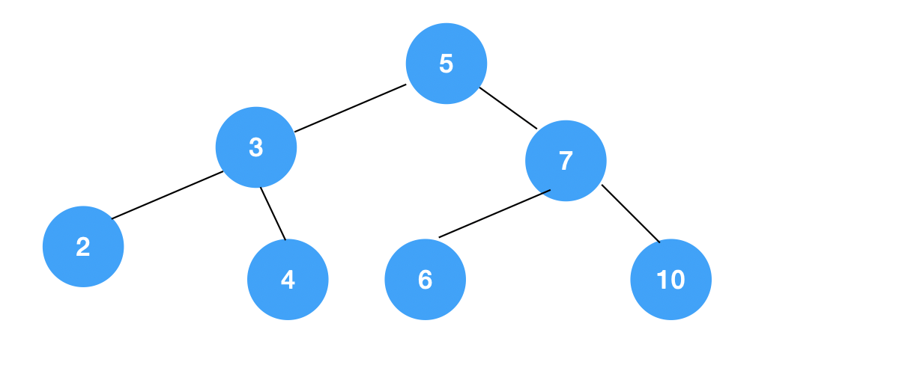

而不是像这样：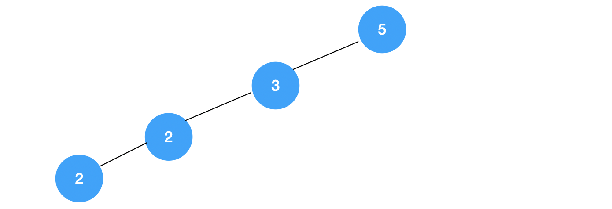

在这种需求下，平衡树的概念就应运而生了。红黑树就是一种平衡树，它可以保证二叉树基本符合矮矮胖胖的结构，但是理解红黑树之前，必须先了解另一种树，叫2-3树，红黑树背后的逻辑就是它。2-3树是二叉查找树的变种，树中的2和3代表两种节点，以下表示为2-节点和3-节点。2-节点即普通节点：包含一个元素，两条子链接。3-节点则是扩充版，包含2个元素和三条链接：两个元素A、B，左边的链接指向小于A的节点，中间的链接指向介于A、B值之间的节点，右边的链接指向大于B的节点。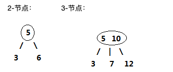

红黑树是一种平衡二叉树，只有一种节点。这种节点有两个儿子，和2-3树中的2-节点对应。如何表示3-节点呢？我们尝试一种特殊的边：默认情况下节点的颜色均为黑色。我们将某个节点染为红色，表示它和父亲的的链接是红色的，就像下图：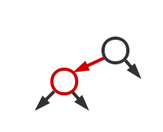

当我们将红链接画平,我们发现它和2-3树中的3-节点极为类似！事实上，我们完全可以用这样的方式来表示2-3树中的3-节点。下图是一棵典型的红黑树：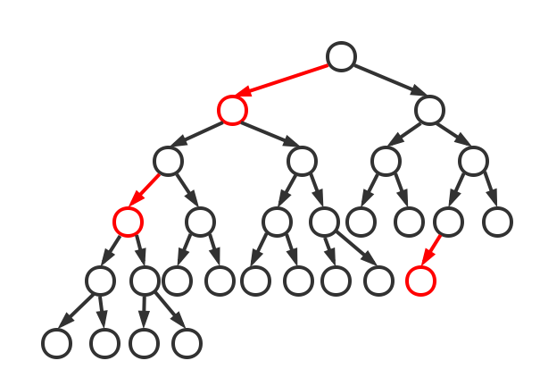

如果将红链接画平，将得到一棵完美平衡的“2-3树”：

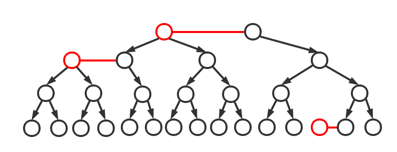

从某种意义上来说，红黑树和2-3树是一种等同。由于红黑树是二叉搜索树，因此查询操作就是二叉搜索树的查询操作。时间复杂度为`logN`。

#### B树和B+树的区别

- B+ 树中的节点不存储数据，只是索引，而 B 树中的节点存储数据，所以对于B+树来说，磁盘页能容纳更多节点元素，更“矮胖”；
- b+树查询必须查找到叶子节点，b树只要匹配到即可不用管元素位置，因此b+树查找更稳定
- B 树中的叶子节点并不需要链表来串联，对于范围查找来说，b+树只需遍历叶子节点链表即可，b树却需要重复地中序遍历

### 堆排序和快速排序的对比

堆排序是一种原地的、时间复杂度为 *O*(*n*log*n*) 的排序算法。前面我们学过快速排序，平均情况下，它的时间复杂度为 *O*(*n*log*n*)。尽管这两种排序算法的时间复杂度都是 *O*(*n*log*n*)，甚至堆排序比快速排序的时间复杂度还要稳定，但是，**在实际的软件开发中，快速排序的性能要比堆排序好，**。

堆是一种特殊的树，只要满足两点，它就是一个堆：

- 堆是一个完全二叉树；
- 堆中每一个节点的值都必须大于等于（或小于等于）其子树中每个节点的值。

#### 堆的操作以及存储

我们之前说过，完全二叉树比较适合用数组来存储。用数组来存储完全二叉树是非常节省存储空间的。因为我们不需要存储左右子节点的指针，单纯地通过数组的下标，就可以找到一个节点的左右子节点和父节点。下边是数组存储堆:

从图中我们可以看到，数组中下标为 *i* 的节点的左子节点，就是下标为 *i*∗2 的节点，右子节点就是下标为 *i*∗2+1 的节点，父节点就是下标为 2*i* 的节点。

堆的核心操作，包括**插入一个元素和删除堆顶元素**。

##### 堆中插入元素

往堆中插入一个元素后，我们需要继续满足堆的两个特性。如果我们把新插入的元素放到堆的最后，你可以看我画的这个图，是不是不符合堆的特性了？于是，我们就需要进行调整，让其重新满足堆的特性，这个过程我们起了一个名字，就叫作**堆化**（heapify）。堆化实际上有两种，从下往上和从上往下。这里我先讲**从下往上**的堆化方法。

堆化就是顺着节点所在的路径，向上或者向下，对比，然后交换。

我这里画了一张堆化的过程分解图。我们可以让新插入的节点与父节点对比大小。如果不满足子节点小于等于父节点的大小关系，我们就互换两个节点。一直重复这个过程，直到父子节点之间满足刚说的那种大小关系。

堆中插入数据的过程，Java代码：

~~~java
public class Heap {
  private int[] a; // 数组，从下标1开始存储数据
  private int n;  // 堆可以存储的最大数据个数
  private int count; // 堆中已经存储的数据个数
  public Heap(int capacity) {
    a = new int[capacity + 1];
    n = capacity;
    count = 0;
  }
  public void insert(int data) {
    if (count >= n) return; // 堆满了
    ++count;
    a[count] = data;
    int i = count;
    while (i/2 > 0 && a[i] > a[i/2]) { // 自下往上堆化
      swap(a, i, i/2); // swap()函数作用：交换下标为i和i/2的两个元素
      i = i/2;
    }
  }
 }
~~~

##### 删除堆顶元素

从堆的定义的第二条中，任何节点的值都大于等于（或小于等于）子树节点的值，我们可以发现，堆顶元素存储的就是堆中数据的最大值或者最小值。假设我们构造的是大顶堆，堆顶元素就是最大的元素。当我们删除堆顶元素之后，就需要把第二大的元素放到堆顶，那第二大元素肯定会出现在左右子节点中。然后我们再迭代地删除第二大节点，以此类推，直到叶子节点被删除。通过这种方法堆化出来的树，并不满足完全二叉树的特性（会产生数组空洞）。

为了解决这个问题，我们从下往上进行堆化。我们把最后一个节点放到堆顶，然后利用同样的父子节点对比方法。对于不满足父子节点大小关系的，互换两个节点，并且重复进行这个过程，直到父子节点之间满足大小关系为止。因为我们移除的是数组中的最后一个元素，而在堆化的过程中，都是交换操作，不会出现数组中的“空洞”，所以这种方法堆化之后的结果，肯定满足完全二叉树的特性。

java代码：

~~~java
public void removeMax() {
  if (count == 0) return -1; // 堆中没有数据
  a[1] = a[count];
  --count;
  heapify(a, count, 1);
}
private void heapify(int[] a, int n, int i) { // 自上往下堆化
  while (true) {
    int maxPos = i;
    if (i*2 <= n && a[i] < a[i*2]) maxPos = i*2;
    if (i*2+1 <= n && a[maxPos] < a[i*2+1]) maxPos = i*2+1;
    if (maxPos == i) break;
    swap(a, i, maxPos);
    i = maxPos;
  }
}
~~~

我们知道，一个包含 *n* 个节点的完全二叉树，树的高度不会超过 log2*n*。堆化的过程是顺着节点所在路径比较交换的，所以堆化的时间复杂度跟树的高度成正比，也就是 *O*(log*n*)。插入数据和删除堆顶元素的主要逻辑就是堆化，所以，往堆中插入一个元素和删除堆顶元素的时间复杂度都是 *O*(log*n*)。

#### 基于堆实现排序

我们之前复习过的排序算法，有时间复杂度是 *O*(*n*2) 的冒泡排序、插入排序、选择排序，有时间复杂度是 *O*(*n*log*n*) 的归并排序、快速排序，还有线性排序。这里我们借助于堆这种数据结构实现的排序算法，就叫作堆排序。这种排序方法的时间复杂度非常稳定，是 *O*(*n*log*n*)，并且它还是原地排序算法。我们可以把堆排序的过程大致分解成两个大的步骤，**建堆**和**排序**。

##### 建堆

我们首先将数组原地建成一个堆。所谓“原地”就是，不借助另一个数组，就在原数组上操作。建堆的过程，有两种思路。

第一种是借助我们前面讲的，在堆中插入一个元素的思路。尽管数组中包含 *n* 个数据，但是我们可以假设，起初堆中只包含一个数据，就是下标为 1 的数据。然后，我们调用前面讲的插入操作，将下标从 2 到 *n* 的数据依次插入到堆中。这样我们就将包含 *n* 个数据的数组，组织成了堆。

第二种实现思路，跟第一种截然相反，也是我这里要详细讲的。第一种建堆思路的处理过程是从前往后处理数组数据，并且每个数据插入堆中时，都是从下往上堆化。而第二种实现思路，是从后往前处理数组，并且每个数据都是从上往下堆化。java代码如下：

~~~java
private static void buildHeap(int[] a, int n) {
  for (int i = n/2; i >= 1; --i) {
    heapify(a, n, i);
  }
}
private static void heapify(int[] a, int n, int i) {
  while (true) {
    int maxPos = i;
    if (i*2 <= n && a[i] < a[i*2]) maxPos = i*2;
    if (i*2+1 <= n && a[maxPos] < a[i*2+1]) maxPos = i*2+1;
    if (maxPos == i) break;
    swap(a, i, maxPos);
    i = maxPos;
  }
}
~~~

**在这段代码中，我们对下标从 2*n* 开始到 1 的数据进行堆化，下标是 2*n*+1 到 *n* 的节点是叶子节点，我们不需要堆化。实际上，对于完全二叉树来说，下标从 2*n*+1 到 *n* 的节点都是叶子节点。**

下面我们来看看建堆操作的时间复杂度：

每个节点堆化的时间复杂度是 *O*(log*n*)，那 2*n*+1 个节点堆化的总时间复杂度是不是就是 *O*(*n*log*n*) 呢？这个答案虽然也没错，但是这个值还是不够精确。实际上，堆排序的建堆过程的时间复杂度是 *O*(*n*)。

因为叶子节点不需要堆化，所以需要堆化的节点从倒数第二层开始。每个节点堆化的过程中，需要比较和交换的节点个数，跟这个节点的高度 *k* 成正比。我们把每一层的节点个数和对应的高度画了出来，你可以看看。我们只需要将每个节点的高度求和，得出的就是建堆的时间复杂度。

我们将每个非叶子节点的高度求和，就是下面这个公式：

这个公式的求解稍微有点技巧，不过我们高中应该都学过：把公式左右都乘以 2，就得到另一个公式 *S*2。我们将 *S*2 错位对齐，并且用 *S*2 减去 *S*1，可以得到 *S*。

*S* 的中间部分是一个等比数列，所以最后可以用等比数列的求和公式来计算，最终的结果就是下面图中画的这个样子。

因为 *h*=log2*n*，代入公式 *S*，就能得到 *S*=*O*(*n*)，所以，建堆的时间复杂度就是 *O*(*n*)。

##### 堆排序

建堆结束之后，数组中的数据已经是按照大顶堆的特性来组织的。数组中的第一个元素就是堆顶，也就是最大的元素。我们把它跟最后一个元素交换，那最大元素就放到了下标为 *n* 的位置。

这个过程有点类似上面讲的“删除堆顶元素”的操作，当堆顶元素移除之后，我们把下标为 *n* 的元素放到堆顶，然后再通过堆化的方法，将剩下的 *n*−1 个元素重新构建成堆。堆化完成之后，我们再取堆顶的元素，放到下标是 *n*−1 的位置，一直重复这个过程，直到最后堆中只剩下标为 1 的一个元素，排序工作就完成了。

翻译成java代码：

~~~java
// n表示数据的个数，数组a中的数据从下标1到n的位置。
public static void sort(int[] a, int n) {
  buildHeap(a, n);
  int k = n;
  while (k > 1) {
    swap(a, 1, k);
    --k;
    heapify(a, k, 1);
  }
}
~~~

整个堆排序的过程，都只需要极个别临时存储空间，所以堆排序是原地排序算法。堆排序包括建堆和排序两个操作，建堆过程的时间复杂度是 *O*(*n*)，排序过程的时间复杂度是 *O*(*n*log*n*)，所以，堆排序整体的时间复杂度是 *O*(*n*log*n*)。

堆排序不是稳定的排序算法，因为在排序的过程，存在将堆的最后一个节点跟堆顶节点互换的操作，所以就有可能改变值相同数据的原始相对顺序。上面所有操作，我们都假设，堆中的数据是从数组下标为 1 的位置开始存储。那如果从 0 开始存储，实际上处理思路是没有任何变化的，唯一变化的，可能就是，代码实现的时候，计算子节点和父节点的下标的公式改变了。如果节点的下标是 *i*，那左子节点的下标就是 2∗*i*+1，右子节点的下标就是 2∗*i*+2，父节点的下标就是 2*i*−1。

#### 堆排序跟快排的比较

**第一点，堆排序数据访问的方式没有快速排序友好。**

对于快速排序来说，数据是顺序访问的。而对于堆排序来说，数据是跳着访问的。 比如，堆排序中，最重要的一个操作就是数据的堆化。比如下面这个例子，对堆顶节点进行堆化，会依次访问数组下标是 1，2，4，8 的元素，而不是像快速排序那样，局部顺序访问，所以，这样对 CPU 缓存是不友好的。

**第二点，对于同样的数据，在排序过程中，堆排序算法的数据交换次数要多于快速排序。**

我们在讲排序的时候，提过两个概念，有序度和逆序度。对于基于比较的排序算法来说，整个排序过程就是由两个基本的操作组成的，比较和交换（或移动）。快速排序数据交换的次数不会比逆序度多。但是堆排序的第一步是建堆，建堆的过程会打乱数据原有的相对先后顺序，导致原数据的有序度降低。比如，对于一组已经有序的数据来说，经过建堆之后，数据反而变得更无序了。

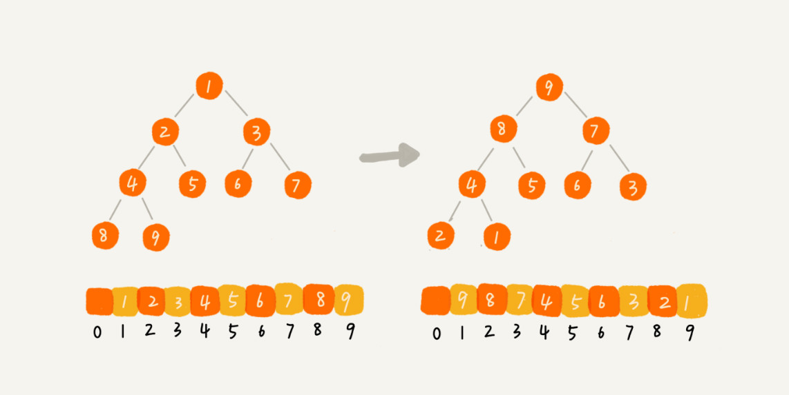

小结：堆是一种完全二叉树。它最大的特性是：每个节点的值都大于等于（或小于等于）其子树节点的值。因此，堆被分成了两类，大顶堆和小顶堆。

堆中比较重要的两个操作是插入一个数据和删除堆顶元素。这两个操作都要用到堆化。插入一个数据的时候，我们把新插入的数据放到数组的最后，然后从下往上堆化；删除堆顶数据的时候，我们把数组中的最后一个元素放到堆顶，然后从上往下堆化。这两个操作时间复杂度都是 *O*(log*n*)。

除此之外，我们还讲了堆的一个经典应用，堆排序。堆排序包含两个过程，建堆和排序。我们将下标从 2*n* 到 1 的节点，依次进行从上到下的堆化操作，然后就可以将数组中的数据组织成堆这种数据结构。接下来，我们迭代地将堆顶的元素放到堆的末尾，并将堆的大小减一，然后再堆化，重复这个过程，直到堆中只剩下一个元素，整个数组中的数据就都有序排列了。

### 堆的应用

#### 堆的应用一、优先级队列

优先级队列，顾名思义，它首先应该是一个队列。我们前面讲过，队列最大的特性就是先进先出。不过，在优先级队列中，数据的出队顺序不是先进先出，而是按照优先级来，优先级最高的，最先出队。

如何实现一个优先级队列呢？方法有很多，但是用堆来实现是最直接、最高效的。这是因为，堆和优先级队列非常相似。一个堆就可以看作一个优先级队列。很多时候，它们只是概念上的区分而已。往优先级队列中插入一个元素，就相当于往堆中插入一个元素；从优先级队列中取出优先级最高的元素，就相当于取出堆顶元素。

##### 合并有序小文件、高性能定时器、利用小顶堆求topK

### 图

同是非线性表数据结构的除了树之外，还有图。和树比起来，这是一种更加复杂的非线性结构。树中的元素我们称为节点，图中的元素我们就叫作顶点（vertex）。从我画的图中可以看出来，图中的一个顶点可以与任意其他顶点建立连接关系。我们把这种建立的关系叫作边（edge）。

我们生活中就有很多符合图这种结构的例子，比如微信、微博。拿微信来说，我们可以把每个用户看作一个顶点。如果两个用户之间互加好友，那就在两者之间建立一条边。所以，整个微信的好友关系就可以用一张图来表示。其中，每个用户有多少个好友，对应到图中，就叫作顶点的度（degree），就是跟顶点相连接的边的条数。

实际上，微博的社交关系跟微信还有点不一样，或者说更加复杂一点。微博允许单向关注，也就是说，用户 A 关注了用户 B，但用户 B 可以不关注用户 A。那我们如何用图来表示这种单向的社交关系呢？

我们可以把刚刚讲的图结构稍微改造一下，引入边的“方向”的概念。如果用户 A 关注了用户 B，我们就在图中画一条从 A 到 B 的带箭头的边，来表示边的方向。如果用户 A 和用户 B 互相关注了，那我们就画一条从 A 指向 B 的边，再画一条从 B 指向 A 的边。我们把这种边有方向的图叫作“有向图”。以此类推，我们把边没有方向的图就叫作“无向图”。

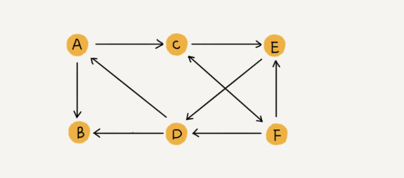

我们刚刚讲过，无向图中有“度”这个概念，表示一个顶点有多少条边。在有向图中，我们把度分为入度（In-degree）和出度（Out-degree）。顶点的入度，表示有多少条边指向这个顶点；顶点的出度，表示有多少条边是以这个顶点为起点指向其他顶点。对应到微博的例子，入度就表示有多少粉丝，出度就表示关注了多少人。

前面讲到了微信、微博、无向图、有向图，现在我们再来看另一种社交软件：QQ。QQ 中的社交关系要更复杂的一点。不知道你有没有留意过 QQ 亲密度这样一个功能。QQ 不仅记录了用户之间的好友关系，还记录了两个用户之间的亲密度，如果两个用户经常往来，那亲密度就比较高；如果不经常往来，亲密度就比较低。如何在图中记录这种好友关系的亲密度呢？

这里就要用到另一种图，带权图（weighted graph）。在带权图中，每条边都有一个权重（weight），我们可以通过这个权重来表示 QQ 好友间的亲密度。

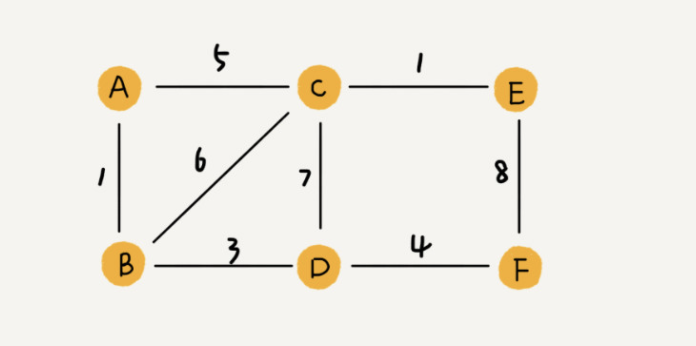

#### 图的存储

图最直观的一种存储方法就是，**邻接矩阵（Adjacency Matrix）**。

邻接矩阵的底层依赖一个二维数组。对于无向图来说，如果顶点 i 与顶点 j 之间有边，我们就将 A[i][j]和 A[j][i]标记为 1；对于有向图来说，如果顶点 i 到顶点 j 之间，有一条箭头从顶点 i 指向顶点 j 的边，那我们就将 A[i][j]标记为 1。同理，如果有一条箭头从顶点 j 指向顶点 i 的边，我们就将 A[j][i]标记为 1。对于带权图，数组中就存储相应的权重。

用邻接矩阵来表示一个图，虽然简单、直观，但是比较浪费存储空间。为什么这么说呢？对于无向图来说，如果 A[i][j]等于 1，那 A[j][i]也肯定等于 1。实际上，我们只需要存储一个就可以了。也就是说，无向图的二维数组中，如果我们将其用对角线划分为上下两部分，那我们只需要利用上面或者下面这样一半的空间就足够了，另外一半白白浪费掉了。还有，如果我们存储的是稀疏图（Sparse Matrix），也就是说，顶点很多，但每个顶点的边并不多，那邻接矩阵的存储方法就更加浪费空间了。比如微信有好几亿的用户，对应到图上就是好几亿的顶点。但是每个用户的好友并不会很多，一般也就三五百个而已。如果我们用邻接矩阵来存储，那绝大部分的存储空间都被浪费了。

图的存储--邻接表存储方法

针对上面邻接矩阵比较浪费内存空间的问题，我们来看另外一种图的存储方法，邻接表（Adjacency List）。如下图，是一张邻接表。乍一看，邻接表是不是有点像散列表？每个顶点对应一条链表，链表中存储的是与这个顶点相连接的其他顶点。另外我需要说明一下，图中画的是一个有向图的邻接表存储方式，每个顶点对应的链表里面，存储的是指向的顶点。

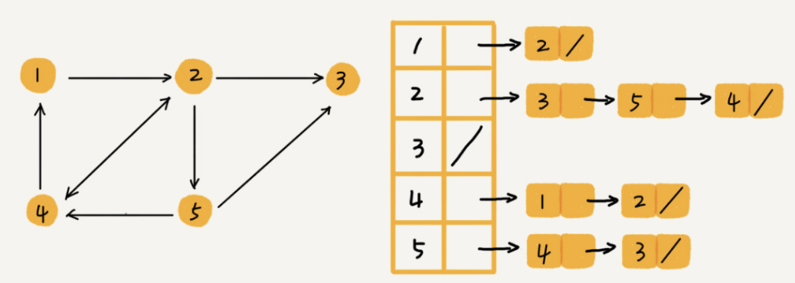

邻接矩阵存储起来比较浪费空间，但是使用起来比较节省时间。相反，邻接表存储起来比较节省空间，但是使用起来就比较耗时间。就像图中的例子，如果我们要确定，是否存在一条从顶点 2 到顶点 4 的边，那我们就要遍历顶点 2 对应的那条链表，看链表中是否存在顶点 4。而且，我们前面也讲过，链表的存储方式对缓存不友好。所以，比起邻接矩阵的存储方式，在邻接表中查询两个顶点之间的关系就没那么高效了。

在基于链表法解决冲突的散列表中，如果链过长，为了提高查找效率，我们可以将链表换成其他更加高效的数据结构，比如平衡二叉查找树等。我们刚刚也讲到，邻接表长得很像散列。所以，我们也可以将邻接表同散列表一样进行“改进升级”。我们可以将邻接表中的链表改成平衡二叉查找树。实际开发中，我们可以选择用红黑树。这样，我们就可以更加快速地查找两个顶点之间是否存在边了。当然，这里的二叉查找树可以换成其他动态数据结构，比如跳表、散列表等。除此之外，我们还可以将链表改成有序动态数组，可以通过二分查找的方法来快速定位两个顶点之间否是存在边。

微博、微信是两种“图”，前者是有向图，后者是无向图。在这个问题上，两者的解决思路差不多，我们拿微博来举例：数据结构是为算法服务的，所以具体选择哪种存储方法，与期望支持的操作有关系。针对微博用户关系，假设我们需要支持下面这样几个操作：

- 判断用户 A 是否关注了用户 B；
- 判断用户 A 是否是用户 B 的粉丝；
- 用户 A 关注用户 B；
- 用户 A 取消关注用户 B；
- 根据用户名称的首字母排序，分页获取用户的粉丝列表；
- 根据用户名称的首字母排序，分页获取用户的关注列表。

关于如何存储一个图，前面我们讲到两种主要的存储方法，邻接矩阵和邻接表。因为社交网络是一张稀疏图，使用邻接矩阵存储比较浪费存储空间。所以，这里我们采用邻接表来存储。不过，用一个邻接表来存储这种有向图是不够的。我们去查找某个用户关注了哪些用户非常容易，但是如果要想知道某个用户都被哪些用户关注了，也就是用户的粉丝列表，是非常困难的。

基于此，我们需要一个逆邻接表。邻接表中存储了用户的关注关系，逆邻接表中存储的是用户的被关注关系。对应到图上，邻接表中，每个顶点的链表中，存储的就是这个顶点指向的顶点，逆邻接表中，每个顶点的链表中，存储的是指向这个顶点的顶点。如果要查找某个用户关注了哪些用户，我们可以在邻接表中查找；如果要查找某个用户被哪些用户关注了，我们从逆邻接表中查找。

基础的邻接表不适合快速判断两个用户之间是否是关注与被关注的关系，所以我们选择改进版本，将邻接表中的链表改为支持快速查找的动态数据结构。选择哪种动态数据结构呢？红黑树、跳表、有序动态数组还是散列表呢？

因为我们需要按照用户名称的首字母排序，分页来获取用户的粉丝列表或者关注列表，用跳表这种结构再合适不过了。这是因为，跳表插入、删除、查找都非常高效，时间复杂度是 O(logn)，空间复杂度上稍高，是 O(n)。最重要的一点，跳表中存储的数据本来就是有序的了，分页获取粉丝列表或关注列表，就非常高效。

### 与图相关的搜索算法

我们知道，算法是作用于具体数据结构之上的，深度优先搜索算法和广度优先搜索算法都是基于“图”这种数据结构的。这是因为，图这种数据结构的表达能力很强，大部分涉及搜索的场景都可以抽象成“图”。图上的搜索算法，最直接的理解就是，在图中找出从一个顶点出发，到另一个顶点的路径。具体方法有很多，比如今天要讲的两种最简单、最“暴力”的深度优先、广度优先搜索，还有 A*、IDA* 等启发式搜索算法。

之前我们讲过，图有两种主要存储方法，邻接表和邻接矩阵。今天我会用邻接表来存储图。我们先给出图的代码实现。需要说明一下，深度优先搜索算法和广度优先搜索算法，既可以用在无向图，也可以用在有向图上。在今天的讲解中，我们都针对无向图来讲解。

~~~java
public class Graph { // 无向图
  private int v; // 顶点的个数
  private LinkedList<Integer> adj[]; // 邻接表

  public Graph(int v) {
    this.v = v;
    adj = new LinkedList[v];
    for (int i=0; i<v; ++i) {
      adj[i] = new LinkedList<>();
    }
  }

  public void addEdge(int s, int t) { // 无向图一条边存两次
    adj[s].add(t);
    adj[t].add(s);
  }
}
~~~

#### 广度优先搜索（BFS）

广度优先搜索（Breadth-First-Search），我们平常都把简称为 BFS。直观地讲，它其实就是一种“地毯式”层层推进的搜索策略，即先查找离起始顶点最近的，然后是次近的，依次往外搜索。如下图：

尽管广度优先搜索的原理挺简单，但代码实现还是稍微有点复杂度。所以，我们重点讲一下它的代码实现。这里面，bfs() 函数就是基于之前定义的，图的广度优先搜索的代码实现。其中 s 表示起始顶点，t 表示终止顶点。我们搜索一条从 s 到 t 的路径。实际上，这样求得的路径就是从 s 到 t 的最短路径。

~~~java

public void bfs(int s, int t) {
  if (s == t) return;
  boolean[] visited = new boolean[v];
  visited[s]=true;
  Queue<Integer> queue = new LinkedList<>();
  queue.add(s);
  int[] prev = new int[v];
  for (int i = 0; i < v; ++i) {
    prev[i] = -1;
  }
  while (queue.size() != 0) {
    int w = queue.poll();
   for (int i = 0; i < adj[w].size(); ++i) {
      int q = adj[w].get(i);
      if (!visited[q]) {
        prev[q] = w;
        if (q == t) {
          print(prev, s, t);
          return;
        }
        visited[q] = true;
        queue.add(q);
      }
    }
  }
}

private void print(int[] prev, int s, int t) { // 递归打印s->t的路径
  if (prev[t] != -1 && t != s) {
    print(prev, s, prev[t]);
  }
  System.out.print(t + " ");
}
~~~

这段代码不是很好理解，里面有三个重要的辅助变量 visited、queue、prev。只要理解这三个变量，读懂这段代码估计就没什么问题了。

visited 是用来记录已经被访问的顶点，用来避免顶点被重复访问。如果顶点 q 被访问，那相应的 visited[q]会被设置为 true。

queue 是一个队列，用来存储已经被访问、但相连的顶点还没有被访问的顶点。因为广度优先搜索是逐层访问的，也就是说，我们只有把第 k 层的顶点都访问完成之后，才能访问第 k+1 层的顶点。当我们访问到第 k 层的顶点的时候，我们需要把第 k 层的顶点记录下来，稍后才能通过第 k 层的顶点来找第 k+1 层的顶点。所以，我们用这个队列来实现记录的功能。

prev 用来记录搜索路径。当我们从顶点 s 开始，广度优先搜索到顶点 t 后，prev 数组中存储的就是搜索的路径。不过，这个路径是反向存储的。prev[w]存储的是，顶点 w 是从哪个前驱顶点遍历过来的。比如，我们通过顶点 2 的邻接表访问到顶点 3，那 prev[3]就等于 2。为了正向打印出路径，我们需要递归地来打印，你可以看下 print() 函数的实现方式

分解图如下：

掌握了广优先搜索算法的原理，我们来看下，广度优先搜索的时间、空间复杂度是多少呢？

最坏情况下，终止顶点 t 离起始顶点 s 很远，需要遍历完整个图才能找到。这个时候，每个顶点都要进出一遍队列，每个边也都会被访问一次，所以，广度优先搜索的时间复杂度是 O(V+E)，其中，V 表示顶点的个数，E 表示边的个数。当然，对于一个连通图来说，也就是说一个图中的所有顶点都是连通的，E 肯定要大于等于 V-1，所以，广度优先搜索的时间复杂度也可以简写为 O(E)。广度优先搜索的空间消耗主要在几个辅助变量 visited 数组、queue 队列、prev 数组上。这三个存储空间的大小都不会超过顶点的个数，所以空间复杂度是 O(V)。

#### 深度优先（DFS）

深度优先搜索（Depth-First-Search），简称 DFS。最直观的例子就是“走迷宫”。假设你站在迷宫的某个岔路口，然后想找到出口。你随意选择一个岔路口来走，走着走着发现走不通的时候，你就回退到上一个岔路口，重新选择一条路继续走，直到最终找到出口。这种走法就是一种深度优先搜索策略。走迷宫的例子很容易能看懂，我们现在再来看下，如何在图中应用深度优先搜索，来找某个顶点到另一个顶点的路径。

如下的这幅图，搜索的起始顶点是 s，终止顶点是 t，我们希望在图中寻找一条从顶点 s 到顶点 t 的路径。如果映射到迷宫那个例子，s 就是你起始所在的位置，t 就是出口。我用深度递归算法，把整个搜索的路径标记出来了。这里面实线箭头表示遍历，虚线箭头表示回退。从图中我们可以看出，深度优先搜索找出来的路径，并不是顶点 s 到顶点 t 的最短路径。

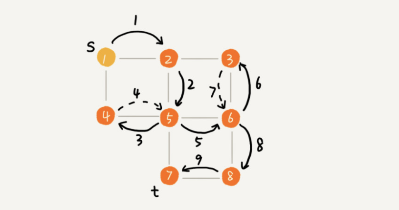

实际上，深度优先搜索用的是一种比较著名的算法思想，回溯思想。这种思想解决问题的过程，非常适合用递归来实现。

我把上面的过程用递归来翻译出来，就是下面这个样子。我们发现，深度优先搜索代码实现也用到了 prev、visited 变量以及 print() 函数，它们跟广度优先搜索代码实现里的作用是一样的。不过，深度优先搜索代码实现里，有个比较特殊的变量 found，它的作用是，当我们已经找到终止顶点 t 之后，我们就不再递归地继续查找了。

~~~java
public void dfs(int s,int t){
        found = false;
        boolean[] visited = new boolean[v];
        int[] prev = new int[v];
        for (int i = 0;i < v; i++){
            prev[i] = -1;
        }
        recurDfs(s,t,visited,prev);
        print(prev,s,t);
    }

    private void recurDfs(int w,int t,boolean[] visited,int[] prev){
        if (found) {
            return;
        }
        if (w == t) {
            found = true;
            return;
        }
        visited[w] = true;
        for(int i=0;i < adj[w].size();i++){
            int q = adj[w].get(i);
            if (!visited[q]) {
                prev[q] = w;
                recurDfs(q,t,visited,prev);
            }
        }
    }
~~~

理解了深度优先搜索算法之后，我们来看，深度度优先搜索的时、空间间复杂度是多少呢？

从我前面画的图可以看出，每条边最多会被访问两次，一次是遍历，一次是回退。所以，图上的深度优先搜索算法的时间复杂度是 O(E)，E 表示边的个数。

深度优先搜索算法的消耗内存主要是 visited、prev 数组和递归调用栈。visited、prev 数组的大小跟顶点的个数 V 成正比，递归调用栈的最大深度不会超过顶点的个数，所以总的空间复杂度就是 O(V)。

小结：

广度优先搜索，通俗的理解就是，地毯式层层推进，从起始顶点开始，依次往外遍历。广度优先搜索需要借助队列来实现，遍历得到的路径就是，起始顶点到终止顶点的最短路径。深度优先搜索用的是回溯思想，非常适合用递归实现。换种说法，深度优先搜索是借助栈来实现的。在执行效率方面，深度优先和广度优先搜索的时间复杂度都是 O(E)，空间复杂度是 O(V)。

### 字符串匹配算法之----BF算法、RK算法、BM算法和KMP算法

1、BF算法

Brute Force的缩写，中文也叫暴力匹配算法，朴素匹配算法。其思想是：在主串中，检查起始位置分别是0、1、2…n-m且长度为m的n-m+1个子串，看有没有跟模式串匹配的，其中主串长度为n，模式串长度为m。时间复杂度比较高，是O(n*m),n、m表示主串和模式串的长度。

2、RK算法

全称叫Rabin-Karp算法，算法的思路：通过哈希算法对主串中的 n-m+1个子串分别求哈希值，然后逐个与模式串的哈希值比较大小。哈希算法的设计：假设要匹配的字符串的字符集中只包含K个字符，我们可以用一个K进制数来表示一个子串，这个K进制数转化成十进制数，作为子串的哈希值。比如要处理的字符串只包含a~z这26个小写字母，则用二十六进制来表示一个字符串。a~z映射0~25这26个数字，a表示0，b表示1……z表示25.那么cba=c X26X26+bX26+aX1=1353。通过这种特殊的哈希算法，只需要扫描一遍主串就能计算出所有子串的哈希值了。RK算法的时间复杂度是O(n),跟BF算法相比，效率提高了很多，但是效率取决于哈希算法的设计。如果存在大量哈希冲突，极端情况下，会退化为O(n*m)。

对比：

BF 算法是最简单、粗暴的字符串匹配算法，它的实现思路是，拿模式串与主串中是所有子串匹配，看是否有能匹配的子串。所以，时间复杂度也比较高，是 O(n*m)，n、m 表示主串和模式串的长度。不过，在实际的软件开发中，因为这种算法实现简单，对于处理小规模的字符串匹配很好用。

RK 算法是借助哈希算法对 BF 算法进行改造，即对每个子串分别求哈希值，然后拿子串的哈希值与模式串的哈希值比较，减少了比较的时间。所以，理想情况下，RK 算法的时间复杂度是 O(n)，跟 BF 算法相比，效率提高了很多。不过这样的效率取决于哈希算法的设计方法，如果存在冲突的情况下，时间复杂度可能会退化。极端情况下，哈希算法大量冲突，时间复杂度就退化为 O(n*m)。

3、BM算法

Boyer-Moore算法，核心思想是，利用模式串本身的特点，在模式串中某个字符与主串不能匹配的时候，讲模式串往后多滑几位，以此来减少不必要的字符比较，提高匹配效率。BM算法构建的规则有两类，坏字符规则和好后缀规则。好后缀规则可以独立于坏字符规则使用。坏字符规则的实现比较耗内存，为了省内存，可以只用好后缀规则来实现BM算法。

3.1 坏字符规则

BM算法的匹配顺序是按照模式串下标从大到小的顺序，倒着匹配。

当发现某个字符没法匹配的时候，把这个没有匹配的字符叫**坏字符（主串中的字符）**，比如上图中c是坏字符。当发生不匹配的时候，我们把坏字符对应的模式串中的字符下标记作 si。如果坏字符在模式串中存在，我们把这个坏字符在模式串中的下标记作 xi。如果不存在，我们把 xi 记作 -1。那模式串往后移动的位数就等于 si-xi。（注意，我这里说的下标，都是字符在模式串的下标）。如果坏字符在模式串里多次出现，我们在计算Xi的时候，选择最靠后的那个，因为这样不会让模式串滑动过多，导致本来可能匹配的情况被滑过。如下图：

利用坏字符规则，BM 算法在最好情况下的时间复杂度非常低，是 O(n/m)。比如，主串是 aaabaaabaaabaaab，模式串是 aaaa。每次比对，模式串都可以直接后移四位，所以，匹配具有类似特点的模式串和主串的时候，BM 算法非常高效。单纯使用坏字符规则还是不够的，因为根据si-xi计算出来的移动位数，可能是负数，比如主串aaaaaaaaaaaaaaa，模式串baaa。这种不但不会向后滑动模式串，还可能倒退。所以，BM算法还需要用到"好后缀规则"。

3.2好后缀规则

好后缀规则跟坏字符规则类似，滑动过程中，匹配到的字符称为好后缀，未匹配的称为坏字符，如下图：

我们把已经匹配的bc叫好后缀，记为{u}。拿它在模式串中查找，如果找到了另一个跟{u}相匹配的子串{u*}，那么就将模式串滑动到子串{u\*}对齐的位置。如图：

如果模式串中找不到另一个等于{u}的子串，就直接将模式串，滑动到主串中{u}的后面，因为之前的任何一次往后滑动，都没有匹配主串中{u}的情况。如图：

但是上述的这种情况有时候也会滑动过头，来看下边这个例子，bc是好后缀，尽管在模式串中没有另外一个相匹配的子串{u\*},但是如果我们将模式串移动到好后缀的后面，会错过模式串和主串可以匹配的情况。如图：

如果好后缀在模式串中不存在可匹配的子串，那在我们一步一步往后滑动模式串的过程中，只要主串中的{u}与模式串有重合，那肯定就无法完全匹配。但是当模式串滑动到前缀与主串中{u}的后缀有部分重合的时候，并且重合的部分相等的时候，就有可能会存在完全匹配的情况。如图：

针对这种情况，不仅要看好后缀在模式串中，是否有另一个匹配的子串，我们还要考察好后缀的后缀子串，是否存在跟模式串的前缀子串匹配的。所谓某个字符串 s 的后缀子串，就是最后一个字符跟 s 对齐的子串，比如 abc 的后缀子串就包括 c, bc。所谓前缀子串，就是起始字符跟 s 对齐的子串，比如 abc 的前缀子串有 a，ab。我们从好后缀的后缀子串中，找一个最长的并且能跟模式串的前缀子串匹配的，假设是{v}，然后将模式串滑动到如图所示的位置。

当模式串和主串中的某个字符不匹配的时候，**我们分别计算好后缀和坏字符往后滑动的位数，然后取两个数中最大的，作为模式串往后滑动的位数**。

### BM算法的实现

“坏字符规则”，当遇到坏字符时，要计算往后移动的位数 si-xi，其中 xi 的计算是重点，我们如何求得 xi 呢？或者说，如何查找坏字符在模式串中出现的位置呢？如果我们拿坏字符，在模式串中顺序遍历查找，这样就会比较低效，势必影响这个算法的性能。有没有更加高效的方式呢？我们之前学的散列表，这里可以派上用场了。我们可以将模式串中的每个字符及其下标都存到散列表中。这样就可以快速找到坏字符在模式串的位置下标了。关于这个散列表，我们只实现一种最简单的情况，假设字符串的字符集不是很大，每个字符长度是 1 字节，我们用大小为 256 的数组，来记录每个字符在模式串中出现的位置。数组的下标对应字符的 ASCII 码值，数组中存储这个字符在模式串中出现的位置。如下图：

代码如下：

~~~go
var size = 256
func generateBc(searchBytes []byte,hash [256]int){
	for i := 0; i < size; i ++ {
		hash[i] = -1
	}
	for i := 0; i < len(searchBytes); i++ {
		ascii := int(searchBytes[i])
		hash[ascii] = i
	}
}
~~~

仅用坏字符规则，我们把 BM 算法代码的大框架写好，先不考虑好后缀规则，仅用坏字符规则，并且不考虑 si-xi 计算得到的移动位数可能会出现负数的情况。代码：

~~~go
func BM(mainBytes []byte,searchBytes []byte) int {
	index := -1
	mainL := len(mainBytes)
	searchL := len(searchBytes)
	if searchL <= mainL {
		index = 0
	}
	hash := [256]int{}//记录模式串中每个字符最后出现的位置
	generateBc(searchBytes,hash)//生成坏字符哈希表
	var i int //i表示主串与模式串对齐的第一个字符
	for i <= mainL - searchL {
		var j int
		for j = searchL - 1; j >= 0; j-- {//模式串从后往前匹配
			if mainBytes[i+j] != searchBytes[j]{//坏字符对应模式串中的下标是j
				break
			}
		}
		if j < 0 {
			return i // 匹配成功，返回主串与模式串第一个匹配的字符的位置
		}
		i = i + (j - hash[int(mainBytes[i+j])])
	}

	return index
}
~~~

过程如图：

接下来实现好后缀规则：

好后缀规则其核心内容有两点，一是在模式串中，查找跟好后缀匹配的另一个子串；二是在好后缀的后缀子串中，查找最长的、能跟模式串前缀子串匹配的后缀子串。在不考虑效率的情况下，这两个操作都可以用很“暴力”的匹配查找方式解决。但是，如果想要 BM 算法的效率很高，这部分则有一定的技巧。**因为好后缀也是模式串本身的后缀子串，所以，我们可以在模式串和主串正式匹配之前，通过预处理模式串，预先计算好模式串的每个后缀子串，对应的另一个可匹配子串的位置。**因为后缀子串的最后一个字符的位置是固定的，下标为 m-1，我们只需要记录长度就可以了。通过长度，我们可以确定一个唯一的后缀子串。如下图：

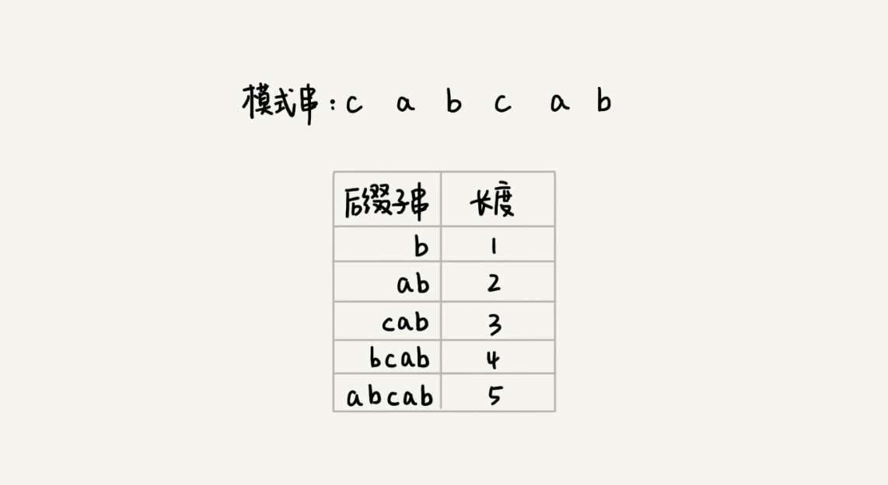

现在我们引入suffix数组，suffix 数组的下标 k，表示后缀子串的长度，下标对应的数组值存储的是，在模式串中跟好后缀{u}相匹配的子串{u*}的起始下标值。如图：

但是，如果模式串中有多个（大于 1 个）子串跟后缀子串{u}匹配，那 suffix 数组中该存储哪一个子串的起始位置呢？为了避免模式串往后滑动得过头了，我们肯定要存储模式串中最靠后的那个子串的起始位置，也就是下标最大的那个子串的起始位置。实际上，仅仅是选最靠后的子串片段来存储是不够的。我们不仅要在模式串中，查找跟好后缀匹配的另一个子串，还要在好后缀的后缀子串中，查找最长的能跟模式串前缀子串匹配的后缀子串。如果我们只记录刚刚定义的 suffix，实际上，只能处理规则的前半部分，也就是，在模式串中，查找跟好后缀匹配的另一个子串。所以，除了 suffix 数组之外，我们还需要另外一个 boolean 类型的 prefix 数组，来记录模式串的后缀子串是否能匹配模式串的前缀子串。如图：

接下来去填充这两个数组：

我们拿下标从 0 到 i 的子串（i 可以是 0 到 m-2）与整个模式串，求公共后缀子串。如果公共后缀子串的长度是 k，那我们就记录 suffix[k]=j（j 表示公共后缀子串的起始下标）。如果 j 等于 0，也就是说，公共后缀子串也是模式串的前缀子串，我们就记录 prefix[k]=true。如图：

代码实现：

~~~go
func generateGS(searchBytes []byte, suffix []int, prefix []bool){
	m := len(searchBytes)
	for i := 0; i < m; i++ {
		suffix[i] = -1
		prefix[i] = false
	}
	for i := 0; i < m - 1; i++ {
		j := i
		var k int
		for j >= 0 && searchBytes[j] == searchBytes[m-1-k] {
			j--
			k++
			suffix[k] = j+1
		}
		if j == -1 {
			prefix[k] = true
		}
	}
}
~~~

#### 有了上边两个数组之后，遇到不能匹配的字符时，如何根据好后缀规则计算往后滑动的位数？

假设好后缀的长度是 k。我们先拿好后缀，在 suffix 数组中查找其匹配的子串。如果 suffix[k] 不等于 -1（-1 表示不存在匹配的子串），那我们就将模式串往后移动 j-suffix[k]+1 位（j 表示坏字符对应的模式串中的字符下标）。

如果 suffix[k] 等于 -1，表示模式串中不存在另一个跟好后缀匹配的子串片段。我们可以用下面这条规则来处理。好后缀的后缀子串 b[r, m-1]（其中，r 取值从 j+2 到 m-1）的长度 k=m-r，如果 prefix[k] 等于 true，表示长度为 k 的后缀子串，有可匹配的前缀子串，这样我们可以把模式串后移 r 位。如图：

如果两条规则都没有找到可以匹配好后缀及其后缀子串的子串，我们就将整个模式串后移 m 位。如图：

#### 字符串匹配KMP算法

在模式串和主串匹配的过程中，把不能匹配的那个字符仍然叫做**坏字符**，把已经匹配的那段字符串叫**好前缀**。

当遇到坏字符的时候，把模式串往后滑动，滑动的过程中，只要模式串和好前缀有上下重合，前面几个字符的比较，就相当于拿好前缀的后缀子串，跟模式串的前缀子串比较。如下图：

我们只需要拿好前缀本身，在它的后缀子串中，查找最长的那个可以跟好前缀的前缀子串匹配的。假设最长的可匹配的那部分前缀子串是{v}，长度是 k。我们把模式串一次性往后滑动 j-k 位，相当于，每次遇到坏字符的时候，我们就把 j 更新为 k，i 不变，然后继续比较。

我把好前缀的所有后缀子串中，最长的可匹配前缀子串的那个后缀子串，叫作最长可匹配后缀子串，对应的前缀子串，叫作最长可匹配前缀子串。

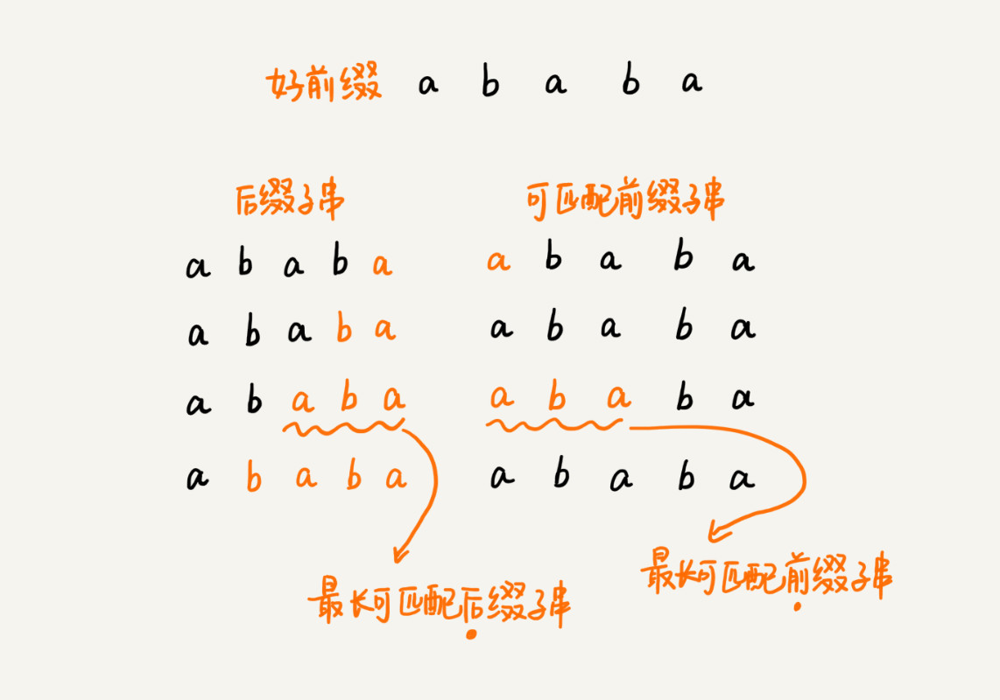

通过预处理，可以求模式串的最长可匹配前缀和后缀子串。类似BM酸奶法中的bc、suffix、prefix数组，KMP中我们把数组定义为next数组，也叫失效函数(failure function)。

数组的下标是每个前缀结尾字符下标，数组的值是这个前缀的最长可以匹配前缀子串的结尾字符下标。如图：

失效函数的计算方法：

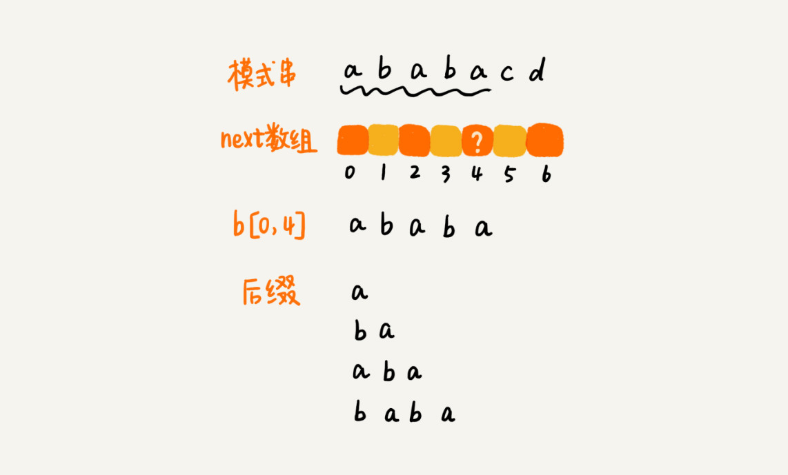

我们按照下标从小到大，依次计算 next 数组的值。当我们要计算 next[i] 的时候，前面的 next[0]，next[1]，……，next[i-1] 应该已经计算出来了。利用已经计算出来的 next 值，我们是否可以快速推导出 next[i] 的值呢？

如果 next[i-1]=k-1，也就是说，子串 b[0, k-1] 是 b[0, i-1] 的最长可匹配前缀子串。如果子串 b[0, k-1] 的下一个字符 b[k]，与 b[0, i-1] 的下一个字符 b[i] 匹配，那子串 b[0, k] 就是 b[0, i] 的最长可匹配前缀子串。所以，next[i] 等于 k。但是，如果 b[0, k-1] 的下一字符 b[k] 跟 b[0, i-1] 的下一个字符 b[i] 不相等呢？这个时候就不能简单地通过 next[i-1] 得到 next[i] 了。

我们假设 b[0, i] 的最长可匹配后缀子串是 b[r, i]。如果我们把最后一个字符去掉，那 b[r, i-1] 肯定是 b[0, i-1] 的可匹配后缀子串，但不一定是最长可匹配后缀子串。所以，既然 b[0, i-1] 最长可匹配后缀子串对应的模式串的前缀子串的下一个字符并不等于 b[i]，那么我们就可以考察 b[0, i-1] 的次长可匹配后缀子串 b[x, i-1] 对应的可匹配前缀子串 b[0, i-1-x] 的下一个字符 b[i-x] 是否等于 b[i]。如果等于，那 b[x, i] 就是 b[0, i] 的最长可匹配后缀子串。

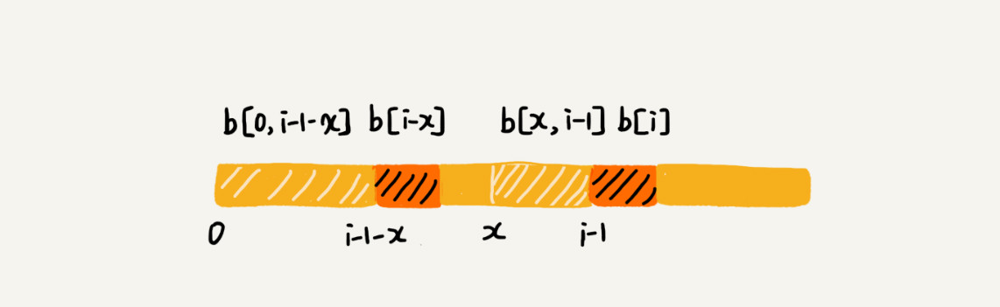

如何求得 b[0, i-1] 的次长可匹配后缀子串呢？次长可匹配后缀子串肯定被包含在最长可匹配后缀子串中，而最长可匹配后缀子串又对应最长可匹配前缀子串 b[0, y]。于是，查找 b[0, i-1] 的次长可匹配后缀子串，这个问题就变成，查找 b[0, y] 的最长匹配后缀子串的问题了。

按照这个思路，我们可以考察完所有的 b[0, i-1] 的可匹配后缀子串 b[y, i-1]，直到找到一个可匹配的后缀子串，它对应的前缀子串的下一个字符等于 b[i]，那这个 b[y, i] 就是 b[0, i] 的最长可匹配后缀子串。

#### Trie树

Trie树的本质，就是利用字符串之间的公共前缀，将重复的前缀合并在一起。假如有6个字符串，how,hi,her,hello,so,see。构造成trie树结构如下：

其中，根节点不包含任何信息。每个节点表示一个字符串中的字符，从根节点到红色节点的一条路径表示一个字符串。(红色节点并不都是叶子节点哦)。构造过程如下：

匹配过程：

#### 多模式串匹配算法（实现敏感词过滤）

用Trie树实现敏感词过滤，我们可以对敏感词字典进行预处理，构建成 Trie 树结构。这个预处理的操作只需要做一次，如果敏感词字典动态更新了，比如删除、添加了一个敏感词，那我们只需要动态更新一下 Trie 树就可以了。

##### 经典的多模式串匹配算法：AC 自动机

AC 自动机算法，全称是 Aho-Corasick 算法。其实，Trie 树跟 AC 自动机之间的关系，就像单串匹配中朴素的串匹配算法，跟 KMP 算法之间的关系一样，只不过前者针对的是多模式串而已。所以，**AC 自动机实际上就是在 Trie 树之上，加了类似 KMP 的 next 数组，只不过此处的 next 数组是构建在树上罢了**。如果代码表示，就是下面这个样子：

~~~java
public class AcNode {
  public char data; 
  public AcNode[] children = new AcNode[26]; // 字符集只包含 a~z 这 26 个字符
  public boolean isEndingChar = false; // 结尾字符为 true
  public int length = -1; // 当 isEndingChar=true 时，记录模式串长度
  public AcNode fail; // 失败指针
  public AcNode(char data) {
    this.data = data;
  }
}
~~~

AC自动机的构建，包含两个操作：将多个模式串构建成 Trie 树和在 Trie 树上构建失败指针（相当于 KMP 中的失效函数 next 数组）。

#### 贪心算法、分治算法、回溯算法、动态规划