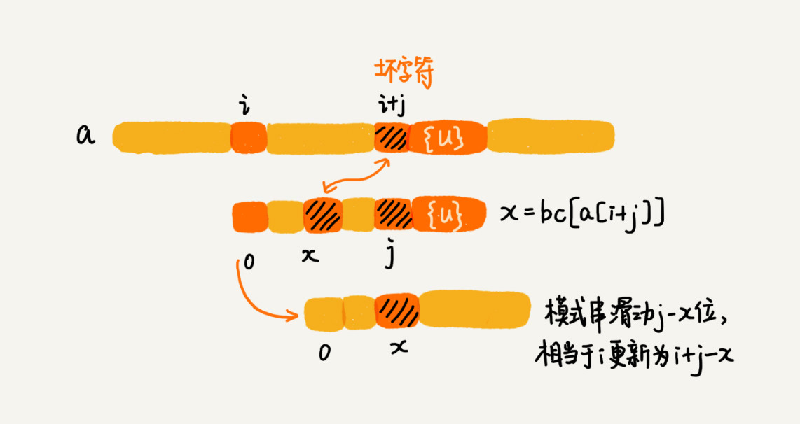
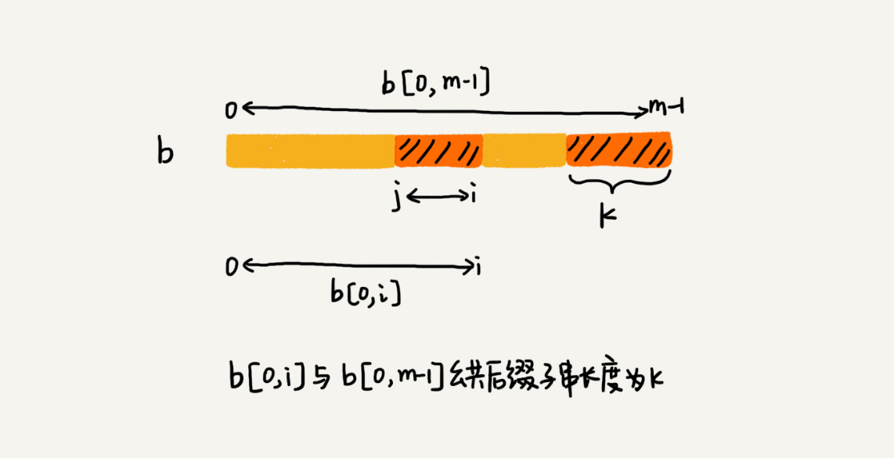
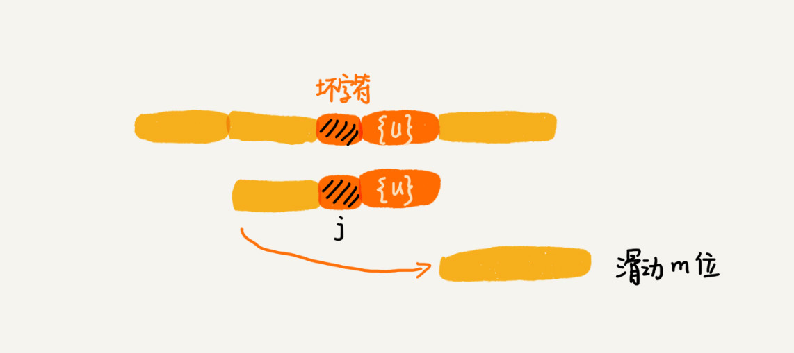

​	

# 数据结构与算法

总览大纲：

### 必须掌握的数据结构与算法：

- 10个数据结构  数组、链表、栈、队列、散列表、二叉树、堆、跳表、图、trie树
- 10个算法 递归、排序、二分查找、搜索、哈希算法、贪心算法、分治算法、回溯算法、动态规划、字符串匹配算法

---

### 时间复杂度

时间复杂度分析：

1. 只关注循环执行次数最多的一段代码
2. 加法法则，总复杂度等于量级最大的那段代码的复杂度
3. 乘法法则：嵌套代码的复杂度等于嵌套内外代码复杂度的乘积

常见的复杂度量级（按数量级递增）

    * 常量阶 O(1)
    * 对数阶 O(logN)
    * 线性阶 O(N)
    * 线性对数阶 O(NlogN)
    * 平方阶 O(N*N)
    * 指数阶 O(2的N次幂)
    * 阶乘阶 O(N!)

对于刚罗列的复杂度量级，我们可以粗略地分为两类，**多项式量级**和**非多项式量级**。其中，非多项式量级只有两个：O(2的N次幂) 和 O(n!)。当同一块代码在不同的情况下，时间复杂度有量级的差距，才会使用三种复杂度（最好、最坏、平均时间复杂度<也叫加权平均时间复杂度或者期望时间复杂度>）。

比较特殊的均摊时间复杂度：对一个数据结构进行一组连续操作中，大部分情况下时间复杂度都很低，只有个别情况下时间复杂度比较高，而且这些操作之间存在前后连贯的时序关系，这个时候，我们就可以将这一组操作放在一块儿分析，看是否能将较高时间复杂度那次操作的耗时，平摊到其他那些时间复杂度比较低的操作上。而且，在能够应用均摊时间复杂度分析的场合，一般均摊时间复杂度就等于最好情况时间复杂度。例如以下例子，每一次 O(n) 的插入操作，都会跟着 n-1 次 O(1) 的插入操作，所以把耗时多的那次操作均摊到接下来的 n-1 次耗时少的操作上，均摊下来，这一组连续的操作的均摊时间复杂度就是 O(1)。

~~~java

 // array表示一个长度为n的数组
 // 代码中的array.length就等于n
 int[] array = new int[n];
 int count = 0;
 
 void insert(int val) {
    if (count == array.length) {
       int sum = 0;
       for (int i = 0; i < array.length; ++i) {
          sum = sum + array[i];
       }
       array[0] = sum;
       count = 1;
    }

    array[count] = val;
    ++count;
 }
~~~

数据结构就是指一组数据的存储结构。算法就是操作数据的一组方法。数据结构是为算法服务的，算法要作用在特定的数据结构之上。

---

## 数据结构

### 1、数组

数组是一种 **线性**的表数据结构，它用一组**连续的内存空间**，来存储一组具有相同类型的数据。同属于线性表结构的还有链表、队列、栈。

与线性表对应的是 **非线性表**，比如二叉树、堆、图。

不同语言中的容器

Java ArrayList,C++ vector

ArrayList 最大的优势就是可以将很多数组操作的细节封装起来。比如前面提到的数组插入、删除数据时需要搬移其他数据等。另外，它还有一个优势，就是支持动态扩容。如果使用 ArrayList，我们就完全不需要关心底层的扩容逻辑，ArrayList 已经帮我们实现好了。每次存储空间不够的时候，它都会将空间自动扩容为 1.5 倍大小。

- Java ArrayList 无法存储基本类型，比如 int、long，需要封装为 Integer、Long 类，而 Autoboxing、Unboxing 则有一定的性能消耗，所以如果特别关注性能，或者希望使用基本类型，就可以选用数组。
- 如果数据大小事先已知，并且对数据的操作非常简单，用不到 ArrayList 提供的大部分方法，也可以直接使用数组。
-  当要表示多维数组时，用数组往往会更加直观。比如 Object[][] array；而用容器的话则需要这样定义：ArrayList<ArrayList<object> > array。

数组用一块连续的内存空间，来存储相同类型的一组数据，最大的特点就是支持随机访问，但插入、删除操作也因此变得比较低效，平均情况时间复杂度为 O(n)。在平时的业务开发中，我们可以直接使用编程语言提供的容器类，但是，如果是特别底层的开发，直接使用数组可能会更合适。

数组下标从0开始，从数组存储的内存模型上来看，“下标”最确切的定义应该是“偏移（offset）”。前面也讲到，如果用 a 来表示数组的首地址，a[0] 就是偏移为 0 的位置，也就是首地址，a[k] 就表示偏移 k 个 type_size 的位置，所以计算 a[k] 的内存地址只需要用这个公式：a[k]_address = base_address + k *type_size，但是，如果数组从 1 开始计数，那我们计算数组元素 a[k] 的内存地址就会变为：a[k]_address = base_address + (k-1)*type_size，对CPU来说，会多一次减法指令。

---

### 2、链表

缓存淘汰策略常见的有三种：

* 先进先出FIFO
* 最少使用 Least Frequently Used
* 最近最少使用 Least Recently Used（典型的链表应用场景）

链表通过指针，将零散的内存卡串联起来，所以不像数组那样，需要连续的内存空间。下图表明了数组与链表的底层存储结构。

常用链表：单链表、双向链表、循环链表

#### 2.1 单链表：

链表的头结点记录链表的基地址，通过他遍历整条链表，尾节点指针指向一个空地址NULL。在进行数组的插入、删除操作时，为了保持内存数据的连续性，需要做大量的数据搬移，所以时间复杂度是 O(n)。而在链表中插入或者删除一个数据，我们并不需要为了保持内存的连续性而搬移结点，因为链表的存储空间本身就不是连续的。所以，在链表中插入和删除一个数据是非常快速的。针对链表的插入和删除操作，我们只需要考虑相邻结点的指针改变，所以对应的时间复杂度是 O(1)。链表要想随机访问第 k 个元素，就没有数组那么高效了。因为链表中的数据并非连续存储的，所以无法像数组那样，根据首地址和下标，通过寻址公式就能直接计算出对应的内存地址，而是需要根据指针一个结点一个结点地依次遍历，直到找到相应的结点。

**头指针的概念** 链表中第一个节点的存储位置叫做头指针，如果链表有头结点，那么头指针就是指向头结点数据域的指针。如下图所示：

如果单链表没有头结点，则如下：

#### 2.2循环链表

循环链表是一种特殊的单链表。实际上，循环链表也很简单。它跟单链表唯一的区别就在尾结点。我们知道，单链表的尾结点指针指向空地址，表示这就是最后的结点了。而循环链表的尾结点指针是指向链表的头结点。

#### 2.3 双向链表

单向链表只有一个方向，结点只有一个后继指针 next 指向后面的结点。而双向链表，顾名思义，它支持两个方向，每个结点不止有一个后继指针 next 指向后面的结点，还有一个前驱指针 prev 指向前面的结点。

从结构上来看，双向链表可以支持 O(1) 时间复杂度的情况下找到前驱结点，正是这样的特点，也使双向链表在某些情况下的插入、删除等操作都要比单链表简单、高效。

链表删除节点：

* 删除节点中”值等于某个给定值“的节点
* 删除给定指针指向的节点

对于第一种情况，单链表与双链表查找的时间复杂度都为O(n)；第二种情况，单链表为O(N),而双链表为O(1)。
插入、删除双链表都有优势，对于有序链表，双向链表的查询效率也较高。因为可以记录上次查找的位置P，每次查询时，与P比较，决定往前还是往后查找。

指针：**将某个变量赋值给指针，实际上就是将这个变量的地址赋值给指针，或者反过来说，指针中存储了这个变量的内存地址，指向了这个变量，通过指针就能找到这个变量。**

注意链表的边界检查，比较容易出错：

- 如果链表为空时，代码是否能正常工作？
- 如果链表只包含一个结点时，代码是否能正常工作？
- 如果链表只包含两个结点时，代码是否能正常工作？
- 代码逻辑在处理头结点和尾结点的时候，是否能正常工作？

---

### 3、栈

后进者先出，先进者后出，这是典型的”栈“结构。栈是一种操作受限的线性表，只允许在一端插入和删除数据。**当某个数据集合只涉及在一端插入和删除数据，并且满足后进先出、先进后出的特性，我们就应该首选“栈”这种数据结构。**栈既可以用数组来实现，也可以用链表来实现。用数组实现的栈，我们叫作**顺序栈**，用链表实现的栈，我们叫作**链式栈**。

不管是顺序栈还是链式栈，我们存储数据只需要一个大小为 n 的数组就够了。在入栈和出栈过程中，只需要一两个临时变量存储空间，所以空间复杂度是 O(1)。注意，这里存储数据需要一个大小为 n 的数组，并不是说空间复杂度就是 O(n)。因为，这 n 个空间是必须的，无法省掉。所以我们说空间复杂度的时候，是指除了原本的数据存储空间外，算法运行还需要额外的存储空间。

栈比较经典的应用场景就:

**1.函数调用栈**。操作系统给每个线程分配了一块独立的内存空间，这块内存被组织成“栈”这种结构, 用来存储函数调用时的临时变量。每进入一个函数，就会将临时变量作为一个栈帧入栈，当被调用函数执行完成，返回之后，将这个函数对应的栈帧出栈。

~~~java
int main() {  
  int a = 1;   
  int ret = 0;  
  int res = 0;  
  ret = add(3, 5);  
  res = a + ret;  
  printf("%d", res);   
  reuturn 0;}
int add(int x, int y) {
  int sum = 0;  
  sum = x + y;  
  return sum;
}
~~~

入栈情况如下图：

**2.表达式求值** 

比如对于四则运算：3+5*8-6  实际上，编译器就是通过两个栈来实现的。其中一个保存操作数的栈，另一个是保存运算符的栈。我们从左向右遍历表达式，当遇到数字，我们就直接压入操作数栈；当遇到运算符，就与运算符栈的栈顶元素进行比较。如果比运算符栈顶元素的优先级高，就将当前运算符压入栈；如果比运算符栈顶元素的优先级低或者相同，从运算符栈中取栈顶运算符，从操作数栈的栈顶取 2 个操作数，然后进行计算，再把计算完的结果压入操作数栈，继续比较。过程如图：

**3.栈在括号匹配中的应用**

我们假设表达式中只包含三种括号，圆括号 ()、方括号 [] 和花括号{}，并且它们可以任意嵌套。比如，{[] ()[{}]}或 [{()}([])] 等都为合法格式，而{[}()] 或 [({)] 为不合法的格式。我们用栈来保存未匹配的左括号，从左到右依次扫描字符串。当扫描到左括号时，则将其压入栈中；当扫描到右括号时，从栈顶取出一个左括号。如果能够匹配，比如“(”跟“)”匹配，“[”跟“]”匹配，“{”跟“}”匹配，则继续扫描剩下的字符串。如果扫描的过程中，遇到不能配对的右括号，或者栈中没有数据，则说明为非法格式。当所有的括号都扫描完成之后，如果栈为空，则说明字符串为合法格式；否则，说明有未匹配的左括号，为非法格式。

**4.类似浏览器前进、后退的功能**

我们使用两个栈，X 和 Y，我们把首次浏览的页面依次压入栈 X，当点击后退按钮时，再依次从栈 X 中出栈，并将出栈的数据依次放入栈 Y。当我们点击前进按钮时，我们依次从栈 Y 中取出数据，放入栈 X 中。当栈 X 中没有数据时，那就说明没有页面可以继续后退浏览了。当栈 Y 中没有数据，那就说明没有页面可以点击前进按钮浏览了。

---

### 4、队列

#### 4.1 普通队列

队列也是操作受限的数据结构，最基本的操作也是两个：入队 enqueue()，放一个数据到队列尾部；出队 dequeue()，从队列头部取一个元素。典型场景是先进先出，与栈的对比如下：

对于栈来说，一个栈顶指针就可以了，但对于队列，需要两个指针，一个是head指针，指向队头；一个是tail指针，指向队尾。下图中，a，b，c，d依次入队之后，head指针指向下标为0的位置，tail指针指向下标为4的位置。

当调用两次出队操作之后，head指针指向下标为2的位置，tail仍然指向下标为4的位置，如图：

当不停的入队、出队之后，head和tail会持续后移。当tail移动到最右边，即使数组中还有空闲空间，也无法继续添加数据了，此时，需要**转移数据**。当入队时，如果没有空闲空间，集中触发一次数据搬移操作。当队列的 tail 指针移动到数组的最右边后，如果有新的数据入队，我们可以将 head 到 tail 之间的数据，整体搬移到数组中 0 到 tail-head 的位置。如图：

队列如果用链表实现，同样需要两个指针：head指针和tail指针，分别指向链表的第一个结点和最后一个结点。入队时，tail->next = new_node,tail = tail ->next;出队时，head = head ->next。

如图：

#### 4.2 循环队列

在用数组实现的非循环队列中，队满的判断条件是 tail == n，队空的判断条件是 head == tail。对于循环队列，队列为空的判断条件仍然是head == tail，但队列满的条件跟普通队列有点不一样，就像图中画的队满的情况，tail=3，head=4，n=8，所以总结一下规律就是：(3+1)%8=4。多画几张队满的图，你就会发现，当队满时，**(tail+1)%n=head。**

#### 4.3 阻塞队列

阻塞队列是在队列的基础上增加了阻塞操作，当队列为空的时候，从队头取数据会被阻塞，因为此时没有数据可取，直到队列中有了数据才能返回；如果队列已经满了，那么插入数据会被阻塞，直到队列中有空闲位置后再插入数据，然后再返回。利用阻塞队列，可以实现“生产者-消费者模型”。

#### 4.4 并发队列

线程安全的队列我们叫**并发队列**。最简单的实现方式是直接在enqueue()、dequeue()方法上加锁，但是锁粒度大并发度会比较低，同一时刻仅允许一个存或者取操作。实际上，基于数组的循环队列，利用 CAS 原子操作，可以实现非常高效的并发队列。这也是循环队列比链式队列应用更加广泛的原因。

队列在请求排队时非常有效，而且基于链表和基于数组实现的队列也有一定的区别。基于链表的实现方式，可以实现一个支持无限排队的无界队列（unbounded queue），但是可能会导致过多的请求排队等待，请求处理的响应时间过长。所以，针对响应时间比较敏感的系统，基于链表实现的无限排队的线程池是不合适的。而基于数组实现的有界队列（bounded queue），队列的大小有限，所以线程池中排队的请求超过队列大小时，接下来的请求就会被拒绝，这种方式对响应时间敏感的系统来说，就相对更加合理。不过，设置一个合理的队列大小，也是非常有讲究的。队列太大导致等待的请求太多，队列太小会导致无法充分利用系统资源、发挥最大性能。

---

## 算法

### 1、排序算法

|     排序算法     | 时间复杂度  | 是否基于比较 |
| :--------------: | :---------: | :----------: |
| 冒泡、插入、选择 |   O(n*n)    |      是      |
|    快排、归并    | O（n*logn） |      是      |
|  捅、计数、基数  |    O(n)     |      否      |

### 2、如何分析一个排序算法：

- 执行效率 1、最好、最坏、平均情况时间复杂度 2、时间复杂度的系数、常数、低阶 3、比较次数和交换（移动）的次数

- 内存消耗 ，是否原地排序，特指空间复杂度是O（1）的排序算法

- 排序算法的稳定性  待排序的序列中存在等值元素，经过排序之后，顺序不变。稳定性这个概念在实际开发中很重要，比如Demo：订单有下单时间和金额两个属性，先要要对十万订单，按照金额从小到大对数据排序，对于相同金额的订单，希望按照下单时间从早到晚有序。 如果我们先按照金额对订单数据进行排序，然后，再遍历排序之后的订单数据，对于每个金额相同的小区间再按照下单时间排序。这种排序思路理解起来不难，但是实现起来会很复杂。所以更好的实现是：我们先按照下单时间给订单排序，注意是按照下单时间，不是金额。排序完成之后，我们用稳定排序算法，按照订单金额重新排序。两遍排序之后，我们得到的订单数据就是按照金额从小到大排序，金额相同的订单按照下单时间从早到晚排序的。因为稳定排序算法可以保持金额相同的两个对象，在排序之后的前后顺序不变。第一次排序之后，所有的订单按照下单时间从早到晚有序了。在第二次排序中，我们用的是稳定的排序算法，所以经过第二次排序之后，相同金额的订单仍然保持下单时间从早到晚有序。

**有序度与逆序度的概念：**

有序度：如果i<j 则a[i]<=a[j]

数组 2，4，3，1，5，6 有序度为11，因为有序元素对为11个：
（2，4）（2，3）（2，5）（2，6）
（4，5）（4，6）（3，5）（3，6）
（1，5）（1，6）（5，6）

对于一个完全有序的数组：有序度为**n*** **(n-1)/2**，把这种完全有序的数组的有序度叫满有序度。逆序度 = 满有序度 - 有序度。我们排序的过程就是一种增加有序度，减少逆序度的过程，最后达到满有序度，就说明排序完成了。

### 3、相关算法

#### 3.1 递归

如果满足以下条件，可以用递归求解：

- 一个问题的解可以分解为几个子问题的解
- 这个问题与分解之后的子问题，除了数据规模不同，求解思路完全一样
- 存在递归终止条件

递归代码存在的弊端：堆栈溢出、重复计算、函数调用耗时多、空间复杂度高。

手写算法：

1. 斐波那契数列求值f(n)=f(n-1)+f(n-2)
2. 编程实现求阶乘n!
3. 编程实现一组数据集合的全排列

#### 3.2 快速排序

个人理解：选取一个基数，比此基数小的放左边，或者比此基数大的放右边，循环进行挪动，最后变成有序，时间复杂度：O(n*logN)，go语言实现:

~~~go
  func quickSort(a []int,l,h int){
  if l >= h{
    return
  }
  i := partition(a,l,h)
  quickSort(a,0,i-1)
  quickSort(a,i+1,h)
}
//第一种方式 比基数小的往左移
func partition1(a []int,l,h int)int{
  base := a[h]
  p := l
  for i:=l;i<h;i++{
    if a[i] < base {
      a[i],a[p] := a[p],a[i]
      p++
    }
  }
  a[p],a[h] := a[h],a[p]
  return p
}
    //第二种方式 比基数大的往右移
func partition2(a []int,l,h int)int{
  base := a[h]
  p := h
  for i := l;i < h;i++{
    if a[i] > base {
       a[i],a[p] := a[p],a[i]
       p--
    }
  }
   a[p],a[h] := a[h],a[p]
  return p
} 
~~~

利用快排，可以在O(n)时间复杂度内，求无序数组元素中的第K大元素。比如：4，2，5，12，3 第三大元素就是4。某些情况下，快排的最坏情况时间复杂度是O($n^2$)。为了提高排序算法的性能，尽可能让每次分区都比较平均。常用的分区算法：

1.三数取中法 我们从区间的首、尾、中间，分别取出一个数，然后对比大小，取这 3 个数的中间值作为分区点。这样每间隔某个固定的长度，取数据出来比较，将中间值作为分区点的分区算法，肯定要比单纯取某一个数据更好。但是，如果要排序的数组比较大，那“三数取中”可能就不够了，可能要“五数取中”或者“十数取中”。

2. 随机法 每次从要排序的区间中，随机选择一个元素作为分区点。这种方法并不能保证每次分区点都选的比较好，但是从概率的角度来看，也不大可能会出现每次分区点都选的很差的情况，所以平均情况下，这样选的分区点是比较好的。时间复杂度退化为最糟糕的 O(n2) 的情况，出现的可能性不大。

#### 3.3 归并排序

归并排序是建立在归并操作上的一种有效的排序算法，也是分治法的一个典型应用。首先我们考虑如何将两个有序数组合并，直接从第一个数依次比较，取小的加入新的数组即可，且时间复杂度为O(n)。如果要排序一个数组，我们先把数组从中间分成前后两部分，然后对前后两部分分别排序，再将排好序的两部分合并在一起，这样整个数组就都有序了。归并就是这样，将数组一直切分，最终分出来的小组只有一个数时，可以认为达到了有序，然后合并就可以了。所谓归并归并，实际也就是先递归，再合并。go语言实现：

~~~go
func MergeSort(a []int)[]int{
	if len(a) <= 1 {
		return a
	}
	m := len(a)>>1
	m1 := MergeSort(a[:m])
	m2 := MergeSort(a[m:])
	return merge(m1,m2)
}

func merge(a,b []int)[]int{
	var r []int
	var i,j int
	for i < len(a) && j < len(b) {
		if a[i] < b[j] {
			r = append(r,a[i])
			i++
		}else{
			r = append(r,b[j])
			j++
		}
	}
	r = append(r,a[i:]...)
	r = append(r,b[j:]...)
	return r
}
~~~

小结：快速排序与归并排序时间复杂度都是**O（N** **logN）**，不同之处在于归并排序处理的过程由下到上，先处理子问题，然后再合并。快速排序正好相反，处理过程由上到下，先分区，再处理子问题。归并排序虽然是稳定的、时间复杂度为O（n*logN）的排序算法，但是它是非原地排序算法。快速排序是原地、不稳定的排序算法，大部分情况下时间复杂度可以做到 **O（N** **logN）**，极端情况下，会退化到 **O（N** **N）**

#### 3.4 冒泡排序

冒泡排序只会操作相邻的两个数据。每次冒泡操作都会对相邻的两个元素进行比较，看是否满足大小关系要求。如果不满足就让它俩互换。一次冒泡会让至少一个元素移动到它应该在的位置，重复 n 次，就完成了 n 个数据的排序工作。排序过程中可增加标识，减少排序次数，go语言实现：

~~~go
func BubleSort(a []int)[]int{
	if len(a) <= 1 {
		return a
	}
	var flag bool
	for i := 0;i<len(a);i++ {
		for j := 1;j < len(a)-i;j++{
			if a[j-1] > a[j]{
				a[j-1],a[j] = a[j],a[j-1]
				flag = true
			}
		}
		if !flag {
			break
		}
	}
	return a
}
~~~

冒泡的过程只涉及相邻数据的交换操作，只需要常量级的临时空间，所以它的空间复杂度为 O(1)，是一个原地排序算法。在冒泡排序中，只有交换才可以改变两个元素的前后顺序。为了保证冒泡排序算法的稳定性，当有相邻的两个元素大小相等的时候，我们不做交换，相同大小的数据在排序前后不会改变顺序，所以冒泡排序是稳定的排序算法。最好情况下，要排序的数据已经是有序的了，我们只需要进行一次冒泡操作，就可以结束了，所以最好情况时间复杂度是 O(n)。而最坏的情况是，要排序的数据刚好是倒序排列的，我们需要进行 n 次冒泡操作，所以最坏情况时间复杂度为 O(n2)。

#### 3.5 插入排序 

一个有序的数组，我们往里面添加一个新的数据后，如何继续保持数据有序呢？很简单，我们只要遍历数组，找到数据应该插入的位置将其插入即可。如图：

假如这个数组就只有5个元素，6在第5个，前四位已经有序了，先把6所在的位置的值拿出去，把位置空出来，然后向左遍历，比该元素大的挨个往右移动。

~~~go
func insertSort(a []int)[]int{
	l := len(a)
	if l <= 1 {
		return a
	}
	for i := 1;i < l;i++{
		v := a[i] //把值存起来 位置空出来
		j:= i-1 //向左去遍历
		for ;j>=0;j--{
			if a[j] > v {
				a[j+1]= a[j]
			}else{
				break
			}
		}
		a[j+1]=a[i]
	}
	return a
}
~~~

从实现过程可以很明显地看出，插入排序算法的运行并不需要额外的存储空间，所以空间复杂度是 O(1)，也就是说，这是一个原地排序算法。在插入排序中，对于值相同的元素，我们可以选择将后面出现的元素，插入到前面出现元素的后面，这样就可以保持原有的前后顺序不变，所以插入排序是稳定的排序算法。如果要排序的数据已经是有序的，我们并不需要搬移任何数据。如果我们从尾到头在有序数据组里面查找插入位置，每次只需要比较一个数据就能确定插入的位置。所以这种情况下，最好是时间复杂度为 O(n)。注意，这里是从尾到头遍历已经有序的数据。如果数组是倒序的，每次插入都相当于在数组的第一个位置插入新的数据，所以需要移动大量的数据，所以最坏情况时间复杂度为 O($n^2$)。

**冒泡与插入对比：**

冒泡排序不管怎么优化，元素交换的次数是一个固定值，是原始数据的逆序度。插入排序是同样的，不管怎么优化，元素移动的次数也等于原始数据的逆序度。冒泡与插入时间复杂度都是**O（$n^2$）**，都是原地排序算法，也是稳定的排序算法。但是冒泡排序需要数据交换，要三个复制操作，而插入排序只需要移动数据一次。大数据量下冒泡的时间是插入排序的7倍左右。

#### 3.6 选择排序

选择排序算法的实现思路有点类似插入排序，也分已排序区间和未排序区间。但是选择排序每次会从未排序区间中找到最小的元素，将其放到已排序区间的末尾。原理：

代码实现：

~~~go
func selectSort(a []int)[]int{
	l := len(a)
	if l <= 1 {
		return a
	}
	for i := 0;i < l;i++{
		t := i
		for j := i+1;j<l;j++{
			if a[j] < a[t]{
				t = j
			}
		}
		a[i],a[t] = a[t],a[i]
	}
	return a
}
~~~

选择排序空间复杂度为 O(1)，是一种原地排序算法。选择排序的最好情况时间复杂度、最坏情况和平均情况时间复杂度都为 O($n^2$)。选择排序是一种不稳定的排序算法，因为选择排序每次都要找剩余未排序元素中的最小值，并和前面的元素交换位置，这样破坏了稳定性。

### 线性排序算法

桶排序、计数排序、基数排序

桶排序，顾名思义，会用到“桶”，核心思想是将要排序的数据分到几个有序的桶里，每个桶里的数据再单独进行排序。桶内排完序之后，再把每个桶里的数据按照顺序依次取出，组成的序列就是有序的了。

计数排序只能用在数据范围不大的场景中，如果数据范围 k 比要排序的数据 n 大很多，就不适合用计数排序了。而且，计数排序只能给非负整数排序，如果要排序的数据是其他类型的，要将其在不改变相对大小的情况下，转化为非负整数。

基数排序对要排序的数据有要求，需要可以分割出独立的“位”来比较，而且位之间有递进的关系，如果 a 数据的高位比b数据大，那剩下的低位就不用比较了。除此之外，每一位的数据范围不能太大，要可以用线性算法来排序，否则，基数排序时间复杂度无法做到O（n）。

桶排序和基数排序都是针对范围不大的数据，将数据划分成不同的桶来实现。基数排序要求数据可以划分成高低位，位之间有递进关系。比较两个数，我们只需要比较高位，高位相同的再比较低位。而且每一位的数据范围不能太大，因为基数排序算法需要借助桶排序或者计数排序来完成每一个位的排序工作

---

### 二分查找

二分查找针对的是一个有序的数据集合，查找思想有点类似分治思想。每次都通过跟区间的中间元素对比，将待查找的区间缩小为之前的一半，直到找到要查找的元素，或者区间被缩小为 0。二分查找在有序数组中查找非常高效，其时间复杂度是O(logN)。

二分查找的局限性：

- 二分查找依赖的顺序表结构，直白点说就是数组，因为依赖随机访问元素
- 二分查找针对的是有序数据
- 数据量太大或者太小都不太适合二分查找

**数组元素中，留心下标是否越界。例如求中间元素时，如果mid=（low+high）/2,就有可能产生越界问题。
可改写成：mid=low+（high-low）>>1**

### 解决Hash冲突的办法
1、开放寻址法
数据直接存储在数组中，有效利用CPU缓存加快查询速度。这种方法实现的散列表，序列化起来比较简单。链表法包含指针，序列化起来没那么容易。
开放寻址法中，由于所有数据在一个数组中，所以冲突的代价更高。所以开放寻址法解决冲突的散列表，装载因子的上限不能太大。所以也这种方法比较浪费内存空间。

当数据量比较小，装载因子小的时候，适合用开放寻址法。这也是Java ThreadLocalMap使用开放寻址法解决散列冲突的原因。

2、链表法
链表法对内存的利用率比开放寻址法高。比起开放寻址法，对大装载因子的容忍度更高。开放寻址法只能适用装载因子小于1的情况，接近1时，可能就会有大量的散列冲突，导致大量的探测、再散列，性能会下降。对于链表法来说，只要散列函数的值随机均匀，即便装载因子变成10，也就是链表的长度变成了，查找效率会下降，但比顺序查找还是快很多。
因为链表要存储指针，所以对于小对象存储，比较耗内存，还有可能让内存的消耗翻倍。而且因为链表中的节点是零散分布的，不连续的，所以对CPU缓存不友好。可将链表法中的链表改为其他高效的动态数据结构，比如跳表、红黑树。即使出现散列冲突，极端情况下，所有数据散列到同一个桶，查找时间O（logN）。**基于链表的散列冲突处理方法比较适合存储大对象、大数据量的散列表，比起开放寻址法，更加灵活，支持更多的优化策略，比如用红黑树代替链表**

### 哈希算法

将任意长度的二进制值串映射为固定长度的二进制值串，这个映射的规则叫 **哈希算法**，通过原始数据映射之后得到的二进制值串就是 **哈希值**。优秀哈希算法满足的要求：

- 从哈希值不能反向推导出原始数据(所以哈希算法也叫单向哈希算法)

- 对输入数据非常敏感，哪怕原始数据只修改了一个Bit，最后得到的哈希值也大不相同

- 散列冲突的概率要很小，对于不同的原始数据，哈希值相同的概率非常小

- 哈希算法的执行效率要尽量高效，针对较长的文本，也能快速的计算出哈希值。

  

哈希算法的应用：

安全加密、数据校验、唯一标识、散列函数、负载均衡、数据分片、分布式存储

关于"树"的概念，高度、深度、层
节点的高度 = 节点到叶子节点的最长路径（边数）
节点的深度 = 根节点到这个节点所经历的边的个数
节点的层数 = 及诶点的深度 + 1
树的高度 = 根节点的高度

#### 二叉树

每个结点最多有两个子树的树结构，常被用于实现二叉查找树和二叉堆。

- **满二叉树** 深度为K，且有2^K-1个节点的二叉树，叫满二叉树。这种树的特点是每一层上的节点数都是最大节点数。
- **完全二叉树** 若设二叉树的高度为h，除第 h 层外，其它各层 (1～h-1) 的结点数都达到最大个数，第h层有叶子结点，并且叶子结点都是从左到右依次排布，这就是完全二叉树。具有n个节点的完全二叉树深度为floor（log2n）+1。深度为k的完全二叉树，最少的节点2^(k-1)个叶子节点，最多2^k - 1个节点。

二叉查找树：
在树中的任意一个节点，其左子树中的每个节点的值，都要小于这个节点的值，而右子树节点的值都大于这个节点的值。
支持快速插入、删除、查找操作，各个操作的时间复杂度跟树的高度成正比，理想情况下，时间复杂度是O（logN）

平衡二叉树：
二叉树中任意一个节点的左右子树的高度相差不能大于1。
平衡二叉查找树中"平衡"的意思，是让整棵树左右看起来比较"对称"，比较"平衡"，不要出现左子树很高、右子树很矮的情况。这样就能让整棵树的高度相对来说低一些，相应的插入、删除、查找等操作的效率高一些。

**红黑树由2-3树的演变**

#### 字符串匹配算法之----BF算法、RK算法、BM算法和KMP算法

1、BF算法

Brute Force的缩写，中文也叫暴力匹配算法，朴素匹配算法。其思想是：在主串中，检查起始位置分别是0、1、2…n-m且长度为m的n-m+1个子串，看有没有跟模式串匹配的，其中主串长度为n，模式串长度为m。时间复杂度比较高，是O(n*m),n、m表示主串和模式串的长度。

2、RK算法

全称叫Rabin-Karp算法，算法的思路：通过哈希算法对主串中的 n-m+1个子串分别求哈希值，然后逐个与模式串的哈希值比较大小。哈希算法的设计：假设要匹配的字符串的字符集中只包含K个字符，我们可以用一个K进制数来表示一个子串，这个K进制数转化成十进制数，作为子串的哈希值。比如要处理的字符串只包含a~z这26个小写字母，则用二十六进制来表示一个字符串。a~z映射0~25这26个数字，a表示0，b表示1……z表示25.那么cba=c X26X26+bX26+aX1=1353。通过这种特殊的哈希算法，只需要扫描一遍主串就能计算出所有子串的哈希值了。RK算法的时间复杂度是O(n),跟BF算法相比，效率提高了很多，但是效率取决于哈希算法的设计。如果存在大量哈希冲突，极端情况下，会退化为O(n*m)。

3、BM算法

Boyer-Moore算法，核心思想是，利用模式串本身的特点，在模式串中某个字符与主串不能匹配的时候，讲模式串往后多滑几位，以此来减少不必要的字符比较，提高匹配效率。BM算法构建的规则有两类，坏字符规则和好后缀规则。好后缀规则可以独立于坏字符规则使用。坏字符规则的实现比较耗内存，为了省内存，可以只用好后缀规则来实现BM算法。

3.1 坏字符规则

BM算法的匹配顺序是按照模式串下标从大到小的顺序，倒着匹配。

当发现某个字符没法匹配的时候，把这个没有匹配的字符叫**坏字符**，比如上图中c是坏字符。当发生不匹配的时候，我们把坏字符对应的模式串中的字符下标记作 si。如果坏字符在模式串中存在，我们把这个坏字符在模式串中的下标记作 xi。如果不存在，我们把 xi 记作 -1。那模式串往后移动的位数就等于 si-xi。（注意，我这里说的下标，都是字符在模式串的下标）。如果坏字符在模式串里多次出现，我们在计算Xi的时候，选择最靠后的那个，因为这样不会让模式串滑动过多，导致本来可能匹配的情况被滑过。如下图：

单纯使用坏字符规则还是不够的，因为根据si-xi计算出来的移动位数，可能是负数，比如主串aaaaaaaaaaaaaaa，模式串baaa。这种不但不会向后滑动模式串，还可能倒退。所以，BM算法还需要用到"好后缀规则"。

3.2好后缀规则

好后缀规则跟坏字符规则类似，滑动过程中，匹配到的字符称为好后缀，未匹配的称为坏字符，如下图：

我们把已经匹配的bc叫好后缀，记为{u}。拿它在模式串中查找，如果找到了另一个跟{u}相匹配的子串{u*}，那么就将模式串滑动到子串{u\*}对齐的位置。如图：

如果模式串中找不到另一个等于{u}的子串，就直接将模式串，滑动到主串中{u}的后面，因为之前的任何一次往后滑动，都没有匹配主串中{u}的情况。如图：

但是上述的这种情况有时候也会滑动过头，来看下边这个例子，bc是好后缀，尽管在模式串中没有另外一个相匹配的子串{u\*},但是如果我们将模式串移动到好后缀的后面，会错过模式串和主串可以匹配的情况。如图：

如果好后缀在模式串中不存在可匹配的子串，那在我们一步一步往后滑动模式串的过程中，只要主串中的{u}与模式串有重合，那肯定就无法完全匹配。但是当模式串滑动到前缀与主串中{u}的后缀有部分重合的时候，并且重合的部分相等的时候，就有可能会存在完全匹配的情况。如图：

针对这种情况，不仅要看好后缀在模式串中，是否有另一个匹配的子串，我们还要考察好后缀的后缀子串，是否存在跟模式串的前缀子串匹配的。所谓某个字符串 s 的后缀子串，就是最后一个字符跟 s 对齐的子串，比如 abc 的后缀子串就包括 c, bc。所谓前缀子串，就是起始字符跟 s 对齐的子串，比如 abc 的前缀子串有 a，ab。我们从好后缀的后缀子串中，找一个最长的并且能跟模式串的前缀子串匹配的，假设是{v}，然后将模式串滑动到如图所示的位置。

当模式串和主串中的某个字符不匹配的时候，**我们分别计算好后缀和坏字符往后滑动的位数，然后取两个数中最大的，作为模式串往后滑动的位数**。

### BM算法的实现

“坏字符规则”，当遇到坏字符时，要计算往后移动的位数 si-xi，其中 xi 的计算是重点，我们如何求得 xi 呢？或者说，如何查找坏字符在模式串中出现的位置呢？如果我们拿坏字符，在模式串中顺序遍历查找，这样就会比较低效，势必影响这个算法的性能。有没有更加高效的方式呢？我们之前学的散列表，这里可以派上用场了。我们可以将模式串中的每个字符及其下标都存到散列表中。这样就可以快速找到坏字符在模式串的位置下标了。关于这个散列表，我们只实现一种最简单的情况，假设字符串的字符集不是很大，每个字符长度是 1 字节，我们用大小为 256 的数组，来记录每个字符在模式串中出现的位置。数组的下标对应字符的 ASCII 码值，数组中存储这个字符在模式串中出现的位置。如下图：

代码如下：

~~~go
var size = 256
func generateBc(searchBytes []byte,hash [256]int){
	for i := 0; i < size; i ++ {
		hash[i] = -1
	}
	for i := 0; i < len(searchBytes); i++ {
		ascii := int(searchBytes[i])
		hash[ascii] = i
	}
}
~~~

仅用坏字符规则，我们把 BM 算法代码的大框架写好，先不考虑好后缀规则，仅用坏字符规则，并且不考虑 si-xi 计算得到的移动位数可能会出现负数的情况。代码：

~~~go
func BM(mainBytes []byte,searchBytes []byte) int {
	index := -1
	mainL := len(mainBytes)
	searchL := len(searchBytes)
	if searchL <= mainL {
		index = 0
	}
	hash := [256]int{}//记录模式串中每个字符最后出现的位置
	generateBc(searchBytes,hash)//生成坏字符哈希表
	var i int //i表示主串与模式串对齐的第一个字符
	for i <= mainL - searchL {
		var j int
		for j = searchL - 1; j >= 0; j-- {//模式串从后往前匹配
			if mainBytes[i+j] != searchBytes[j]{//坏字符对应模式串中的下标是j
				break
			}
		}
		if j < 0 {
			return i // 匹配成功，返回主串与模式串第一个匹配的字符的位置
		}
		i = i + (j - hash[int(mainBytes[i+j])])
	}

	return index
}
~~~

过程如图：

接下来实现好后缀规则：

好后缀规则其核心内容有两点，一是在模式串中，查找跟好后缀匹配的另一个子串；二是在好后缀的后缀子串中，查找最长的、能跟模式串前缀子串匹配的后缀子串。在不考虑效率的情况下，这两个操作都可以用很“暴力”的匹配查找方式解决。但是，如果想要 BM 算法的效率很高，这部分则有一定的技巧。**因为好后缀也是模式串本身的后缀子串，所以，我们可以在模式串和主串正式匹配之前，通过预处理模式串，预先计算好模式串的每个后缀子串，对应的另一个可匹配子串的位置。**因为后缀子串的最后一个字符的位置是固定的，下标为 m-1，我们只需要记录长度就可以了。通过长度，我们可以确定一个唯一的后缀子串。如下图：

现在我们引入suffix数组，suffix 数组的下标 k，表示后缀子串的长度，下标对应的数组值存储的是，在模式串中跟好后缀{u}相匹配的子串{u*}的起始下标值。如图：

但是，如果模式串中有多个（大于 1 个）子串跟后缀子串{u}匹配，那 suffix 数组中该存储哪一个子串的起始位置呢？为了避免模式串往后滑动得过头了，我们肯定要存储模式串中最靠后的那个子串的起始位置，也就是下标最大的那个子串的起始位置。实际上，仅仅是选最靠后的子串片段来存储是不够的。我们不仅要在模式串中，查找跟好后缀匹配的另一个子串，还要在好后缀的后缀子串中，查找最长的能跟模式串前缀子串匹配的后缀子串。如果我们只记录刚刚定义的 suffix，实际上，只能处理规则的前半部分，也就是，在模式串中，查找跟好后缀匹配的另一个子串。所以，除了 suffix 数组之外，我们还需要另外一个 boolean 类型的 prefix 数组，来记录模式串的后缀子串是否能匹配模式串的前缀子串。如图：

接下来去填充这两个数组：

我们拿下标从 0 到 i 的子串（i 可以是 0 到 m-2）与整个模式串，求公共后缀子串。如果公共后缀子串的长度是 k，那我们就记录 suffix[k]=j（j 表示公共后缀子串的起始下标）。如果 j 等于 0，也就是说，公共后缀子串也是模式串的前缀子串，我们就记录 prefix[k]=true。如图：

代码实现：

~~~go
func generateGS(searchBytes []byte, suffix []int, prefix []bool){
	m := len(searchBytes)
	for i := 0; i < m; i++ {
		suffix[i] = -1
		prefix[i] = false
	}
	for i := 0; i < m - 1; i++ {
		j := i
		var k int
		for j >= 0 && searchBytes[j] == searchBytes[m-1-k] {
			j--
			k++
			suffix[k] = j+1
		}
		if j == -1 {
			prefix[k] = true
		}
	}
}
~~~

#### 有了上边两个数组之后，遇到不能匹配的字符时，如何根据好后缀规则计算往后滑动的位数？

假设好后缀的长度是 k。我们先拿好后缀，在 suffix 数组中查找其匹配的子串。如果 suffix[k] 不等于 -1（-1 表示不存在匹配的子串），那我们就将模式串往后移动 j-suffix[k]+1 位（j 表示坏字符对应的模式串中的字符下标）。

如果 suffix[k] 等于 -1，表示模式串中不存在另一个跟好后缀匹配的子串片段。我们可以用下面这条规则来处理。好后缀的后缀子串 b[r, m-1]（其中，r 取值从 j+2 到 m-1）的长度 k=m-r，如果 prefix[k] 等于 true，表示长度为 k 的后缀子串，有可匹配的前缀子串，这样我们可以把模式串后移 r 位。如图：

如果两条规则都没有找到可以匹配好后缀及其后缀子串的子串，我们就将整个模式串后移 m 位。如图：

#### 字符串匹配KMP算法

在模式串和主串匹配的过程中，把不能匹配的那个字符仍然叫做**坏字符**，把已经匹配的那段字符串叫**好前缀**。

当遇到坏字符的时候，把模式串往后滑动，滑动的过程中，只要模式串和好前缀有上下重合，前面几个字符的比较，就相当于拿好前缀的后缀子串，跟模式串的前缀子串比较。如下图：

我们只需要拿好前缀本身，在它的后缀子串中，查找最长的那个可以跟好前缀的前缀子串匹配的。假设最长的可匹配的那部分前缀子串是{v}，长度是 k。我们把模式串一次性往后滑动 j-k 位，相当于，每次遇到坏字符的时候，我们就把 j 更新为 k，i 不变，然后继续比较。

我把好前缀的所有后缀子串中，最长的可匹配前缀子串的那个后缀子串，叫作最长可匹配后缀子串，对应的前缀子串，叫作最长可匹配前缀子串。

通过预处理，可以求模式串的最长可匹配前缀和后缀子串。类似BM酸奶法中的bc、suffix、prefix数组，KMP中我们把数组定义为next数组，也叫失效函数(failure function)。

数组的下标是每个前缀结尾字符下标，数组的值是这个前缀的最长可以匹配前缀子串的结尾字符下标。如图：

失效函数的计算方法：

我们按照下标从小到大，依次计算 next 数组的值。当我们要计算 next[i] 的时候，前面的 next[0]，next[1]，……，next[i-1] 应该已经计算出来了。利用已经计算出来的 next 值，我们是否可以快速推导出 next[i] 的值呢？

如果 next[i-1]=k-1，也就是说，子串 b[0, k-1] 是 b[0, i-1] 的最长可匹配前缀子串。如果子串 b[0, k-1] 的下一个字符 b[k]，与 b[0, i-1] 的下一个字符 b[i] 匹配，那子串 b[0, k] 就是 b[0, i] 的最长可匹配前缀子串。所以，next[i] 等于 k。但是，如果 b[0, k-1] 的下一字符 b[k] 跟 b[0, i-1] 的下一个字符 b[i] 不相等呢？这个时候就不能简单地通过 next[i-1] 得到 next[i] 了。

我们假设 b[0, i] 的最长可匹配后缀子串是 b[r, i]。如果我们把最后一个字符去掉，那 b[r, i-1] 肯定是 b[0, i-1] 的可匹配后缀子串，但不一定是最长可匹配后缀子串。所以，既然 b[0, i-1] 最长可匹配后缀子串对应的模式串的前缀子串的下一个字符并不等于 b[i]，那么我们就可以考察 b[0, i-1] 的次长可匹配后缀子串 b[x, i-1] 对应的可匹配前缀子串 b[0, i-1-x] 的下一个字符 b[i-x] 是否等于 b[i]。如果等于，那 b[x, i] 就是 b[0, i] 的最长可匹配后缀子串。

如何求得 b[0, i-1] 的次长可匹配后缀子串呢？次长可匹配后缀子串肯定被包含在最长可匹配后缀子串中，而最长可匹配后缀子串又对应最长可匹配前缀子串 b[0, y]。于是，查找 b[0, i-1] 的次长可匹配后缀子串，这个问题就变成，查找 b[0, y] 的最长匹配后缀子串的问题了。

按照这个思路，我们可以考察完所有的 b[0, i-1] 的可匹配后缀子串 b[y, i-1]，直到找到一个可匹配的后缀子串，它对应的前缀子串的下一个字符等于 b[i]，那这个 b[y, i] 就是 b[0, i] 的最长可匹配后缀子串。

#### Trie树

Trie树的本质，就是利用字符串之间的公共前缀，将重复的前缀合并在一起。假如有6个字符串，how,hi,her,hello,so,see。构造成trie树结构如下：

其中，根节点不包含任何信息。每个节点表示一个字符串中的字符，从根节点到红色节点的一条路径表示一个字符串。(红色节点并不都是叶子节点哦)。构造过程如下：

匹配过程：

#### 多模式串匹配算法（实现敏感词过滤）

用Trie树实现敏感词过滤，我们可以对敏感词字典进行预处理，构建成 Trie 树结构。这个预处理的操作只需要做一次，如果敏感词字典动态更新了，比如删除、添加了一个敏感词，那我们只需要动态更新一下 Trie 树就可以了。

##### 经典的多模式串匹配算法：AC 自动机

AC 自动机算法，全称是 Aho-Corasick 算法。其实，Trie 树跟 AC 自动机之间的关系，就像单串匹配中朴素的串匹配算法，跟 KMP 算法之间的关系一样，只不过前者针对的是多模式串而已。所以，**AC 自动机实际上就是在 Trie 树之上，加了类似 KMP 的 next 数组，只不过此处的 next 数组是构建在树上罢了**。如果代码表示，就是下面这个样子：

~~~java
public class AcNode {
  public char data; 
  public AcNode[] children = new AcNode[26]; // 字符集只包含 a~z 这 26 个字符
  public boolean isEndingChar = false; // 结尾字符为 true
  public int length = -1; // 当 isEndingChar=true 时，记录模式串长度
  public AcNode fail; // 失败指针
  public AcNode(char data) {
    this.data = data;
  }
}
~~~

AC自动机的构建，包含两个操作：将多个模式串构建成 Trie 树和在 Trie 树上构建失败指针（相当于 KMP 中的失效函数 next 数组）。

#### 贪心算法、分治算法、回溯算法、动态规划