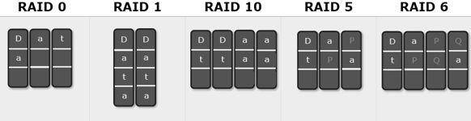
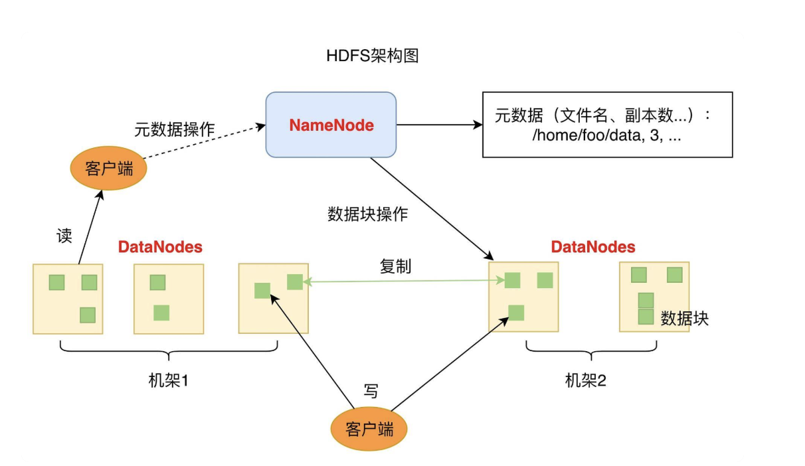
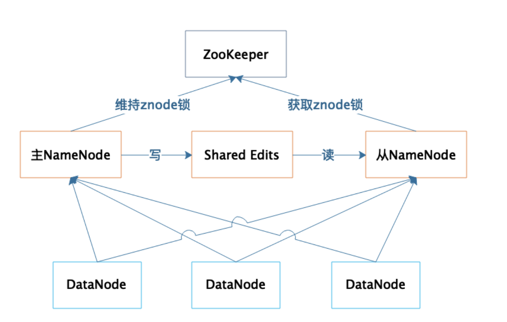
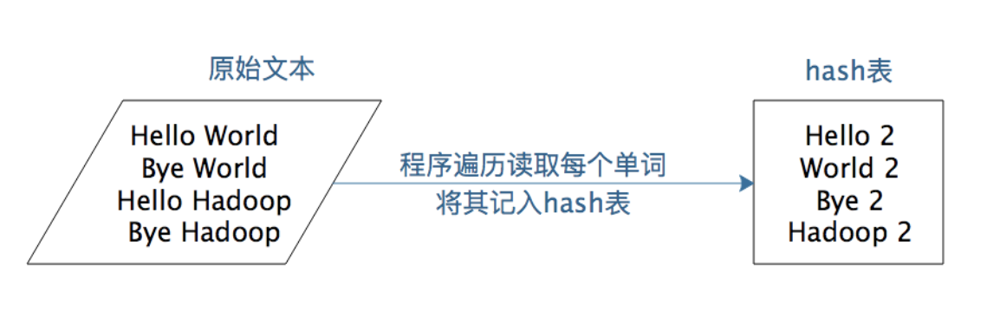
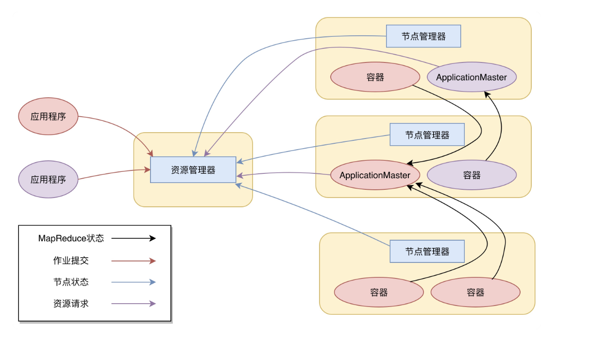
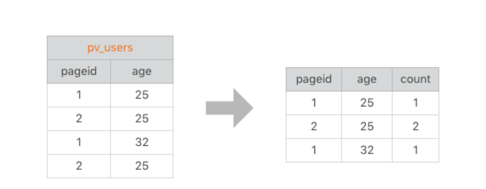
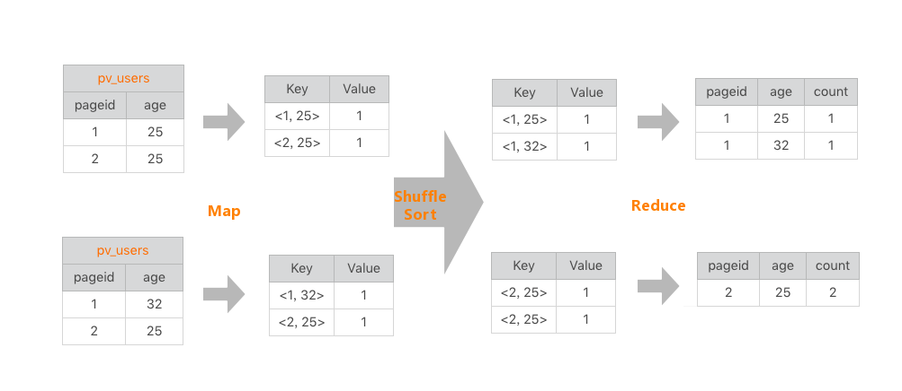
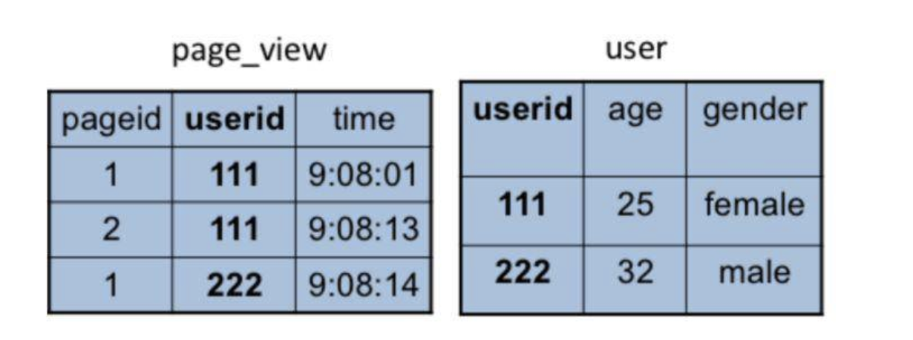
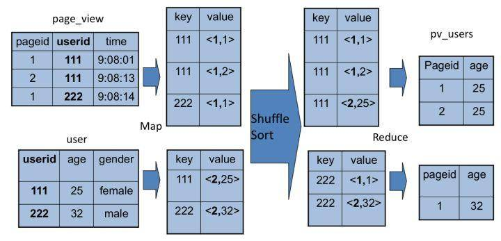

# 从0开始学大数据

## 1、大数据前世今生

今天我们常说的大数据技术，其实起源于 Google 在 2004 年前后发表的三篇论文，也就是我们经常听到的“三驾马车”，分别是分布式文件系统 GFS、大数据分布式计算框架 MapReduce 和 NoSQL 数据库系统 BigTable。

在 Hadoop 早期，MapReduce 既是一个执行引擎，又是一个资源调度框架，服务器集群的资源调度管理由 MapReduce 自己完成。但是这样不利于资源复用，也使得 MapReduce 非常臃肿。于是一个新项目启动了，将 MapReduce 执行引擎和资源调度分离开来，这就是 Yarn。2012 年，Yarn 成为一个独立的项目开始运营，随后被各类大数据产品支持，成为大数据平台上最主流的资源调度系统。

一般说来，像 MapReduce、Spark 这类计算框架处理的业务场景都被称作批处理计算，因为它们通常针对以“天”为单位产生的数据进行一次计算，然后得到需要的结果，这中间计算需要花费的时间大概是几十分钟甚至更长的时间。因为计算的数据是非在线得到的实时数据，而是历史数据，所以这类计算也被称为大数据离线计算。

而在大数据领域，还有另外一类应用场景，它们需要对实时产生的大量数据进行即时计算，比如对于遍布城市的监控摄像头进行人脸识别和嫌犯追踪。这类计算称为大数据流计算，相应地，有 Storm、Flink、Spark Streaming 等流计算框架来满足此类大数据应用的场景。 流式计算要处理的数据是实时在线产生的数据，所以这类计算也被称为大数据实时计算。

## 2、Hadoop原理与架构

### 2.1 移动计算比移动数据更划算

具体实现：

1. 将待处理的大规模数据存储在服务器集群的所有服务器上，主要使用 HDFS 分布式文件存储系统，将文件分成很多块（Block），以块为单位存储在集群的服务器上。
2. 大数据引擎根据集群里不同服务器的计算能力，在每台服务器上启动若干分布式任务执行进程，这些进程会等待给它们分配执行任务。
3. 使用大数据计算框架支持的编程模型进行编程，比如 Hadoop 的 MapReduce 编程模型，或者 Spark 的 RDD 编程模型。应用程序编写好以后，将其打包，MapReduce 和 Spark 都是在 JVM 环境中运行，所以打包出来的是一个 Java 的 JAR 包。
4. 用 Hadoop 或者 Spark 的启动命令执行这个应用程序的 JAR 包，首先执行引擎会解析程序要处理的数据输入路径，根据输入数据量的大小，将数据分成若干片（Split），每一个数据片都分配给一个任务执行进程去处理。
5. 任务执行进程收到分配的任务后，检查自己是否有任务对应的程序包，如果没有就去下载程序包，下载以后通过反射的方式加载程序。走到这里，最重要的一步，也就是移动计算就完成了。
6. 加载程序后，任务执行进程根据分配的数据片的文件地址和数据在文件内的偏移量读取数据，并把数据输入给应用程序相应的方法去执行，从而实现在分布式服务器集群中移动计算程序，对大规模数据进行并行处理的计算目标。

杀毒软件从服务器更新病毒库，然后在 Windows 内查杀病毒，也是一种移动计算（病毒库）比移动数据（Windows 可能感染病毒的程序）更划算的例子。

### 2.2 从RAID看垂直伸缩到水平伸缩的演化

不论是在单机时代还是分布式时代，大规模数据存储都需要解决几个核心问题，这些问题都是什么呢？总结一下，主要有以下三个方面。

1. **数据存储容量的问题**。既然大数据要解决的是数以 PB 计的数据计算问题，而一般的服务器磁盘容量通常 1～2TB，那么如何存储这么大规模的数据呢？
2. **数据读写速度的问题**。一般磁盘的连续读写速度为几十 MB，以这样的速度，几十 PB 的数据恐怕要读写到天荒地老。
3. **数据可靠性的问题**。磁盘大约是计算机设备中最易损坏的硬件了，通常情况一块磁盘使用寿命大概是一年，如果磁盘损坏了，数据怎么办？

在大数据技术出现之前，我们就需要面对这些关于存储的问题，对应的解决方案就是 RAID 技术。今天我们就先从 RAID 开始，一起看看大规模数据存储方式的演化过程。RAID（独立磁盘冗余阵列）技术是将多块普通磁盘组成一个阵列，共同对外提供服务。主要是为了改善磁盘的存储容量、读写速度，增强磁盘的可用性和容错能力。在 RAID 之前，要使用大容量、高可用、高速访问的存储系统需要专门的存储设备，这类设备价格要比 RAID 的几块普通磁盘贵几十倍。

常用 RAID 技术有图中下面这几种：

首先，我们先假设服务器有 N 块磁盘，RAID 0 是数据在从内存缓冲区写入磁盘时，根据磁盘数量将数据分成 N 份，这些数据同时并发写入 N 块磁盘，使得数据整体写入速度是一块磁盘的 N 倍；读取的时候也一样，因此 RAID  0 具有极快的数据读写速度。但是 RAID  0 不做数据备份，N 块磁盘中只要有一块损坏，数据完整性就被破坏，其他磁盘的数据也都无法使用了。

RAID 1 是数据在写入磁盘时，将一份数据同时写入两块磁盘，这样任何一块磁盘损坏都不会导致数据丢失，插入一块新磁盘就可以通过复制数据的方式自动修复，具有极高的可靠性。

结合 RAID  0 和 RAID  1 两种方案构成了 RAID 10，它是将所有磁盘 N 平均分成两份，数据同时在两份磁盘写入，相当于 RAID  1；但是平分成两份，在每一份磁盘（也就是 N/2 块磁盘）里面，利用 RAID  0 技术并发读写，这样既提高可靠性又改善性能。不过 RAID  10 的磁盘利用率较低，有一半的磁盘用来写备份数据。

一般情况下，一台服务器上很少出现同时损坏两块磁盘的情况，在只损坏一块磁盘的情况下，如果能利用其他磁盘的数据恢复损坏磁盘的数据，这样在保证可靠性和性能的同时，磁盘利用率也得到大幅提升。顺着这个思路，RAID 3 可以在数据写入磁盘的时候，将数据分成 N-1 份，并发写入 N-1 块磁盘，并在第 N 块磁盘记录校验数据，这样任何一块磁盘损坏（包括校验数据磁盘），都可以利用其他 N-1 块磁盘的数据修复。

但是在数据修改较多的场景中，任何磁盘数据的修改，都会导致第 N 块磁盘重写校验数据。频繁写入的后果是第 N 块磁盘比其他磁盘更容易损坏，需要频繁更换，所以 RAID  3 很少在实践中使用，因此在上面图中也就没有单独列出。

相比 RAID  3，RAID 5 是使用更多的方案。RAID  5 和 RAID  3 很相似，但是校验数据不是写入第 N 块磁盘，而是螺旋式地写入所有磁盘中。这样校验数据的修改也被平均到所有磁盘上，避免 RAID  3 频繁写坏一块磁盘的情况。

如果数据需要很高的可靠性，在出现同时损坏两块磁盘的情况下（或者运维管理水平比较落后，坏了一块磁盘但是迟迟没有更换，导致又坏了一块磁盘），仍然需要修复数据，这时候可以使用 RAID 6。RAID  6 和 RAID  5 类似，但是数据只写入 N-2 块磁盘，并螺旋式地在两块磁盘中写入校验信息（使用不同算法生成）。

从下面表格中你可以看到在相同磁盘数目（N）的情况下，各种 RAID 技术的比较:

### 2.3 HDFS，存储的王者

为什么 HDFS 的地位如此稳固呢？在整个大数据体系里面，最宝贵、最难以代替的资产就是数据，大数据所有的一切都要围绕数据展开。HDFS 作为最早的大数据存储系统，存储着宝贵的数据资产，各种新的算法、框架要想得到人们的广泛使用，必须支持 HDFS 才能获取已经存储在里面的数据。所以大数据技术越发展，新技术越多，HDFS 得到的支持越多，我们越离不开 HDFS。HDFS 也许不是最好的大数据存储技术，但依然最重要的大数据存储技术。

**HDFS 是如何实现大数据高速、可靠的存储和访问的呢？**

上节说到，RAID 将数据分片后在多块磁盘上并发进行读写访问，从而提高了存储容量、加快了访问速度，并通过数据的冗余校验提高了数据的可靠性，即使某块磁盘损坏也不会丢失数据。将 RAID 的设计理念扩大到整个分布式服务器集群，就产生了分布式文件系统，Hadoop 分布式文件系统的核心原理就是如此。

和 RAID 在多个磁盘上进行文件存储及并行读写的思路一样，HDFS 是在一个大规模分布式服务器集群上，对数据分片后进行并行读写及冗余存储。因为 HDFS 可以部署在一个比较大的服务器集群上，集群中所有服务器的磁盘都可供 HDFS 使用，所以整个 HDFS 的存储空间可以达到 PB 级容量。

HDFS架构如下图，包括两个组件：一个是DataNode，一个是NameNode。

DataNode 负责文件数据的存储和读写操作，HDFS 将文件数据分割成若干数据块（Block），每个 DataNode 存储一部分数据块，这样文件就分布存储在整个 HDFS 服务器集群中。应用程序客户端（Client）可以并行对这些数据块进行访问，从而使得 HDFS 可以在服务器集群规模上实现数据并行访问，极大地提高了访问速度。

NameNode 负责整个分布式文件系统的元数据（MetaData）管理，也就是文件路径名、数据块的 ID 以及存储位置等信息，相当于操作系统中文件分配表（FAT）的角色。HDFS 为了保证数据的高可用，会将一个数据块复制为多份（缺省情况为 3 份），并将多份相同的数据块存储在不同的服务器上，甚至不同的机架上。这样当有磁盘损坏，或者某个 DataNode 服务器宕机，甚至某个交换机宕机，导致其存储的数据块不能访问的时候，客户端会查找其备份的数据块进行访问。

和 RAID 一样，数据分成若干数据块后存储到不同服务器上，可以实现数据大容量存储，并且不同分片的数据可以并行进行读 / 写操作，进而实现数据的高速访问。你可以看到，HDFS 的大容量存储和高速访问相对比较容易实现，但是 HDFS 是如何保证存储的高可用性呢？

1. 数据存储故障容错  磁盘介质在存储过程中受环境或者老化影响，其存储的数据可能会出现错乱。HDFS 的应对措施是，对于存储在 DataNode 上的数据块，计算并存储校验和（CheckSum）。在读取数据的时候，重新计算读取出来的数据的校验和，如果校验不正确就抛出异常，应用程序捕获异常后就到其他 DataNode 上读取备份数据。
2. 磁盘故障容错  如果 DataNode 监测到本机的某块磁盘损坏，就将该块磁盘上存储的所有 BlockID 报告给 NameNode，NameNode 检查这些数据块还在哪些 DataNode 上有备份，通知相应的 DataNode 服务器将对应的数据块复制到其他服务器上，以保证数据块的备份数满足要求。
3. DataNode 故障容错 DataNode 会通过心跳和 NameNode 保持通信，如果 DataNode 超时未发送心跳，NameNode 就会认为这个 DataNode 已经宕机失效，立即查找这个 DataNode 上存储的数据块有哪些，以及这些数据块还存储在哪些服务器上，随后通知这些服务器再复制一份数据块到其他服务器上，保证 HDFS 存储的数据块备份数符合用户设置的数目，即使再出现服务器宕机，也不会丢失数据。
4. NameNode 故障容错 NameNode 是整个 HDFS 的核心，记录着 HDFS 文件分配表信息，所有的文件路径和数据块存储信息都保存在 NameNode，如果 NameNode 故障，整个 HDFS 系统集群都无法使用；如果 NameNode 上记录的数据丢失，整个集群所有 DataNode 存储的数据也就没用了。

所以，NameNode 高可用容错能力非常重要。NameNode 采用主从热备的方式提供高可用服务，请看下图。

集群部署两台 NameNode 服务器，一台作为主服务器提供服务，一台作为从服务器进行热备，两台服务器通过 ZooKeeper 选举，主要是通过争夺 znode 锁资源，决定谁是主服务器。而 DataNode 则会向两个 NameNode 同时发送心跳数据，但是只有主 NameNode 才能向 DataNode 返回控制信息。

正常运行期间，主从 NameNode 之间通过一个共享存储系统 shared edits 来同步文件系统的元数据信息。当主 NameNode 服务器宕机，从 NameNode 会通过 ZooKeeper 升级成为主服务器，并保证 HDFS 集群的元数据信息，也就是文件分配表信息完整一致。

如何保证系统可用？一般说来，常用的保证系统可用性的策略有**冗余备份、失效转移和降级限流**。

比如冗余备份，任何程序、任何数据，都至少要有一个备份，也就是说程序至少要部署到两台服务器，数据至少要备份到另一台服务器上。此外，稍有规模的互联网企业都会建设多个数据中心，数据中心之间互相进行备份，用户请求可能会被分发到任何一个数据中心，即所谓的异地多活，在遭遇地域性的重大故障和自然灾害的时候，依然保证应用的高可用。

当要访问的程序或者数据无法访问时，需要将访问请求转移到备份的程序或者数据所在的服务器上，这也就是失效转移。失效转移你应该注意的是失效的鉴定，像 NameNode 这样主从服务器管理同一份数据的场景，如果从服务器错误地以为主服务器宕机而接管集群管理，会出现主从服务器一起对 DataNode 发送指令，进而导致集群混乱，也就是所谓的“脑裂”。这也是这类场景选举主服务器时，引入 ZooKeeper 的原因。ZooKeeper 的工作原理，我将会在后面专门分析。

当大量的用户请求或者数据处理请求到达的时候，由于计算资源有限，可能无法处理如此大量的请求，进而导致资源耗尽，系统崩溃。这种情况下，可以拒绝部分请求，即进行限流；也可以关闭部分功能，降低资源消耗，即进行降级。限流是互联网应用的常备功能，因为超出负载能力的访问流量在何时会突然到来，你根本无法预料，所以必须提前做好准备，当遇到突发高峰流量时，就可以立即启动限流。而降级通常是为可预知的场景准备的，比如电商的“双十一”促销，为了保障促销活动期间应用的核心功能能够正常运行，比如下单功能，可以对系统进行降级处理，关闭部分非重要功能，比如商品评价功能。

我们小结一下，看看 HDFS 是如何通过大规模分布式服务器集群实现数据的大容量、高速、可靠存储、访问的。

1. 文件数据以数据块的方式进行切分，数据块可以存储在集群任意 DataNode 服务器上，所以 HDFS 存储的文件可以非常大，一个文件理论上可以占据整个 HDFS 服务器集群上的所有磁盘，实现了大容量存储。
2. HDFS 一般的访问模式是通过 MapReduce 程序在计算时读取，MapReduce 对输入数据进行分片读取，通常一个分片就是一个数据块，每个数据块分配一个计算进程，这样就可以同时启动很多进程对一个 HDFS 文件的多个数据块进行并发访问，从而实现数据的高速访问。关于 MapReduce 的具体处理过程，我们会在专栏后面详细讨论
3. DataNode 存储的数据块会进行复制，使每个数据块在集群里有多个备份，保证了数据的可靠性，并通过一系列的故障容错手段实现 HDFS 系统中主要组件的高可用，进而保证数据和整个系统的高可用。

### 2.4 为什么说MapReduce既是编程模型又是计算框架？

开发人员必须基于 MapReduce 编程模型进行编程开发，然后将程序通过 MapReduce 计算框架分发到 Hadoop 集群中运行。我们先看一下作为编程模型的 MapReduce。

为什么说 MapReduce 是一种非常简单又非常强大的编程模型？简单在于其编程模型只包含 Map 和 Reduce 两个过程，map 的主要输入是一对 <Key, Value> 值，经过 map 计算后输出一对 <Key, Value> 值；然后将相同 Key 合并，形成 <Key, Value 集合 >；再将这个 <Key, Value 集合 > 输入 reduce，经过计算输出零个或多个 <Key, Value> 对。同时，MapReduce 又是非常强大的，不管是关系代数运算（SQL 计算），还是矩阵运算（图计算），大数据领域几乎所有的计算需求都可以通过 MapReduce 编程来实现。

例子：wordCount    WordCount 主要解决的是文本处理中词频统计的问题，就是统计文本中每一个单词出现的次数。如果只是统计一篇文章的词频，几十 KB 到几 MB 的数据，只需要写一个程序，将数据读入内存，建一个 Hash 表记录每个词出现的次数就可以了。这个统计过程你可以看下面这张图。

简单说来，就是建一个 Hash 表，然后将字符串里的每个词放到这个 Hash 表里。如果这个词第一次放到 Hash 表，就新建一个 Key、Value 对，Key 是这个词，Value 是 1。如果 Hash 表里已经有这个词了，那么就给这个词的 Value  +  1。小数据量用单机统计词频很简单，但是如果想统计全世界互联网所有网页（数万亿计）的词频数（而这正是 Google 这样的搜索引擎的典型需求），不可能写一个程序把全世界的网页都读入内存，这时候就需要用 MapReduce 编程来解决。

WordCount 的 MapReduce 程序如下:

~~~java

public class WordCount {

  public static class TokenizerMapper
       extends Mapper<Object, Text, Text, IntWritable>{

    private final static IntWritable one = new IntWritable(1);
    private Text word = new Text();

    public void map(Object key, Text value, Context context
                    ) throws IOException, InterruptedException {
      StringTokenizer itr = new StringTokenizer(value.toString());
      while (itr.hasMoreTokens()) {
        word.set(itr.nextToken());
        context.write(word, one);
      }
    }
  }

  public static class IntSumReducer
       extends Reducer<Text,IntWritable,Text,IntWritable> {
    private IntWritable result = new IntWritable();

    public void reduce(Text key, Iterable<IntWritable> values,
                       Context context
                       ) throws IOException, InterruptedException {
      int sum = 0;
      for (IntWritable val : values) {
        sum += val.get();
      }
      result.set(sum);
      context.write(key, result);
    }
  }
}
~~~

你可以从这段代码中看到，MapReduce 版本 WordCount 程序的核心是一个 map 函数和一个 reduce 函数。map 函数的输入主要是一个 <Key, Value> 对，在这个例子里，Value 是要统计的所有文本中的一行数据，Key 在一般计算中都不会用到。

map 函数的计算过程是，将这行文本中的单词提取出来，针对每个单词输出一个 <word,  1> 这样的 <Key, Value> 对。MapReduce 计算框架会将这些 <word , 1> 收集起来，将相同的 word 放在一起，形成 <word , <1,1,1,1,1,1,1…>> 这样的 <Key, Value 集合 > 数据，然后将其输入给 reduce 函数。

这里 reduce 的输入参数 Values 就是由很多个 1 组成的集合，而 Key 就是具体的单词 word。reduce 函数的计算过程是，将这个集合里的 1 求和，再将单词（word）和这个和（sum）组成一个 <Key, Value>，也就是 <word, sum> 输出。每一个输出就是一个单词和它的词频统计总和。一个 map 函数可以针对一部分数据进行运算，这样就可以将一个大数据切分成很多块（这也正是 HDFS 所做的），MapReduce 计算框架为每个数据块分配一个 map 函数去计算，从而实现大数据的分布式计算。

假设有两个数据块的文本数据需要进行词频统计，MapReduce 计算过程如下图所示。

以上就是 MapReduce 编程模型的主要计算过程和原理，但是这样一个 MapReduce 程序要想在分布式环境中执行，并处理海量的大规模数据，还需要一个计算框架，能够调度执行这个 MapReduce 程序，使它在分布式的集群中并行运行，而这个计算框架也叫 MapReduce。所以，当我们说 MapReduce 的时候，可能指编程模型，也就是一个 MapReduce 程序；也可能是指计算框架，调度执行大数据的分布式计算。

#### 话说洞察力

洞察力源于对事物的抽象能力，在遇到问题的时候，我就会停下来思考：这个问题为什么会出现，它揭示出来背后的规律是什么，我应该如何做。不断训练自己，遇到问题的时候，停下来思考一下：这些现象背后的规律是什么。有时候并不需要多么艰深的思考，仅仅就是停一下，就会让你察觉到以前不曾注意到的一些情况，进而发现事物的深层规律。这就是洞察力。大数据领域的一个架构模式，**集中管理，分布存储与计算**。

**我们常常意识不到问题的存在，直到有人解决了这些问题。**
移动计算比移动数据更划算这一大数据计算基本原则

### 2.5 MapReduce计算框架是如何运作的

在实践中，这个过程有两个关键问题需要处理：

1. 如何为每个数据块分配一个 Map 计算任务，也就是代码是如何发送到数据块所在服务器的，发送后是如何启动的，启动以后如何知道自己需要计算的数据在文件什么位置（BlockID 是什么）。
2. 处于不同服务器的 map 输出的 <Key, Value> ，如何把相同的 Key 聚合在一起发送给 Reduce 任务进行处理。

以上两个问题对应着上图中出现的“MapReduce框架处理”部分，具体来说，它们分别是 MapReduce 作业启动和运行，以及 MapReduce 数据合并与连接。

#### 2.5.1 MapReduce 作业启动和运行机制

我们以 Hadoop  1 为例，MapReduce 运行过程涉及三类关键进程。

1. 大数据应用进程。这类进程是启动 MapReduce 程序的主入口，主要是指定 Map 和 Reduce 类、输入输出文件路径等，并提交作业给 Hadoop 集群，也就是下面提到的 JobTracker 进程。这是由用户启动的 MapReduce 程序进程，比如我们上期提到的 WordCount 程序。
2. JobTracker 进程。这类进程根据要处理的输入数据量，命令下面提到的 TaskTracker 进程启动相应数量的 Map 和 Reduce 进程任务，并管理整个作业生命周期的任务调度和监控。这是 Hadoop 集群的常驻进程，需要注意的是，JobTracker 进程在整个 Hadoop 集群全局唯一。
3. TaskTracker 进程。这个进程负责启动和管理 Map 进程以及 Reduce 进程。因为需要每个数据块都有对应的 map 函数，TaskTracker 进程通常和 HDFS 的 DataNode 进程启动在同一个服务器。也就是说，Hadoop 集群中绝大多数服务器同时运行 DataNode 进程和 TaskTracker 进程。

JobTracker 进程和 TaskTracker 进程是主从关系，主服务器通常只有一台（或者另有一台备机提供高可用服务，但运行时只有一台服务器对外提供服务，真正起作用的只有一台），从服务器可能有几百上千台，所有的从服务器听从主服务器的控制和调度安排。主服务器负责为应用程序分配服务器资源以及作业执行的调度，而具体的计算操作则在从服务器上完成。

具体来看，MapReduce 的主服务器就是 JobTracker，从服务器就是 TaskTracker。还记得我们讲 HDFS 也是主从架构吗，HDFS 的主服务器是 NameNode，从服务器是 DataNode。后面会讲到的 Yarn、Spark 等也都是这样的架构，这种一主多从的服务器架构也是绝大多数大数据系统的架构方案。

可重复使用的架构方案叫作架构模式，一主多从可谓是大数据领域的最主要的架构模式。主服务器只有一台，掌控全局；从服务器很多台，负责具体的事情。这样很多台服务器可以有效组织起来，对外表现出一个统一又强大的计算能力。讲到这里，我们对 MapReduce 的启动和运行机制有了一个直观的了解。那具体的作业启动和计算过程到底是怎样的呢？我根据上面所讲的绘制成一张图，你可以从图中一步一步来看，感受一下整个流程。

如果我们把这个计算过程看作一次小小的旅行，这个旅程可以概括如下：

1. 应用进程 JobClient 将用户作业 JAR 包存储在 HDFS 中，将来这些 JAR 包会分发给 Hadoop 集群中的服务器执行 MapReduce 计算。
2. 应用程序提交 job 作业给 JobTracker。
3. JobTracker 根据作业调度策略创建 JobInProcess 树，每个作业都会有一个自己的 JobInProcess 树。
4. JobInProcess 根据输入数据分片数目（通常情况就是数据块的数目）和设置的 Reduce 数目创建相应数量的 TaskInProcess。
5. TaskTracker 进程和 JobTracker 进程进行定时通信。
6. 如果 TaskTracker 有空闲的计算资源（有空闲 CPU 核心），JobTracker 就会给它分配任务。分配任务的时候会根据 TaskTracker 的服务器名字匹配在同一台机器上的数据块计算任务给它，使启动的计算任务正好处理本机上的数据，以实现我们一开始就提到的“移动计算比移动数据更划算”。
7. TaskTracker 收到任务后根据任务类型（是 Map 还是 Reduce）和任务参数（作业 JAR 包路径、输入数据文件路径、要处理的数据在文件中的起始位置和偏移量、数据块多个备份的 DataNode 主机名等），启动相应的 Map 或者 Reduce 进程。
8. Map 或者 Reduce 进程启动后，检查本地是否有要执行任务的 JAR 包文件，如果没有，就去 HDFS 上下载，然后加载 Map 或者 Reduce 代码开始执行。
9. 如果是 Map 进程，从 HDFS 读取数据（通常要读取的数据块正好存储在本机）；如果是 Reduce 进程，将结果数据写出到 HDFS。

#### 2.5.2 MapReduce 数据合并与连接机制

MapReduce 计算真正产生奇迹的地方是数据的合并与连接。

让我先回到上一期 MapReduce 编程模型的 WordCount 例子中，我们想要统计相同单词在所有输入数据中出现的次数，而一个 Map 只能处理一部分数据，一个热门单词几乎会出现在所有的 Map 中，这意味着同一个单词必须要合并到一起进行统计才能得到正确的结果。事实上，几乎所有的大数据计算场景都需要处理数据关联的问题，像 WordCount 这种比较简单的只要对 Key 进行合并就可以了，对于像数据库的 join 操作这种比较复杂的，需要对两种类型（或者更多类型）的数据根据 Key 进行连接。在 map 输出与 reduce 输入之间，MapReduce 计算框架处理数据合并与连接操作，这个操作有个专门的词汇叫 shuffle。那到底什么是 shuffle？shuffle 的具体过程又是怎样的呢？请看下图。

每个 Map 任务的计算结果都会写入到本地文件系统，等 Map 任务快要计算完成的时候，MapReduce 计算框架会启动 shuffle 过程，在 Map 任务进程调用一个 Partitioner 接口，对 Map 产生的每个 <Key, Value> 进行 Reduce 分区选择，然后通过 HTTP 通信发送给对应的 Reduce 进程。这样不管 Map 位于哪个服务器节点，相同的 Key 一定会被发送给相同的 Reduce 进程。Reduce 任务进程对收到的 <Key, Value> 进行排序和合并，相同的 Key 放在一起，组成一个 <Key, Value 集合 > 传递给 Reduce 执行。

map 输出的 <Key, Value>shuffle 到哪个 Reduce 进程是这里的关键，它是由 Partitioner 来实现，MapReduce 框架默认的 Partitioner 用 Key 的哈希值对 Reduce 任务数量取模，相同的 Key 一定会落在相同的 Reduce 任务 ID 上。从实现上来看的话，这样的 Partitioner 代码只需要一行。**分布式计算需要将不同服务器上的相关数据合并到一起进行下一步计算，这就是 shuffle。**

~~~java
 /** Use {@link Object#hashCode()} to partition. */ 
public int getPartition(K2 key, V2 value, int numReduceTasks) { 
    return (key.hashCode() & Integer.MAX_VALUE) % numReduceTasks; 
 }
~~~

shuffle 是大数据计算过程中最神奇的地方，不管是 MapReduce 还是 Spark，只要是大数据批处理计算，一定都会有 shuffle 过程，只有让数据关联起来，数据的内在关系和价值才会呈现出来。如果你不理解 shuffle，肯定会在 map 和 reduce 编程中产生困惑，不知道该如何正确设计 map 的输出和 reduce 的输入。shuffle 也是整个 MapReduce 过程中最难、最消耗性能的地方，在 MapReduce 早期代码中，一半代码都是关于 shuffle 处理的。

### 2.6 Yarn--资源调度框架

Hadoop 主要是由三部分组成，除了前面我讲过的分布式文件系统 HDFS、分布式计算框架 MapReduce，还有一个是分布式集群资源调度框架 Yarn。但是 Yarn 并不是随 Hadoop 的推出一开始就有的，Yarn 作为分布式集群的资源调度框架，它的出现伴随着 Hadoop 的发展，使 Hadoop 从一个单一的大数据计算引擎，成为一个集存储、计算、资源管理为一体的完整大数据平台，进而发展出自己的生态体系，成为大数据的代名词。

先回忆一下我们学习的 MapReduce 的架构，在 MapReduce 应用程序的启动过程中，最重要的就是要把 MapReduce 程序分发到大数据集群的服务器上，在 Hadoop  1 中，这个过程主要是通过 TaskTracker 和 JobTracker 通信来完成。

这种架构方案的主要缺点是，服务器集群资源调度管理和 MapReduce 执行过程耦合在一起，如果想在当前集群中运行其他计算任务，比如 Spark 或者 Storm，就无法统一使用集群中的资源了。

在 Hadoop 早期的时候，大数据技术就只有 Hadoop 一家，这个缺点并不明显。但随着大数据技术的发展，各种新的计算框架不断出现，我们不可能为每一种计算框架部署一个服务器集群，而且就算能部署新集群，数据还是在原来集群的 HDFS 上。所以我们需要把 MapReduce 的资源管理和计算框架分开，这也是 Hadoop  2 最主要的变化，就是将 Yarn 从 MapReduce 中分离出来，成为一个独立的资源调度框架。

Yarn 是“Yet Another Resource Negotiator”的缩写，字面意思就是“另一种资源调度器”。事实上，在 Hadoop 社区决定将资源管理从 Hadoop  1 中分离出来，独立开发 Yarn 的时候，业界已经有一些大数据资源管理产品了，比如 Mesos 等，所以 Yarn 的开发者索性管自己的产品叫“另一种资源调度器”。这种命名方法并不鲜见，曾经名噪一时的 Java 项目编译工具 Ant 就是“Another Neat Tool”的缩写，意思是“另一种整理工具”。

yarn的架构如图：

从图上看，Yarn 包括两个部分：一个是资源管理器（Resource Manager），一个是节点管理器（Node Manager）。这也是 Yarn 的两种主要进程：ResourceManager 进程负责整个集群的资源调度管理，通常部署在独立的服务器上；NodeManager 进程负责具体服务器上的资源和任务管理，在集群的每一台计算服务器上都会启动，基本上跟 HDFS 的 DataNode 进程一起出现。

具体说来，资源管理器又包括两个主要组件：调度器和应用程序管理器。

调度器其实就是一个资源分配算法，根据应用程序（Client）提交的资源申请和当前服务器集群的资源状况进行资源分配。Yarn 内置了几种资源调度算法，包括 Fair Scheduler、Capacity Scheduler 等，你也可以开发自己的资源调度算法供 Yarn 调用。

Yarn 进行资源分配的单位是容器（Container），每个容器包含了一定量的内存、CPU 等计算资源，默认配置下，每个容器包含一个 CPU 核心。容器由 NodeManager 进程启动和管理，NodeManger 进程会监控本节点上容器的运行状况并向 ResourceManger 进程汇报。

应用程序管理器负责应用程序的提交、监控应用程序运行状态等。应用程序启动后需要在集群中运行一个 ApplicationMaster，ApplicationMaster 也需要运行在容器里面。每个应用程序启动后都会先启动自己的 ApplicationMaster，由 ApplicationMaster 根据应用程序的资源需求进一步向 ResourceManager 进程申请容器资源，得到容器以后就会分发自己的应用程序代码到容器上启动，进而开始分布式计算。

我们以一个 MapReduce 程序为例，来看一下 Yarn 的整个工作流程。

1. 我们向 Yarn 提交应用程序，包括 MapReduce ApplicationMaster、我们的 MapReduce 程序，以及 MapReduce Application 启动命令。
2. ResourceManager 进程和 NodeManager 进程通信，根据集群资源，为用户程序分配第一个容器，并将 MapReduce ApplicationMaster 分发到这个容器上面，并在容器里面启动 MapReduce ApplicationMaster。
3. MapReduce ApplicationMaster 启动后立即向 ResourceManager 进程注册，并为自己的应用程序申请容器资源。
4. MapReduce ApplicationMaster 申请到需要的容器后，立即和相应的 NodeManager 进程通信，将用户 MapReduce 程序分发到 NodeManager 进程所在服务器，并在容器中运行，运行的就是 Map 或者 Reduce 任务。
5. Map 或者 Reduce 任务在运行期和 MapReduce ApplicationMaster 通信，汇报自己的运行状态，如果运行结束，MapReduce ApplicationMaster 向 ResourceManager 进程注销并释放所有的容器资源。

MapReduce 如果想在 Yarn 上运行，就需要开发遵循 Yarn 规范的 MapReduce ApplicationMaster，相应地，其他大数据计算框架也可以开发遵循 Yarn 规范的 ApplicationMaster，这样在一个 Yarn 集群中就可以同时并发执行各种不同的大数据计算框架，实现资源的统一调度管理。

开头我们管 HDFS 叫分布式文件系统，管 MapReduce 叫分布式计算框架，管 Yarn 叫分布式集群资源调度框架。为什么 HDFS 是系统，而 MapReduce 和 Yarn 则是框架？**框架在架构设计上遵循一个重要的设计原则叫“依赖倒转原则”，依赖倒转原则是高层模块不能依赖低层模块，它们应该共同依赖一个抽象，这个抽象由高层模块定义，由低层模块实现。**

所谓高层模块和低层模块的划分，简单说来就是在调用链上，处于前面的是高层，后面的是低层。我们以典型的 Java Web 应用举例，用户请求在到达服务器以后，最先处理用户请求的是 Java Web 容器，比如 Tomcat、Jetty 这些，通过监听 80 端口，把 HTTP 二进制流封装成 Request 对象；然后是 Spring MVC 框架，把 Request 对象里的用户参数提取出来，根据请求的 URL 分发给相应的 Model 对象处理；再然后就是我们的应用程序，负责处理用户请求，具体来看，还会分成服务层、数据持久层等。在这个例子中，Tomcat 相对于 Spring MVC 就是高层模块，Spring MVC 相对于我们的应用程序也算是高层模块。我们看到虽然 Tomcat 会调用 Spring MVC，因为 Tomcat 要把 Request 交给 Spring MVC 处理，但是 Tomcat 并没有依赖 Spring MVC，Tomcat 的代码里不可能有任何一行关于 Spring MVC 的代码。

那么，Tomcat 如何做到不依赖 Spring MVC，却可以调用 Spring MVC？

秘诀就是 Tomcat 和 Spring MVC 都依赖 J2EE 规范，Spring MVC 实现了 J2EE 规范的 HttpServlet 抽象类，即 DispatcherServlet，并配置在 web.xml 中。这样，Tomcat 就可以调用 DispatcherServlet 处理用户发来的请求。同样 Spring MVC 也不需要依赖我们写的 Java 代码，而是通过依赖 Spring MVC 的配置文件或者 Annotation 这样的抽象，来调用我们的 Java 代码。所以，Tomcat 或者 Spring MVC 都可以称作是框架，它们都遵循依赖倒转原则。

Yarn 作为一个大数据资源调度框架，调度的是大数据计算引擎本身。它不像 MapReduce 或 Spark 编程，每个大数据应用开发者都需要根据需求开发自己的 MapReduce 程序或者 Spark 程序。而现在主流的大数据计算引擎所使用的 Yarn 模块，也早已被这些计算引擎的开发者做出来供我们使用了。作为普通的大数据开发者，我们几乎没有机会编写 Yarn 的相关程序。但是，这是否意味着只有大数据计算引擎的开发者需要基于 Yarn 开发，才需要理解 Yarn 的实现原理呢？恰恰相反，我认为理解 Yarn 的工作原理和架构，对于正确使用大数据技术，理解大数据的工作原理，是非常重要的。在云计算的时代，一切资源都是动态管理的，理解这种动态管理的原理对于理解云计算也非常重要。Yarn 作为一个大数据平台的资源管理框架，简化了应用场景，对于帮助我们理解云计算的资源管理很有帮助。

### 2.7 我们能从Hadoop中学到什么

**一主多从的架构方案。**HDFS，一个 NameNode，多个 DataNode；MapReduce  1，一个 JobTracker，多个 TaskTracker；Yarn，一个 ResourceManager，多个 NodeManager。事实上，很多大数据产品都是这样的架构方案：Storm，一个 Nimbus，多个 Supervisor；Spark，一个 Master，多个 Slave。大数据因为要对数据和计算任务进行统一管理，所以和互联网在线应用不同，需要一个全局管理者。而在线应用因为每个用户请求都是独立的，而且为了高性能和便于集群伸缩，会尽量避免有全局管理者。

所以我们从 Hadoop 中可以学到大数据领域的一个架构模式，**也就是集中管理，分布存储与计算**。

**5-20-2学习法则**
5分钟了解这新知识的特点、应用场景、要解决的问题
20分钟理解它的设计原理、核心思路
2小时看关键的设计细节，做一个Demo

## 3、大数据生态系主要产品原理与架构

### 3.1 Hive是如何让MapReduce实现SQL操作的？

~~~sql
SELECT pageid, age, count(1) FROM pv_users GROUP BY pageid, age;
~~~

上图左边是要分析的数据表，右边是分析结果。实际上把左边表相同的行进行累计求和，就得到右边的表了，看起来跟 WordCount 的计算很相似。确实也是这样，我们看下这条 SQL 语句的 MapReduce 的计算过程，按照 MapReduce 编程模型，map 和 reduce 函数的输入输出以及函数处理过程分别是什么。

首先，看下 map 函数的输入 Key 和 Value，我们主要看 Value。Value 就是左边表中每一行的数据，比如 <1, 25> 这样。map 函数的输出就是以输入的 Value 作为 Key，Value 统一设为 1，比如 <<1, 25>, 1> 这样。map 函数的输出经过 shuffle 以后，相同的 Key 及其对应的 Value 被放在一起组成一个 <Key, Value 集合 >，作为输入交给 reduce 函数处理。比如 <<2, 25>, 1> 被 map 函数输出两次，那么到了 reduce 这里，就变成输入 <<2, 25>, <1, 1>>，这里的 Key 是 <2, 25>，Value 集合是 <1, 1>。在 reduce 函数内部，Value 集合里所有的数字被相加，然后输出。所以 reduce 的输出就是 <<2, 25>, 2>。

画成图，就是如下所示：

这样一条很有实用价值的 SQL 就被很简单的 MapReduce 计算过程处理好了。在数据仓库中，SQL 是最常用的分析工具，既然一条 SQL 可以通过 MapReduce 程序实现，那么有没有工具能够自动将 SQL 生成 MapReduce 代码呢？这样数据分析师只要输入 SQL，就可以自动生成 MapReduce 可执行的代码，然后提交 Hadoop 执行，也就完美解决了我们最开始提出的问题。问题的答案，也就是这个神奇的工具就是 Hadoop 大数据仓库 Hive。

#### 3.1.1 Hive架构

Hive 能够直接处理我们输入的 SQL 语句（Hive 的 SQL 语法和数据库标准 SQL 略有不同），调用 MapReduce 计算框架完成数据分析操作。下面是它的架构图，我们结合架构图来看看 Hive 是如何实现将 SQL 生成 MapReduce 可执行代码的。

我们通过 Hive 的 Client（Hive 的命令行工具，JDBC 等）向 Hive 提交 SQL 命令。如果是创建数据表的 DDL（数据定义语言），Hive 就会通过执行引擎 Driver 将数据表的信息记录在 Metastore 元数据组件中，这个组件通常用一个关系数据库实现，记录表名、字段名、字段类型、关联 HDFS 文件路径等这些数据库的 Meta 信息（元信息）。

如果我们提交的是查询分析数据的 DQL（数据查询语句），Driver 就会将该语句提交给自己的编译器 Compiler 进行语法分析、语法解析、语法优化等一系列操作，最后生成一个 MapReduce 执行计划。然后根据执行计划生成一个 MapReduce 的作业，提交给 Hadoop MapReduce 计算框架处理。

对于一个较简单的 SQL 命令，比如：执行计划如下图

~~~sql
SELECT * FROM status_updates WHERE status LIKE ‘michael jackson’;
~~~

Hive 内部预置了很多函数，Hive 的执行计划就是根据 SQL 语句生成这些函数的 DAG（有向无环图），然后封装进 MapReduce 的 map 和 reduce 函数中。这个例子中，map 函数调用了三个 Hive 内置函数 TableScanOperator、FilterOperator、FileOutputOperator，就完成了 map 计算，而且无需 reduce 函数。

#### 3.1.2 Hive 如何实现 join 操作

除了上面这些简单的聚合（group by）、过滤（where）操作，Hive 还能执行连接（join on）操作。文章开头的例子中，pv_users 表的数据在实际中是无法直接得到的，因为 pageid 数据来自用户访问日志，每个用户进行一次页面浏览，就会生成一条访问记录，保存在 page_view 表中。而 age 年龄信息则记录在用户表 user 中。

这两张表都有一个相同的字段 userid，根据这个字段可以将两张表连接起来，生成前面例子的 pv_users 表，SQL 命令是

~~~sql
SELECT pv.pageid, u.age FROM page_view pv JOIN user u ON (pv.userid = u.userid);
~~~

这个 SQL 命令也可以转化为 MapReduce 计算，连接的过程如下图所示:

从图上看，join 的 MapReduce 计算过程和前面的 group by 稍有不同，因为 join 涉及两张表，来自两个文件（夹），所以需要在 map 输出的时候进行标记，比如来自第一张表的输出 Value 就记录为 <1, X>，这里的 1 表示数据来自第一张表。这样经过 shuffle 以后，相同的 Key 被输入到同一个 reduce 函数，就可以根据表的标记对 Value 数据求笛卡尔积，用第一张表的每条记录和第二张表的每条记录连接，输出就是 join 的结果。所以我们如果打开 Hive 的源代码，看 join 相关的代码，会看到一个两层 for 循环，对来自两张表的记录进行连接操作。

### 3.2 Spark横空出世

Spark 和 MapReduce 相比，有更快的执行速度。除了速度更快，Spark 和 MapReduce 相比，还有更简单易用的编程模型。使用 Scala 语言在 Spark 上编写 WordCount 程序，主要代码只需要三行。

~~~scala
val textFile = sc.textFile("hdfs://...") //根据 HDFS 路径生成一个输入数据 RDD。
//在输入数据 RDD 上执行 3 个操作，得到一个新的 RDD。
val counts = textFile.flatMap(line => line.split(" "))//将输入数据的每一行文本用空格拆分成单词。
                 .map(word => (word, 1))//将每个单词进行转换，word => (word, 1)，生成 <Key, Value> 的结构。
                 .reduceByKey(_ + _)//相同的 Key 进行统计，统计方式是对 Value 求和，(_ + _)。
counts.saveAsTextFile("hdfs://...") //将这个 RDD 保存到 HDFS。
~~~

RDD 是 Spark 的核心概念，是弹性数据集（Resilient Distributed Datasets）的缩写。RDD 既是 Spark 面向开发者的编程模型，又是 Spark 自身架构的核心元素。

我们先来看看作为 Spark 编程模型的 RDD。我们知道，大数据计算就是在大规模的数据集上进行一系列的数据计算处理。MapReduce 针对输入数据，将计算过程分为两个阶段，一个 Map 阶段，一个 Reduce 阶段，可以理解成是**面向过程的大数据计算**。我们在用 MapReduce 编程的时候，思考的是，如何将计算逻辑用 Map 和 Reduce 两个阶段实现，map 和 reduce 函数的输入和输出是什么，这也是我们在学习 MapReduce 编程的时候一再强调的。

而 Spark 则直接针对数据进行编程，将大规模数据集合抽象成一个 RDD 对象，然后在这个 RDD 上进行各种计算处理，得到一个新的 RDD，继续计算处理，直到得到最后的结果数据。所以 Spark 可以理解成是**面向对象的大数据计算**。我们在进行 Spark 编程的时候，思考的是一个 RDD 对象需要经过什么样的操作，转换成另一个 RDD 对象，思考的重心和落脚点都在 RDD 上。

RDD 上定义的函数分两种，一种是转换（transformation）函数，这种函数的返回值还是 RDD；另一种是执行（action）函数，这种函数不再返回 RDD。RDD 定义了很多转换操作函数，比如有计算 map(func)、过滤 filter(func)、合并数据集 union(otherDataset)、根据 Key 聚合 reduceByKey(func, [numPartitions])、连接数据集 join(otherDataset, [numPartitions])、分组 groupByKey([numPartitions]) 等十几个函数。

我们再来看看作为 Spark 架构核心元素的 RDD。跟 MapReduce 一样，Spark 也是对大数据进行分片计算，Spark 分布式计算的数据分片、任务调度都是以 RDD 为单位展开的，每个 RDD 分片都会分配到一个执行进程去处理。

RDD 上的转换操作又分成两种，一种转换操作产生的 RDD 不会出现新的分片，比如 map、filter 等，也就是说一个 RDD 数据分片，经过 map 或者 filter 转换操作后，结果还在当前分片。就像你用 map 函数对每个数据加 1，得到的还是这样一组数据，只是值不同。实际上，Spark 并不是按照代码写的操作顺序去生成 RDD，比如rdd2 = rdd1.map(func)这样的代码并不会在物理上生成一个新的 RDD。物理上，Spark 只有在产生新的 RDD 分片时候，才会真的生成一个 RDD，Spark 的这种特性也被称作**惰性计算**。

另一种转换操作产生的 RDD 则会产生新的分片，比如reduceByKey，来自不同分片的相同 Key 必须聚合在一起进行操作，这样就会产生新的 RDD 分片。实际执行过程中，是否会产生新的 RDD 分片，并不是根据转换函数名就能判断出来的，具体我们下一期再讨论。总之，你需要记住，Spark 应用程序代码中的 RDD 和 Spark 执行过程中生成的物理 RDD 不是一一对应的，RDD 在 Spark 里面是一个非常灵活的概念，同时又非常重要，需要认真理解。

Spark 也有自己的生态体系，以 Spark 为基础，有支持 SQL 语句的 Spark SQL，有支持流计算的 Spark Streaming，有支持机器学习的 MLlib，还有支持图计算的 GraphX。利用这些产品，Spark 技术栈支撑起大数据分析、大数据机器学习等各种大数据应用场景。

思考：我们在自己的工作中，作为一个不是顶尖大师的产品经理或工程师，如何做到既不自以为是，又能逐渐摆脱平庸，进而慢慢向大师的方向靠近呢？

有个技巧可以在工作中慢慢练习：**不要直接提出你的问题和方案**，不要直接说“你的需求是什么？”“我这里有个方案你看一下”。

直向曲中求，对于复杂的问题，越是直截了当越是得不到答案。迂回曲折地提出问题，一起思考问题背后的规律，才能逐渐发现问题的本质。通过这种方式，既能达成共识，不会有违常识，又可能产生洞见，使产品和方案呈现闪光点。

- 你觉得前一个版本最有意思（最有价值）的功能是什么？
- 你觉得我们这个版本应该优先关注哪个方面？
- 你觉得为什么有些用户在下单以后没有支付？

Spark出来之后，开始对MapReduce不满。好像也就是说，因为有了 Spark，才对 MapReduce 不满；而不是对 MapReduce 不满，所以诞生了 Spark。真实的因果关系是相反的。**我们常常意识不到问题的存在，直到有人解决了这些问题。**乔布斯还在世的时候也说过用户永远不知道他们想要的是什么，只有我们做出来了，他们才发现这就是他们想要的。

Spark有三个主要特征：
**RDD的编程模型更简单、DAG切分的多阶段计算过程更快速、使用内存存储中间结算结果更高效**。

当数据以写操作为主，而读操作集中在最近写入的数据上时，使用LSM树可以极大程度地减少磁盘的访问次数，加快访问速度。

Stackoverflow   OutOfMemory？？

数据库与缓存的一致性
1、更新操作  先淘汰缓存、再操作数据库

