# 大规模数据处理实战

写在最前面：

​		学会用一个技术只是第一步，最重要的是追问自己：

- 这个技术解决了哪些痛点？
- 别的技术为什么不能解决？
- 这个技术用怎样的方法解决问题？
- 采用这个技术真的是最好的方法吗？
- 如果不用这个技术，你会怎样独立解决这类问题？

## 一、大规模数据处理技术

### 1、MapReduce硅谷一线公司不再流行的原因

大规模数据处理重要技术及其年代：

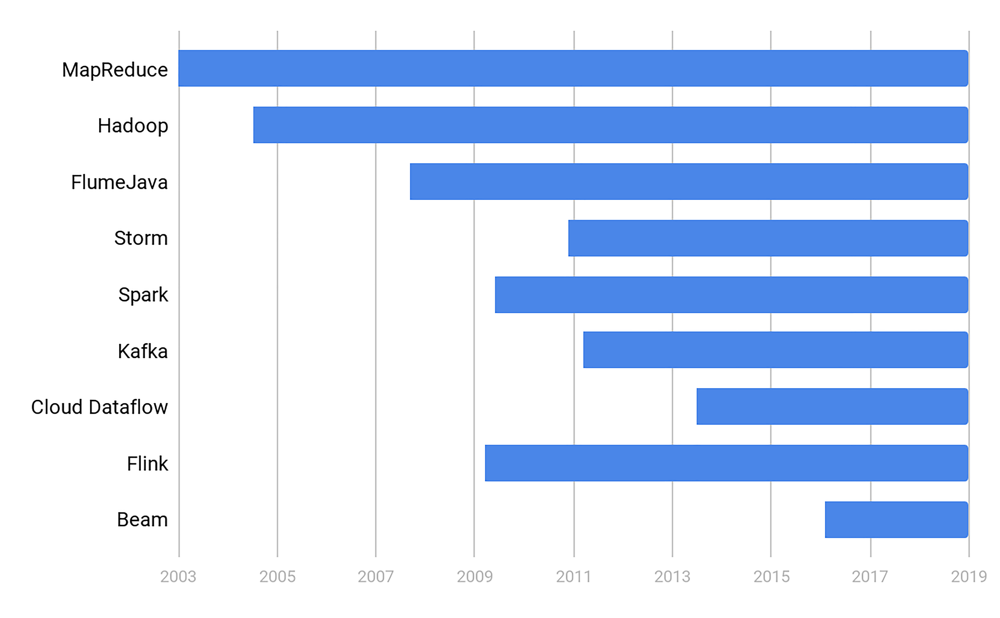

数据的大规模处理问题早已存在。早在 2003 年的时候，Google 就已经面对大于 600 亿的搜索量。但是数据的大规模处理技术还处在彷徨阶段。当时每个公司或者个人可能都有自己的一套工具处理数据。却没有提炼抽象出一个系统的方法。2003 年，MapReduce 的诞生标志了超大规模数据处理的第一次革命，而开创这段青铜时代的就是下面这篇论文《MapReduce: Simplified Data Processing on Large Clusters》。

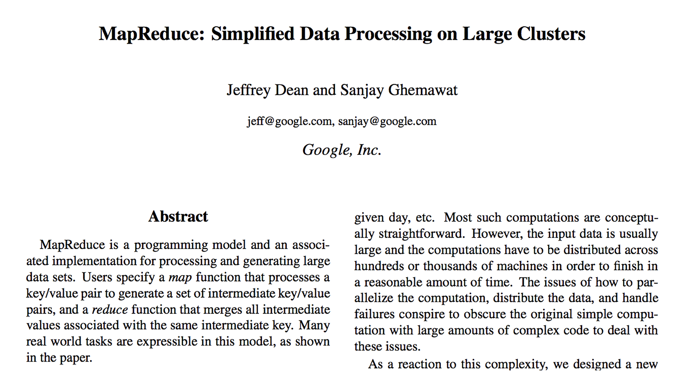

杰夫（Jeff Dean）和桑杰（Sanjay Ghemawat）从纷繁复杂的业务逻辑中，为我们抽象出了 Map 和 Reduce 这样足够通用的编程模型。到了 2014 年左右，Google 内部已经几乎没人写新的 MapReduce 了。2016 年开始，Google 在新员工的培训中把 MapReduce 替换成了内部称为 FlumeJava（不要和 Apache Flume 混淆，是两个技术）的数据处理技术。

MapReduce不在流行原因：

1. **高昂的维护成本**

使用 MapReduce，你需要严格地遵循分步的 Map 和 Reduce 步骤。当你构造更为复杂的处理架构时，往往需要协调多个 Map 和多个 Reduce 任务。然而，每一步的 MapReduce 都有可能出错。为了这些异常处理，很多人开始设计自己的协调系统（orchestration）。例如，做一个状态机（state machine）协调多个 MapReduce，这大大增加了整个系统的复杂度。

Demo：想象一下这个情景，你的公司要预测美团的股价，其中一个重要特征是活跃在街头的美团外卖电动车数量，而你负责处理所有美团外卖电动车的图片。在真实的商用环境下，为了解决这个问题，你可能至少需要 10 个 MapReduce 任务：

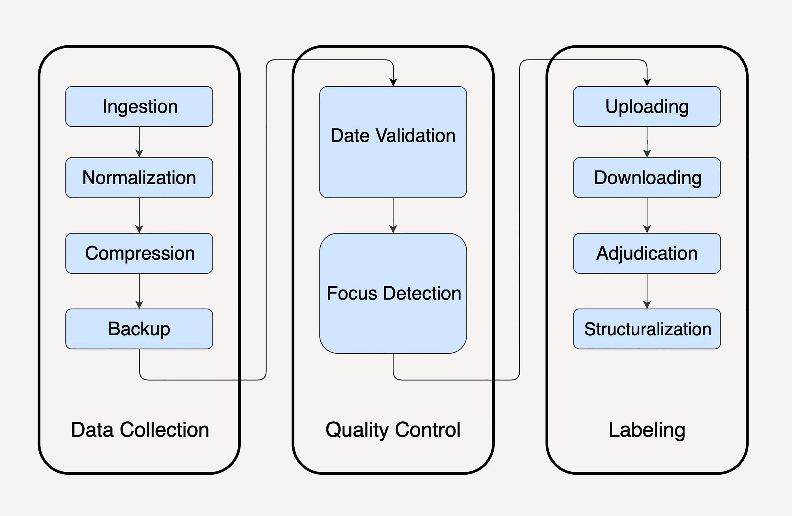

**首先，我们需要搜集每日的外卖电动车图片。**数据的搜集往往不全部是公司独自完成，许多公司会选择部分外包或者众包。所以在数据搜集（Data collection）部分，你至少需要 4 个 MapReduce 任务：数据导入（data ingestion）：用来把散落的照片（比如众包公司上传到网盘的照片）下载到你的存储系统。数据统一化（data normalization）：用来把不同外包公司提供过来的各式各样的照片进行格式统一。数据压缩（compression）：你需要在质量可接受的范围内保持最小的存储资源消耗 。数据备份（backup）：大规模的数据处理系统我们都需要一定的数据冗余来降低风险。仅仅是做完数据搜集这一步，离真正的业务应用还差得远。真实的世界是如此不完美，我们需要一部分**数据质量控制（quality control）流程**，比如：数据时间有效性验证 （date validation）：检测上传的图片是否是你想要的日期的。照片对焦检测（focus detection）：你需要筛选掉那些因对焦不准而无法使用的照片。最后才到你负责的重头戏——**找到这些图片里的外卖电动车**。而这一步因为人工的介入是最难控制时间的。你需要做 4 步：数据标注问题上传（question uploading）：上传你的标注工具，让你的标注者开始工作。标注结果下载（answer downloading）：抓取标注完的数据。标注异议整合（adjudication）：标注异议经常发生，比如一个标注者认为是美团外卖电动车，另一个标注者认为是京东快递电动车。标注结果结构化（structuralization）: 要让标注结果可用，你需要把可能非结构化的标注结果转化成你的存储系统接受的结构。这里我不再深入每个 MapReduce 任务的技术细节，因为本章的重点仅仅是理解 MapReduce 的复杂度。通过这个案例，我想要阐述的观点是，**因为真实的商业 MapReduce 场景极端复杂，像上面这样 10 个子任务的 MapReduce 系统在硅谷一线公司司空见惯**。在应用过程中，每一个 MapReduce 任务都有可能出错，都需要重试和异常处理的机制。所以，协调这些子 MapReduce 的任务往往需要和业务逻辑紧密耦合的状态机。这样过于复杂的维护让系统开发者苦不堪言。

2. **时间性能“达不到”用户的期待**

除了高昂的维护成本，MapReduce 的时间性能也是个棘手的问题。MapReduce 是一套如此精巧复杂的系统，如果使用得当，它是青龙偃月刀，如果使用不当，它就是一堆废铁。不幸的是并不是每个人都是关羽。在实际的工作中，不是每个人都对 MapReduce 细微的配置细节了如指掌。你一定想问，MapReduce 的性能优化配置究竟复杂在哪里呢？我想 Google500 多页的 MapReduce 性能优化手册足够说明它的复杂度了。这里我举例讲讲 MapReduce 的分片（sharding）难题，希望能窥斑见豹，引发大家的思考。Google 曾经在 2007 年到 2012 年间做过一个对于 1PB 数据的大规模排序实验，来测试 MapReduce 的性能。从 2007 年的排序时间 12 小时，到 2012 年的排序时间缩短至 0.5 小时。即使是 Google，也花了 5 年的时间才不断优化了一个 MapReduce 流程的效率。2011 年，他们在 Google Research 的博客上公布了初步的成果。

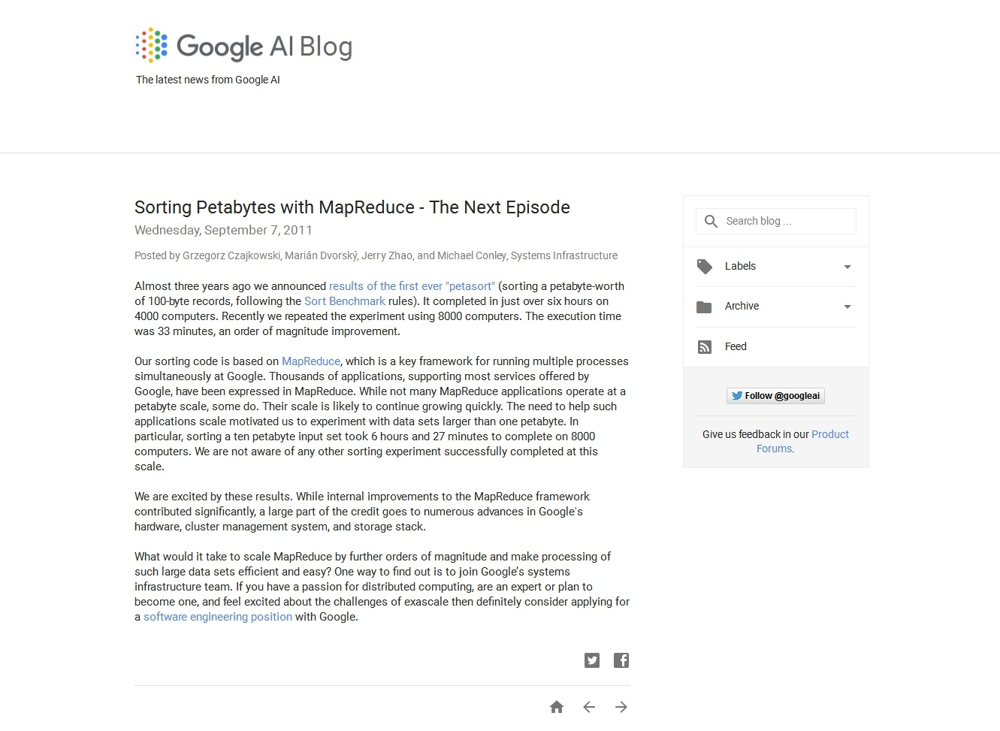

其中有一个重要的发现，就是他们在 MapReduce 的性能配置上花了非常多的时间。包括了缓冲大小 (buffer size），分片多少（number of shards），预抓取策略（prefetch），缓存大小（cache size）等等。所谓的分片，是指把大规模的的数据分配给不同的机器 / 工人，流程如下图所示。

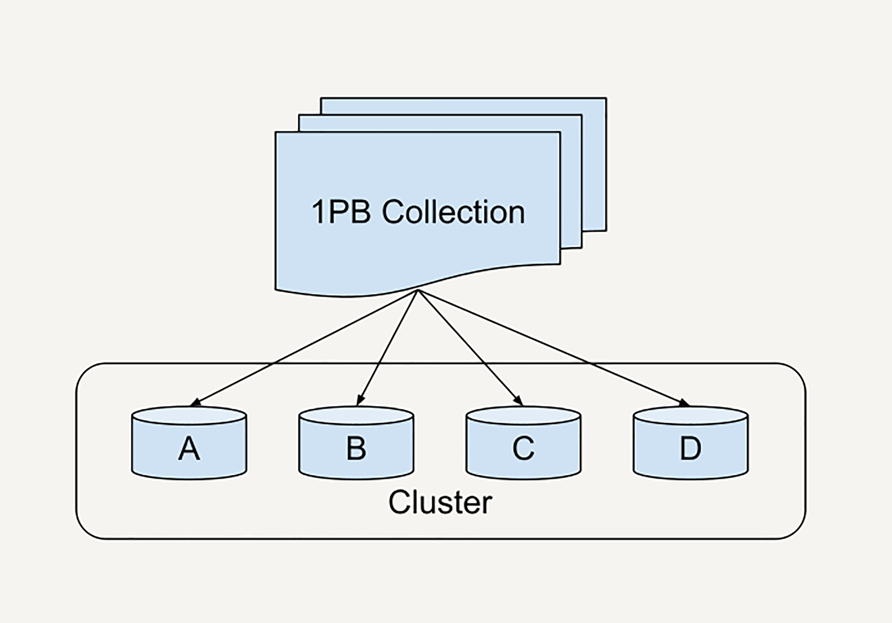

选择一个好的分片函数（sharding function）为何格外重要？让我们来看一个例子。假如你在处理 Facebook 的所有用户数据，你选择了按照用户的年龄作为分片函数（sharding function）。我们来看看这时候会发生什么。因为用户的年龄分布不均衡（假如在 20~30 这个年龄段的 Facebook 用户最多），导致我们在下图中 worker C 上分配到的任务远大于别的机器上的任务量。

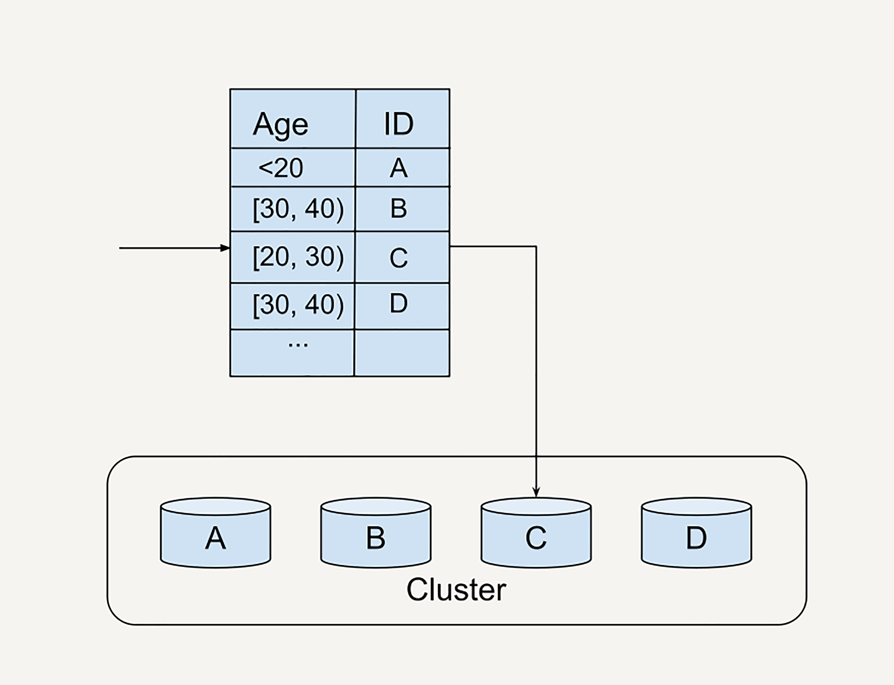

这时候就会发生掉队者问题（stragglers）。别的机器都完成了 Reduce 阶段，只有 worker C 还在工作。

因为 MapReduce 的分片配置异常复杂，在 2008 年以后，Google 改进了 MapReduce 的分片功能，引进了动态分片技术 (dynamic sharding），大大简化了使用者对于分片的手工调整。在这之后，包括动态分片技术在内的各种崭新思想被逐渐引进，奠定了下一代大规模数据处理技术的雏型。

课后思考：

Q1：会员在我们平台注册，信息会保存在对应商家的商家库中，现在需要将商家库中的信息实时的同步到另一台服务的会员库中，商家库是按照商家编号分库，而且商家库和会员库没在同一台服务器部署。如何做到实时同步？

答：实时同步有Eventual Consistency(最终一致性)和Strong Consistency（强一致性)，针对这两点简要分析。

因为会员信息都会保存在商家库中，所以这里我假设商家库的信息可以作为source of truth。

如果你指的是Eventual Consistency的话，可以在会员更新商家库的同时将会员信息利用Pub/Sub发送给会员库去更新。考虑到Pub/Sub中间有可能会丢包，我们可以再建立一个定时任务每隔一段时间将全部商家库中的信息扫描一遍再更新到会员库中。当然具体的实现可以再作优化，因为商家库是按商家编号分库的，我们可以记录下哪些商家编号的表最近有更新我们就只扫描那些表，而不用扫描全局的表。

如果你指的是Strong Consistency的话，我们可以在中间再创建一个State Machine，记录是否两个库都同时更新了。在读取会员信息的时候，我们需要查询这个State Machine，只有当两个库同时都更新的时候才将会员信息返回。根据第九讲的CAP理论，这样的做法其实会牺牲掉Availability，也就是你的服务可用性。

### 2、对下一代数据处理技术的要求？

从番茄炒蛋到有向无环图

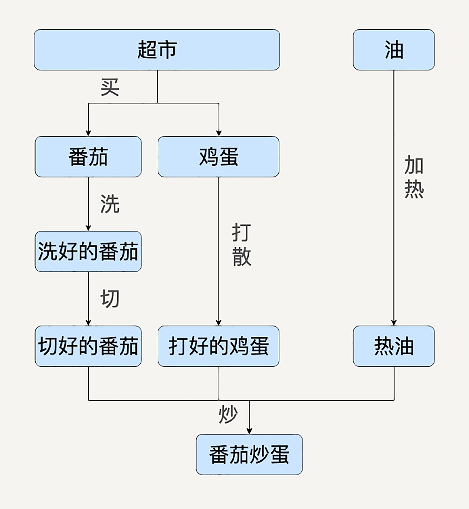

西红柿炒鸡蛋这样一个菜，就是一个有向无环图概念的典型案例。比如看这里面番茄的处理，最后一步“炒”的步骤依赖于切好的番茄、打好的蛋、热好的油。而切好的番茄又依赖于洗好的番茄等等。如果用 MapReduce 来实现的话，在这个图里面，每一个箭头都会是一个独立的 Map 或 Reduce。为了协调那么多 Map 和 Reduce，你又难以避免会去做很多检查，比如：番茄是不是洗好了，鸡蛋是不是打好了。最后这个系统就不堪重负了。

但是，如果我们用有向图建模，图中的每一个节点都可以被抽象地表达成一种通用的数据集，每一条边都被表达成一种通用的数据变换。如此，你就可以用数据集和数据变换描述极为宏大复杂的数据处理流程，而不会迷失在依赖关系中无法自拔。

需求模型可以如下图：

### 3、电商热销榜实现

假设你的电商网站销售 10 亿件商品，已经跟踪了网站的销售记录：商品 id 和购买时间 {product_id, timestamp}，整个交易记录是 1000 亿行数据，TB 级。作为技术负责人，你会怎样设计一个系统，根据销售记录统计去年销量前 10 的商品呢？假设数据格式：

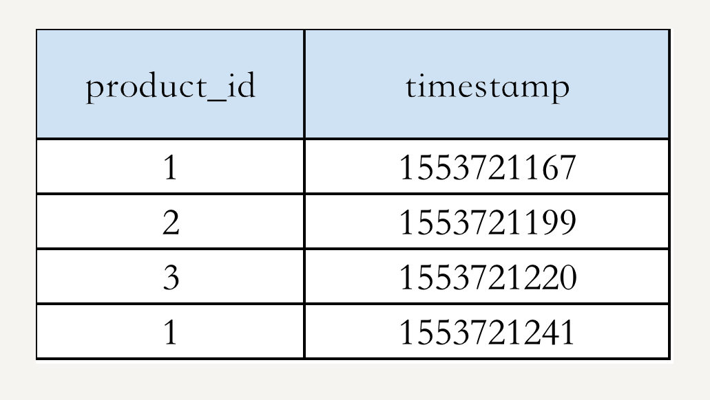

1. 小规模经典算法          第一步，统计每个商品的销量。你可以用哈希表（hashtable）数据结构来解决，是一个 O(n) 的算法，这里 n 是 1000 亿。第二步，找出销量前十，可以用经典的 Top K 算法，也是 O(n) 的算法。

2. 大规模分布式解决方案    **统计每个商品的销量**,我们需要的第一个计算集群，就是统计商品销量的集群。例如，1000 台机器，每台机器一次可以处理 1 万条销售记录。对于每台机器而言，它的单次处理又回归到了我们熟悉的传统算法，数据规模大大缩小。下图就是一个例子，图中每台机器输入是 2 条销售记录，输出是对于他们的本地输入而言的产品销量计数。

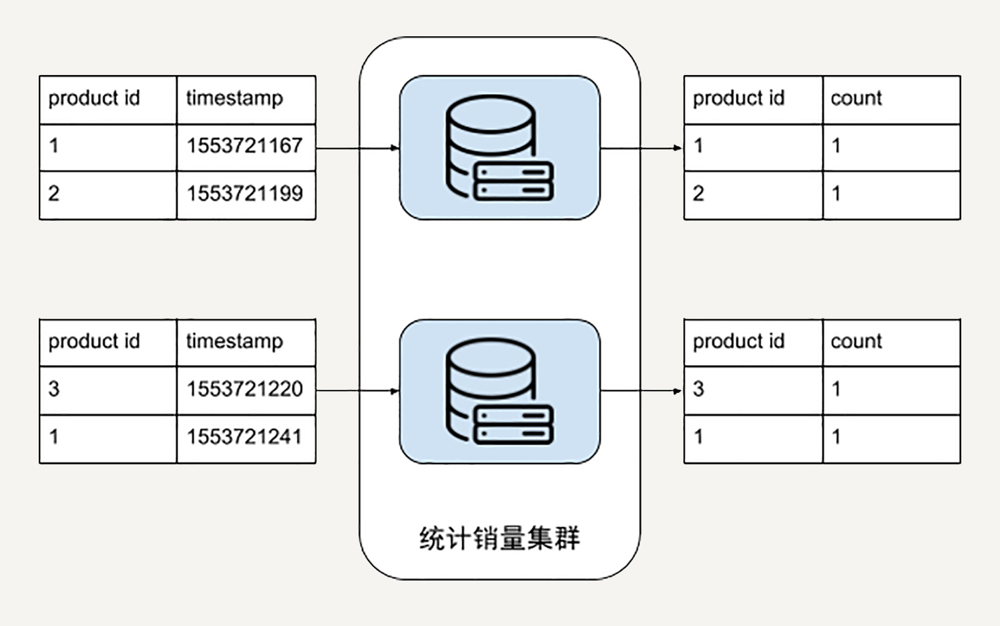

**找出销量前 K**    	我们需要的第二个计算集群，则是找出销量前十的集群。这里我们不妨把问题抽象一下，抽象出是销量前 K 的产品。因为你的老板随时可能把产品需求改成前 20 销量，而不是前 10 了。在上一个统计销量集群得到的数据输出，将会是我们这个处理流程的输入。所以这里需要把分布在各个机器分散的产品销量汇总出来。例如，把所有 product_id = 1 的销量全部叠加。下图示例是 K = 1 的情况，每台机器先把所有 product_id = 1 的销量叠加在了一起，再找出自己机器上销量前 K = 1 的商品。可以看到对于每台机器而言，他们的输出就是最终排名前 K = 1 的商品候选者。

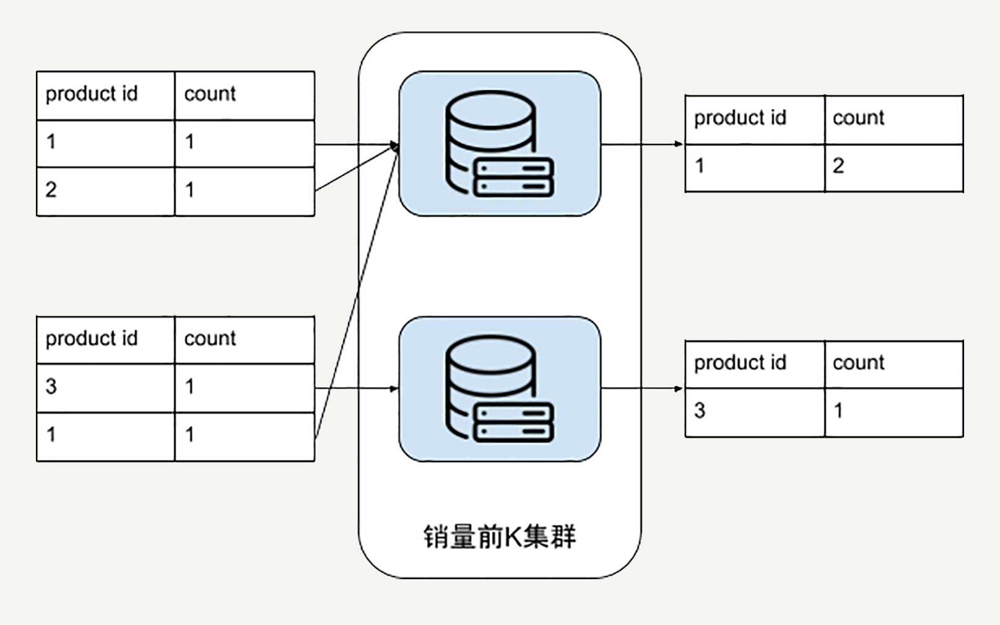

汇总最终结果到了最后一步，你需要把在“销量前 K 集群”中的结果汇总出来。也就是说，从所有排名前 K=1 的商品候选者中找出真正的销量前 K=1 的商品。这时候完全可以用单一机器解决了。因为实际上你汇总的就是这 1000 台机器的结果，规模足够小。

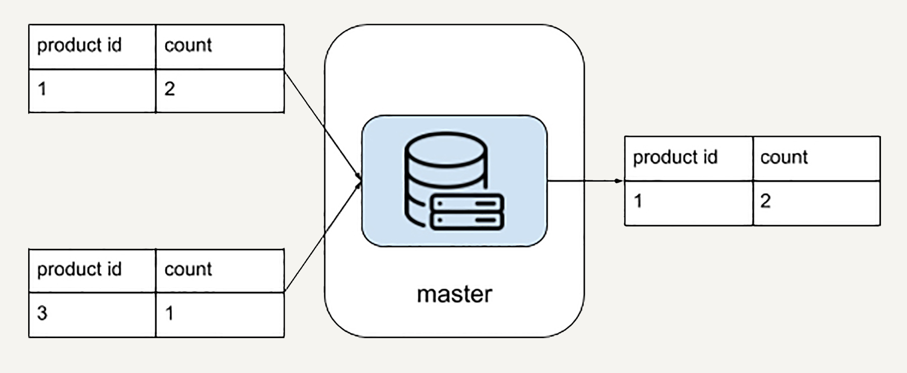

## 二、大规模数据处理基本技巧

### 1、分布式系统之SLA系统评估

SLA（Service-Level Agreement），也就是服务等级协议，指的是系统服务提供者（Provider）对客户（Customer）的一个服务承诺。这是衡量一个大型分布式系统是否“健康”的常见方法。

在开发设计系统服务的时候，无论面对的客户是公司外部的个人、商业用户，还是公司内的不同业务部门，我们都应该对自己所设计的系统服务有一个定义好的 SLA。因为 SLA 是一种服务承诺，所以指标可以多种多样。根据我的实践经验，给你介绍最常见的四个 SLA 指标，可用性、准确性、系统容量和延迟。

1. 可用性（Availability）可用性指的是系统服务能正常运行所占的时间百分比。对于许多系统而言，四个 9 的可用性（99.99％ Availability，或每年约 50 分钟的系统中断时间）即可以被认为是高可用性（High availability）。“99.9% Availability”指的是一天当中系统服务将会有大约 86 秒的服务间断期。服务间断也许是因为系统维护，也有可能是因为系统在更新升级系统服务。86 秒这个数字是怎么算出来的呢？99.9% 意味着有 0.1% 的可能性系统服务会被中断，而一天中有 24 小时 × 60 分钟 × 60 秒，也就是有 (24 × 60 × 60 × 0.001) = 86.4 秒的可能系统服务被中断了。而上面所说的四个 9 的高可用性服务就是承诺可以将一天当中的服务中断时间缩短到只有 (24 × 60 × 60 × 0.0001) = 8.64 秒。
2. 准确性（Accuracy）	准确性指的是我们所设计的系统服务中，是否允许某些数据是不准确的或者是丢失了的。不同的系统平台可能会用不同的指标去定义准确性。很多时候，系统架构会以错误率（Error Rate）来定义这一项 SLA。怎么计算错误率呢？可以用导致系统产生内部错误（Internal Error）的有效请求数，除以这期间的有效请求总数。例如，我们在一分钟内发送 100 个有效请求到系统中，其中有 5 个请求导致系统返回内部错误，那我们可以说这一分钟系统的错误率是 5 / 100 = 5%。
3. 系统容量（Capacity） 在数据处理中，系统容量通常指的是系统能够支持的预期负载量是多少，一般会以每秒的请求数为单位来表示。我们常常可以看见，某个系统的架构可以处理的 QPS （Queries Per Second）是多少又或者 RPS（Requests Per Second）是多少。这里的 QPS 或者是 RPS 就是指系统每秒可以响应多少请求数。
4. 延迟（Latency）延迟指的是系统在收到用户的请求到响应这个请求之间的时间间隔。

### 2、分布式系统三大指标

1. 可扩展性 (Scalability）水平扩展（Horizontal Scaling）和垂直扩展（Vertical Scaling）。所谓水平扩展，就是指在现有的系统中增加新的机器节点。垂直扩展就是在不改变系统中机器数量的情况下，“升级”现有机器的性能，比如增加机器的内存。
2. 一致性（Consistency） 可用性对于任何分布式系统都很重要。一般来说，构成分布式系统的机器节点的可用性要低于系统的可用性。举个例子，如果我们想要构建一个可用性 99.999% 的分布式系统（每年约 5 分钟的宕机时间），但是我们使用的单台机器节点的可用性是 99.9%（每年约 8 个小时的宕机时间）。那么想要达到我们的目标，最简单的办法就是增加系统中机器节点的数量。这样即使有部分机器宕机了，其他的机器还在持续工作，所以整个系统的可用性就提高了。这种情况下，我们要思考一个问题：如何保证系统中不同的机器节点在同一时间，接收到和输出的数据是一致的呢？这时就要引入一致性（Consistency）的概念。几种一致性概念：强一致性（Strong Consistency），弱一致性（Weak Consistency），最终一致性（Eventual Consistency）。

- 强一致性：系统中的某个数据被成功更新后，后续任何对该数据的读取操作都将得到更新后的值。所以在任意时刻，同一系统所有节点中的数据是一样的。
- 弱一致性：系统中的某个数据被更新后，后续对该数据的读取操作可能得到更新后的值，也可能是更改前的值。但经过“不一致时间窗口”这段时间后，后续对该数据的读取都是更新后的值。
- 最终一致性：是弱一致性的特殊形式。存储系统保证，在没有新的更新的条件下，最终所有的访问都是最后更新的值。

3. 持久性   数据持久性（Data Durability）意味着数据一旦被成功存储就可以一直继续使用，即使系统中的节点下线、宕机或数据损坏也是如此。

### 3、流处理与批处理

批处理模式在不需要实时分析结果的情况下是一种很好的选择。尤其当业务逻辑需要处理大量的数据以挖掘更为深层次数据信息的时候。

批处理架构通常会被设计在以下这些应用场景中：

- 日志分析：日志系统是在一定时间段（日，周或年）内收集的，而日志的数据处理分析是在不同的时间内执行，以得出有关系统的一些关键性能指标。
- 计费应用程序：计费应用程序会计算出一段时间内一项服务的使用程度，并生成计费信息，例如银行在每个月末生成的信用卡还款单。
- 数据仓库：数据仓库的主要目标是根据收集好的数据事件时间，将数据信息合并为静态快照 （static snapshot），并将它们聚合为每周、每月、每季度的报告等。

而在应用需求需要对数据进行实时分析处理时，或者说当有些数据是永无止境的事件流时（例如传感器发送回来的数据时），我们就可以选择用流处理模式。

流处理架构通常都会被设计在以下这些应用场景中：

- 实时监控：捕获和分析各种来源发布的数据，如传感器，新闻源，点击网页等。
- 实时商业智能：智能汽车，智能家居，智能病人护理等。
- 销售终端（POS）系统：像是股票价格的更新，允许用户实时完成付款的系统等。

### 4、Workflow设计模式

#### 4.1 复制模式（Copier Pattern）

复制模式通常是将单个数据处理模块中的数据，完整地复制到两个或更多的数据处理模块中，然后再由不同的数据处理模块进行处理。工作流系统图通常如下图所示。

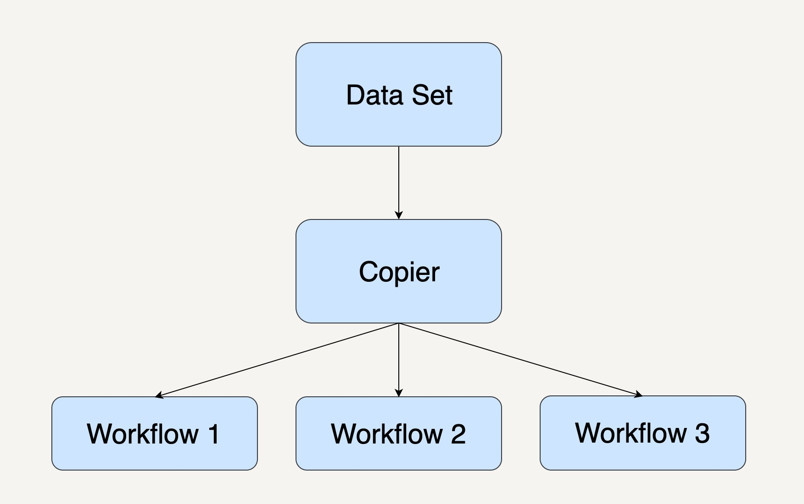

当我们在处理大规模数据时，需要对同一个数据集采取多种不同的数据处理转换，我们就可以优先考虑采用复制模式。例如，YouTube视频平台中，系统处理视频数据集的例子：

视频平台很多时候都会提供不同分辨率的视频。4K 或 1080P 的视频可以提供给网络带宽很高的用户。而在网络很慢的情况下，视频平台系统会自动转换成低分辨率格式的视频，像 360P 这样的视频给用户。而在 YouTube 视频平台中，如果你将鼠标放在视频缩略图上，它会自动播放一段已经生成好的动画缩略图（Animated GIF Thumbnail ）。不仅如此，在平台的背后，一个视频的数据集可能被自然语言理解（NLP）的数据处理模块分析，用以自动生成视频字幕；还有可能被视频分析的数据处理模块分析，用以产生更好的内容推荐系统。那么，它的整个工作流系统就会如下图所示一样。

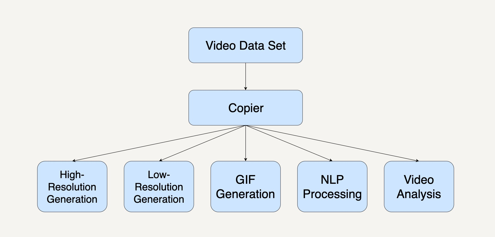

在这个工作流系统中，每个数据处理模块的输入是相同的，而下面的 5 个数据处理模块都可以单独并且同步地运行处理。

#### 4.2 过滤模式（Filter Pattern）

过滤模式的作用是过滤掉不符合特定条件的数据。在数据集通过了这个数据处理模块后，数据集会缩减到只剩下符合条件的数据。工作流系统图通常如下图所示。

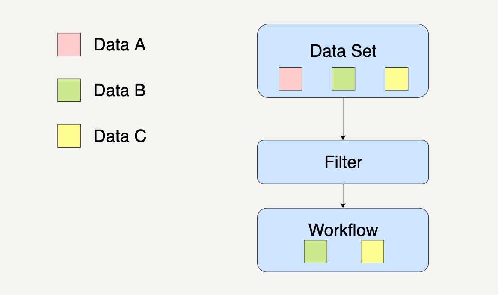

当我们在处理大规模数据时，需要针对一个数据集中某些特定的数据采取数据处理时，我们就可以优先考虑采用过滤模式。

#### 4.3 分离模式（Splitter Pattern）

如果你在处理数据集时并不想丢弃里面的任何数据，而是想把数据分类为不同的类别来进行处理时，你就需要用到分离模式来处理数据。它的工作流系统图通常如下图所示。

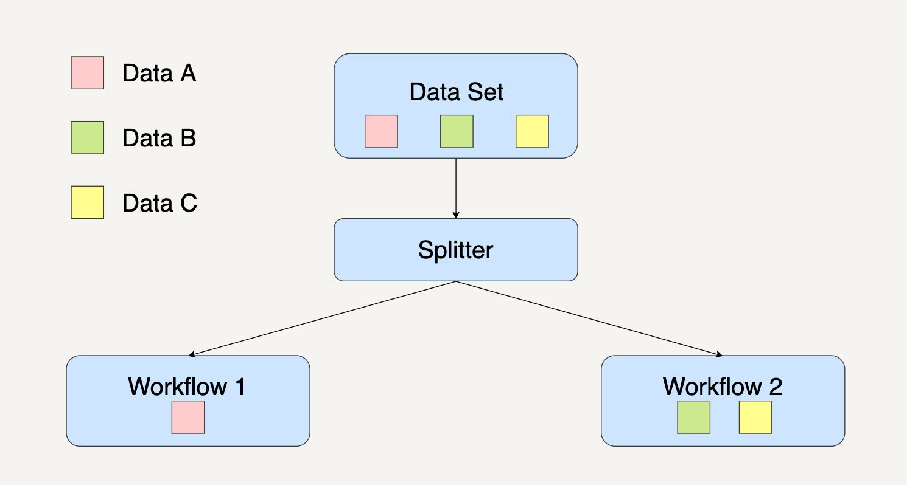

需要注意的是，分离模式并不会过滤任何数据，只是将原来的数据集分组了。需要注意的是，在分离模式下，同样的数据其实是可以被划分到不同的数据处理模块的。

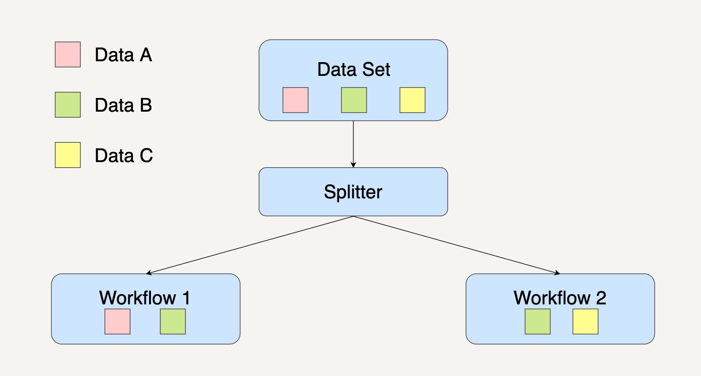

数据 B 是可以同时划分到工作流 1 和工作流 2 中。其实这种情况挺常见的，我可以给你举个例子来解释。在银行系统上，用户可以通过勾选以短信通知或者以邮件通知的方式来提醒用户一笔交易成功。如果用户同时勾选了短信和邮件两种方式，那么属于这个用户的交易信息既会通过短信通知的数据处理模块来处理，也会通过邮件通知数据处理模块来处理。

#### 4.4 合并模式（Joiner Pattern）

合并模式会将多个不同的数据集转换集中到一起，成为一个总数据集，然后将这个总的数据集放在一个工作流中进行处理。

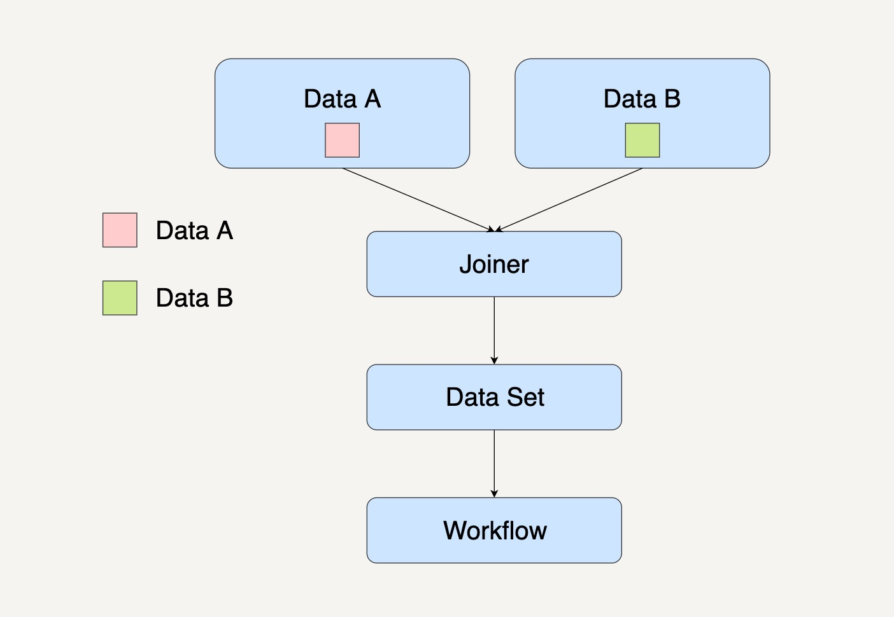

### 5、CAP定理

#### 5.1 C 属性：一致性

一致性在这里指的是线性一致性（Linearizability Consistency）。在线性一致性的保证下，所有分布式环境下的操作都像是在单机上完成的一样，也就是说图中 Sever A、B、C 的状态一直是一致的。

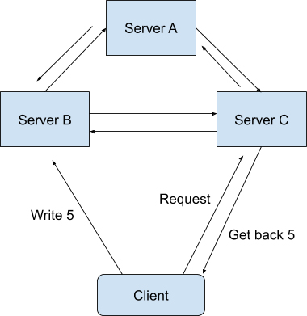

#### 5.2 A 属性：可用性

可用性的概念比较简单，在这里指的是在分布式系统中，任意非故障的服务器都必须对客户的请求产生响应。当系统满足可用性的时候，不管出现什么状况（除非所有的服务器全部崩溃），都能返回消息。也就是说，当客户端向系统发送请求，只要系统背后的服务器有一台还未崩溃，那么这个未崩溃的服务器必须最终响应客户端。

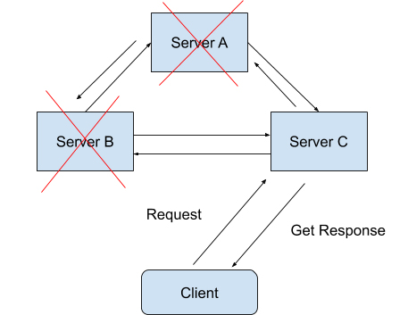

#### 5.3 P 属性：分区容错性

分区容错性，在这里指的是我们的系统允许网络丢失从一个节点发送到另一个节点的任意多条消息。