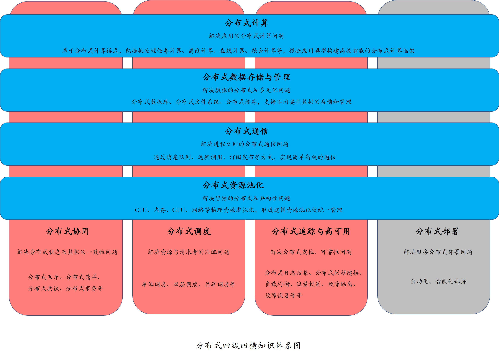

# 分布式系统

## 总括

分布式体系图，总的概括：**“在一定资源上，进行一定通信，通过一定计算，完成一定数据的加工和处理，从而对外提供特定的服务”**

## 分布式系统的指标

主要包含性能、资源、可用性和可扩展性

### 性能（Performance）

性能指标，主要用于衡量一个系统处理各种任务的能力。无论是分布式系统还是单机系统，都会对性能有所要求。不同的系统、服务要达成的目的不同，关注的性能自然也不尽相同，甚至是相互矛盾。常见的性能指标，包括吞吐量（Throughput）、响应时间（Response Time）和完成时间（Turnaround Time）。

吞吐量指的是，系统在一定时间内可以处理的任务数。这个指标可以非常直接地体现一个系统的性能，就好比在客户非常多的情况下，要评判一个银行柜台职员的办事效率，你可以统计一下他在 1 个小时内接待了多少客户。常见的吞吐量指标有 QPS（Queries Per Second）、TPS（Transactions Per Second）和 BPS（Bits Per Second）。

- QPS，即查询数每秒，用于衡量一个系统每秒处理的查询数。这个指标通常用于读操作，越高说明对读操作的支持越好。所以，我们在设计一个分布式系统的时候，如果应用主要是读操作，那么需要重点考虑如何提高 QPS，来支持高频的读操作。
- TPS，即事务数每秒，用于衡量一个系统每秒处理的事务数。这个指标通常对应于写操作，越高说明对写操作的支持越好。我们在设计一个分布式系统的时候，如果应用主要是写操作，那么需要重点考虑如何提高 TPS，来支持高频写操作。
- BPS，即比特数每秒，用于衡量一个系统每秒处理的数据量。对于一些网络系统、数据管理系统，我们不能简单地按照请求数或事务数来衡量其性能。因为请求与请求、事务与事务之间也存在着很大的差异，比方说，有的事务大需要写入更多的数据。那么在这种情况下，BPS 更能客观地反应系统的吞吐量。

可靠性通常用来表示一个系统完全不出故障的概率，更多地用在硬件领域。而可用性则更多的是指在允许部分组件失效的情况下，一个系统对外仍能正常提供服务的概率。

## 分布式协调与同步

### 分布式互斥

对于同一共享资源，一个程序正在使用的时候也不希望被其他程序打扰。这，就要求同一时刻只能有一个程序能够访问这种资源。**在分布式系统里，这种排他性的资源访问方式，叫作分布式互斥（Distributed Mutual Exclusion），而这种被互斥访问的共享资源就叫作临界资源（Critical Resource）**。

