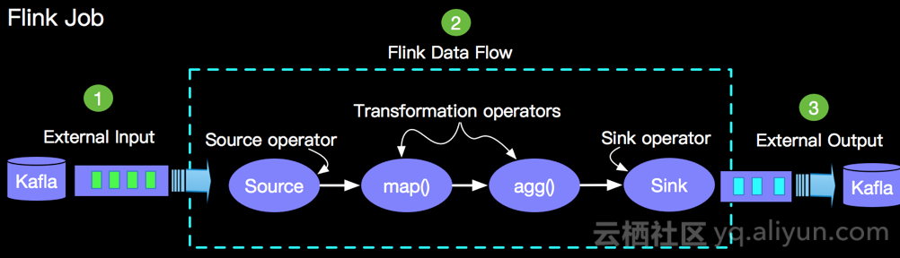
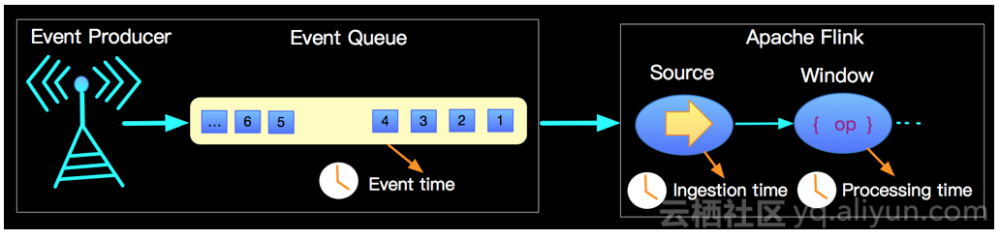

#### Flink相关

1、Native Streaming 纯流式计算引擎，强调的是“批是流的特例“

2、部署模式

​    1）Local 本地学习、调试

​    2）CLuster StandAlone Cluster与Yarn Cluster

​    3）Cloud

3、容错机制（支持前两种）

​    1）At least Once

​    2) Exactly Once (金融支付、银行账务等应用)

​    3) At most Once

4、Apache 网络上数据传输，两种模式

1）PIPELINED模式 即一条数据被处理完成以后，立刻传输到下一个节点进行处理

2）BATCH模式 先写缓存，缓存满了之后再写磁盘

5、Flink时间类型

1）Event time 数据产生时携带

2）Ingestion time  数据刚进入Flink框架的时间

3）Processing time 数据流入算子的时间

Flink最区别于其他流计算引擎的，就是状态管理