## MySQL 相关
### MySQL架构图：


MySQL 可以分为Server层和存储层两部分。Server层包括连接器、查询分析、分析器、优化器、执行器等，涵盖MySQL的大多数核心服务功能，以及所有的内置函数(日期、时间、数学函数和加密函数)，所有跨存储引擎的功能都在这一层实现，比如存储过程、触发器、视图等。而存储引擎层负责数据的存储和提取。其架构模式是插件式的，支持 InnoDB、MyISAM、Memory 等多个存储引擎。现在最常用的存储引擎是 InnoDB，它从 MySQL 5.5.5 版本开始成为了默认存储引擎。

在一个表上有更新的时候，跟这个表有关的查询缓存会失效。与查询不一样的时候，更新流程会有两个重要的日志模块，redo log（重做日志）和 binlog（归档日志）。MySQL里常说的WAL技术，WAL的全称是Write-Ahead Logging，关键点就是先写日志，再写磁盘。具体来说，当有一条记录需要更新的时候，InnoDB 引擎就会先把记录写到 redo log里面，并更新内存，这个时候更新就算完成了。同时，InnoDB 引擎会在适当的时候，将这个操作记录更新到磁盘里面，而这个更新往往是在系统比较空闲的时候做。

redolog和binlog区别：

- redo log 是 InnoDB 引擎特有的；binlog 是 MySQL 的 Server 层实现的，所有引擎都可以使用。
- redo log 是物理日志，记录的是“在某个数据页上做了什么修改”；binlog 是逻辑日志，记录的是这个语句的原始逻辑，比如“给 ID=2 这一行的 c 字段加 1 ”。
- redo log 是循环写的，空间固定会用完；binlog 是可以追加写入的。“追加写”是指 binlog 文件写到一定大小后会切换到下一个，并不会覆盖以前的日志。

Binlog有两种模式，statement格式的话记录的是SQL语句，Row格式会记录行的内容，更新前与更新后都会有。

### 事务，ACID（Atomicity，Consistency，Isolation，Durability）

隔离级别：读未提交、读已提交，可重复度，串行化

读未提交是指，一个事务还没提交时，它做的变更就能被别的事务看到。

读已提交是指，一个事务提交之后，它做的变更才会被其他事务看到。

可重复读是指，一个事务执行过程中看到的数据，总是跟这个事务在启动的时候看到的数据是一致的。当然在可重复读隔离级别下，未提交变更对其他事务是不可见的。

串行化，对同一行记录，”写“会加”写锁“，”读“会加”读锁“，当出现读写锁冲突的时候，后访问的事务必须等前一个事务执行完成。

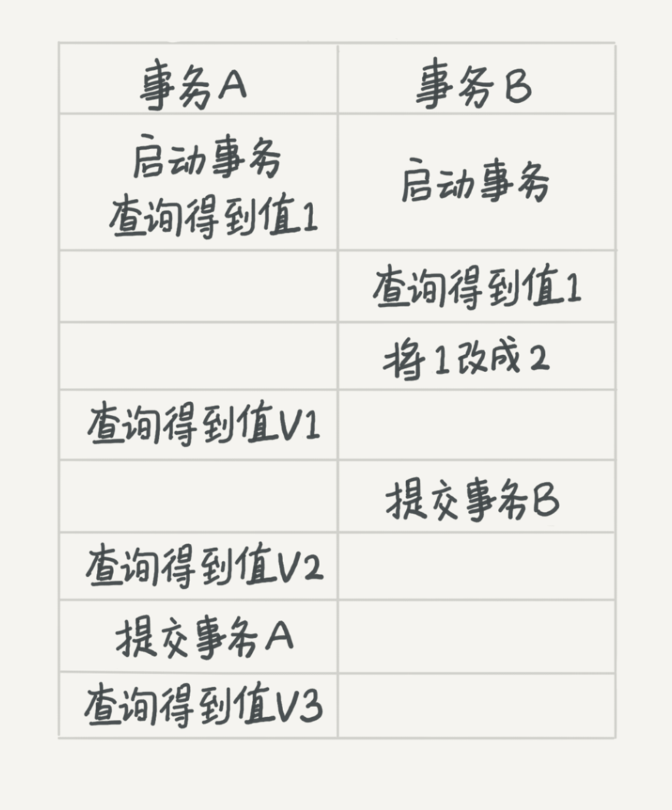

- 若隔离级别是“读未提交”， 则 V1 的值就是 2。这时候事务 B 虽然还没有提交，但是结果已经被 A 看到了。因此，V2、V3 也都是 2。
- 若隔离级别是“读提交”，则 V1 是 1，V2 的值是 2。事务 B 的更新在提交后才能被 A 看到。所以， V3 的值也是 2。

- 若隔离级别是“可重复读”，则 V1、V2 是 1，V3 是 2。之所以 V2 还是 1，遵循的就是这个要求：事务在执行期间看到的数据前后必须是一致的。
- 若隔离级别是“串行化”，则在事务 B 执行“将 1 改成 2”的时候，会被锁住。直到事务 A 提交后，事务 B 才可以继续执行。所以从 A 的角度看， V1、V2 值是 1，V3 的值是 2。

在实现上，数据库里面会创建一个视图，访问的时候以视图的逻辑结果为准。在“可重复读”隔离级别下，这个视图是在事务启动时创建的，整个事务存在期间都用这个视图。在“读提交”隔离级别下，这个视图是在每个 SQL 语句开始执行的时候创建的。这里需要注意的是，“读未提交”隔离级别下直接返回记录上的最新值，没有视图概念；而“串行化”隔离级别下直接用加锁的方式来避免并行访问。

MySQL支持诸多存储引擎，而各种存储引擎对索引的支持也各不相同，因此MySQL数据库支持多种索引类型，如BTree索引，哈希索引，全文索引等等
MySQL官方对索引的定义为：索引（Index）是帮助MySQL高效获取数据的数据结构。提取句子主干，就可以得到索引的本质：索引是数据结构。

### 索引

#### MyISAM索引实现

MyISAM引擎使用B+Tree作为索引结构，叶节点的data域存放的是数据记录的地址，MyISAM索引的原理图

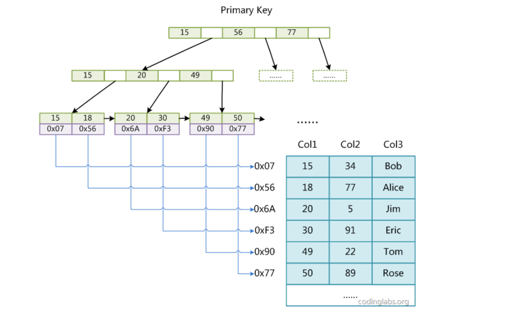

MyISAM中索引检索的算法为首先按照B+Tree搜索算法搜索索引，如果指定的Key存在，则取出其data域的值，然后以data域的值为地址，读取相应数据记录。

MyISAM的索引方式也叫做“非聚集”的，之所以这么称呼是为了与InnoDB的聚集索引区分。

#### InnoDB索引实现

虽然InnoDB也使用B+Tree作为索引结构，但具体实现方式却与MyISAM截然不同

第一个重大区别是InnoDB的数据文件本身就是索引文件。从上文知道，MyISAM索引文件和数据文件是分离的，索引文件仅保存数据记录的地址。而在InnoDB中，表数据文件本身就是按B+Tree组织的一个索引结构，这棵树的叶节点data域保存了完整的数据记录。这个索引的key是数据表的主键，因此InnoDB表数据文件本身就是主索引。


上图是InnoDB主索引（同时也是数据文件）的示意图，可以看到叶节点包含了完整的数据记录。这种索引叫做聚集索引。因为InnoDB的数据文件本身要按主键聚集，所以InnoDB要求表必须有主键（MyISAM可以没有），如果没有显式指定，则MySQL系统会自动选择一个可以唯一标识数据记录的列作为主键，如果不存在这种列，则MySQL自动为InnoDB表生成一个隐含字段作为主键，这个字段长度为6个字节，类型为长整形

第二个与MyISAM索引的不同是InnoDB的辅助索引data域存储相应记录主键的值而不是地址。换句话说，InnoDB的所有辅助索引都引用主键作为data域。例如，图11为定义在Col3上的一个辅助索引：


不建议使用过长的字段作为主键，因为所有辅助索引都引用主索引，过长的主索引会令辅助索引变得过大。再例如，用非单调的字段作为主键在InnoDB中不是个好主意，因为InnoDB数据文件本身是一颗B+Tree，非单调的主键会造成在插入新记录时数据文件为了维持B+Tree的特性而频繁的分裂调整，十分低效，而使用自增字段作为主键则是一个很好的选择。

### 为什么索引可以加速查询？

数据库索引使用 B+ 树，我们先看下 B+ 树这种数据结构。B+ 树是一种 N 叉排序树，树的每个节点包含 N 个数据，这些数据按顺序排好，两个数据之间是一个指向子节点的指针，而子节点的数据则在这两个数据大小之间。


B+ 树的节点存储在磁盘上，每个节点存储 1000 多个数据，这样树的深度最多只要 4 层，就可存储数亿的数据。如果将树的根节点缓存在内存中，则最多只需要三次磁盘访问就可以检索到需要的索引数据。

B+ 树只是加快了索引的检索速度，如何通过索引加快数据库记录的查询速度呢？数据库索引有两种，一种是聚簇索引，聚簇索引的数据库记录和索引存储在一起，上面这张图就是聚簇索引的示意图，在叶子节点，索引 1 和记录行 r1 存储在一起，查找到索引就是查找到数据库记录。像 MySQL 数据库的主键就是聚簇索引，主键 ID 和所在的记录行存储在一起。MySQL 的数据库文件实际上是以主键作为中间节点，行记录作为叶子节点的一颗 B+ 树。

另一种数据库索引是非聚簇索引，非聚簇索引在叶子节点记录的就不是数据行记录，而是聚簇索引，也就是主键，如下图。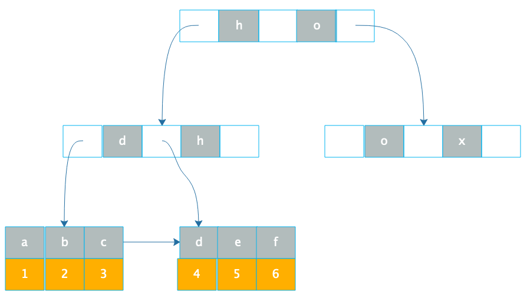

通过 B+ 树在叶子节点找到非聚簇索引 a，和索引 a 在一起存储的是主键 1，再根据主键 1 通过主键（聚簇）索引就可以找到对应的记录 r1，这种通过非聚簇索引找到主键索引，再通过主键索引找到行记录的过程也被称作回表。所以通过索引，可以快速查询到需要的记录，而如果要查询的字段上没有建索引，就只能扫描整张表了，查询速度就会慢很多。

#### 索引优化：

**1、全列匹配**

当按照索引中所有列进行精确匹配（这里精确匹配指“=”或“IN”匹配）时，索引可以被用到。理论上索引对顺序是敏感的，但是由于MySQL的查询优化器会自动调整where子句的条件顺序以使用适合的索引。

**2、最左前缀匹配**

1. EXPLAIN SELECT * FROM employees.titles WHERE emp_no='10001';
2. +----+-------------+--------+------+---------------+---------+---------+-------+------+-------+
3. | id | select_type | table  | type | possible_keys | key     | key_len | ref   | rows | Extra |
4. +----+-------------+--------+------+---------------+---------+---------+-------+------+-------+
5. |  1 | SIMPLE      | titles | ref  | PRIMARY       | PRIMARY | 4       | const |    1 |       |
6. +----+-------------+--------+------+---------------+---------+---------+-------+------+-------+

当查询条件精确匹配索引的左边连续一个或几个列时，如<emp_no>或<emp_no, title>，所以可以被用到，但是只能用到一部分，即条件所组成的最左前缀。上面的查询从分析结果看用到了PRIMARY索引，但是key_len为4，说明只用到了索引的第一列前缀。

**3、查询条件用到了索引中列的精确匹配，但是中间某个条件未提供**

1. EXPLAIN SELECT * FROM employees.titles WHERE emp_no='10001' AND from_date='1986-06-26';
2. +----+-------------+--------+------+---------------+---------+---------+-------+------+-------------+
3. | id | select_type | table  | type | possible_keys | key     | key_len | ref   | rows | Extra       |
4. +----+-------------+--------+------+---------------+---------+---------+-------+------+-------------+
5. |  1 | SIMPLE      | titles | ref  | PRIMARY       | PRIMARY | 4       | const |    1 | Using where |
6. +----+-------------+--------+------+---------------+---------+---------+-------+------+-------------+

此时索引使用情况和情况二相同，因为title未提供，所以查询只用到了索引的第一列，而后面的from_date虽然也在索引中，但是由于title不存在而无法和左前缀连接，因此需要对结果进行扫描过滤from_date（这里由于emp_no唯一，所以不存在扫描）。如果想让from_date也使用索引而不是where过滤，可以增加一个辅助索引<emp_no, from_date>，此时上面的查询会使用这个索引。除此之外，还可以使用一种称之为“隔离列”的优化方法，将emp_no与from_date之间的“坑”填上。查询不同的title，然后用in查询。

**4、查询条件没有指定索引第一列**

这种情况不会走索引

**5、匹配某列的前缀字符串**

1. EXPLAIN SELECT * FROM employees.titles WHERE emp_no='10001' AND title LIKE 'Senior%';
2. +----+-------------+--------+-------+---------------+---------+---------+------+------+-------------+
3. | id | select_type | table  | type  | possible_keys | key     | key_len | ref  | rows | Extra       |
4. +----+-------------+--------+-------+---------------+---------+---------+------+------+-------------+
5. |  1 | SIMPLE      | titles | range | PRIMARY       | PRIMARY | 56      | NULL |    1 | Using where |
6. +----+-------------+--------+-------+---------------+---------+---------+------+------+-------------+

此时可以用到索引**，**如果通配符%不出现在开头，则可以用到索引，但根据具体情况不同可能只会用其中一个前缀

**6、范围查询**

1. EXPLAIN SELECT * FROM employees.titles WHERE emp_no < '10010' and title='Senior Engineer';
2. +----+-------------+--------+-------+---------------+---------+---------+------+------+-------------+
3. | id | select_type | table  | type  | possible_keys | key     | key_len | ref  | rows | Extra       |
4. +----+-------------+--------+-------+---------------+---------+---------+------+------+-------------+
5. |  1 | SIMPLE      | titles | range | PRIMARY       | PRIMARY | 4       | NULL |   16 | Using where |
6. +----+-------------+--------+-------+---------------+---------+---------+------+------+-------------+

范围列可以用到索引（必须是最左前缀），但是范围列后面的列无法用到索引。同时，索引最多用于一个范围列，因此如果查询条件中有两个范围列则无法全用到索引。

**7、查询条件中含有函数或表达式**。

很不幸，如果查询条件中含有函数或表达式，则MySQL不会为这列使用索引（虽然某些在数学意义上可以使用）。

**索引选择性与前缀索引**

1、表记录比较少时，通常2000为限

2、索引的选择性，选择性的取值范围为(0, 1]，选择性越高的索引价值越大，这是由B+Tree的性质决定的

SELECT count(DISTINCT(title))/count(*) AS Selectivity FROM employees.titles;

3、前缀索引

有一种与索引选择性有关的索引优化策略叫做前缀索引，就是用列的前缀代替整个列作为索引key，当前缀长度合适时，可以做到既使得前缀索引的选择性接近全列索引，同时因为索引key变短而减少了索引文件的大小和维护开销。

前缀索引兼顾索引大小和查询速度，但是其缺点是不能用于ORDER BY和GROUP BY操作

InnoDB的主键选择与插入优化

使用InnoDB存储引擎时，如果没有特别的需要，请永远使用一个与业务无关的自增字段作为主键

#### 索引的原则：

- 1，**最左前缀匹配原则**。这是非常重要、非常重要、非常重要（重要的事情说三遍）的原则，MySQL会一直向右匹配直到遇到范围查询 `（>,<,BETWEEN,LIKE）`就停止匹配。
- 3，尽量选择**区分度高的列作为索引**，区分度的公式是 `COUNT(DISTINCT col)/COUNT(*)`。表示字段不重复的比率，比率越大我们扫描的记录数就越少。
- 4，**索引列不能参与计算，尽量保持列“干净”**。比如， `FROM_UNIXTIME(create_time)='2016-06-06'` 就不能使用索引，原因很简单，**B+树中存储的都是数据表中的字段值**，但是进行检索时，需要把所有元素都应用函数才能比较，显然这样的代价太大。所以语句要写成 ： `create_time=UNIX_TIMESTAMP('2016-06-06')`。
- 5，尽可能的**扩展索引**，不要新建立索引。比如表中已经有了a的索引，现在要加（a,b）的索引，那么只需要修改原来的索引即可。
- 6，单个多列组合索引和多个单列索引的检索查询效果不同，因为在执行SQL时，**MySQL只能使用一个索引**，会从多个单列索引中选择一个限制最为严格的索引(经指正，在MySQL5.0以后的版本中，有“合并索引”的策略，翻看了《高性能MySQL 第三版》，书作者认为：**还是应该建立起比较好的索引，而不应该依赖于“合并索引”这么一个策略**)。
- “合并索引”策略简单来讲，就是使用多个单列索引，然后将这些结果用“union或者and”来合并起来

#### 一个索引分析的有趣场景

~~~mysql

mysql> CREATE TABLE `table_a` (
  `id` int(11) NOT NULL,
  `b` varchar(10) DEFAULT NULL,
  PRIMARY KEY (`id`),
  KEY `b` (`b`)
) ENGINE=InnoDB;
~~~

假设现在表里面，有 100 万行数据，其中有 10 万行数据的 b 的值是’1234567890’， 假设现在执行语句是这么写的:

~~~mysql

mysql> select * from table_a where b='1234567890abcd';
~~~

执行流程：

- 在传给引擎执行的时候，做了字符截断。因为引擎里面这个行只定义了长度是 10，所以只截了前 10 个字节，就是’1234567890’进去做匹配；
- 这样满足条件的数据有 10 万行；
- 因为是 select *， 所以要做 10 万次回表；
- 但是每次回表以后查出整行，到 server 层一判断，b 的值都不是’1234567890abcd’;
- 返回结果是空。

### 使用自增主键和业务字段做主键区别

- 自增主键的插入数据模式，符合递增插入的场景。每次插入一条新记录，都是追加操作，不涉及到挪动其他记录，也不会触发叶子节点内的分裂。而业务逻辑的字段做主键，则往往不容易保证有序插入，这样写入数据成本相对较高。
- 从存储空间来看，假如唯一的字段，身份证号，由于每个非主键索引的叶子节点上都是主键的值。如果用身份证号做主键，那么每个二级索引的叶子节点占用约20个字节，而如果用整型做主键，则只要4个字节。显然，主键长度越小，普通索引的叶子节点就越小，普通索引占用的空间也就越小。
- 重建索引的过程会创建一个新的索引，把数据按顺序插入，这样页面的利用率最高，索引更紧凑，更省空间。**不论是删除主键还是创建主键，都会将整个表重建**。

### 事务

如果事务中需要锁多个行，把最可能造成冲突、最可能影响并发度的锁的申请时机尽量往后放。一个数据版本，对于一个事务视图来说，除了自己的更新总是可见以外，有三种情况：

- 版本未提交，不可见
- 版本已提交，但是是在视图创建后提交的，不可见
- 版本已提交，而且是在视图创建前提交的，可见

### MySQL锁

**全局锁、表级锁和行锁** 全局锁是对整个数据库实例加锁，FTWRL（Flush tables with read lock）。当需要让整个库处于只读状态的时候，可以使用这个命令，之后其他线程的更新语句（增、删、改），数据定义语句和更新事务的提交语句都会被阻塞。典型的使用场景，**做全库逻辑备份**。

FTWRL与set global readonly = true的区别

- readonly的值会被用来做其他逻辑，比如判断是主库还是从库。修改global变量的方式影响面更大
- 异常处理机制上有差异。如果执行FTWRL命令之后由于客户端发生异常断开，MySQL会自动释放全局锁，整个库回到可以正常更新的状态。设为readonly之后，如果客户端异常，数据库会一直保持readonly状态。

InnoDB事务中，行锁是在需要的时候加上的，但并不是不需要了就立刻释放，而是要等到事务结束时才释放。**所以如果事务中需要锁多个行，把最可能造成冲突、最可能影响并发度的锁尽量往后放。**

出现死锁后，有两种策略：

- 一种策略是直接等待，直到超时。超时时间可以通过参数 innodb_lock_wait_timeout来设置。
- 另一种策略是，发起死锁检测，发现死锁后，主动回滚某一个事务，让其他事务得以执行。讲参数innodb_deadlock_detect设置为on，表示开启这个逻辑。

如果要删除一个表里面的前10000行数据，有几种方法：

- 第一种，直接执行delete  from T limit 10000
- 第二种，一个连接中循环执行20次 delete from T limit 500
- 第三种，20个连接中同时执行 delete from T limit 500。

### 事务隔离

事务的启动时机：begin/start transaction 命令并不是一个事务的起点，在执行到它们之后的第一个操作 InnoDB 表的语句，事务才真正启动。如果你想要马上启动一个事务，可以使用 start transaction with consistent snapshot 这个命令。

`mysql> CREATE TABLE `t` (
  `id` int(11) NOT NULL,
  `k` int(11) DEFAULT NULL,
  PRIMARY KEY (`id`)
) ENGINE=InnoDB;
insert into t(id, k) values(1,1),(2,2);`


**事务 B 查到的 k 的值是 3，而事务 A 查到的 k 的值是 1**

MySQL里，有两个“视图”的概念，

- 一个是 view。它是一个用查询语句定义的虚拟表，在调用的时候执行查询语句并生成结果。创建视图的语法是 create view … ，而它的查询方法与表一样。
- 另一个是 InnoDB 在实现 MVCC 时用到的一致性读视图，即 consistent read view，用于支持 RC（Read Committed，读提交）和 RR（Repeatable Read，可重复读）隔离级别的实现。

一个数据版本，对于一个事务视图来说，除了自己的更新总是可见以外，有三种情况：

1、版本未提交，不可见；

2、版本已提交，但是是在视图创建后提交的，不可见；

3、版本已提交，而且是在视图创建前提交的，可见。

**更新数据是先读后写的，而读，只能读当前的值，成为“当前读”。**除了update语句外，select语句如果加锁，也是当前读。如果事务A的查询语句加上**lock in share mode(S 锁，共享锁)** 或**for update（X锁，排他锁）**，返回的k的值都是3。可重复读的核心就是一致性读（consistent read）；而事务更新数据的时候，只能用当前读。如果当前的记录的行锁被其他事务占用的话，就需要进入锁等待。

而读提交的逻辑和可重复读的逻辑类似，它们最主要的区别是：

- 在可重复读隔离级别下，只需要在事务开始的时候创建一致性视图，之后事务里的其他查询都共用这个一致性视图；
- 在读提交隔离级别下，每一个语句执行前都会重新算出一个新的视图。

**唯一索引和普通索引** 更新时，普通索引可以使用change buffer。change buffer：当需要更新一个数据页时，如果数据页在内存中就直接更新，而如果这个数据页还没有在内存中的话，在不影响数据一致性的前提下，InooDB 会将这些更新操作缓存在 change buffer 中，这样就不需要从磁盘中读入这个数据页了。在下次查询需要访问这个数据页的时候，将数据页读入内存，然后执行 change buffer 中与这个页有关的操作。通过这种方式就能保证这个数据逻辑的正确性。虽然名字叫作 change buffer，实际上它是可以持久化的数据。也就是说，change buffer 在内存中有拷贝，也会被写入到磁盘上。将 change buffer 中的操作应用到原数据页，得到最新结果的过程称为 merge。除了访问这个数据页会触发 merge 外，系统有后台线程会定期 merge。在数据库正常关闭（shutdown）的过程中，也会执行 merge 操作。

对于**写多读少**的业务来说，页面在写完以后马上被访问到的概率比较小，此时 change buffer 的使用效果最好。这种业务模型常见的就是账单类、日志类的系统。

优化器也存在选错索引的问题，通过explain 来查看选用的索引，当索引统计信息不准确时，可以用**analyze table **来解决。对于优化器误判，可以**force index**来强行指定索引，也可以通过修改语句来引导优化器。

### MySQL偶尔出现抖动

当内存数据页跟磁盘数据页内容不一致的时候，我们称这个内存页为“脏页”。内存数据写入到磁盘后，内存和磁盘上的数据页的内容就一致了，称为“干净页”。平时执行很快的更新操作，其实就是在写内存和日志，而 MySQL 偶尔“抖”一下的那个瞬间，可能就是在刷脏页（flush）。以下几种情况会刷脏页：

-  InnoDB 的 redo log 写满了。这时候系统会停止所有更新操作，把 checkpoint 往前推进，redo log 留出空间可以继续写。
- 系统内存不足。当需要新的内存页，而内存不够用的时候，就要淘汰一些数据页，空出内存给别的数据页使用。如果淘汰的是“脏页”，就要先将脏页写到磁盘。
-  MySQL 认为系统“空闲”的时候
- MySQL 正常关闭的情况。这时候，MySQL 会把内存的脏页都 flush 到磁盘上，这样下次 MySQL 启动的时候，就可以直接从磁盘上读数据，启动速度会很快。

前两种对系统的影响：

第一种是“redo log 写满了，要 flush 脏页”，这种情况是 InnoDB 要尽量避免的。因为出现这种情况的时候，整个系统就不能再接受更新了，所有的更新都必须堵住。如果你从监控上看，这时候更新数会跌为 0。

第二种是“内存不够用了，要先将脏页写到磁盘”，这种情况其实是常态。

InnoDB 用缓冲池（buffer pool）管理内存，缓冲池中的内存页有三种状态：

- 第一种是，还没有使用的；
- 第二种是，使用了并且是干净页；
- 第三种是，使用了并且是脏页。

避免刷脏页抖动，合理设置innodb_io_capacity参数的值，**平时多关注脏页比例，必要让他接近75%**。一旦一个查询请求需要在执行过程中先 flush 掉一个脏页时，这个查询就可能要比平时慢了。而 MySQL 中的一个机制，可能让你的查询会更慢：在准备刷一个脏页的时候，如果这个数据页旁边的数据页刚好是脏页，就会把这个“邻居”也带着一起刷掉；而且这个把“邻居”拖下水的逻辑还可以继续蔓延，也就是对于每个邻居数据页，如果跟它相邻的数据页也还是脏页的话，也会被放到一起刷。在 InnoDB 中，innodb_flush_neighbors 参数就是用来控制这个行为的，值为 1 的时候会有上述的“连坐”机制，值为 0 时表示不找邻居，自己刷自己的。在 MySQL 8.0 中，innodb_flush_neighbors 参数的默认值已经是 0 了

#### 删除数据、空间回收

InnoDB引擎，表包含2部分，表机构定义和数据。表数据既可以存在共享表空间里，也可以是单独的文件。这个行为是由参数 **innodb_file_per_table** 控制的，这个参数设置为 OFF 表示的是，表的数据放在系统共享表空间，也就是跟数据字典放在一起，这个参数设置为 ON 表示的是，每个 InnoDB 表数据存储在一个以 .ibd 为后缀的文件中。MySQL5.6.6之后，默认值就是ON。


如上图，如果删掉R4的记录，InnoDB 引擎只会把 R4 这个记录标记为删除。如果之后要再插入一个 ID 在 300 和 600 之间的记录时，可能会复用这个位置。但是，磁盘文件的大小并不会缩小。InnoDB里数据是按页存储的，如果删除了一个数据页上的所有记录，那么整个数据页就可以被复用了。数据页复用和记录的复用不太一样，记录的复用只能是有条件的数据，而数据页则可以是任何的数据。

##### 重建表

alter table A engine=InnoDB 命令来重建表，流程如下图：

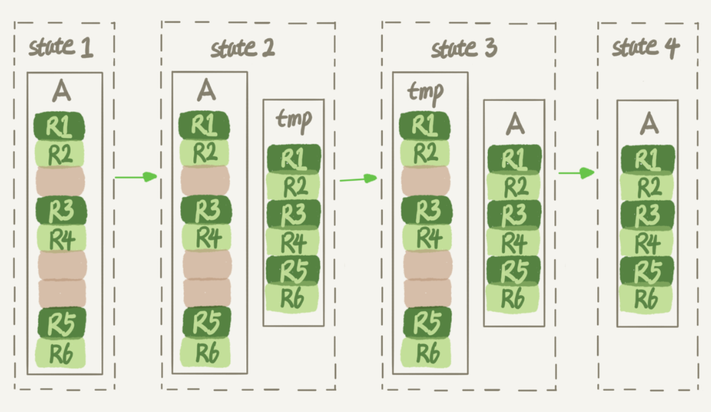

花时间最多的步骤是往临时表插入数据的过程，如果在这个过程中，有新的数据要写入到表 A 的话，就会造成数据丢失。因此，在整个 DDL 过程中，表 A 中不能有更新。也就是说，这个 DDL 不是 Online 的。而在 MySQL 5.6 版本开始引入的 Online DDL，对这个操作流程做了优化。其过程如下：

- 建立一个临时文件，扫描表 A 主键的所有数据页；
- 用数据页中表 A 的记录生成 B+ 树，存储到临时文件中；
- 生成临时文件的过程中，将所有对 A 的操作记录在一个日志文件（row log）中，对应的是图中 state2 的状态；
- 临时文件生成后，将日志文件中的操作应用到临时文件，得到一个逻辑数据上与表 A 相同的数据文件，对应的就是图中 state3 的状态；
- 用临时文件替换表 A 的数据文件。

如图：改进的地方在于由于日志文件记录和重放操作这个功能的存在，这个方案在重建表的过程中，允许对表 A 做增删改操作。这也就是 Online DDL 名字的来源。


上图流程中，alter语句在启动的时候要获取MDL写锁，但为了实现 Online，MDL 读锁不会阻塞增删改操作，这个写锁在真正考不数据之前就退化成读锁了。同时，为了禁止其他线程对这个表同时做DDL，所以不会直接解锁。而对于一个大表来说，Online DDL 最耗时的过程就是拷贝数据到临时表的过程，这个步骤的执行期间可以接受增删改操作。所以，相对于整个 DDL 过程来说，锁的时间非常短。对业务来说，就可以认为是 Online 的。

### Online和Inplace

第一个图中，我们把表 A 中的数据导出来的存放位置叫作 tmp_table。这是一个临时表，是在 server 层创建的。第二个图中，根据表 A 重建出来的数据是放在“tmp_file”里的，这个临时文件是 InnoDB 在内部创建出来的。整个 DDL 过程都在 InnoDB 内部完成。对于 server 层来说，没有把数据挪动到临时表，是一个“原地”操作，这就是“inplace”名称的来源。optimize table、analyze table 和 alter table 这三种方式重建表的区别：从 MySQL 5.6 版本开始，alter table t engine = InnoDB（也就是 recreate）默认的就是上面第二个图 的流程；analyze table t 其实不是重建表，只是对表的索引信息做重新统计，没有修改数据，这个过程中加了 MDL 读锁；optimize table t 等于 recreate+analyze。

#### 不同Count（）的区别

count(*)、count(主键 id) 和 count(1) 都表示返回满足条件的结果集的总行数；而 count(字段），则表示返回满足条件的数据行里面，参数“字段”不为 NULL 的总个数。

性能差别：server 层要什么就给什么；InnoDB 只给必要的值；现在的优化器只优化了 count(*) 的语义为“取行数”。

- count（主键id），InnoDB 引擎会遍历整张表，把每一行的 id 值都取出来，返回给 server 层。server 层拿到 id 后，判断是不可能为空的，就按行累加。
- count（1），InnoDB 引擎遍历整张表，但不取值。server 层对于返回的每一行，放一个数字“1”进去，判断是不可能为空的，按行累加。单看这两个用法的差别的话，你能对比出来，count(1) 执行得要比 count(主键 id) 快。因为从引擎返回 id 会涉及到解析数据行，以及拷贝字段值的操作。
- count（字段），如果这个“字段”是定义为 not null 的话，一行行地从记录里面读出这个字段，判断不能为 null，按行累加；如果这个“字段”定义允许为 null，那么执行的时候，判断到有可能是 null，还要把值取出来再判断一下，不是 null 才累加。
- **例外的count(*)**，并不会把全部字段取出来，而是专门做了优化，不取值。count(*) 肯定不是 null，按行累加。

所以结论是：按照效率排序的话，**count(字段)<count(主键 id)<count(1)≈count(*)**。

##### 日志相关问题


如果在图中时刻 A 的地方，也就是写入 redo log 处于 prepare 阶段之后、写 binlog 之前，发生了崩溃（crash），由于此时 binlog 还没写，redo log 也还没提交，所以崩溃恢复的时候，这个事务会回滚。这时候，binlog 还没写，所以也不会传到备库。

如果时刻B，系统crash，崩溃恢复的时候如何处理呢？其具体规则为：

1、如果 redo log 里面的事务是完整的，也就是已经有了 commit 标识，则直接提交；

2、如果 redo log 里面的事务只有完整的 prepare，则判断对应的事务 binlog 是否存在并完整：

- 如果是，则提交事务；
- 否则，回滚事务。

MySQL检查binlog是否完整，statement格式的binlog，最后会有commit，row格式的binlog，最后会有XID event。MySQL 5.6.2之后，引入了binlog-checksum参数，验证binlog内容的正确性。两阶段提交是经典的分布式系统问题，对于 InnoDB 引擎来说，如果 redo log 提交完成了，事务就不能回滚（如果这还允许回滚，就可能覆盖掉别的事务的更新）。而如果 redo log 直接提交，然后 binlog 写入的时候失败，InnoDB 又回滚不了，数据和 binlog 日志又不一致了。

#### Order By 全字段排序VS RowID排序

如果MySQL担心排序内存太小，会影响排序效率，就会采用rowid排序算法，这个排序过程中一次可以排序更多行，但是需要回原表去取数据。如果MySQL认为内存足够大，就会优先选择全字段排序，把需要的字段都放到sort_buffer，这样排序后就直接从内存返回查询结果。也体现MySQL的一个设计思想，**如果内存够，就更多利用内存，尽量减少磁盘访问**。

假设你要查询城市是“杭州”的所有人名字，并且按照姓名排序返回前 1000 个人的姓名、年龄

```mysql
select city,name,age from t where city='杭州' order by name limit 1000  ;
```

执行流程：

- 初始化 sort_buffer，确定放入 name、city、age 这三个字段；
- 从索引 city 找到第一个满足 city='杭州’条件的主键 id，也就是图中的 ID_X；
- 到主键 id 索引取出整行，取 name、city、age 三个字段的值，存入 sort_buffer 中；
- 从索引 city 取下一个记录的主键 id；
- 重复步骤 3、4 直到 city 的值不满足查询条件为止，对应的主键 id 也就是图中的 ID_Y；
- 对 sort_buffer 中的数据按照字段 name 做快速排序；
- 按照排序结果取前 1000 行返回给客户端。

如下图：


图中“按 name 排序”这个动作，可能在内存中完成，也可能需要使用外部排序，这取决于排序所需的内存和参数 sort_buffer_size。

命令行循环插入数据：

~~~mysql

mysql> CREATE TABLE `words` (
  `id` int(11) NOT NULL AUTO_INCREMENT,
  `word` varchar(64) DEFAULT NULL,
  PRIMARY KEY (`id`)
) ENGINE=InnoDB;

delimiter ;;
create procedure idata()
begin
  declare i int;
  set i=0;
  while i<10000 do
    insert into words(word) values(concat(char(97+(i div 1000)), char(97+(i % 1000 div 100)), char(97+(i % 100 div 10)), char(97+(i % 10))));
    set i=i+1;
  end while;
end;;
delimiter ;

call idata();
~~~

#### 长时间不返回数据

1、检查表是否被锁住，show processlist 命令查看是否有持有或者等待MDL锁的，如果有（状态为 Waiting for table metadata lock ），找到相关线程，kill即可。

~~~mysql
select blocking_pid from sys.schema_table_lock_waits;
~~~

2、等flush，show processlist之后状态为（Waiting for table flush）。

3、**带 lock in share mode 的 SQL 语句，是当前读**，普通的select是一致性读。事务开始之后读取的只是事务开启时间点时该行记录的快照数据，只有当你要更新或者请求锁记录时才会获取到真实的行数据。

- Snapshot read:读取记录的可见版本(有可能是历史版本), no-locking，no-locking reads:简单的select语句

- Current read：读取的是记录的最新版本，加锁保证事务隔离性。locking-reads: 特殊操作, 插入/更新/删除操作

  ~~~mysql
  select …… for update 
  select …… in share mode
  insert/ update / delete
  ~~~

### 幻读与间隙锁

~~~mysql

CREATE TABLE `t` (
  `id` int(11) NOT NULL,
  `c` int(11) DEFAULT NULL,
  `d` int(11) DEFAULT NULL,
  PRIMARY KEY (`id`),
  KEY `c` (`c`)
) ENGINE=InnoDB;

insert into t values(0,0,0),(5,5,5),
(10,10,10),(15,15,15),(20,20,20),(25,25,25);
~~~

产生幻读的原因是，行锁只能锁住行，但是新插入记录这个动作，要更新的是记录之间的“间隙”。因此，为了解决幻读问题，InnoDB 只好引入新的锁，也就是间隙锁 (Gap Lock)。间隙锁，锁的就是两个值之间的空隙。间隙锁是在可重复读隔离级别下才会生效的。比如文章开头的表 t，初始化插入了 6 个记录，这就产生了 7 个间隙。间隙锁跟行锁还不太一样，行锁分成读锁和写锁，除了读读之间兼容，其他都会冲突；但间隙锁不一样，跟间隙锁存在冲突关系的，是**“往这个间隙中插入一个记录”这个操作。间隙锁之间都不存在冲突关系**。

间隙锁和行锁合称 next-key lock，每个 next-key lock 是前开后闭区间。也就是说，我们的表 t 初始化以后，如果用 select * from t for update 要把整个表所有记录锁起来，就形成了 7 个 next-key lock，分别是 (-∞,0]、(0,5]、(5,10]、(10,15]、(15,20]、(20, 25]、(25, +supremum]。

间隙锁和 next-key lock 的引入，帮我们解决了幻读的问题，但同时也带来了一些“困扰”。比如：任意锁住一行，如果这一行不存在的话就插入，如果存在这一行就更新它的数据，代码如下：

~~~mysql

begin;
select * from t where id=N for update;

/*如果行不存在*/
insert into t values(N,N,N);
/*如果行存在*/
update t set d=N set id=N;

commit;
~~~

这个逻辑一旦有并发，就会碰到死锁:

执行顺序如下：

1. session A 执行 select … for update 语句，由于 id=9 这一行并不存在，因此会加上间隙锁 (5,10);
2. session B 执行 select … for update 语句，同样会加上间隙锁 (5,10)，间隙锁之间不会冲突，因此这个语句可以执行成功；
3. session B 试图插入一行 (9,9,9)，被 session A 的间隙锁挡住了，只好进入等待;
4. session A 试图插入一行 (9,9,9)，被 session B 的间隙锁挡住了。

至此，两个 session 进入互相等待状态，形成死锁。当然，InnoDB 的死锁检测马上就发现了这对死锁关系，让 session A 的 insert 语句报错返回了。所以说**间隙锁的引入，可能会导致同样的语句锁住更大的范围，这其实是影响了并发度的。**

---

### 可重复读隔离级别加锁规则（5.x 系列 <=5.7.24，8.0 系列 <=8.0.13。）

- 原则 1：加锁的基本单位是 next-key lock。next-key lock 是前开后闭区间。
- 原则 2：查找过程中访问到的对象才会加锁。
- 优化 1：索引上的等值查询，给唯一索引加锁的时候，next-key lock 退化为行锁。
- 优化 2：索引上的等值查询，向右遍历时且最后一个值不满足等值条件的时候，next-key lock 退化为间隙锁。
- 一直找，直到不满足为止：唯一索引上的范围查询会访问到不满足条件的第一个值为止。

**案例一：等值查询间隙锁**

操作流程如图：

- 由于表 t 中没有 id=7 的记录，所以用我们上面提到的加锁规则判断一下的话：根据原则 1，加锁单位是 next-key lock，session A 加锁范围就是 (5,10]；

- 同时根据优化 2，这是一个等值查询 (id=7)，而 id=10 不满足查询条件，next-key lock 退化成间隙锁，因此最终加锁的范围是 (5,10)。

  所以，session B 要往这个间隙里面插入 id=8 的记录会被锁住，但是 session C 修改 id=10 这行是可以的。

**案例二：非唯一索引等值锁**

如图：

这里 session A 要给索引 c 上 c=5 的这一行加上读锁。

1. 根据原则 1，加锁单位是 next-key lock，因此会给 (0,5] 加上 next-key lock。
2. 要注意 c 是普通索引，因此仅访问 c=5 这一条记录是不能马上停下来的，需要向右遍历，查到 c=10 才放弃。根据原则 2，访问到的都要加锁，因此要给 (5,10] 加 next-key lock。
3. 但是同时这个符合优化 2：等值判断，向右遍历，最后一个值不满足 c=5 这个等值条件，因此退化成间隙锁 (5,10)。
4. 根据原则 2 ，只有访问到的对象才会加锁，这个查询使用覆盖索引，并不需要访问主键索引，所以主键索引上没有加任何锁，这就是为什么 session B 的 update 语句可以执行完成。如果SessionA执行select d ........Session B 也会被blocked。

但 session C 要插入一个 (7,7,7) 的记录，就会被 session A 的间隙锁 (5,10) 锁住。需要注意，在这个例子中，lock in share mode 只锁覆盖索引，但是如果是 for update 就不一样了。 执行 for update 时，系统会认为你接下来要更新数据，因此会顺便给主键索引上满足条件的行加上行锁。

这个例子说明，锁是加在索引上的；同时，它给我们的指导是，如果你要用 lock in share mode 来给行加读锁避免数据被更新的话，就必须得绕过覆盖索引的优化，在查询字段中加入索引中不存在的字段。比如，将 session A 的查询语句改成 select d from t where c=5 lock in share mode。

**案例三：主键范围锁**

~~~mysql
mysql> select * from t where id=10 for update;
mysql> select * from t where id>=10 and id<11 for update;
~~~

在逻辑上，这两条查语句肯定是等价的，但是它们的加锁规则不太一样，执行如下：

开始执行的时候，要找到第一个 id=10 的行，因此本该是 next-key lock(5,10]。 根据优化 1， 主键 id 上的等值条件，退化成行锁，只加了 id=10 这一行的行锁。范围查找就往后继续找，找到 id=15 这一行停下来，因此需要加 next-key lock(10,15]。所以，session A 这时候锁的范围就是主键索引上，行锁 id=10 和 next-key lock(10,15]。这样，session B 和 session C 的结果你就能理解了。这里你需要注意一点，首次 session A 定位查找 id=10 的行的时候，是当做等值查询来判断的，而向右扫描到 id=15 的时候，用的是范围查询判断。

**案例四：非唯一索引范围锁**

执行流程：

这次 session A 用字段 c 来判断，加锁规则跟案例三唯一的不同是：在第一次用 c=10 定位记录的时候，索引 c 上加了 (5,10] 这个 next-key lock 后，由于索引 c 是非唯一索引，没有优化规则，也就是说不会蜕变为行锁，因此最终 sesion A 加的锁是，索引 c 上的 (5,10] 和 (10,15] 这两个 next-key lock。所以从结果上来看，sesson B 要插入（8,8,8) 的这个 insert 语句时就被堵住了。这里需要扫描到 c=15 才停止扫描，是合理的，因为 InnoDB 要扫到 c=15，才知道不需要继续往后找了。

**案例五：超出唯一索引范围锁（bug？？？）**

执行流程：

session A 是一个范围查询，按照原则 1 的话，应该是索引 id 上只加 (10,15] 这个 next-key lock，并且因为 id 是唯一键，所以循环判断到 id=15 这一行就应该停止了。但是实现上，InnoDB 会往前扫描到第一个不满足条件的行为止，也就是 id=20。而且由于这是个范围扫描，因此索引 id 上的 (15,20] 这个 next-key lock 也会被锁上。所以你看到了，session B 要更新 id=20 这一行，是会被锁住的。同样地，session C 要插入 id=16 的一行，也会被锁住。

**案例六：非唯一索引上存在"等值"的例子**

先插入一条记录：`insert into t values(30,10,30);`这样表里的数据就有两条c = 10的行。这样，间隙就变成下边这样了：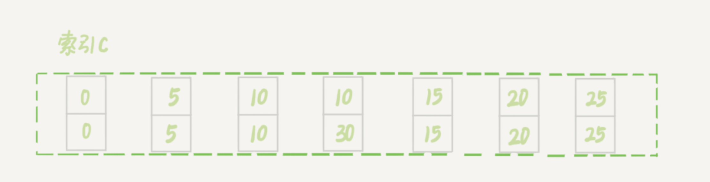

我们再执行如下的语句：session A 在遍历的时候，先访问第一个 c=10 的记录。同样地，根据原则 1，这里加的是 (c=5,id=5) 到 (c=10,id=10) 这个 next-key lock。然后，session A 向右查找，直到碰到 (c=15,id=15) 这一行，循环才结束。根据优化 2，这是一个等值查询，向右查找到了不满足条件的行，所以会退化成 (c=10,id=10) 到 (c=15,id=15) 的间隙锁。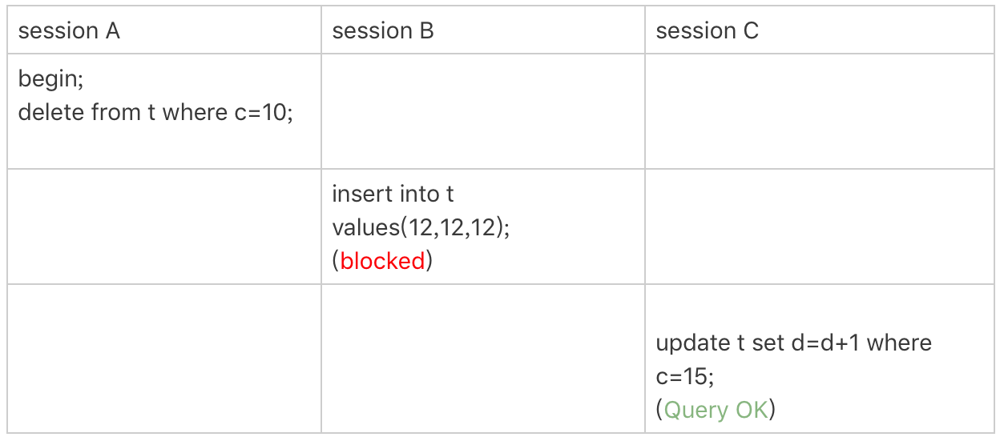

结论：也就是说，这个 delete 语句在索引 c 上的加锁范围，就是下图中蓝色区域覆盖的部分。其中这个蓝色区域左右两边都是虚线，表示开区间，即 (c=5,id=5) 和 (c=15,id=15) 这两行上都没有锁。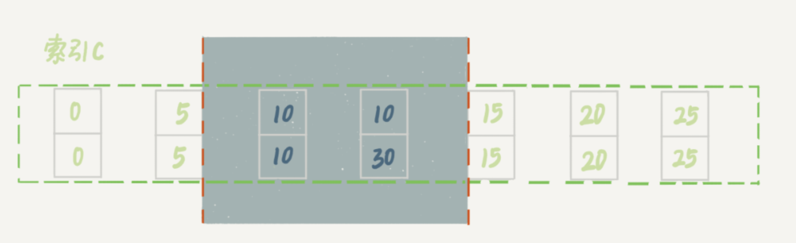

**案例七：limit 语句加锁**


这个例子里，session A 的 delete 语句加了 limit 2。你知道表 t 里 c=10 的记录其实只有两条，因此加不加 limit 2，删除的效果都是一样的，但是加锁的效果却不同。可以看到，session B 的 insert 语句执行通过了，跟案例六的结果不同。这是因为，案例七里的 delete 语句明确加了 limit 2 的限制，因此在遍历到 (c=10, id=30) 这一行之后，满足条件的语句已经有两条，循环就结束了。因此，索引 c 上的加锁范围就变成了从（c=5,id=5) 到（c=10,id=30) 这个前开后闭区间，如下图所示：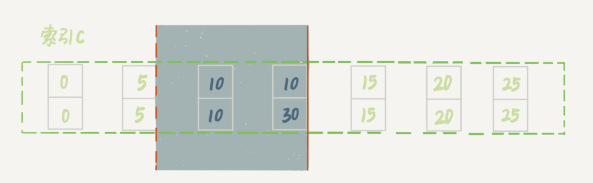

可以看到，(c=10,id=30）之后的这个间隙并没有在加锁范围里，因此 insert 语句插入 c=12 是可以执行成功的。这个例子对我们实践的指导意义就是，**在删除数据的时候尽量加 limit**。这样不仅可以控制删除数据的条数，让操作更安全，还可以减小加锁的范围。

**案例八：一个死锁的例子**

前面的例子中，我们在分析的时候，是按照 next-key lock 的逻辑来分析的，因为这样分析比较方便。最后我们再看一个案例，目的是说明：next-key lock 实际上是间隙锁和行锁加起来的结果。

执行流程：

1. session A 启动事务后执行查询语句加 lock in share mode，在索引 c 上加了 next-key lock(5,10] 和间隙锁 (10,15)；
2. session B 的 update 语句也要在索引 c 上加 next-key lock(5,10] ，进入锁等待；
3. 然后 session A 要再插入 (8,8,8) 这一行，被 session B 的间隙锁锁住。由于出现了死锁，InnoDB 让 session B 回滚。因为session B 的“加 next-key lock(5,10] ”操作，实际上分成了两步，先是加 (5,10) 的间隙锁，加锁成功；然后加 c=10 的行锁，这时候才被锁住的。也就是说，我们在分析加锁规则的时候可以用 next-key lock 来分析。但是要知道，具体执行的时候，是要分成间隙锁和行锁两段来执行的。

我们上面的所有案例都是在可重复读隔离级别 (repeatable-read) 下验证的。同时，可重复读隔离级别遵守两阶段锁协议，所有加锁的资源，都是在事务提交或者回滚的时候才释放的。

---

### 如果一定要踢掉某些连接

max_connections 的计算，不是看谁在 running，是只要连着就占用一个计数位置。对于那些不需要保持的连接，我们可以通过 kill connection 主动踢掉。这个行为跟事先设置 wait_timeout 的效果是一样的。设置 wait_timeout 参数表示的是，一个线程空闲 wait_timeout 这么多秒之后，就会被 MySQL 直接断开连接。但是需要注意，在 show processlist 的结果里，踢掉显示为 sleep 的线程，可能是有损的。我们来看下面这个例子。

在上面这个例子里，如果断开 session A 的连接，因为这时候 session A 还没有提交，所以 MySQL 只能按照回滚事务来处理；而断开 session B 的连接，就没什么大影响。所以，如果按照优先级来说，你应该优先断开像 session B 这样的事务外空闲的连接。首先，通过show processlist 查看sleep 连接，如果有多个处于sleep，通过查询information_schema 库的 innodb_trx 表来看事务具体状态。

~~~mysql
select * from information_schema.innodb_trx\G
~~~

如果是连接数过多，你可以优先断开事务外空闲太久的连接；如果这样还不够，再考虑断开事务内空闲太久的连接。从服务端断开连接使用的是 kill connection + id 的命令， 一个客户端处于 sleep 状态时，它的连接被服务端主动断开后，这个客户端并不会马上知道。直到客户端在发起下一个请求的时候，才会收到这样的报错“ERROR 2013 (HY000): Lost connection to MySQL server during query”。

MySQL 5.7 提供了 query_rewrite 功能，可以把输入的一种语句改写成另外一种模式。比如，语句被错误地写成了 select * from t where id + 1 = 10000，你可以通过下面的方式，增加一个语句改写规则。

~~~mysql

mysql> insert into query_rewrite.rewrite_rules(pattern, replacement, pattern_database) values ("select * from t where id + 1 = ?", "select * from t where id = ? - 1", "db1");

call query_rewrite.flush_rewrite_rules();
~~~

### InnoDB一棵B+树可以存放多少行数据？

我们都知道计算机在存储数据的时候，有最小存储单元，这就好比我们今天进行现金的流通最小单位是一毛。在计算机中磁盘存储数据最小单元是扇区，一个扇区的大小是512字节，而文件系统（例如XFS/EXT4）他的最小单元是块，一个块的大小是4k，而对于我们的InnoDB存储引擎也有自己的最小储存单元——页（Page），一个页的大小是16K。

磁盘扇区、文件系统、InnoDB存储引擎都有各自的最小存储单元。

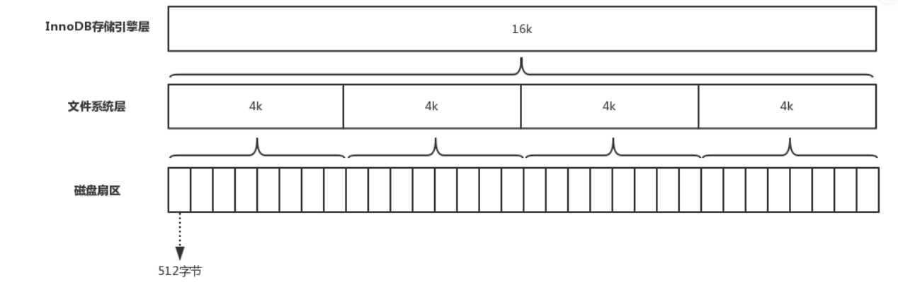

在[MySQL](https://mp.weixin.qq.com/s?__biz=MzUzMTA2NTU2Ng==&mid=2247488132&idx=3&sn=da485b7e53fc1a95acad6baf06892591&scene=21#wechat_redirect)中我们的InnoDB页的大小默认是16k，当然也可以通过参数设置(innodb_page_size)：数据表中的数据都是存储在页中的，所以一个页中能存储多少行数据呢？假设一行数据的大小是1k，那么一个页可以存放16行这样的数据。

如果数据库只按这样的方式存储，那么如何查找数据就成为一个问题，因为我们不知道要查找的数据存在哪个页中，也不可能把所有的页遍历一遍，那样太慢了。所以人们想了一个办法，用B+树的方式组织这些数据。如图所示：

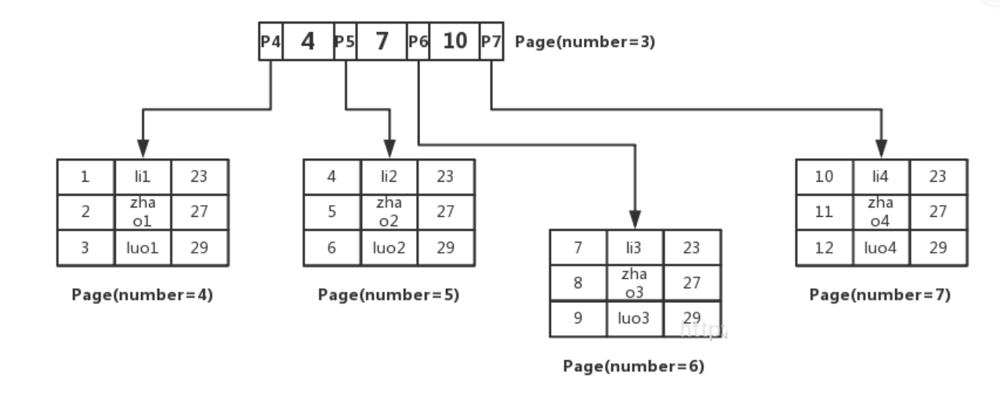

我们先将数据记录按主键进行排序，分别存放在不同的页中（为了便于理解我们这里一个页中只存放3条记录，实际情况可以存放很多），除了存放数据的页以外，还有存放键值+指针的页，如图中page number=3的页，该页存放键值和指向数据页的指针，这样的页由N个键值+指针组成。当然它也是排好序的。这样的数据组织形式，我们称为索引组织表。

现在，我们来查一条数据：**select \* from user where id=5** ;

这里id是主键,我们通过这棵B+树来查找，首先找到根页，你怎么知道user表的根页在哪呢？其实每张表的根页位置在表空间文件中是固定的，即page number=3的页（这点我们下文还会进一步证明），找到根页后通过二分查找法，定位到id=5的数据应该在指针P5指向的页中，那么进一步去page number=5的页中查找，同样通过二分查询法即可找到id=5的记录：

现在我们清楚了InnoDB中主键索引B+树是如何组织数据、查询数据的，我们总结一下：

1、InnoDB存储引擎的最小存储单元是页，页可以用于存放数据也可以用于存放键值+指针，在B+树中叶子节点存放数据，非叶子节点存放键值+指针。

2、索引组织表通过非叶子节点的二分查找法以及指针确定数据在哪个页中，进而在去数据页中查找到需要的数据；

#### 那么回到我们开始的问题，通常一棵B+树可以存放多少行数据？

这里我们先假设B+树高为2，即存在一个根节点和若干个叶子节点，那么这棵B+树的存放总记录数为：**根节点指针数\*单个叶子节点记录行数** 。上文我们已经说明单个叶子节点（页）中的记录数=16K/1K=16。（这里假设一行记录的数据大小为1k，实际上现在很多互联网业务数据记录大小通常就是1K左右）。

**那么现在我们需要计算出非叶子节点能存放多少指针？**

其实这也很好算，我们假设主键ID为bigint类型，长度为8字节，而指针大小在InnoDB源码中设置为6字节，这样一共14字节，我们一个页中能存放多少这样的单元，其实就代表有多少指针，即**16384/14=1170** 。那么可以算出一棵高度为2的B+树，能存放**1170\*16=18720**条这样的数据记录。

**根据同样的原理我们可以算出一个高度为3的B+树可以存放** ：**1170\*1170\*16=21902400**条这样的记录。所以在InnoDB中B+树高度一般为1-3层，它就能满足千万级的数据存储。在查找数据时一次页的查找代表一次IO，所以通过主键索引查询通常只需要1-3次IO操作即可查找到数据。

为什么选用B+ 树，而不用B树呢？

因为B树不管叶子节点还是非叶子节点，都会保存数据，这样导致在非叶子节点中能保存的指针数量变少（有些资料也称为扇出），指针少的情况下要保存大量数据，只能增加树的高度，导致IO操作变多，查询性能变低

B-Tree中的每个节点根据实际情况可以包含大量的关键字信息和分支，如下图所示为一个3阶的B-Tree：

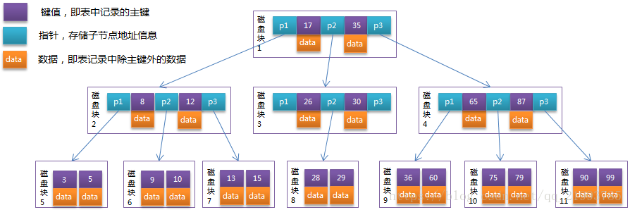

每个节点占用一个盘块的磁盘空间，一个节点上有两个升序排序的关键字和三个指向子树根节点的指针，指针存储的是子节点所在磁盘块的地址。两个关键词划分成的三个范围域对应三个指针指向的子树的数据的范围域。以根节点为例，关键字为17和35，P1指针指向的子树的数据范围为小于17，P2指针指向的子树的数据范围为17~35，P3指针指向的子树的数据范围为大于35。

模拟查找关键字29的过程：

1. 根据根节点找到磁盘块1，读入内存。【磁盘I/O操作第1次】
2. 比较关键字29在区间（17,35），找到磁盘块1的指针P2。
3. 根据P2指针找到磁盘块3，读入内存。【磁盘I/O操作第2次】
4. 比较关键字29在区间（26,30），找到磁盘块3的指针P2。
5. 根据P2指针找到磁盘块8，读入内存。【磁盘I/O操作第3次】
6. 在磁盘块8中的关键字列表中找到关键字29。

分析上面过程，发现需要3次磁盘I/O操作，和3次内存查找操作。由于内存中的关键字是一个有序表结构，可以利用二分法查找提高效率。而3次磁盘I/O操作是影响整个B-Tree查找效率的决定因素。B-Tree相对于AVLTree缩减了节点个数，使每次磁盘I/O取到内存的数据都发挥了作用，从而提高了查询效率。


B+Tree是在B-Tree基础上的一种优化，使其更适合实现外存储索引结构，InnoDB存储引擎就是用B+Tree实现其索引结构。从上一节中的B-Tree结构图中可以看到每个节点中不仅包含数据的key值，还有data值。而每一个页的存储空间是有限的，如果data数据较大时将会导致每个节点（即一个页）能存储的key的数量很小，当存储的数据量很大时同样会导致B-Tree的深度较大，增大查询时的磁盘I/O次数，进而影响查询效率。在B+Tree中，所有数据记录节点都是按照键值大小顺序存放在同一层的叶子节点上，而非叶子节点上只存储key值信息，这样可以大大加大每个节点存储的key值数量，降低B+Tree的高度。

B+Tree相对于B-Tree有几点不同：

1. 非叶子节点只存储键值信息。
2. 所有叶子节点之间都有一个链指针。
3. 数据记录都存放在叶子节点中。

将上一节中的B-Tree优化，由于B+Tree的非叶子节点只存储键值信息，假设每个磁盘块能存储4个键值及指针信息，则变成B+Tree后其结构如下图所示： 

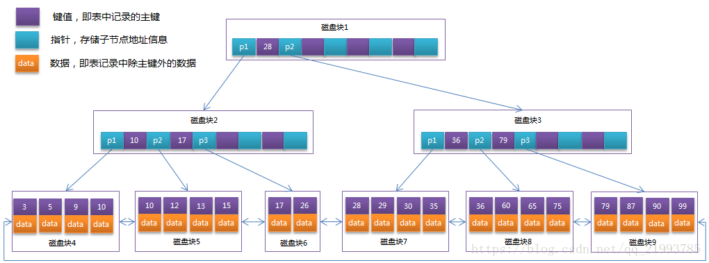

通常在B+Tree上有两个头指针，一个指向根节点，另一个指向关键字最小的叶子节点，而且所有叶子节点（即数据节点）之间是一种链式环结构。因此可以对B+Tree进行两种查找运算：一种是对于主键的范围查找和分页查找，另一种是从根节点开始，进行随机查找。

nnoDB存储引擎中页的大小为16KB，一般表的主键类型为INT（占用4个字节）或BIGINT（占用8个字节），指针类型也一般为4或8个字节，也就是说一个页（B+Tree中的一个节点）中大概存储16KB/(8B+8B)=1K个键值（因为是估值，为方便计算，这里的K取值为〖10〗^3）。也就是说一个深度为3的B+Tree索引可以维护10^3 * 10^3 * 10^3 = 10亿 条记录。

实际情况中每个节点可能不能填充满，因此在数据库中，B+Tree的高度一般都在2~4层。mysql的InnoDB存储引擎在设计时是将根节点常驻内存的，也就是说查找某一键值的行记录时最多只需要1~3次磁盘I/O操作。

数据库中的B+Tree索引可以分为聚集索引（clustered index）和辅助索引（secondary index）。上面的B+Tree示例图在数据库中的实现即为聚集索引，聚集索引的B+Tree中的叶子节点存放的是整张表的行记录数据。辅助索引与聚集索引的区别在于辅助索引的叶子节点并不包含行记录的全部数据，而是存储相应行数据的聚集索引键，即主键。当通过辅助索引来查询数据时，InnoDB存储引擎会遍历辅助索引找到主键，然后再通过主键在聚集索引中找到完整的行记录数据。
