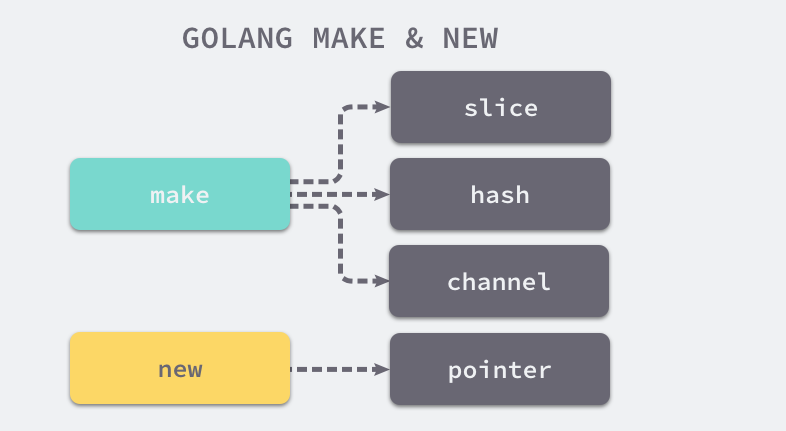
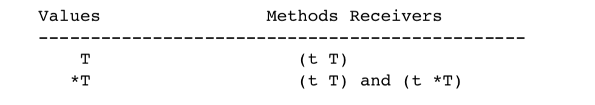
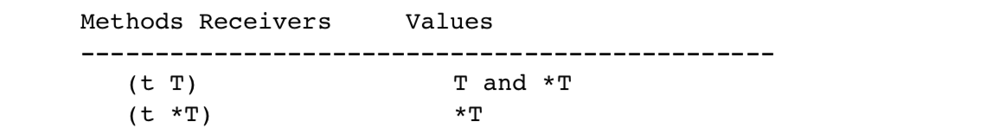
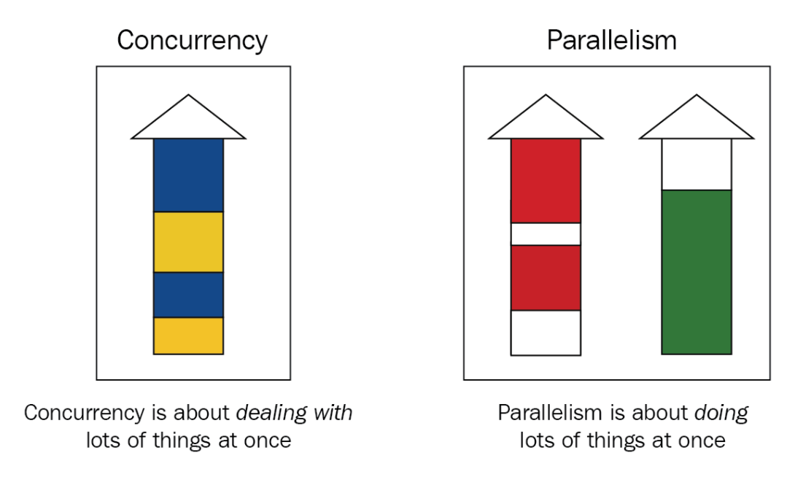
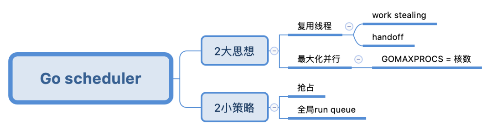
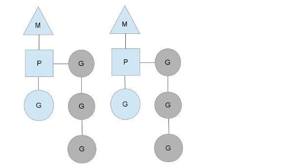
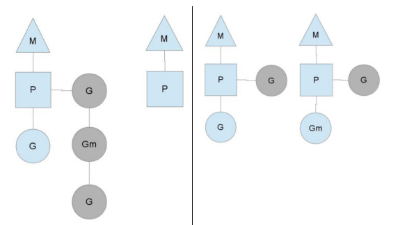

## Golang 

Go中位运算优先级高于 +-*/,这点跟Java不一样，Java中+-*/ 优先级高于位运算。

比较好的框架

### 数组

数组的初始化 **var array [5]int **，go 语言初始化时，会使用对应的零值来给元素初始化。数组不需要显示初始化；数组的零值是一个随时能用的本身就为零值的数组：例如以上的array现在是5个值都为0的一个数组。快速创建：array := [5]int{1,2,3,4,5} 或者 array := [...]int{1,2,3}；声明并给指定元素赋值：array := [5]int{1: 10, 2: 20}。

指针对象如果没有初始化直接赋值，会报错，如下所示：

~~~go
ptr1 := [3]*int{0:new(int),1:new(int)}
*ptr1[2] = 10
~~~

数组变量的类型包括数组长度和每个元素的类型。只有这两部分都相同的数组，才是类型相同的数组，才能互相赋值。编译器会阻止类型不同的数组互相赋值。

append的用法有两种：

- 直接append单个元素，第一个参数为slice,后面可以添加多个参数。 

~~~go
slice = append(slice, elem1, elem2)
~~~

- append另外一个slice，在第二个slice的名称后面加三个点，而且这时候append只支持两个参数，不支持任意个数的参数。

~~~go
slice = append(slice, anotherSlice...)
~~~

### 切片：

简单类型的切片也不需要显示赋值，申明即可使用，如：

~~~go
var temp []int
fmt.Println(temp==nil) //true
temp = append(temp,1)
fmt.Println(temp,len(temp),cap(temp)) //[1] 1 1

m := make([]int,3)
fmt.Println(m,len(m),cap(m)) //[0 0 0] 3 3
m = append(m,1)
fmt.Println(m,len(m),cap(m)) //[0 0 0 1] 4 6

s := arr[startIndex:endIndex] 
~~~

值得注意的是，以上从startIndex~endIndex-1，如果缺省endIndex则表示到最后一个元素，**如果通过make初始化了切片，并且指定了长度，后续append不管有没有超过初始化的长度，都会扩容。**如下：

~~~go
	s1 := make([]int,5)
	fmt.Printf("addr:%p \t\tlen:%v content:%v\n",s1,len(s1),s1)

	s1 = append(s1, 1)
	fmt.Printf("addr:%p \t\tlen:%v content:%v\n",s1,len(s1),s1)
	//addr:0xc00007e060               len:5 content:[0 0 0 0 0]
	//addr:0xc000092000               len:6 content:[0 0 0 0 0 1]
~~~

### 类型互相转换

- string到int

~~~go
int,err:=strconv.Atoi(string)
~~~

- string到int64

~~~go
int64, err := strconv.ParseInt(string, 10, 64)
~~~

- int到string

~~~go
string:=strconv.Itoa(int)
~~~

- int64到string

```go
string:=strconv.FormatInt(int64,10)
```

### 易忽略的点

- **对应TOML配置文件时，对应的Struct必须大写，小写时没法映射，如果是单独属性名放在前边，放在带有标签下的属性时容易映射失败**；
- 使用下划线_可以导入未使用的包
- 不想跳出case循环，即执行完一个分支再进入下一个分支时使用fallthrough关键字
- var identifier []type声明切片，切片在未初始化之前默认为nil，长度为0
- var slice []type=array[start:end]，表示的是从数组array start到end-1索引之间的元素构成的子集。
- 切片、接口、map、通道默认都是引用传递
- 变参函数可以接受slice作参数

### new 和 make 区别

make关键字的主要作用是初始化内置数据结构，比如：数组、切片、哈希表和channel，`new`用于分配并创建一个指向对应类型的指针，当我们想要获取某个类型的指针时可以使用`new`关键字。new(T) 分配类型 T 的零值并返回其地址，也就是指向类型 T 的指针如图：



```go
i := new(int)
var v int
i := &v
```

上述代码片段中的两种不同初始化方法其实是等价的，它们都会创建一个指向 `int` 零值的指针。

在编译期间的类型检查阶段，Go 语言就将代表 `make` 关键字的 `OMAKE` 节点根据参数类型的不同转换成了 `OMAKESLICE`、`OMAKEMAP` 和 `OMAKECHAN` 三种不同类型的节点，这些节点会调用不同的运行时函数来初始化相应的数据结构。

对于new关键字，编译器会在中间代码生成

### Interface 

接口类型检测：

~~~go
type USB interface {
	Name() string
	Connect()
}
func (phone PhoneConnector) Name()string  {
	return phone.name
}
func (phone PhoneConnector)Connect(){
	fmt.Println("Connect"+phone.name)
}
func main(){
	var a USB
	a=PhoneConnector{"Iphone"}
	switch param := a.(type) {
	case PhoneConnector:
		fmt.Printf("%T,%v",param,param)
	}
	a.Connect()
	Disconnect(a)
}

func Disconnect(usb USB){
	if pc,ok:=usb.(PhoneConnector);ok{
		fmt.Println("Disconnected:"+pc.name)
		return
	}
	fmt.Println("Unknown device.")
}
//如何检测一个值v是否实现了接口Stringer：
if v, ok := v.(Stringer); ok {
    fmt.Printf("implements String(): %s\n", v.String())
}
~~~

每个 interface {} 变量在内存中占据两个字长：一个用来存储它包含的类型，另一个用来存储它包含的数据或者指向数据的指针。**如果将某个类型的切片赋值给一个空接口切片，需要显示赋值，原因是在内存中结构不一样**，通过`for-range`逐条赋值。方法集定义了一组关联到给定类型的值或者指针的方法，定义方法时使用的接收者的类型决定了这个方法是关联到值，还是关联到指针，还是两个都关联。go语言中方法集的规则：



从接收者类型的角度来看方法集：



通过这个规则我们发现，**如果使用指针接受者来实现一个接口，那么只有指向那个类型的指针才能够实现对应的接口。如果使用值接受者来实现一个接口，那么那个类型的值和指针都能实现对应的接口**。

#### 反射

[反射详细解析]()

如果需要修改反射类型的值，一定是要settable的，也就是反射类型的指针，不然会报错。具体步骤：先拿到反射后的指针，然后调用Elem()方法，然后调用对应的Set方法。

~~~go
type T struct {
    A int
    B string
}
t := T{23, "Dom Xiao"}
s := reflect.ValueOf(&t).Elem()
typeOfT := s.Type()
for i := 0; i < s.NumField(); i++ {
    f := s.Field(i)
    fmt.Printf("%d: %s %s = %v\n", i,
        typeOfT.Field(i).Name, f.Type(), f.Interface())
}

//输出
0: A int = 23
1: B string = skidoo

s.Field(0).SetInt(77)
s.Field(1).SetString("Sunset Strip")
fmt.Println("t is now", t)//t is now {77 Sunset Strip}
~~~

**并发控制方式：**

Wait   WaitGroup 

Cancel Context模式


在main.main函数执行之前所有代码都运行在同一个goroutine，也就是程序的主系统线程中。因此，如果某个init函数内部用go关键字启动了新的goroutine的话，新的goroutine只有在进入main.main函数之后才可能被执行到。

### GO的数组与切片

数组创建时需要制定长度

var a=[3]{}  这种或者var a=[...]{}这种  ，如果不指定即为切片~

对于类型，和数组的最大不同是，切片的类型和长度信息无关，只要是相同类型元素构成的切片均对应相同的切片类型。

a := [10]{1,2,3,4,5,6}

b :=  a[0:2:cap(a)]      初始化切片时右边的是开区间，左边是闭区间，第三个参数是容量

切片高效操作的要点是要降低内存分配的次数，尽量保证append操作不会超出cap的容量，降低触发内存分配的次数和每次分配内存大小。

并发模型：

Actor模型和CSP模型

<<1 

返回值是值类型还是引用类型：

- 当返回类型不涉及状态变更并且是较简单的数据结构，一律返回值类型
- 当返回类型可能遇到状态变更或者你关心它的生命周期则使用指针类型
- 当返回的结构比较大的时候使用指针类型

**iota**

每次const出现时，都会让iota的值初始化成0。一行中有两个及以上的iota时，在下一行增长，而不是立即取得它的引用，比如 const(A，B = iota+1，iota+2)两个iota的值是一样的

#### CSP（Communicating Sequential Processes）模型与Actor模型

二者的格言都是：

Don't communicate by sharing memory，share memory by communicating.


#### 获取命令行的参数

- 使用os库，如：

  ```go
  func main() {
      args := os.Args
      if args == nil  { // 校验参数并输出提示信息
          return
      }
      fmt.Printf("%T\n", args) 
      fmt.Printf("%v\n", args)
  }
  ```

go build main.go 

./main -name DomXiao

输出：[]string [./main -name DomXiao]

- 使用flag库，步骤：

  1）定义各个参数的类型、名字、默认值与提示信息

  2）解析

  3）获取参数值

```go
func main() {
    name := flag.String("name", "", "Your name")
    var age int
    flag.IntVar(&age, "age", -1, "Your age")

    flag.Parse()

    println("name", *name)
    println("age", age)
}
```

### Panic 和 Recover

panic 能改变程序的控制流，函数调用panic 时会立刻停止执行函数的其他代码，并在执行结束后在当前Goroutine中递归执行调用方的延迟函数调用defer，recover` 可以中止 `panic` 造成的程序崩溃。它是一个只能在 `defer` 中发挥作用的函数，在其他作用域中调用不会发挥任何作用。

#### defer问题

官方对defer的执行时机做的阐述，分别是：

- 包裹defer的函数返回时
- 包裹defer的函数执行到末尾时
- 所在的goroutine发生panic时

当有多个defer时，执行顺序是LIFO。

```go
func unameReturnValues() int {
    var result int
    defer func() {
        result++
        fmt.Println("I'm unamed defer~")
    }()
    return result
}

func namedReturnValues() (result int) {
    defer func() {
        result++
        fmt.Println("I'm named defer~")
    }()
    return result
}
```

上面的方法会输出0，下面的方法输出1。上面的方法使用了匿名返回值，下面的使用了命名返回值，除此之外其他的逻辑均相同，为什么输出的结果会有区别呢？

Defer过程如下:

- 将result赋值给返回值（可以理解成Go自动创建了一个返回值retValue，相当于执行retValue = result）
- 然后检查是否有defer，如果有则执行
- 返回刚才创建的返回值（retValue）

在这种情况下，defer中的修改是对result执行的，而不是retValue，所以defer返回的依然是retValue。在命名返回值方法中，由于返回值在方法定义时已经被定义，所以没有创建retValue的过程，result就是retValue，defer对于result的修改也会被直接返回。

**当调用os.Exit()方法退出程序时，defer并不会被执行。**

**Go 中如何判断一个变量的类型？？？**

通过类型断言，如：

~~~go
s1 := map[int]string{0:"zero",1:"one",2:"two"}
value,ok := interface{}(s1).(map[int]string)
fmt.Println(value,ok)
//输出：map[0:zero 1:one 2:two] true
~~~

#### 类型转换时值得注意的点

- 对于整数类型值、整数常量之间的类型转换，原则上只要源值在目标类型的可表示范围之内就是合法的。但如果源整数类型的范围比较大，目标类型的范围比较小的时候，会出现截掉高位的二进制数据。比如：

```go
var srcInt = int16(-255)
dsInt := int8(srcInt)
fmt.PrintLn(dsInt)//1
```

首先你要知道，整数在 Go 语言以及计算机中都是以补码的形式存储的。这主要是为了简化计算机对整数的运算过程。补码其实就是原码各位求反再加 1。比如，int16 类型的值<code>-255</code>的补码是<code>1111111100000001</code>。如果我们把该值转换为<code>int8</code>类型的值，那么 Go 语言会把在较高位置（或者说最左边位置）上的 8 位二进制数直接截掉，从而得到<code>00000001</code>。又由于其最左边一位是0，表示正整数，以及**正整数的补码就等于源码（负数的补码等于源码+1）**，所以值为1。一定要记住，当整数值的类型的有效范围由宽变窄时，只需在补码形式下截掉一定数量的高位二进制数即可。类似的快刀斩乱麻规则还有：当把一个浮点数类型的值转换为整数类型值时，前者的小数部分会被全部截掉。

- <strong>第二，虽然直接把一个整数值转换为一个<code>string</code>类型的值是可行的，但值得关注的是，被转换的整数值应该可以代表一个有效的 Unicode 代码点，否则转换的结果将会是<code>"�"</code>（仅由高亮的问号组成的字符串值）。</strong>

~~~go
fmt.PrintLn(string(-1))//�
~~~


#### 数组和切片

数组类型的值长度是固定的，而切片类型的值是可变长的。数组的长度在声明的时候就必须给出，并且之后不会改变，而且数组的长度是其类型的一部分。[1]string 与 [2]string是两个不同的数组类型。


Go语言切片类型属于引用类型，同属于引用类型的还有**字典类型、通道类型、函数**类型；数组属于值类型，同属于值类型的有基础数据类型及结构体类型。 切片在初始化时，如果没有指定其容量，那么其容量跟长度是一样的。如果在初始化时指明了容量，那么切片的实际容量也就是它了。

~~~go
  slice1 := []int{0,1,2,3,4,5,6}
  slice3 := []int{7,5}
  slice1 = append(slice1,slice3...)//一个切片append到另一个切片
	slice2 := slice1[3:6]
	fmt.Println("slice2 length:",len(slice2),",slice2 cap:",cap(slice2))
  //输出：slice2 length: 3 ,slice2 cap: 4
	s1 := make([]int, 5)
	s2 := make([]int, 5,8)
~~~

更通用的规则是：一个切片的容量可以被看作是透过这个窗口最多可以看到的底层数组中元素的个数。S4是通过在S3shang施加切片操作得来的，所以S3d底层数组就是S4的底层数组。在底层数组不变的情况下，切片代表的窗口可以向右扩展，直至其底层数组的末尾。注意，**切片代表的窗口是无法向左扩展的**。

**一定要注意切片的扩容**

~~~go
var x []int
	//x := []int{}
	x = append(x, 0)
	x = append(x, 1)
	x = append(x, 2)
	y := append(x, 3)
	z := append(x, 4)
	fmt.Println(y, z)
	fmt.Println(len(x),cap(x))
  //[0 1 2 4] [0 1 2 4]
  //3 4

func doAppend(a []int) {
	_ = append(a, 0)
}


func main() {
	a := []int{1, 2, 3, 4, 5}
	doAppend(a[0:2])
	fmt.Println(a)//[1 2 0 4 5]
}

~~~

Go 语言字典的键类型不可以是**函数类型、字典类型和切片类型**。

#### 通道

通道类型的值是并发安全的，这也是Go语言自带的，唯一一个可以满足并发安全性的类型。声明并初始化通道的时候使用make关键字，第一个参数代表通道的类型、第二个可选参数表示该通道的容量。当容量为0时，也叫非缓冲通道。**一个通道相当于一个先进先出(FIFO)的队列**，通道中格格元素值都是严格地按照发送的顺序排列的，先被发送通道的元素一定会先被接收。

通道关闭的原则：**don't close a channel from the receiver side and don't close a channel if the channel has multiple concurrent senders**. In other words, we should only close a channel in a sender goroutine if the sender is the only sender of the channel.

##### 优雅的关闭通道：

1. 利用recover机制，简单粗暴直接关闭，这种不太符合关闭通道的原则，同时也会有数据并发问题。

   ~~~go
   func SafeClose(ch chan T) (justClosed bool) {
   	defer func() {
   		if recover() != nil {
   			// The return result can be altered
   			// in a defer function call.
   			justClosed = false
   		}
   	}()
   
   	// assume ch != nil here.
   	close(ch)   // panic if ch is closed
   	return true // <=> justClosed = true; return
   }
   
   //sending values to a potential closed channel.
   func SafeSend(ch chan T, value T) (closed bool) {
   	defer func() {
   		if recover() != nil {
   			closed = true
   		}
   	}()
   
   	ch <- value  // panic if ch is closed
   	return false // <=> closed = false; return
   }
   ~~~

2. 用`sync.Once`来关闭或者`sync.Mutex`  仍然无法阻止并发问题

   ~~~go
   type MyChannel struct {
   	C    chan T
   	once sync.Once
   }
   
   func NewMyChannel() *MyChannel {
   	return &MyChannel{C: make(chan T)}
   }
   
   func (mc *MyChannel) SafeClose() {
   	mc.once.Do(func() {
   		close(mc.C)
   	})
   }
   ~~~

   ~~~go
   type MyChannel struct {
   	C      chan T
   	closed bool
   	mutex  sync.Mutex
   }
   
   func NewMyChannel() *MyChannel {
   	return &MyChannel{C: make(chan T)}
   }
   
   func (mc *MyChannel) SafeClose() {
   	mc.mutex.Lock()
   	defer mc.mutex.Unlock()
   	if !mc.closed {
   		close(mc.C)
   		mc.closed = true
   	}
   }
   
   func (mc *MyChannel) IsClosed() bool {
   	mc.mutex.Lock()
   	defer mc.mutex.Unlock()
   	return mc.closed
   }
   ~~~

3. #### M receivers, one sender, the sender says "no more sends" by closing the data channel

   ~~~go
   //let the sender close the data channel when it doesn't want to send more.
   package main
   
   import (
   	"time"
   	"math/rand"
   	"sync"
   	"log"
   )
   
   func main() {
   	rand.Seed(time.Now().UnixNano())
   	log.SetFlags(0)
   
   	// ...
   	const Max = 100000
   	const NumReceivers = 100
   
   	wgReceivers := sync.WaitGroup{}
   	wgReceivers.Add(NumReceivers)
   
   	// ...
   	dataCh := make(chan int)
   
   	// the sender
   	go func() {
   		for {
   			if value := rand.Intn(Max); value == 0 {
   				// The only sender can close the
   				// channel at any time safely.
   				close(dataCh)
   				return
   			} else {
   				dataCh <- value
   			}
   		}
   	}()
   
   	// receivers
   	for i := 0; i < NumReceivers; i++ {
   		go func() {
   			defer wgReceivers.Done()
   
   			// Receive values until dataCh is
   			// closed and the value buffer queue
   			// of dataCh becomes empty.
   			for value := range dataCh {
   				log.Println(value)
   			}
   		}()
   	}
   wgReceivers.Wait()
   }
   ~~~

4. #### One receiver, N senders, the only receiver says "please stop sending more" by closing an additional signal channel

   ~~~go
   //We can't let the receiver close the data channel to stop data transferring, for doing this will break the channel closing principle. But we can let the receiver close an additional signal channel to notify senders to stop sending values.
   package main
   
   import (
   	"time"
   	"math/rand"
   	"sync"
   	"log"
   )
   
   func main() {
   	rand.Seed(time.Now().UnixNano())
   	log.SetFlags(0)
   
   	// ...
   	const Max = 100000
   	const NumSenders = 1000
   
   	wgReceivers := sync.WaitGroup{}
   	wgReceivers.Add(1)
   
   	// ...
   	dataCh := make(chan int)
   	stopCh := make(chan struct{})
   		// stopCh is an additional signal channel.
   		// Its sender is the receiver of channel
   		// dataCh, and its receivers are the
   		// senders of channel dataCh.
   
   	// senders
   	for i := 0; i < NumSenders; i++ {
   		go func() {
   			for {
   				// The try-receive operation is to try
   				// to exit the goroutine as early as
   				// possible. For this specified example,
   				// it is not essential.
   				select {
   				case <- stopCh:
   					return
   				default:
   				}
   
   				// Even if stopCh is closed, the first
   				// branch in the second select may be
   				// still not selected for some loops if
   				// the send to dataCh is also unblocked.
   				// But this is acceptable for this
   				// example, so the first select block
   				// above can be omitted.
   				select {
   				case <- stopCh:
   					return
   				case dataCh <- rand.Intn(Max):
   				}
   			}
   		}()
   	}
   
   	// the receiver
   	go func() {
   		defer wgReceivers.Done()
   
   		for value := range dataCh {
   			if value == Max-1 {
   				// The receiver of channel dataCh is
   				// also the sender of stopCh. It is
   				// safe to close the stop channel here.
   				close(stopCh)
   				return
   			}
   
   			log.Println(value)
   		}
   	}()
   
   	// ...
   	wgReceivers.Wait()
   }
   ~~~

   In this example, the channel `dataCh` is never closed. Yes, channels don't have to be closed. A channel will be eventually garbage collected if no goroutines reference it any more, whether it is closed or not. So the gracefulness of closing a channel here is not to close the channel.

5. #### M receivers, N senders, any one of them says "let's end the game" by notifying a moderator to close an additional signal channel

   we can introduce a moderator role to close the additional signal channel. One trick in the following example is how to use a try-send operation to notify the moderator to close the additional signal channel.

   ~~~go
   package main
   
   import (
   	"time"
   	"math/rand"
   	"sync"
   	"log"
   	"strconv"
   )
   
   func main() {
   	rand.Seed(time.Now().UnixNano())
   	log.SetFlags(0)
   
   	// ...
   	const Max = 100000
   	const NumReceivers = 10
   	const NumSenders = 1000
   
   	wgReceivers := sync.WaitGroup{}
   	wgReceivers.Add(NumReceivers)
   
   	// ...
   	dataCh := make(chan int)
   	stopCh := make(chan struct{})
   		// stopCh is an additional signal channel.
   		// Its sender is the moderator goroutine shown
   		// below, and its receivers are all senders
   		// and receivers of dataCh.
   	toStop := make(chan string, 1)
   		// The channel toStop is used to notify the
   		// moderator to close the additional signal
   		// channel (stopCh). Its senders are any senders
   		// and receivers of dataCh, and its receiver is
   		// the moderator goroutine shown below.
   		// It must be a buffered channel.
   
   	var stoppedBy string
   
   	// moderator
   	go func() {
   		stoppedBy = <-toStop
   		close(stopCh)
   	}()
   
   	// senders
   	for i := 0; i < NumSenders; i++ {
   		go func(id string) {
   			for {
   				value := rand.Intn(Max)
   				if value == 0 {
   					// Here, the try-send operation is
   					// to notify the moderator to close
   					// the additional signal channel.
   					select {
   					case toStop <- "sender#" + id:
   					default:
   					}
   					return
   				}
   
   				// The try-receive operation here is to
   				// try to exit the sender goroutine as
   				// early as possible. Try-receive and
   				// try-send select blocks are specially
   				// optimized by the standard Go
   				// compiler, so they are very efficient.
   				select {
   				case <- stopCh:
   					return
   				default:
   				}
   
   				// Even if stopCh is closed, the first
   				// branch in this select block might be
   				// still not selected for some loops
   				// (and for ever in theory) if the send
   				// to dataCh is also non-blocking. If
   				// this is unacceptable, then the above
   				// try-receive operation is essential.
   				select {
   				case <- stopCh:
   					return
   				case dataCh <- value:
   				}
   			}
   		}(strconv.Itoa(i))
   	}
   
   	// receivers
   	for i := 0; i < NumReceivers; i++ {
   		go func(id string) {
   			defer wgReceivers.Done()
   
   			for {
   				// Same as the sender goroutine, the
   				// try-receive operation here is to
   				// try to exit the receiver goroutine
   				// as early as possible.
   				select {
   				case <- stopCh:
   					return
   				default:
   				}
   
   				// Even if stopCh is closed, the first
   				// branch in this select block might be
   				// still not selected for some loops
   				// (and forever in theory) if the receive
   				// from dataCh is also non-blocking. If
   				// this is not acceptable, then the above
   				// try-receive operation is essential.
   				select {
   				case <- stopCh:
   					return
   				case value := <-dataCh:
   					if value == Max-1 {
   						// Here, the same trick is
   						// used to notify the moderator
   						// to close the additional
   						// signal channel.
   						select {
   						case toStop <- "receiver#" + id:
   						default:
   						}
   						return
   					}
   
   					log.Println(value)
   				}
   			}
   		}(strconv.Itoa(i))
   	}
   
   	// ...
   	wgReceivers.Wait()
   	log.Println("stopped by", stoppedBy)
   }
   ~~~

   the buffer size (capacity) of channel `toStop` is one. This is to avoid the first notification is missed when it is sent before the moderator goroutine gets ready to receive notification from `toStop`.

   We can also set the capacity of the `toStop` channel as the sum number of senders and receivers, then we don't need a try-send `select` block to notify the moderator.

   ~~~go
   ...
   toStop := make(chan string, NumReceivers + NumSenders)
   ...
   			value := rand.Intn(Max)
   			if value == 0 {
   				toStop <- "sender#" + id
   				return
   			}
   ...
   				if value == Max-1 {
   					toStop <- "receiver#" + id
   					return
   				}
   ...
   ~~~

6. #### A variant of the "M receivers, one sender" situation: the close request is made by a third-party goroutine

   Sometimes, it is needed that the close signal must be made by a third-party goroutine. For such cases, we can use an extra signal chanel to notify the sender to close the data channel. Here is the example:

   ~~~go
   package main
   
   import (
   	"time"
   	"math/rand"
   	"sync"
   	"log"
   )
   
   func main() {
   	rand.Seed(time.Now().UnixNano())
   	log.SetFlags(0)
   
   	// ...
   	const Max = 100000
   	const NumReceivers = 100
   	const NumThirdParties = 15
   
   	wgReceivers := sync.WaitGroup{}
   	wgReceivers.Add(NumReceivers)
   
   	// ...
   	dataCh := make(chan int)
   	closing := make(chan struct{}) // signal channel
   	closed := make(chan struct{})
   	
   	// The stop function can be called
   	// multiple times safely.
   	stop := func() {
   		select {
   		case closing<-struct{}{}:
   			<-closed
   		case <-closed:
   		}
   	}
   	
   	// some third-party goroutines
   	for i := 0; i < NumThirdParties; i++ {
   		go func() {
   			r := 1 + rand.Intn(3)
   			time.Sleep(time.Duration(r) * time.Second)
   			stop()
   		}()
   	}
   
   	// the sender
   	go func() {
   		defer func() {
   			close(closed)
   			close(dataCh)
   		}()
   
   		for {
   			select{
   			case <-closing: return
   			default:
   			}
   
   			select{
   			case <-closing: return
   			case dataCh <- rand.Intn(Max):
   			}
   		}
   	}()
   
   	// receivers
   	for i := 0; i < NumReceivers; i++ {
   		go func() {
   			defer wgReceivers.Done()
   
   			for value := range dataCh {
   				log.Println(value)
   			}
   		}()
   	}
   
   	wgReceivers.Wait()
   }
   ~~~

7. #### A variant of the "N sender" situation: the data channel must be closed to tell receivers that data sending is over

   In the solutions for the above N-sender situations, to hold the **channel closing principle**, we avoid closing the data channels. However, sometimes, it is required that the data channels must be closed in the end to let receivers know data sending is over. For such cases, we can translate a N-sender situation to a one-sender situation by using a middle channel. The middle channel has only one sender, so that we can close it instead of closing the original data channel.

   ~~~go
   package main
   
   import (
   	"time"
   	"math/rand"
   	"sync"
   	"log"
   	"strconv"
   )
   
   func main() {
   	rand.Seed(time.Now().UnixNano())
   	log.SetFlags(0)
   
   	// ...
   	const Max = 1000000
   	const NumReceivers = 10
   	const NumSenders = 1000
   	const NumThirdParties = 15
   
   	wgReceivers := sync.WaitGroup{}
   	wgReceivers.Add(NumReceivers)
   
   	// ...
   	dataCh := make(chan int)     // will never be closed
   	middleCh := make(chan int)   // will be closed
   	closing := make(chan string) // signal channel
   	closed := make(chan struct{})
   
   	var stoppedBy string
   
   	// The stop function can be called
   	// multiple times safely.
   	stop := func(by string) {
   		select {
   		case closing <- by:
   			<-closed
   		case <-closed:
   		}
   	}
   	
   	// the middle layer
   	go func() {
   		exit := func(v int, needSend bool) {
   			close(closed)
   			if needSend {
   				dataCh <- v
   			}
   			close(dataCh)
   		}
   
   		for {
   			select {
   			case stoppedBy = <-closing:
   				exit(0, false)
   				return
   			case v := <- middleCh:
   				select {
   				case stoppedBy = <-closing:
   					exit(v, true)
   					return
   				case dataCh <- v:
   				}
   			}
   		}
   	}()
   	
   	// some third-party goroutines
   	for i := 0; i < NumThirdParties; i++ {
   		go func(id string) {
   			r := 1 + rand.Intn(3)
   			time.Sleep(time.Duration(r) * time.Second)
   			stop("3rd-party#" + id)
   		}(strconv.Itoa(i))
   	}
   
   	// senders
   	for i := 0; i < NumSenders; i++ {
   		go func(id string) {
   			for {
   				value := rand.Intn(Max)
   				if value == 0 {
   					stop("sender#" + id)
   					return
   				}
   
   				select {
   				case <- closed:
   					return
   				default:
   				}
   
   				select {
   				case <- closed:
   					return
   				case middleCh <- value:
   				}
   			}
   		}(strconv.Itoa(i))
   	}
   
   	// receivers
   	for range [NumReceivers]struct{}{} {
   		go func() {
   			defer wgReceivers.Done()
   
   			for value := range dataCh {
   				log.Println(value)
   			}
   		}()
   	}
   
   	// ...
   	wgReceivers.Wait()
   	log.Println("stopped by", stoppedBy)
   }
   ~~~

#### 通道发送和接收的特征：

- 对同一个通道，发送操作之间是互斥的，操作之间也是互斥的。
- 发送操作和接收操作中对元素值的处理都是不可分割的。
- 发送操作在完全完成之前会被阻塞，接收操作也是如此。

同一时刻，Go语言的运行时系统只会执行对同一个通道的任意个发送操作中的某一个。直到这个元素值被完全复制进该通道，针对该通道的其他操作才可能被执行。对接收操作也是。

对于缓冲通道，当通道已满时，对它的所有发送操作都会被阻塞，直到通道中有元素被接收走。如果通道已空，对它的所有接收操作都会被阻塞，直到通道中有新的元素出现。对于阻塞的goroutine，会顺序进入通道内的队列，公平的等待接收通知。对于非缓冲通道，只有发送端和接收端都准备好之后，才会继续传递。所以，非缓冲通道是用同步的方式传递数据。**当对已关闭的通道进行发送操作时或者关闭已关了的通道时**，会引发panic。

当用两个值来接收通道的值，第二个变量的类型则一定是bool，如果为false则说明通道已关闭，如果通道关闭，通道里还有值，那么第一个值仍会是通道中的某一个元素值，而第二个结果一定是true。所以如果通过第二个值来判断通道是否关闭可能会有延时。因此，要让发送方来关闭通道。

Select  case 中如果有多个case满足条件，会采用伪随机的情况选中一个case。

#### 结构体

结构体比较的时候，只有相同类型的结构体才可以用==比较，**结构体是否相同不但与属性个数有关，还与属性顺序相关**。如果结构体中有不可比较的类型，如map，slice也不能用==进行比较，但可以用reflect.DeepEqual()进行比较。

#### 接口

**如果我们使用一个变量给另外一个变量赋值，那么真正赋值给后者的，并不是前者持有的那个值，而是该值的一个副本。**例如，声明并初始化一个Dog类型的变量dog1，这时它的name是"little dog"，然后把dog1赋值给dog2，再接着修改了dog1的name字段的值。这时，dog2的name字段的值依旧是"little dog"。

~~~go
  var d *Dog
	 fmt.Println("The first dog is nil.",d == nil)
	 d1 := d
	fmt.Println("The second dog is nil.",d1 == nil)
	var p Pet=d1
	fmt.Println("The third dos is nil???",p==nil)
	//输出结果：true true false
~~~

那么，怎样才能让一个接口变量的值真正为nil?

要么只声明它但不做初始化，要么直接把字面量nil 赋值给它。当把一个有类型的nil赋值给它时，比如上边的例子，p的值实际上是一个*Dog类型的你来，此时Go语言会用一个iface的实例包装它，包装后就不是nil了。当我们给接口变量赋值时，接口变量会持有被赋予值的副本，而不是它本身。更重要的是，接口变量的值并不等同于这个可被称为动态值的副本。它会包含两个指针，一个指针指向动态值，一个指针指向类型信息。基于此，**即使我们把一个值为<code>nil</code>的某个实现类型的变量赋给了接口变量，后者的值也不可能是真正的<code>nil</code>。虽然这时它的动态值会为<code>nil</code>，但它的动态类型确是存在的。**

#### 指针

1、不可变的值不可寻址。常量、基本类型的值字面量、字符串变量的值、函数以及方法的字面量都是如此。

2、绝大多数被视为临时结果的值也都是不可寻址的。如算术操作的结果，针对值字面量的表达式结果值。

3、若拿到某值的指针可能会破坏程序的一致性、那么就是不安全的，该值不可寻址。比如字典。

#### Goroutine

调度器中三个主要元素：G(goroutine)、P(processor)、M(machine)。M指代的就是系统级线程，P指的是一种可以承载若干个G，并且能使G适时地与M进行对接。G和M存在多对多的关系。如图：


以下代码输出结果为空：

~~~go
func main(){
  for i:= 0; i< 10; i++ {
    go funnc(){
      fmt.Println(i)
    }()
  }
}
~~~

类型字面量struct{}有些类似于空接口类型interface{}，表示既不包含任何字段也不拥有任何方法的空结构体类型。struct{}类型值的表示法只有一个，即struct{}{}，并且它占用的内存空间是0字节，这个值在整个Go程序中永远只存在一份。

**数组是值类型，range表达式只会在for语句开始执行时被求值一次，无论之后有多少次迭代。range表达式的求值结果会被复制，也就是说，被迭代的对象是range表达式结果值的副本而不是原值。**

~~~go
s := [...]int{1,2,3,4,5,6}
	m := len(s) - 1
	for k,v := range s {
		if k == m {
			s[0] += v
		}else {
			s[k+1] += v
		}
	}
	fmt.Println(s)//[7 3 5 7 9 11]
	//换成切片后：[22 3 6 10 15 21]
~~~

#### switch与case

我刚才说过，只要 switch 表达式的结果值与某个 case 表达式中的任意一个子表达式的结果值相等，该 case 表达式所属的 case 子句就会被选中。并且，一旦某个<code>case</code>子句被选中，其中的附带在<code>case</code>表达式后边的那些语句就会被执行。与此同时，其他的所有<code>case</code>子句都会被忽略。当然了，如果被选中的<code>case</code>子句附带的语句列表中包含了<code>fallthrough</code>语句，那么紧挨在它下边的那个<code>case</code>子句附带的语句也会被执行。正因为存在上述判断相等的操作（以下简称判等操作），`switch`语句对`switch`表达式的结果类型，以及各个`case`表达式中子表达式的结果类型都是有要求的。毕竟，在 Go 语言中，只有类型相同的值之间才有可能被允许进行判等操作。

~~~go
	value1 := [...]int8{0,1,2,3,4,5,6}
	switch 1 + 3 {
	case value1[0],value1[1]
			fmt.Println(" 0 or 1")
	case value1[2],value1[3]:
			fmt.Println("2 or 3")	
	}
//以上由于类型不一样，导致没法编译通过
~~~

#### for循环

**如果range时只有一个变量，那么迭代的是索引，没法迭代出其中的元素值，range表达式的结果值会被复制，实际迭代时不会使用原值。至于会影响什么，看这个结果值的类型是值类型还是引用类型。**

#### Go语言对测试函数的名称和签名的规定？

- 对于功能测试函数来说，名称必须以Test为前缀，并且参数列表中只应有一个*testing.T 类型的参数声明
- 对于性能测试函数来说，名称必须以Benchmark为前缀，并且唯一参数的类型必须是*testing.B 类型
- 对于示例测试函数，名称必须以Example为前缀，但对参数列表没有强制规定

#### Sync.Mutex与sync.RWMutex

Go 语言关于共享的设计理念是 用通讯的方式共享数据。一旦数据被多个线程共享，就很可能会产生争用和冲突，这种情况被称为竟态条件，控制得不好，往往会破坏共享数据的一致性。同步的用途有两个，一个是避免逗哥线程在同一时刻操作同一个数据库，另一个是协调多个线程，以避免他们在同一时刻执行同一个代码块。**同步其实就是控制多个线程对共享资源的访问**。Go语言中，最常用的同步工具叫**互斥量(mutual exclusion，简称mutex)**

#### 使用互斥锁的注意事项：

- 不要重复锁定互斥锁
- 不要忘记解锁互斥锁，必要时使用defer语句
- 不要对尚未锁定或者已解锁的互斥锁解锁
- 不要在多个函数之间直接传递互斥锁

#### 读写锁

- 写锁被锁定的情况下再试图锁定写锁，会阻塞当前goroutine
- 写锁被锁定的情况下再试图锁定读锁，也会阻塞当前goroutine
- 读锁被锁定的情况下再试图锁定写锁，会阻塞当前goroutine
- **读锁被锁定的情况下再试图锁定读锁，并不会阻塞当前goroutine**

对于某个受到读写锁保护的共享资源，多个写操作不能同时进行，写操作和读操作也不能同时进行，但是多个读操作却可以同时进行。

#### 条件变量

条件变量并不是被用来保护临界区和共享资源的，它是用于协调想要访问共享资源的那些线程。当共享资源的状态发生变化时，被用来通知被互斥锁阻塞的线程。条件变量提供的方法有三个：等待通知(wait)、单发通知(signal)和广播通知(broadcast)。在利用条件变量等待通知的时候，需要在它基于的那个互斥锁保护下进行，而在进行单发通知或者广播通知的时候，需要在对应的互斥锁解锁之后再做。

条件变量的wait方法主要做了4件事:

1）把调用它的goroutine(也就是当前goroutine)加入到当前条件变量的通知队列中

2）解锁当前的条件变量基于的那个互斥锁

3）让当前的goroutine处于等待状态，等到通知到来时再决定是否唤醒它。此时，这个goroutine就会阻塞在调用这个wait方法那里。

4）如果通知到来并且决定唤醒这个goroutine，那么就在唤醒它之后重新锁定当前条件变量基于的互斥锁。

#### Signal方法和Broadcast方法的异同

Signal和Broadcast都是用来发送通知的，不同的是，Signal的通知只会唤醒一个因此而等待的goroutine，而后者的通知却会唤醒所有为此等待的goroutine。条件变量的Wait方法会把当前的goroutine添加到通知队列的队尾，而它的signal方法总会从通知队列的队首开始，查找可以被唤醒的goroutine。所以，因signal方法的通知而被唤醒的goroutine一般都是最早等待的那个。

#### 原子操作

互斥锁虽然可以保证临界区中的代码串行执行，但却不能保证这些代码执行的原子性。能保证原子性执行的只有原子操作。因为原子操作不能被中断，所以它需要足够简单，并且要求快速。sync/atomic包中提供的原子操作：**Add，CAS，Load，Store 和 Swap**。支持的数据类型：int32，int64，uint32，uint64，uintptr以及unsafe中的Pointer。

#### Sync.Once

~~~go
var once sync.Once
once.Do(fn(){})//只执行一次
~~~

Do会在函数结束调用之前，在defer语句里，把字段done通过原子操作置为1。

#### make 与 new 关键字

new是一个用来分配内存的内建函数，它不初始化内存，只是将其置零。`new(T)`会为`T`类型的新项目，分配被置零的存储，并且返回它的地址，一个类型为`*T`的值。在Go的术语中，其返回一个指向新分配的类型为`T`，值为零的指针。内建函数`make(T,`*args*`)`与`new(T)`的用途不一样。它只用来创建slice，map和channel，并且返回一个*初始化的*(而不是*置零*)，类型为`T`的值（而不是`*T`）。`make`只用于map，slice和channel，并且不返回指针。要获得一个显式的指针，使用`new`进行分配，或者显式地使用一个变量的地址。

#### Sync.Pool

不需要持久使用，对程序来说可有可无，但如果有会更好，创建和销毁可以在任何时刻发生，且不会影响程序的功能。同时，也不会被区分，其中的任何一个都可以代替另一个。如果某个类型的值满足上述特征，可以放到对象池里。更多的时候，我们可以把临时对象池当作针对某种数据的缓存来用。

临时对象池存储值所用的数据结构：临时对象池中，有一个多层的数据结构。这个数据结构的顶层，我们称为本地池列表，更确切的说是一个数组。这个列表的长度，与Go语言调度器中的P的数量相同。本地池列表中的每个本地池都包含了三个字段，存储私有临时对象的字段private、代表了共享临时对象列表的字段shared，以及一个sync.Mutex类型的嵌入字段。每个本地池都对应着一个P，一个正在运行的goroutine必然会关联着某个P。在程序调用临时对象池的Put方法或GET方法的时候，会试图从该临时对象池的本地池中，获取与之对应的本地池，一句的就是与当前goroutine关联的那个P的ID。临时对象池的Put方法总会先试图把新的临时对象，存储到对应的本地池的private字段中，以便在后面获取临时对象的时候，可以快速地拿到一个可用的值。只有当private字段已经有值时，才会访问本地池的shared字段。Get方法反之亦然。一个本地池的shared字段原则上可以被任何 goroutine 中的代码访问到，不论这个 goroutine 关联的是哪一个 P。这也是我把它叫做共享临时对象列表的原因。而本地池的private字段，只能被与之对应的那个P关联的goroutine中的代码访问。

#### 并发安全字典sync.Map

使用锁意味着把一些并发的操作强制串行化，这在计算机拥有多个CPU核心的情况下会降低程序的性能。因此，我们常说，**能用原子操作就不要用锁**。

并发安全字典对键的类型要是不能为函数类型、字典类型和切片类型。同原生map一样，需要支持**== 和 !=** ，如何做到检查Key和Value的类型呢？有两种方法：使用类型断言表达式或者反射操作

1）让并发安全字典只能存储某个特定类型的键，Load，Store，等操作都只能Key的类型。利用Go语言编译器去做类型检查。

~~~go
type IntStrMap struct {
 m sync.Map
}

func (iMap *IntStrMap) Delete(key int) {
 iMap.m.Delete(key)
}

func (iMap *IntStrMap) Load(key int) (value string, ok bool) {
 v, ok := iMap.m.Load(key)
 if v != nil {
  value = v.(string)
 }
 return
}

func (iMap *IntStrMap) LoadOrStore(key int, value string) (actual string, loaded bool) {
 a, loaded := iMap.m.LoadOrStore(key, value)
 actual = a.(string)
 return
}

func (iMap *IntStrMap) Range(f func(key int, value string) bool) {
 f1 := func(key, value interface{}) bool {
  return f(key.(int), value.(string))
 }
 iMap.m.Range(f1)
}

func (iMap *IntStrMap) Store(key int, value string) {
 iMap.m.Store(key, value)
}

~~~


2）封装struct，除了sync.Map之外，再封装keyType和valueType 都为reflect.Type，虽然灵活，但是反射或多或少会降低性能。

~~~go
type ConcurrentMap struct {
 m         sync.Map
 keyType   reflect.Type
 valueType reflect.Type
}

~~~

Load方法：

~~~go
func (cMap *ConcurrentMap) Load(key interface{}) (value interface{}, ok bool) {
 if reflect.TypeOf(key) != cMap.keyType {
  return
 }
 return cMap.m.Load(key)
}

~~~

Store

~~~go
func (cMap *ConcurrentMap) Store(key, value interface{}) {
 if reflect.TypeOf(key) != cMap.keyType {
  panic(fmt.Errorf("wrong key type: %v", reflect.TypeOf(key)))
 }
 if reflect.TypeOf(value) != cMap.valueType {
  panic(fmt.Errorf("wrong value type: %v", reflect.TypeOf(value)))
 }
 cMap.m.Store(key, value)
}

~~~

#### Sync.Map内部实现

~~~go
type Map struct {
    mu Mutex    //互斥锁，用于锁定dirty map

    read atomic.Value //优先读map,支持原子操作，注释中有readOnly不是说read是只读，而是它的结构体。read实际上有写的操作

    dirty map[interface{}]*entry // dirty是一个当前最新的map，允许读写

    misses int // 主要记录read读取不到数据加锁读取read map以及dirty map的次数，当misses等于dirty的长度时，会将dirty复制到read
}
~~~

sync.Map内部大量使用了原子操作来存取键和值，并使用了两个原生的map作为存储介质。其中**一个原生map被存在了sync.Map的read字段中，该字段是sync/atomic.Value类型的**。这个原生字典可以被看作一个快照，它总会在条件满足时，重新保存所属的sync.Map值中包含的所有键值对。这个字典不会增减其中的键，但却允许变更其中的键所对应的值。所以，它的只读特性只是对于其中键的集合而言的。

核心思想是用空间换时间，用两个map来存储数据，`read`和`dirty`，`read`支持原子操作，可以看作是`dirty` 的cache，`dirty`是更底层的数据存储层。
4种操作：读key、增加key、更新key、删除key的基本流程
读key：先到read中读取，如果有则直接返回结果，如果没有或者是被删除（有特殊value值可以判断），则到dirty加锁中读取，如果有返回结果并更新miss数
增加key：直接增加到dirty中
更新key：先到read中看看有没有，如果有直接更新key，如果没有则到dirty中更新
删除key：先到read中看看有没有，如果有则直接更新为nil，如果没有则到dirty中直接删除

read的替换：当`read`多次都没有命中数据，达到阈值，表示这个cache命中率太低，这时直接将整个`read`用`dirty`替换掉，然后`dirty`又重新置为nil，下一次再添加一个新key的时候，会触发一次`read`到`dirty`的复制，这样二者又保持了一致。虽然`read`和`dirty`有冗余，但这些map的value数据是通过指针指向同一个数据，所以尽管实际的value会很大，但是冗余的空间占用还是有限的。总结，如果对map的读操作远远多于写操作（写操作包括新增和删除key），那么sync.Map是很合适，能够大大提升性能。


### 进程、线程、协程的区别于联系

进程是程序在操作系统中的依次执行过程，是**系统进行资源调度和分配的基本单位。** 线程**是进程的一个执行实例，是程序执行的最小单元，它是比进程更小的能独立运行的基本单位。**

一个进程可以创建和销毁多个线程，同时一个进程中的多个线程可以并发执行。一个程序至少有一个进程，一个进程至少有一个线程。

并发：一个CPU上，比如说有10个线程，每个线程执行10毫秒，从我们的角度看，这10个线程似乎同时在运行，但实际上某个时间点只有一个线程在运行，这是并发。Concurrency

并行：如果有10个CPU，10个线程，这10个线程运行在不同的CPU上，互不干扰就是并行。Parallelism



**协程**是一种用户态的轻量级线程，协程的调度完全由用户控制（进程和线程都是由cpu 内核进行调度）。协程拥有自己的寄存器上下文和栈。协程调度切换时，将寄存器上下文和栈保存到其他地方，在切回来的时候，恢复先前保存的寄存器上下文和栈，直接操作栈则基本没有内核切换的开销，可以不加锁的访问全局变量，所以上下文的切换非常快。

对于 进程、线程，都是有内核进行调度，有 CPU 时间片的概念，进行 抢占式调度（有多种调度算法）
对于 协程(用户级线程)，这是对内核透明的，也就是系统并不知道有协程的存在，是完全由用户自己的程序进行调度的，因为是由用户程序自己控制，那么就很难像抢占式调度那样做到强制的 CPU 控制权切换到其他进程/线程，通常只能进行 协作式调度，需要协程自己主动把控制权转让出去之后，其他协程才能被执行到。

本质上，goroutine 就是协程。 不同的是，Golang 在 runtime、系统调用等多方面对 goroutine 调度进行了封装和处理，当遇到长时间执行或者进行系统调用时，会主动把当前 goroutine 的CPU (P) 转让出去，让其他 goroutine 能被调度并执行，也就是 Golang 从语言层面支持了协程。Golang 的一大特色就是从语言层面原生支持协程，在函数或者方法前面加 go关键字就可创建一个协程。

从我们应用角度来说，我们一般将协程理解为用户态轻量级线程，是对内核透明的，也就是系统并不知道有协程的存在，是完全由用户的程序自己调度的。因为是由用户程序自己控制，那么就很难像抢占式调度那样做到强制的CPU控制权切换到其他进程/线程，通常只能进行协作式调度，需要协程自己主动把控制权转让出去之后，其他协程才能被执行到。**但我们以上说的协程和golang中的协程是不一样的。**就像开头说的很多人将go的协程理解为我们常说的协程，但深究它们的名称不难看出，一个是goroutine，另一个是Coroutine，是不一样的。
golang语言作者Rob Pike也说：**Goroutine是一个与其他goroutines 并发运行在同一地址空间的Go函数或方法。
一个运行的程序由一个或更多个goroutine组成。它与线程、协程、进程等不同。它是一个goroutine。**

Go 协程通过通道来通信,而协程通过让出和恢复操作来通信，而且Go 协程比协程更强大。因为Golang 在 runtime、系统调用等多方面对 goroutine 调度进行了封装和处理。也就是Golang 有自己的调度器，**工作方式基本上是协作式，而不是抢占式**，但也不是完全的协作式调度 例如在系统调用的函数入口处会有抢占。当遇到长时间执行或者进行系统调用时，会主动把当前 goroutine 的CPU (P) 转让出去，让其他 goroutine 能被调度并执行，也就是我们为什么说 Golang 从语言层面支持了协程。**简单的说就是golang自己实现了协程并叫做goroutine。**

线程分为内核态线程和用户态线程，用户态线程需要绑定内核态线程，CPU并不能感知用户态线程的存在，它只知道它在运行1个线程，这个线程实际是内核态线程。**用户态线程实际有个名字叫协程（co-routine）**

协程跟线程是有区别的，线程由CPU调度是抢占式的，**协程由用户态调度是协作式的**，一个协程让出CPU后，才执行下一个协程。

协程和线程有3种映射关系：

- N:1，N个协程绑定1个线程，优点就是**协程在用户态线程即完成切换，不会陷入到内核态，这种切换非常的轻量快速**。但也有很大的缺点，1个进程的所有协程都绑定在1个线程上，一是某个程序用不了硬件的多核加速能力，二是一旦某协程阻塞，造成线程阻塞，本进程的其他协程都无法执行了，根本就没有并发的能力了。
- 1:1，1个协程绑定1个线程，这种最容易实现。协程的调度都由CPU完成了，不存在N:1缺点，但有一个缺点是协程的创建、删除和切换的代价都由CPU完成，有点略显昂贵了。
- M:N，M个协程绑定N个线程，是N:1和1:1类型的结合，克服了以上2种模型的缺点，但实现起来最为复杂。Go调度模型采取的就是这个模型。

#### 调度器的设计思想：



调度器的有两大思想：

**复用线程**：协程本身就是运行在一组线程之上，不需要频繁的创建、销毁线程，而是对线程的复用。在调度器中复用线程还有2个体现：1）work stealing，当本线程无可运行的G时，尝试从其他线程绑定的P偷取G，而不是销毁线程。2）hand off，当本线程因为G进行系统调用阻塞时，线程释放绑定的P，把P转移给其他空闲的线程执行。

**利用并行**：GOMAXPROCS设置P的数量，当GOMAXPROCS大于1时，就最多有GOMAXPROCS个线程处于运行状态，这些线程可能分布在多个CPU核上同时运行，使得并发利用并行。另外，GOMAXPROCS也限制了并发的程度，比如GOMAXPROCS = 核数/2，则最多利用了一半的CPU核进行并行。

调度器的两小策略：

**抢占**：在coroutine中要等待一个协程主动让出CPU才执行下一个协程，在Go中，一个goroutine最多占用CPU 10ms，防止其他goroutine被饿死，这就是goroutine不同于coroutine的一个地方。

**全局G队列**：在新的调度器中依然有全局G队列，但功能已经被弱化了，当M执行work stealing从其他P偷不到G时，它可以从全局G队列获取G。

### Golang GC

垃圾回收：语言层面的自动内存管理 – 也就是语言的使用者只用关注内存的申请而不必关心内存的释放，内存释放由虚拟机（virtual machine）或运行时（runtime）来自动进行管理。而这种对不再使用的内存资源进行自动回收的行为就被称为垃圾回收。

常见垃圾回收算法：

1. 引用计数（reference counting）对每个对象维护一个引用计数，当引用该对象的对象被销毁或更新时被引用对象的引用计数自动减一，当被引用对象被创建或被赋值给其他对象时引用计数自动加一。当引用计数为0时则立即回收对象。这种方法的优点是实现简单，并且内存的回收很及时。简单引用计数算法也有明显的缺点：

   - 频繁更新引用计数降低了性能。
   - 循环引用问题。

2. 标记-清除（mark and sweep）该方法分为两步，标记从根变量开始迭代得遍历所有被引用的对象，对能够通过应用遍历访问到的对象都进行标记为“被引用”；标记完成后进行清除操作，对没有标记过的内存进行回收（回收同时可能伴有碎片整理操作）。这种方法解决了引用计数的不足，但是也有比较明显的问题：每次启动垃圾回收都会暂停当前所有的正常代码执行，回收是系统响应能力大大降低！当然后续也出现了很多mark&sweep算法的变种（如三色标记法）优化了这个问题。三色标记算法是对标记阶段的改进，原理如下：

   1. 起初所有对象都是白色。
   2. 从根出发扫描所有可达对象，标记为灰色，放入待处理队列。
   3. 从队列取出灰色对象，将其引用对象标记为灰色放入队列，自身标记为黑色。
   4. 重复 3，直到灰色对象队列为空。此时白色对象即为垃圾，进行回收。

3. 分代收集（generation）这种收集方式用了程序的一种特性：大部分对象会从产生开始在很短的时间内变成垃圾，而存在的很长时间的对象往往都有较长的生命周期。根据对象的存活周期不同将内存划分为新生代和老年代，存活周期短的为新生代，存活周期长的为老年代。这样就可以根据每块内存的特点采用最适当的收集算法。新创建的对象存放在称为 新生代（young generation）中（一般来说，新生代的大小会比 老年代小很多），随着垃圾回收的重复执行，生命周期较长的对象会被 提升（promotion）到老年代中。因此，新生代垃圾回收和老年代垃圾回收两种不同的垃圾回收方式应运而生，分别用于对各自空间中的对象执行垃圾回收。新生代垃圾回收的速度非常快，比老年代快几个数量级，即使新生代垃圾回收的频率更高，执行效率也仍然比老年代垃圾回收强，这是因为大多数对象的生命周期都很短，根本无需提升到老年代。这种方式存在一个问题：如果在某个新生代的对象中，存在「老生代」的对象对它的引用，它就不是垃圾了，那么怎么制止「小回收」对其回收呢？这里用到了一中叫做写屏障的方式。

   程序对所有涉及修改对象内容的地方进行保护，被称为「写屏障」（Write Barrier）。写屏障不仅用于分代收集，也用于其他GC算法中。

   在此算法的表现是，用一个记录集来记录从新生代到老生代的引用。如果有两个对象A和B，当对A的对象内容进行修改并加入B的引用时，如果①A是「老生代」②B是「新生代」。则将这个引用加入到记录集中。「小回收」的时候，因为记录集中有对B的引用，所以B不再是垃圾。

Golang中经历的几个过程：

1. v1.3以前版本 STW（Stop The World）golang的垃圾回收算法都非常简陋，然后其性能也广被诟病:go runtime在一定条件下（内存超过阈值或定期如2min），暂停所有任务的执行，进行mark&sweep操作，操作完成后启动所有任务的执行。在内存使用较多的场景下，go程序在进行垃圾回收时会发生非常明显的卡顿现象（Stop The World）。在对响应速度要求较高的后台服务进程中，这种延迟简直是不能忍受的！这个时期国内外很多在生产环境实践go语言的团队都或多或少踩过gc的坑。当时解决这个问题比较常用的方法是尽快控制自动分配内存的内存数量以减少gc负荷，同时采用手动管理内存的方法处理需要大量及高频分配内存的场景。
2. v1.3 Mark STW, Sweep 并行 1.3版本中，go runtime分离了mark和sweep操作，和以前一样，也是先暂停所有任务执行并启动mark，mark完成后马上就重新启动被暂停的任务了，而是让sweep任务和普通协程任务一样并行的和其他任务一起执行。如果运行在多核处理器上，go会试图将gc任务放到单独的核心上运行而尽量不影响业务代码的执行。go team自己的说法是减少了50%-70%的暂停时间。
3. v1.5 三色标记法  go 1.5正在实现的垃圾回收器是“非分代的、非移动的、并发的、三色的标记清除垃圾收集器”。引入了上文介绍的三色标记法，这种方法的mark操作是可以渐进执行的而不需每次都扫描整个内存空间，可以减少stop the world的时间。 由此可以看到，一路走来直到1.5版本，go的垃圾回收性能也是一直在提升，但是相对成熟的垃圾回收系统（如java jvm和javascript v8），go需要优化的路径还很长（但是相信未来一定是美好的~）。
4. v1.8 混合写屏障（hybrid write barrier）这个版本的 GC 代码相比之前改动还是挺大的，采用一种混合的 write barrier 方式 来避免 堆栈重新扫描。混合屏障的优势在于它允许堆栈扫描永久地使堆栈变黑（没有STW并且没有写入堆栈的障碍），这完全消除了堆栈重新扫描的需要，从而消除了对堆栈屏障的需求。重新扫描列表。特别是堆栈障碍在整个运行时引入了显着的复杂性，并且干扰了来自外部工具（如GDB和基于内核的分析器）的堆栈遍历。

### go程序内存占用大的问题

这个问题在我们对后台服务进行压力测试时发现，我们模拟大量的用户请求访问后台服务，这时各服务模块能观察到明显的内存占用上升。但是当停止压测时，内存占用并未发生明显的下降。这是正常的，主要原因：

1. go的垃圾回收有个触发阈值，这个阈值会随着每次内存使用变大而逐渐增大（如初始阈值是10MB则下一次就是20MB，再下一次就成为了40MB…），如果长时间没有触发gc go会主动触发一次（2min）。高峰时内存使用量上去后，除非持续申请内存，靠阈值触发gc已经基本不可能，而是要等最多2min主动gc开始才能触发gc。
2. go语言在向系统交还内存时只是告诉系统这些内存不需要使用了，可以回收；同时操作系统会采取“拖延症”策略，并不是立即回收，而是等到系统内存紧张时才会开始回收这样该程序又重新申请内存时就可以获得极快的分配速度。

调优经验：

1、硬性参数	涉及算法的问题，总是会有些参数。GOGC参数主要控制的是**下一次gc开始的时候的内存使用量**。比如当前的程序使用了4M的对内存（这里说的是**堆内存**），即是说程序当前reachable的内存为4m，当程序占用的内存达到reachable*(1+GOGC/100)=8M的时候，gc就会被触发，开始进行相关的gc操作。如何对GOGC的参数进行设置，要根据生产情况中的实际场景来定，比如GOGC参数提升，来减少GC的频率。

2、**减少对象分配** 所谓减少对象的分配，实际上是尽量做到，对象的重用。 比如像如下的两个函数定义：

~~~go
func(r *Reader)Read()([]byte,error)
func(r *Reader)Read(buf []byte)(int,error)
~~~

第一个函数没有形参，每次调用的时候返回一个[]byte，第二个函数在每次调用的时候，形参是一个buf []byte 类型的对象，之后返回读入的byte的数目。第一个函数在每次调用的时候都会分配一段空间，这会给gc造成额外的压力。第二个函数在每次调用的时候，会重用形参声明。

3、 **string与[]byte转化**  在stirng与[]byte之间进行转换，会给gc造成压力。对比下两者的数据结构：

~~~go
type = struct []uint8 {  
  uint8 *array;
  int len;
  int cap;}
type = struct string {    uint8 *str;    int len;}
~~~

两者发生转换的时候，底层数据结结构会进行复制，因此导致gc效率会变低。解决策略上，一种方式是一直使用[]byte，特别是在数据传输方面，[]byte中也包含着许多string会常用到的有效的操作。另一种是使用更为底层的操作直接进行转化，避免复制行为的发生。

4、**少量使用+连接string**  由于采用+来进行string的连接会生成新的对象，降低gc的效率，好的方式是通过append函数来进行。但是还有一个弊端，比如参考如下代码：

~~~go
b := make([]int, 1024)   b = append(b, 99)   fmt.Println("len:", len(b), "cap:", cap(b))
~~~

在使用了append操作之后，数组的空间由1024增长到了1312，所以如果能提前知道数组的长度的话，最好在最初分配空间的时候就做好空间规划操作，会增加一些代码管理的成本，同时也会降低gc的压力，提升代码的效率。

过程：

查看gc 是否有异常，我们可以使用 gctrace 跟踪实时的gc 。执行下面命令可以看到gc 的实时信息，

~~~go
GODEBUG=gctrace=1 go run cmd/agent_bin.go
~~~

运行结果：

~~~go
gc 45 @37.801s 11%: 0.19+627+0.29 ms clock, 0.38+424/621/0+0.59 ms cpu, 356->415->225 MB, 453 MB goal, 4 P
gc 46 @39.126s 11%: 2.9+927+0.16 ms clock, 5.8+342/925/0+0.33 ms cpu, 361->460->275 MB, 450 MB goal, 4 P
gc 47 @40.847s 12%: 0.24+1096+0.12 ms clock, 0.49+291/1007/0+0.24 ms cpu, 427->559->319 MB, 551 MB goal, 4 P
gc 48 @42.771s 12%: 0.26+841+0.12 ms clock, 0.52+377/830/0+0.24 ms cpu, 486->561->271 MB, 638 MB goal, 4 P
gc 49 @44.429s 12%: 3.1+890+0.40 ms clock, 6.2+492/833/0+0.81 ms cpu, 440->528->294 MB, 543 MB goal, 4 P
gc 50 @46.188s 12%: 0.23+1165+0.13 ms clock, 0.47+624/1158/0+0.27 ms cpu, 471->579->323 MB, 589 MB goal, 4 P
gc 51 @48.252s 13%: 0.26+1410+0.14 ms clock, 0.52+358/1336/9.9+0.28 ms cpu, 506->620->343 MB, 646 MB goal, 4 P
gc 52 @50.942s 13%: 0.27+806+0.51 ms clock, 0.55+403/805/200+1.0 ms cpu, 549->657->340 MB, 687 MB goal, 4 P
gc 53 @53.014s 13%: 0.10+857+0.36 ms clock, 0.21+467/851/94+0.73 ms cpu, 546->666->351 MB, 681 MB goal, 4 
~~~

官方的解释文档：

~~~shell
Currently, it is:
    gc # @#s #%: #+#+# ms clock, #+#/#/#+# ms cpu, #->#-># MB, # MB goal, # P
where the fields are as follows:
    gc #        the GC number, incremented at each GC
    @#s         time in seconds since program start
    #%          percentage of time spent in GC since program start
    #+...+#     wall-clock/CPU times for the phases of the GC
    #->#-># MB  heap size at GC start, at GC end, and live heap
    # MB goal   goal heap size
    # P         number of processors used
The phases are stop-the-world (STW) sweep termination, concurrent
mark and scan, and STW mark termination. The CPU times
for mark/scan are broken down in to assist time (GC performed in
line with allocation), background GC time, and idle GC time.
If the line ends with "(forced)", this GC was forced by a
runtime.GC() call and all phases are STW.
~~~

结合上述文档，我们知道：

gc 45：表示第45次GC，共有4个P (线程)参与GC。

11%: 表示gc 占时间比。

0.19+627+0.29 us：STW（stop-the-world）0.19ms, 并发标记和扫描的时间627ms, STW标记的时间0.29ms。

0.38+424/621/0+0.59 ms cpu, 表示垃圾回收占用cpu时间

356->415->225 MB, 453 MB goal,表示堆的大小，gc后堆的大小，存活堆的大小

453 MB goal 表示整体堆的大小为435M。

~~~go
gc 1405 @6.068s 11%: 0.058+1.2+0.083 ms clock, 0.70+2.5/1.5/0+0.99 ms cpu, 7->11->6 MB, 10 MB goal, 12 P

// General
gc 1404     : The 1404 GC run since the program started
@6.068s     : Six seconds since the program started
11%         : Eleven percent of the available CPU so far has been spent in GC

// Wall-Clock
0.058ms     : STW        : Mark Start       - Write Barrier on
1.2ms       : Concurrent : Marking
0.083ms     : STW        : Mark Termination - Write Barrier off and clean up

// CPU Time
0.70ms      : STW        : Mark Start
2.5ms       : Concurrent : Mark - Assist Time (GC performed in line with allocation)
1.5ms       : Concurrent : Mark - Background GC time
0ms         : Concurrent : Mark - Idle GC time
0.99ms      : STW        : Mark Term

// Memory
7MB         : Heap memory in-use before the Marking started
11MB        : Heap memory in-use after the Marking finished
6MB         : Heap memory marked as live after the Marking finished
10MB        : Collection goal for heap memory in-use after Marking finished

// Threads
12P         : Number of logical processors or threads used to run Goroutines
~~~

Go Module模式下编译：进入到项目所在目录，go install ./... 即可，或者直接进入某一个目录，执行上述命令。

### Golang调度

#### 为什么Go的runtime需要调度器？

在我们研究新的调度器之前，我们需要明白为什么需要它。当操作系统可用给你调度线程时，为什么还要创建一个用户空间的调度器呢？

POSIX线程API在很大程度上是对现有Unix进程模型的逻辑扩展，因此，线程获得了许多与进程相同的控控件。比如，线程具有自己的信号掩码，可以分配给CPU调度，可用放入cgroup中，并可以查询它们使用的资源。所有这些控件增加了Go程序如何使用goroutines根本不需要的功能的开销，并且当您的程序中有100,000个线程时，它们会迅速增加。

另一个问题是，OS无法基于Go模型做出明智的调度决策。例如，Go垃圾收集器要求在运行收集时停止所有线程，并且内存必须处于一致状态。这涉及等待运行的线程到达我们知道内存一致的地步。

当您随机生成了许多线程时，很可能将不得不等待很多线程达到一致的状态。Go调度程序可以决定仅在知道内存一致的点上进行调度。这意味着当我们停止垃圾回收时，我们只需要等待正在CPU内核上主动运行的线程即可。

#### 调度器的角色

通常有3种线程模型。一种是N：1，其中一个OS线程上运行多个用户空间线程。这样的优点是可以非常快速地进行上下文切换，但不能利用多核系统。另一个是1：1，其中一个执行线程与一个OS线程匹配。它利用了计算机上的所有内核，但是上下文切换很慢，因为它必须捕获整个OS。

Go尝试通过使用M：N调度程序来兼顾两全其美。它将任意数量的goroutine调度到任意数量的OS线程上。您可以快速进行上下文切换，并利用系统中的所有核心。这种方法的主要缺点是它增加了调度程序的复杂性。

为了完成调度任务，Go Scheduler使用了3个主要实体：


三角形代表OS线程。它是由操作系统管理的执行线程，其工作原理与您的标准POSIX线程非常相似。在运行时代码中，对于机器 ，它称为**M。**

圆圈代表goroutine。它包括堆栈，指令指针和其他对调度goroutine至关重要的信息，例如可能会阻塞其的任何通道。在运行时代码，它被称为**G**。

矩形代表计划的上下文。您可以将其视为调度程序的本地化版本，该调度程序在单个线程上运行Go代码。这是让我们从N：1调度程序转到M：N调度程序的重要部分。在运行时代码中，对于处理器，它称为**P。**



如上图，我们看到2个线程（**M**），每个线程都有一个上下文（**P**），每个线程都运行一个goroutine（**G**）。为了运行goroutine，线程必须拥有一个上下文。

上下文数量在启动时设置为`GOMAXPROCS`环境变量的值或通过运行时函数设置`GOMAXPROCS()`。通常，在执行程序期间这不会改变。上下文数量是固定的，这意味着`GOMAXPROCS`在任何时候都只运行Go代码。我们可以使用它来调整Go进程对单个计算机的调用，例如，在4核PC上，正在4个线程上运行Go代码。

变灰的goroutine尚未运行，但已准备好进行调度。它们被排列在称为运行队列的列表中。每当goroutine执行一条`go`语句时，就会将goroutines添加到运行队列的末尾。上下文在一个调度程序中运行了一个goroutine直到一个调度点后，它便将goroutine从其运行队列中弹出，设置堆栈和指令指针，然后开始运行goroutine。

为了减少互斥锁争用，每个上下文都有其自己的本地运行队列。Go调度程序的早期版本仅具有全局运行队列，并带有互斥量来保护它。线程经常被阻塞，等待互斥锁解锁。当您有32台核心计算机想要充分利用性能时，这变得非常糟糕。

只要所有上下文都有要运行的goroutine，调度程序便会在此稳态下继续调度。但是，有两种情况可以改变这种情况。

#### 调度谁？

您可能现在想知道，为什么要有上下文？我们不能只是将运行队列放在线程上并摆脱上下文吗？并不是的。我们拥有上下文的原因是，如果正在运行的线程出于某种原因需要阻塞，我们可以将它们移交给其他线程。

当我们需要调用系统调用时，就需要阻塞的一个例子。由于线程既不能执行代码，也不能在系统调用中被阻塞，所以我们需要移交上下文，以便它可以保持调度。


在这里，我们看到一个线程放弃其上下文，以便另一个线程可以运行它。调度程序确保有足够的线程来运行所有上下文。 上图中的**M1**可能仅出于处理此系统调用的目的而创建，也可能来自线程缓存。syscalling线程将保留进行syscall的goroutine，因为它在技术上仍在执行，尽管已在OS中被阻塞。

当系统调用返回时，线程必须尝试获取上下文才能运行返回的goroutine。正常的操作模式是从其他线程之一窃取上下文。如果无法窃取，它将把goroutine放在全局运行队列中，将自身放在线程缓存中并进入睡眠状态。

全局运行队列是上下文从本地运行队列用尽时开始提取的运行队列。上下文还定期检查全局运行队列中的goroutine。否则，由于饥饿，全局运行队列上的goroutine可能永远无法运行。

这种处理syscall的原因是Go程序即使在`GOMAXPROCS`1 时也有多个线程运行的原因。运行时使用goroutines调用syscall，将线程留在后面。

#### Goroutine窃取

可以更改系统稳定状态的另一种方法是，当上下文用尽了要安排的goroutine时。如果上下文的运行队列上的工作量不平衡，则会发生这种情况。当系统中仍有工作要做时，这可能导致上下文最终耗尽其运行队列。为了继续运行Go代码，上下文可以将goroutine从全局运行队列中取出，但是如果其中没有goroutine，则必须从其他地方获取它们。



那是其他上下文。当上下文耗尽时，它将尝试从另一个上下文中窃取大约一半的运行队列。这样可以确保始终在每个上下文上进行工作，从而确保所有线程都在最大容量下工作。

1. 当我们执行 `go func()` 时，实际上就是创建一个全新的 Goroutine，我们称它为 G。
2. 新创建的 G 会被优先放入 P 的本地队列（Local Queue），本地队列超过256时，会放入全局队列（Global Queue）中，准备下一步的动作。
3. 唤醒或创建 M 以便执行 G。
4. 不断地进行事件循环
5. 寻找在可用状态下的 G 进行执行任务

#### Golang DEBUG

GODEBUG 变量可以控制运行时内的调试变量，参数以逗号分隔，格式为：`name=val`。本文着重点在调度器观察上，将会使用如下两个参数：

- schedtrace：设置 `schedtrace=X` 参数可以使运行时在每 X 毫秒发出一行调度器的摘要信息到标准 err 输出中。
- scheddetail：设置 `schedtrace=X` 和 `scheddetail=1` 可以使运行时在每 X 毫秒发出一次详细的多行信息，信息内容主要包括调度程序、处理器、OS 线程 和 Goroutine 的状态。

比如，我们执行以下代码：

~~~go
package main

import "sync"

func main(){
	wg := sync.WaitGroup{}
	wg.Add(10)
	for i := 0; i< 10;i++ {
		go func(wg *sync.WaitGroup) {
			var counter int
			for i := 0;i < 1e10;i ++{
				counter++
			}
			wg.Done()
		}(&wg)
	}
	wg.Wait()
}

//编译： go build -o ./  debug.go 
//执行：GODEBUG=schedtrace=1000 ./awesomeProject 
~~~

执行上述命令后，输出：

~~~go
SCHED 0ms: gomaxprocs=4 idleprocs=1 threads=5 spinningthreads=1 idlethreads=0 runqueue=0 [0 0 0 0]
SCHED 1000ms: gomaxprocs=4 idleprocs=0 threads=5 spinningthreads=0 idlethreads=0 runqueue=0 [1 4 1 0]
SCHED 2008ms: gomaxprocs=4 idleprocs=0 threads=5 spinningthreads=0 idlethreads=0 runqueue=0 [1 4 1 0]
SCHED 3014ms: gomaxprocs=4 idleprocs=0 threads=5 spinningthreads=0 idlethreads=0 runqueue=0 [1 4 1 0]
SCHED 4022ms: gomaxprocs=4 idleprocs=0 threads=5 spinningthreads=0 idlethreads=0 runqueue=0 [1 4 1 0]
SCHED 5030ms: gomaxprocs=4 idleprocs=0 threads=5 spinningthreads=0 idlethreads=0 runqueue=0 [1 4 1 0]
SCHED 6036ms: gomaxprocs=4 idleprocs=0 threads=5 spinningthreads=0 idlethreads=0 runqueue=0 [1 4 1 0]
SCHED 7045ms: gomaxprocs=4 idleprocs=0 threads=5 spinningthreads=0 idlethreads=0 runqueue=0 [0 1 0 1]
SCHED 8052ms: gomaxprocs=4 idleprocs=0 threads=5 spinningthreads=0 idlethreads=0 runqueue=0 [0 1 0 1]
SCHED 9056ms: gomaxprocs=4 idleprocs=0 threads=5 spinningthreads=0 idlethreads=0 runqueue=0 [0 1 0 1]
SCHED 10058ms: gomaxprocs=4 idleprocs=0 threads=5 spinningthreads=0 idlethreads=0 runqueue=0 [0 1 0 1]
SCHED 11064ms: gomaxprocs=4 idleprocs=0 threads=5 spinningthreads=0 idlethreads=0 runqueue=0 [0 1 0 1]
SCHED 12064ms: gomaxprocs=4 idleprocs=0 threads=5 spinningthreads=0 idlethreads=0 runqueue=0 [0 1 0 1]
SCHED 13071ms: gomaxprocs=4 idleprocs=2 threads=5 spinningthreads=0 idlethreads=2 runqueue=0 [0 0 0 0]
SCHED 14074ms: gomaxprocs=4 idleprocs=2 threads=5 spinningthreads=0 idlethreads=2 runqueue=0 [0 0 0 0]
SCHED 15082ms: gomaxprocs=4 idleprocs=2 threads=5 spinningthreads=0 idlethreads=2 runqueue=0 [0 0 0 0]

~~~

- sched：每一行都代表调度器的调试信息，后面提示的毫秒数表示启动到现在的运行时间，输出的时间间隔受 `schedtrace` 的值影响。
- gomaxprocs：当前的 CPU 核心数（GOMAXPROCS 的当前值）。
- idleprocs：空闲的处理器数量，后面的数字表示当前的空闲数量。
- threads：OS 线程数量，后面的数字表示当前正在运行的线程数量。
- spinningthreads：自旋状态的 OS 线程数量。
- idlethreads：空闲的线程数量。
- runqueue：全局队列中中的 Goroutine 数量，而后面的 [0 0 1 1] 则分别代表这 4 个 P 的本地队列正在运行的 Goroutine 数量。

关于上边提到的自旋线程：自旋线程的这个说法，是因为 Go Scheduler 的设计者在考虑了 “OS 的资源利用率” 以及 “频繁的线程抢占给 OS 带来的负载” 之后，提出了 “Spinning Thread” 的概念。也就是当 “自旋线程” 没有找到可供其调度执行的 Goroutine 时，并不会销毁该线程 ，而是采取 “自旋” 的操作保存了下来。虽然看起来这是浪费了一些资源，但是考虑一下 syscall 的情景就可以知道，比起 “自旋"，线程间频繁的抢占以及频繁的创建和销毁操作可能带来的危害会更大。

如果我们想要更详细的看到调度器的完整信息时，我们可以增加 `scheddetail` 参数，就能够更进一步的查看调度的细节逻辑，如下：

~~~shell
GODEBUG=scheddetail=1,schedtrace=1000 ./command-line-arguments 
~~~

输出结果：

~~~shell
SCHED 0ms: gomaxprocs=4 idleprocs=1 threads=4 spinningthreads=1 idlethreads=0 runqueue=0 gcwaiting=0 nmidlelocked=1 stopwait=0 sysmonwait=0
  P0: status=1 schedtick=0 syscalltick=0 m=3 runqsize=1 gfreecnt=0
  P1: status=1 schedtick=0 syscalltick=0 m=2 runqsize=0 gfreecnt=0
  P2: status=0 schedtick=0 syscalltick=0 m=-1 runqsize=0 gfreecnt=0
  P3: status=0 schedtick=0 syscalltick=0 m=-1 runqsize=0 gfreecnt=0
  M3: p=0 curg=-1 mallocing=0 throwing=0 preemptoff= locks=1 dying=0 spinning=false blocked=false lockedg=-1
  M2: p=1 curg=-1 mallocing=0 throwing=0 preemptoff= locks=2 dying=0 spinning=false blocked=false lockedg=-1
  M1: p=-1 curg=-1 mallocing=0 throwing=0 preemptoff= locks=1 dying=0 spinning=false blocked=false lockedg=-1
  M0: p=-1 curg=-1 mallocing=0 throwing=0 preemptoff= locks=0 dying=0 spinning=false blocked=true lockedg=1
  G1: status=1(chan receive) m=-1 lockedm=0
  G2: status=1() m=-1 lockedm=-1
  G3: status=1() m=-1 lockedm=-1
  G4: status=4(GC scavenge wait) m=-1 lockedm=-1
SCHED 1007ms: gomaxprocs=4 idleprocs=0 threads=6 spinningthreads=0 idlethreads=1 runqueue=0 gcwaiting=0 nmidlelocked=0 stopwait=0 sysmonwait=0
  P0: status=1 schedtick=2 syscalltick=0 m=5 runqsize=0 gfreecnt=0
  P1: status=1 schedtick=3 syscalltick=0 m=0 runqsize=3 gfreecnt=0
  P2: status=1 schedtick=1 syscalltick=0 m=4 runqsize=3 gfreecnt=0
  P3: status=1 schedtick=1 syscalltick=0 m=3 runqsize=0 gfreecnt=0
  M5: p=0 curg=18 mallocing=0 throwing=0 preemptoff= locks=0 dying=0 spinning=false blocked=false lockedg=-1
  M4: p=2 curg=22 mallocing=0 throwing=0 preemptoff= locks=0 dying=0 spinning=false blocked=false lockedg=-1
  M3: p=3 curg=17 mallocing=0 throwing=0 preemptoff= locks=0 dying=0 spinning=false blocked=false lockedg=-1
  M2: p=-1 curg=-1 mallocing=0 throwing=0 preemptoff= locks=0 dying=0 spinning=false blocked=true lockedg=-1
  M1: p=-1 curg=-1 mallocing=0 throwing=0 preemptoff= locks=1 dying=0 spinning=false blocked=false lockedg=-1
  M0: p=1 curg=26 mallocing=0 throwing=0 preemptoff= locks=0 dying=0 spinning=false blocked=false lockedg=-1
  G1: status=4(semacquire) m=-1 lockedm=-1
  G2: status=4(force gc (idle)) m=-1 lockedm=-1
  G3: status=4(GC sweep wait) m=-1 lockedm=-1
  G4: status=4(GC scavenge wait) m=-1 lockedm=-1
  G17: status=2() m=3 lockedm=-1
  G18: status=2() m=5 lockedm=-1
  G19: status=1() m=-1 lockedm=-1
  G20: status=1() m=-1 lockedm=-1
  G21: status=1() m=-1 lockedm=-1
  G22: status=2() m=4 lockedm=-1
  G23: status=1() m=-1 lockedm=-1
  G24: status=1() m=-1 lockedm=-1
  G25: status=1() m=-1 lockedm=-1
  G26: status=2() m=0 lockedm=-1
........
~~~

挨个分析一下输出字段的含义：

##### G

- status：G 的运行状态。
- m：隶属哪一个 M。
- lockedm：是否有锁定 M。

其中G的状态总共九种：

| 状态              | 值   | 含义                                                         |
| ----------------- | ---- | ------------------------------------------------------------ |
| _Gidle            | 0    | 刚刚被分配，还没有进行初始化。                               |
| _Grunnable        | 1    | 已经在运行队列中，还没有执行用户代码。                       |
| _Grunning         | 2    | 不在运行队列里中，已经可以执行用户代码，此时已经分配了 M 和 P。 |
| _Gsyscall         | 3    | 正在执行系统调用，此时分配了 M。                             |
| _Gwaiting         | 4    | 在运行时被阻止，没有执行用户代码，也不在运行队列中，此时它正在某处阻塞等待中。 |
| _Gmoribund_unused | 5    | 尚未使用，但是在 gdb 中进行了硬编码。                        |
| _Gdead            | 6    | 尚未使用，这个状态可能是刚退出或是刚被初始化，此时它并没有执行用户代码，有可能有也有可能没有分配堆栈。 |
| _Genqueue_unused  | 7    | 尚未使用。                                                   |
| _Gcopystack       | 8    | 正在复制堆栈，并没有执行用户代码，也不在运行队列中。         |

在理解了各类的状态的意思后，我们结合上述案例看看，如下：

~~~
G1: status=4(semacquire) m=-1 lockedm=-1
G2: status=4(force gc (idle)) m=-1 lockedm=-1
G3: status=4(GC sweep wait) m=-1 lockedm=-1
G17: status=1() m=-1 lockedm=-1
G18: status=2() m=4 lockedm=-1
~~~

在这个片段中，G1 的运行状态为 `_Gwaiting`，并没有分配 M 和锁定。这时候你可能好奇在片段中括号里的是什么东西呢，其实是因为该 `status=4` 是表示 `Goroutine` 在**运行时时被阻止**，而阻止它的事件就是 `semacquire` 事件，是因为 `semacquire` 会检查信号量的情况，在合适的时机就调用 `goparkunlock` 函数，把当前 `Goroutine` 放进等待队列，并把它设为 `_Gwaiting` 状态。

那么在实际运行中还有什么原因会导致这种现象呢，我们一起看看，如下：

~~~go
 waitReasonZero                                    // ""
    waitReasonGCAssistMarking                         // "GC assist marking"
    waitReasonIOWait                                  // "IO wait"
    waitReasonChanReceiveNilChan                      // "chan receive (nil chan)"
    waitReasonChanSendNilChan                         // "chan send (nil chan)"
    waitReasonDumpingHeap                             // "dumping heap"
    waitReasonGarbageCollection                       // "garbage collection"
    waitReasonGarbageCollectionScan                   // "garbage collection scan"
    waitReasonPanicWait                               // "panicwait"
    waitReasonSelect                                  // "select"
    waitReasonSelectNoCases                           // "select (no cases)"
    waitReasonGCAssistWait                            // "GC assist wait"
    waitReasonGCSweepWait                             // "GC sweep wait"
    waitReasonChanReceive                             // "chan receive"
    waitReasonChanSend                                // "chan send"
    waitReasonFinalizerWait                           // "finalizer wait"
    waitReasonForceGGIdle                             // "force gc (idle)"
    waitReasonSemacquire                              // "semacquire"
    waitReasonSleep                                   // "sleep"
    waitReasonSyncCondWait                            // "sync.Cond.Wait"
    waitReasonTimerGoroutineIdle                      // "timer goroutine (idle)"
    waitReasonTraceReaderBlocked                      // "trace reader (blocked)"
    waitReasonWaitForGCCycle                          // "wait for GC cycle"
    waitReasonGCWorkerIdle                            // "GC worker (idle)"
~~~

我们通过以上 `waitReason` 可以了解到 `Goroutine` 会被暂停运行的原因要素，也就是会出现在括号中的事件。

##### 看完G我们再看看M：

- p：隶属哪一个 P。
- curg：当前正在使用哪个 G。
- runqsize：运行队列中的 G 数量。
- gfreecnt：可用的G（状态为 Gdead）。
- mallocing：是否正在分配内存。
- throwing：是否抛出异常。
- preemptoff：不等于空字符串的话，保持 curg 在这个 m 上运行。

##### P

- status：P 的运行状态。
- schedtick：P 的调度次数。
- syscalltick：P 的系统调用次数。
- m：隶属哪一个 M。
- runqsize：运行队列中的 G 数量。
- gfreecnt：可用的G（状态为 Gdead）。

| 状态      | 值   | 含义                                                         |
| --------- | ---- | ------------------------------------------------------------ |
| _Pidle    | 0    | 刚刚被分配，还没有进行进行初始化。                           |
| _Prunning | 1    | 当 M 与 P 绑定调用 acquirep 时，P 的状态会改变为 _Prunning。 |
| _Psyscall | 2    | 正在执行系统调用。                                           |
| _Pgcstop  | 3    | 暂停运行，此时系统正在进行 GC，直至 GC 结束后才会转变到下一个状态阶段。 |
| _Pdead    | 4    | 废弃，不再使用。                                             |