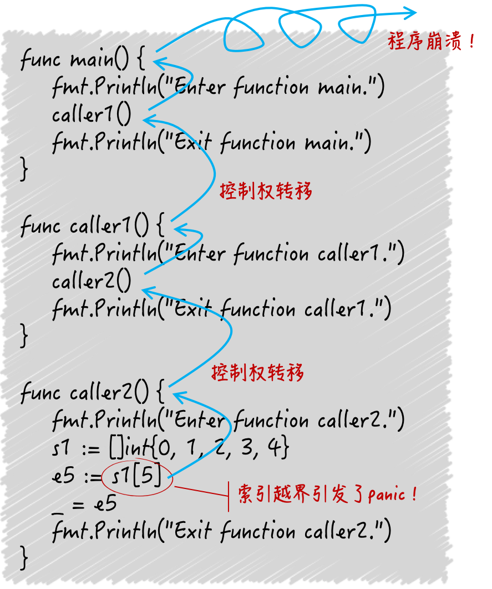

# Go语言重新梳理

## 1、数组与切片

数组是定长的，而且长度是类型的一部分。切片的底层是一个数组，相当于一个窗口，透过这个窗口能看到底层数组里的元素。有两个重要方法，len和capacity。通过索引去查看数组元素时，区间是左闭右开，如果缺省，则到最后一个元素。值得注意的地方是，**如果通过make初始化了切片，并且指定了长度，后续append不管有没有超过初始化的长度，都会扩容。**如下：

~~~go
	s1 := make([]int,5)
	fmt.Printf("addr:%p \t\tlen:%v content:%v\n",s1,len(s1),s1)

	s1 = append(s1, 1)
	fmt.Printf("addr:%p \t\tlen:%v content:%v\n",s1,len(s1),s1)
	//addr:0xc00007e060               len:5 content:[0 0 0 0 0]
	//addr:0xc000092000               len:6 content:[0 0 0 0 0 1]
~~~

如果基于某个数组，生成新的切片的时候，需要注意：

~~~go
s3 := []int{1, 2, 3, 4, 5, 6, 7, 8}
s4 := s3[3:6]
fmt.Printf("The length of s4: %d\n", len(s4))
fmt.Printf("The capacity of s4: %d\n", cap(s4))
fmt.Printf("The value of s4: %d\n", s4)
/*
The length of s4: 3
The capacity of s4: 5
The value of s4: [4 5 6]
*/
~~~

切片的容量代表了它的底层数组的长度，但这仅限于使用make函数或者切片值字面量初始化切片的情况。更通用的规则是：一个切片的容量可以被看作是透过这个窗口最多可以看到的底层数组中元素的个数。由于s4是通过在s3上施加切片操作得来的，所以s3的底层数组就是s4的底层数组。又因为，在底层数组不变的情况下，切片代表的窗口可以向右扩展，直至其底层数组的末尾。所以，s4的容量就是其底层数组的长度8, 减去上述切片表达式中的那个起始索引3，即5。注意，切片代表的窗口是无法向左扩展的。也就是说，我们永远无法透过s4看到s3中最左边的那 3 个元素。

## 2、container包中的那些容器

当说到数组时，常常会提到链表。Go 语言的链表实现在标准库的container/list代码包中。这个代码包中有两个公开的程序实体——List和Element，List 实现了一个双向链表（以下简称链表），而 Element 则代表了链表中元素的结构。

有人问，可以把自己生成的Element类型值传给链表吗？

我们在这里用到了List的四种方法。MoveBefore方法和MoveAfter方法，它们分别用于把给定的元素移动到另一个元素的前面和后面。MoveToFront方法和MoveToBack方法，分别用于把给定的元素移动到链表的最前端和最后端。在这些方法中，“给定的元素”都是*Element类型的，*Element类型是Element类型的指针类型，*Element的值就是元素的指针。

~~~go
func (l *List) MoveBefore(e, mark *Element)
func (l *List) MoveAfter(e, mark *Element)

func (l *List) MoveToFront(e *Element)
func (l *List) MoveToBack(e *Element)

~~~

这里，给出一个典型回答：不会接受，这些方法将不会对链表做出任何改动。因为我们自己生成的Element值并不在链表中，所以也就谈不上“在链表中移动元素”。更何况链表不允许我们把自己生成的Element值插入其中。

在List包含的方法中，用于插入新元素的那些方法都只接受interface{}类型的值。这些方法在内部会使用Element值，包装接收到的新元素。这样做正是为了避免直接使用我们自己生成的元素，主要原因是避免链表的内部关联，遭到外界破坏，这对于链表本身以及我们这些使用者来说都是有益的。List的方法还有下面这几种：Front和Back方法分别用于获取链表中最前端和最后端的元素，InsertBefore和InsertAfter方法分别用于在指定的元素之前和之后插入新元素，PushFront和PushBack方法则分别用于在链表的最前端和最后端插入新元素。

~~~go
func (l *List) Front() *Element
func (l *List) Back() *Element

func (l *List) InsertBefore(v interface{}, mark *Element) *Element
func (l *List) InsertAfter(v interface{}, mark *Element) *Element

func (l *List) PushFront(v interface{}) *Element
func (l *List) PushBack(v interface{}) *Element
~~~

这些方法都会把一个Element值的指针作为结果返回，它们就是链表留给我们的安全“接口”。拿到这些内部元素的指针，我们就可以去调用前面提到的用于移动元素的方法了。

### 为什么链表可以做到开箱即用？

List和Element都是结构体类型。结构体类型有一个特点，那就是它们的零值都会是拥有特定结构，但是没有任何定制化内容的值，相当于一个空壳。值中的字段也都会被分别赋予各自类型的零值。广义来讲，所谓的零值就是只做了声明，但还未做初始化的变量被给予的缺省值。每个类型的零值都会依据该类型的特性而被设定。比如，经过语句var a [2]int声明的变量a的值，将会是一个包含了两个0的整数数组。又比如，经过语句var s []int声明的变量s的值将会是一个[]int类型的、值为nil的切片。

那么经过语句var l list.List声明的变量l的值将会是什么呢？[1] 这个零值将会是一个长度为0的链表。这个链表持有的根元素也将会是一个空壳，其中只会包含缺省的内容。那这样的链表我们可以直接拿来使用吗？答案是，可以的。这被称为“开箱即用”。Go 语言标准库中很多结构体类型的程序实体都做到了开箱即用。这也是在编写可供别人使用的代码包（或者说程序库）时，我们推荐遵循的最佳实践之一。那么，语句var l list.List声明的链表l可以直接使用，这是怎么做到的呢？关键在于它的“延迟初始化”机制。

所谓的延迟初始化，你可以理解为把初始化操作延后，仅在实际需要的时候才进行。延迟初始化的优点在于“延后”，它可以分散初始化操作带来的计算量和存储空间消耗。例如，如果我们需要集中声明非常多的大容量切片的话，那么那时的 CPU 和内存空间的使用量肯定都会一个激增，并且只有设法让其中的切片及其底层数组被回收，内存使用量才会有所降低。如果数组是可以被延迟初始化的，那么计算量和存储空间的压力就可以被分散到实际使用它们的时候。这些数组被实际使用的时间越分散，延迟初始化带来的优势就会越明显。

在这里的链表实现中，一些方法是无需对是否初始化做判断的。比如Front方法和Back方法，一旦发现链表的长度为0, 直接返回nil就好了。又比如，在用于删除元素、移动元素，以及一些用于插入元素的方法中，只要判断一下传入的元素中指向所属链表的指针，是否与当前链表的指针相等就可以了。如果不相等，就一定说明传入的元素不是这个链表中的，后续的操作就不用做了。反之，就一定说明这个链表已经被初始化了。

链表的PushFront方法、PushBack方法、PushBackList方法以及PushFrontList方法总会先判断链表的状态，并在必要时进行初始化，这就是延迟初始化。而且，我们在向一个空的链表中添加新元素的时候，肯定会调用这四个方法中的一个，这时新元素中指向所属链表的指针，一定会被设定为当前链表的指针。所以，指针相等是链表已经初始化的充分必要条件。明白了吗？List利用了自身以及Element在结构上的特点，巧妙地平衡了延迟初始化的优缺点，使得链表可以开箱即用，并且在性能上可以达到最优。

### 同在container容器下，Ring与List的区别在哪儿？

container/ring包中的Ring类型实现的是一个循环链表，也就是我们俗称的环。其实List在内部就是一个循环链表。它的根元素永远不会持有任何实际的元素值，而该元素的存在就是为了连接这个循环链表的首尾两端。所以也可以说，List的零值是一个只包含了根元素，但不包含任何实际元素值的空链表。那么，既然Ring和List在本质上都是循环链表，那它们到底有什么不同呢？

1. Ring类型的数据结构仅由它自身即可代表，而List类型则需要由它以及Element类型联合表示。这是表示方式上的不同，也是结构复杂度上的不同。
2. 一个Ring类型的值严格来讲，只代表了其所属的循环链表中的一个元素，而一个List类型的值则代表了一个完整的链表。这是表示维度上的不同。
3. 在创建并初始化一个Ring值的时候，我们可以指定它包含的元素的数量，但是对于一个List值来说却不能这样做（也没有必要这样做）。循环链表一旦被创建，其长度是不可变的。这是两个代码包中的New函数在功能上的不同，也是两个类型在初始化值方面的第一个不同。
4. 仅通过var r ring.Ring语句声明的r将会是一个长度为1的循环链表，而List类型的零值则是一个长度为0的链表。别忘了List中的根元素不会持有实际元素值，因此计算长度时不会包含它。这是两个类型在初始化值方面的第二个不同。
5. Ring值的Len方法的算法复杂度是 O(N) 的，而List值的Len方法的算法复杂度则是 O(1) 的。这是两者在性能方面最显而易见的差别。

## 3、字典的操作

### 知识前导：为什么字典的键类型会受到约束？

Go 语言的字典类型其实是一个哈希表（hash table）的特定实现，在这个实现中，键和元素的最大不同在于，键的类型是受限的，而元素却可以是任意类型的。如果要探究限制的原因，我们就先要了解哈希表中最重要的一个过程：映射。你可以把键理解为元素的一个索引，我们可以在哈希表中通过键查找与它成对的那个元素。键和元素的这种对应关系，在数学里就被称为“映射”，这也是“map”这个词的本意，哈希表的映射过程就存在于对键 - 元素对的增、删、改、查的操作之中。

比如，我们要在哈希表中查找与某个键值对应的那个元素值，那么我们需要先把键值作为参数传给这个哈希表。哈希表会先用哈希函数（hash function）把键值转换为哈希值。哈希值通常是一个无符号的整数。一个哈希表会持有一定数量的桶（bucket），我们也可以叫它哈希桶，这些哈希桶会均匀地储存其所属哈希表收纳的键 - 元素对。

因此，哈希表会先用这个键哈希值的低几位去定位到一个哈希桶，然后再去这个哈希桶中，查找这个键。由于键 - 元素对总是被捆绑在一起存储的，所以一旦找到了键，就一定能找到对应的元素值。随后，哈希表就会把相应的元素值作为结果返回。

现在我们知道了，映射过程的第一步就是：把键值转换为哈希值。在 Go 语言的字典中，每一个键值都是由它的哈希值代表的。也就是说，字典不会独立存储任何键的值，但会独立存储它们的哈希值。

**Go 语言字典的键类型不可以是函数类型、字典类型和切片类型。**

Go 语言规范规定，在键类型的值之间必须可以施加操作符==和!=。换句话说，键类型的值必须要支持判等操作。由于函数类型、字典类型和切片类型的值并不支持判等操作，所以字典的键类型不能是这些类型。

你可能会有疑问，为什么键类型的值必须支持判等操作？我在前面说过，Go 语言一旦定位到了某一个哈希桶，那么就会试图在这个桶中查找键值。具体是怎么找的呢？首先，每个哈希桶都会把自己包含的所有键的哈希值存起来。Go 语言会用被查找键的哈希值与这些哈希值逐个对比，看看是否有相等的。如果一个相等的都没有，那么就说明这个桶中没有要查找的键值，这时 Go 语言就会立刻返回结果了。如果有相等的，那就再用键值本身去对比一次。为什么还要对比？原因是，不同值的哈希值是可能相同的。这有个术语，叫做“哈希碰撞”。所以，即使哈希值一样，键值也不一定一样。如果键类型的值之间无法判断相等，那么此时这个映射的过程就没办法继续下去了。最后，只有键的哈希值和键值都相等，才能说明查找到了匹配的键 - 元素对。

### 在值为nil的字典上执行读操作会成功吗？

除了添加键 - 元素对，我们在一个值为nil的字典上做任何操作都不会引起错误。当我们试图在一个值为nil的字典中添加键 - 元素对的时候，Go 语言的运行时系统就会立即抛出一个 panic。

## 4、通道

作为 Go 语言最有特色的数据类型，通道（channel）完全可以与 goroutine（也可称为 go 程）并驾齐驱，共同代表 Go 语言独有的并发编程模式和编程哲学。Don’t communicate by sharing memory; share memory by communicating. （不要通过共享内存来通信，而应该通过通信来共享内存。）

通道类型的值本身就是并发安全的，这也是 Go 语言自带的、唯一一个可以满足并发安全性的类型。在声明并初始化一个通道的时候，我们需要用到 Go 语言的内建函数make。就像用make初始化切片那样，我们传给这个函数的第一个参数应该是代表了通道的具体类型的类型字面量。在声明一个通道类型变量的时候，我们首先要确定该通道类型的元素类型，这决定了我们可以通过这个通道传递什么类型的数据。

在初始化通道的时候，make函数除了必须接收这样的类型字面量作为参数，还可以接收一个int类型的参数。后者是可选的，用于表示该通道的容量。所谓通道的容量，就是指通道最多可以缓存多少个元素值。由此，虽然这个参数是int类型的，但是它是不能小于0的。当容量为0时，我们可以称通道为非缓冲通道，也就是不带缓冲的通道。而当容量大于0时，我们可以称为缓冲通道，也就是带有缓冲的通道。

一个通道相当于一个先进先出（FIFO）的队列。也就是说，通道中的各个元素值都是严格地按照发送的顺序排列的，先被发送通道的元素值一定会先被接收。元素值的发送和接收都需要用到操作符<-。我们也可以叫它接送操作符。一个左尖括号紧接着一个减号形象地代表了元素值的传输方向。

### 对通道的发送和接收操作都有哪些基本的特性？

1. 对于同一个通道，发送操作之间是互斥的，接收操作之间也是互斥的。
2. 发送操作和接收操作中对元素值的处理都是不可分割的。
3. 发送操作在完全完成之前会被阻塞。接收操作也是如此。

在同一时刻，Go 语言的运行时系统（以下简称运行时系统）只会执行对同一个通道的任意个发送操作中的某一个。直到这个元素值被完全复制进该通道之后，其他针对该通道的发送操作才可能被执行。类似的，在同一时刻，运行时系统也只会执行，对同一个通道的任意个接收操作中的某一个。直到这个元素值完全被移出该通道之后，其他针对该通道的接收操作才可能被执行。即使这些操作是并发执行的也是如此。

这里所谓的并发执行，你可以这样认为，多个代码块分别在不同的 goroutine 之中，并有机会在同一个时间段内被执行。另外，对于通道中的同一个元素值来说，发送操作和接收操作之间也是互斥的。例如，虽然会出现，正在被复制进通道但还未复制完成的元素值，但是这时它绝不会被想接收它的一方看到和取走。

**这里要注意的一个细节是，元素值从外界进入通道时会被复制。更具体地说，进入通道的并不是在接收操作符右边的那个元素值，而是它的副本。**

另一方面，元素值从通道进入外界时会被移动。这个移动操作实际上包含了两步，第一步是生成正在通道中的这个元素值的副本，并准备给到接收方，第二步是删除在通道中的这个元素值。

顺着这个细节再来看第二个基本特性。 这里的“不可分割”的意思是，它们处理元素值时都是一气呵成的，绝不会被打断。例如，发送操作要么还没复制元素值，要么已经复制完毕，绝不会出现只复制了一部分的情况。又例如，接收操作在准备好元素值的副本之后，一定会删除掉通道中的原值，绝不会出现通道中仍有残留的情况。这既是为了保证通道中元素值的完整性，也是为了保证通道操作的唯一性。对于通道中的同一个元素值来说，它只可能是某一个发送操作放入的，同时也只可能被某一个接收操作取出。

再来说第三个基本特性。 一般情况下，发送操作包括了“复制元素值”和“放置副本到通道内部”这两个步骤。在这两个步骤完全完成之前，发起这个发送操作的那句代码会一直阻塞在那里。也就是说，在它之后的代码不会有执行的机会，直到这句代码的阻塞解除。更细致地说，在通道完成发送操作之后，运行时系统会通知这句代码所在的 goroutine，以使它去争取继续运行代码的机会。另外，接收操作通常包含了“复制通道内的元素值”“放置副本到接收方”“删掉原值”三个步骤。在所有这些步骤完全完成之前，发起该操作的代码也会一直阻塞，直到该代码所在的 goroutine 收到了运行时系统的通知并重新获得运行机会为止。

**如此阻塞代码其实就是为了实现操作的互斥和元素值的完整。**

### 发送操作和接收操作在什么时候可能被长时间的阻塞？

对于缓冲通道，如果通道已满，对所有发送操作，都会堵塞；如果通道为空，对所有接收操作都会堵塞。对于非缓冲通道，情况要简单一些。无论是发送操作还是接收操作，一开始执行就会被阻塞，直到配对的操作也开始执行，才会继续传递。由此可见，非缓冲通道是在用同步的方式传递数据。也就是说，只有收发双方对接上了，数据才会被传递。

对于值为nil的通道，不论它的具体类型是什么，对它的发送操作和接收操作都会永久地处于阻塞状态。它们所属的 goroutine 中的任何代码，都不再会被执行。注意，由于通道类型是引用类型，所以它的零值就是nil。换句话说，当我们只声明该类型的变量但没有用make函数对它进行初始化时，该变量的值就会是nil。**我们一定不要忘记初始化通道！**

### 发送操作和接收操作在什么时候会引发 panic？

对于一个已初始化，但并未关闭的通道来说，收发操作一定不会引发 panic。但是通道一旦关闭，再对它进行发送操作，就会引发 panic。另外，如果我们试图关闭一个已经关闭了的通道，也会引发 panic。注意，接收操作是可以感知到通道的关闭的，并能够安全退出。

更具体地说，当我们把接收表达式的结果同时赋给两个变量时，第二个变量的类型就是一定bool类型。它的值如果为false就说明通道已经关闭，并且再没有元素值可取了。注意，如果通道关闭时，里面还有元素值未被取出，那么接收表达式的第一个结果，仍会是通道中的某一个元素值，而第二个结果值一定会是true。因此，通过接收表达式的第二个结果值，来判断通道是否关闭是可能有延时的。由于通道的收发操作有上述特性，所以除非有特殊的保障措施，我们千万不要让接收方关闭通道，而应当让发送方做这件事。

### 单向通道的价值？

~~~go
var uselessChan = make(chan<- int, 1)
~~~

我声明并初始化了一个名叫uselessChan的变量。这个变量的类型是chan<- int，容量是1。请注意紧挨在关键字chan右边的那个<-，这表示了这个通道是单向的，并且只能发而不能收。类似的，如果这个操作符紧挨在chan的左边，那么就说明该通道只能收不能发。所以，前者可以被简称为发送通道，后者可以被简称为接收通道。

概括地说，单向通道最主要的用途就是约束其他代码的行为。如：

~~~go
type Notifier interface {
  SendInt(ch chan<- int)
}
~~~

如果我们在某个方法的定义中使用了单向通道类型，那么就相当于在对它的所有实现做出约束。在这里，Notifier接口中的SendInt方法只会接受一个发送通道作为参数，所以，在该接口的所有实现类型中的SendInt方法都会受到限制。顺便说一下，我们在调用SendInt函数的时候，只需要把一个元素类型匹配的双向通道传给它就行了，没必要用发送通道，因为 Go 语言在这种情况下会自动地把双向通道转换为函数所需的单向通道。

~~~go
intChan1 := make(chan int, 3)
SendInt(intChan1)
~~~

另一个方面，我们还可以在函数声明的结果列表中使用单向通道。如下所示：

~~~go
func getIntChan() <-chan int {
  num := 5
  ch := make(chan int, num)
  for i := 0; i < num; i++ {
    ch <- i
  }
  close(ch)
  return ch
}
~~~

函数getIntChan会返回一个<-chan int类型的通道，这就意味着得到该通道的程序，只能从通道中接收元素值。这实际上就是对函数调用方的一种约束了。

我们再顺便看一下调用getIntChan的代码：

~~~go
intChan2 := getIntChan()
for elem := range intChan2 {
  fmt.Printf("The element in intChan2: %v\n", elem)
}
~~~

这里的for语句也可以被称为带有range子句的for语句。它的用法我在后面讲for语句的时候专门说明。现在你只需要知道关于它的三件事：

1. 上述for语句会不断地尝试从通道intChan2中取出元素值。即使intChan2已经被关闭了，它也会在取出所有剩余的元素值之后再结束执行。
2. 通常，当通道intChan2中没有元素值时，这条for语句会被阻塞在有for关键字的那一行，直到有新的元素值可取。不过，由于这里的getIntChan函数会事先将intChan2关闭，所以它在取出intChan2中的所有元素值之后会直接结束执行。
3. 倘若通道intChan2的值为nil，那么这条for语句就会被永远地阻塞在有for关键字的那一行。

## 5、Select语句

select语句只能与通道联用，它一般由若干个分支组成。每次执行这种语句的时候，一般只有一个分支中的代码会被运行。

select语句的分支分为两种，一种叫做候选分支，另一种叫做默认分支。候选分支总是以关键字case开头，后跟一个case表达式和一个冒号，然后我们可以从下一行开始写入当分支被选中时需要执行的语句。默认分支其实就是 default case，因为，当且仅当没有候选分支被选中时它才会被执行，所以它以关键字default开头并直接后跟一个冒号。同样的，我们可以在default:的下一行写入要执行的语句。由于select语句是专为通道而设计的，所以每个case表达式中都只能包含操作通道的表达式，比如接收表达式。

在使用select语句的时候，我们首先需要注意下面几个事情。

1. 如果加入了默认分支，那么无论涉及通道操作的表达式是否有阻塞，select语句都不会被阻塞。如果那几个表达式都阻塞了，或者说都没有满足求值的条件，那么默认分支就会被选中并执行。
2. 如果没有加入默认分支，那么一旦所有的case表达式都没有满足求值条件，那么select语句就会被阻塞。直到至少有一个case表达式满足条件为止。
3. 还记得吗？我们可能会因为通道关闭了，而直接从通道接收到一个其元素类型的零值。所以，在很多时候，我们需要通过接收表达式的第二个结果值来判断通道是否已经关闭。一旦发现某个通道关闭了，我们就应该及时地屏蔽掉对应的分支或者采取其他措施。这对于程序逻辑和程序性能都是有好处的。
4. select语句只能对其中的每一个case表达式各求值一次。所以，如果我们想连续或定时地操作其中的通道的话，就往往需要通过在for语句中嵌入select语句的方式实现。但这时要注意，简单地在select语句的分支中使用break语句，只能结束当前的select语句的执行，而并不会对外层的for语句产生作用。这种错误的用法可能会让这个for语句无休止地运行下去。

select语句的分支选择规则都有哪些？

1. 对于每一个case表达式，都至少会包含一个代表发送操作的发送表达式或者一个代表接收操作的接收表达式，同时也可能会包含其他的表达式。比如，如果case表达式是包含了接收表达式的短变量声明时，那么在赋值符号左边的就可以是一个或两个表达式，不过此处的表达式的结果必须是可以被赋值的。当这样的case表达式被求值时，它包含的多个表达式总会以从左到右的顺序被求值。
2. select语句包含的候选分支中的case表达式都会在该语句执行开始时先被求值，并且求值的顺序是依从代码编写的顺序从上到下的。结合上一条规则，在select语句开始执行时，排在最上边的候选分支中最左边的表达式会最先被求值，然后是它右边的表达式。仅当最上边的候选分支中的所有表达式都被求值完毕后，从上边数第二个候选分支中的表达式才会被求值，顺序同样是从左到右，然后是第三个候选分支、第四个候选分支，以此类推。
3. 对于每一个case表达式，如果其中的发送表达式或者接收表达式在被求值时，相应的操作正处于阻塞状态，那么对该case表达式的求值就是不成功的。在这种情况下，我们可以说，这个case表达式所在的候选分支是不满足选择条件的。
4. 仅当select语句中的所有case表达式都被求值完毕后，它才会开始选择候选分支。这时候，它只会挑选满足选择条件的候选分支执行。如果所有的候选分支都不满足选择条件，那么默认分支就会被执行。如果这时没有默认分支，那么select语句就会立即进入阻塞状态，直到至少有一个候选分支满足选择条件为止。一旦有一个候选分支满足选择条件，select语句（或者说它所在的 goroutine）就会被唤醒，这个候选分支就会被执行。
5. 如果select语句发现同时有多个候选分支满足选择条件，那么它就会用一种伪随机的算法在这些分支中选择一个并执行。注意，即使select语句是在被唤醒时发现的这种情况，也会这样做。
6. 一条select语句中只能够有一个默认分支。并且，默认分支只在无候选分支可选时才会被执行，这与它的编写位置无关。
7. select语句的每次执行，包括case表达式求值和分支选择，都是独立的。不过，至于它的执行是否是并发安全的，就要看其中的case表达式以及分支中，是否包含并发不安全的代码了。

## 6、使用函数的正确姿势

只要两个函数的参数列表和结果列表中的元素顺序及其类型是一致的，我们就可以说它们是一样的函数，或者说是实现了同一个函数类型的函数。严格来说，函数的名称也不能算作函数签名的一部分，它只是我们在调用函数时，需要给定的标识符而已。

高阶函数：

1、接受其他的函数作为参数传入 2、把其他的函数作为结果返回。

~~~go
type operate func(x, y int) int

func calculate(x int, y int, op operate) (int, error) {
  if op == nil {
    return 0, errors.New("invalid operation")
  }
  return op(x, y), nil
}
~~~

注意一个Demo：

~~~go
complexArray1 := [3][]string{
[]string{"d", "e", "f"},
[]string{"g", "h", "i"},
[]string{"j", "k", "l"},
}

func modifyArray(a [3][]string) [3][]string {
a[1] = []string{"d", "e", "p"}
return a
}

func modifyArray1(a [3][]string) [3][]string {
a[1][1] = "v"
return a
}
array2 := modifyArray(complexArray1)
array3 := modifyArray1(complexArray1)
~~~

array2不会影响原来的数组，array3会影响原来的数组。

## 7、Panic

**一些runtime抛出来的panic是不可恢复的**

### 从 panic 被引发到程序终止运行的大致过程是什么？

某个函数中的某行代码有意或无意地引发了一个 panic。这时，初始的 panic 详情会被建立起来，并且该程序的控制权会立即从此行代码转移至调用其所属函数的那行代码上，也就是调用栈中的上一级。这也意味着，此行代码所属函数的执行随即终止。紧接着，控制权并不会在此有片刻的停留，它又会立即转移至再上一级的调用代码处。控制权如此一级一级地沿着调用栈的反方向传播至顶端，也就是我们编写的最外层函数那里。这里的最外层函数指的是go函数，对于主 goroutine 来说就是main函数。但是控制权也不会停留在那里，而是被 Go 语言运行时系统收回。随后，程序崩溃并终止运行，承载程序这次运行的进程也会随之死亡并消失。与此同时，在这个控制权传播的过程中，panic 详情会被逐渐地积累和完善，并会在程序终止之前被打印出来。

panic 详情会在控制权传播的过程中，被逐渐地积累和完善，并且，控制权会一级一级地沿着调用栈的反方向传播至顶端。因此，在针对某个 goroutine 的代码执行信息中，调用栈底端的信息会先出现，然后是上一级调用的信息，以此类推，最后才是此调用栈顶端的信息。

比如，main函数调用了caller1函数，而caller1函数又调用了caller2函数，那么caller2函数中代码的执行信息会先出现，然后是caller1函数中代码的执行信息，最后才是main函数的信息。

~~~go
goroutine 1 [running]:
main.caller2()
 /Users/haolin/GeekTime/Golang_Puzzlers/src/puzzlers/article19/q1/demo48.go:22 +0x91
main.caller1()
 /Users/haolin/GeekTime/Golang_Puzzlers/src/puzzlers/article19/q1/demo48.go:15 +0x66
main.main()
 /Users/haolin/GeekTime/Golang_Puzzlers/src/puzzlers/article19/q1/demo48.go:9 +0x66
exit status 2
~~~

recover对于panic的处理，只要是在调用栈路径上都可以，如果有多协程，需要在当前协程里处理。如果一个函数中有多条defer语句，那么那几个defer函数调用的执行顺序是与它们分别所属的defer语句的出现顺序（更严谨地说，是执行顺序）完全相反。

当一个函数即将结束执行时，其中的写在最下边的defer函数调用会最先执行，其次是写在它上边、与它的距离最近的那个defer函数调用，以此类推，最上边的defer函数调用会最后一个执行。

如果函数中有一条for语句，并且这条for语句中包含了一条defer语句，那么，显然这条defer语句的执行次数，就取决于for语句的迭代次数。并且，同一条defer语句每被执行一次，其中的defer函数调用就会产生一次，而且，这些函数调用同样不会被立即执行。那么问题来了，这条for语句中产生的多个defer函数调用，会以怎样的顺序执行呢？为了彻底搞清楚，我们需要弄明白defer语句执行时发生的事情。

其实也并不复杂，在defer语句每次执行的时候，Go 语言会把它携带的defer函数及其参数值另行存储到一个队列中。这个队列与该defer语句所属的函数是对应的，并且，它是先进后出（FILO）的，相当于一个栈。在需要执行某个函数中的defer函数调用的时候，Go 语言会先拿到对应的队列，然后从该队列中一个一个地取出defer函数及其参数值，并逐个执行调用。这正是我说“defer函数调用与其所属的defer语句的执行顺序完全相反”的原因了。

## 8、sync.Mutex与sync.RWMutex

一旦数据被多个线程共享，那么就很可能会产生争用和冲突的情况。这种情况也被称为竞态条件（race condition），这往往会破坏共享数据的一致性。

共享数据的一致性代表着某种约定，即：多个线程对共享数据的操作总是可以达到它们各自预期的效果。如果这个一致性得不到保证，那么将会影响到一些线程中代码和流程的正确执行，甚至会造成某种不可预知的错误。这种错误一般都很难发现和定位，排查起来的成本也是非常高的，所以一定要尽量避免。

概括来讲，同步的用途有两个，一个是避免多个线程在同一时刻操作同一个数据块，另一个是协调多个线程，以避免它们在同一时刻执行同一个代码块。由于这样的数据块和代码块的背后都隐含着一种或多种资源（比如存储资源、计算资源、I/O 资源、网络资源等等），所以我们可以把它们看做是共享资源，或者说共享资源的代表。我们所说的同步其实就是在控制多个线程对共享资源的访问。

相关临界区可以是一个内含了共享数据的结构体及其方法，也可以是操作同一块共享数据的多个函数。临界区总是需要受到保护的，否则就会产生竞态条件。施加保护的重要手段之一，就是使用实现了某种同步机制的工具，也称为同步工具。

在 Go 语言中，可供我们选择的同步工具并不少。其中，最重要且最常用的同步工具当属互斥量（mutual exclusion，简称 mutex）。sync包中的Mutex就是与其对应的类型，该类型的值可以被称为互斥量或者互斥锁。

一个互斥锁可以被用来保护一个临界区或者一组相关临界区。我们可以通过它来保证，在同一时刻只有一个 goroutine 处于该临界区之内。为了兑现这个保证，每当有 goroutine 想进入临界区时，都需要先对它进行锁定，并且，每个 goroutine 离开临界区时，都要及时地对它进行解锁。锁定操作可以通过调用互斥锁的Lock方法实现，而解锁操作可以调用互斥锁的Unlock方法。如图：

~~~go
mu.Lock()
_, err := writer.Write([]byte(data))
if err != nil {
 log.Printf("error: %s [%d]", err, id)
}
mu.Unlock()
~~~

### 使用互斥锁需要注意哪些事项？

1. 不要重复锁定互斥锁
2. 不要忘记解锁互斥锁，必要时使用defer语句
3. 不要对尚未锁定或者已解锁的互斥锁解锁
4. 不要在多个函数之间直接传递互斥锁

你还是要把互斥锁看作是针对某一个临界区或某一组相关临界区的唯一访问令牌。对一个已经被锁定的互斥锁进行锁定，是会立即阻塞当前的 goroutine 的。这个 goroutine 所执行的流程，会一直停滞在调用该互斥锁的Lock方法的那行代码上。直到该互斥锁的Unlock方法被调用，并且这里的锁定操作成功完成，后续的代码（也就是临界区中的代码）才会开始执行。这也正是互斥锁能够保护临界区的原因所在。

所谓的死锁，指的就是当前程序中的主 goroutine，以及我们启用的那些 goroutine 都已经被阻塞。这些 goroutine 可以被统称为用户级的 goroutine。这就相当于整个程序都已经停滞不前了。Go 语言运行时系统是不允许这种情况出现的，只要它发现所有的用户级 goroutine 都处于等待状态，就会自行抛出一个带有如下信息的 panic：`fatal error: all goroutines are asleep - deadlock!`

注意，这种由 Go 语言运行时系统自行抛出的 panic 都属于致命错误，都是无法被恢复的，调用recover函数对它们起不到任何作用。也就是说，一旦产生死锁，程序必然崩溃。

忘记解锁导致的问题有时候是比较隐秘的，并不会那么快就暴露出来。这也是我们需要特别关注它的原因。相比之下，解锁未锁定的互斥锁会立即引发 panic。并且，与死锁导致的 panic 一样，它们是无法被恢复的。因此，我们总是应该保证，对于每一个锁定操作，都要有且只有一个对应的解锁操作。

### 读写锁和互斥锁的异同

读写锁是读 / 写互斥锁的简称。在 Go 语言中，读写锁由sync.RWMutex类型的值代表。与sync.Mutex类型一样，这个类型也是开箱即用的。读写锁是把对共享资源的“读操作”和“写操作”区别对待了。它可以对这两种操作施加不同程度的保护。换句话说，相比于互斥锁，读写锁可以实现更加细腻的访问控制。

读写锁可以提供读读并行，适用读多写少的场景。

互斥锁常常被用来：保证多个 goroutine 并发地访问同一个共享资源时的完全串行，这是通过保护针对此共享资源的一个临界区，或一组相关临界区实现的。因此，我们可以把它看做是 goroutine 进入相关临界区时，必须拿到的访问令牌。

## 9、条件变量

我们常常会把条件变量这个同步工具拿来与互斥锁一起讨论。实际上，条件变量是基于互斥锁的，它必须有互斥锁的支撑才能发挥作用。条件变量并不是被用来保护临界区和共享资源的，它是用于协调想要访问共享资源的那些线程的。当共享资源的状态发生变化时，它可以被用来通知被互斥锁阻塞的线程。当共享资源的状态不满足条件的时候，想操作它的线程再也不用循环往复地做检查了，只要等待通知就好了。

形象一点：特工A 与特工B约定某个地方接头交换情报，约定如果送的情报没有拿走，不能再送；如果没有情报也要隔一段时间再去看，一旦有了立即拿走。这样需要一直去查，浪费了资源。于是都雇了一个人一直去监测，有情报了就去通知。雇的那个人就相当于条件变量。

### 条件变量怎样与互斥锁配合使用？

条件变量的初始化离不开互斥锁，并且它的方法有的也是基于互斥锁的。条件变量提供的方法有三个：等待通知（wait）、单发通知（signal）和广播通知（broadcast）。我们在利用条件变量等待通知的时候，需要在它基于的那个互斥锁保护下进行。而在进行单发通知或广播通知的时候，却是恰恰相反的，也就是说，需要在对应的互斥锁解锁之后再做这两种操作。Demo：

~~~go
func main() {
	var box int
	var l sync.RWMutex
	sCond := sync.NewCond(&l)
	rCond := sync.NewCond(l.RLocker())
	c := make(chan struct{},2)
	m := 5
	go func(int) {
		defer func() {
			c<- struct{}{}
		}()
		for i:=0;i<m;i++{
			time.Sleep(time.Millisecond*3)
			l.Lock()
			for box == 1 {
				sCond.Wait()
			}
			box = 1
			l.Unlock()
			fmt.Println("signal sent",i)
			rCond.Signal()
		}
	}(m)
	go func(int) {
		defer func() {
			c<- struct{}{}
		}()
		for i:=0;i<m;i++{
			time.Sleep(3*time.Millisecond)
			l.RLock()
			for box == 0 {
				rCond.Wait()
			}
			box = 0
			l.RUnlock()
			fmt.Println("signal received",i)
			sCond.Signal()
		}
	}(m)

	<-c
	<-c

}
~~~

### 条件变量的Wait方法做了什么？为什么先要锁定条件变量基于的互斥锁，才能调用它的Wait方法？为什么要用for语句来包裹调用其Wait方法的表达式，用if语句不行吗？

条件变量的Wait方法主要做了四件事。

1. 把调用它的 goroutine（也就是当前的 goroutine）加入到当前条件变量的通知队列中。
2. 解锁当前的条件变量基于的那个互斥锁。
3. 让当前的 goroutine 处于等待状态，等到通知到来时再决定是否唤醒它。此时，这个 goroutine 就会阻塞在调用这个Wait方法的那行代码上。
4. 
5. 如果通知到来并且决定唤醒这个 goroutine，那么就在唤醒它之后重新锁定当前条件变量基于的互斥锁。自此之后，当前的 goroutine 就会继续执行后面的代码了。

为什么要锁定条件变量基于的互斥锁才能调用wait方法？答案是：因为条件变量的Wait方法在阻塞当前的 goroutine 之前，会解锁它基于的互斥锁，所以在调用该Wait方法之前，我们必须先锁定那个互斥锁，否则在调用这个Wait方法时，就会引发一个不可恢复的 panic。

第二个问题：

if语句只会对共享资源的状态检查一次，而for语句却可以做多次检查，直到这个状态改变为止。那为什么要做多次检查呢？这主要是为了保险起见。如果一个 goroutine 因收到通知而被唤醒，但却发现共享资源的状态，依然不符合它的要求，那么就应该再次调用条件变量的Wait方法，并继续等待下次通知的到来。

### 条件变量的Signal方法和Broadcast方法有哪些异同？

条件变量的Signal方法和Broadcast方法都是被用来发送通知的，不同的是，前者的通知只会唤醒一个因此而等待的 goroutine，而后者的通知却会唤醒所有为此等待的 goroutine。条件变量的Wait方法总会把当前的 goroutine 添加到通知队列的队尾，而它的Signal方法总会从通知队列的队首开始，查找可被唤醒的 goroutine。所以，因Signal方法的通知，而被唤醒的 goroutine 一般都是最早等待的那一个。

这两个方法的行为决定了它们的适用场景。如果你确定只有一个 goroutine 在等待通知，或者只需唤醒任意一个 goroutine 就可以满足要求，那么使用条件变量的Signal方法就好了。否则，使用Broadcast方法总没错，只要你设置好各个 goroutine 所期望的共享资源状态就可以了。

## 10、原子操作

互斥锁是一个很有用的同步工具，它可以保证每一时刻进入临界区的 goroutine 只有一个。读写锁对共享资源的写操作和读操作则区别看待，并消除了读操作之间的互斥。

条件变量主要是用于协调想要访问共享资源的那些线程。当共享资源的状态发生变化时，它可以被用来通知被互斥锁阻塞的线程，它既可以基于互斥锁，也可以基于读写锁。当然了，读写锁也是一种互斥锁，前者是对后者的扩展。

通过对互斥锁的合理使用，我们可以使一个 goroutine 在执行临界区中的代码时，不被其他的 goroutine 打扰。不过，虽然不会被打扰，但是它仍然可能会被中断（interruption）。

对于一个 Go 程序来说，Go 语言运行时系统中的调度器会恰当地安排其中所有的 goroutine 的运行。不过，在同一时刻，只可能有少数的 goroutine 真正地处于运行状态，并且这个数量只会与 M 的数量一致，而不会随着 G 的增多而增长。

为了公平起见，调度器总是会频繁地换上或换下这些 goroutine。换上的意思是，让一个 goroutine 由非运行状态转为运行状态，并促使其中的代码在某个 CPU 核心上执行。换下的意思正好相反，即：使一个 goroutine 中的代码中断执行，并让它由运行状态转为非运行状态。这个中断的时机有很多，任何两条语句执行的间隙，甚至在某条语句执行的过程中都是可以的。即使这些语句在临界区之内也是如此。所以，我们说，互斥锁虽然可以保证临界区中代码的串行执行，但却不能保证这些代码执行的原子性（atomicity）。

在众多的同步工具中，真正能够保证原子性执行的只有原子操作（atomic operation）。原子操作在进行的过程中是不允许中断的。在底层，这会由 CPU 提供芯片级别的支持，所以绝对有效。即使在拥有多 CPU 核心，或者多 CPU 的计算机系统中，原子操作的保证也是不可撼动的。这使得原子操作可以完全地消除竞态条件，并能够绝对地保证并发安全性。并且，它的执行速度要比其他的同步工具快得多，通常会高出好几个数量级。不过，它的缺点也很明显。**更具体地说，正是因为原子操作不能被中断，所以它需要足够简单，并且要求快速。**

你可以想象一下，如果原子操作迟迟不能完成，而它又不会被中断，那么将会给计算机执行指令的效率带来多么大的影响。因此，操作系统层面只对针对二进制位或整数的原子操作提供了支持。Go 语言的原子操作当然是基于 CPU 和操作系统的，所以它也只针对少数数据类型的值提供了原子操作函数。这些函数都存在于标准库代码包sync/atomic中。

### sync/atomic包中提供了几种原子操作？可操作的数据类型又有哪些？

sync/atomic包中的函数可以做的原子操作有：加法（add）、比较并交换（compare and swap，简称 CAS）、加载（load）、存储（store）和交换（swap）。这些函数针对的数据类型并不多。但是，对这些类型中的每一个，sync/atomic包都会有一套函数给予支持。这些数据类型有：int32、int64、uint32、uint64、uintptr，以及unsafe包中的Pointer。不过，针对unsafe.Pointer类型，该包并未提供进行原子加法操作的函数。此外，sync/atomic包还提供了一个名为Value的类型，它可以被用来存储任意类型的值。

第一个衍生问题 ：我们都知道，传入这些原子操作函数的第一个参数值对应的都应该是那个被操作的值。比如，atomic.AddInt32函数的第一个参数，对应的一定是那个要被增大的整数。可是，这个参数的类型为什么不是int32而是*int32呢？

回答是：因为原子操作函数需要的是被操作值的指针，而不是这个值本身；被传入函数的参数值都会被复制，像这种基本类型的值一旦被传入函数，就已经与函数外的那个值毫无关系了。所以，传入值本身没有任何意义。unsafe.Pointer类型虽然是指针类型，但是那些原子操作函数要操作的是这个指针值，而不是它指向的那个值，所以需要的仍然是指向这个指针值的指针。只要原子操作函数拿到了被操作值的指针，就可以定位到存储该值的内存地址。只有这样，它们才能够通过底层的指令，准确地操作这个内存地址上的数据。

第二个衍生问题： 用于原子加法操作的函数可以做原子减法吗？比如，atomic.AddInt32函数可以用于减小那个被操作的整数值吗？

回答是：当然是可以的。atomic.AddInt32函数的第二个参数代表差量，它的类型是int32，是有符号的。如果我们想做原子减法，那么把这个差量设置为负整数就可以了。

第三个问题：比较并交换操作与交换操作相比有什么不同？优势在哪里？

回答是：比较并交换操作即 CAS 操作，是有条件的交换操作，只有在条件满足的情况下才会进行值的交换。所谓的交换指的是，把新值赋给变量，并返回变量的旧值。在进行 CAS 操作的时候，函数会先判断被操作变量的当前值，是否与我们预期的旧值相等。如果相等，它就把新值赋给该变量，并返回true以表明交换操作已进行；否则就忽略交换操作，并返回false。可以看到，CAS 操作并不是单一的操作，而是一种操作组合。这与其他的原子操作都不同。正因为如此，它的用途要更广泛一些。例如，我们将它与for语句联用就可以实现一种简易的自旋锁（spinlock）。

~~~go
for {
 if atomic.CompareAndSwapInt32(&num2, 10, 0) {
  fmt.Println("The second number has gone to zero.")
  break
 }
 time.Sleep(time.Millisecond * 500)
}
~~~

在for语句中的 CAS 操作可以不停地检查某个需要满足的条件，一旦条件满足就退出for循环。这就相当于，只要条件未被满足，当前的流程就会被一直“阻塞”在这里。这在效果上与互斥锁有些类似。不过，它们的适用场景是不同的。我们在使用互斥锁的时候，总是假设共享资源的状态会被其他的 goroutine 频繁地改变。而for语句加 CAS 操作的假设往往是：共享资源状态的改变并不频繁，或者，它的状态总会变成期望的那样。这是一种更加乐观，或者说更加宽松的做法。

第四个问题：假设我已经保证了对一个变量的写操作都是原子操作，比如：加或减、存储、交换等等，那我对它进行读操作的时候，还有必要使用原子操作吗？

回答是：很有必要。其中的道理你可以对照一下读写锁。为什么在读写锁保护下的写操作和读操作之间是互斥的？这是为了防止读操作读到没有被修改完的值，对吗？如果写操作还没有进行完，读操作就来读了，那么就只能读到仅修改了一部分的值。这显然破坏了值的完整性，读出来的值也是完全错误的。所以，一旦你决定了要对一个共享资源进行保护，那就要做到完全的保护。不完全的保护基本上与不保护没有什么区别。

只涉及并发地读写单一的整数类型值，或者多个互不相关的整数类型值，那就不要再考虑互斥锁了。这主要是因为原子操作函数的执行速度要比互斥锁快得多。而且，它们使用起来更加简单，不会涉及临界区的选择，以及死锁等问题。

关于原子操作的规则：

首先，在首次真正使用后，原子值就不应该再被复制了。

其次，原子值的Store方法对其参数值（也就是被存储值）有两个强制的约束。一个约束是，参数值不能为nil。另一个约束是，参数值的类型不能与首个被存储值的类型不同。也就是说，一旦一个原子值存储了某个类型的值，那它以后就只能存储这个类型的值了。

基于上面这几个注意事项，我提出了几条使用建议，包括：不要对外暴露原子变量、不要传递原子值及其指针值、尽量不要在原子值中存储引用类型的值，等等。

## 11、sync.WaitGroup与sync.Once

sync包的WaitGroup类型。它比通道更加适合实现这种一对多的 goroutine 协作流程。sync.WaitGroup类型（以下简称WaitGroup类型）是开箱即用的，也是并发安全的。同时，与我们前面讨论的几个同步工具一样，它一旦被真正使用就不能被复制了。

### 为什么sync.WaitGroup类型值中计数器的值不可以小于0？

为什么不可以呢，我们解析一下。之所以说WaitGroup值中计数器的值不能小于0，是因为这样会引发一个 panic。 不适当地调用这类值的Done方法和Add方法都会如此。别忘了，我们在调用Add方法的时候是可以传入一个负数的。

使用原则：不要把增加其计数器值的操作和调用其Wait方法的代码，放在不同的 goroutine 中执行。换句话说，要杜绝对同一个WaitGroup值的两种操作的并发执行。

### sync.Once类型值的Do方法是怎么保证只执行参数函数一次的？

与sync.WaitGroup类型一样，sync.Once类型（以下简称Once类型）也属于结构体类型，同样也是开箱即用和并发安全的。由于这个类型中包含了一个sync.Mutex类型的字段，所以，复制该类型的值也会导致功能的失效。Once类型的Do方法只接受一个参数，这个参数的类型必须是func()，即：无参数声明和结果声明的函数。该方法的功能并不是对每一种参数函数都只执行一次，而是只执行“首次被调用时传入的”那个函数，并且之后不会再执行任何参数函数。所以，如果你有多个只需要执行一次的函数，那么就应该为它们中的每一个都分配一个sync.Once类型的值（以下简称Once值）。

Once类型中还有一个名叫done的uint32类型的字段。它的作用是记录其所属值的Do方法被调用的次数。不过，该字段的值只可能是0或者1。一旦Do方法的首次调用完成，它的值就会从0变为1。

你可能会问，既然done字段的值不是0就是1，那为什么还要使用需要四个字节的uint32类型呢？原因很简单，因为对它的操作必须是“原子”的。Do方法在一开始就会通过调用atomic.LoadUint32函数来获取该字段的值，并且一旦发现该值为1，就会直接返回。这也初步保证了“Do方法，只会执行首次被调用时传入的函数”。

不过，单凭这样一个判断的保证是不够的。因为，如果有两个 goroutine 都调用了同一个新的Once值的Do方法，并且几乎同时执行到了其中的这个条件判断代码，那么它们就都会因判断结果为false，而继续执行Do方法中剩余的代码。在这个条件判断之后，Do方法会立即锁定其所属值中的那个sync.Mutex类型的字段m。然后，它会在临界区中再次检查done字段的值，并且仅在条件满足时，才会去调用参数函数，以及用原子操作把done的值变为1。

Do方法在功能方面的两个特点：

1. 由于Do方法只会在参数函数执行结束之后把done字段的值变为1，因此，如果参数函数的执行需要很长时间或者根本就不会结束（比如执行一些守护任务），那么就有可能会导致相关 goroutine 的同时阻塞。例如，有多个 goroutine 并发地调用了同一个Once值的Do方法，并且传入的函数都会一直执行而不结束。那么，这些 goroutine 就都会因调用了这个Do方法而阻塞。因为，除了那个抢先执行了参数函数的 goroutine 之外，其他的 goroutine 都会被阻塞在锁定该Once值的互斥锁m的那行代码上。
2. Do方法在参数函数执行结束后，对done字段的赋值用的是原子操作，并且，这一操作是被挂在defer语句中的。因此，不论参数函数的执行会以怎样的方式结束，done字段的值都会变为1。也就是说，即使这个参数函数没有执行成功（比如引发了一个 panic），我们也无法使用同一个Once值重新执行它了。所以，如果你需要为参数函数的执行设定重试机制，那么就要考虑Once值的适时替换问题。

利用WaitGroup值，我们可以很方便地实现一对多的 goroutine 协作流程，即：一个分发子任务的 goroutine，和多个执行子任务的 goroutine，共同来完成一个较大的任务。在使用WaitGroup值的时候，我们一定要注意，千万不要让其中的计数器的值小于0，否则就会引发 panic。

另外，**我们最好用“先统一Add，再并发Done，最后Wait”这种标准方式，来使用WaitGroup值。** 尤其不要在调用Wait方法的同时，并发地通过调用Add方法去增加其计数器的值，因为这也有可能引发 panic。

Once值的使用方式比WaitGroup值更加简单，它只有一个Do方法。同一个Once值的Do方法，永远只会执行第一次被调用时传入的参数函数，不论这个函数的执行会以怎样的方式结束。只要传入某个Do方法的参数函数没有结束执行，任何之后调用该方法的 goroutine 就都会被阻塞。只有在这个参数函数执行结束以后，那些 goroutine 才会逐一被唤醒。

Once类型使用互斥锁和原子操作实现了功能，而WaitGroup类型中只用到了原子操作。	所以可以说，它们都是更高层次的同步工具。它们都基于基本的通用工具，实现了某一种特定的功能。sync包中的其他高级同步工具，其实也都是这样的。

我们都知道，WaitGroup值是可以被复用的，但需要保证其计数周期的完整性。尤其是涉及对其Wait方法调用的时候，它的下一个计数周期必须要等到，与当前计数周期对应的那个Wait方法调用完成之后，才能够开始。只要我们在严格遵循上述规则的前提下，分批地启用执行子任务的 goroutine，就肯定不会有问题。具体的实现方式有不少，其中最简单的方式就是使用for循环来作为辅助。这里的代码如下：

~~~go
func coordinateWithWaitGroup() {
 total := 12
 stride := 3
 var num int32
 fmt.Printf("The number: %d [with sync.WaitGroup]\n", num)
 var wg sync.WaitGroup
 for i := 1; i <= total; i = i + stride {
  wg.Add(stride)
  for j := 0; j < stride; j++ {
   go addNum(&num, i+j, wg.Done)
  }
  wg.Wait()
 }
 fmt.Println("End.")
}
~~~

## 12、context.Context

### 怎样使用context包中的程序实体，实现一对多的 goroutine 协作流程？

更具体地说，我需要你编写一个名为coordinateWithContext的函数。这个函数应该具有上面coordinateWithWaitGroup函数相同的功能。显然，你不能再使用sync.WaitGroup了，而要用context包中的函数和Context类型作为实现工具。

~~~go
func coordinateWithContext() {
 total := 12
 var num int32
 fmt.Printf("The number: %d [with context.Context]\n", num)
 cxt, cancelFunc := context.WithCancel(context.Background())
 for i := 1; i <= total; i++ {
  go addNum(&num, i, func() {
   if atomic.LoadInt32(&num) == int32(total) {
    cancelFunc()
   }
  })
 }
 <-cxt.Done()
 fmt.Println("End.")
}
~~~

context.Context类型（以下简称Context类型）是在 Go 1.7 发布时才被加入到标准库的。而后，标准库中的很多其他代码包都为了支持它而进行了扩展，包括：os/exec包、net包、database/sql包，以及runtime/pprof包和runtime/trace包，等等。

Context类型之所以受到了标准库中众多代码包的积极支持，主要是因为它是一种非常通用的同步工具。它的值不但可以被任意地扩散，而且还可以被用来传递额外的信息和信号。更具体地说，Context类型可以提供一类代表上下文的值。此类值是并发安全的，也就是说它可以被传播给多个 goroutine。

context包中包含了四个用于繁衍Context值的函数。其中的WithCancel、WithDeadline和WithTimeout都是被用来基于给定的Context值产生可撤销的子值的。

context包的WithCancel函数在被调用后会产生两个结果值。第一个结果值就是那个可撤销的Context值，而第二个结果值则是用于触发撤销信号的函数。在撤销函数被调用之后，对应的Context值会先关闭它内部的接收通道，也就是它的Done方法会返回的那个通道。然后，它会向它的所有子值（或者说子节点）传达撤销信号。这些子值会如法炮制，把撤销信号继续传播下去。最后，这个Context值会断开它与其父值之间的关联。

通过调用context包的WithDeadline函数或者WithTimeout函数生成的Context值也是可撤销的。它们不但可以被手动撤销，还会依据在生成时被给定的过期时间，自动地进行定时撤销。这里定时撤销的功能是借助它们内部的计时器来实现的。当过期时间到达时，这两种Context值的行为与Context值被手动撤销时的行为是几乎一致的，只不过前者会在最后停止并释放掉其内部的计时器。

通过调用context.WithValue函数得到的Context值是不可撤销的。撤销信号在被传播时，若遇到它们则会直接跨过，并试图将信号直接传给它们的子值。

我们今天主要讨论的是context包中的函数和Context类型。该包中的函数都是用于产生新的Context类型值的。Context类型是一个可以帮助我们实现多 goroutine 协作流程的同步工具。不但如此，我们还可以通过此类型的值传达撤销信号或传递数据。

Context类型的实际值大体上分为三种，即：根Context值、可撤销的Context值和含数据的Context值。所有的Context值共同构成了一颗上下文树。这棵树的作用域是全局的，而根Context值就是这棵树的根。它是全局唯一的，并且不提供任何额外的功能。

## 13、临时对象池sync.Pool

Go 语言标准库中最重要的那几个同步工具，包括非常经典的互斥锁、读写锁、条件变量和原子操作，以及Go语言特有的同步工具：

1. sync/atomic.Value；
2. sync.Once；
3. sync.WaitGroup
4. context.Context

除了以上几个，还有另一个同步工具：sync.Pool。sync.Pool类型可以被称为临时对象池，它的值可以被用来存储临时的对象。与 Go 语言的很多同步工具一样，sync.Pool类型也属于结构体类型，它的值在被真正使用之后，就不应该再被复制了。

这里的“临时对象”的意思是：不需要持久使用的某一类值。这类值对于程序来说可有可无，但如果有的话会明显更好。它们的创建和销毁可以在任何时候发生，并且完全不会影响到程序的功能。同时，它们也应该是无需被区分的，其中的任何一个值都可以代替另一个。如果你的某类值完全满足上述条件，那么你就可以把它们存储到临时对象池中。

sync.Pool类型只有两个方法——Put和Get。Put 用于在当前的池中存放临时对象，它接受一个interface{}类型的参数；而 Get 则被用于从当前的池中获取临时对象，它会返回一个interface{}类型的值。更具体地说，这个类型的Get方法可能会从当前的池中删除掉任何一个值，然后把这个值作为结果返回。如果此时当前的池中没有任何值，那么这个方法就会使用当前池的New字段创建一个新值，并直接将其返回。

sync.Pool类型的New字段代表着创建临时对象的函数。它的类型是没有参数但有唯一结果的函数类型，即：func() interface{}。这个函数是Get方法最后的临时对象获取手段。Get方法如果到了最后，仍然无法获取到一个值，那么就会调用该函数。该函数的结果值并不会被存入当前的临时对象池中，而是直接返回给Get方法的调用方。

这里的New字段的实际值需要我们在初始化临时对象池的时候就给定。否则，在我们调用它的Get方法的时候就有可能会得到nil。所以，sync.Pool类型并不是开箱即用的。不过，这个类型也就只有这么一个公开的字段，因此初始化起来也并不麻烦。

pool的polCleanup会在GC的时候被调用，它会清除所有的pool里面的所有缓存的对象，该函数注册进去之后会在每次gc之前都会调用，因此sync.Pool缓存的期限只是两次gc之间这段时间，正因为这样，我们是不可以使用sync.Pool去实现一个socket连接池的。

如何在多个goroutine之间使用同一个pool做到高效呢？官方的做法就是尽量减少竞争，因为sync.pool为每个P都分配了一个子池，如下图：

当执行一个pool的get或者put操作的时候都会先把当前的goroutine固定到某个P的子池上面，然后再对该子池进行操作。每个子池里面有一个私有对象和共享列表对象，私有对象是只有对应的P能够访问，因为一个P同一时间只能执行一个goroutine，因此对私有对象存取操作是不需要加锁的。共享列表是和其他P分享的，因此操作共享列表是需要加锁的。

获取对象过程是：

1）固定到某个P，尝试从私有对象获取，如果私有对象非空则返回该对象，并把私有对象置空；

2）如果私有对象是空的时候，就去当前子池的共享列表获取（需要加锁）；

3）如果当前子池的共享列表也是空的，那么就尝试去其他P的子池的共享列表偷取一个（需要加锁）；

4）如果其他子池都是空的，最后就用用户指定的New函数产生一个新的对象返回。

可以看到一次get操作最少0次加锁，最大N（N等于MAXPROCS）次加锁。

归还对象的过程：

1）固定到某个P，如果私有对象为空则放到私有对象；

2）否则加入到该P子池的共享列表中（需要加锁）。

可以看到一次put操作最少0次加锁，最多1次加锁。

由于goroutine具体会分配到那个P执行是golang的协程调度系统决定的，因此在MAXPROCS>1的情况下，多goroutine用同一个sync.Pool的话，各个P的子池之间缓存的对象是否平衡以及开销如何是没办法准确衡量的。但如果goroutine数目和缓存的对象数目远远大于MAXPROCS的话，概率上说应该是相对平衡的。

总的来说，sync.Pool的定位不是做类似连接池的东西，它的用途仅仅是增加对象重用的几率，减少gc的负担，而开销方面也不是很便宜的。

## 14、sync.Map

2017年发布的GO 1.9，加入了sync.Map。这个字典类型提供了一些常用的键值存取操作方法，并保证了这些操作的并发安全。同时，它的存、取、删等操作都可以基本保证在常数时间内执行完毕。换句话说，它们的算法复杂度与map类型一样都是O(1)的。

sync的Key也是有限制的，可以通过两种方案限制。第一种，对不同类型的Map做不同的封装。比如int类型的map，string类型的map等。第二种，定义类型时加上key和value，type为reflect.Type,然后实现的时候校验Key和Value的类型是否符合。

### 并发安全字典如何做到尽量避免使用锁？

sync.Map类型在内部使用了大量的原子操作来存取键和值，并使用了两个原生的map作为存储介质。其中一个原生map被存在了sync.Map的read字段中，该字段是sync/atomic.Value类型的。 这个原生字典可以被看作一个快照，它总会在条件满足时，去重新保存所属的sync.Map值中包含的所有键值对。

