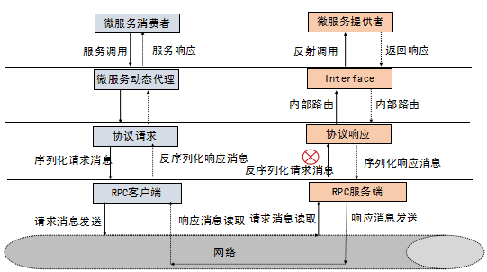

# gRPC简介

## 1、RPC入门

gRPC是一个高性能、开源和通用的RPC框架，面向服务端和移动端，基于HTTP/2设计。

### 1.1、RPC框架原理

RPC 框架的目标就是让远程服务调用更加简单、透明，RPC 框架负责屏蔽底层的传输方式（TCP 或者 UDP）、序列化方式（XML/Json/ 二进制）和通信细节。服务调用者可以像调用本地接口一样调用远程的服务提供者，而不需要关心底层通信细节和调用过程。

原理如图：

### 1.2、主流RPC框架

业界主流的 RPC 框架整体上分为三类：

1. 支持多语言的 RPC 框架，比较成熟的有 Google 的 gRPC、Apache（Facebook）的 Thrift；

2. 只支持特定语言的 RPC 框架，例如新浪微博的 Motan；

3. 支持服务治理等服务化特性的分布式服务框架，其底层内核仍然是 RPC 框架, 例如阿里的 Dubbo。

随着微服务的发展，基于语言中立性原则构建微服务，逐渐成为一种主流模式，例如对于后端并发处理要求高的微服务，比较适合采用 Go 语言构建，而对于前端的 Web 界面，则更适合 Java 和 JavaScript。

### 1.3 gRPC

#### 1.3.1 gRPC概览

gRPC 是由 Google 开发并开源的一种语言中立的 RPC 框架，当前支持 C、Java 和 Go 语言，其中 C 版本支持 C、C++、Node.js、C# 等。调用如下图：

#### 1.3.2 gRPC特点

1. 语言中立，支持多种语言；

2. 基于 IDL 文件定义服务，通过 proto3 工具生成指定语言的数据结构、服务端接口以及客户端 Stub；

3. 通信协议基于标准的 HTTP/2 设计，支持双向流、消息头压缩、单 TCP 的多路复用、服务端推送等特性，这些特性使得 gRPC 在移动端设备上更加省电和节省网络流量；

4. 序列化支持 PB（Protocol Buffer）和 JSON，PB 是一种语言无关的高性能序列化框架，基于 HTTP/2 + PB, 保障了 RPC 调用的高性能