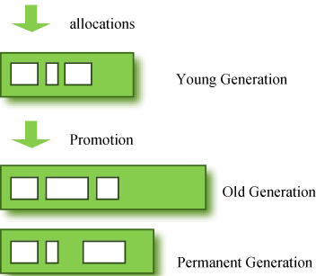
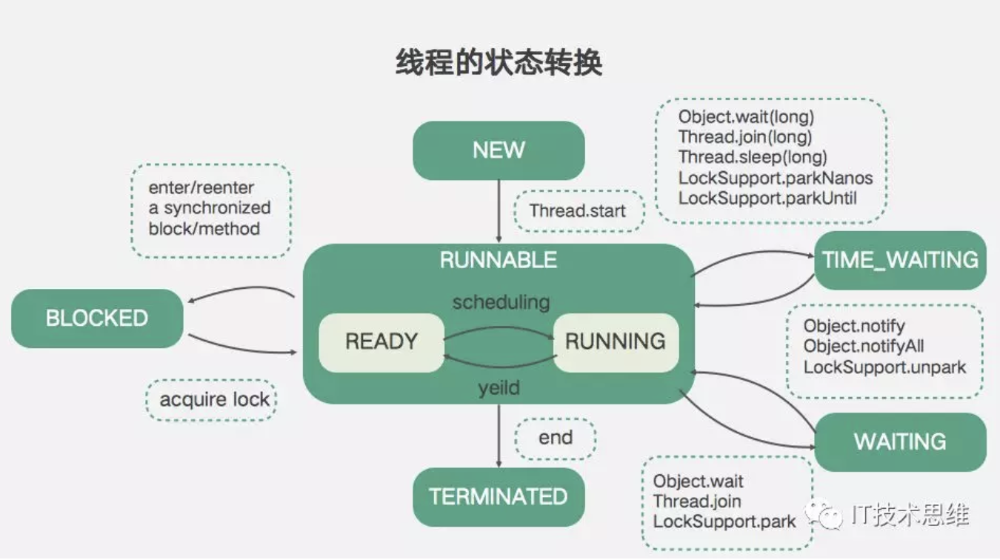
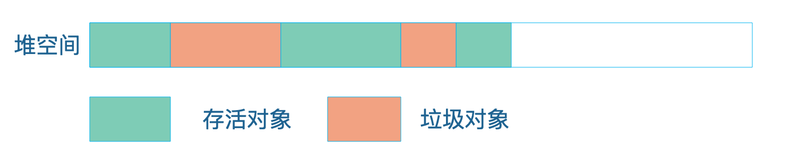
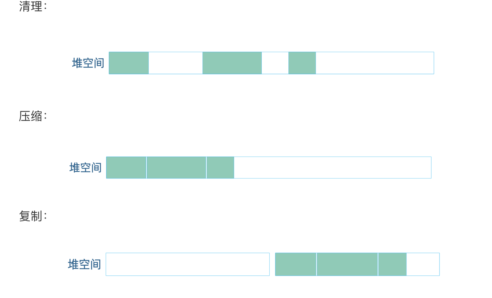
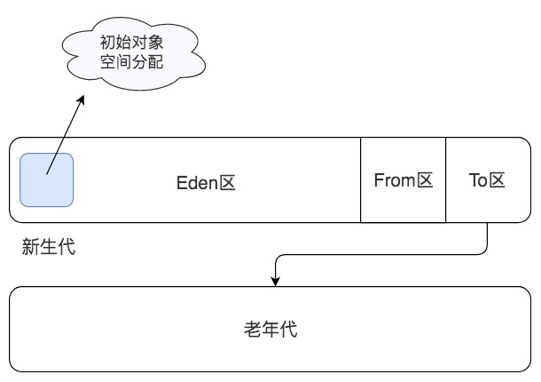

## Java必备

### 垃圾回收

对象在物理内存空间被划分为两部分，新生代（young generate）和老年代（old generate）

**新生代**：大部分的新创建对象分配在新生代。因为大部分对象很快就会变得不可达，所以它们被分配在新生代，然后消失不再。当对象从新生代移除时，我们称之为"**minor GC**"。

**老年代**：存活在新生代中但未变为不可达的对象会被复制到老年代。一般来说老年代的内存空间比新生代大，所以在老年代GC发生的频率较新生代低一些。当对象从老年代被移除时，我们称之为"**major GC**"(或者**full GC**)。

### 多线程
线程是JVM执行任务的最小单元

####  1、JVM中线程的状态
    * New
    * Runable（Ready<===>Running）
    * Blocked
    * Terminated
    * Waiting
    * Time_Waiting
#### 2、状态转换

当创建一个线程的时候，线程处在New状态，运行Thread的Start方法后，线程进入Runnable可运行状态。
这个时候，所有可运行状态的线程并不能马上运行，而是需要先进入就绪状态等待线程调度，如图中间的Ready状态。在获取到Cpu后才能进入运行状态，如图中的Running。运行状态可以随着不同条件转换成除New以外的其他状态。

先看左边，在运行态中的线程进入Synchronized同步块或者同步方法时，如果获取锁失败，则会进入到Blocked状态。当获取到锁后，会从Blocked状态恢复到就绪状态。

再看右边，运行中的线程还会进入等待状态，这两个等待一个是有超时时间的等待，例如调用Object.wait、Thread.join等。另外一个时无超时的等待，例如调用Thread.join或者Locksupport.park。

这两种等待都可以通过Notify或Unpark结束等待状态恢复到就绪状态。

最后是线程运行完成结束时，如图下方，线程状态变成Terminated

### 3、线程池
Executors工具类中提供了5种线程池的创建方法

    * 固定大小线程池，特点是线程数固定，使用无界队列，适用于任务数量不均匀的场景、对内存压力不敏感，但系统负载比较敏感的场景；
    
    * Cached线程池，特点是不限制线程数，适用于要求低延迟的短期任务场景；
    
    * 单线程线程池，也就是一个线程的固定线程池，适用于需要异步执行但需要保证任务顺序的场景；
    
    * Scheduled线程池，适用于定期执行任务场景，支持按固定频率定期执行和按固定延时定期执行两种方式；
    
    * 工作窃取线程池，使用的ForkJoinPool，是固定并行度的多任务队列，适合任务执行时长不均匀的场景。
[原文链接](https://mp.weixin.qq.com/s?__biz=MjM5MTE1NTQ4Mg==&mid=2649731439&idx=1&sn=64046fcaad7be914dcf922ec0a34cad7&chksm=bea2c51a89d54c0c6d258d4eae50b3a477fcf8227bc360591403dc9282ffce3f9c5bbc46b581&token=1490087409&lang=zh_CN#rd)

### ThreadPoolExcutor

### JVM

jvm主要有类加载器、运行时数据区、执行引擎三个部分组成。如下图：

Jvm通过可达性分析算法进行垃圾对象的识别，具体过程：从线程栈帧中的局部变量，或者是方法区的静态变量出发，将这些变量引用的对象进行标记，然后看这些被标记的对象是否引用了其他对象，继续进行标记，所有被标记过的对象都是被使用的对象，而那些没有被标记的对象就是可回收的垃圾对象了。其实，可达性分析算法其实是**一个引用标记算法**。标记完成之后，就会进行回收，回收主要有三种方法：

- 第一种方式是清理：将垃圾对象占据的内存清理掉，其实 JVM 并不会真的将这些垃圾内存进行清理，而是将这些垃圾对象占用的内存空间标记为空闲，记录在一个空闲列表里，当应用程序需要创建新对象的时候，就从空闲列表中找一段空闲内存分配给这个新对象。
- 第二种方式是压缩：从堆空间的头部开始，将存活的对象拷贝放在一段连续的内存空间中，那么其余的空间就是连续的空闲空间。
- 第三种方式是复制：将堆空间分成两部分，只在其中一部分创建对象，当这个部分空间用完的时候，将标记过的可用对象复制到另一个空间中。JVM 将这两个空间分别命名为 from 区域和 to 区域。当对象从 from 区域复制到 to 区域后，两个区域交换名称引用，继续在 from 区域创建对象，直到 from 区域满。

回收之前：

回收之后：

JVM 在具体进行垃圾回收的时候，会进行分代回收。绝大多数的 Java 对象存活时间都非常短，很多时候就是在一个方法内创建对象，对象引用放在栈中，当方法调用结束，栈帧出栈的时候，这个对象就失去引用了，成为垃圾。针对这种情况，JVM 将堆空间分成新生代（young）和老年代（old）两个区域，创建对象的时候，只在新生代创建，当新生代空间不足的时候，只对新生代进行垃圾回收，这样需要处理的内存空间就比较小，垃圾回收速度就比较快。

新生代又分为 Eden 区、From 区和 To 区三个区域，每次垃圾回收都是扫描 Eden 区和 From 区，将存活对象复制到 To 区，然后交换 From 区和 To 区的名称引用，下次垃圾回收的时候继续将存活对象从 From 区复制到 To 区。当一个对象经过几次新生代垃圾回收，也就是几次从 From 区复制到 To 区以后，依然存活，那么这个对象就会被复制到老年代区域。

当老年代空间已满，也就是无法将新生代中多次复制后依然存活的对象复制进去的时候，就会对新生代和老年代的内存空间进行一次全量垃圾回收，即 Full GC。所以根据应用程序的对象存活时间，合理设置老年代和新生代的空间比例对 JVM 垃圾回收的性能有很大影响，JVM 设置老年代新生代比例的参数是 -XX:NewRatio。

JVM 中，具体执行垃圾回收的垃圾回收器有四种:

**第一种是 Serial 串行垃圾回收器**，这是 JVM 早期的垃圾回收器，只有一个线程执行垃圾回收。

**第二种是 Parallel 并行垃圾回收器**，它启动多线程执行垃圾回收。如果 JVM 运行在多核 CPU 上，那么显然并行垃圾回收要比串行垃圾回收效率高。在串行和并行垃圾回收过程中，当垃圾回收线程工作的时候，必须要停止用户线程的工作，否则可能会导致对象的引用标记错乱，因此垃圾回收过程也被称为 stop the world，在用户视角看来，所有的程序都不再执行，整个世界都停止了。

**第三种 CMS 并发垃圾回收器**，在垃圾回收的某些阶段，垃圾回收线程和用户线程可以并发运行，因此对用户线程的影响较小。Web 应用这类对用户响应时间比较敏感的场景，适用 CMS 垃圾回收器。

**最后一种是 G1 垃圾回收器**，它将整个堆空间分成多个子区域，然后在这些子区域上各自独立进行垃圾回收，在回收过程中垃圾回收线程和用户线程也是并发运行。G1 综合了以前几种垃圾回收器的优势，适用于各种场景，是未来主要的垃圾回收器。

### OutOfMemoryError 和 StackOverflowError

 OutOfMemoryError，是堆空间不足了，可能是 JVM 分配的内存空间不足以让程序正常运行，这时候我们需要通过调整 -Xmx 参数增加内存空间。也可能是程序存在内存泄漏，比如一些对象被放入 List 或者 Map 等容器对象中，虽然这些对象程序已经不再使用了，但是这些对象依然被容器对象引用，无法进行垃圾回收，导致内存溢出，这时候可以通过 jmap 命令查看堆中的对象情况，分析是否有内存泄漏。

 StackOverflowError，是线程栈空间不足，栈空间不足通常是因为方法调用的层次太多，导致栈帧太多。我们可以先通过栈异常信息观察是否存在错误的递归调用，因为每次递归都会使嵌套方法调用更深入一层。如果调用是正常的，可以尝试调整 -Xss 参数增加栈空间大小。

如果程序运行卡顿，部分请求响应延迟比较厉害，那么可以通过 jstat 命令查看垃圾回收器的运行状况，是否存在较长时间的 FullGC，然后调整垃圾回收器的相关参数，使垃圾回收对程序运行的影响尽可能小。

### Q1：JVM 是一个进程，JVM 上跑 Tomcat，Tomcat 上可以部署多个应用。这样的话，每个跑在 Tomcat 上的应用是一个线程吗？该怎么理解“如果一个应用 crash 了，其他应用也会 crash”？

我们用 Java 开发 Web 应用，开发完成，编译打包以后得到的是一个 war 包，这个 war 包放入 Tomcat 的应用程序路径下，启动 Tomcat 就可以通过 HTTP 请求访问这个 Web 应用了。

首先，我们是通过执行 Tomcat 的 Shell 脚本启动 Tomcat 的，而在 Shell 脚本里，其实启动的是 Java 虚拟机，大概是这样一个 Shell 命令：`java org.apache.catalina.startup.Bootstrap "$@" start `

所以我们在 Linux 操作系统执行 Tomcat 的 Shell 启动脚本，Tomcat 启动以后，其实在操作系统里看到的是一个 JVM 虚拟机进程。这个虚拟机进程启动以后，加载 class 进来执行，首先加载的就这个org.apache.catalina.startup.Bootstrap类，这个类里面有一个main()函数，是整个 Tomcat 的入口函数，JVM 虚拟机会启动一个主线程从这个入口函数开始执行。

主线程从 Bootstrap 的 main() 函数开始执行，初始化 Tomcat 的运行环境，这时候就需要创建一些线程，比如负责监听 80 端口的线程，处理客户端连接请求的线程，以及执行用户请求的线程。创建这些线程的代码是 Tomcat 代码的一部分。初始化运行环境之后，Tomcat 就会扫描 Web 程序路径，扫描到开发的 war 包后，再加载 war 包里的类到 JVM。因为 Web 应用是被 Tomcat 加载运行的，所以我们也称 Tomcat 为 Web 容器。

如果有外部请求发送到 Tomcat，也就是外部程序通过 80 端口和 Tomcat 进行 HTTP 通信的时候，Tomcat 会根据 war 包中的 web.xml 配置，决定这个请求 URL 应该由哪个 Servlet 处理，然后 Tomcat 就会分配一个线程去处理这个请求，实际上，就是这个线程执行相应的 Servlet 代码。我们回到小美同学的问题，Tomcat 启动的时候，启动的是 JVM 进程，这个进程首先是执行 JVM 的代码，而 JVM 会加载 Tomcat 的 class 执行，并分配一个主线程，这个主线程会从 main 函数开始执行。

在主线程执行过程中，Tomcat 的代码还会启动其他一些线程，包括处理 HTTP 请求的线程。而我们开发的应用是一些 class，被 Tomcat 加载到这个 JVM 里执行，所以，即使这里有多个应用被加载，也只是加载了一些 class，我们的应用被加载进来以后，并没有增加 JVM 进程中的线程数，也就是 web 应用本身和线程是没有关系的。而 Tomcat 会根据 HTTP 请求 URL 执行应用中的代码，这个时候，可以理解成每个请求分配一个线程，每个线程执行的都是我们开发的 Web 代码。如果 Web 代码中包含了创建新线程的代码，To

