1、垃圾回收

对象在物理内存空间被划分为两部分，新生代（young generate）和老年代（old generate）

**新生代**：大部分的新创建对象分配在新生代。因为大部分对象很快就会变得不可达，所以它们被分配在新生代，然后消失不再。当对象从新生代移除时，我们称之为"**minor GC**"。

**老年代**：存活在新生代中但未变为不可达的对象会被复制到老年代。一般来说老年代的内存空间比新生代大，所以在老年代GC发生的频率较新生代低一些。当对象从老年代被移除时，我们称之为"**major GC**"(或者**full GC**)。

## 2、多线程
线程是JVM执行任务的最小单元

###  1、JVM中线程的状态
    * New
    * Runable（Ready<===>Running）
    * Blocked
    * Terminated
    * Waiting
    * Time_Waiting
### 2、状态转换

当创建一个线程的时候，线程处在New状态，运行Thread的Start方法后，线程进入Runnable可运行状态。
这个时候，所有可运行状态的线程并不能马上运行，而是需要先进入就绪状态等待线程调度，如图中间的Ready状态。在获取到Cpu后才能进入运行状态，如图中的Running。运行状态可以随着不同条件转换成除New以外的其他状态。

先看左边，在运行态中的线程进入Synchronized同步块或者同步方法时，如果获取锁失败，则会进入到Blocked状态。当获取到锁后，会从Blocked状态恢复到就绪状态。

再看右边，运行中的线程还会进入等待状态，这两个等待一个是有超时时间的等待，例如调用Object.wait、Thread.join等。另外一个时无超时的等待，例如调用Thread.join或者Locksupport.park。

这两种等待都可以通过Notify或Unpark结束等待状态恢复到就绪状态。

最后是线程运行完成结束时，如图下方，线程状态变成Terminated

### 3、线程池
Executors工具类中提供了5种线程池的创建方法

    * 固定大小线程池，特点是线程数固定，使用无界队列，适用于任务数量不均匀的场景、对内存压力不敏感，但系统负载比较敏感的场景；
    
    * Cached线程池，特点是不限制线程数，适用于要求低延迟的短期任务场景；
    
    * 单线程线程池，也就是一个线程的固定线程池，适用于需要异步执行但需要保证任务顺序的场景；
    
    * Scheduled线程池，适用于定期执行任务场景，支持按固定频率定期执行和按固定延时定期执行两种方式；
    
    * 工作窃取线程池，使用的ForkJoinPool，是固定并行度的多任务队列，适合任务执行时长不均匀的场景。
[原文链接](https://mp.weixin.qq.com/s?__biz=MjM5MTE1NTQ4Mg==&mid=2649731439&idx=1&sn=64046fcaad7be914dcf922ec0a34cad7&chksm=bea2c51a89d54c0c6d258d4eae50b3a477fcf8227bc360591403dc9282ffce3f9c5bbc46b581&token=1490087409&lang=zh_CN#rd)

### ThreadPoolExcutor

### JVM

jvm主要有类加载器、运行时数据区、执行引擎三个部分组成。如下图：

Java虚拟机在运行程序时会把其自动管理的内存划分为以下几个区域，每个区域都有的用途以及创建销毁的时机，其中蓝色部分代表的是所有线程共享的数据区域，而白色部分代表的是每个线程的私有数据区域，其中Java栈又包括虚拟机栈以及本地方法栈。

- 方法区（Method Area）方法区属于线程共享的内存区域，又称Non-Heap（非堆），主要用于存储已被虚拟机加载的类信息、常量、静态变量、即时编译器编译后的代码等数据，根据Java 虚拟机规范的规定，当方法区无法满足内存分配需求时，将抛出OutOfMemoryError 异常。值得注意的是在方法区中存在一个叫运行时常量池(Runtime Constant Pool）的区域，它主要用于存放编译器生成的各种字面量和符号引用，这些内容将在类加载后存放到运行时常量池中，以便后续使用。
- JVM堆（Java Heap）Java 堆也是属于线程共享的内存区域，它在虚拟机启动时创建，是Java 虚拟机所管理的内存中最大的一块，主要用于存放对象实例，几乎所有的对象实例都在这里分配内存，注意Java 堆是垃圾收集器管理的主要区域，因此很多时候也被称做GC 堆，如果在堆中没有内存完成实例分配，并且堆也无法再扩展时，将会抛出OutOfMemoryError 异常。
- 程序计数器(Program Counter Register)：属于线程私有的数据区域，是一小块内存空间，主要代表当前线程所执行的字节码行号指示器。字节码解释器工作时，通过改变这个计数器的值来选取下一条需要执行的字节码指令，分支、循环、跳转、异常处理、线程恢复等基础功能都需要依赖这个计数器来完成。
- 虚拟机栈(Java Virtual Machine Stacks)：属于线程私有的数据区域，与线程同时创建，总数与线程关联，代表Java方法执行的内存模型。每个方法执行时都会创建一个栈桢来存储方法的的变量表、操作数栈、动态链接方法、返回值、返回地址等信息。每个方法从调用直结束就对于一个栈桢在虚拟机栈中的入栈和出栈过程，如下（图有误，应该为栈桢）
  

Jvm通过可达性分析算法进行垃圾对象的识别，具体过程：从线程栈帧中的局部变量，或者是方法区的静态变量出发，将这些变量引用的对象进行标记，然后看这些被标记的对象是否引用了其他对象，继续进行标记，所有被标记过的对象都是被使用的对象，而那些没有被标记的对象就是可回收的垃圾对象了。其实，可达性分析算法其实是**一个引用标记算法**。标记完成之后，就会进行回收，回收主要有三种方法：

- 第一种方式是清理：将垃圾对象占据的内存清理掉，其实 JVM 并不会真的将这些垃圾内存进行清理，而是将这些垃圾对象占用的内存空间标记为空闲，记录在一个空闲列表里，当应用程序需要创建新对象的时候，就从空闲列表中找一段空闲内存分配给这个新对象。
- 第二种方式是压缩：从堆空间的头部开始，将存活的对象拷贝放在一段连续的内存空间中，那么其余的空间就是连续的空闲空间。
- 第三种方式是复制：将堆空间分成两部分，只在其中一部分创建对象，当这个部分空间用完的时候，将标记过的可用对象复制到另一个空间中。JVM 将这两个空间分别命名为 from 区域和 to 区域。当对象从 from 区域复制到 to 区域后，两个区域交换名称引用，继续在 from 区域创建对象，直到 from 区域满。

回收之前：

回收之后：

JVM 在具体进行垃圾回收的时候，会进行分代回收。绝大多数的 Java 对象存活时间都非常短，很多时候就是在一个方法内创建对象，对象引用放在栈中，当方法调用结束，栈帧出栈的时候，这个对象就失去引用了，成为垃圾。针对这种情况，JVM 将堆空间分成新生代（young）和老年代（old）两个区域，创建对象的时候，只在新生代创建，当新生代空间不足的时候，只对新生代进行垃圾回收，这样需要处理的内存空间就比较小，垃圾回收速度就比较快。

新生代又分为 Eden 区、From 区和 To 区三个区域，每次垃圾回收都是扫描 Eden 区和 From 区，将存活对象复制到 To 区，然后交换 From 区和 To 区的名称引用，下次垃圾回收的时候继续将存活对象从 From 区复制到 To 区。当一个对象经过几次新生代垃圾回收，也就是几次从 From 区复制到 To 区以后，依然存活，那么这个对象就会被复制到老年代区域。

当老年代空间已满，也就是无法将新生代中多次复制后依然存活的对象复制进去的时候，就会对新生代和老年代的内存空间进行一次全量垃圾回收，即 Full GC。所以根据应用程序的对象存活时间，合理设置老年代和新生代的空间比例对 JVM 垃圾回收的性能有很大影响，JVM 设置老年代新生代比例的参数是 -XX:NewRatio。

JVM 中，具体执行垃圾回收的垃圾回收器有四种:

**第一种是 Serial 串行垃圾回收器**，这是 JVM 早期的垃圾回收器，只有一个线程执行垃圾回收。

**第二种是 Parallel 并行垃圾回收器**，它启动多线程执行垃圾回收。如果 JVM 运行在多核 CPU 上，那么显然并行垃圾回收要比串行垃圾回收效率高。在串行和并行垃圾回收过程中，当垃圾回收线程工作的时候，必须要停止用户线程的工作，否则可能会导致对象的引用标记错乱，因此垃圾回收过程也被称为 stop the world，在用户视角看来，所有的程序都不再执行，整个世界都停止了。

**第三种 CMS 并发垃圾回收器**，在垃圾回收的某些阶段，垃圾回收线程和用户线程可以并发运行，因此对用户线程的影响较小。Web 应用这类对用户响应时间比较敏感的场景，适用 CMS 垃圾回收器。

**最后一种是 G1 垃圾回收器**，它将整个堆空间分成多个子区域，然后在这些子区域上各自独立进行垃圾回收，在回收过程中垃圾回收线程和用户线程也是并发运行。G1 综合了以前几种垃圾回收器的优势，适用于各种场景，是未来主要的垃圾回收器。

### OutOfMemoryError 和 StackOverflowError

 OutOfMemoryError，是堆空间不足了，可能是 JVM 分配的内存空间不足以让程序正常运行，这时候我们需要通过调整 -Xmx 参数增加内存空间。也可能是程序存在内存泄漏，比如一些对象被放入 List 或者 Map 等容器对象中，虽然这些对象程序已经不再使用了，但是这些对象依然被容器对象引用，无法进行垃圾回收，导致内存溢出，这时候可以通过 jmap 命令查看堆中的对象情况，分析是否有内存泄漏。

 StackOverflowError，是线程栈空间不足，栈空间不足通常是因为方法调用的层次太多，导致栈帧太多。我们可以先通过栈异常信息观察是否存在错误的递归调用，因为每次递归都会使嵌套方法调用更深入一层。如果调用是正常的，可以尝试调整 -Xss 参数增加栈空间大小。

如果程序运行卡顿，部分请求响应延迟比较厉害，那么可以通过 jstat 命令查看垃圾回收器的运行状况，是否存在较长时间的 FullGC，然后调整垃圾回收器的相关参数，使垃圾回收对程序运行的影响尽可能小。

### Q1：JVM 是一个进程，JVM 上跑 Tomcat，Tomcat 上可以部署多个应用。这样的话，每个跑在 Tomcat 上的应用是一个线程吗？该怎么理解“如果一个应用 crash 了，其他应用也会 crash”？

我们用 Java 开发 Web 应用，开发完成，编译打包以后得到的是一个 war 包，这个 war 包放入 Tomcat 的应用程序路径下，启动 Tomcat 就可以通过 HTTP 请求访问这个 Web 应用了。

首先，我们是通过执行 Tomcat 的 Shell 脚本启动 Tomcat 的，而在 Shell 脚本里，其实启动的是 Java 虚拟机，大概是这样一个 Shell 命令：`java org.apache.catalina.startup.Bootstrap "$@" start `

所以我们在 Linux 操作系统执行 Tomcat 的 Shell 启动脚本，Tomcat 启动以后，其实在操作系统里看到的是一个 JVM 虚拟机进程。这个虚拟机进程启动以后，加载 class 进来执行，首先加载的就这个org.apache.catalina.startup.Bootstrap类，这个类里面有一个main()函数，是整个 Tomcat 的入口函数，JVM 虚拟机会启动一个主线程从这个入口函数开始执行。

主线程从 Bootstrap 的 main() 函数开始执行，初始化 Tomcat 的运行环境，这时候就需要创建一些线程，比如负责监听 80 端口的线程，处理客户端连接请求的线程，以及执行用户请求的线程。创建这些线程的代码是 Tomcat 代码的一部分。初始化运行环境之后，Tomcat 就会扫描 Web 程序路径，扫描到开发的 war 包后，再加载 war 包里的类到 JVM。因为 Web 应用是被 Tomcat 加载运行的，所以我们也称 Tomcat 为 Web 容器。

如果有外部请求发送到 Tomcat，也就是外部程序通过 80 端口和 Tomcat 进行 HTTP 通信的时候，Tomcat 会根据 war 包中的 web.xml 配置，决定这个请求 URL 应该由哪个 Servlet 处理，然后 Tomcat 就会分配一个线程去处理这个请求，实际上，就是这个线程执行相应的 Servlet 代码。我们回到小美同学的问题，Tomcat 启动的时候，启动的是 JVM 进程，这个进程首先是执行 JVM 的代码，而 JVM 会加载 Tomcat 的 class 执行，并分配一个主线程，这个主线程会从 main 函数开始执行。

在主线程执行过程中，Tomcat 的代码还会启动其他一些线程，包括处理 HTTP 请求的线程。而我们开发的应用是一些 class，被 Tomcat 加载到这个 JVM 里执行，所以，即使这里有多个应用被加载，也只是加载了一些 class，我们的应用被加载进来以后，并没有增加 JVM 进程中的线程数，也就是 web 应用本身和线程是没有关系的。而 Tomcat 会根据 HTTP 请求 URL 执行应用中的代码，这个时候，可以理解成每个请求分配一个线程，每个线程执行的都是我们开发的 Web 代码。如果 Web 代码中包含了创建新线程的代码，To

## 3、ConcurrentHashMap

### 背景：

线程不安全的HashMap：因为多线程环境下，使用Hashmap进行put操作会引起死循环，导致CPU利用率接近100%，所以在并发情况下不能使用HashMap。

效率低下的HashTable容器：HashTable容器使用synchronized来保证线程安全，但在线程竞争激烈的情况下HashTable的效率非常低下。因为当一个线程访问HashTable的同步方法时，其他线程访问HashTable的同步方法时，可能会进入阻塞或轮询状态。如线程1使用put进行添加元素，线程2不但不能使用put方法添加元素，并且也不能使用get方法来获取元素，所以竞争越激烈效率越低。

### 锁分段技术：

HashTable容器在竞争激烈的并发环境下表现出效率低下的原因，是因为所有访问HashTable的线程都必须竞争同一把锁。那假如容器里有多把锁，每一把锁用于锁容器其中一部分数据，那么当多线程访问容器里不同数据段的数据时，线程间就不会存在锁竞争，从而可以有效的提高并发访问效率。

这就是ConcurrentHashMap所使用的锁分段技术，首先将数据分成一段一段的存储，然后给每一段数据配一把锁，当一个线程占用锁访问其中一个段数据的时候，其他段的数据也能被其他线程访问。

有些方法需要跨段，比如size()和containsValue()，它们可能需要锁定整个表而而不仅仅是某个段，这需要按顺序锁定所有段，操作完毕后，又按顺序释放所有段的锁。

这里“按顺序”是很重要的，否则极有可能出现死锁，在ConcurrentHashMap内部，段数组是final的，并且其成员变量实际上也是final的，但是，仅仅是将数组声明为final的并不保证数组成员也是final的，这需要实现上的保证。这可以确保不会出现死锁，因为获得锁的顺序是固定的。

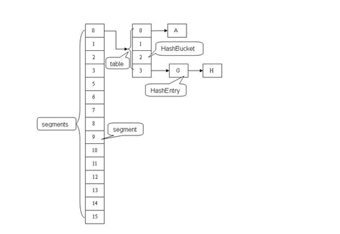

ConcurrentHashMap是由Segment数组结构和HashEntry数组结构组成。Segment是一种可重入锁ReentrantLock，在ConcurrentHashMap里扮演锁的角色，HashEntry则用于存储键值对数据。

一个ConcurrentHashMap里包含一个Segment数组，Segment的结构和HashMap类似，是一种数组和链表结构， 一个Segment里包含一个HashEntry数组，每个HashEntry是一个链表结构的元素， 每个Segment守护者一个HashEntry数组里的元素,当对HashEntry数组的数据进行修改时，必须首先获得它对应的Segment锁。

### 应用场景：

当有一个大数组时需要在多个线程共享时就可以考虑是否把它给分层多个节点了，避免大锁。并可以考虑通过hash算法进行一些模块定位。

其实不止用于线程，当设计数据表的事务时（事务某种意义上也是同步机制的体现），可以把一个表看成一个需要同步的数组，如果操作的表数据太多时就可以考虑事务分离了（这也是为什么要避免大表的出现），比如把数据进行字段拆分，水平分表等。

### 源码：

ConcurrentHashMap(1.7及之前)中主要实体类就是三个：ConcurrentHashMap（整个Hash表）,Segment（桶），HashEntry（节点）

对应上面的图可以看出之间的关系：

~~~java
/**
* The segments, each of which is a specialized hash table
*/
final Segment[] segments;
~~~

ConcurrentHashMap完全允许多个读操作并发进行，读操作并不需要加锁。如果使用传统的技术，如HashMap中的实现，如果允许可以在hash链的中间添加或删除元素，读操作不加锁将得到不一致的数据。

ConcurrentHashMap实现技术是保证HashEntry几乎是不可变的。HashEntry代表每个hash链中的一个节点，其结构如下所示：

~~~java
static final class HashEntry<K,V> {
     final K key;
     final int hash;
     volatile V value;
     final HashEntry next;
 }
~~~

可以看到除了value不是final的，其它值都是final的，这意味着不能从hash链的中间或尾部添加或删除节点，因为这需要修改next 引用值，所有的节点的修改只能从头部开始。对于put操作，可以一律添加到Hash链的头部。

但是对于remove操作，可能需要从中间删除一个节点，这就需要将要删除节点的前面所有节点整个复制一遍，最后一个节点指向要删除结点的下一个结点。这在讲解删除操作时还会详述。为了确保读操作能够看到最新的值，将value设置成volatile，这避免了加锁。

### 其他：

为了加快定位段以及段中hash槽的速度，每个段hash槽的的个数都是2^n，这使得通过位运算就可以定位段和段中hash槽的位置。当并发级别为默认值16时，也就是段的个数，hash值的高4位决定分配在哪个段中。

但是我们也不要忘记《算法导论》给我们的教训：hash槽的的个数不应该是 2^n，这可能导致hash槽分配不均，这需要对hash值重新再hash一次。（这段似乎有点多余了 ）

定位操作：

~~~java
final Segment segmentFor(int hash) {
     return segments[(hash >>> segmentShift) & segmentMask];
 }
~~~

既然ConcurrentHashMap使用分段锁Segment来保护不同段的数据，那么在插入和获取元素的时候，必须先通过哈希算法定位到Segment。可以看到ConcurrentHashMap会首先使用Wang/Jenkins hash的变种算法对元素的hashCode进行一次再哈希。

再哈希，其目的是为了减少哈希冲突，使元素能够均匀的分布在不同的Segment上，从而提高容器的存取效率。假如哈希的质量差到极点，那么所有的元素都在一个Segment中，不仅存取元素缓慢，分段锁也会失去意义。

默认情况下segmentShift为28，segmentMask为15，再哈希后的数最大是32位二进制数据，向右无符号移动28位，意思是让高4位参与到hash运算中， (hash >>> segmentShift) & segmentMask的运算结果分别是4，15，7和8，可以看到hash值没有发生冲突。

### 数据结构

所有的成员都是final的，其中segmentMask和segmentShift主要是为了定位段，参见上面的segmentFor方法。

关于Hash表的基础数据结构，这里不想做过多的探讨。Hash表的一个很重要方面就是如何解决hash冲突，ConcurrentHashMap 和HashMap使用相同的方式，都是将hash值相同的节点放在一个hash链中。与HashMap不同的是，ConcurrentHashMap使用多个子Hash表，也就是段(Segment)。

每个Segment相当于一个子Hash表，它的数据成员如下：

~~~java
static final class Segment<K,V> extends ReentrantLock implements Serializable {
         /**
          * The number of elements in this segment's region.
          */
         transient volatileint count;
         /**
          * Number of updates that alter the size of the table. This is
          * used during bulk-read methods to make sure they see a
          * consistent snapshot: If modCounts change during a traversal
          * of segments computing size or checking containsValue, then
          * we might have an inconsistent view of state so (usually)
          * must retry.
          */
         transient int modCount;
         /**
          * The table is rehashed when its size exceeds this threshold.
          * (The value of this field is always (int)(capacity *
          * loadFactor).)
          */
         transient int threshold;
         /**
          * The per-segment table.
          */
         transient volatile HashEntry[] table;
         /**
          * The load factor for the hash table.  Even though this value
          * is same for all segments, it is replicated to avoid needing
          * links to outer object.
          * @serial
          */
         final float loadFactor;
 }
~~~

count用来统计该段数据的个数，它是volatile，它用来协调修改和读取操作，以保证读取操作能够读取到几乎最新的修改。

协调方式是这样的，每次修改操作做了结构上的改变，如增加/删除节点(修改节点的值不算结构上的改变)，都要写count值，每次读取操作开始都要读取count的值。这利用了 Java 5中对volatile语义的增强，对同一个volatile变量的写和读存在happens-before关系。

modCount统计段结构改变的次数，主要是为了检测对多个段进行遍历过程中某个段是否发生改变，在讲述跨段操作时会还会详述。

threashold用来表示需要进行rehash的界限值。

table数组存储段中节点，每个数组元素是个hash链，用HashEntry表示。table也是volatile，这使得能够读取到最新的 table值而不需要同步。loadFactor表示负载因子。

## 删除操作remove(key)

~~~java
public V remove(Object key) {
   hash = hash(key.hashCode());
   return segmentFor(hash).remove(key, hash, null);
}
~~~

整个操作是先定位到段，然后委托给段的remove操作。当多个删除操作并发进行时，只要它们所在的段不相同，它们就可以同时进行。

下面是Segment的remove方法实现：

~~~java
V remove(Object key, int hash, Object value) {
     lock();
     try {
         int c = count - 1;
         HashEntry[] tab = table;
         int index = hash & (tab.length - 1);
         HashEntry first = tab[index];
         HashEntry e = first;
         while (e != null && (e.hash != hash || !key.equals(e.key)))
             e = e.next;
         V oldValue = null;
         if (e != null) {
             V v = e.value;
             if (value == null || value.equals(v)) {
                 oldValue = v;

                 // All entries following removed node can stay
                 // in list, but all preceding ones need to be
                 // cloned.
                 ++modCount;
                 HashEntry newFirst = e.next;
                 *for (HashEntry p = first; p != e; p = p.next)
                     *newFirst = new HashEntry(p.key, p.hash,
                                                   newFirst, p.value);
                 tab[index] = newFirst;
                 count = c; // write-volatile
             }
         }
         return oldValue;
     } finally {
         unlock();
     }
 }
~~~

整个操作是在持有段锁的情况下执行的，空白行之前的行主要是定位到要删除的节点e。接下来，如果不存在这个节点就直接返回null，否则就要将e前面的结点复制一遍，尾结点指向e的下一个结点。e后面的结点不需要复制，它们可以重用。

中间那个for循环是做什么用的呢？**（*号标记）**从代码来看，就是将定位之后的所有entry克隆并拼回前面去，但有必要吗？每次删除一个元素就要将那之前的元素克隆一遍？

这点其实是由entry的不变性来决定的，仔细观察entry定义，发现除了value，其他所有属性都是用final来修饰的，这意味着在第一次设置了next域之后便不能再改变它，取而代之的是将它之前的节点全都克隆一次。

至于entry为什么要设置为不变性，这跟不变性的访问不需要同步从而节省时间有关。

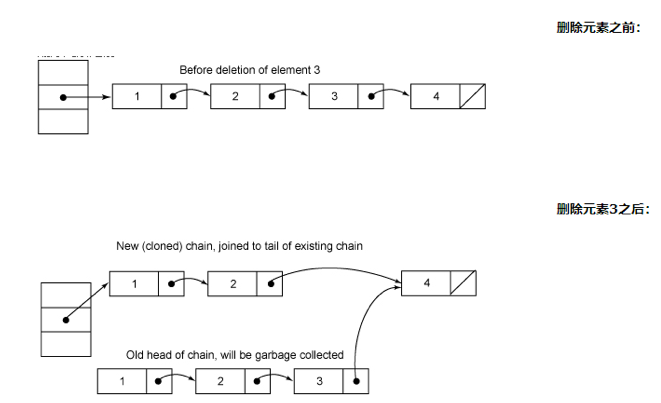

第二个图其实有点问题，复制的结点中应该是值为2的结点在前面，值为1的结点在后面，也就是刚好和原来结点顺序相反，还好这不影响我们的讨论。

整个remove实现并不复杂，但是需要注意如下几点。

- 第一，当要删除的结点存在时，删除的最后一步操作要将count的值减一。这必须是最后一步操作，否则读取操作可能看不到之前对段所做的结构性修改。
- 第二，remove执行的开始就将table赋给一个局部变量tab，这是因为table是 volatile变量，读写volatile变量的开销很大。编译器也不能对volatile变量的读写做任何优化，直接多次访问非volatile实例变量没有多大影响，编译器会做相应优化。

### get操作

ConcurrentHashMap的get操作是直接委托给Segment的get方法，直接看Segment的get方法：

~~~java
V get(Object key, int hash) {
     if (count != 0) { // read-volatile 当前桶的数据个数是否为0
         HashEntry e = getFirst(hash);  得到头节点
         while (e != null) {
             if (e.hash == hash && key.equals(e.key)) {
                 V v = e.value;
                 if (v != null)
                     return v;
                 return readValueUnderLock(e); // recheck
             }
             e = e.next;
         }
     }
     return null;
 }
~~~

get操作不需要锁。

除非读到的值是空的才会加锁重读，我们知道HashTable容器的get方法是需要加锁的，那么ConcurrentHashMap的get操作是如何做到不加锁的呢？原因是它的get方法里将要使用的共享变量都定义成volatile

第一步是访问count变量，这是一个volatile变量，由于所有的修改操作在进行结构修改时都会在最后一步写count 变量，通过这种机制保证get操作能够得到几乎最新的结构更新。对于非结构更新，也就是结点值的改变，由于HashEntry的value变量是 volatile的，也能保证读取到最新的值。

接下来就是根据hash和key对hash链进行遍历找到要获取的结点，如果没有找到，直接访回null。对hash链进行遍历不需要加锁的原因在于链指针next是final的。但是头指针却不是final的，这是通过getFirst(hash)方法返回，也就是存在 table数组中的值。

这使得getFirst(hash)可能返回过时的头结点，例如，当执行get方法时，刚执行完getFirst(hash)之后，另一个线程执行了删除操作并更新头结点，这就导致get方法中返回的头结点不是最新的。这是可以允许，通过对count变量的协调机制，get能读取到几乎最新的数据，虽然可能不是最新的。要得到最新的数据，只有采用完全的同步。

最后，如果找到了所求的结点，判断它的值如果非空就直接返回，否则在有锁的状态下再读一次。这似乎有些费解，理论上结点的值不可能为空，这是因为 put的时候就进行了判断，如果为空就要抛NullPointerException。空值的唯一源头就是HashEntry中的默认值，因为 HashEntry中的value不是final的，非同步读取有可能读取到空值。

仔细看下put操作的语句：`tab[index] = new HashEntry(key, hash, first, value)`，在这条语句中，HashEntry构造函数中对value的赋值以及对`tab[index]`的赋值可能被重新排序，这就可能导致结点的值为空。

这里当v为空时，可能是一个线程正在改变节点，而之前的get操作都未进行锁定，根据bernstein条件，读后写或写后读都会引起数据的不一致，所以这里要对这个e重新上锁再读一遍，以保证得到的是正确值。

~~~java
V readValueUnderLock(HashEntry e) {
     lock();
     try {
         return e.value;
     } finally {
         unlock();
     }
 }
~~~

如用于统计当前Segement大小的count字段和用于存储值的HashEntry的value。定义成volatile的变量，能够在线程之间保持可见性，能够被多线程同时读，并且保证不会读到过期的值，但是只能被单线程写（有一种情况可以被多线程写，就是写入的值不依赖于原值），在get操作里只需要读不需要写共享变量count和value，所以可以不用加锁。

之所以不会读到过期的值，是根据java内存模型的happen before原则，对volatile字段的写入操作先于读操作，即使两个线程同时修改和获取volatile变量，get操作也能拿到最新的值，这是用volatile替换锁的经典应用场景。

### put操作

同样地put操作也是委托给段的put方法。下面是段的put方法：

~~~java
V put(K key, int hash, V value, boolean onlyIfAbsent) {
     lock();
     try {
         int c = count;
         if (c++ > threshold) // ensure capacity
             rehash();
         HashEntry[] tab = table;
         int index = hash & (tab.length - 1);
         HashEntry first = tab[index];
         HashEntry e = first;
         while (e != null && (e.hash != hash || !key.equals(e.key)))
             e = e.next;
         V oldValue;
         if (e != null) {
             oldValue = e.value;
             if (!onlyIfAbsent)
                 e.value = value;
         }
         else {
             oldValue = null;
             ++modCount;
             tab[index] = new HashEntry(key, hash, first, value);
             count = c; // write-volatile
         }
         return oldValue;
     } finally {
         unlock();
     }
 }
~~~

该方法也是在持有段锁(锁定整个segment)的情况下执行的，这当然是为了并发的安全，修改数据是不能并发进行的，必须得有个判断是否超限的语句以确保容量不足时能够rehash。

接着是找是否存在同样一个key的结点，如果存在就直接替换这个结点的值。否则创建一个新的结点并添加到hash链的头部，这时一定要修改modCount和count的值，同样修改count的值一定要放在最后一步。

put方法调用了rehash方法，reash方法实现得也很精巧，主要利用了table的大小为2^n，这里就不介绍了。

而比较难懂的是这句`int index = hash & (tab.length - 1)`，原来segment里面才是真正的hashtable，即每个segment是一个传统意义上的hashtable,如上图，从两者的结构就可以看出区别，这里就是找出需要的entry在table的哪一个位置，之后得到的entry就是这个链的第一个节点，如果e!=null，说明找到了，这是就要替换节点的值（onlyIfAbsent == false），否则，我们需要new一个entry，它的后继是first，而让tab[index]指向它，什么意思呢？实际上就是将这个新entry插入到链头，剩下的就非常容易理解了

由于put方法里需要对共享变量进行写入操作，所以为了线程安全，在操作共享变量时必须得加锁。Put方法首先定位到Segment，然后在Segment里进行插入操作。插入操作需要经历两个步骤，第一步判断是否需要对Segment里的HashEntry数组进行扩容，第二步定位添加元素的位置然后放在HashEntry数组里。

- **是否需要扩容。**在插入元素前会先判断Segment里的HashEntry数组是否超过容量（threshold），如果超过阀值，数组进行扩容。值得一提的是，Segment的扩容判断比HashMap更恰当，因为HashMap是在插入元素后判断元素是否已经到达容量的，如果到达了就进行扩容，但是很有可能扩容之后没有新元素插入，这时HashMap就进行了一次无效的扩容。
- **如何扩容。**扩容的时候首先会创建一个两倍于原容量的数组，然后将原数组里的元素进行再hash后插入到新的数组里。为了高效ConcurrentHashMap不会对整个容器进行扩容，而只对某个segment进行扩容。

另一个操作是containsKey，这个实现就要简单得多了，因为它不需要读取值：

~~~java
boolean containsKey(Object key, int hash) {
     if (count != 0) { // read-volatile
         HashEntry e = getFirst(hash);
         while (e != null) {
             if (e.hash == hash && key.equals(e.key))
                 returntrue;
             e = e.next;
         }
     }
     returnfalse;
 }
~~~

### size()操作

果我们要统计整个ConcurrentHashMap里元素的大小，就必须统计所有Segment里元素的大小后求和。Segment里的全局变量count是一个volatile变量，那么在多线程场景下，我们是不是直接把所有Segment的count相加就可以得到整个ConcurrentHashMap大小了呢？

不是的，虽然相加时可以获取每个Segment的count的最新值，但是拿到之后可能累加前使用的count发生了变化，那么统计结果就不准了。所以最安全的做法，是在统计size的时候把所有Segment的put，remove和clean方法全部锁住，但是这种做法显然非常低效。

因为在累加count操作过程中，之前累加过的count发生变化的几率非常小，所以ConcurrentHashMap的做法是先尝试2次通过不锁住Segment的方式来统计各个Segment大小，如果统计的过程中，容器的count发生了变化，则再采用加锁的方式来统计所有Segment的大小。

那么ConcurrentHashMap是如何判断在统计的时候容器是否发生了变化呢？使用modCount变量，在put , remove和clean方法里操作元素前都会将变量modCount进行加1，那么在统计size前后比较modCount是否发生变化，从而得知容器的大小是否发生变化。

## 4、CPU、磁盘、内存、网络GC排查

线上故障主要会包括cpu、磁盘、内存以及网络问题，而大多数故障可能会包含不止一个层面的问题，所以进行排查时候尽量四个方面依次排查一遍。同时例如jstack、jmap等工具也是不囿于一个方面的问题的，基本上出问题就是df、free、top 三连，然后依次jstack、jmap伺候。

### 4.1 CPU

导致CPU飙高的原因，通常包括业务逻辑问题（死循环）、频繁GC以及上下文切换过多。而最常见的往往是业务逻辑(或者框架逻辑)导致的，可以使用jstack来分析对应的堆栈情况。我们先用ps命令找到对应进程的pid(如果你有好几个目标进程，可以先用top看一下哪个占用比较高)。

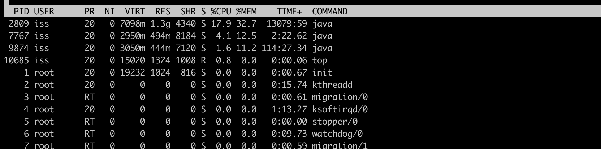

上图中2809，7767较高，接着我们用`top -H -p pid`来找到cpu使用率比较高的一些线程。如下图：

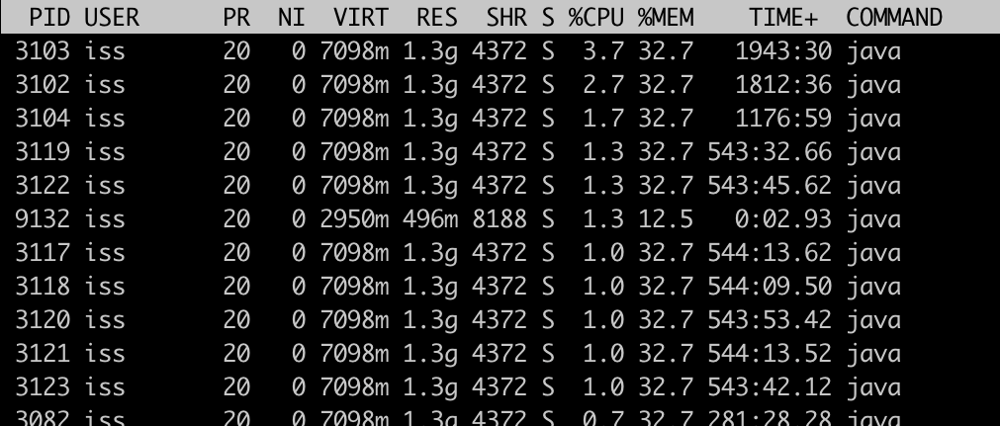

然后将占用最高的pid转换为16进制`printf '%x\n' pid`得到nid，接着直接在jstack中找到相应的堆栈信息`jstack pid |grep 'nid' -C5 –color`。

当然更常见的是我们对整个jstack文件进行分析，通常我们会比较关注WAITING和TIMED_WAITING的部分，BLOCKED就不用说了。我们可以使用命令`cat jstack.log | grep "java.lang.Thread.State" | sort -nr | uniq -c`来对jstack的状态有一个整体的把握，如果WAITING之类的特别多，那么多半是有问题啦。

### 4.2 频繁GC

当然我们还是会使用jstack来分析问题，但有时候我们可以先确定下gc是不是太频繁，使用`jstat -gc pid 1000`命令来对gc分代变化情况进行观察，1000表示采样间隔(ms)，S0C/S1C、S0U/S1U、EC/EU、OC/OU、MC/MU分别代表两个Survivor区、Eden区、老年代、元数据区的容量和使用量。YGC/YGT、FGC/FGCT、GCT则代表YoungGc、FullGc的耗时和次数以及总耗时。

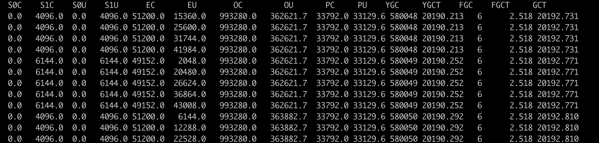

### 4.3 上下文切换

针对频繁上下文问题，我们可以使用`vmstat` 后加刷新频率，时间秒为单位，命令来进行查看：

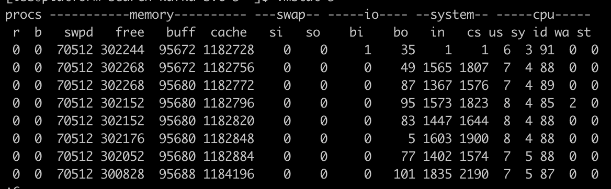

cs(context switch)一列则代表了上下文切换的次数。如果我们希望对特定的pid进行监控那么可以使用 `pidstat -w pid`命令，cswch和nvcswch表示自愿及非自愿切换。

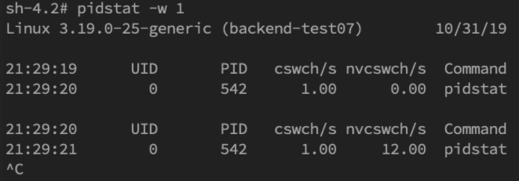

### 4.4 磁盘

磁盘空间方面，直接使用df -hl来查看文件系统状态。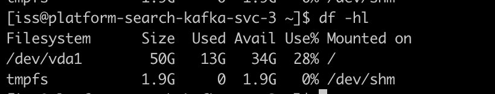

更多时候，磁盘问题还是性能上的问题。我们可以通过iostat`iostat -d -k -x`来进行分析，最后一列`%util`可以看到每块磁盘写入的程度，而`rrqpm/s`以及`wrqm/s`分别表示读写速度，一般就能帮助定位到具体哪块磁盘出现问题了。

另外我们还需要知道是哪个进程在进行读写，一般来说开发自己心里有数，或者用iotop命令来进行定位文件读写的来源。不过这边拿到的是tid，我们要转换成pid，可以通过readlink来找到pid`readlink -f /proc/*/task/tid/../..`。找到pid之后就可以看这个进程具体的读写情况`cat /proc/pid/io`。我们还可以通过lsof命令来确定具体的文件读写情况`lsof -p pid`

### 4.5 内存

内存问题排查起来相对比CPU麻烦一些，场景也比较多。主要包括OOM、GC问题和堆外内存。一般来讲，我们会先用`free`命令先来检查一发内存的各种情况。

#### 4.5.1堆内内存

内存问题大多还都是堆内内存问题。表象上主要分为OOM和StackOverflow。

OOM

JMV中的内存不足，OOM大致可以分为以下几种：

**Exception in thread "main" java.lang.OutOfMemoryError: unable to create new native thread**这个意思是没有足够的内存空间给线程分配java栈，基本上还是线程池代码写的有问题，比如说忘记shutdown，所以说应该首先从代码层面来寻找问题，使用jstack或者jmap。如果一切都正常，JVM方面可以通过指定`Xss`来减少单个thread stack的大小。另外也可以在系统层面，可以通过修改`/etc/security/limits.conf`nofile和nproc来增大os对线程的限制。

**Exception in thread "main" java.lang.OutOfMemoryError: Java heap space**这个意思是堆的内存占用已经达到-Xmx设置的最大值，应该是最常见的OOM错误了。解决思路仍然是先应该在代码中找，怀疑存在内存泄漏，通过jstack和jmap去定位问题。如果说一切都正常，才需要通过调整`Xmx`的值来扩大内存。

**Caused by: java.lang.OutOfMemoryError: Meta space**这个意思是元数据区的内存占用已经达到`XX:MaxMetaspaceSize`设置的最大值，排查思路和上面的一致，参数方面可以通过`XX:MaxPermSize`来进行调整(这里就不说1.8以前的永久代了)。

Stack Overflow

栈内存溢出，这个大家见到也比较多。**Exception in thread "main" java.lang.StackOverflowError**表示线程栈需要的内存大于Xss值，同样也是先进行排查，参数方面通过`Xss`来调整，但调整的太大可能又会引起OOM。

上述关于OOM和StackOverflow的代码排查方面，我们一般使用JMAP`jmap -dump:format=b,file=filename pid`来导出dump文件。通过mat(Eclipse Memory Analysis Tools)导入dump文件进行分析，内存泄漏问题一般我们直接选Leak Suspects即可，mat给出了内存泄漏的建议。另外也可以选择Top Consumers来查看最大对象报告。和线程相关的问题可以选择thread overview进行分析。

日常开发中，代码产生内存泄漏是比较常见的事，并且比较隐蔽，需要开发者更加关注细节。比如说每次请求都new对象，导致大量重复创建对象；进行文件流操作但未正确关闭；手动不当触发gc；ByteBuffer缓存分配不合理等都会造成代码OOM。

另一方面，我们可以在启动参数中指定`-XX:+HeapDumpOnOutOfMemoryError`来保存OOM时的dump文件。

#### 4.5.2 gc问题和线程

gc问题除了影响cpu也会影响内存，排查思路也是一致的。一般先使用jstat来查看分代变化情况，比如youngGC或者fullGC次数是不是太多呀；EU、OU等指标增长是不是异常呀等。线程的话太多而且不被及时gc也会引发oom，大部分就是之前说的`unable to create new native thread`。除了jstack细细分析dump文件外，我们一般先会看下总体线程，通过`pstree -p pid |wc -l`。或者直接通过查看`/proc/pid/task`的数量即为线程数量。

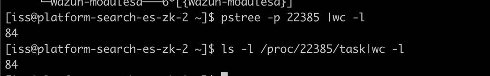

### 4.6 网络

超时错误大部分处在应用层面，所以这块着重理解概念。超时大体可以分为连接超时和读写超时，某些使用连接池的客户端框架还会存在获取连接超时和空闲连接清理超时。

- 读写超时。readTimeout/writeTimeout，有些框架叫做so_timeout或者socketTimeout，均指的是数据读写超时。注意这边的超时大部分是指逻辑上的超时。soa的超时指的也是读超时。读写超时一般都只针对客户端设置。
- 连接超时。connectionTimeout，客户端通常指与服务端建立连接的最大时间。服务端这边connectionTimeout就有些五花八门了，jetty中表示空闲连接清理时间，tomcat则表示连接维持的最大时间。
- 其他。包括连接获取超时connectionAcquireTimeout和空闲连接清理超时idleConnectionTimeout。多用于使用连接池或队列的客户端或服务端框架。

我们在设置各种超时时间中，需要确认的是尽量保持客户端的超时小于服务端的超时，以保证连接正常结束。

#### 4.6.1 tcp队列溢出：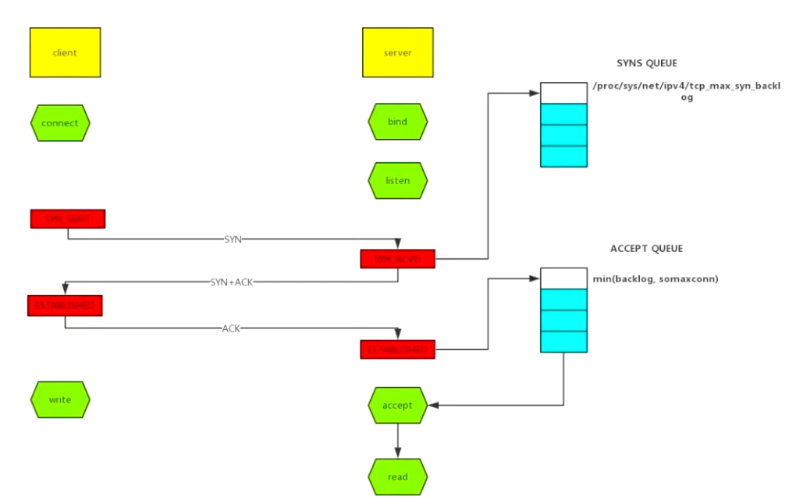

如上图所示，这里有两个队列：syns queue(半连接队列）、accept queue（全连接队列）。三次握手，在server收到client的syn后，把消息放到syns queue，回复syn+ack给client，server收到client的ack，如果这时accept queue没满，那就从syns queue拿出暂存的信息放入accept queue中，否则按tcp_abort_on_overflow指示的执行。

tcp_abort_on_overflow 0表示如果三次握手第三步的时候accept queue满了那么server扔掉client发过来的ack。tcp_abort_on_overflow 1则表示第三步的时候如果全连接队列满了，server发送一个rst包给client，表示废掉这个握手过程和这个连接，意味着日志里可能会有很多`connection reset / connection reset by peer`。

快速定位tcp队列溢出？

~~~shell
netstat命令，执行netstat -s | egrep "listen|LISTEN"
~~~

如下图所示，overflowed表示全连接队列溢出的次数，sockets dropped表示半连接队列溢出的次数。

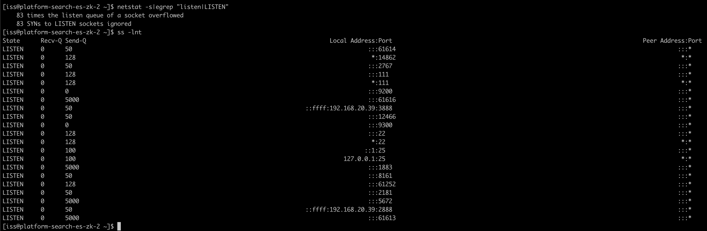

**ss命令，执行ss -lnt**，上面看到Send-Q 表示第三列的listen端口上的全连接队列最大为5，第一列Recv-Q为全连接队列当前使用了多少。接着我们看看怎么设置全连接、半连接队列大小吧：

全连接队列的大小取决于min(backlog, somaxconn)。backlog是在socket创建的时候传入的，somaxconn是一个os级别的系统参数。而半连接队列的大小取决于max(64, /proc/sys/net/ipv4/tcp_max_syn_backlog)。

在日常开发中，我们往往使用servlet容器作为服务端，所以我们有时候也需要关注容器的连接队列大小。在tomcat中backlog叫做`acceptCount`，在jetty里面则是`acceptQueueSize`。

#### 4.6.2 RST异常

RST包表示连接重置，用于关闭一些无用的连接，通常表示异常关闭，区别于四次挥手。在实际开发中，我们往往会看到`connection reset / connection reset by peer`错误，这种情况就是RST包导致的。**端口不存在**：如果像不存在的端口发出建立连接SYN请求，那么服务端发现自己并没有这个端口则会直接返回一个RST报文，用于中断连接。**主动代替FIN终止连接**：一般来说，正常的连接关闭都是需要通过FIN报文实现，然而我们也可以用RST报文来代替FIN，表示直接终止连接。实际开发中，可设置SO_LINGER数值来控制，这种往往是故意的，来跳过TIMED_WAIT，提供交互效率，不闲就慎用。

**客户端或服务端有一边发生了异常，该方向对端发送RST以告知关闭连接**：我们上面讲的tcp队列溢出发送RST包其实也是属于这一种。这种往往是由于某些原因，一方无法再能正常处理请求连接了(比如程序崩了，队列满了)，从而告知另一方关闭连接。

**接收到的TCP报文不在已知的TCP连接内**：比如，一方机器由于网络实在太差TCP报文失踪了，另一方关闭了该连接，然后过了许久收到了之前失踪的TCP报文，但由于对应的TCP连接已不存在，那么会直接发一个RST包以便开启新的连接。

**一方长期未收到另一方的确认报文，在一定时间或重传次数后发出RST报文**：这种大多也和网络环境相关了，网络环境差可能会导致更多的RST报文。

之前说过RST报文多会导致程序报错，在一个已关闭的连接上读操作会报`connection reset`，而在一个已关闭的连接上写操作则会报`connection reset by peer`。通常我们可能还会看到`broken pipe`错误，这是管道层面的错误，表示对已关闭的管道进行读写，往往是在收到RST，报出`connection reset`错后继续读写数据报的错，这个在glibc源码注释中也有介绍。

我们在排查故障时候怎么确定有RST包的存在呢？可以使用**tcpdump**命令进行抓包，并使用wireshark进行简单分析了。`tcpdump -i en0 tcp -w xxx.cap`，en0表示监听的网卡。然后我们通过**wireshark**打开抓到的包，可能就能看到如下图所示，红色的就表示RST包了。

TIME_WAIT和CLOSE_WAIT是啥意思相信大家都知道。在线上时，我们可以直接用命令`netstat -n | awk '/^tcp/ {++S[$NF]} END {for(a in S) print a, S[a]}'`来查看time-wait和close_wait的数量

用ss命令会更快`ss -ant | awk '{++S[$1]} END {for(a in S) print a, S[a]}'`

#### 4.6.3 TIME_WAIT

time_wait的存在一是为了丢失的数据包被后面连接复用，二是为了在2MSL的时间范围内正常关闭连接。它的存在其实会大大减少RST包的出现。过多的time_wait在短连接频繁的场景比较容易出现。这种情况可以在服务端做一些内核参数调优:

~~~shell
#表示开启重用。允许将TIME-WAIT sockets重新用于新的TCP连接，默认为0，表示关闭
net.ipv4.tcp_tw_reuse = 1
#表示开启TCP连接中TIME-WAIT sockets的快速回收，默认为0，表示关闭
net.ipv4.tcp_tw_recycle = 1
~~~

当然我们不要忘记在NAT环境下因为时间戳错乱导致数据包被拒绝的坑了，另外的办法就是改小`tcp_max_tw_buckets`，超过这个数的time_wait都会被干掉，不过这也会导致报`time wait bucket table overflow`的错。

#### 4.6.4 CLOSE_WAIT

close_wait往往都是因为应用程序写的有问题，没有在ACK后再次发起FIN报文。close_wait出现的概率甚至比time_wait要更高，后果也更严重。往往是由于某个地方阻塞住了，没有正常关闭连接，从而渐渐地消耗完所有的线程。

## 5、序列化

Java的序列化能保证对象状态的持久保存，但是遇到一些对象结构复杂的情况还是比较难处理的，总结：

1. 当父类继承Serializable接口时，所有子类都可以被序列化
2. 子类实现了Serializable接口，父类没有，父类中的属性不能序列化（不报错，数据会丢失），但子类中属性仍能正确序列化。
3. 如果序列化的属性是对象，则这个对象也必须实现Serializable接口，否则会报错。
4. 在反序列化时，如果对象的属性有修改或删减，则修改部分的属性会丢失，但不报错。
5. 在反序列化时，如果SerialVersionUID被修改，则反序列化时会失败。

## 6、NIO

Java在1.4以后引入了新I/O（NIO）类库，引入了基于通道和缓冲区来执行I/O的新方式。就像Java堆上的内存支持I/O缓冲区一样，NIO使用Java.nio.ByteBuffer.allocateDirect()方法分配内存，这种方式就是通常所说的NIO direct memory。ByteBuffer.allocateDirect()分配的内存使用的是本机内存而不是Java堆上的内存，每次分配内存会调用操作系统的os::malloc()函数。另一方面直接ByteBuffer产生的数据如果和网络或者磁盘交互都在操作系统的内核空间中发生，不需要将数据复制到Java内存中，执行这种I/O操作要比一般的从操作系统的内核空间到Java堆上的切换操作快得多，因为可以避免在Java堆与本机堆之间复制数据。但如果I/O频繁的发送很小的数据，这种系统调用的开销可能会抵消数据在内核空间和用户空间复制带来的好处。

