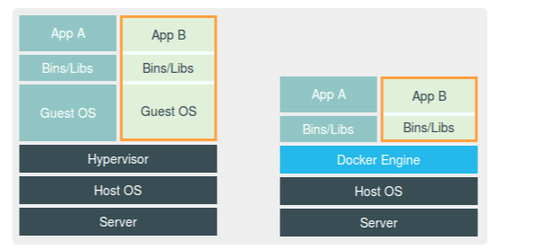

解决docker,ubuntu镜像中没有vi/vim

两行命令

apt update

apt install vim

docker run -it -v 本机目录：docker目录 --name 别名 -d name:tag /bin/bash

docker run -it -v /Users/iss/go/:/go/ -d whole-go-kafka:latest /bin/bash

**进入、退出docker**

docker attach /exit

1、Copy 源码 到go src目录

2、解压  如果有缺包  安装包

cd librdkafka ./configure --prefix /usr make sudo make install

LD_LIBRARY_PATH=/usr/local/lib

export LD_LIBRARY_PATH

**yum install gcc gcc-c++ autoconf automake**

**如果生成成功运行时提示找不到包   ldd bin/server     查看找的目录**

**手动拷贝 src/....1 文件到 /usr/local/lib 下  再运行**

容器，是特殊的进程，通过隔离，只能看到当前namespace里的网络设备和配置。

容器与虚拟机的区别：

虚拟机是真实存在的，而Docker，并没有真正的”Docker容器“运行在宿主机里面。只是启动时，加上了

各种各样的Namespace参数。

1.停止所有的容器

docker stop $(docker ps -q)

### 常用操作

强制移除此容器

docker rm -f mysql1

列出所有容器ID:

docker ps -aq

查看所有运行或者不运行容器：

docker  ps -a

停止所有容器：

docker stop $(docker ps -aq) 

删除容器：

docker rm  $(docker ps -aq) 

删除全部镜像：

docker rmi $(docker images -q)

Docker 删除所有镜像：

docker kill $(docker ps -q) ;  docker rm $(docker ps -a -q) ; dockerrmi $(docker images -q -a) 

