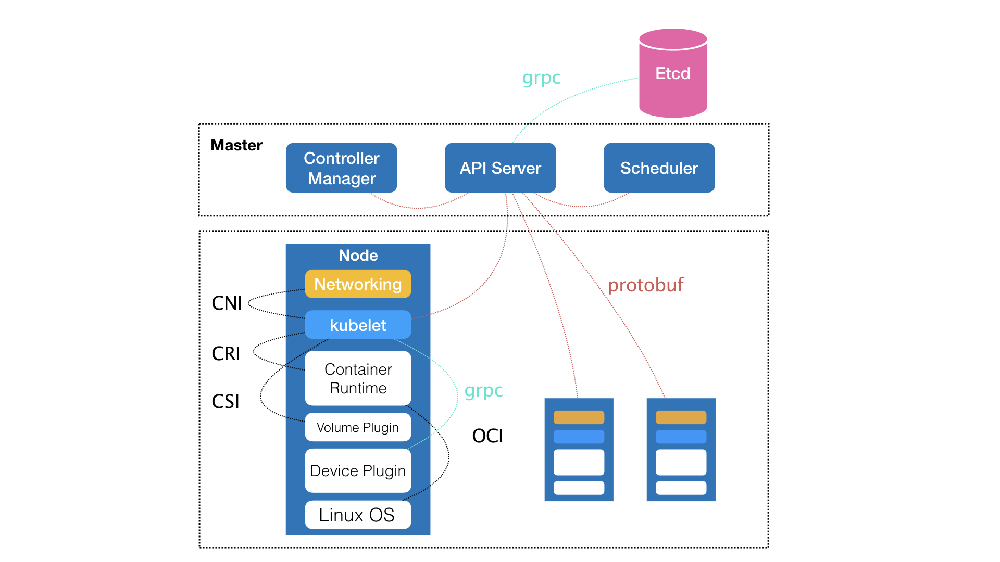
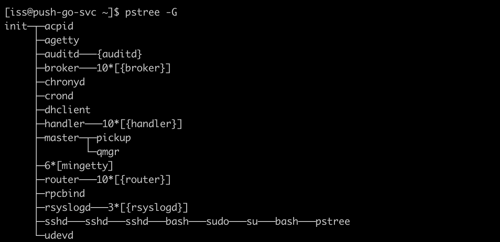

# Kubernetes

## 1、容器

### 1.1 容器基础--进程

- 容器技术的兴起源于 PaaS 技术的普及；
- Docker 公司发布的 Docker 项目具有里程碑式的意义；
- Docker 项目通过“容器镜像”，解决了应用打包这个根本性难题。

一旦一个“程序”被执行起来，它就从磁盘上的二进制文件，变成了计算机内存中的数据、寄存器里的值、堆栈中的指令、被打开的文件，以及各种设备的状态信息的一个集合。**像这样一个程序运行起来后的计算机执行环境的总和，就是我们今天的主角：进程。**

所以，对于进程来说，它的静态表现就是程序，平常都安安静静地待在磁盘上；而一旦运行起来，它就变成了计算机里的数据和状态的总和，这就是它的动态表现。**而容器技术的核心功能，就是通过约束和修改进程的动态表现，从而为其创造出一个“边界”。**

对于 Docker 等大多数 Linux 容器来说，Cgroups 技术是用来制造约束的主要手段，而 Namespace 技术则是用来修改进程视图的主要方法。Linux 容器基础的两种技术：

Namespace 和 Cgroup，容器的本质是一种特殊的进程。

Namespace作用是隔离，进程只能看到该Namespace内的世界，而Cgroups的作用是限制。

每当我们在宿主机上运行了一个 /bin/sh 程序，操作系统都会给它分配一个进程编号，比如 PID=100。这个编号是进程的唯一标识，就像员工的工牌一样。所以 PID=100，可以粗略地理解为这个 /bin/sh 是我们公司里的第 100 号员工。而现在，我们要通过 Docker 把这个 /bin/sh 程序运行在一个容器当中。这时候，Docker 就会在这个第 100 号员工入职时给他施一个“障眼法”，让他永远看不到前面的其他 99 个员工。这样，他就会错误地以为自己就是公司里的第 1 号员工。

这种机制，其实就是对被隔离应用的进程空间做了手脚，使得这些进程只能看到重新计算过的进程编号，比如 PID=1。可实际上，他们在宿主机的操作系统里，还是原来的第 100 号进程。**这种技术，就是 Linux 里面的 Namespace 机制。**而 Namespace 的使用方式也非常有意思：它其实只是 Linux 创建新进程的一个可选参数。我们知道，在 Linux 系统中创建线程的系统调用是 clone()，比如：

~~~c
int pid = clone(main_function, stack_size, SIGCHLD, NULL); 
~~~

这个系统调用就会为我们创建一个新的进程，并且返回它的进程号 pid。而当我们用 clone() 系统调用创建一个新进程时，就可以在参数中指定 CLONE_NEWPID 参数，比如：

~~~c
int pid = clone(main_function, stack_size, CLONE_NEWPID | SIGCHLD, NULL); 
~~~

这时，新创建的这个进程将会“看到”一个全新的进程空间，在这个进程空间里，它的 PID 是 1。之所以说“看到”，是因为这只是一个“障眼法”，在宿主机真实的进程空间里，这个进程的 PID 还是真实的数值，比如 100。

除了我们刚刚用到的 PID Namespace，Linux 操作系统还提供了**Mount、UTS、IPC、Network 和 User ** 这些 Namespace，用来对各种不同的进程上下文进行“障眼法”操作。比如，Mount Namespace，用于让被隔离进程只看到当前 Namespace 里的挂载点信息；Network Namespace，用于让被隔离进程看到当前 Namespace 里的网络设备和配置。这，就是 Linux 容器最基本的实现原理了。

所以，Docker 容器这个听起来玄而又玄的概念，实际上是在创建容器进程时，指定了这个进程所需要启用的一组 Namespace 参数。这样，容器就只能“看”到当前 Namespace 所限定的资源、文件、设备、状态，或者配置。而对于宿主机以及其他不相关的程序，它就完全看不到了。所以说**所以说，容器，其实是一种特殊的进程而已。**

### 1.2 容器基础，隔离与限制

#### 1.2.1 先说隔离

Namespace 技术实际上修改了应用进程看待整个计算机“视图”，即它的“视线”被操作系统做了限制，只能“看到”某些指定的内容。但对于宿主机来说，这些被“隔离”了的进程跟其他进程并没有太大区别。下图是虚拟机与Docker的区别：

对比上图，我们发现：使用虚拟化技术作为应用沙盒，就必须要由 Hypervisor 来负责创建虚拟机，这个虚拟机是真实存在的，并且它里面必须运行一个完整的 Guest OS 才能执行用户的应用进程。这就不可避免地带来了额外的资源消耗和占用。

根据实验，一个运行着 CentOS 的 KVM 虚拟机启动后，在不做优化的情况下，虚拟机自己就需要占用 100~200 MB 内存。此外，用户应用运行在虚拟机里面，它对宿主机操作系统的调用就不可避免地要经过虚拟化软件的拦截和处理，这本身又是一层性能损耗，尤其对计算资源、网络和磁盘 I/O 的损耗非常大。

而相比之下，容器化后的用户应用，却依然还是一个宿主机上的普通进程，这就意味着这些因为虚拟化而带来的性能损耗都是不存在的；而另一方面，使用 Namespace 作为隔离手段的容器并不需要单独的 Guest OS，这就使得容器额外的资源占用几乎可以忽略不计。

所以说，**“敏捷”和“高性能”是容器相较于虚拟机最大的优势，也是它能够在 PaaS 这种更细粒度的资源管理平台上大行其道的重要原因**。不过，有利就有弊，基于 Linux Namespace 的隔离机制相比于虚拟化技术也有很多不足之处，其中最主要的问题就是：**隔离得不彻底。**

1. 首先，既然容器只是运行在宿主机上的一种特殊的进程，那么多个容器之间使用的就还是同一个宿主机的操作系统内核。尽管你可以在容器里通过 Mount Namespace 单独挂载其他不同版本的操作系统文件，比如 CentOS 或者 Ubuntu，但这并不能改变共享宿主机内核的事实。这意味着，如果你要在 Windows 宿主机上运行 Linux 容器，或者在低版本的 Linux 宿主机上运行高版本的 Linux 容器，都是行不通的。
2. 其次，在 Linux 内核中，有很多资源和对象是不能被 Namespace 化的，最典型的例子就是：时间。这就意味着，如果你的容器中的程序使用 settimeofday(2) 系统调用修改了时间，整个宿主机的时间都会被随之修改，这显然不符合用户的预期。相比于在虚拟机里面可以随便折腾的自由度，在容器里部署应用的时候，“什么能做，什么不能做”，就是用户必须考虑的一个问题。

#### 1.2.2 限制

虽然容器内的第 1 号进程在“障眼法”的干扰下只能看到容器里的情况，但是宿主机上，它作为第 100 号进程与其他所有进程之间依然是平等的竞争关系。这就意味着，虽然第 100 号进程表面上被隔离了起来，但是它所能够使用到的资源（比如 CPU、内存），却是可以随时被宿主机上的其他进程（或者其他容器）占用的。当然，这个 100 号进程自己也可能把所有资源吃光。这些情况，显然都不是一个“沙盒”应该表现出来的合理行为。

而 **Linux Cgroups 就是 Linux 内核中用来为进程设置资源限制的一个重要功能。**Linux Cgroups 的全称是 Linux Control Group。它最主要的作用，就是限制一个进程组能够使用的资源上限，包括 CPU、内存、磁盘、网络带宽等等。此外，Cgroups 还能够对进程进行优先级设置、审计，以及将进程挂起和恢复等操作。

在 Linux 中，Cgroups 给用户暴露出来的操作接口是文件系统，即它以文件和目录的方式组织在操作系统的 /sys/fs/cgroup 路径下。在 Ubuntu 16.04 机器里，我可以用 mount 指令把它们展示出来，这条命令是：

~~~shell
$ mount -t cgroup
cpuset on /sys/fs/cgroup/cpuset type cgroup (rw,nosuid,nodev,noexec,relatime,cpuset)cpu on /sys/fs/cgroup/cpu type cgroup (rw,nosuid,nodev,noexec,relatime,cpu)cpuacct on /sys/fs/cgroup/cpuacct type cgroup (rw,nosuid,nodev,noexec,relatime,cpuacct)blkio on /sys/fs/cgroup/blkio type cgroup (rw,nosuid,nodev,noexec,relatime,blkio)memory on /sys/fs/cgroup/memory type cgroup (rw,nosuid,nodev,noexec,relatime,memory)...
~~~

可以看到，在 /sys/fs/cgroup 下面有很多诸如 cpuset、cpu、 memory 这样的子目录，也叫子系统。这些都是我这台机器当前可以被 Cgroups 进行限制的资源种类。而在子系统对应的资源种类下，你就可以看到该类资源具体可以被限制的方法。比如，对 CPU 子系统来说，我们就可以看到如下几个配置文件，这个指令是：

~~~shell
$ ls /sys/fs/cgroup/cpu
cgroup.clone_children cpu.cfs_period_us cpu.rt_period_us  cpu.shares notify_on_release
cgroup.procs      cpu.cfs_quota_us  cpu.rt_runtime_us cpu.stat  tasks
~~~

如果熟悉 Linux CPU 管理的话，你就会在它的输出里注意到 cfs_period 和 cfs_quota 这样的关键词。这两个参数需要组合使用，可以用来限制进程在长度为 cfs_period 的一段时间内，只能被分配到总量为 cfs_quota 的 CPU 时间。

而这样的配置文件又如何使用呢？你需要在对应的子系统下面创建一个目录，比如，我们现在进入 /sys/fs/cgroup/cpu 目录下：

~~~shell
root@ubuntu:/sys/fs/cgroup/cpu$ mkdir container
root@ubuntu:/sys/fs/cgroup/cpu$ ls container/
cgroup.clone_children cpu.cfs_period_us cpu.rt_period_us  cpu.shares notify_on_release
cgroup.procs      cpu.cfs_quota_us  cpu.rt_runtime_us cpu.stat  tasks
~~~

这个目录就称为一个“控制组”。你会发现，操作系统会在你新创建的 container 目录下，自动生成该子系统对应的资源限制文件。现在，我们在后台执行这样一条脚本：

~~~shell
$ while : ; do : ; done &
[1] 226
~~~

显然，它执行了一个死循环，可以把计算机的 CPU 吃到 100%，根据它的输出，我们可以看到这个脚本在后台运行的进程号（PID）是 226。这样，我们可以用 top 指令来确认一下 CPU 有没有被打满：

~~~shell
$ top
%Cpu0 :100.0 us, 0.0 sy, 0.0 ni, 0.0 id, 0.0 wa, 0.0 hi, 0.0 si, 0.0 st
~~~

而此时，我们可以通过查看 container 目录下的文件，看到 container 控制组里的 CPU quota 还没有任何限制（即：-1），CPU period 则是默认的 100 ms（100000 us）：

~~~shell
$ cat /sys/fs/cgroup/cpu/container/cpu.cfs_quota_us 
-1
$ cat /sys/fs/cgroup/cpu/container/cpu.cfs_period_us 
100000
~~~

接下来，我们可以通过修改这些文件的内容来设置限制。比如，向 container 组里的 cfs_quota 文件写入 20 ms（20000 us）：

~~~shell
$ echo 20000 > /sys/fs/cgroup/cpu/container/cpu.cfs_quota_us
~~~

它意味着在每 100 ms 的时间里，被该控制组限制的进程只能使用 20 ms 的 CPU 时间，也就是说这个进程只能使用到 20% 的 CPU 带宽。接下来，我们把被限制的进程的 PID 写入 container 组里的 tasks 文件，上面的设置就会对该进程生效了：

~~~shell
$ echo 226 > /sys/fs/cgroup/cpu/container/tasks 
//再来top一下
$ top
%Cpu0 : 20.3 us, 0.0 sy, 0.0 ni, 79.7 id, 0.0 wa, 0.0 hi, 0.0 si, 0.0 st
~~~

可以看到，计算机的 CPU 使用率立刻降到了 20%（%Cpu0 : 20.3 us）。除 CPU 子系统外，Cgroups 的每一个子系统都有其独有的资源限制能力，比如：

- blkio，为块设备设定I/O 限制，一般用于磁盘等设备；
- cpuset，为进程分配单独的 CPU 核和对应的内存节点；
- memory，为进程设定内存使用的限制。

Linux Cgroups 的设计还是比较易用的，简单粗暴地理解呢，它就是一个子系统目录加上一组资源限制文件的组合。而对于 Docker 等 Linux 容器项目来说，它们只需要在每个子系统下面，为每个容器创建一个控制组（即创建一个新目录），然后在启动容器进程之后，把这个进程的 PID 填写到对应控制组的 tasks 文件中就可以了。

而至于在这些控制组下面的资源文件里填上什么值，就靠用户执行 docker run 时的参数指定了，比如这样一条命令：

~~~shell
$ docker run -it --cpu-period=100000 --cpu-quota=20000 ubuntu /bin/bash
~~~

在启动这个容器后，我们可以通过查看 Cgroups 文件系统下，CPU 子系统中，“docker”这个控制组里的资源限制文件的内容来确认：

~~~shell
$ cat /sys/fs/cgroup/cpu/docker/5d5c9f67d/cpu.cfs_period_us 
100000
$ cat /sys/fs/cgroup/cpu/docker/5d5c9f67d/cpu.cfs_quota_us 
20000
~~~

这就意味着这个 Docker 容器，只能使用到 20% 的 CPU 带宽。

容器中一个非常重要的概念：**容器是一个“单进程”模型。**由于一个容器的本质就是一个进程，用户的应用进程实际上就是容器里 PID=1 的进程，也是其他后续创建的所有进程的父进程。这就意味着，在一个容器中，你没办法同时运行两个不同的应用，除非你能事先找到一个公共的 PID=1 的程序来充当两个不同应用的父进程，这也是为什么很多人都会用 systemd 或者 supervisord 这样的软件来代替应用本身作为容器的启动进程。

#### 1.2.3 容器镜像

默认情况下，容器里的进程看到的文件系统，是跟宿主机一样的，除非在容器进程执行前重新挂载目录。例如下面的例子：

~~~c
#define _GNU_SOURCE
#include <sys/mount.h> 
#include <sys/types.h>
#include <sys/wait.h>
#include <stdio.h>
#include <sched.h>
#include <signal.h>
#include <unistd.h>
#define STACK_SIZE (1024 * 1024)
static char container_stack[STACK_SIZE];
char* const container_args[] = {
  "/bin/bash",
  NULL
};

int container_main(void* arg)
{  
  printf("Container - inside the container!\n");
  execv(container_args[0], container_args);
  printf("Something's wrong!\n");
  return 1;
}

int main()
{
  printf("Parent - start a container!\n");
  int container_pid = clone(container_main, container_stack+STACK_SIZE, CLONE_NEWNS | SIGCHLD , NULL);
  waitpid(container_pid, NULL, 0);
  printf("Parent - container stopped!\n");
  return 0;
}
~~~

这段代码的功能非常简单：在 main 函数里，我们通过 clone() 系统调用创建了一个新的子进程 container_main，并且声明要为它启用 Mount Namespace（即：CLONE_NEWNS 标志）。而这个子进程执行的，是一个“/bin/bash”程序，也就是一个 shell。所以这个 shell 就运行在了 Mount Namespace 的隔离环境中。编译后运行：

~~~shell
$ gcc -o ns ns.c
$ ./ns
Parent - start a container!
Container - inside the container!
~~~

这样，我们就进入了这个“容器”当中。可是，如果在“容器”里执行一下 ls 指令的话，我们就会发现一个有趣的现象： /tmp 目录下的内容跟宿主机的内容是一样的。也就是说：即使开启了 Mount Namespace，容器进程看到的文件系统也跟宿主机完全一样。这是因为，**Mount Namespace 修改的，是容器进程对文件系统“挂载点”的认知。**这也就意味着，只有在“挂载”这个操作发生之后，进程的视图才会被改变。而在此之前，新创建的容器会直接继承宿主机的各个挂载点。

针对上述问题的解决办法，我们可以创建新进程时，除了声明要启用 Mount Namespace 之外，我们还可以告诉容器进程，有哪些目录需要重新挂载，就比如这个 /tmp 目录。于是，我们在容器进程执行前可以添加一步重新挂载 /tmp 目录的操作：

~~~c

int container_main(void* arg)
{
  printf("Container - inside the container!\n");
  // 如果你的机器的根目录的挂载类型是shared，那必须先重新挂载根目录
  // mount("", "/", NULL, MS_PRIVATE, "");
  mount("none", "/tmp", "tmpfs", 0, "");//新加代码
  execv(container_args[0], container_args);
  printf("Something's wrong!\n");
  return 1;
}
~~~

修改之后，再次执行，/tmp变成了一个空目录，这意味着重新挂载生效了。我们可以用 mount -l 检查一下：

~~~c
$ mount -l | grep tmpfs
none on /tmp type tmpfs (rw,relatime)
~~~

可以看到，容器里的 /tmp 目录是以 tmpfs 方式单独挂载的。更重要的是，因为我们创建的新进程启用了 Mount Namespace，所以这次重新挂载的操作，只在容器进程的 Mount Namespace 中有效。如果在宿主机上用 mount -l 来检查一下这个挂载，你会发现它是不存在的：

~~~shell
# 在宿主机上
$ mount -l | grep tmpfs
~~~

**这就是 Mount Namespace 跟其他 Namespace 的使用略有不同的地方：它对容器进程视图的改变，一定是伴随着挂载操作（mount）才能生效。**

普通用户，如果想要每当创建一个新容器时，我希望容器进程看到的文件系统就是一个独立的隔离环境，而不是继承自宿主机的文件系统，我们可以在容器进程启动之前重新挂载它的整个根目录“/”。而由于 Mount Namespace 的存在，这个挂载对宿主机不可见，所以容器进程就可以在里面随便折腾了。

在 Linux 操作系统里，有一个名为 chroot 的命令可以帮助你在 shell 中方便地完成这个工作。顾名思义，它的作用就是帮你“change root file system”，即改变进程的根目录到你指定的位置。它的用法也非常简单。假设，我们现在有一个 $HOME/test 目录，想要把它作为一个 /bin/bash 进程的根目录。首先，创建一个 test 目录和几个 lib 文件夹：

~~~shell
$ mkdir -p $HOME/test
$ mkdir -p $HOME/test/{bin,lib64,lib}
$ cd $T
~~~

然后，把 bash 命令拷贝到 test 目录对应的 bin 路径下：

~~~shell
$ cp -v /bin/{bash,ls} $HOME/test/bin
~~~

接下来，把 bash 命令需要的所有 so 文件，也拷贝到 test 目录对应的 lib 路径下。找到 so 文件可以用 ldd 命令：

~~~shell
$ T=$HOME/test
$ list="$(ldd /bin/ls | egrep -o '/lib.*\.[0-9]')"
$ for i in $list; do cp -v "$i" "${T}${i}"; done
~~~

最后，执行 chroot 命令，告诉操作系统，我们将使用 $HOME/test 目录作为 /bin/bash 进程的根目录：

~~~shell
$ chroot $HOME/test /bin/bash
~~~

这时，你如果执行 "ls /"，就会看到，它返回的都是\$HOME/test 目录下面的内容，而不是宿主机的内容。更重要的是，对于被 chroot 的进程来说，它并不会感受到自己的根目录已经被“修改”成 $HOME/test 了。这种视图修改的原理，跟之前的Linux Namespace雷同。

**实际上，Mount Namespace 正是基于对 chroot 的不断改良才被发明出来的，它也是 Linux 操作系统里的第一个 Namespace。**

当然，为了能够让容器的这个根目录看起来更“真实”，我们一般会在这个容器的根目录下挂载一个完整操作系统的文件系统，比如 Ubuntu16.04 的 ISO。这样，在容器启动之后，我们在容器里通过执行 "ls /" 查看根目录下的内容，就是 Ubuntu 16.04 的所有目录和文件。**而这个挂载在容器根目录上、用来为容器进程提供隔离后执行环境的文件系统，就是所谓的“容器镜像”。它还有一个更为专业的名字，叫作：rootfs（根文件系统）。**

所以，一个最常见的 rootfs，或者说容器镜像，会包括如下所示的一些目录和文件，比如 /bin，/etc，/proc 等等：

~~~shell
$ ls /
bin dev etc home lib lib64 mnt opt proc root run sbin sys tmp usr var
~~~

而你进入容器之后执行的 /bin/bash，就是 /bin 目录下的可执行文件，与宿主机的 /bin/bash 完全不同。现在，你应该可以理解，对 Docker 项目来说，它最核心的原理实际上就是为待创建的用户进程：

1. 启用 Linux Namespace 配置；
2. 设置指定的Cgroups参数；
3. 切换进程的根目录（Change Root）。

这样，一个完整的容器就诞生了。不过，Docker 项目在最后一步的切换上会优先使用 pivot_root 系统调用，如果系统不支持，才会使用 chroot。另外，需要明确的是，**rootfs 只是一个操作系统所包含的文件、配置和目录，并不包括操作系统内核。在 Linux 操作系统中，这两部分是分开存放的，操作系统只有在开机启动时才会加载指定版本的内核镜像。**

所以说，rootfs 只包括了操作系统的“躯壳”，并没有包括操作系统的“灵魂”。那么，对于容器来说，这个操作系统的“灵魂”又在哪里呢？实际上，同一台机器上的所有容器，都共享宿主机操作系统的内核。这就意味着，**如果你的应用程序需要配置内核参数、加载额外的内核模块，以及跟内核进行直接的交互，你就需要注意了：这些操作和依赖的对象，都是宿主机操作系统的内核，它对于该机器上的所有容器来说是一个“全局变量”，牵一发而动全身。**

不过，正是由于 rootfs 的存在，容器才有了一个被反复宣传至今的重要特性：**一致性。**由于 rootfs 里打包的不只是应用，而是整个操作系统的文件和目录，也就意味着，应用以及它运行所需要的所有依赖，都被封装在了一起。

Docker 公司在实现 Docker 镜像时并没有沿用以前制作 rootfs 的标准流程，而是做了一个小小的创新：Docker 在镜像的设计中，引入了层（layer）的概念。也就是说，用户制作镜像的每一步操作，都会生成一个层，也就是一个增量 rootfs。当然，这个想法不是凭空臆造出来的，而是用到了一种叫作联合文件系统（Union File System）的能力。

Union File System 也叫 UnionFS，最主要的功能是将多个不同位置的目录联合挂载（union mount）到同一个目录下。比如，我现在有两个目录 A 和 B，它们分别有两个文件：

~~~shell
$ tree
.
├── A
│  ├── a
│  └── x
└── B
  ├── b
  └── x
~~~

然后，我使用联合挂载的方式，将这两个目录挂载到一个公共的目录 C 上：

~~~shell
$ mkdir C
$ mount -t aufs -o dirs=./A:./B none ./C
~~~

这时，我再查看目录 C 的内容，就能看到目录 A 和 B 下的文件被合并到了一起：

~~~shell
$ tree ./C
./C
├── a
├── b
└── x
~~~

可以看到，在这个合并后的目录 C 里，有 a、b、x 三个文件，并且 x 文件只有一份。这，就是“合并”的含义。此外，如果你在目录 C 里对 a、b、x 文件做修改，这些修改也会在对应的目录 A、B 中生效。

Docker镜像中会分成好几层，上面的读写层通常也称为容器层，下面的只读层称为镜像层，所有的增删查改操作都只会作用在容器层，相同的文件上层会覆盖掉下层。知道这一点，就不难理解镜像文件的修改，比如修改一个文件的时候，首先会从上到下查找有没有这个文件，找到，就复制到容器层中，修改，修改的结果就会作用到下层的文件，这种方式也被称为copy-on-write。读写层和镜像层之间，还会有Init层。

Init 层是 Docker 项目单独生成的一个内部层，专门用来存放 /etc/hosts、/etc/resolv.conf 等信息。需要这样一层的原因是，这些文件本来属于只读的 Ubuntu 镜像的一部分，但是用户往往需要在启动容器时写入一些指定的值比如 hostname，所以就需要在可读写层对它们进行修改。可是，这些修改往往只对当前的容器有效，我们并不希望执行 docker commit 时，把这些信息连同可读写层一起提交掉。所以，Docker 做法是，在修改了这些文件之后，以一个单独的层挂载了出来。而用户执行 docker commit 只会提交可读写层，所以是不包含这些内容的。

#### 1.2.4 制作应用镜像

以Python应用为例：

~~~python
from flask import Flask
import socket
import os

app = Flask(__name__)

@app.route('/')
def hello():
    html = "<h3>Hello {name}!</h3>" \
           "<b>Hostname:</b> {hostname} "           
    return html.format(name=os.getenv("NAME", "world"), hostname=socket.gethostname())
    
if __name__ == "__main__":
    app.run(host='0.0.0.0', port=80)
~~~

这个应用的依赖，则被定义在了同目录下的 requirements.txt 文件里，内容如下所示：

~~~shell
$ cat requirements.txt
Flask
~~~

将这样一个应用容器化的第一步，是制作容器镜像。Docker提供了Dockerfile的方式：

~~~dockerfile

# 使用官方提供的Python开发镜像作为基础镜像
FROM python:2.7-slim

# 将工作目录切换为/app
WORKDIR /app

# 将当前目录下的所有内容复制到/app下
ADD . /app

# 使用pip命令安装这个应用所需要的依赖
RUN pip install --trusted-host pypi.python.org -r requirements.txt

# 允许外界访问容器的80端口
EXPOSE 80

# 设置环境变量
ENV NAME World

# 设置容器进程为：python app.py，即：这个Python应用的启动命令
CMD ["python", "app.py"]
~~~

## 2、Kubernets初识

解决的问题：

编排？调度？容器云？还是集群管理？路由网关、水平扩展、监控、备份、灾难恢复等一系列运维能力。

全局架构图：

Kubernetes Master:API Server 、Scheduler、Controller、etcd

我们可以看到，Kubernetes 项目的架构，跟它的原型项目 Borg 非常类似，都由 Master 和 Node 两种节点组成，而这两种角色分别对应着控制节点和计算节点。其中，控制节点，即 Master 节点，由三个紧密协作的独立组件组合而成，它们分别是负责 API 服务的 kube-apiserver、负责调度的 kube-scheduler，以及负责容器编排的 kube-controller-manager。整个集群的持久化数据，则由 kube-apiserver 处理后保存在 Etcd 中。

而计算节点上最核心的部分，则是一个叫作 kubelet 的组件。在 Kubernetes 项目中，**kubelet 主要负责同容器运行时（比如 Docker 项目）打交道。**而这个交互所依赖的，是一个称作 CRI（Container Runtime Interface）的远程调用接口，这个接口定义了容器运行时的各项核心操作，比如：启动一个容器需要的所有参数。这也是为何，Kubernetes 项目并不关心你部署的是什么容器运行时、使用的什么技术实现，只要你的这个容器运行时能够运行标准的容器镜像，它就可以通过实现 CRI 接入到 Kubernetes 项目当中。

而具体的容器运行时，比如 Docker 项目，则一般通过 OCI 这个容器运行时规范同底层的 Linux 操作系统进行交互，即：把 CRI 请求翻译成对 Linux 操作系统的调用（操作 Linux Namespace 和 Cgroups 等）。

此外，**kubelet 还通过 gRPC 协议同一个叫作 Device Plugin 的插件进行交互。**这个插件，是 Kubernetes 项目用来管理 GPU 等宿主机物理设备的主要组件，也是基于 Kubernetes 项目进行机器学习训练、高性能作业支持等工作必须关注的功能。

而 kubelet 的另一个重要功能，**则是调用网络插件和存储插件为容器配置网络和持久化存储。**这两个插件与 kubelet 进行交互的接口，分别是 CNI（Container Networking Interface）和 CSI（Container Storage Interface）。

Master节点想解决的问题：即：如何编排、管理、调度用户提交的作业？从一开始，Kubernetes 项目就没有像同时期的各种“容器云”项目那样，把 Docker 作为整个架构的核心，而仅仅把它作为最底层的一个容器运行时实现。而 Kubernetes 项目要着重解决的问题，则来自于 Borg 的研究人员在论文中提到的一个非常重要的观点：**运行在大规模集群中的各种任务之间，实际上存在着各种各样的关系。这些关系的处理，才是作业编排和管理系统最困难的地方。**

一旦要追求项目的普适性，那就一定要从顶层开始做好设计。所以，**Kubernetes 项目最主要的设计思想是，从更宏观的角度，以统一的方式来定义任务之间的各种关系，并且为将来支持更多种类的关系留有余地。**

比如，Kubernetes 项目对容器间的“访问”进行了分类，首先总结出了一类非常常见的“紧密交互”的关系，即：这些应用之间需要非常频繁的交互和访问；又或者，它们会直接通过本地文件进行信息交换。在常规环境下，这些应用往往会被直接部署在同一台机器上，通过 Localhost 通信，通过本地磁盘目录交换文件。而在 Kubernetes 项目中，这些容器则会被划分为一个“Pod”，Pod 里的容器共享同一个 Network Namespace、同一组数据卷，从而达到高效率交换信息的目的。Pod 是 Kubernetes 项目中最基础的一个对象，源自于 Google Borg 论文中一个名叫 Alloc 的设计。

而对于另外一种更为常见的需求，比如 Web 应用与数据库之间的访问关系，Kubernetes 项目则提供了一种叫作“Service”的服务。像这样的两个应用，往往故意不部署在同一台机器上，这样即使 Web 应用所在的机器宕机了，数据库也完全不受影响。可是，我们知道，对于一个容器来说，它的 IP 地址等信息不是固定的，那么 Web 应用又怎么找到数据库容器的 Pod 呢？所以，Kubernetes 项目的做法是给 Pod 绑定一个 Service 服务，而 Service 服务声明的 IP 地址等信息是“终生不变”的。**这个 Service 服务的主要作用，就是作为 Pod 的代理入口（Portal），从而代替 Pod 对外暴露一个固定的网络地址。**

这样，对于 Web 应用的 Pod 来说，它需要关心的就是数据库 Pod 的 Service 信息。不难想象，Service 后端真正代理的 Pod 的 IP 地址、端口等信息的自动更新、维护，则是 Kubernetes 项目的职责。像这样，围绕着容器和 Pod 不断向真实的技术场景扩展，我们就能够摸索出一幅如下所示的 Kubernetes 项目核心功能的“全景图”。

按照这幅图的线索，我们从容器这个最基础的概念出发，首先遇到了容器间“紧密协作”关系的难题，于是就扩展到了 Pod；有了 Pod 之后，我们希望能一次启动多个应用的实例，这样就需要 Deployment 这个 Pod 的多实例管理器；而有了这样一组相同的 Pod 后，我们又需要通过一个固定的 IP 地址和端口以负载均衡的方式访问它，于是就有了 Service。

可是，如果现在两个不同 Pod 之间不仅有“访问关系”，还要求在发起时加上授权信息。最典型的例子就是 Web 应用对数据库访问时需要 Credential（数据库的用户名和密码）信息。那么，在 Kubernetes 中这样的关系又如何处理呢？

Kubernetes 项目提供了一种叫作 Secret 的对象，它其实是一个保存在 Etcd 里的键值对数据。这样，你把 Credential 信息以 Secret 的方式存在 Etcd 里，Kubernetes 就会在你指定的 Pod（比如，Web 应用的 Pod）启动时，自动把 Secret 里的数据以 Volume 的方式挂载到容器里。这样，这个 Web 应用就可以访问数据库了。

除了应用与应用之间的关系外，应用运行的形态是影响“如何容器化这个应用”的第二个重要因素。为此，Kubernetes 定义了新的、基于 Pod 改进后的对象。比如 Job，用来描述一次性运行的 Pod（比如，大数据任务）；再比如 DaemonSet，用来描述每个宿主机上必须且只能运行一个副本的守护进程服务；又比如 CronJob，则用于描述定时任务等等。如此种种，正是 Kubernetes 项目定义容器间关系和形态的主要方法。

在 Kubernetes 项目中，我们所推崇的使用方法是：

- 首先，通过一个“编排对象”，比如 Pod、Job、CronJob 等，来描述你试图管理的应用；
- 然后，再为它定义一些“服务对象”，比如 Service、Secret、Horizontal Pod Autoscaler（自动水平扩展器）等。这些对象，会负责具体的平台级功能。

**这种使用方法，就是所谓的“声明式 API”。这种 API 对应的“编排对象”和“服务对象”，都是 Kubernetes 项目中的 API 对象（API Object）。这就是 Kubernetes 最核心的设计理念。**

kubernets如何启动一个容器化任务？

比如，我现在已经制作好了一个 Nginx 容器镜像，希望让平台帮我启动这个镜像。并且，我要求平台帮我运行两个完全相同的 Nginx 副本，以负载均衡的方式共同对外提供服务。

我们编写如下的一个YAML文件，比如名叫 nginx-deployment.yaml：

~~~yaml
apiVersion: apps/v1
kind: Deployment
metadata:
  name: nginx-deployment
  labels:
    app: nginx
spec:
  replicas: 2
  selector:
    matchLabels:
      app: nginx
  template:
    metadata:
      labels:
        app: nginx
    spec:
      containers:
      - name: nginx
        image: nginx:1.7.9
        ports:
        - containerPort: 80
~~~

在上面这个 YAML 文件中，我们定义了一个 Deployment 对象，它的主体部分（spec.template 部分）是一个使用 Nginx 镜像的 Pod，而这个 Pod 的副本数是 2（replicas=2）。然后执行：`$ kubectl create -f nginx-deployment.yaml`

实际上，过去很多的集群管理项目（比如 Yarn、Mesos，以及 Swarm）所擅长的，都是把一个容器，按照某种规则，放置在某个最佳节点上运行起来。这种功能，我们称为“调度”。而 Kubernetes 项目所擅长的，是按照用户的意愿和整个系统的规则，完全自动化地处理好容器之间的各种关系。这种功能，就是我们经常听到的一个概念：编排。所以说，**Kubernetes 项目的本质，是为用户提供一个具有普遍意义的容器编排工具。**

## 3、Kubenetes集群搭建

### 3.1 一键部署利器----kubeadm

通过这样两条指令完成一个 Kubernetes 集群的部署：

~~~shell
# 创建一个Master节点
$ kubeadm init

# 将一个Node节点加入到当前集群中
$ kubeadm join <Master节点的IP和端口>
~~~

kubelet 是 Kubernetes 项目用来操作 Docker 等容器运行时的核心组件。可是，除了跟容器运行时打交道外，kubelet 在配置容器网络、管理容器数据卷时，都需要直接操作宿主机。所以如果现在 kubelet 本身就运行在一个容器里，那么直接操作宿主机就会变得很麻烦。

因此把 kubelet 直接运行在宿主机上，然后使用容器部署其他的 Kubernetes 组件。所以，你使用 kubeadm 的第一步，是在机器上手动安装 kubeadm、kubelet 和 kubectl 这三个二进制文件。当然，kubeadm 的作者已经为各个发行版的 Linux 准备好了安装包，所以你只需要执行：

~~~shell
$ apt-get install kubeadm
~~~

### 3.2 Kubeadm init的工作流程

当你执行 kubeadm init 指令后，kubeadm 首先要做的，是一系列的检查工作，以确定这台机器可以用来部署 Kubernetes。这一步检查，我们称为“Preflight Checks”，Check包括：

- Linux 内核的版本必须是否是 3.10 以上？
- Linux Cgroups 模块是否可用？
- 机器的 hostname 是否标准？在 Kubernetes 项目里，机器的名字以及一切存储在 Etcd 中的 API 对象，都必须使用标准的 DNS 命名（RFC 1123）。
- 用户安装的 kubeadm 和 kubelet 的版本是否匹配？
- 机器上是不是已经安装了 Kubernetes 的二进制文件？
- Kubernetes 的工作端口 10250/10251/10252 端口是不是已经被占用？
- ip、mount 等 Linux 指令是否存在？
- Docker 是否已经安装？
- ……

在通过了 Preflight Checks 之后，kubeadm 要为你做的，是生成 Kubernetes 对外提供服务所需的各种证书和对应的目录。

## 3、容器编排与Kubernets作业管理

### 1、为什么我们需要Pod？

Pod，是 Kubernetes 项目中最小的 API 对象。换句话说，Pod，是 Kubernetes 项目的原子调度单位。Docker的本质：Namespace 做隔离，Cgroups 做限制，rootfs 做文件系统。一句话介绍kubernets与docker的关系？kubernets是操作系统，docker是进程。

linux系统里，执行：`pstree -g`,这条命令的作用，是展示当前系统中正在运行的进程的树状结构，如下：

不难发现，在一个真正的操作系统里，进程并不是“孤苦伶仃”地独自运行的，而是以进程组的方式，“有原则地”组织在一起。比如，这里有一个叫作 rsyslogd 的程序，它负责的是 Linux 操作系统里的日志处理。可以看到，rsyslogd 的主程序 main，和它要用到的内核日志模块 imklog 等，同属于 1632 进程组。这些进程相互协作，共同完成 rsyslogd 程序的职责。而 Kubernetes 项目所做的，其实就是将“进程组”的概念映射到了容器技术中，并使其成为了这个云计算“操作系统”里的“一等公民”。

Kubernetes 项目之所以要这么做的原因：在 Borg 项目的开发和实践过程中，Google 公司的工程师们发现，他们部署的应用，往往都存在着类似于“进程和进程组”的关系。更具体地说，就是这些应用之间有着密切的协作关系，使得它们必须部署在同一台机器上。而如果事先没有“组”的概念，像这样的运维关系就会非常难以处理。

我们以前面的 rsyslogd 为例子。已知 rsyslogd 由三个进程组成：一个 imklog 模块，一个 imuxsock 模块，一个 rsyslogd 自己的 main 函数主进程。这三个进程一定要运行在同一台机器上，否则，它们之间基于 Socket 的通信和文件交换，都会出现问题。现在，我要把 rsyslogd 这个应用给容器化，由于受限于容器的“单进程模型”，这三个模块必须被分别制作成三个不同的容器。而在这三个容器运行的时候，它们设置的内存配额都是 1 GB。

**再次强调一下：容器的“单进程模型”，并不是指容器里只能运行“一个”进程，而是指容器没有管理多个进程的能力。这是因为容器里 PID=1 的进程就是应用本身，其他的进程都是这个 PID=1 进程的子进程。可是，用户编写的应用，并不能够像正常操作系统里的 init 进程或者 systemd 那样拥有进程管理的功能。比如，你的应用是一个 Java Web 程序（PID=1），然后你执行 docker exec 在后台启动了一个 Nginx 进程（PID=3）。可是，当这个 Nginx 进程异常退出的时候，你该怎么知道呢？这个进程退出后的垃圾收集工作，又应该由谁去做呢？**

假设我们的 Kubernetes 集群上有两个节点：node-1 上有 3 GB 可用内存，node-2 有 2.5 GB 可用内存。这时，假设我要用 Docker Swarm 来运行这个 rsyslogd 程序。为了能够让这三个容器都运行在同一台机器上，我就必须在另外两个容器上设置一个 affinity=main（与 main 容器有亲密性）的约束，即：它们俩必须和 main 容器运行在同一台机器上。然后，我顺序执行：“docker run main”“docker run imklog”和“docker run imuxsock”，创建这三个容器。这样，这三个容器都会进入 Swarm 的待调度队列。然后，main 容器和 imklog 容器都先后出队并被调度到了 node-2 上（这个情况是完全有可能的）。可是，当 imuxsock 容器出队开始被调度时，Swarm 就有点懵了：node-2 上的可用资源只有 0.5 GB 了，并不足以运行 imuxsock 容器；可是，根据 affinity=main 的约束，imuxsock 容器又只能运行在 node-2 上。这就是一个典型的成组调度（gang scheduling）没有被妥善处理的例子。

在工业界和学术界，关于这个问题的讨论可谓旷日持久，也产生了很多可供选择的解决方案。比如，Mesos 中就有一个资源囤积（resource hoarding）的机制，会在所有设置了 Affinity 约束的任务都达到时，才开始对它们统一进行调度。而在 Google Omega 论文中，则提出了使用乐观调度处理冲突的方法，即：先不管这些冲突，而是通过精心设计的回滚机制在出现了冲突之后解决问题。可是这些方法都谈不上完美。资源囤积带来了不可避免的调度效率损失和死锁的可能性；而乐观调度的复杂程度，则不是常规技术团队所能驾驭的。

但是，到了 Kubernetes 项目里，这样的问题就迎刃而解了：**Pod 是 Kubernetes 里的原子调度单位。**这就意味着，Kubernetes 项目的调度器，是统一按照 Pod 而非容器的资源需求进行计算的。所以，像 imklog、imuxsock 和 main 函数主进程这样的三个容器，正是一个典型的由三个容器组成的 Pod。Kubernetes 项目在调度时，自然就会去选择可用内存等于 3 GB 的 node-1 节点进行绑定，而根本不会考虑 node-2。

像这样容器间的紧密协作，我们可以称为“超亲密关系”。这些具有“超亲密关系”容器的典型特征包括但不限于：互相之间会发生直接的文件交换、使用 localhost 或者 Socket 文件进行本地通信、会发生非常频繁的远程调用、需要共享某些 Linux Namespace（比如，一个容器要加入另一个容器的 Network Namespace）等等。

如果只是处理“超亲密关系”这样的调度问题，有 Borg 和 Omega 论文珠玉在前，Kubernetes 项目肯定可以在调度器层面给它解决掉。所以，更为重要的的是，Pod 在 Kubernetes 项目里还有更重要的意义，那就是：**容器设计模式**。

**关于Pod，它只是一个逻辑概念。也就是说，Kubernetes 真正处理的，还是宿主机操作系统上 Linux 容器的 Namespace 和 Cgroups，而并不存在一个所谓的 Pod 的边界或者隔离环境。那么，Pod 又是怎么被“创建”出来的呢？答案是：Pod，其实是一组共享了某些资源的容器。**

具体的说：**Pod 里的所有容器，共享的是同一个 Network Namespace，并且可以声明共享同一个 Volume。**那这么来看的话，一个有 A、B 两个容器的 Pod，不就是等同于一个容器（容器 A）共享另外一个容器（容器 B）的网络和 Volume 的玩儿法么？这好像通过 docker run --net --volumes-from 这样的命令就能实现嘛，比如：

~~~shell
$ docker run --net=B --volumes-from=B --name=A image-A ...
~~~

但是，如果真这样做的话，容器 B 就必须比容器 A 先启动，这样一个 Pod 里的多个容器就不是对等关系，而是拓扑关系了。所以，**在 Kubernetes 项目里，Pod 的实现需要使用一个中间容器，这个容器叫作 Infra 容器。在这个 Pod 中，Infra 容器永远都是第一个被创建的容器，而其他用户定义的容器，则通过 Join Network Namespace 的方式，与 Infra 容器关联在一起。**这样的组织关系，可以用下面这样一个示意图来表达：

如上图所示，这个 Pod 里有两个用户容器 A 和 B，还有一个 Infra 容器。很容易理解，在 Kubernetes 项目里，Infra 容器一定要占用极少的资源，所以它使用的是一个非常特殊的镜像，叫作：k8s.gcr.io/pause。这个镜像是一个用汇编语言编写的、永远处于“暂停”状态的容器，解压后的大小也只有 100~200 KB 左右。而在 Infra 容器“Hold 住”Network Namespace 后，用户容器就可以加入到 Infra 容器的 Network Namespace 当中了。所以，如果你查看这些容器在宿主机上的 Namespace 文件（这个 Namespace 文件的路径，我已经在前面的内容中介绍过），它们指向的值一定是完全一样的。

这也就意味着，对于 Pod 里的容器 A 和容器 B 来说：

- 它们可以直接使用 localhost 进行通信；
- 它们看到的网络设备跟 Infra 容器看到的完全一样；
- 一个 Pod 只有一个 IP 地址，也就是这个 Pod 的 Network Namespace 对应的 IP 地址；
- 当然，其他的所有网络资源，都是一个 Pod 一份，并且被该 Pod 中的所有容器共享；
- Pod 的生命周期只跟 Infra 容器一致，而与容器 A 和 B 无关。

而对于同一个 Pod 里面的所有用户容器来说，它们的进出流量，也可以认为都是通过 Infra 容器完成的。这一点很重要，因为**将来如果你要为 Kubernetes 开发一个网络插件时，应该重点考虑的是如何配置这个 Pod 的 Network Namespace，而不是每一个用户容器如何使用你的网络配置，这是没有意义的。**

这就意味着，如果你的网络插件需要在容器里安装某些包或者配置才能完成的话，是不可取的：Infra 容器镜像的 rootfs 里几乎什么都没有，没有你随意发挥的空间。当然，这同时也意味着你的网络插件完全不必关心用户容器的启动与否，而只需要关注如何配置 Pod，也就是 Infra 容器的 Network Namespace 即可。有了这个设计之后，共享 Volume 就简单多了：Kubernetes 项目只要把所有 Volume 的定义都设计在 Pod 层级即可。

这样，一个 Volume 对应的宿主机目录对于 Pod 来说就只有一个，Pod 里的容器只要声明挂载这个 Volume，就一定可以共享这个 Volume 对应的宿主机目录。比如下面这个例子：

~~~dockerfile
apiVersion: v1
kind: Pod
metadata:
  name: two-containers
spec:
  restartPolicy: Never
  volumes:
  - name: shared-data
    hostPath:      
      path: /data
  containers:
  - name: nginx-container
    image: nginx
    volumeMounts:
    - name: shared-data
      mountPath: /usr/share/nginx/html
  - name: debian-container
    image: debian
    volumeMounts:
    - name: shared-data
      mountPath: /pod-data
    command: ["/bin/sh"]
    args: ["-c", "echo Hello from the debian container > /pod-data/index.html"]
~~~

在这个例子中，debian-container 和 nginx-container 都声明挂载了 shared-data 这个 Volume。而 shared-data 是 hostPath 类型。所以，它对应在宿主机上的目录就是：/data。而这个目录，其实就被同时绑定挂载进了上述两个容器当中。这就是为什么，nginx-container 可以从它的 /usr/share/nginx/html 目录中，读取到 debian-container 生成的 index.html 文件的原因。

Pod 这种“超亲密关系”容器的设计思想，实际上就是希望，当用户想在一个容器里跑多个功能并不相关的应用时，应该优先考虑它们是不是更应该被描述成一个 Pod 里的多个容器。为了能够掌握这种思考方式，我们应该尽量尝试使用它来描述一些用单个容器难以解决的问题：

第一个最典型的例子是：**WAR 包与 Web 服务器。**

我们现在有一个 Java Web 应用的 WAR 包，它需要被放在 Tomcat 的 webapps 目录下运行起来。假如，你现在只能用 Docker 来做这件事情，那该如何处理这个组合关系呢？

- 一种方法是，把 WAR 包直接放在 Tomcat 镜像的 webapps 目录下，做成一个新的镜像运行起来。可是，这时候，如果你要更新 WAR 包的内容，或者要升级 Tomcat 镜像，就要重新制作一个新的发布镜像，非常麻烦。
- 另一种方法是，你压根儿不管 WAR 包，永远只发布一个 Tomcat 容器。不过，这个容器的 webapps 目录，就必须声明一个 hostPath 类型的 Volume，从而把宿主机上的 WAR 包挂载进 Tomcat 容器当中运行起来。不过，这样你就必须要解决一个问题，即：如何让每一台宿主机，都预先准备好这个存储有 WAR 包的目录呢？这样来看，你只能独立维护一套分布式存储系统了。

实际上，有了 Pod 之后，这样的问题就很容易解决了。我们可以把 WAR 包和 Tomcat 分别做成镜像，然后把它们作为一个 Pod 里的两个容器“组合”在一起。这个 Pod 的配置文件如下所示：

~~~yaml
apiVersion: v1
kind: Pod
metadata:
  name: javaweb-2
spec:
  initContainers:
  - image: geektime/sample:v2
    name: war
    command: ["cp", "/sample.war", "/app"]
    volumeMounts:
    - mountPath: /app
      name: app-volume
  containers:
  - image: geektime/tomcat:7.0
    name: tomcat
    command: ["sh","-c","/root/apache-tomcat-7.0.42-v2/bin/start.sh"]
    volumeMounts:
    - mountPath: /root/apache-tomcat-7.0.42-v2/webapps
      name: app-volume
    ports:
    - containerPort: 8080
      hostPort: 8001 
  volumes:
  - name: app-volume
    emptyDir: {}
~~~

在这个 Pod 中，我们定义了两个容器，第一个容器使用的镜像是 geektime/sample:v2，这个镜像里只有一个 WAR 包（sample.war）放在根目录下。而第二个容器则使用的是一个标准的 Tomcat 镜像。不过，你可能已经注意到，WAR 包容器的类型不再是一个普通容器，而是一个 Init Container 类型的容器。

在 Pod 中，所有 Init Container 定义的容器，都会比 spec.containers 定义的用户容器先启动。并且，Init Container 容器会按顺序逐一启动，而直到它们都启动并且退出了，用户容器才会启动。所以，这个 Init Container 类型的 WAR 包容器启动后，我执行了一句"cp /sample.war /app"，把应用的 WAR 包拷贝到 /app 目录下，然后退出。

而后这个 /app 目录，就挂载了一个名叫 app-volume 的 Volume。接下来就很关键了。Tomcat 容器，同样声明了挂载 app-volume 到自己的 webapps 目录下。所以，等 Tomcat 容器启动时，它的 webapps 目录下就一定会存在 sample.war 文件：这个文件正是 WAR 包容器启动时拷贝到这个 Volume 里面的，而这个 Volume 是被这两个容器共享的。像这样，我们就用一种“组合”方式，解决了 WAR 包与 Tomcat 容器之间耦合关系的问题。

实际上，这个所谓的“组合”操作，正是容器设计模式里最常用的一种模式，它的名字叫：**sidecar**。顾名思义，sidecar 指的就是我们可以在一个 Pod 中，启动一个辅助容器，来完成一些独立于主进程（主容器）之外的工作。比如，在我们的这个应用 Pod 中，Tomcat 容器是我们要使用的主容器，而 WAR 包容器的存在，只是为了给它提供一个 WAR 包而已。所以，我们用 Init Container 的方式优先运行 WAR 包容器，扮演了一个 sidecar 的角色。

第二个例子：容器的日志收集

比如，我现在有一个应用，需要不断地把日志文件输出到容器的 /var/log 目录中。这时，我就可以把一个 Pod 里的 Volume 挂载到应用容器的 /var/log 目录上。然后，我在这个 Pod 里同时运行一个 sidecar 容器，它也声明挂载同一个 Volume 到自己的 /var/log 目录上。

这样，接下来 sidecar 容器就只需要做一件事儿，那就是不断地从自己的 /var/log 目录里读取日志文件，转发到 MongoDB 或者 Elasticsearch 中存储起来。这样，一个最基本的日志收集工作就完成了。跟第一个例子一样，这个例子中的 sidecar 的主要工作也是使用共享的 Volume 来完成对文件的操作。

**Pod 的另一个重要特性是，它的所有容器都共享同一个 Network Namespace。这就使得很多与 Pod 网络相关的配置和管理，也都可以交给 sidecar 完成，而完全无须干涉用户容器**。这里最典型的例子莫过于 Istio 这个微服务治理项目了。

Pod 是 Kubernetes 项目与其他单容器项目相比最大的不同，无论是从具体的实现原理，还是从使用方法、特性、功能等方面，容器与虚拟机几乎没有任何相似的地方；也不存在一种普遍的方法，能够把虚拟机里的应用无缝迁移到容器中。因为，容器的性能优势，必然伴随着相应缺陷，即：它不能像虚拟机那样，完全模拟本地物理机环境中的部署方法。究其本质，**容器还是一个进程**。

**一个运行在虚拟机里的应用，哪怕再简单，也是被管理在 systemd 或者 supervisord 之下的一组进程，而不是一个进程。这跟本地物理机上应用的运行方式其实是一样的。可是对于容器来说，一个容器永远只能管理一个进程。更确切地说，一个容器，就是一个进程。这是容器技术的“天性”，不可能被修改。所以，将一个原本运行在虚拟机里的应用，“无缝迁移”到容器中的想法，实际上跟容器的本质是相悖的。**

所以我们可以这么理解：**Pod，实际上是在扮演传统基础设施里“虚拟机”的角色；而容器，则是这个虚拟机里运行的用户程序。**

### 2、Pod相关概念

我们可以把Pod看成传统环境里的"机器"，把容器看作是运行在这个”机器“里的”用户程序“。**凡是调度、网络、存储，以及安全相关的属性，基本上是 Pod 级别的**。这些属性的共同特征是，它们描述的是“机器”这个整体，而不是里面运行的“程序”。比如，配置这个“机器”的网卡（即：Pod 的网络定义），配置这个“机器”的磁盘（即：Pod 的存储定义），配置这个“机器”的防火墙（即：Pod 的安全定义）。更不用说，这台“机器”运行在哪个服务器之上（即：Pod 的调度）。

**NodeSelector**：是一个供用户将 Pod 与 Node 进行绑定的字段，用法：

~~~yaml
apiVersion: v1
kind: Pod
...
spec:
 nodeSelector:
   disktype: ssd
~~~

这样的一个配置，意味着这个 Pod 永远只能运行在携带了“disktype: ssd”标签（Label）的节点上；否则，它将调度失败。

**NodeName**：一旦 Pod 的这个字段被赋值，Kubernetes 项目就会被认为这个 Pod 已经经过了调度，调度的结果就是赋值的节点名字。所以，这个字段一般由调度器负责设置，但用户也可以设置它来“骗过”调度器，当然这个做法一般是在测试或者调试的时候才会用到。

HostAliases：定义了 Pod 的 hosts 文件（比如 /etc/hosts）里的内容，用法如下：

~~~yaml
apiVersion: v1
kind: Pod
...
spec:
  hostAliases:
  - ip: "10.1.2.3"
    hostnames:
    - "foo.remote"
    - "bar.remote"
...
~~~

在这个 Pod 的 YAML 文件中，我设置了一组 IP 和 hostname 的数据。这样，这个 Pod 启动后，/etc/hosts 文件的内容将如下所示：

~~~shell
cat /etc/hosts
# Kubernetes-managed hosts file.
127.0.0.1 localhost
...
10.244.135.10 hostaliases-pod
10.1.2.3 foo.remote
10.1.2.3 bar.remote
~~~

在 Kubernetes 项目中，如果要设置 hosts 文件里的内容，一定要通过这种方法。否则，如果直接修改了 hosts 文件的话，在 Pod 被删除重建之后，kubelet 会自动覆盖掉被修改的内容。

除了上述跟“机器”相关的配置外，你可能也会发现，凡是跟容器的 Linux Namespace 相关的属性，也一定是 Pod 级别的。这个原因也很容易理解：Pod 的设计，就是要让它里面的容器尽可能多地共享 Linux Namespace，仅保留必要的隔离和限制能力。这样，Pod 模拟出的效果，就跟虚拟机里程序间的关系非常类似了。

如下，我们在这个Pod的YAML文件中，定义shareProcessNamespace=true：

~~~yaml
apiVersion: v1
kind: Pod
metadata:
  name: nginx
spec:
  shareProcessNamespace: true
  containers:
  - name: nginx
    image: nginx
  - name: shell
    image: busybox
    stdin: true
    tty: true
~~~

这就意味着这个 Pod 里的容器要共享 PID Namespace。而在这个 YAML 文件中，我还定义了两个容器：一个是 nginx 容器，一个是开启了 tty 和 stdin 的 shell 容器。前面介绍容器基础时，曾经讲解过什么是 tty 和 stdin。而在 Pod 的 YAML 文件里声明开启它们俩，其实等同于设置了 docker run 里的 -it（-i 即 stdin，-t 即 tty）参数。如果你还是不太理解它们俩的作用的话，可以直接认为 tty 就是 Linux 给用户提供的一个常驻小程序，用于接收用户的标准输入，返回操作系统的标准输出。当然，为了能够在 tty 中输入信息，你还需要同时开启 stdin（标准输入流）。

于是，这个 Pod 被创建后，我们就可以使用 shell 容器的 tty 跟这个容器进行交互了。我们一起实践一下：

~~~shell
$ kubectl create -f nginx.yaml
~~~

接下来，我们使用 kubectl attach 命令，连接到 shell 容器的 tty 上：

~~~shell
$ kubectl attach -it nginx -c shell
~~~

这样，我们就可以在 shell 容器里执行 ps 指令，查看所有正在运行的进程：

~~~shell
$ kubectl attach -it nginx -c shell
/ # ps ax
PID   USER     TIME  COMMAND
    1 root      0:00 /pause
    8 root      0:00 nginx: master process nginx -g daemon off;
   14 101       0:00 nginx: worker process
   15 root      0:00 sh
   21 root      0:00 ps ax
~~~

可以看到，在这个容器里，我们不仅可以看到它本身的 ps ax 指令，还可以看到 nginx 容器的进程，以及 Infra 容器的 /pause 进程。这就意味着，整个 Pod 里的每个容器的进程，对于所有容器来说都是可见的：它们共享了同一个 PID Namespace。类似地，**凡是 Pod 中的容器要共享宿主机的 Namespace，也一定是 Pod 级别的定义**，比如：

~~~yaml
apiVersion: v1
kind: Pod
metadata:
  name: nginx
spec:
  hostNetwork: true
  hostIPC: true
  hostPID: true
  containers:
  - name: nginx
    image: nginx
  - name: shell
    image: busybox
    stdin: true
    tty: true
~~~

在这个 Pod 中，我定义了共享宿主机的 Network、IPC 和 PID Namespace。这就意味着，这个 Pod 里的所有容器，会直接使用宿主机的网络、直接与宿主机进行 IPC 通信、看到宿主机里正在运行的所有进程。

当然，除了这些属性，Pod 里最重要的字段当属“Containers”了。而在上一篇文章中，我还介绍过“Init Containers”。其实，这两个字段都属于 Pod 对容器的定义，内容也完全相同，只是 Init Containers 的生命周期，会先于所有的 Containers，并且严格按照定义的顺序执行。

Kubernetes 项目中对 Container 的定义，和 Docker 相比并没有什么太大区别。我在前面的容器技术概念入门系列文章中，和你分享的 Image（镜像）、Command（启动命令）、workingDir（容器的工作目录）、Ports（容器要开发的端口），以及 volumeMounts（容器要挂载的 Volume）都是构成 Kubernetes 项目中 Container 的主要字段。不过在这里，还有这么几个属性值得你额外关注。

**首先，是 ImagePullPolicy 字段。**它定义了镜像拉取的策略。而它之所以是一个 Container 级别的属性，是因为容器镜像本来就是 Container 定义中的一部分。ImagePullPolicy 的值默认是 Always，即每次创建 Pod 都重新拉取一次镜像。另外，当容器的镜像是类似于 nginx 或者 nginx:latest 这样的名字时，ImagePullPolicy 也会被认为 Always。而如果它的值被定义为 Never 或者 IfNotPresent，则意味着 Pod 永远不会主动拉取这个镜像，或者只在宿主机上不存在这个镜像时才拉取。

**其次，是 Lifecycle 字段。**它定义的是 Container Lifecycle Hooks。顾名思义，Container Lifecycle Hooks 的作用，是在容器状态发生变化时触发一系列“钩子”。我们来看这样一个例子：

~~~yaml
apiVersion: v1
kind: Pod
metadata:
  name: lifecycle-demo
spec:
  containers:
  - name: lifecycle-demo-container
    image: nginx
    lifecycle:
      postStart:
        exec:
          command: ["/bin/sh", "-c", "echo Hello from the postStart handler > /usr/share/message"]
      preStop:
        exec:
          command: ["/usr/sbin/nginx","-s","quit"]
~~~

这是一个来自 Kubernetes 官方文档的 Pod 的 YAML 文件。它其实非常简单，只是定义了一个 nginx 镜像的容器。不过，在这个 YAML 文件的容器（Containers）部分，你会看到这个容器分别设置了一个 postStart 和 preStop 参数。这是什么意思呢？先说 postStart 吧。它指的是，在容器启动后，立刻执行一个指定的操作。需要明确的是，postStart 定义的操作，虽然是在 Docker 容器 ENTRYPOINT 执行之后，但它并不严格保证顺序。也就是说，在 postStart 启动时，ENTRYPOINT 有可能还没有结束。当然，如果 postStart 执行超时或者错误，Kubernetes 会在该 Pod 的 Events 中报出该容器启动失败的错误信息，导致 Pod 也处于失败的状态。

而类似地，preStop 发生的时机，则是容器被杀死之前（比如，收到了 SIGKILL 信号）。而需要明确的是，preStop 操作的执行，是同步的。所以，它会阻塞当前的容器杀死流程，直到这个 Hook 定义操作完成之后，才允许容器被杀死，这跟 postStart 不一样。所以，在这个例子中，我们在容器成功启动之后，在 /usr/share/message 里写入了一句“欢迎信息”（即 postStart 定义的操作）。而在这个容器被删除之前，我们则先调用了 nginx 的退出指令（即 preStop 定义的操作），从而实现了容器的“优雅退出”。

Pod 生命周期的变化，主要体现在 Pod API 对象的 Status 部分，这是它除了 Metadata 和 Spec 之外的第三个重要字段。其中，pod.status.phase，就是 Pod 的当前状态，它有如下几种可能的情况：

1. Pending。这个状态意味着，Pod 的 YAML 文件已经提交给了 Kubernetes，API 对象已经被创建并保存在 Etcd 当中。但是，这个 Pod 里有些容器因为某种原因而不能被顺利创建。比如，调度不成功。
2. Running。这个状态下，Pod 已经调度成功，跟一个具体的节点绑定。它包含的容器都已经创建成功，并且至少有一个正在运行中。Succeeded。这个状态意味着，Pod 里的所有容器都正常运行完毕，并且已经退出了。这种情况在运行一次性任务时最为常见。
3. Failed。这个状态下，Pod 里至少有一个容器以不正常的状态（非 0 的返回码）退出。这个状态的出现，意味着你得想办法 Debug 这个容器的应用，比如查看 Pod 的 Events 和日志。
4. Unknown。这是一个异常状态，意味着 Pod 的状态不能持续地被 kubelet 汇报给 kube-apiserver，这很有可能是主从节点（Master 和 Kubelet）间的通信出现了问题。

更进一步地，Pod 对象的 Status 字段，还可以再细分出一组 Conditions。这些细分状态的值包括：PodScheduled、Ready、Initialized，以及 Unschedulable。它们主要用于描述造成当前 Status 的具体原因是什么。比如，Pod 当前的 Status 是 Pending，对应的 Condition 是 Unschedulable，这就意味着它的调度出现了问题。而其中，Ready 这个细分状态非常值得我们关注：它意味着 Pod 不仅已经正常启动（Running 状态），而且已经可以对外提供服务了。这两者之间（Running 和 Ready）是有区别的，你不妨仔细思考一下。Pod 的这些状态信息，是我们判断应用运行情况的重要标准，尤其是 Pod 进入了非“Running”状态后，你一定要能迅速做出反应，根据它所代表的异常情况开始跟踪和定位，而不是去手忙脚乱地查阅文档。