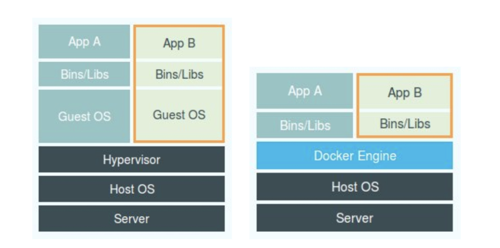

# Kubernetes

## 1、容器

### 1.1 容器基础--进程

- 容器技术的兴起源于 PaaS 技术的普及；
- Docker 公司发布的 Docker 项目具有里程碑式的意义；
- Docker 项目通过“容器镜像”，解决了应用打包这个根本性难题。

一旦一个“程序”被执行起来，它就从磁盘上的二进制文件，变成了计算机内存中的数据、寄存器里的值、堆栈中的指令、被打开的文件，以及各种设备的状态信息的一个集合。**像这样一个程序运行起来后的计算机执行环境的总和，就是我们今天的主角：进程。**

所以，对于进程来说，它的静态表现就是程序，平常都安安静静地待在磁盘上；而一旦运行起来，它就变成了计算机里的数据和状态的总和，这就是它的动态表现。**而容器技术的核心功能，就是通过约束和修改进程的动态表现，从而为其创造出一个“边界”。**

对于 Docker 等大多数 Linux 容器来说，Cgroups 技术是用来制造约束的主要手段，而 Namespace 技术则是用来修改进程视图的主要方法。Linux 容器基础的两种技术：

Namespace 和 Cgroup，容器的本质是一种特殊的进程。

Namespace作用是隔离，进程只能看到该Namespace内的世界，而Cgroups的作用是限制。

每当我们在宿主机上运行了一个 /bin/sh 程序，操作系统都会给它分配一个进程编号，比如 PID=100。这个编号是进程的唯一标识，就像员工的工牌一样。所以 PID=100，可以粗略地理解为这个 /bin/sh 是我们公司里的第 100 号员工。而现在，我们要通过 Docker 把这个 /bin/sh 程序运行在一个容器当中。这时候，Docker 就会在这个第 100 号员工入职时给他施一个“障眼法”，让他永远看不到前面的其他 99 个员工。这样，他就会错误地以为自己就是公司里的第 1 号员工。

这种机制，其实就是对被隔离应用的进程空间做了手脚，使得这些进程只能看到重新计算过的进程编号，比如 PID=1。可实际上，他们在宿主机的操作系统里，还是原来的第 100 号进程。**这种技术，就是 Linux 里面的 Namespace 机制。**而 Namespace 的使用方式也非常有意思：它其实只是 Linux 创建新进程的一个可选参数。我们知道，在 Linux 系统中创建线程的系统调用是 clone()，比如：

~~~c
int pid = clone(main_function, stack_size, SIGCHLD, NULL); 
~~~

这个系统调用就会为我们创建一个新的进程，并且返回它的进程号 pid。而当我们用 clone() 系统调用创建一个新进程时，就可以在参数中指定 CLONE_NEWPID 参数，比如：

~~~c
int pid = clone(main_function, stack_size, CLONE_NEWPID | SIGCHLD, NULL); 
~~~

这时，新创建的这个进程将会“看到”一个全新的进程空间，在这个进程空间里，它的 PID 是 1。之所以说“看到”，是因为这只是一个“障眼法”，在宿主机真实的进程空间里，这个进程的 PID 还是真实的数值，比如 100。

除了我们刚刚用到的 PID Namespace，Linux 操作系统还提供了**Mount、UTS、IPC、Network 和 User ** 这些 Namespace，用来对各种不同的进程上下文进行“障眼法”操作。比如，Mount Namespace，用于让被隔离进程只看到当前 Namespace 里的挂载点信息；Network Namespace，用于让被隔离进程看到当前 Namespace 里的网络设备和配置。这，就是 Linux 容器最基本的实现原理了。

所以，Docker 容器这个听起来玄而又玄的概念，实际上是在创建容器进程时，指定了这个进程所需要启用的一组 Namespace 参数。这样，容器就只能“看”到当前 Namespace 所限定的资源、文件、设备、状态，或者配置。而对于宿主机以及其他不相关的程序，它就完全看不到了。所以说**所以说，容器，其实是一种特殊的进程而已。**

### 1.2 容器基础，隔离与限制

#### 1.2.1 先说隔离

Namespace 技术实际上修改了应用进程看待整个计算机“视图”，即它的“视线”被操作系统做了限制，只能“看到”某些指定的内容。但对于宿主机来说，这些被“隔离”了的进程跟其他进程并没有太大区别。下图是虚拟机与Docker的区别：

对比上图，我们发现：使用虚拟化技术作为应用沙盒，就必须要由 Hypervisor 来负责创建虚拟机，这个虚拟机是真实存在的，并且它里面必须运行一个完整的 Guest OS 才能执行用户的应用进程。这就不可避免地带来了额外的资源消耗和占用。

根据实验，一个运行着 CentOS 的 KVM 虚拟机启动后，在不做优化的情况下，虚拟机自己就需要占用 100~200 MB 内存。此外，用户应用运行在虚拟机里面，它对宿主机操作系统的调用就不可避免地要经过虚拟化软件的拦截和处理，这本身又是一层性能损耗，尤其对计算资源、网络和磁盘 I/O 的损耗非常大。

而相比之下，容器化后的用户应用，却依然还是一个宿主机上的普通进程，这就意味着这些因为虚拟化而带来的性能损耗都是不存在的；而另一方面，使用 Namespace 作为隔离手段的容器并不需要单独的 Guest OS，这就使得容器额外的资源占用几乎可以忽略不计。

所以说，**“敏捷”和“高性能”是容器相较于虚拟机最大的优势，也是它能够在 PaaS 这种更细粒度的资源管理平台上大行其道的重要原因**。不过，有利就有弊，基于 Linux Namespace 的隔离机制相比于虚拟化技术也有很多不足之处，其中最主要的问题就是：**隔离得不彻底。**

1. 首先，既然容器只是运行在宿主机上的一种特殊的进程，那么多个容器之间使用的就还是同一个宿主机的操作系统内核。尽管你可以在容器里通过 Mount Namespace 单独挂载其他不同版本的操作系统文件，比如 CentOS 或者 Ubuntu，但这并不能改变共享宿主机内核的事实。这意味着，如果你要在 Windows 宿主机上运行 Linux 容器，或者在低版本的 Linux 宿主机上运行高版本的 Linux 容器，都是行不通的。
2. 其次，在 Linux 内核中，有很多资源和对象是不能被 Namespace 化的，最典型的例子就是：时间。这就意味着，如果你的容器中的程序使用 settimeofday(2) 系统调用修改了时间，整个宿主机的时间都会被随之修改，这显然不符合用户的预期。相比于在虚拟机里面可以随便折腾的自由度，在容器里部署应用的时候，“什么能做，什么不能做”，就是用户必须考虑的一个问题。

#### 1.2.2 限制

虽然容器内的第 1 号进程在“障眼法”的干扰下只能看到容器里的情况，但是宿主机上，它作为第 100 号进程与其他所有进程之间依然是平等的竞争关系。这就意味着，虽然第 100 号进程表面上被隔离了起来，但是它所能够使用到的资源（比如 CPU、内存），却是可以随时被宿主机上的其他进程（或者其他容器）占用的。当然，这个 100 号进程自己也可能把所有资源吃光。这些情况，显然都不是一个“沙盒”应该表现出来的合理行为。

而 **Linux Cgroups 就是 Linux 内核中用来为进程设置资源限制的一个重要功能。**Linux Cgroups 的全称是 Linux Control Group。它最主要的作用，就是限制一个进程组能够使用的资源上限，包括 CPU、内存、磁盘、网络带宽等等。此外，Cgroups 还能够对进程进行优先级设置、审计，以及将进程挂起和恢复等操作。

在 Linux 中，Cgroups 给用户暴露出来的操作接口是文件系统，即它以文件和目录的方式组织在操作系统的 /sys/fs/cgroup 路径下。在 Ubuntu 16.04 机器里，我可以用 mount 指令把它们展示出来，这条命令是：

~~~shell
$ mount -t cgroup
cpuset on /sys/fs/cgroup/cpuset type cgroup (rw,nosuid,nodev,noexec,relatime,cpuset)cpu on /sys/fs/cgroup/cpu type cgroup (rw,nosuid,nodev,noexec,relatime,cpu)cpuacct on /sys/fs/cgroup/cpuacct type cgroup (rw,nosuid,nodev,noexec,relatime,cpuacct)blkio on /sys/fs/cgroup/blkio type cgroup (rw,nosuid,nodev,noexec,relatime,blkio)memory on /sys/fs/cgroup/memory type cgroup (rw,nosuid,nodev,noexec,relatime,memory)...
~~~

可以看到，在 /sys/fs/cgroup 下面有很多诸如 cpuset、cpu、 memory 这样的子目录，也叫子系统。这些都是我这台机器当前可以被 Cgroups 进行限制的资源种类。而在子系统对应的资源种类下，你就可以看到该类资源具体可以被限制的方法。比如，对 CPU 子系统来说，我们就可以看到如下几个配置文件，这个指令是：

~~~shell
$ ls /sys/fs/cgroup/cpu
cgroup.clone_children cpu.cfs_period_us cpu.rt_period_us  cpu.shares notify_on_release
cgroup.procs      cpu.cfs_quota_us  cpu.rt_runtime_us cpu.stat  tasks
~~~

如果熟悉 Linux CPU 管理的话，你就会在它的输出里注意到 cfs_period 和 cfs_quota 这样的关键词。这两个参数需要组合使用，可以用来限制进程在长度为 cfs_period 的一段时间内，只能被分配到总量为 cfs_quota 的 CPU 时间。

而这样的配置文件又如何使用呢？你需要在对应的子系统下面创建一个目录，比如，我们现在进入 /sys/fs/cgroup/cpu 目录下：

~~~shell
root@ubuntu:/sys/fs/cgroup/cpu$ mkdir container
root@ubuntu:/sys/fs/cgroup/cpu$ ls container/
cgroup.clone_children cpu.cfs_period_us cpu.rt_period_us  cpu.shares notify_on_release
cgroup.procs      cpu.cfs_quota_us  cpu.rt_runtime_us cpu.stat  tasks
~~~

这个目录就称为一个“控制组”。你会发现，操作系统会在你新创建的 container 目录下，自动生成该子系统对应的资源限制文件。现在，我们在后台执行这样一条脚本：

~~~shell
$ while : ; do : ; done &
[1] 226
~~~

显然，它执行了一个死循环，可以把计算机的 CPU 吃到 100%，根据它的输出，我们可以看到这个脚本在后台运行的进程号（PID）是 226。这样，我们可以用 top 指令来确认一下 CPU 有没有被打满：

~~~shell
$ top
%Cpu0 :100.0 us, 0.0 sy, 0.0 ni, 0.0 id, 0.0 wa, 0.0 hi, 0.0 si, 0.0 st
~~~

而此时，我们可以通过查看 container 目录下的文件，看到 container 控制组里的 CPU quota 还没有任何限制（即：-1），CPU period 则是默认的 100 ms（100000 us）：

~~~shell
$ cat /sys/fs/cgroup/cpu/container/cpu.cfs_quota_us 
-1
$ cat /sys/fs/cgroup/cpu/container/cpu.cfs_period_us 
100000
~~~

接下来，我们可以通过修改这些文件的内容来设置限制。比如，向 container 组里的 cfs_quota 文件写入 20 ms（20000 us）：

~~~shell
$ echo 20000 > /sys/fs/cgroup/cpu/container/cpu.cfs_quota_us
~~~

它意味着在每 100 ms 的时间里，被该控制组限制的进程只能使用 20 ms 的 CPU 时间，也就是说这个进程只能使用到 20% 的 CPU 带宽。接下来，我们把被限制的进程的 PID 写入 container 组里的 tasks 文件，上面的设置就会对该进程生效了：

~~~shell
$ echo 226 > /sys/fs/cgroup/cpu/container/tasks 
//再来top一下
$ top
%Cpu0 : 20.3 us, 0.0 sy, 0.0 ni, 79.7 id, 0.0 wa, 0.0 hi, 0.0 si, 0.0 st
~~~

可以看到，计算机的 CPU 使用率立刻降到了 20%（%Cpu0 : 20.3 us）。除 CPU 子系统外，Cgroups 的每一个子系统都有其独有的资源限制能力，比如：

- blkio，为块设备设定I/O 限制，一般用于磁盘等设备；
- cpuset，为进程分配单独的 CPU 核和对应的内存节点；
- memory，为进程设定内存使用的限制。

Linux Cgroups 的设计还是比较易用的，简单粗暴地理解呢，它就是一个子系统目录加上一组资源限制文件的组合。而对于 Docker 等 Linux 容器项目来说，它们只需要在每个子系统下面，为每个容器创建一个控制组（即创建一个新目录），然后在启动容器进程之后，把这个进程的 PID 填写到对应控制组的 tasks 文件中就可以了。

而至于在这些控制组下面的资源文件里填上什么值，就靠用户执行 docker run 时的参数指定了，比如这样一条命令：

~~~shell
$ docker run -it --cpu-period=100000 --cpu-quota=20000 ubuntu /bin/bash
~~~

在启动这个容器后，我们可以通过查看 Cgroups 文件系统下，CPU 子系统中，“docker”这个控制组里的资源限制文件的内容来确认：

~~~shell
$ cat /sys/fs/cgroup/cpu/docker/5d5c9f67d/cpu.cfs_period_us 
100000
$ cat /sys/fs/cgroup/cpu/docker/5d5c9f67d/cpu.cfs_quota_us 
20000
~~~

这就意味着这个 Docker 容器，只能使用到 20% 的 CPU 带宽。

容器中一个非常重要的概念：**容器是一个“单进程”模型。**由于一个容器的本质就是一个进程，用户的应用进程实际上就是容器里 PID=1 的进程，也是其他后续创建的所有进程的父进程。这就意味着，在一个容器中，你没办法同时运行两个不同的应用，除非你能事先找到一个公共的 PID=1 的程序来充当两个不同应用的父进程，这也是为什么很多人都会用 systemd 或者 supervisord 这样的软件来代替应用本身作为容器的启动进程。

#### 1.2.3 容器镜像

默认情况下，容器里的进程看到的文件系统，是跟宿主机一样的，除非在容器进程执行前重新挂载目录。例如下面的例子：

~~~c
#define _GNU_SOURCE
#include <sys/mount.h> 
#include <sys/types.h>
#include <sys/wait.h>
#include <stdio.h>
#include <sched.h>
#include <signal.h>
#include <unistd.h>
#define STACK_SIZE (1024 * 1024)
static char container_stack[STACK_SIZE];
char* const container_args[] = {
  "/bin/bash",
  NULL
};

int container_main(void* arg)
{  
  printf("Container - inside the container!\n");
  execv(container_args[0], container_args);
  printf("Something's wrong!\n");
  return 1;
}

int main()
{
  printf("Parent - start a container!\n");
  int container_pid = clone(container_main, container_stack+STACK_SIZE, CLONE_NEWNS | SIGCHLD , NULL);
  waitpid(container_pid, NULL, 0);
  printf("Parent - container stopped!\n");
  return 0;
}
~~~

这段代码的功能非常简单：在 main 函数里，我们通过 clone() 系统调用创建了一个新的子进程 container_main，并且声明要为它启用 Mount Namespace（即：CLONE_NEWNS 标志）。而这个子进程执行的，是一个“/bin/bash”程序，也就是一个 shell。所以这个 shell 就运行在了 Mount Namespace 的隔离环境中。编译后运行：

~~~shell
$ gcc -o ns ns.c
$ ./ns
Parent - start a container!
Container - inside the container!
~~~

这样，我们就进入了这个“容器”当中。可是，如果在“容器”里执行一下 ls 指令的话，我们就会发现一个有趣的现象： /tmp 目录下的内容跟宿主机的内容是一样的。也就是说：即使开启了 Mount Namespace，容器进程看到的文件系统也跟宿主机完全一样。这是因为，**Mount Namespace 修改的，是容器进程对文件系统“挂载点”的认知。**这也就意味着，只有在“挂载”这个操作发生之后，进程的视图才会被改变。而在此之前，新创建的容器会直接继承宿主机的各个挂载点。

针对上述问题的解决办法，我们可以创建新进程时，除了声明要启用 Mount Namespace 之外，我们还可以告诉容器进程，有哪些目录需要重新挂载，就比如这个 /tmp 目录。于是，我们在容器进程执行前可以添加一步重新挂载 /tmp 目录的操作：

~~~c

int container_main(void* arg)
{
  printf("Container - inside the container!\n");
  // 如果你的机器的根目录的挂载类型是shared，那必须先重新挂载根目录
  // mount("", "/", NULL, MS_PRIVATE, "");
  mount("none", "/tmp", "tmpfs", 0, "");//新加代码
  execv(container_args[0], container_args);
  printf("Something's wrong!\n");
  return 1;
}
~~~

修改之后，再次执行，/tmp变成了一个空目录，这意味着重新挂载生效了。我们可以用 mount -l 检查一下：

~~~c
$ mount -l | grep tmpfs
none on /tmp type tmpfs (rw,relatime)
~~~

可以看到，容器里的 /tmp 目录是以 tmpfs 方式单独挂载的。更重要的是，因为我们创建的新进程启用了 Mount Namespace，所以这次重新挂载的操作，只在容器进程的 Mount Namespace 中有效。如果在宿主机上用 mount -l 来检查一下这个挂载，你会发现它是不存在的：

~~~shell
# 在宿主机上
$ mount -l | grep tmpfs
~~~

**这就是 Mount Namespace 跟其他 Namespace 的使用略有不同的地方：它对容器进程视图的改变，一定是伴随着挂载操作（mount）才能生效。**

普通用户，如果想要每当创建一个新容器时，我希望容器进程看到的文件系统就是一个独立的隔离环境，而不是继承自宿主机的文件系统，我们可以在容器进程启动之前重新挂载它的整个根目录“/”。而由于 Mount Namespace 的存在，这个挂载对宿主机不可见，所以容器进程就可以在里面随便折腾了。

在 Linux 操作系统里，有一个名为 chroot 的命令可以帮助你在 shell 中方便地完成这个工作。顾名思义，它的作用就是帮你“change root file system”，即改变进程的根目录到你指定的位置。它的用法也非常简单。假设，我们现在有一个 $HOME/test 目录，想要把它作为一个 /bin/bash 进程的根目录。首先，创建一个 test 目录和几个 lib 文件夹：

~~~shell
$ mkdir -p $HOME/test
$ mkdir -p $HOME/test/{bin,lib64,lib}
$ cd $T
~~~

然后，把 bash 命令拷贝到 test 目录对应的 bin 路径下：

~~~shell
$ cp -v /bin/{bash,ls} $HOME/test/bin
~~~

接下来，把 bash 命令需要的所有 so 文件，也拷贝到 test 目录对应的 lib 路径下。找到 so 文件可以用 ldd 命令：

~~~shell
$ T=$HOME/test
$ list="$(ldd /bin/ls | egrep -o '/lib.*\.[0-9]')"
$ for i in $list; do cp -v "$i" "${T}${i}"; done
~~~

最后，执行 chroot 命令，告诉操作系统，我们将使用 $HOME/test 目录作为 /bin/bash 进程的根目录：

~~~shell
$ chroot $HOME/test /bin/bash
~~~

这时，你如果执行 "ls /"，就会看到，它返回的都是\$HOME/test 目录下面的内容，而不是宿主机的内容。更重要的是，对于被 chroot 的进程来说，它并不会感受到自己的根目录已经被“修改”成 $HOME/test 了。这种视图修改的原理，跟之前的Linux Namespace雷同。

**实际上，Mount Namespace 正是基于对 chroot 的不断改良才被发明出来的，它也是 Linux 操作系统里的第一个 Namespace。**

当然，为了能够让容器的这个根目录看起来更“真实”，我们一般会在这个容器的根目录下挂载一个完整操作系统的文件系统，比如 Ubuntu16.04 的 ISO。这样，在容器启动之后，我们在容器里通过执行 "ls /" 查看根目录下的内容，就是 Ubuntu 16.04 的所有目录和文件。**而这个挂载在容器根目录上、用来为容器进程提供隔离后执行环境的文件系统，就是所谓的“容器镜像”。它还有一个更为专业的名字，叫作：rootfs（根文件系统）。**

所以，一个最常见的 rootfs，或者说容器镜像，会包括如下所示的一些目录和文件，比如 /bin，/etc，/proc 等等：

~~~shell
$ ls /
bin dev etc home lib lib64 mnt opt proc root run sbin sys tmp usr var
~~~

而你进入容器之后执行的 /bin/bash，就是 /bin 目录下的可执行文件，与宿主机的 /bin/bash 完全不同。现在，你应该可以理解，对 Docker 项目来说，它最核心的原理实际上就是为待创建的用户进程：

1. 启用 Linux Namespace 配置；
2. 设置指定的Cgroups参数；
3. 切换进程的根目录（Change Root）。

这样，一个完整的容器就诞生了。不过，Docker 项目在最后一步的切换上会优先使用 pivot_root 系统调用，如果系统不支持，才会使用 chroot。另外，需要明确的是，**rootfs 只是一个操作系统所包含的文件、配置和目录，并不包括操作系统内核。在 Linux 操作系统中，这两部分是分开存放的，操作系统只有在开机启动时才会加载指定版本的内核镜像。**

所以说，rootfs 只包括了操作系统的“躯壳”，并没有包括操作系统的“灵魂”。那么，对于容器来说，这个操作系统的“灵魂”又在哪里呢？实际上，同一台机器上的所有容器，都共享宿主机操作系统的内核。这就意味着，**如果你的应用程序需要配置内核参数、加载额外的内核模块，以及跟内核进行直接的交互，你就需要注意了：这些操作和依赖的对象，都是宿主机操作系统的内核，它对于该机器上的所有容器来说是一个“全局变量”，牵一发而动全身。**

不过，正是由于 rootfs 的存在，容器才有了一个被反复宣传至今的重要特性：**一致性。**由于 rootfs 里打包的不只是应用，而是整个操作系统的文件和目录，也就意味着，应用以及它运行所需要的所有依赖，都被封装在了一起。

Docker 公司在实现 Docker 镜像时并没有沿用以前制作 rootfs 的标准流程，而是做了一个小小的创新：Docker 在镜像的设计中，引入了层（layer）的概念。也就是说，用户制作镜像的每一步操作，都会生成一个层，也就是一个增量 rootfs。当然，这个想法不是凭空臆造出来的，而是用到了一种叫作联合文件系统（Union File System）的能力。

Union File System 也叫 UnionFS，最主要的功能是将多个不同位置的目录联合挂载（union mount）到同一个目录下。比如，我现在有两个目录 A 和 B，它们分别有两个文件：

~~~shell
$ tree
.
├── A
│  ├── a
│  └── x
└── B
  ├── b
  └── x
~~~

然后，我使用联合挂载的方式，将这两个目录挂载到一个公共的目录 C 上：

~~~shell
$ mkdir C
$ mount -t aufs -o dirs=./A:./B none ./C
~~~

这时，我再查看目录 C 的内容，就能看到目录 A 和 B 下的文件被合并到了一起：

~~~shell
$ tree ./C
./C
├── a
├── b
└── x
~~~

可以看到，在这个合并后的目录 C 里，有 a、b、x 三个文件，并且 x 文件只有一份。这，就是“合并”的含义。此外，如果你在目录 C 里对 a、b、x 文件做修改，这些修改也会在对应的目录 A、B 中生效。

Docker镜像中会分成好几层，上面的读写层通常也称为容器层，下面的只读层称为镜像层，所有的增删查改操作都只会作用在容器层，相同的文件上层会覆盖掉下层。知道这一点，就不难理解镜像文件的修改，比如修改一个文件的时候，首先会从上到下查找有没有这个文件，找到，就复制到容器层中，修改，修改的结果就会作用到下层的文件，这种方式也被称为copy-on-write。读写层和镜像层之间，还会有Init层。

Init 层是 Docker 项目单独生成的一个内部层，专门用来存放 /etc/hosts、/etc/resolv.conf 等信息。需要这样一层的原因是，这些文件本来属于只读的 Ubuntu 镜像的一部分，但是用户往往需要在启动容器时写入一些指定的值比如 hostname，所以就需要在可读写层对它们进行修改。可是，这些修改往往只对当前的容器有效，我们并不希望执行 docker commit 时，把这些信息连同可读写层一起提交掉。所以，Docker 做法是，在修改了这些文件之后，以一个单独的层挂载了出来。而用户执行 docker commit 只会提交可读写层，所以是不包含这些内容的。

Kubernetes Master:

API Server 、Scheduler、Controller、etcd

