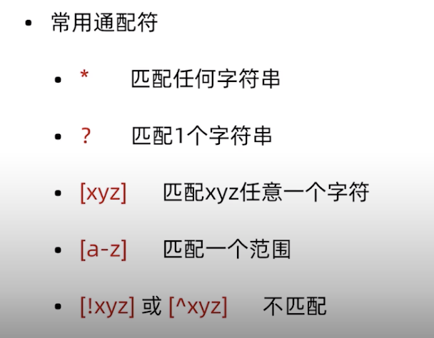
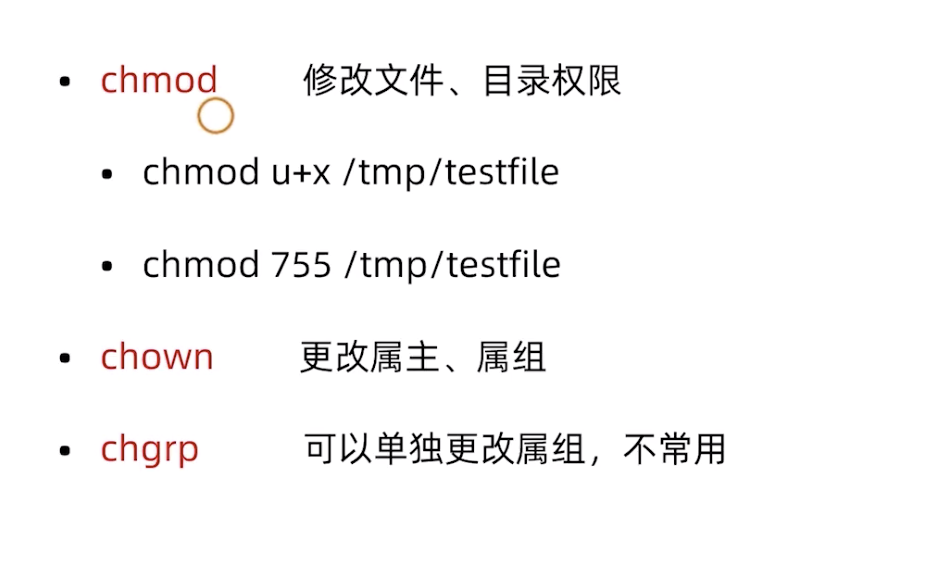
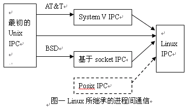
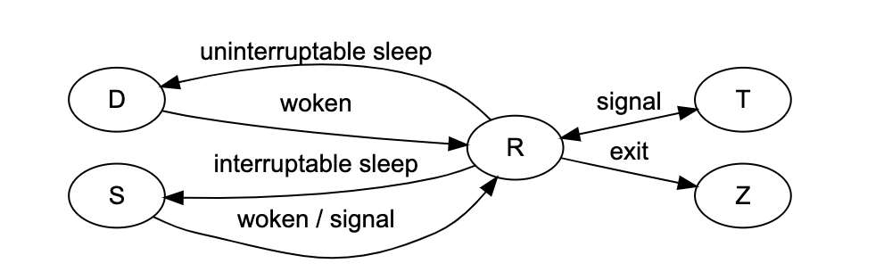
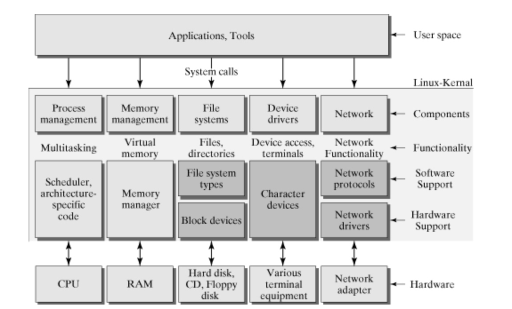

进入Terminal终端：

1、快捷键： Ctrl+Alt+T

2、点击Dash Home 输入Te

root用户切换到普通用户：su - username

普通用户切换到root用户：su -

切换到root用户，然后启动 启用，禁用防火墙

systemctl start/enable/status/stop/disable/ firewalld

systemctl mask/unmask firewalld

VIM

定位到目录  vim 文件名   进入编辑模式

输入 i  进入编辑模式 可以输入，输入完成之后按esc  退出编辑 Shift+：，然后wq  保存

cat 文件名 打开文件、

1， cat :由第一行开始显示文件内容；

2，tac：从最后一行开始显示，可以看出tac与cat字母顺序相反；

3，nl:显示的时候输出行号；

4，mv  xxx 目的地址

mv xxx ~/.Trash  y移到回收站

cat filename | tail -n 100 显示文件最后100行

cat filename | head -n 100 显示文件前面100行

cat filename | tail -n +100 从100行开始显示，显示100行以后的所有行

显示100行到500行

cat filename | head -n 500 | tail -n +100


查看端口：

netstat -an | grep 3306

lsof -i tcp:portnet

ps aux | grep nsq

brew services start /stop   servicename


当为[ d ]则是目录

当为[ - ]则是文件；

若是[ l ]则表示为链接文档(link file)；

若是[ b ]则表示为装置文件里面的可供储存的接口设备(可随机存取装置)；

若是[ c ]则表示为装置文件里面的串行端口设备，例如键盘、鼠标(一次性读取装置)。

读   写  执行  对应  4,2,1

systemctl is-active application.service

 安装完Tomcat后

开放8080端口给外边访问

iptables -I INPUT -p tcp --dport 80 -j ACCEPT

增加端口后重启一下系统

firewall-cmd --list-ports

查看已经开放的端口


ifconfig 网卡名称 down/up 关闭 启用网卡

ifconfig 网卡名称 192.x.x.x netmask x.x.x.x 设置IP  立即生效

nslookup 查询网址解析情况  exit退出

也可用dig 查询（Linux）

刷新dns： windows:ipconfig /flushdns

Linux：sudo /etc/init.d/nscd restart

#### VIM

##### 退出vim的快捷键，不需要进入命令编辑模式

按住shift

zz    保存退出

zq    不保存退出，q表示放弃

之所以按住shift，其实是切换大小写

#####  在命令编辑模式下：

:q 不保存退出

:q! 不保存强制退出

:wq 保存退出，w表示写入，不论是否修改，都会更改时间戳

:x     保存退出，如果内容未改，不会更改时间戳

:w !sudo tee % > /dev/null

##### :x" 和 ":wq" 的区别如下：

(1) :wq 强制性写入文件并退出（存盘并退出 write and quite）。即使文件没有被修改也强制写入，并更新文件的修改时间。

(2) :x 写入文件并退出。仅当文件被修改时才写入，并更新文件修改时间；否则不会更新文件修改时间。

rm  -参数 文件   参数R表示递归删除   -rf表示强制递归删除

tail -f xxxxx.log|grep "find"        只输出符合过滤条件的

\# tail -n20 /var/log/mail/info |head -n1  tail 重后往前 默认10条 

tail -n20 /var/log/mail/info |tee results.txt |head -n1

想要选择最后 20 行，将其保存到 results.txt，但是只在屏幕上显示这 20 行中的第一行

##### Mongo相关

命令行MongoDB：

rs.status()

show

mongo

show dbs

use dbname

db.createColldection("name")

db.collection.insert("xxxxx")

db.getCollectionNames();获取所有的Collection

db.getMongo();

然后：

db.getMongo().setSlaveOk();

Mongo 备份与还原：进入到mongo安装目录:

mongodump/mongorestore   -h 127.0.0.1:27017 -d push -o /home/xiaosiyong/mongo

 mongo --host=192.168.0.104

db.getMongo().setSlaveOk()

then show dbs

{age: {$gt: 22}}查询大于22的   排序  .sort({age:1/-1}) 顺序或者倒叙

使文件可执行：chmod +x filename

#### 查看系统配置

**1、查看CPU**

1）top 后输入1

2）cat /proc/cpuinfo|grep processor

**2、查看内存**

1）top

2）free或free -h

3）head /proc/meminfo

1、查看所有的用户信息cat /etc/passwd

2、查看所有的用户信息cat /etc/passwd|grep 用户名 查找某个用户

3、cat  /etc/group 查看所有组信息  

4、cat /etc/group|grep 组名

查看Linux内核版本命令：

cat     /proc/version

uname  -a

cat /etc/issue

**3、用户和组常用命令**

groups 查看当前登录用户的组内成员

groups test 查看test用户所在的组,以及组内成员

whoami 查看当前登录用户名

**4、环境变量**

环境变量：

/etc/profile       /etc/bashrc

 ~/.bash_profile文件 ~/.bashrc

**5、重启命令：**

1、reboot

2、shutdown -r now 立刻重启(root用户使用)

3、shutdown -r 10 过10分钟自动重启(root用户使用) 

4、shutdown -r 20:35 在时间为20:35时候重启(root用户使用)

如果是通过shutdown命令设置重启的话，可以用shutdown -c命令取消重启

**6、关机命令：**

1、halt   立刻关机

2、poweroff  立刻关机

3、shutdown -h now 立刻关机(root用户使用)

4、shutdown -h 10 10分钟后自动关机

如果是通过shutdown命令设置关机的话，可以用shutdown -c命令取消重启

mkdir -p xxx/{xx,xx}  建多层目录

df -h 查看磁盘各分区大小、已用空间等信息

du -sh foo 查看foo目录的大小

sudo yum install lrzsz

查看zookeeper 版本：echo stat|nc localhost 2181 

grep -C  10  --color=auto "DH2018121320217453-109853450"  flie   符合条件的前、后10行

grep -B  10   前10行

grep -A  10   后10行

cd ~/.ssh/ 查看rsa 公钥及私钥

**:%s/foo/bar/g** 全文替换

**:s/foo/bar/g 单行替换**

command >out.file 2>&1 &


**Close与Shutdown的区别**

close-----关闭本进程的socket id，但链接还是开着的，用这个socket id的其它进程还能用这个链接，能读或写这个socket id

shutdown--则破坏了socket 链接，读的时候可能侦探到EOF结束符，写的时候可能会收到一个SIGPIPE信号，这个信号可能直到socket buffer被填充了才收到，shutdown还有一个关闭方式的参数，0 不能再读，1不能再写，2 读写都不能。所有数据操作结束以后可以调用Close，从而停止在该socket上的所有操作。

SHutdown可以允许只停止某个方向上的数据传输，如终止读或者终止写。使用close中止一个连接，但它只是减少描述符的参考数，并不直接关闭连接，只有当描述符的参考数为0时才关闭连接。shutdown可直接关闭描述符，不考虑描述符的参考数，可选择中止一个方向的连接。

注意:

​    1>. 如果有多个进程共享一个套接字，close每被调用一次，计数减1，直到计数为0时，也就是所用进程都调用了close，套接字将被释放。

​    2>. 在多进程中如果一个进程中shutdown(sfd, SHUT_RDWR)后其它的进程将无法进行通信. 如果一个进程close(sfd)将不会影响到其它进程

**以数字的格式查看权限：stat -c %a**

root用户开启免密登录检查是否禁用了root登录， /etc/ssh/sshd_config

No Space的时候：

1.首先确定是否是磁盘空间不足  输入命令：df –h 查看磁盘信息

2.输入命令：du -h --max-depth=1 寻找当前目录，哪个文件夹占用空间最大

3.进入logs文件夹 输入命令：ls –lhS 将文件以从大到小顺序展现

#### 查看物理CPU个数
cat /proc/cpuinfo| grep "physical id"| sort| uniq| wc -l
#### 查看每个物理CPU中core的个数(即核数)
cat /proc/cpuinfo| grep "cpu cores"| uniq
#### 查看逻辑CPU的个数
cat /proc/cpuinfo| grep "processor"| wc -l
#### 查看线程数      
 grep 'processor'        /proc/cpuinfo | sort -u | wc -l  


#### 日志查找、去重
原内容`{“err_code”： 200，"err_msg"： "this is no error"， “status”： 1， “dev_name”： “mylinux”， “dev_id”： 123}`

如果想要获取dev_id的值，可以用如下命令：

cat example.txt | sed 's/,/\n/g' | grep "dev_id" | sed 's/:/\n/g' | sed '1d' | sed 's/}//g'

1）第一个sed命令的意思是将json数据中的“，”替换为换行符“\n”，这样该串数据就变为每一行一个字段的内容，即按逗号分隔数据串。

2）第二个grep命令的意思是查找“dev_id”关键字，并单列出来。

3）第三个sed命令的意思是将（2）中的结果再次按冒号“：”进行分隔。

4）第四个sed命令的意思是将（3）中的结果，删除第一行内容，即删除“dev_id”行。

5）最后一个sed命令的意思是将最后的花括号“}”用空字符替换，最终得到我们想要的值。

tail -10000  data-sync.log | grep error |sed 's/,/\n/g' |grep 'resource.id'|uniq

### 系统操作篇

1. man帮助  一共9章，例如：man ls 可以获取相关帮助，不知道哪一章时可以-a 

2. help空格+命令（内部命令）     或者命令空格--help （外部命令）

3. Type +command 显示是内部命令还是外部命令

4. info帮助比help更详细，info ls

5. ls详解

6. cd - 回到之前操作的目录

7. 文件通配符

8. 查看文件

9. 修改权限

10. touch filename 创建空白文件

11. w 或者uptime查看负载， Linux的负载高，主要是由于CPU使用、内存使用、IO消耗三部分构成。任意一项使用过多，都将导致服务器负载的急剧攀升。查看服务器负载有多种命令，w或者uptime都可以直接展示负载，**load average分别对应于过去1分钟，5分钟，15分钟的负载平均值。**

    $ uptime
     12:20:30 up 44 days, 21:46,  2 users,  load average: 8.99, 7.55, 5.40

    $ w
     12:22:02 up 44 days, 21:48,  2 users,  load average: 3.96, 6.28, 5.16

12. Top 命令查看负载 Tasks行展示了目前的进程总数及所处状态，要注意zombie，表示僵尸进程，不为0则表示有进程出现问题。Cpu(s)行展示了当前CPU的状态，us表示用户进程占用CPU比例，sy表示内核进程占用CPU比例，id表示空闲CPU百分比，wa表示IO等待所占用的CPU时间的百分比。wa占用超过30%则表示IO压力很大。Mem行展示了当前内存的状态，total是总的内存大小，userd是已使用的，free是剩余的，buffers是目录缓存。Swap行同Mem行，cached表示缓存，用户已打开的文件。如果Swap(交换分区，相当于windows中的虚拟内存)的used很高，则表示系统内存不足。

13. **io 监控**   iostat -x 1 10命令，表示开始监控输入输出状态，-x表示显示所有参数信息，1表示每隔1秒监控一次，10表示共监控10次。  

### 进程间通信（Inter-Process Communication）

inux下的进程通信手段基本上是从Unix平台上的进程通信手段继承而来的。而对Unix发展做出重大贡献的两大主力AT&T的贝尔实验室及BSD（加州大学伯克利分校的伯克利软件发布中心）在进程间通信方面的侧重点有所不同。前者对Unix早期的进程间通信手段进行了系统的改进和扩充，形成了“system V IPC”，通信进程局限在单个计算机内；后者则跳过了该限制，形成了基于套接口（socket）的进程间通信机制。Linux则把两者继承了下来，如图示：

进程通信有如下一些目的：

- 数据传输：一个进程需要将它的数据发送给另一个进程，发送的数据量在一个字节到几M字节之间
- 共享数据：多个进程想要操作共享数据，一个进程对共享数据的修改，别的进程应该立刻看到。
- 通知事件：一个进程需要向另一个或一组进程发送消息，通知它（它们）发生了某种事件（如进程终止时要通知父进程）。
- 资源共享：多个进程之间共享同样的资源。为了作到这一点，需要内核提供锁和同步机制。
- 进程控制：有些进程希望完全控制另一个进程的执行（如Debug进程），此时控制进程希望能够拦截另一个进程的所有陷入和异常，并能够及时知道它的状态改变。

Linux 进程间通信（IPC）以下以几部分发展而来：早期UNIX进程间通信（管道、FIFO、信号）、基于System V进程间通信（System V消息队列、System V信号灯、System V共享内存）、基于Socket进程间通信和POSIX进程间通信（posix消息队列、posix信号灯、posix共享内存）。

1、无名管道

管道是单向的、先进先出的、无结构的、固定大小的字节流，它把一个进程的标准输出和另一个进程的标准输入连接在一起。写进程在管道的尾端写入数据，读进程在管道的道端读出数据。数据读出后将从管道中移走，其它读进程都不能再读到这些数据。管道提供了简单的流控制机制。进程试图读空管道时，在有数据写入管道前，进程将一直阻塞。同样，管道已经满时，进程再试图写管道，在其它进程从管道中移走数据之前，写进程将一直阻塞。管道主要用于不同进程（只能用于父子进程或者兄弟进程之间<**具有亲缘关系的进程**>）间通信。管道单独构成一种独立的文件系统：对于管道两端的进程而言，就是一个文件，但它不是普通的文件，它不属于某种文件系统，而是自立门户，单独构成一种文件系 统，并且只存在与内存中。管道两端可 分别用描述字fd[0]以及fd[1]来描述，需要注意的是，管道的两端是固定了任务的。即一端只能用于读，由描述字fd[0]表示，称其为管道读端；另 一端则只能用于写，由描述字fd[1]来表示，称其为管道写端。如果试图从管道写端读取数据，或者向管道读端写入数据都将导致错误发生。

创建一个简单的管道，可以使用系统调用pipe()。它接受一个参数，也就是一个包括两个整数的数组。如果系统调用成功，此数组将包括管道使用的两个文件描述符。创建一个管道之后，一般情况下进程将产生一个新的进程。代码如下所示：

~~~c
#include<stdio.h>
#include<stdlib.h>
#include<errno.h>
#include<string.h>

#define N 10
#define MAX 100

int child_read_pipe(int fd){
    char buf[N];
    int n =0;
    while(1){
        n = read(fd,buf,sizeof(buf));
        buf[n]='\0';
        printf("Read %d bytes: %s.\n",n,buf);
        if(strncmp(buf,"quit",4)==0)
            break;
    }
    return 0;
}

int father_write_pipe(int fd){
    char buf[MAX]={0};
    while(1){
        printf(">");
        fgets(buf,sizeof(buf),stdin);
        buf[strlen(buf)-1]='\0';
        write(fd,buf,strlen(buf));
        usleep(500);
        if(strncmp(buf,"quit",4)==0)
            break;
    }
    return 0;
}

int main(){
    int pid;
    int fd[2];
    if(pipe(fd)<0){//父进程创建管道
        perror("Fail to pipe");
        exit(EXIT_FAILURE);
    }
    if((pid=fork())<0){
        perror("Fail to fork");
        exit(EXIT_FAILURE);
    }else if(pid == 0){
        close(fd[1]);
        child_read_pipe(fd[0]);//子进程读取管道
    }else{
        close(fd[0]);
        father_write_pipe(fd[1]);//父进程写入管道
    }
}
~~~

2、 有名管道

有名管道的使用方式与无名管道不同。有名管道可被任何知道名字的进程打开和使用，为了使用有名管道，进程药建立它，并与他的一段相连。创建有名管道的进程叫做服务器进程，存取管道的其他进程叫客户进程。通信双方必须首先创建有名管道后，才能打开进行读写。当文件不再需要时，要显示删除。

在Linux系统下，有名管道可由两种方式创建：命令行方式mknod系统调用和函数mkfifo。下面的两种途径都在当前目录下生成了一个名为myfifo的有名管道：

- 方式一：mkfifo("myfifo","rw");
- 方式二：mknod myfifo p

生成了有名管道后，就可以使用一般的文件I/O函数如open、close、read、write等来对它进行操作

```c
/*writeFIFO.c*/
#include<stdio.h>
#include<stdlib.h>
#include<string.h>
#include<errno.h>
#include<sys/types.h>
#include<sys/stat.h>
#include<fcntl.h>

#define MAX 655360

int main(int argc,char * argv[]){
    int n,fd;
    char buf[MAX];
    if(argc<2){
        fprintf(stderr,"usage : %s argv[1].\n",argv[0]);
        exit(EXIT_FAILURE);    
    }
    if(mkfifo(argv[1],0666)<0 && errno!=EEXIST){//创建有名管道，名称是命令行第一个参数
        fprintf(stderr,"Fail to mkfifo %s : %s.\n",argv[1],strerror(errno));
        exit(EXIT_FAILURE);
    }
    if((fd=open(argv[1],O_WRONLY))<0){
        fprintf(stderr,"Fail to open %s : %s.\n",argv[1],strerror(errno));
        exit(EXIT_FAILURE);
    }
    printf("open for write success.\n");

    while(1){
        printf(">");
        scanf("%d",&n);
        n = write(fd,buf,n);//写入管道
        printf("write %d bytes.\n",n);
    }
    exit(EXIT_SUCCESS);
}
```

~~~c
#include<stdio.h>
#include<stdlib.h>
#include<string.h>
#include<errno.h>
#include<sys/types.h>
#include<sys/stat.h>
#include<fcntl.h>

#define MAX 655360

int main(int argc,char * argv[]){
    int n,fd;
    char buf[MAX];
    if(argc<2){
        fprintf(stderr,"usage : %s argv[1].\n",argv[0]);
        exit(EXIT_FAILURE);    
    }
    if(mkfifo(argv[1],0666)<0 && errno!=EEXIST){//创建有名管道，名称是命令行第一个参数
        fprintf(stderr,"Fail to mkfifo %s : %s.\n",argv[1],strerror(errno));
        exit(EXIT_FAILURE);
    }
    if((fd=open(argv[1],O_RDONLY))<0){
        fprintf(stderr,"Fail to open %s : %s.\n",argv[1],strerror(errno));
        exit(EXIT_FAILURE);
    }
    printf("open for read success.\n");

    while(1){
        printf(">");
        scanf("%d",&n);
        n = read(fd,buf,n);//读入有名管道
        printf("Read %d bytes.\n",n);
    }
    exit(EXIT_SUCCESS);
}
~~~

3、信号

进程A实现了对某个信号的处理，然后别的进程B来向进程A发送相应的信号，则A会执行相关的内容，有关信号的详细内容：**[Linux 信号通信](https://blog.csdn.net/ljianhui/article/details/10128731)**

4、消息队列

消息队列就是一个消息的链表。可以把消息看作一个记录，具有特定的格式以及特定的优先级。对消息队列有写权限的进程可以向其中按照一定的规则添加新消息；对消息队列有读权限的进程则可以从消息队列中读走消息。详细内容：**[Linux进程通信之消息队列](消息队列)**

消息队列跟命名管道有不少的相同之处，通过与命名管道一样，消息队列进行通信的进程可以是不相关的进程，同时它们都是通过发送和接收的方式来传递数据的。在命名管道中，发送数据用write，接收数据用read，则在消息队列中，发送数据用msgsnd，接收数据用msgrcv。而且它们对每个数据都有一个最大长度的限制。

与命名管道相比，消息队列的优势在于:

- 消息队列也可以独立于发送和接收进程而存在，从而消除了在同步命名管道的打开和关闭时可能产生的困难。
- 同时通过发送消息还可以避免命名管道的同步和阻塞问题，不需要由进程自己来提供同步方法。
- 接收程序可以通过消息类型有选择地接收数据，而不是像命名管道中那样，只能默认地接收。

代码示例：

~~~c
/**msgreceive.c*/
#include <unistd.h>
#include <stdlib.h>
#include <stdio.h>
#include <string.h>
#include <errno.h>
#include <sys/msg.h>

struct msg_st
{
	long int msg_type;
	char text[BUFSIZ];
};

int main()
{
	int running = 1;
	int msgid = -1;
	struct msg_st data;
	long int msgtype = 0; //注意1

	//建立消息队列
	msgid = msgget((key_t)1234, 0666 | IPC_CREAT);
	if(msgid == -1)
	{
		fprintf(stderr, "msgget failed with error: %d\n", errno);
		exit(EXIT_FAILURE);
	}
	//从队列中获取消息，直到遇到end消息为止
	while(running)
	{
		if(msgrcv(msgid, (void*)&data, BUFSIZ, msgtype, 0) == -1)
		{
			fprintf(stderr, "msgrcv failed with errno: %d\n", errno);
			exit(EXIT_FAILURE);
		}
		printf("You wrote: %s\n",data.text);
		//遇到end结束
		if(strncmp(data.text, "end", 3) == 0)
			running = 0;
	}
	//删除消息队列
	if(msgctl(msgid, IPC_RMID, 0) == -1)
	{
		fprintf(stderr, "msgctl(IPC_RMID) failed\n");
		exit(EXIT_FAILURE);
	}
	exit(EXIT_SUCCESS);
}
~~~

~~~c
/*msgsend.c*/
#include <unistd.h>
#include <stdlib.h>
#include <stdio.h>
#include <string.h>
#include <sys/msg.h>
#include <errno.h>

#define MAX_TEXT 512
struct msg_st
{
	long int msg_type;
	char text[MAX_TEXT];
};

int main()
{
	int running = 1;
	struct msg_st data;
	char buffer[BUFSIZ];
	int msgid = -1;

	//建立消息队列
	msgid = msgget((key_t)1234, 0666 | IPC_CREAT);
	if(msgid == -1)
	{
		fprintf(stderr, "msgget failed with error: %d\n", errno);
		exit(EXIT_FAILURE);
	}

	//向消息队列中写消息，直到写入end
	while(running)
	{
		//输入数据
		printf("Enter some text: ");
		fgets(buffer, BUFSIZ, stdin);
		data.msg_type = 1;    //注意2
		strcpy(data.text, buffer);
		//向队列发送数据
		if(msgsnd(msgid, (void*)&data, MAX_TEXT, 0) == -1)
		{
			fprintf(stderr, "msgsnd failed\n");
			exit(EXIT_FAILURE);
		}
		//输入end结束输入
		if(strncmp(buffer, "end", 3) == 0)
			running = 0;
		sleep(1);
	}
	exit(EXIT_SUCCESS);
}
~~~

5、共享内存

详细介绍 **[Linux进程间通信——使用共享内存](https://blog.csdn.net/ljianhui/article/details/10253345)**

demo示例：

~~~c
/*shmdata.h*/
#ifndef _SHMDATA_H_HEADER
#define _SHMDATA_H_HEADER

#define TEXT_SZ 2048

struct shared_use_st{
	int written;
	char text[TEXT_SZ];
};

#endif
~~~

~~~c
/*shmread.h 共享内存定义*/
#include <unistd.h>
#include <stdlib.h>
#include <stdio.h>
#include <sys/shm.h>
#include "shmdata.h"

int main()
{
	int running = 1;//程序是否继续运行的标志
	void *shm = NULL;//分配的共享内存的原始首地址
	struct shared_use_st *shared;//指向shm
	int shmid;//共享内存标识符
	//创建共享内存
	shmid = shmget((key_t)1234, sizeof(struct shared_use_st), 0666|IPC_CREAT);
	if(shmid == -1)
	{
		fprintf(stderr, "shmget failed\n");
		exit(EXIT_FAILURE);
	}
	//将共享内存连接到当前进程的地址空间
	shm = shmat(shmid, 0, 0);
	if(shm == (void*)-1)
	{
		fprintf(stderr, "shmat failed\n");
		exit(EXIT_FAILURE);
	}
	printf("\nMemory attached at %X\n", (int)shm);
	//设置共享内存
	shared = (struct shared_use_st*)shm;
	shared->written = 0;
	while(running)//读取共享内存中的数据
	{
		//没有进程向共享内存定数据有数据可读取
		if(shared->written != 0)
		{
			printf("You wrote: %s", shared->text);
			sleep(rand() % 3);
			//读取完数据，设置written使共享内存段可写
			shared->written = 0;
			//输入了end，退出循环（程序）
			if(strncmp(shared->text, "end", 3) == 0)
				running = 0;
		}
		else//有其他进程在写数据，不能读取数据
			sleep(1);
	}
	//把共享内存从当前进程中分离
	if(shmdt(shm) == -1)
	{
		fprintf(stderr, "shmdt failed\n");
		exit(EXIT_FAILURE);
	}
	//删除共享内存
	if(shmctl(shmid, IPC_RMID, 0) == -1)
	{
		fprintf(stderr, "shmctl(IPC_RMID) failed\n");
		exit(EXIT_FAILURE);
	}
	exit(EXIT_SUCCESS);
}
~~~

~~~c
/*shmwrite.c*/

#include <unistd.h>
#include <stdlib.h>
#include <stdio.h>
#include <string.h>
#include <sys/shm.h>
#include "shmdata.h"

int main()
{
	int running = 1;
	void *shm = NULL;
	struct shared_use_st *shared = NULL;
	char buffer[BUFSIZ + 1];//用于保存输入的文本
	int shmid;
	//创建共享内存
	shmid = shmget((key_t)1234, sizeof(struct shared_use_st), 0666|IPC_CREAT);
	if(shmid == -1)
	{
		fprintf(stderr, "shmget failed\n");
		exit(EXIT_FAILURE);
	}
	//将共享内存连接到当前进程的地址空间
	shm = shmat(shmid, (void*)0, 0);
	if(shm == (void*)-1)
	{
		fprintf(stderr, "shmat failed\n");
		exit(EXIT_FAILURE);
	}
	printf("Memory attached at %X\n", (int)shm);
	//设置共享内存
	shared = (struct shared_use_st*)shm;
	while(running)//向共享内存中写数据
	{
		//数据还没有被读取，则等待数据被读取,不能向共享内存中写入文本
		while(shared->written == 1)
		{
			sleep(1);
			printf("Waiting...\n");
		}
		//向共享内存中写入数据
		printf("Enter some text: ");
		fgets(buffer, BUFSIZ, stdin);
		strncpy(shared->text, buffer, TEXT_SZ);
		//写完数据，设置written使共享内存段可读
		shared->written = 1;
		//输入了end，退出循环（程序）
		if(strncmp(buffer, "end", 3) == 0)
			running = 0;
	}
	//把共享内存从当前进程中分离
	if(shmdt(shm) == -1)
	{
		fprintf(stderr, "shmdt failed\n");
		exit(EXIT_FAILURE);
	}
	sleep(2);
	exit(EXIT_SUCCESS);
}
~~~

6、信号量

IPC中信号量和信号的关系就像雷锋和雷锋塔的关系一样，那就是基本没关系。详细介绍：**[Linux进程间通信——使用信号量](https://blog.csdn.net/ljianhui/article/details/10243617)**

7、套接字

套接字包括流套接字和数据报套接字 详细介绍：

- **[Linux进程间通信——使用流套接字](https://blog.csdn.net/ljianhui/article/details/10477427)**
- **[Linux进程间通信--数据报套接字](Linux进程间通信——使用数据报套接字)**

各种通信方式的比较和优缺点：

- 管道：速度慢，容量有限，只有父子进程能通讯
- FIFO：任何进程间都能通讯，但速度慢
- 消息队列：容量受到系统限制，且要注意第一次读的时候，要考虑上一次没有读完数据的问题
- 信号量：不能传递复杂消息，只能用来同步
- 享内存区：能够很容易控制容量，速度快，但要保持同步，比如一个进程在写的时候，另一个进程要注意读写的问题，相当于线程中的线程安全，当然，共享内存区同样可以用作线程间通讯，不过没这个必要，线程间本来就已经共享了同一进程内的一块内存

### Linux系统中进程状态

定义：**由操作系统定义，并由操作系统所操控的一个特殊的数据结构实例叫做进程。它连接了用户代码，拥有代码运行所需的独立内存空间，在调度器的调度下使用分配给它的处理器时间片来运行。**

Linux有两类进程：**一类是普通用户进程，它既可以在用户空间运行，又可通过系统调用进入内核空间，并在内核空间运行；另一类叫做内核进程，这种进程只能在内核空间运行。**

~~~c
/*
* The task state array is a strange "bitmap" of
* reasons to sleep. Thus "running" is zero, and
* you can test for combinations of others with
* simple bit tests.
*/
static const char * const task_state_array[] = {
"R (running)",      /* 0 */正在运行 或 可运行(在运行队列排队中)
"S (sleeping)",     /* 1 */可中断睡眠(休眠中，受阻，在等待某个条件的形成或接收到信号)
"D (disk sleep)",   /* 2 */不可中断睡眠(通常是在IO操作)，收到信号不唤醒和不可运行，进程必须等待直到有中断发生
"T (stopped)",      /* 4 */暂停状态，进程收到 SIGSTOP, SIGSTP, SIGTIN, SIGTOU 信号后停止运行
"t (tracing stop)", /* 8 */跟踪状态，指的是进程暂停下来，等待跟踪它的进程对它进行操作
"X (dead)",         /* 16 */退出状态，进程即将被销毁
"Z (zombie)",       /* 32 */退出状态，进程成为僵尸进程
};
~~~

各种状态的含义：

- **运行状态（running）**，并不意味着进程一定在运行中，它表明进程要么是在运行中要么在运行队列里。
- **睡眠状态（sleeping）**，意味着进程在等待事件完成（这里的睡眠有时候也叫做可中断睡眠（interruptible sleep））。
- **磁盘休眠状态（disk sleep）**，有时候也叫不可中断睡眠状态（uninterruptible sleep），在这个状态的进程通常会等待IO的结束。
- **暂停状态（stopped）**可以通过发送 SIGSTOP 信号给进程来停止进程。这个被暂停的进程可以通过发送 SIGCONT 信号让进程继续运行。
- **跟踪状态（tracing stop）**，当进程正在被跟踪时，它处于 TASK_TRACED 这个特殊的状态。“正在被跟踪”指的是进程暂停下来，等待跟踪它的进程对它进行操作。比如在gdb中对被跟踪的进程下一个断点，进程在断点处停下来的时候就处于 TASK_TRACED 状态。而在其他时候，被跟踪的进程还是处于前面提到的那些状态。
- **死亡状态（dead）**，是内核运行 kernel/exit.c 里的 do_exit() 函数返回的状态。这个状态只是一个返回状态，你不会在任务列表里看到这个状态。
- **僵尸状态（zombie）**是一个比较特殊的状态。有些人认为这个状态是在父进程死亡而子进程存活时产生的。实际上不是这样的。父进程可能已经死了但子进程依然存活着，那个子进程的父进程将会成为init进程。当进程退出并且父进程（使用wait()系统调用）没有读取到子进程退出的返回代码时就会产生僵尸进程。僵尸进程会以终止状态保持在进程表中，并且会一直在等待父进程读取退出状态代码。

各种状态之间的转换：

### **僵尸进程**

退出一个进程用系统调用exit，但是这并不意味着该进程马上就消失了，事实上它还留下了一个被称为僵尸进程（Zombie）的数据结构。在Linux进程的5种状态中（R、S、D、T、Z），僵尸进程（Z）是非常特殊的一种，它已经放弃了几乎所有内存空间，没有任何可执行代码，也不能被调度，仅仅在进程列表中保留一个位置，记载该进程的退出状态等信息供其他进程收集，除此之外，僵尸进程不再占有任何内存空间。

出现的原因：

- 僵尸进程就是子进程已经结束，但是父进程没有处理的进程！
- 父进程可以使用 waitpid，wait4 等来处理僵尸进程！
- 如果父进程不幸在子进程之前“死了”，那么子进程就交由init(pid == 1)进程去管理

父进程还没有来得及处理子进程的退出状态等信息，所以才会有僵尸进程的出现。

#### 查看进程状态

~~~shell
ps -aux  //查看进程状态
ps -axjf //列出类似程序树的程序显示(显示进程下有哪些子进程)：
ps aux | egrep '(cron|syslog)'  //找出与 cron 与 syslog 这两个服务有关的 PID 号码
~~~

也可以这样使用ps格式输出来查看进程状态:

~~~shell
ps -eo user,stat..,cmd 
~~~

其中，stat包含：

~~~shell
user          用户名 
uid           用户号 
pid           进程号 
ppid          父进程号 
size          内存大小, Kbytes字节. 
vsize         总虚拟内存大小, bytes字节(包含code+data+stack) 
share         总共享页数 
nice          进程优先级(缺省为0, 最大为-20) 
priority(pri) 内核调度优先级 
pmem          进程分享的物理内存数的百分比 
trs           程序执行代码驻留大小 
rss           进程使用的总物理内存数, Kbytes字节 
time          进程执行起到现在总的CPU暂用时间 
stat          进程状态 
cmd(args)     执行命令的简单格式 
~~~

举个🌰：

~~~shell
ps -eo pid,stat,pri,uid --sort uid //查看当前系统进程的uid,pid,stat,pri, 以uid号排序.
ps -eo user,pid,stat,rss,args --sort rss //查看当前系统进程的user,pid,stat,rss,args, 以rss排序.
~~~

在Linux下，还有一种方法检查某个进程是否存在：利用/proc文件系统.。/proc/pid/stat里面有进程的状态,进程可执行文件名等，如果该文件不存在了，那进程肯定退出了。如果存在，可以检查状态和文件名是否正确，效率可能比PS还是高一些，因为/proc是虚拟文件系统,存在与内存中。`cat /proc/pid/status`  这里pid是你的进程ID，看看输出结果，有一栏是State。

### Linux体系结构

其体系结构如图：

从宏观上来看，Linux操作系统的体系架构分为用户态和内核态（或者用户空间和内核）。内核从本质上看是一种软件——控制计算机的硬件资源，并提供上层应用程序运行的环境。用户态即上层应用程序的活动空间，应用程序的执行必须依托于内核提供的资源，包括CPU资源、存储资源、I/O资源等。为了使上层应用能够访问到这些资源，内核必须为上层应用提供访问的接口：即系统调用。

系统调用是操作系统的最小功能单位，这些系统调用根据不同的应用场景可以进行扩展和裁剪。总结一下，用户态的应用程序可以通过三种方式来访问内核态的资源：

- 系统调用
- 库函数
- Shell脚本

下图是对上图的一个细分结构，从这个图上可以更进一步对内核所做的事有一个“全景式”的印象。主要表现为：向下控制硬件资源，向内管理操作系统资源：包括进程的调度和管理、内存的管理、文件系统的管理、设备驱动程序的管理以及网络资源的管理，向上则向应用程序提供系统调用的接口。从整体上来看，整个操作系统分为两层：用户态和内核态，这种分层的架构极大地提高了资源管理的可扩展性和灵活性，而且方便用户对资源的调用和集中式的管理，带来一定的安全性。

#### 用户态和内核态的切换

运行于用户态的进程可以执行的操作和访问的资源都会受到极大的限制，而运行在内核态的进程则可以执行任何操作并且在资源的使用上没有限制。很多程序开始时运行于用户态，但在执行的过程中，一些操作需要在内核权限下才能执行，这就涉及到一个从用户态切换到内核态的过程。比如C函数库中的内存分配函数malloc()，它具体是使用sbrk()系统调用来分配内存，当malloc调用sbrk()的时候就涉及一次从用户态到内核态的切换，类似的函数还有printf()，调用的是wirte()系统调用来输出字符串，等等。

以下三种情况下，会从用户态切换到内核态：

- 系统调用：原因如上的分析
- 异常事件： 当CPU正在执行运行在用户态的程序时，突然发生某些预先不可知的异常事件，这个时候就会触发从当前用户态执行的进程转向内核态执行相关的异常事件，典型的如缺页异常。
- 外围设备的中断：当外围设备完成用户的请求操作后，会像CPU发出中断信号，此时，CPU就会暂停执行下一条即将要执行的指令，转而去执行中断信号对应的处理程序，如果先前执行的指令是在用户态下，则自然就发生从用户态到内核态的转换。

注意：系统调用的本质其实也是中断，相对于外围设备的硬中断，这种中断称为软中断，这是操作系统为用户特别开放的一种中断，如Linux int 80h中断。所以，从触发方式和效果上来看，这三种切换方式是完全一样的，都相当于是执行了一个中断响应的过程。但是从触发的对象来看，系统调用是进程主动请求切换的，而异常和硬中断则是被动的。

#### Linux 一切皆文件

linux/unix下的哲学核心思想是‘一切皆文件’。
“一切皆文件”，指的是，对所有文件（目录、字符设备、块设备、套接字、打印机、进程、线程、管道等）操作，读写都可用fopen()/fclose()/fwrite()/fread()等函数进行处理。屏蔽了硬件的区别，所有设备都抽象成文件，提供统一的接口给用户。虽然类型各不相同，但是对其提供的却是同一套操作界面。

Linux系统中，文件具体可分为以下几种类型：

1. 普通文件	类似 mp4、pdf、html 这样，可直接拿来使用的文件都属于普通文件，Linux 用户根据访问权限的不同可以对这些文件进行查看、删除以及更改操作。
2. 目录文件  Linux 系统中，目录文件包含了此目录中各个文件的文件名以及指向这些文件的指针，打开目录等同于打开目录文件，只要你有权限，可以随意访问目录中的任何文件。
3. 字符设备文件和块设备文件 些文件通常隐藏在 /dev/ 目录下，当进行设备读取或外设交互时才会被使用。例如，磁盘光驱属于块设备文件，串口设备则属于字符设备文件。Linux 系统中的所有设备，要么是块设备文件，要么是字符设备文件。
4. 套接字文件（Socket） 套接字文件一般隐藏在 /var/run/ 目录下，用于进程间的网络通信。
5. 符号l链接文件（symbolic link）类似与 Windows 中的快捷方式，是指向另一文件的简介指针（也就是软链接）。
6. 管道文件 主要用于进程间通信。例如，使用 mkfifo 命令创建一个 FIFO 文件，与此同时，启用进程 A 从 FIFO文件读数据，启用进程 B 从 FIFO文件中写数据，随写随读。

这样做最明显的好处是，开发者仅需要使用一套 API 和开发工具即可调取 Linux 系统中绝大部分的资源。举个简单的例子，Linux 中几乎所有读（读文件，读系统状态，读 socket，读 PIPE）的操作都可以用 read 函数来进行；几乎所有更改（更改文件，更改系统参数，写 socket，写 PIPE）的操作都可以用 write 函数来进行。

不利之处在于，使用任何硬件设备都必须与根目录下某一目录执行挂载操作，否则无法使用。

图解编译原理里说 **进程的本质是代码区的指令不断执行，驱使动态数据区和静态数据区产生数据变化。**

### Select，Poll And Epoll

select，poll和epoll，三个都是IO多路复用的机制，可以监视多个描述符的读/写等事件，一旦某个描述符就绪（一般是读或者写事件发生了），就能够将发生的事件通知给关心的应用程序去处理该事件。本质上，select，poll和epoll都是同步I/O，UNIX网络编程中，给出了5中IO模型：blocking IO，nonblocking IO，IO multiplexing ，signal driven IO，和asynchronous IO 。其中前面四种都是synchronous IO。

#### IO - 同步、异步、阻塞、非阻塞

下面以network IO中的read读操作为切入点，来讲述同步（synchronous） IO和异步（asynchronous） IO、阻塞（blocking） IO和非阻塞（non-blocking）IO的异同。一般情况下，一次网络IO读操作会涉及两个系统对象：(1) 用户进程(线程)Process；(2)内核对象kernel，两个处理阶段：

~~~javascript
[1] Waiting for the data to be ready - 等待数据准备好
[2] Copying the data from the kernel to the process - 将数据从内核空间的buffer拷贝到用户空间进程的buffer
~~~

IO模型的异同点就是区分在这两个系统对象、两个处理阶段的不同上。

##### 同步IO之Blocking IO


如上图所示，用户进程process在Blocking IO读recvfrom操作的两个阶段都是等待的。在数据没准备好的时候，process原地等待kernel准备数据。kernel准备好数据后，process继续等待kernel将数据copy到自己的buffer。在kernel完成数据的copy后process才会从recvfrom系统调用中返回。

##### 同步IO 之NonBlocking IO


从图中可以看出，process在NonBlocking IO读recvfrom操作的第一个阶段是不会block等待的，如果kernel数据还没准备好，那么recvfrom会立刻返回一个EWOULDBLOCK错误。当kernel准备好数据后，进入处理的第二阶段的时候，process会等待kernel将数据copy到自己的buffer，在kernel完成数据的copy后process才会从recvfrom系统调用中返回。

##### 同步IO 之 IO multiplexing


IO多路复用，就是我们熟知的select、poll、epoll模型。从图上可见，在IO多路复用的时候，process在两个处理阶段都是block住等待的。初看好像IO多路复用没什么用，其实select、poll、epoll的优势在于可以以较少的代价来同时监听处理多个IO。

##### 异步IO


从上图看出，异步IO要求process在recvfrom操作的两个处理阶段上都不能等待，也就是process调用recvfrom后立刻返回，kernel自行去准备好数据并将数据从kernel的buffer中copy到process的buffer在通知process读操作完成了，然后process在去处理。遗憾的是，linux的网络IO中是不存在异步IO的，linux的网络IO处理的第二阶段总是阻塞等待数据copy完成的。真正意义上的网络异步IO是Windows下的IOCP（IO完成端口）模型。


很多时候，我们比较容易混淆non-blocking IO和asynchronous IO，认为是一样的。但是通过上图，几种IO模型的比较，会发现non-blocking IO和asynchronous IO的区别还是很明显的，**non-blocking IO仅仅要求处理的第一阶段不block即可，而asynchronous IO要求两个阶段都不能block住**。