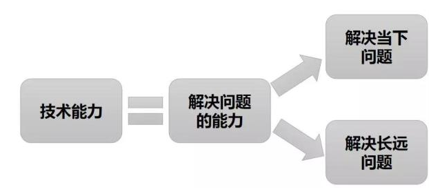

# 个人的一些提升

## 1、如何面对线上的异常/故障？

首先，排查，然后解决，这是第一层。联想到“消防”这个词，它包含了两层意思：

- “消”是消除问题。
- “防”是防止问题。

即“消防”这个词语表达的意思应该是先消除问题再防止相同的问题再次发生。其实线上的异常/故障也是同样的道理，我们应当先及时止血，把问题处理掉，然后深挖问题，探究根因。

举个栗子：

- 假设是某段代码的空指针异常导致的，那么是否考虑加强 Code Review，或者使用 findbugs 插件去自动扫描代码中可能的异常?
- 假设是线上某个配置修改导致的，那么是否今后变更的修改必须有人双重检查一遍才可以修改?
- 假设是本地内存中某些值因为系统重启丢失导致的，那么是否引入定时任务，定时把值写入本地内存中?
- 假设是某段代码逻辑没测试到导致的，那么是否可以反思总结为什么这段逻辑没有测试到，未来的测试应该如何改进?

根据我过往的经验，太多公司、太多团队处理线上的问题仅仅满足于把问题处理完就完事，忽略了对问题的复盘，这对团队/对公司的发展都是不利的。

## 2、什么是真正的技术能力？

学习时，源码固然重要，但更多的，应该贴近当前工作，学以致用。有人学习 Volatile 的时候一直挖到了 Volatile 在硬件层面上的实现方式，但是这真的说明技术能力强吗?钻研是好事，但是实际上大多时候的深入钻研并不在实际工作中有用，且研究得越深，忘得越快。因为研究得越深，那么这个技术点关联的技术点就越多，边边角角的忘了，核心的东西不容易串起来。真正的技术能力：

简而言之，技术能力=解决问题的能力，那么同样都在解决问题，大家之间的技术高低又有什么区分呢?

我认为有以下几个层次：

- 第一层级，解决当下问题。
- 第二层级，以优雅且可复用的方式解决当下问题。
- 第三层级，解决的问题不仅仅能满足当下，还能满足未来一段时间。

从这个角度上来看，不同的技术能力，在工作过程中区分度是很明显的：

- 写的代码是否存在异常风险，多线程运行下是否存在线程安全问题，某段代码是否会导致内存泄露。
- 写的代码是否优雅可复用，设计的框架是否足够符合开闭原则，代码结构层次是否清晰明了。
- 针对特定的场景，技术选型、库表结构设计是否足够合理，今天你设计的框架是只能用一年，还是未来三年五年都可以持续使用。
- 来了一个大的需求，就比如做一个 App 的会员体系功能好了，是否可以在充分分析需求后，精确将需求划分为几个特定的子模块并梳理清楚模块之间的关系。

越厉害的人，在代码设计与开发过程中，越能看到想到一些别人看不到想不到的问题，这叫做高屋建瓴。当代码运行出现问题的时候，有人 1 小时排查出问题，有人 1 分钟发现问题，这叫做举重若轻。

因此解决问题的能力才是技术能力的真正体现，学习时也可以注重学习设计模式、去学习分布式环境下各种 NoSQL 的选型对比、去学习使用 Lambda 让代码更简洁，往真正在实际工作中解决问题的方向去努力。

另外，抛开这个点，还有一个体现技术能力的点，就是学习能力。所以，解决问题的能力+学习能力，是我认为真正的技术能力，不过说到底，学习能力某种程度上也只是为了解决问题而已。

## 3、关于造轮子

曾几何时，当我们看着 Github 上这么多优秀的源代码的时候，默默立誓，这辈子我一定要写出一个牛逼的框架，开源在网上。对于一些复杂条件的报警，比如我们上边提到的失败率和流量波动，应该如何实现呢?

很多对技术有追求的朋友，进入一家公司可能时时刻刻在寻找机会去做一些自己造轮子的事情。但是就如同前面所说的，衡量真正好技术的标准就是能否实实在在地解决问题，自己造轮子风险高、周期长，且需要长时间的验证、排坑才能达到比较好的效果。

关于一些例子，在互联网发展的今天：

- RPC框架：Dubbo系，Thrift
- MQ：Kafka，Rabbit，Rocket，NSQ……
- NoSQL：Redis，Mongo，Hbase……
- 服务注册发现：Consul，ETCD，Eureka……

只要你有的技术方面的需求，绝大多数业界已经有了成熟的解决方案了，根本不需要去专门自己搞一套。因此我认为轻易一定不要造轮子，如果一定要造轮子，那么请想清楚下面几个问题：

- 你要做的事情是否当前已经有了类似解决方案?
- 如果有，那么你自己做的这一套东西和类似解决方案的差异点在哪里?假设不用你这套，基于已有的解决方案稍加改造是否就能达到目的?
- 如果没有，那么为什么之前没有?是你们公司这种场景是***的?还是这种场景对应的解决方案根本就是不可行的所以之前没人去搞?

如果想清楚了这些问题，那么就去干吧。

## 4、提升看问题的高度

如果以普通的视角去看，那么一颗树那也就只是一棵树而已，但是如果跳脱出目前的视角，站在更高的角度去看，它其实是森林的一部分。

你的主管并不是因为他是你的主管所以他就应该比你更高瞻远瞩，而是因为他看问题的高度比你更高、想得更远、做得更深，所以才成为了你的主管。

 把这个问题说得实际点：

- 假设今天你负责的是一个系统，那么你仅仅是把这个系统的基本原理搞懂了?还是可以把上下游有几个系统、每个系统之间如何调用、依赖方式都理顺?
- 假设今天你负责的是一块业务，那么你仅仅把自己负责的功能点弄清楚了?还是你可以从最上游开始，到你负责的系统，再到最下游，都思考得非常透彻?

今天与其在抱怨没有机会、抱怨公司对自己能力没有提升，为什么不去思考机会为什么降临在别人头上不降临在你头上?为什么别人可以从小公司写着一样的增删改查走向 BAT，而你年复一年还在小公司写着增删改查?当你真正能转变自己的思维模式，跳脱出现在的圈子往更高一个层次去看问题、去提升自己，我相信总会有发光发热的一天的。

同样在阿里巴巴，马老师思考自然、思考环保、思考人类的发展，你的主管思考团队未来的方向和打法。我们在思考如何把某个客户需求完整落地，这就是高度，你未必能想到马老师想的，但是你对标层级高一点的人，一步一步尝试往他们的高度去靠。总而言之：眼界决定高度，多看、多想、多保持好奇心、多问几个为什么，久而久之自然就迈上了一个新的台阶。

## 5、学会总结

需求、项目的复盘是非常重要的一部分内容，然而我之前见过的太多团队、太多 Leader，只顾着一个迭代接着一个迭代，一个版本接着一个版本，只满足于把需求做好，而忽略了总结的重要性。

我认为大到项目、小到需求，如果在完成之后缺乏总结，那么某种程度上来说是失败的，可以总结的点非常多：

- 通过这个项目/需求，是否吃透了某一块业务，搞懂了来龙去脉。
- 通过这个项目/需求，是否充分理解了公司某个技术框架/基础组件的用法。
- 在整个项目的设计上，有哪些做的不好的地方。
- 在整个项目的开发(针对程序员而言)，是否踩了坑，犯了低级的错误。
- 在整个项目的进度把控上、人员安排上、上下游协调上，是否存在不足之处。
- 经历了某次大促的值班，是否对可以熟练使用公司的监控工具，遇到突发事件，是否快速有效地进行了解决。

任何工作一定对个人都是有提升的，但是不会总结的人，在每个项目/需求中成长的东西都是散的，久而久之就忘了。

通过充分的总结之后，犯过的错误我们不会二次再犯，理清楚的业务的来龙去脉铭记在心，对自己是一种提升，分享给别人对别人也是很大的帮助。失败者失败的原因各有不同，成功者的做事方式总是相似的，从宏观角度去看，我认为总结就是成功者之所以能成功，很重要一个原因。

## 升职加薪的手段：

目标、计划、管理上级的能力、激励下属的能力

## 6、管理上级

- 理解上司
- 交流信息
- 管理预期
- 推动决策
- 争取资源
- 汇报成果
- 需求评价

### 6.1 第一类切入点：回归第一指标

XX：新产品设计已经推进一周，因为要考虑的问题很多，进展很慢，为确保按时完成工作，我们想和您再确认一下，这次产品设计工作，您最看重什么指标？在您看来，我们做好哪一点，工作是合格的？

### 6.2 第二类切入点：倒推资源缺口

XX：本次设计改版需要完成12个页面，8个功能，目前最大的挑战是评审资源，因为需要您和xx同时评审。按照一次评审三个页面，每次评审45分钟，我们要4次评审会。您看我们能否提前把评审日期敲定下来？这样我们可以及时拿到评审结果，快速调整设计方案。

### 激励下属的根本前提：帮下属找到清晰的个人目标

谈话内容：

1. 未来半年，哪些能力希望得到提升？
2. 个人收入方面，明年有哪些小目标？
3. 未来三个月，给企业设计一个里程碑，你觉得多少合适？
4. 家庭生活方面，有哪些特别需要改善的？
5. 你认为自己是否做好了晋升一级的准备？
6. 在咱们行业，有没有你特别崇拜的大咖？
7. 在咱们公司，有没有你特别认可的同事？

提高积极性：

目标清晰、领导支持、收入满意、成果可控、流程XX、团队和XX

提升业绩的能力：

把时间精力聚焦在工作业绩上，过去一个月，你取得了哪些业绩？

工作内容 !=工作业绩

工作内容：

- 做过三年大客户销售
- 做过2年课程研发
- 做过3年培训经理

工作业绩：

- 连续3年销售额2000万+
- 研发课程单品销售额300万+
- 完课率超85%，推荐率超90%

工作内容（大客户销售3年）--> 工作业绩（年均销售额2000万）-->工作能力（从0搭建千万销售团队）

## 搞定五项底层能力：

1. 管理目标，做任何工作先明确目标
2. 制定计划，找到可以完成目标的资源
3. 管理上级，直属上级是最重要的职场资源
4. 激励团队，通过带团队让个人贡献倍增
5. 提升业绩，把工作精力聚焦在工作业绩上

阻碍你升职加薪的主要障碍是什么？

职业赛道？个人贡献？团队贡献？成长潜力？

个人贡献突出，想提升团队贡献，想晋升成为更高级别的管理者-->晋升

职业赛道满意，想提升个人贡献，不一定带团队，必须涨工资-->涨薪

个人目标明确，对职业赛道不满意，想换个有发展的工作环境-->求职

个人目标不明确，对职业前景迷茫，想做出更清晰的职业规划-->规划

竞聘演讲：

我是谁？我的目标是什么？岗位职责是什么？我有哪些优势？我准备怎么做？

职场思维决定职业发展高度

黄牛思维：业绩平平，过于追求稳定 60%

猎豹思维：能力突出，沉迷于单打独斗 20%

狮子思维：团队作战，全力争取资源 5%

秃鹰思维：夸大业绩，频繁跳槽换工作 15%

​									 -->核心骨干-->中高层专家-->资深专家(专家路线)

普通员工--> 骨干员工

​									 -->基层主管 --> 中层干部--> 高层领导（管理路线）

职业阶段：

掌握一门专业技能-->有一份能发挥优势的工作-->取得良好的个人业绩-->开始成就团队和他人-->成为引领变革的领导者

什么是职业规划？

现阶段我最重要的目标是什么？这份工作可以满足我的目标吗？这份工作可以发挥我的优势吗？

配置职场资源			<----			制定个人目标

做什么最能实现目标？                 每个阶段的个人目标

行业+公司+职位  						收入水平+生活方式+家庭责任

行业、公司、岗位、领导、同事

如何制定个人目标？

首先考虑「必要性」，而不是「合理性」

必要性（我要带团队） 合理性（目前我不具备带团队的能力）

SMART原则：

- Specific 确定的
- Measurable 可衡量的
- Attaindable 可达到的
- Relevant 相关的
- Time-bound 有时限的

具体的（K12在线教育营销总监） 不具体的（想进入好公司带团队）

可衡量（月薪至少20K）  不可衡量（月薪越高越好）

能达到（第一年收入冲刺30w） 无法达到（尽快实现财富自由）

相关的（今年攒15w块钱）不相关的（提升硬笔书法能力）

有时限的（10月31日前上岗） 无时限的（尽量多看看）

如何配置职场资源?

根据已明确的个人目标，倒推实现目标需要哪些资源……

### 年龄越大越迷茫，如何找到个人目标？

example：获得晋升的3条核心思路

1、争取晋升机会 2、主动汇报进展 3、做好业绩复盘

你想要什么？

你能付出什么？

你可以承受什么？

| 不满         | 愿望         | 目标         |
| ------------ | ------------ | ------------ |
| 现在挣得太少 | 工资再高一点 | 至少涨20%    |
| 发挥空间不足 | 实现更大价值 | 晋升做负责人 |
| 工作不感兴趣 | 每天更有激情 | 换个好工作   |

你的具体目标是什么？

最低目标：至少带一个人，哪怕实习生也行，我可以自己招聘。

满意目标：晋升做小组负责人，涨薪20%，其他视表现决定

惊喜目标：晋升做小组负责人，明确为主管级，薪水涨20%

目标永远都是不合理的，关键不是讨论目标的合理性，而是做好实现目标的计划。

| 目前阶段 | 描述                                              | 出路                       |
| -------- | ------------------------------------------------- | -------------------------- |
| 提升转型 | 种了7年瓜，还是3亩地，得琢磨点新的来钱门道了      | 转变工作方式，拓展能力边界 |
| 业绩瓶颈 | 过去两年，虽然瓜又大又甜，不愁卖，但地太少了      |                            |
| 稳定贡献 | 过去三年，我的瓜越种越溜，亩产也越来越高          | 资源管理+成果管理+向上管理 |
| 熟练操作 | 2年时间，一边模仿一边请教邻居，终于可以独立种瓜了 | 工作流程+关键方法+领导预期 |
| 了解适应 | 过去一直外出打工，今年租了3亩地，第一次种瓜       | 岗位职责+胜任标准+领导风格 |

持续增值，不是换一个更喜欢的环境，而是让自己在职场中更值钱

薪水提升，能力提升，价值感提升

决定升职加薪的关键因素：

职业赛道-->个人贡献--> 团队贡献 --> 成长潜力

### **利用5年时间，让工资翻三倍？**

1. **第一年，选对职业赛道，最重要的领导重视业绩而且业绩有增长空间**
2. **第二年，突破向上管理，总能超出预期的完成工作，获得领导信任**
3. **第三年，学会制定计划，不仅自己可以做好，还能帮助下属做好**
4. **第四年，精通流程管理，不仅带领团队提升目标，还能持续提升效益**
5. **第五年，胜任中层干部，带领一个部门完成经营性目标**

## 六类常见困难

- 目标类困难
- 决策类困难
- 资源类困难
- 流程类困难
- 意愿类困难
- 风险类困难

### 目标类困难

1. 我的主要目标是什么？
2. 哪些可以自主决策？
3. 哪些问题一定要反馈？
4. 哪些标准必须要达成？

及时汇报，优先和领导汇报

参考话术：

老板，我对近期的工作目标和完成标准，还不是完全清楚，您看今天什么时候有10分钟时间？我找您再详细确认一下，这件事儿非常关键。而且，目标和标准这件事儿，必须您来决定。

### 资源类困难

1. 没有完成类似目标的经验
2. 没有完成类似目标的信心
3. 主观上有抵触情绪
4. 客观上资源不足

一对一汇报，精准评估客观资源

什么叫资源？

一切对帮助完成目标有帮助的投入都是资源

example：

公司历史上，销售冠军年销售额的平均业绩是1000万，年初上级给我的目标是8000万。目前前我的团队总共5名成员，还有3位是实习生，如果不增加招聘和培训，百分百完不成任务。

话术：

老板，很开心您对我和我团队的信任，我们也愿意，在您的带领下，挑战更高的目标。最近两天，我一直在盘点团队的销售资源，根据历史数据，我发现缺口比较大，我觉得有必要向你汇报一下。

把资源放在计划中，让上司明白，投入多少资源一定能完成目标。

第一个问题：我最重要的目标是什么？

第二个问题：为了完成这个目标，哪些工作可以不做？

第三个问题：根据过往经验和数据，完成50w毛利需要多少收入？

第四个问题：我们是否掌握了稳定收入的规律？

第五个问题：做什么最有利于提高毛利率？

### 流程类困难

1. 专业能力不精通
2. 工作流程不熟悉
3. 关键环节没经验
4. 缺少老同事帮带

延迟汇报，优先和同事请教

话术：

XXX，新人要给你添麻烦了。我对咱们岗位的某个流程还不熟悉，在咱们团队中，您最擅长这件事儿，您看能否给我5分钟时间，帮我指点一下？

### 意愿类困难

1. 不希望承担太大的压力
2. 希望调整岗位尝试其他机会
3. 状态不佳，想休整一下

谨慎汇报，可以争取同事支持

### 风险类困难

1. 外部出现意外，比如客户调整预算
2. 内部发生意外，比如人员流动
3. 自身发生意外，比如家庭因素
4. 一切正常，但进展和预期相差大

及时汇报，请上级知情给建议

### 决策类困难

1. 并行工作过多
2. 成果评价模糊

及时汇报，请上级帮助决策

## 反馈困难的5个步骤

1. 第一步，定义困难类型，我遇到的是哪类型的困难
2. 第二步，判断优先级，这个困难一定要现在解决吗
3. 第三步，理解上司的处境，上司会怎么看待这个困难
4. 第四步，提炼关键点，这个困难的关键点是什么
5. 第五步，明确沟通目标，我希望和上司达成怎么样的共识

### 如何向上级争取资源

话术：

XXX，最近工作中遇到了一些困难，非常需要您的帮助。

首先，再次和您确认，我这个月最重要的目标是XXXX，对吗？

其次，梳理过去两周的工作，我发现有30%的工作（时间）和这个目标无关。主要是这两类工作，为了确保关键任务完成，这两类工作我可以放缓吗？最后，这个目标需要在什么时候完成？因为这是我第一次完成类似的工作，如果过程中遇到一些不可控的因素，我可以再争取些时间吗？

**明确目标的进展和差距**

截至目前，关键目标完成了多少？距离最终完成，还差多少？这个差距，还预期相比如何？

**明确下一步计划**

未完成的目标，还需要多少资源？哪些措施，能确保这些资源被充分的利用？为了确保目标按时完成，还会做好哪些工作？

**争取资源要做好哪些准备：**

**明确最重要的目标，明确目标的进展和差距，明确资源和成果的投入产出比，明确下一步计划**

### 争取资源要保持什么心态？

1. 不管和什么样的上司合作，都应该主动争取资源
2. 资源永远有限，再优秀的上司，也不会每次都满足你的资源需求
3. 比坦诚困难，更重要的是选择时机和方式
4. 和上司争取资源，一定要正式沟通，有理有据
5. 争取任何资源的前提都是信任，信任给上司更多信心

### 表达不同意见的三个层次

客观判断：更加有效 （这是上个月的数据，按目前的资源，不做其他准备，目标风险比较大，如果增加某方面资源储备，我认为完成率有90%，甚至更高）

客观信息：一定程度上有效（这是上个月的数据，我不确定能否完成）

主管判断：基本无效 （我认为这样做很难完成）

### 反馈不同意见的四个误区

误区一：太看重立场，忽略了目标

误区二：只反馈问题，没有解决方案

误区三：总想证明自己比上司强

误区四：总想拯救自己的上司

### 先想清楚什么

1. 面对事实：我反馈的内容是什么性质
2. 明确目标：我实现的目标是什么
3. 换位思考：上司目前最需要什么

### 上司的需求目标是什么

1. 获得上级领导的认可
2. 持续完成上级交代的目标
3. 实现更低的管理目标
4. 被下属尊重和信任

### 管理不谈对错

管理是一种实践，其本质不在于“知”，而在于“行”，其验证不在于逻辑，而在于成果；其唯一权威就是成就。

### 面试

1. 明确你的薪水目标
2. 尊重招聘方反馈
3. 关注隐形收益
4. 重新思考岗位价值

### 利用岗位发展空间

我想和您说明的是，薪水不是我最关注的

只要成长空间明确，我的薪水能力也一定会增长

成长空间方面，您能否再给我一些详细的资料？比如：

我们是固定薪资？可以灵活争取吗？可以申请绩效奖金吗？

### 重点突出可迁移能力

我虽然没有成熟经验，但其实咱们的岗位能力，我都具备。我最多只需要三个月，熟悉一下流程就可以做到成手水平。不知道您是否认同？咱们成手员工一般能拿到什么水平的薪资？如果我在三个月后绩效合格，我希望可以调整到成手水平。

### 跟最高决策人打交道：

1. 说结论：首先，只要公司给我三个月时间，我完全可以胜任
2. 摆事实：过去我做过什么，最擅长什么，研究了什么
3. 给信心：您对我的担心很必要，但我在这一点上完全没问题
4. 有取舍：我最看重的是公司的哪一点，公司最看重的是哪一点……

### 薪酬谈判的四个前提

#### 1.明确你的薪水目标

- 你是为了自己的目标还是家人的期望？
- 关于工作选择和薪水待遇，对自己诚实最重要
- 跟着赚钱的人赚钱，往往是赚钱最快的

### 明确阶段薪水目标

|        |          | 实际收入 | 固定工资 | 绩效工资 | 标准福利 | 其他福利 |
| ------ | -------- | -------- | -------- | -------- | -------- | -------- |
| 短期   | 半年     |          |          |          |          |          |
|        | 一年     |          |          |          |          |          |
| 中长期 | 三年     |          |          |          |          |          |
|        | 五年     |          |          |          |          |          |
|        | 十年以后 |          |          |          |          |          |

### 明确薪酬模式：单位时间价值最大化

1. 卖管理，以管理能力为基础，通过团队整体价值提升创造附加值
2. 卖技能，以技能水平为基础，通过个人技能提升创造附加值
3. 卖时间，以工作时间为基础，除此之外没有任何附加值

### 尊重招聘方的反馈

1. 企业的核心目标是持续盈利，招聘方的职责是：选人+定价
2. 很多企业招聘经验不丰富，需要你来提供确定性和信心
3. 求职中很重要的一点是「求」，包括寻找、商议和妥协

### 关注隐形收益

1. 薪水不单纯是一个数字，隐形收益往往更重要
2. 通过这份工作，你能确定提升什么能力？接触什么资源？
3. 这个岗位，有明确的晋升设计、涨薪机会、绩效空间吗？

### 重新思考岗位价值

1. 站在雇主立场，重新梳理这个岗位到底能创造什么价值
2. 比如，原来是新媒体运营，现在能否兼顾外部作者运营？
3. 比如，原来是人力资源，现在能否兼顾薪酬避税？
4. 比如，原来是平面设计师，现在能否兼顾运营设计师？

### 薪酬谈判的五种技巧

薪资谈判准备发offer之后，你的期望薪水？你上份工作薪水？咱们岗位的薪酬标准是……

策略一：抛砖引玉，给对方一个参考

- 利用同行或同事数据。说实话，我对具体的薪水数字，还没有明确的答案。我更看重成长性，包括领导的管理水平，业务的持续性。过来面试前，我初步了解了一下同行公司的情况，他们同一岗位的起薪是xx，不知咱们是怎么设计的。
- 利用岗位发展空间。我想和您说的是，薪水并不是我最关注的，只要成长空间明确，我的薪水能力也一定会增长。成长空间方面，能否给我一个更具体的介绍？比如，我们是固定薪酬吗？可以灵活争取吗？可以申请绩效吗？

策略二：无中生有，给招聘方一种确定性

策略三：反客为主，变被动为主动

策略四：欲擒故纵，放长线掉大鱼

重点沟通晋升机会：

说实话，我个人的职业规划，最终是走向管理岗位。咱们这个岗位偏基层执行，好像也还没有明确的晋升计划。抱歉我这么说比较直接，您不要介意，我特别想和您沟通的是，如果公司在这方面没有管理精力，可以授权给我们来设计吗？

重点沟通奖金空间：

非常理解公司在人力成本上有严格预算，这是管理出色的提现。我也希望未来服务一家公司，能让个人价值化最大。在您看来，公司的人力成本预算，是为了控制入职初期的风险，还是长期都很有弹性空间？如果有弹性空间，您认为如何可以？

策略五：擒贼先擒王，搞定最高决策人

### 谈薪资的7个误区

1. 没有进入终面，就过早的关注薪水
2. 二次讨价还价，给人不满足的印象
3. 因为经验一般，所以按照公司为主
4. 不在乎薪水，对薪酬结构完全不关心
5. 完全按照招聘广告上的薪水范围谈判
6. 给出一个确定的数字，而不是一个范围
7. 过度关注同行竞品公司的薪资待遇

最重要的不是入职之后薪水高不高，而是入职之后每天要知道自己做得好不好。

直属领导、绩效考核、岗位职责

### 工资的本质是什么

1. 工资的本质是职位的定价
2. 职位的责任和价值决定职位的定价
3. 职位的具体价格由最低价格的可胜任者决定
4. 工资的增长由自身业绩和公司业绩的增长共同决定
5. 想赚更高的工资就要承担更重要的工作

### 个人工作业绩盘点（月度）

| 工作内容 | 计划目标（经营性目标） | 实际完成 | 完成率 | 部门排名 |
| -------- | ---------------------- | -------- | ------ | -------- |
| 领教     | 完课率20%              | 75%      | 125%   |          |
| 用户增长 | 净增长用户2万人        | 1.2万    | 60%    |          |
| 招聘     | 新招聘到岗12人         | 10人     | 83.3%  |          |
| 文案策划 | 新用户成本100元        | 92       | 108%   |          |

增量业绩：本月工作中，创造了哪些增量业绩？

在线销售额同比增长5%，综合销售成本下降3%

流程效率：本月工作中，哪些方面改进了流程效率？

门店接待从3个环节，精细化为7个环节，人均销售额提升3%

长期价值：基于以上内容，你在哪些方面（通用能力）上取得了进步?

熟练掌握「制定工作计划、优化工作流程」这两项通用管理能力。

### 做计划之前先想清楚什么？

1. 我的升职加薪目标（时间线）是什么
2. 我积累了哪些高含金量的职场资源
3. 决定我能否成功升职加薪的关键有哪些
4. 如果计划失败我将如何应对？