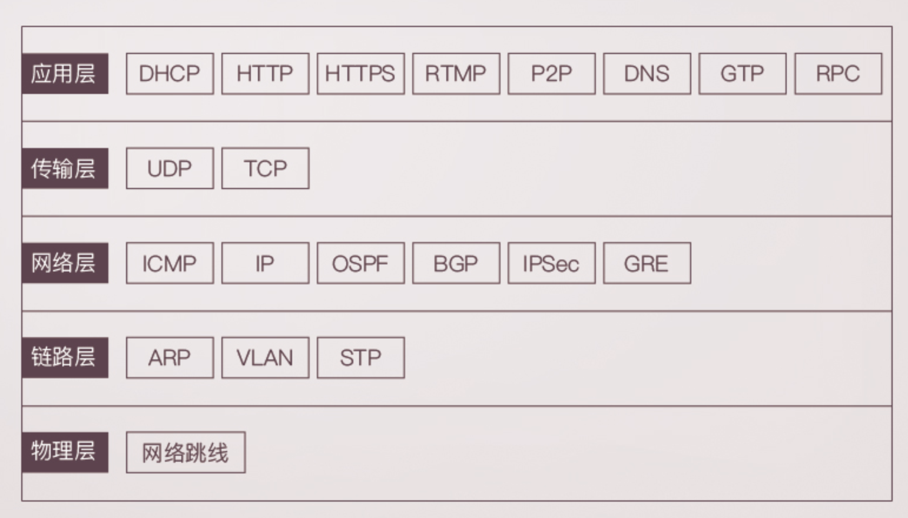
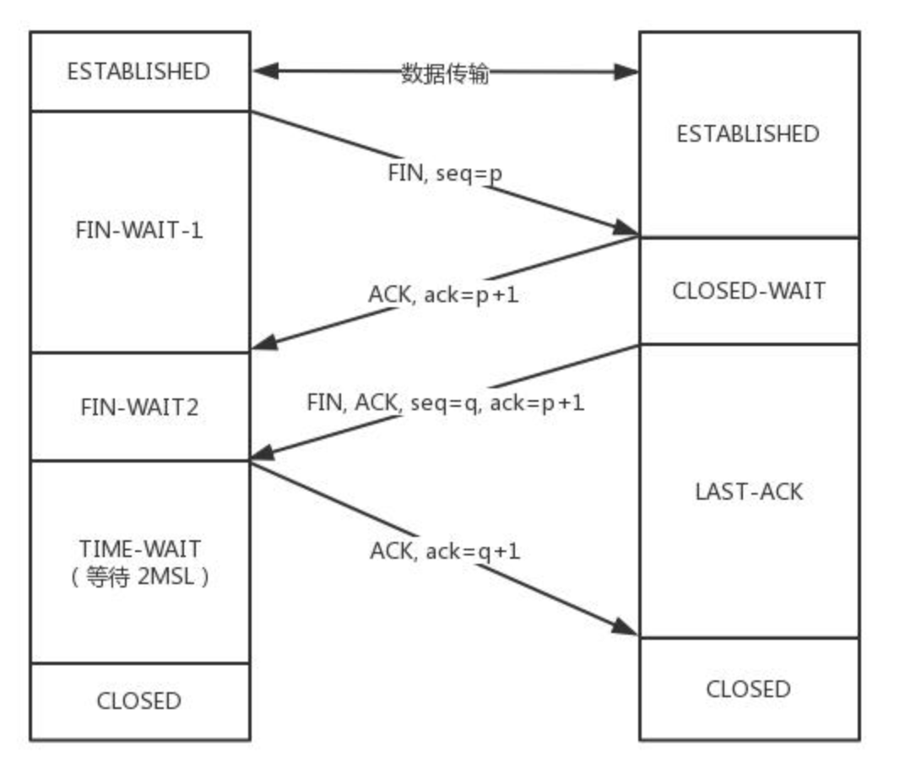

# 网络相关

## 网络协议

各层的协议：

Mac地址局域网寻址，IP地址网络寻址

## 传输层UDP与TCP：

**TCP是一个面向连接的、可靠的、基于字节流的传输层协议。**而**UDP是一个面向无连接的传输层协议。**区别：

|              | UDP                                    | TCP                              |
| :----------- | -------------------------------------- | -------------------------------- |
| 是否连接     | 无连接                                 | 面向连接                         |
| 是否可靠     | 不可靠传输，不能使用流量控制和拥塞控制 | 可靠传输，使用流量控制和拥塞控制 |
| 连接对象个数 | 一对一、一对多、多对一和多对多         | 一对一通信                       |
| 传输方式     | 面向报文                               | 面向字节流                       |
| 首部开销     | 8字节                                  | 最小20字节，最大60字节           |
| 适用场景     | 实时应用                               | 可靠传输应用，如文件传输         |

具体来分析，和 `UDP` 相比，`TCP` 有三大核心特性:

1. **面向连接**。所谓的连接，指的是客户端和服务器的连接，在双方互相通信之前，TCP 需要三次握手建立连接，而 UDP 没有相应建立连接的过程。
2. **可靠性**。TCP 花了非常多的功夫保证连接的可靠，这个可靠性体现在哪些方面呢？一个是有状态，另一个是可控制。TCP 会精准记录哪些数据发送了，哪些数据被对方接收了，哪些没有被接收到，而且保证数据包按序到达，不允许半点差错。这是**有状态**。当意识到丢包了或者网络环境不佳，TCP 会根据具体情况调整自己的行为，控制自己的发送速度或者重发。这是**可控制**。相应的，UDP 就是`无状态`, `不可控`的。
3. **面向字节流**。UDP 的数据传输是基于数据报的，这是因为仅仅只是继承了 IP 层的特性，而 TCP 为了维护状态，将一个个 IP 包变成了字节流。

TCP通过以下方式提供可靠性：

1. 用数据被分割成 TCP 认为最合适发送的数据块，即进行TCP 分段。这点与 UDP 完全不同，应用程序产生的UDP 数据报长度将保持不变，在 IP 层将 UDP 数据报加上IP 首部后，必要时对其进行 IP 分片。
2. 当 TCP 发出一个报文段后，它会启动一个定时器，等待目的端确认收到这个报文段，如果没能及时收到该确认信息，则将重发这个报文段。即超时重传。
3. 当 TCP 接收端收到连接另一端的 TCP 报文段时，它将发送一个确认，这个确认不是立即发送的，通常会推迟几分之一秒。即确认应答（ACK）。
4. TCP 将保持它首部和数据的校验和。这是一个端到端的校验和，目的是检查数据在传输过程中的任何变化。如果收到的报文段的校验和有差错，TCP 将丢弃该报文段，同时不发送确认收到的消息，从而使发送端超时重发。
5. 由于 TCP 报文段作为 IP 数据报来传输，IP 数据报的到达可能会失序，因此 TCP 报文段的到达也可能失序，如果必要，TCP 将对收到的数据进行重排序，将收到的数据以正确的顺序交给应用层。 
6. 由于 IP 数据报有可能发生重复，TCP 的接收端必须丢弃重复的数据。
7. TCP 能提供流量控制。TCP 连接的每一方都有固定大小的缓冲空间，TCP 的接受端只允许另一端发送接收端缓冲区所能接纳的数据，这将防止较快主机致使较慢主机的缓冲区溢出。即流量控制。

### TCP端口状态


## 七层协议

## 

与四层协议之间的对应

发送与接收

## TCP拥塞控制算法

1. Reno算法，适用于低延时、低带宽的网络，将拥塞控制的过程分为四个阶段：慢启动、拥塞避免、快重传和快恢复。对应状态如下图：
   - 慢启动阶段思路是不要一开始就发送大量的数据，先探测一下网络的拥塞程度，也就是说由小到大逐渐增加拥塞窗口的大小，在没有出现丢包时每收到一个 ACK 就将拥塞窗口大小加一（单位是 MSS，最大单个报文段长度），每轮次发送窗口增加一倍，呈指数增长，若出现丢包，则将拥塞窗口减半，进入拥塞避免阶段；
   - 当窗口达到慢启动阈值或出现丢包时，进入拥塞避免阶段，窗口每轮次加一，呈线性增长；当收到对一个报文的三个重复的 ACK 时，认为这个报文的下一个报文丢失了，进入快重传阶段，要求接收方在收到一个失序的报文段后就立即发出重复确认（为的是使发送方及早知道有报文段没有到达对方，可提高网络吞吐量约20%）而不要等到自己发送数据时捎带确认；
   - 快重传完成后进入快恢复阶段，将慢启动阈值修改为当前拥塞窗口值的一半，同时拥塞窗口值等于慢启动阈值，然后进入拥塞避免阶段，重复上述过程
2. BBR算法，经典的拥塞控制算法比如reno/newReno/Cubic无一例外都是将丢包作为拥塞的信号，然后降低发送速率。而在该算法中，不考虑丢包，而是基于这样一个定义：当网络上的包数大于BDP(带宽时延乘积)时，就认为出现了拥塞。 TCP BBR致力于解决两个问题：
   - 在有一定丢包率的网络链路上充分利用带宽
   - 降低网络链路上的buffer占用率，从而降低延迟。

## 三次握手、四次挥手

### TCP三次握手

三次握手是指建立一个TCP连接时，需要客户端和服务器总共发送3个包。进行三次握手的主要作用就是为了**确认双方的接收能力和发送能力是否正常**、指定自己的初始化序列号和为后面的可靠性传输做准备。   实质就是连接服务器指定端口，建立TCP连接，并同步连接双方的序列号和确认号，交换`TCP窗口大小`信息。刚开始客户端处于Closed的状态，服务端处于Listen状态，进行三次握手：

- 第一次握手：客户端给服务端发一个 SYN 报文，并指明客户端的初始化序列号 ISN(c)。此时客户端处于 `SYN_SEND` 状态。首部的同步位SYN=1，初始序号seq=x，SYN=1的报文段不能携带数据，但要消耗掉一个序号。
- 第二次握手：服务器收到客户端的 SYN 报文之后，会以自己的 SYN 报文作为应答，并且也是指定了自己的初始化序列号 ISN(s)。同时会把客户端的 ISN + 1 作为ACK 的值，表示自己已经收到了客户端的 SYN，此时服务器处于 `SYN_REVD` 的状态。在确认报文段中SYN=1，ACK=1，确认号ack=x+1，初始序号seq=y。
- 第三次握手：客户端收到 SYN 报文之后，会发送一个 ACK 报文，当然，也是一样把服务器的 ISN + 1 作为 ACK 的值，表示已经收到了服务端的 SYN 报文，此时客户端处于 `ESTABLISHED` 状态。服务器收到 ACK 报文之后，也处于 `ESTABLISHED` 状态，此时，双方已建立起了连接。确认报文段ACK=1，确认号ack=y+1，序号seq=x+1（初始为seq=x，第二个报文段所以要+1），ACK报文段可以携带数据，不携带数据则不消耗序号。

发送第一个SYN的一端将执行主动打开，接收这个SYN并返回下一个SYN的另一端执行被动打开。Socket编程中，客户端执行connect()时，也会触发三次握手。如图：


#### 为什么不是2次呢？

根本原因: 无法确认客户端的接收能力。分析如下:

如果是两次，你现在发了 SYN 报文想握手，但是这个包**滞留**在了当前的网络中迟迟没有到达，TCP 以为这是丢了包，于是重传，两次握手建立好了连接。看似没有问题，但是连接关闭后，如果这个**滞留**在网路中的包到达了服务端呢？这时候由于是两次握手，服务端只要接收到然后发送相应的数据包，就默认**建立连接**，但是现在客户端已经断开了，这就带来了连接资源的浪费。

#### 为什么不是四次？

三次握手的目的是确认双方`发送`和`接收`的能力，那四次握手可以嘛？当然可以，100 次都可以。但为了解决问题，三次就足够了，再多用处就不大了。

#### 三次握手过程中可以携带数据么？

第三次握手的时候，可以携带。前两次握手不能携带数据。

如果前两次握手能够携带数据，那么一旦有人想攻击服务器，那么他只需要在第一次握手中的 SYN 报文中放大量数据，那么服务器势必会消耗更多的**时间**和**内存空间**去处理这些数据，增大了服务器被攻击的风险。第三次握手的时候，客户端已经处于`ESTABLISHED`状态，并且已经能够确认服务器的接收、发送能力正常，这个时候相对安全了，可以携带数据。

#### 同时打开会怎样？

如果双方同时发 `SYN`报文，状态变化会是怎样的呢？这是一个可能会发生的情况。状态变迁如下:


在发送方给接收方发`SYN`报文的同时，接收方也给发送方发`SYN`报文，两个人刚上了!发完`SYN`，两者的状态都变为`SYN-SENT`。在各自收到对方的`SYN`后，两者状态都变为`SYN-REVD`。接着会回复对应的`ACK + SYN`，这个报文在对方接收之后，两者状态一起变为`ESTABLISHED`。这就是同时打开情况下的状态变迁。

### SYN攻击

**服务器端的资源分配是在二次握手时分配的，而客户端的资源是在完成三次握手时分配的**，所以服务器容易受到SYN洪泛攻击。SYN攻击就是Client在短时间内伪造大量不存在的IP地址，并向Server不断地发送SYN包，Server则回复确认包，并等待Client确认，由于源地址不存在，因此Server需要不断重发直至超时，这些伪造的SYN包将长时间占用未连接队列，导致正常的SYN请求因为队列满而被丢弃，从而引起网络拥塞甚至系统瘫痪。SYN 攻击是一种典型的 DoS/DDoS 攻击。

当开放了一个TCP端口后，该端口就处于Listening状态，不停地监视发到该端口的Syn报文，一 旦接收到Client发来的Syn报文，就需要为该请求分配一个TCB（Transmission Control Block），通常一个TCB至少需要280个字节，在某些操作系统中TCB甚至需要1300个字节，并返回一个SYN ACK命令，立即转为SYN-RECEIVED即半开连接状态，而某些操作系统在SOCK的实现上最多可开启512个半开连接（如Linux2.4.20 内核）。如果恶意的向某个服务器端口发送大量的SYN包，则可以使服务器打开大量的半开连接，分配TCB，从而消耗大量的服务器资源，同时也使得正常的连接请求无法被相应。

检测 SYN 攻击非常的方便，当你在服务器上看到大量的半连接状态时，特别是源IP地址是随机的，基本上可以断定这是一次SYN攻击。在 Linux/Unix 上可以使用系统自带的 netstats 命令来检测 SYN 攻击。

~~~shell
netstat -n -p TCP | grep SYN_RECV
~~~

### 如何应对 SYN Flood 攻击？

1. 增加 SYN 连接，也就是增加半连接队列的容量。
2. 减少 SYN + ACK 重试次数，避免大量的超时重发。
3. 利用 SYN Cookie 技术，在服务端接收到`SYN`后不立即分配连接资源，而是根据这个`SYN`计算出一个Cookie，连同第二次握手回复给客户端，在客户端回复`ACK`的时候带上这个`Cookie`值，服务端验证 Cookie 合法之后才分配连接资源。

### 半连接队列和SYN Flood

三次握手前，服务端的状态从`CLOSED`变为`LISTEN`, 同时在内部创建了两个队列：**半连接队列**和**全连接队列**，即**SYN队列**和**ACCEPT队列**。当客户端发送`SYN`到服务端，服务端收到以后回复`ACK`和`SYN`，状态由`LISTEN`变为`SYN_RCVD`，此时这个连接就被推入了**SYN队列**，也就是**半连接队列**。当客户端返回`ACK`, 服务端接收后，三次握手完成。这个时候连接等待被具体的应用取走，在被取走之前，它会被推入另外一个 TCP 维护的队列，也就是**全连接队列(Accept Queue)**。

### TCP四次挥手

建立一个连接需要三次握手，而终止一个连接要经过四次挥手（也有将四次挥手叫做四次握手的）。这由TCP的**半关闭**（half-close）造成的。所谓的半关闭，其实就是TCP提供了连接的一端在结束它的发送后还能接收来自另一端数据的能力。

TCP 的连接的拆除需要发送四个包，因此称为四次挥手(Four-way handshake)，客户端或服务器均可主动发起挥手动作。

刚开始双方都处于 ESTABLISHED 状态，假如是客户端先发起关闭请求。四次挥手的过程如下：

- 第一次挥手：客户端发送一个 FIN 报文，报文中会指定一个序列号。此时客户端处于 `FIN_WAIT1` 状态。 即发出**连接释放报文段**（FIN=1，序号seq=u），并停止再发送数据，主动关闭TCP连接，进入FIN_WAIT1（终止等待1）状态，等待服务端的确认。
- 第二次挥手：服务端收到 FIN 之后，会发送 ACK 报文，且把客户端的序列号值 +1 作为 ACK 报文的序列号值，表明已经收到客户端的报文了，此时服务端处于 `CLOSE_WAIT` 状态。 即服务端收到连接释放报文段后即发出**确认报文段**（ACK=1，确认号ack=u+1，序号seq=v），服务端进入CLOSE_WAIT（关闭等待）状态，此时的TCP处于半关闭状态，客户端到服务端的连接释放。客户端收到服务端的确认后，进入FIN_WAIT2（终止等待2）状态，等待服务端发出的连接释放报文段。
- 第三次挥手：如果服务端也想断开连接了，和客户端的第一次挥手一样，发给 FIN 报文，且指定一个序列号。此时服务端处于 `LAST_ACK` 的状态。 即服务端没有要向客户端发出的数据，服务端发出**连接释放报文段**（FIN=1，ACK=1，序号seq=w，确认号ack=u+1），服务端进入LAST_ACK（最后确认）状态，等待客户端的确认。
- 第四次挥手：客户端收到 FIN 之后，一样发送一个 ACK 报文作为应答，且把服务端的序列号值 +1 作为自己 ACK 报文的序列号值，此时客户端处于 `TIME_WAIT` 状态。需要过一阵子以确保服务端收到自己的 ACK 报文之后才会进入 CLOSED 状态，服务端收到 ACK 报文之后，就处于关闭连接了，处于 `CLOSED` 状态。 即客户端收到服务端的连接释放报文段后，对此发出**确认报文段**（ACK=1，seq=u+1，ack=w+1），客户端进入TIME_WAIT（时间等待）状态。此时TCP未释放掉，需要经过时间等待计时器设置的时间2MSL后，客户端才进入CLOSED状态。

收到一个FIN只意味着在这一方向上没有数据流动。**客户端执行主动关闭并进入TIME_WAIT是正常的，服务端通常执行被动关闭，不会进入TIME_WAIT状态。**

过程如下：



#### 为什么要四次挥手

因为当服务端收到客户端的SYN连接请求报文后，可以直接发送SYN+ACK报文。其中**ACK报文是用来应答的，SYN报文是用来同步的**。但是关闭连接时，当服务端收到FIN报文时，很可能并不会立即关闭SOCKET，所以只能先回复一个ACK报文，告诉客户端，"你发的FIN报文我收到了"。只有等到我服务端所有的报文都发送完了，我才能发送FIN报文，因此不能一起发送。故需要四次挥手。

### 2MSL等待状态

TIME_WAIT状态也成为2MSL等待状态。每个具体TCP实现必须选择一个报文段最大生存时间MSL（Maximum Segment Lifetime），它是任何报文段被丢弃前在网络内的最长时间。这个时间是有限的，因为TCP报文段以IP数据报在网络内传输，而IP数据报则有限制其生存时间的TTL字段。

对一个具体实现所给定的MSL值，处理的原则是：当TCP执行一个主动关闭，并发回最后一个ACK，该连接必须在TIME_WAIT状态停留的时间为2倍的MSL。这样可让TCP再次发送最后的ACK以防这个ACK丢失（另一端超时并重发最后的FIN）。

这种2MSL等待的另一个结果是这个TCP连接在2MSL等待期间，定义这个连接的插口（客户的IP地址和端口号，服务器的IP地址和端口号）不能再被使用。这个连接只能在2MSL结束后才能再被使用。

### 四次挥手释放连接时，等待2MSL的意义?

**MSL**是Maximum Segment Lifetime的英文缩写，可译为“最长报文段寿命”，它是任何报文在网络上存在的最长时间，超过这个时间报文将被丢弃。

为了保证客户端发送的最后一个ACK报文段能够到达服务器。因为这个ACK有可能丢失，从而导致处在LAST-ACK状态的服务器收不到对FIN-ACK的确认报文。服务器会超时重传这个FIN-ACK，接着客户端再重传一次确认，重新启动时间等待计时器。最后客户端和服务器都能正常的关闭。假设客户端不等待2MSL，而是在发送完ACK之后直接释放关闭，一但这个ACK丢失的话，服务器就无法正常的进入关闭连接状态。

#### 两个理由：

1. 保证客户端发送的最后一个ACK报文段能够到达服务端。 这个ACK报文段有可能丢失，使得处于LAST-ACK状态的B收不到对已发送的FIN+ACK报文段的确认，服务端超时重传FIN+ACK报文段，而客户端能在2MSL时间内收到这个重传的FIN+ACK报文段，接着客户端重传一次确认，重新启动2MSL计时器，最后客户端和服务端都进入到CLOSED状态，若客户端在TIME-WAIT状态不等待一段时间，而是发送完ACK报文段后立即释放连接，则无法收到服务端重传的FIN+ACK报文段，所以不会再发送一次确认报文段，则服务端无法正常进入到CLOSED状态。
2. 防止“已失效的连接请求报文段”出现在本连接中。 客户端在发送完最后一个ACK报文段后，再经过2MSL，就可以使本连接持续的时间内所产生的所有报文段都从网络中消失，使下一个新的连接中不会出现这种旧的连接请求报文段。

[三次握手详解](https://juejin.im/post/5d9c284b518825095879e7a5)

### Https详解

Https与Http的区别HTTPS是在HTTP上建立SSL加密层，并对传输数据进行加密，是HTTP协议的安全版。HTTPS主要作用是：

- 对数据进行加密，并建立一个信息安全通道，来保证传输过程中的数据安全
- 对网站服务器进行真实身份认证

Https工作原理

CA相关流程 (CertificateAuthority)

##  TCP 报文头部的字段

报文头部结构如下(单位为字节):


端口：如何唯一标识一个连接？通过TCP 连接的`四元组`——源 IP、源端口、目标 IP 和目标端口。因为在 IP 层就已经处理了 IP ，所以TCP 只需要记录两者的端口即可。

序列号：即`Sequence number`, 指的是本报文段第一个字节的序列号。从图中可以看出，序列号是一个长为 4 个字节，也就是 32 位的无符号整数，表示范围为 0 ~ 2^32 - 1。如果到达最大值了后就循环到0。序列号在 TCP 通信的过程中有两个作用：1、在 SYN 报文中交换彼此的初始序列号。2、保证数据包按正确的顺序组装。

ISN：即`Initial Sequence Number（初始序列号）`,在三次握手的过程当中，双方会用过`SYN`报文来交换彼此的 `ISN`。ISN 并不是一个固定的值，而是每 4 ms 加一，溢出则回到 0，这个算法使得猜测 ISN 变得很困难。那为什么要这么做？如果 ISN 被攻击者预测到，要知道源 IP 和源端口号都是很容易伪造的，当攻击者猜测 ISN 之后，直接伪造一个 RST 后，就可以强制连接关闭的，这是非常危险的。而动态增长的 ISN 大大提高了猜测 ISN 的难度。

确认号：即`ACK(Acknowledgment number)`。用来告知对方下一个期望接收的序列号，**小于ACK**的所有字节已经全部收到。

标记位：常见的标记位有`SYN`,`ACK`,`FIN`,`RST`,`PSH`。SYN 和 ACK 已经在上文说过，后三个解释如下: `FIN`： 即 Finish，表示发送方准备断开连接。`RST`：即 Reset，用来强制断开连接。`PSH`： 即 Push, 告知对方这些数据包收到后应该马上交给上层的应用，不能缓存。

窗口大小：占用两个字节，也就是 16 位，但实际上是不够用的。因此 TCP 引入了窗口缩放的选项，作为窗口缩放的比例因子，这个比例因子的范围在 0 ~ 14，比例因子可以将窗口的值扩大为原来的 2 ^ n 次方。TCP报文段首部中，“窗口大小”字段通常用于告知对方自己的能够接受的数据量大小。窗口本质就是一个缓冲区buffer，该字段的值用于告知对方自己剩余的可用缓冲区大小。在每一个TCP报文段中都会通过“窗口”字段告知对方自己的所能接收数据的大小。窗口大小通常用滑动窗口流量控制。

校验和：占用两个字节，防止传输过程中数据包有损坏，如果遇到校验和有差错的报文，TCP 直接丢弃之，等待重传。

可选项：包含了 Kind（1 byte）、Length（1 byte）、value

常用的可选项有以下几个:

- TimeStamp: TCP 时间戳，后面详细介绍。
- MSS: 指的是 TCP 允许的从对方接收的最大报文段。
- SACK: 选择确认选项。
- Window Scale： 窗口缩放选项。

### TCP快速打开（TFO）

首轮三次握手：首先客户端发送`SYN`给服务端，服务端接收到。注意哦！现在服务端不是立刻回复 SYN + ACK，而是通过计算得到一个`SYN Cookie`, 将这个`Cookie`放到 TCP 报文的 `Fast Open`选项中，然后才给客户端返回。客户端拿到这个 Cookie 的值缓存下来。后面正常完成三次握手。首轮三次握手就是这样的流程。而后面的三次握手就不一样啦！

后面的三次握手：在后面的三次握手中，客户端会将之前缓存的 `Cookie`、`SYN` 和`HTTP请求`(是的，你没看错)发送给服务端，服务端验证了 Cookie 的合法性，如果不合法直接丢弃；如果是合法的，那么就正常返回`SYN + ACK`。重点来了，现在服务端能向客户端发 HTTP 响应了！这是最显著的改变，三次握手还没建立，仅仅验证了 Cookie 的合法性，就可以返回 HTTP 响应了。当然，客户端的`ACK`还得正常传过来，不然怎么叫三次握手嘛。


注意: 客户端最后握手的 ACK 不一定要等到服务端的 HTTP 响应到达才发送，两个过程没有任何关系。

TFO的优势：TFO 的优势并不在与首轮三次握手，而在于后面的握手，在拿到客户端的 Cookie 并验证通过以后，可以直接返回 HTTP 响应，充分利用了**1 个RTT**(Round-Trip Time，往返时延)的时间**提前进行数据传输**，积累起来还是一个比较大的优势。

TCP报文中时间戳的作用：`timestamp`是 TCP 报文首部的一个可选项，一共占 10 个字节，格式如下:

```
kind(1 字节) + length(1 字节) + info(8 个字节)
复制代码
```

其中 kind = 8， length = 10， info 有两部分构成: **timestamp**和**timestamp echo**，各占 4 个字节。那么这些字段都是干嘛的呢？它们用来解决那些问题？接下来我们就来一一梳理，TCP 的时间戳主要解决两大问题:

- 计算往返时延 RTT(Round-Trip Time)
- 防止序列号的回绕问题

如何计算往返时延的呢？在没有时间戳的时候，计算 RTT 会遇到的问题如下图所示:


如果以第一次发包为开始时间的话，就会出现左图的问题，RTT 明显偏大，开始时间应该采用第二次的；如果以第二次发包为开始时间的话，就会导致右图的问题，RTT 明显偏小，开始时间应该采用第一次发包的。实际上无论开始时间以第一次发包还是第二次发包为准，都是不准确的。那这个时候引入时间戳就很好的解决了这个问题。

比如现在 a 向 b 发送一个报文 s1，b 向 a 回复一个含 ACK 的报文 s2 那么：

- **step 1:** a 向 b 发送的时候，`timestamp` 中存放的内容就是 a 主机发送时的内核时刻 `ta1`。
- **step 2:** b 向 a 回复 s2 报文的时候，`timestamp` 中存放的是 b 主机的时刻 `tb`, `timestamp echo`字段为从 s1 报文中解析出来的 ta1。
- **step 3:** a 收到 b 的 s2 报文之后，此时 a 主机的内核时刻是 ta2, 而在 s2 报文中的 timestamp echo 选项中可以得到 `ta1`, 也就是 s2 对应的报文最初的发送时刻。然后直接采用 ta2 - ta1 就得到了 RTT 的值。

防止序列号回绕：现在我们来模拟一下这个问题。序列号的范围其实是在0 ~ 2 ^ 32 - 1, 为了方便演示，我们缩小一下这个区间，假设范围是 0 ~ 4，那么到达 4 的时候会回到 0。

| 第几次发包 | 发送字节 | 对应序列号 | 状态                    |
| :--------- | :------- | :--------- | :---------------------- |
| 1          | 0 ~ 1    | 0 ~ 1      | 成功接收                |
| 2          | 1 ~ 2    | 1 ~ 2      | 滞留在网络中            |
| 3          | 2 ~ 3    | 2 ~ 3      | 成功接收                |
| 4          | 3 ~ 4    | 3 ~ 4      | 成功接收                |
| 5          | 4 ~ 5    | 0 ~ 1      | 成功接收，序列号从0开始 |
| 6          | 5 ~ 6    | 1 ~ 2      | ？？？                  |

假设在第 6 次的时候，之前还滞留在网路中的包回来了，那么就有两个序列号为`1 ~ 2`的数据包了，怎么区分谁是谁呢？这个时候就产生了序列号回绕的问题。那么用 timestamp 就能很好地解决这个问题，因为每次发包的时候都是将发包机器当时的内核时间记录在报文中，那么两次发包序列号即使相同，时间戳也不可能相同，这样就能够区分开两个数据包了。

## TCP 的超时重传

TCP 具有超时重传机制，即间隔一段时间没有等到数据包的回复时，重传这个数据包。那么这个重传间隔是如何来计算的呢？这个重传间隔也叫做**超时重传时间**(Retransmission TimeOut, 简称RTO)，它的计算跟上一节提到的 RTT 密切相关。这里我们将介绍两种主要的方法，一个是经典方法，一个是标准方法。

经典方法：经典方法引入了一个新的概念——SRTT(Smoothed round trip time，即平滑往返时间)，每产生一次新的 RTT. 就根据一定的算法对 SRTT 进行更新，具体而言，计算方式如下(SRTT 初始值为0):

```
SRTT =  (α * SRTT) + ((1 - α) * RTT)
```

其中，α 是**平滑因子**，建议值是`0.8`，范围是`0.8 ~ 0.9`。拿到 SRTT，我们就可以计算 RTO 的值了:

```
RTO = min(ubound, max(lbound, β * SRTT))
```

β 是加权因子，一般为`1.3 ~ 2.0`， **lbound** 是下界，**ubound** 是上界。其实这个算法过程还是很简单的，但是也存在一定的局限，就是在 RTT 稳定的地方表现还可以，而在 RTT 变化较大的地方就不行了，因为平滑因子 α 的范围是`0.8 ~ 0.9`, RTT 对于 RTO 的影响太小。

标准方法：为了解决经典方法对于 RTT 变化不敏感的问题，后面又引出了标准方法，也叫`Jacobson / Karels 算法`。一共有三步。

**第一步**: 计算`SRTT`，公式如下:

```
SRTT = (1 - α) * SRTT + α * RTT
```

注意这个时候的 `α`跟经典方法中的`α`取值不一样了，建议值是`1/8`，也就是`0.125`。

**第二步**: 计算`RTTVAR`(round-trip time variation)这个中间变量。

```
RTTVAR = (1 - β) * RTTVAR + β * (|RTT - SRTT|)
```

β 建议值为 0.25。这个值是这个算法中出彩的地方，也就是说，它记录了最新的 RTT 与当前 SRTT 之间的差值，给我们在后续感知到 RTT 的变化提供了抓手。

**第三步**: 计算最终的`RTO`:

```
RTO = µ * SRTT + ∂ * RTTVAR 
```

`µ`建议值取`1`, `∂`建议值取`4`。这个公式在 SRTT 的基础上加上了最新 RTT 与它的偏移，从而很好的感知了 RTT 的变化，这种算法下，RTO 与 RTT 变化的差值关系更加密切。

### TCP 的流量控制

对于发送端和接收端而言，TCP 需要把发送的数据放到**发送缓存区**, 将接收的数据放到**接收缓存区**。而流量控制索要做的事情，就是在通过接收缓存区的大小，控制发送端的发送。如果对方的接收缓存区满了，就不能再继续发送了。要具体理解流量控制，首先需要了解`滑动窗口`的概念。

TCP 滑动窗口分为两种: **发送窗口**和**接收窗口**。

发送端的滑动窗口结构如下:


其中包含四大部分:

- 已发送且已确认
- 已发送但未确认
- 未发送但可以发送
- 未发送也不可以发送

里边有几个重要的概念：发送窗口就是图中被框住的范围。SND 即`send`, WND 即`window`, UNA 即`unacknowledged`, 表示未被确认，NXT 即`next`, 表示下一个发送的位置。

接收端窗口：

REV 即 `receive`，NXT 表示下一个接收的位置，WND 表示接收窗口大小。

流量控制的过程：

首先双方三次握手，初始化各自的窗口大小，均为 200 个字节。

假如当前发送端给接收端发送 100 个字节，那么此时对于发送端而言，SND.NXT 当然要右移 100 个字节，也就是说当前的`可用窗口`减少了 100 个字节，这很好理解。

现在这 100 个到达了接收端，被放到接收端的缓冲队列中。不过此时由于大量负载的原因，接收端处理不了这么多字节，只能处理 40 个字节，剩下的 `60` 个字节被留在了缓冲队列中。

注意了，此时接收端的情况是处理能力不够用啦，你发送端给我少发点，所以此时接收端的接收窗口应该缩小，具体来说，缩小 60 个字节，由 200 个字节变成了 140 字节，因为缓冲队列还有 60 个字节没被应用拿走。

因此，接收端会在 ACK 的报文首部带上缩小后的滑动窗口 140 字节，发送端对应地调整发送窗口的大小为 140 个字节。此时对于发送端而言，已经发送且确认的部分增加 40 字节，也就是 SND.UNA 右移 40 个字节，同时**发送窗口**缩小为 140 个字节。

这也就是**流量控制**的过程。尽管回合再多，整个控制的过程和原理是一样的。

## TCP 的拥塞控制

上面说的**流量控制**发生在发送端跟接收端之间，并没有考虑到整个网络环境的影响，如果说当前网络特别差，特别容易丢包，那么发送端就应该注意一些了。而这，也正是`拥塞控制`需要处理的问题。

对于拥塞控制来说，TCP 每条连接都需要维护两个核心状态:

- 拥塞窗口（Congestion Window，cwnd）
- 慢启动阈值（Slow Start Threshold，ssthresh）

涉及到的算法有这几个:

- 慢启动
- 拥塞避免
- 快速重传和快速恢复

接下来，我们就来一一拆解这些状态和算法。首先，从拥塞窗口说起。

#### 拥塞窗口

拥塞窗口（Congestion Window，cwnd）是指目前自己还能传输的数据量大小。那么之前介绍了接收窗口的概念，两者有什么区别呢？

- 接收窗口(rwnd)是`接收端`给的限制
- 拥塞窗口(cwnd)是`发送端`的限制

限制谁呢？限制的是`发送窗口`的大小。有了这两个窗口，如何来计算`发送窗口`？

```
发送窗口大小 = min(rwnd, cwnd)
```

取两者的较小值。而拥塞控制，就是来控制`cwnd`的变化。

#### 慢启动

刚开始进入传输数据的时候，你是不知道现在的网路到底是稳定还是拥堵的，如果做的太激进，发包太急，那么疯狂丢包，造成雪崩式的网络灾难。

因此，拥塞控制首先就是要采用一种保守的算法来慢慢地适应整个网路，这种算法叫`慢启动`。运作过程如下:

- 首先，三次握手，双方宣告自己的接收窗口大小
- 双方初始化自己的**拥塞窗口**(cwnd)大小
- 在开始传输的一段时间，发送端每收到一个 ACK，拥塞窗口大小加 1，也就是说，每经过一个 RTT，cwnd 翻倍。如果说初始窗口为 10，那么第一轮 10 个报文传完且发送端收到 ACK 后，cwnd 变为 20，第二轮变为 40，第三轮变为 80，依次类推。

难道就这么无止境地翻倍下去？当然不可能。它的阈值叫做**慢启动阈值**，当 cwnd 到达这个阈值之后，好比踩了下刹车，别涨了那么快了，老铁，先 hold 住！在到达阈值后，如何来控制 cwnd 的大小呢？这就是拥塞避免做的事情了。

#### 拥塞避免

原来每收到一个 ACK，cwnd 加1，现在到达阈值了，cwnd 只能加这么一点: **1 / cwnd**。那你仔细算算，一轮 RTT 下来，收到 cwnd 个 ACK, 那最后拥塞窗口的大小 cwnd 总共才增加 1。也就是说，以前一个 RTT 下来，`cwnd`翻倍，现在`cwnd`只是增加 1 而已。当然，**慢启动**和**拥塞避免**是一起作用的，是一体的。

### 快速重传和快速恢复

在 TCP 传输的过程中，如果发生了丢包，即接收端发现数据段不是按序到达的时候，接收端的处理是重复发送之前的 ACK。比如第 5 个包丢了，即使第 6、7 个包到达的接收端，接收端也一律返回第 4 个包的 ACK。当发送端收到 3 个重复的 ACK 时，意识到丢包了，于是马上进行重传，不用等到一个 RTO 的时间到了才重传。这就是**快速重传**，它解决的是**是否需要重传**的问题。

那你可能会问了，既然要重传，那么只重传第 5 个包还是第5、6、7 个包都重传呢？当然第 6、7 个都已经到达了，TCP 的设计者也不傻，已经传过去干嘛还要传？干脆记录一下哪些包到了，哪些没到，针对性地重传。

在收到发送端的报文后，接收端回复一个 ACK 报文，那么在这个报文首部的可选项中，就可以加上`SACK`这个属性，通过`left edge`和`right edge`告知发送端已经收到了哪些区间的数据报。因此，即使第 5 个包丢包了，当收到第 6、7 个包之后，接收端依然会告诉发送端，这两个包到了。剩下第 5 个包没到，就重传这个包。这个过程也叫做**选择性重传(SACK，Selective Acknowledgment)**，它解决的是**如何重传**的问题。

当然，发送端收到三次重复 ACK 之后，发现丢包，觉得现在的网络已经有些拥塞了，自己会进入**快速恢复**阶段。在这个阶段，发送端如下改变：

- 拥塞阈值降低为 cwnd 的一半
- cwnd 的大小变为拥塞阈值
- cwnd 线性增加

以上就是 TCP 拥塞控制的经典算法: **慢启动**、**拥塞避免**、**快速重传和快速恢复**。

### Nagle 算法和延迟确认

#### Nagle 算法

试想一个场景，发送端不停地给接收端发很小的包，一次只发 1 个字节，那么发 1 千个字节需要发 1000 次。这种频繁的发送是存在问题的，不光是传输的时延消耗，发送和确认本身也是需要耗时的，频繁的发送接收带来了巨大的时延。而避免小包的频繁发送，这就是 Nagle 算法要做的事情。具体来说，Nagle 算法的规则如下:

- 当第一次发送数据时不用等待，就算是 1byte 的小包也立即发送
- 后面发送满足下面条件之一就可以发了:
  - 数据包大小达到最大段大小(Max Segment Size, 即 MSS)
  - 之前所有包的 ACK 都已接收到

#### 延迟确认

试想这样一个场景，当我收到了发送端的一个包，然后在极短的时间内又接收到了第二个包，那我是一个个地回复，还是稍微等一下，把两个包的 ACK 合并后一起回复呢？**延迟确认**(delayed ack)所做的事情，就是后者，稍稍延迟，然后合并 ACK，最后才回复给发送端。TCP 要求这个延迟的时延必须小于500ms，一般操作系统实现都不会超过200ms。

不过需要主要的是，有一些场景是不能延迟确认的，收到了就要马上回复:

- 接收到了大于一个 frame 的报文，且需要调整窗口大小
- TCP 处于 quickack 模式（通过`tcp_in_quickack_mode`设置）
- 发现了乱序包

### 如何理解 TCP 的 keep-alive

大家都听说过 http 的`keep-alive`, 不过 TCP 层面也是有`keep-alive`机制，而且跟应用层不太一样。试想一个场景，当有一方因为网络故障或者宕机导致连接失效，由于 TCP 并不是一个轮询的协议，在下一个数据包到达之前，对端对连接失效的情况是一无所知的。这个时候就出现了 keep-alive, 它的作用就是探测对端的连接有没有失效。在 Linux 下，可以这样查看相关的配置:

```shell
sudo sysctl -a | grep keepalive

// 每隔 7200 s 检测一次
net.ipv4.tcp_keepalive_time = 7200
// 一次最多重传 9 个包
net.ipv4.tcp_keepalive_probes = 9
// 每个包的间隔重传间隔 75 s
net.ipv4.tcp_keepalive_intvl = 75
```

不过，现状是大部分的应用并没有默认开启 TCP 的`keep-alive`选项，为什么？站在应用的角度:

- 7200s 也就是两个小时检测一次，时间太长
- 时间再短一些，也难以体现其设计的初衷, 即检测长时间的死连接

因此是一个比较尴尬的设计。

## 单机最大TCP连接

在确定最大连接数之前，先来看看系统如何标识一个tcp连接。系统用一个4四元组来唯一标识一个TCP连接：{localip, localport,remoteip,remoteport}。

1、当作为Client时，client每次发起tcp连接请求时，除非绑定端口，通常会让系统选取一个空闲的本地端口（local port），该端口是独占的，不能和其他tcp连接共享。tcp端口的数据类型是unsigned short，因此本地端口个数最大只有65536，端口0有特殊含义，不能使用，这样可用端口最多只有65535，所以在全部作为client端的情况下，一个client最大tcp连接数为65535，这些连接可以连到不同的serverip。

2、当作为Server时，server通常固定在某个本地端口上监听，等待client的连接请求。不考虑地址重用（unix的SO_REUSEADDR选项）的情况下，即使server端有多个ip，本地监听端口也是独占的，因此server端tcp连接4元组中只有remoteip（也就是clientip）和remote port（客户端port）是可变的，因此最大tcp连接为客户端ip数×客户端port数，对IPV4，不考虑ip地址分类等因素，最大tcp连接数约为2的32次方（ip数）×2的16次方（port数），也就是server端单机最大tcp连接数约为2的48次方。