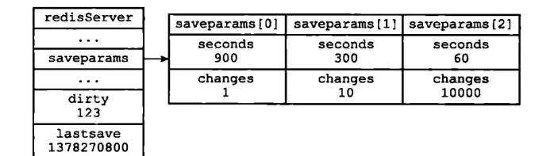
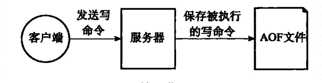
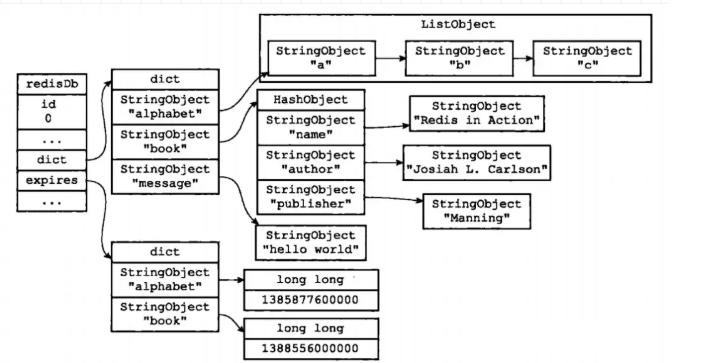
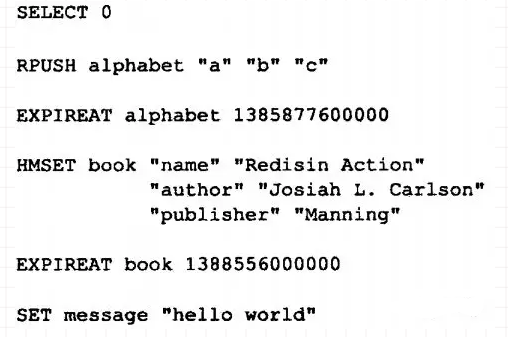
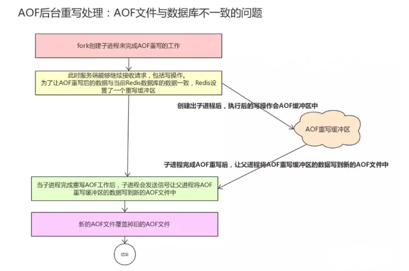
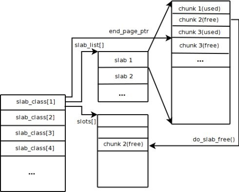
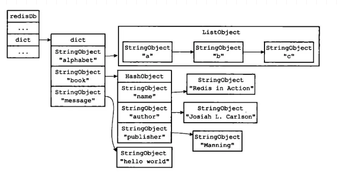
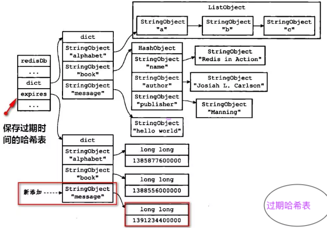

# Redis

## 命令行

### Lua管理脚本的四个命令：

Script Flush  清除服务器中和Lua脚本有关的信息，释放并重建lua_scripts字典，关闭现有的Lua环境并重新创建一个新的Lua环境

Script Exists

Script Load

Script Kill

### Redis 启动

定位到src   make

然后  ...../redis-server   

redis-cli -h 127.0.0.1 -p 6379 shutdown 关闭Redis

redis-cli   slaveof 10.28.51.53 6379  设置slave

Redis-cli  info  显示Redis信息      

## 源码安装redis步骤：

**1、install 源码  make  PREFIX=/usr/loal/redis-4.0.9 install**

**2、启动redis服务**

**3、启动哨兵**

**服务配置：**

daemonize yes

pidfile /mnt/redis/redis_6379/redis.pid

port 6379

bind 172.16.6.228

timeout 600

tcp-keepalive 0

loglevel notice

logfile /mnt/redis/redis_6379/logs/redis.log

databases 16

stop-writes-on-bgsave-error yes

rdbcompression yes

rdbchecksum yes

dbfilename redis_6379.rdb

dir /mnt/redis/redis_6379/data/

maxclients 4096

maxmemory 1024mb

maxmemory-policy volatile-lru

appendonly yes

appendfilename redis_6379.aof

appendfsync everysec

no-appendfsync-on-rewrite no

auto-aof-rewrite-percentage 100

auto-aof-rewrite-min-size 64mb

lua-time-limit 5000

slowlog-log-slower-than 10000

slowlog-max-len 128

hash-max-ziplist-entries 512

hash-max-ziplist-value 64

list-max-ziplist-entries 512

list-max-ziplist-value 64

set-max-intset-entries 512

zset-max-ziplist-entries 128

zset-max-ziplist-value 64

activerehashing yes

client-output-buffer-limit normal 0 0 0

client-output-buffer-limit slave 256mb 64mb 60

client-output-buffer-limit pubsub 32mb 8mb 60

hz 10

aof-rewrite-incremental-fsync yes

rename-command FLUSHDB ISS_FLUSHDB

rename-command FLUSHALL ISS_FLUSHALL

rename-command KEYS ISS_KEYS

**哨兵配置：**

Redis 启动

/usr/local/redis/src/redis-server /mnt/redis/redis_6379/conf/redis.conf

/usr/local/redis-3.2.11/src/redis-cli -h 10.28.51.53 -p 6379

/mnt/opt/mongodb-4.0.2/bin/mongo --host=10.28.55.56:27017

========================================================================================

## Redis 两种不同的持久化模式：RDB与AOF

### 1、RDB 快照模式，

该模式用于生成某个时间点的备份信息，并且会对当前的key value进行编码存储到rdb文件中。RDB持久化可以**手动**执行，也可以根据服务器配置**定期**执行。RDB持久化所生成的RDB文件是一个经过**压缩**的二进制文件，Redis可以通过这个文件**还原**数据库的数据。

有两个命令可以生成RDB文件：

- `SAVE`会**阻塞**Redis服务器进程，服务器不能接收任何请求，直到RDB文件创建完毕为止。
- `BGSAVE`创建出一个**子进程**，由子进程来负责创建RDB文件，服务器进程可以继续接收请求。

Redis服务器在启动的时候，如果发现有RDB文件，就会**自动**载入RDB文件(不需要人工干预)，但服务器在载入RDB文件期间，会处于阻塞状态，直到载入工作完成。除了手动调用`SAVE`或者`BGSAVE`命令生成RDB文件之外，我们可以使用配置的方式来**定期**执行：

在默认的配置下，如果以下的条件被触发，就会执行**BGSAVE**命令

~~~shell
    save 900 1              #在900秒(15分钟)之后，至少有1个key发生变化，
    save 300 10            #在300秒(5分钟)之后，至少有10个key发生变化
    save 60 10000        #在60秒(1分钟)之后，至少有10000个key发生变化
~~~

原理大概就是这样子的(结合上面的配置来看)：

```c
struct redisServer{
    // 修改计数器
    long long dirty;
  	// 上一次执行保存的时间
    time_t lastsave;
  	// 参数的配置
    struct saveparam *saveparams;
};
```

遍历参数数组，判断修改次数和时间是否符合，如果符合则调用`besave()`来生成RDB文件。



### 2、AOF 持久化模式，

该模式类似binlog的形式，会记录服务器所有的写请求，在服务重启的时候通过回放执行命令请求来恢复原有的数据。如图：



AOF文件记录的是原始的Redis写请求命令，所以在了解AOF文件之前我们需要了解下Redis协议。

Redis客户端和服务端之间可以通过RESP (REdis Serialization Protocol)来进行通信，作者在设计这个协议主要依据了以下三点：

- 易实现
- 解析速度快
- 容易被人类理解

RESP协议主要由以下几种数据类型组成：简单字符串、错误信息、整数、字符串、数组。客户端发送给服务端的是一个数组命令，服务端根据不同命令的实现进行回复。每个数据类型的定义如下：

- 简单字符串： 以+号开头结尾为rn，比如+OKrn
- 错误信息： 以-号开头结尾为rn的字符串，比如-ERR Readonlyrn
- 整数: 以:开头结尾为rn，开头和结尾之间为整数，比如:1rn
- 字符串: 以$开头随后为该字符串长度和rn，接下去为真正的字符串内容和rn
- 数组: 以*****开头的，随后指定了数组元素个数并通过rn划分，每个数组元素都可以为上面的四种，比如*1rn$4rnpingrn

AOF持久化功能的实现可以分为3个步骤：

命令追加：命令写入aof_buf缓冲区

文件写入：调用flushAppendOnlyFile函数，考虑是否要将aof_buf缓冲区写入AOF文件中。该函数的行为由服务器配置的**appendfsyn**选项来决定：

~~~shell
 appendfsync always     # 每次有数据修改发生时都会写入AOF文件。
    appendfsync everysec   # 每秒钟同步一次，该策略为AOF的默认策略。
    appendfsync no         # 从不同步。高效但是数据不会被持久化。
~~~

文件同步：考虑是否将内存缓冲区的数据真正写入到硬盘（操作系统在写文件的时候，很多都是先把数据保存在一个内存缓冲区里，等到内存缓冲区满了才将缓冲区的数据写入磁盘）。

### AOF重写

我们写了3条命令，AOF文件就保存了三条命令。如果命令长这样：

~~~shell
redis > RPUSH list "Java" "3y"
(integer)2

redis > RPUSH list "Java3y"
integer(3)

redis > RPUSH list "yyy"
integer(4)

~~~

那么，AOF也会保存3条命令。我们发现，上面的命令是可以合并起来成为1条命令的，并不需要3条。这样可以让AOF文件的体积变得更小。AOF重写由Redis自行触发(参数配置)，也可以用`BGREWRITEAOF`命令**手动触发**重写操作。要值得说明的是：**AOF重写不需要对现有的AOF文件进行任何的读取、分析。AOF重写是通过读取服务器当前数据库的数据来实现的**！

比如，现有一个Redis数据库的数据如下：



新的AOF文件的命令如下：



### AOF 后台重写

Redis将AOF重写程序放到**子进程**里执行(`BGREWRITEAOF`命令)，像`BGSAVE`命令一样fork出一个子进程来完成重写AOF的操作，从而不会影响到主进程。为了解决数据不一致的问题，Redis服务器设置了一个**AOF重写缓冲区**，这个缓存区会在服务器**创建出子进程之后使用**。如图：



#### RDB和AOF对过期键的策略

RDB持久化对过期键的策略：

- 执行`SAVE`或者`BGSAVE`命令创建出的RDB文件，程序会对数据库中的过期键检查，**已过期的键不会保存在RDB文件中**。
- 载入RDB文件时，程序同样会对RDB文件中的键进行检查，**过期的键会被忽略**。

AOF持久化对过期键的策略：

- 如果数据库的键已过期，但还没被惰性/定期删除，AOF文件不会因为这个过期键产生任何影响(也就说会保留)，当过期的键被删除了以后，会追加一条DEL命令来显示记录该键被删除了
- 重写AOF文件时，程序会对RDB文件中的键进行检查，**过期的键会被忽略**。

#### RDB和AOF选择

RDB和AOF并不互斥、他俩可以同时使用。

- RDB的优点：载入时**恢复数据快**、文件体积小。
- RDB的缺点：会一定程度上**丢失数据**(因为系统一旦在定时持久化之前出现宕机现象，此前没有来得及写入磁盘的数据都将丢失。)
- AOF的优点：丢失数据少(默认配置只丢失一秒的数据)。
- AOF的缺点：恢复数据相对较慢，文件体积大

如果Redis服务器**同时开启**了RDB和AOF持久化，服务器会**优先使用AOF文件**来还原数据(因为AOF更新频率比RDB更新频率要高，还原的数据更完善)

#### 分布式锁：

1、SET resource_name my_random_value NX PX max-lock-time

原子操作保证锁的持有者解锁是同一个、设置过期时间防止死锁

该方案的问题：

1) 通过过期时间来避免死锁，过期时间设置多长对业务来说往往比较头疼，时间短了可能会造成：持有锁的线程A任务还未处理完成，锁过期了，线程B获得了锁，导致同一个资源被A、B两个线程并发访问；时间长了会造成：持有锁的进程宕机，造成其他等待获取锁的进程长时间的无效等待

2) redis的主从异步复制机制可能丢失数据，会出现如下场景：A线程获得了锁，但锁数据还未同步到slave上，master挂了，slave顶成主，线程B尝试加锁，仍然能够成功，造成A、B两个线程并发访问同一个资源

2、通过zookeeper

加锁流程

1) 在/resource_name节点下创建临时有序节点

2) 获取当前线程创建的节点及/resource_name目录下的所有子节点，确定当前节点序号是否最小，是则加锁成功。否则监听序号较小的前一个节点

注：zab一致性协议保证了锁数据的安全性，不会因为数据丢失造成多个锁持有者；心跳保活机制解决死锁问题，防止由于进程挂掉或者僵死导致的锁长时间被无效占用。具备阻塞锁特性，并通过watch机制能够及时从阻塞状态被唤醒

解锁流程

1) 删除当前线程创建的临时接点

问题：通过心跳保活机制解决死锁会造成锁的不安全性，可能会出现如下场景：持有锁的线程A僵死或网络故障，导致服务端长时间收不到来自客户端的保活心跳，服务端认为客户端进程不存活主动释放锁，线程B抢到锁，线程A恢复，同时有两个线程访问共享资源


#### 理想的锁设计目标主要应该解决如下问题：

1、锁数据本身的安全性

2、不发生死锁

3、不会有多个线程同时持有相同的锁

实现不发生死锁：

1、锁设置过期时间，过期之后Server端自动释放锁

2、对锁的持有进程进行探活，发现持锁进程不存活时Server端自动释放

#### Redis内存分析方法

一般会采用bgsave生成dump.rdb文件，再结合redis-rdb-tools和sqlite来进行静态分析。使用redis-rdb-tools生成内存快照，命令：

~~~shell
rdb -c memory dump.rdb > memory.csv
~~~

生成CSV格式的内存报告。包含的列有：数据库ID，数据类型，key，内存使用量(byte)，编码。内存使用量包含key、value和其他值。
注意：内存使用量是理论上的近似值，在一般情况下，略低于实际值。
memory.csv例子：

~~~shell
$head memory.csv
database,type,key,size_in_bytes,encoding,num_elements,len_largest_element
0,string,"orderAt:377671748",96,string,8,8
0,string,"orderAt:413052773",96,string,8,8
0,sortedset,"Artical:Comments:7386",81740,skiplist,479,41
0,sortedset,"pay:id:18029",2443,ziplist,84,16
0,string,"orderAt:452389458",96,string,8,8
~~~

#### 分析内存快照

SQLite，是一款轻型的数据库。我们可以将前面生成的csv导入到数据库中之后，就可以利用sql语句很方便的对Redis的内存数据进行各种分析了。
导入方法：

~~~sqlite
sqlite3 memory.db
sqlite> create table memory(database int,type varchar(128),key varchar(128),size_in_bytes int,encoding varchar(128),num_elements int,len_largest_element varchar(128));
sqlite>.mode csv memory
sqlite>.import memory.csv memory
~~~

数据导入之后，直接查询分析：

~~~sqlite
sqlite>select count(*) from memory;//查询key个数
sqlite>select sum(size_in_bytes) from memory;//查询总的内存占用
sqlite>select * from memory order by size_in_bytes desc limit 10;//查询内存占用最高的10个key
sqlite>select * from memory where type='list' and num_elements > 1000 ;//查询成员个数1000个以上的lis
~~~

#### Redis应用场景：

缓存、排行榜（京东月度销量榜单，商品按时间的上新排行）、计数器（浏览量、播放量 incr 命令实现计数器功能）、分布式会话、分布式锁（全局ID、减库存、秒杀等场景 setnx功能）、社交网络（点赞、踩、关注……）、最新列表（Redis列表结构，LPUSH可以在列表头部插入一个内容ID作为关键字，LTRIM可用来限制列表的数量，这样列表永远为N个ID，无需查询最新的列表，直接根据ID去到对应的内容页即可）。

---

## 数据类型

### 常用数据类型：

String、Hash、Set、List、SortedSet、pub/sub、Transaction

1、String：Strings就是一个最最简单的Key-Value形式存储的变量。其中Value既可以是数字也可以是字符串。其实现方式是在Redis内部默认存储一个字符串，被redisObject引用，当检测到数字操作如自增自减incr、decr等等命令时，自动转化为数字进行计算，计算完毕后再转化为String存储起来。

2、Hash:Hash存储是键值对的value。即Key-Hash，而Hash又是一个k-v的结构，如果使用的Memcached，则需要把整个Hash打包存储在内存中，如果需要查询其中某个值，还要全部取出整个Hash，再查找对应值。而Redis可以直接通过命令获取到Value，大大提高了性能。 其实现原理：当成员较少时，Redis为了节约内存会采用类似一维数组的紧凑存储，而当对象较多时，则直接转为HashMap存储。

3、Set：Set是一个无序的天然去重的集合，即Key-Set。此外还提供了交集、并集等一系列直接操作集合的方法，对于求共同好友、共同关注什么的功能实现特别方便。其底层是靠HashMap实现的，其中value为null；

4、List：List是一个有序可重复的集合，其遵循FIFO的原则，底层是依赖双向链表实现的，因此支持正向、反向双重查找。通过List，我们可以很方面的获得类似于最新回复这类的功能实现。

5、SortedSet：类似于java中的TreeSet，是Set的可排序版。此外还支持优先级排序，维护了一个score的参数来实现。其底层主要依赖HashMap来实现的，通过维持插入的数值和Score优先级的映射来进行排序。

6、pub/sub：发布订阅，类似于消息队列mq。可以选择对某个Key进行订阅，一旦这个key发布了一些消息，则所有订阅了这个Key的对象就可以收到这个消息。主要可以用在实时消息系统上，例如聊天之类的。

7、Transactions：NoSQL不支持事务，但是通过提供了打包执行的功能，即这个包里面的所有命令必须要一起执行，此外还可以锁定某个Key，在打包执行命令时如果检测到这个Key发生了变化，则直接回滚。

### 底层数据结构

1. SDS

---


#### Redis对比Memcache

1、数据类型更丰富

2、Redis支持数据的备份，master-slave模式的数据备份

3、Redis支持数据持久化，可将内存中你那个的数据保存在磁盘中，重启时可以再次加载进行使用，而Memcache把数据全存在内存

4、Memcache是多线程，非阻塞IO复用的网络模型，，分为监听主线程和worker子线程，监听线程监听网络连接，接受请求后，将连接描述字pipe传递给worker线程，进行读写IO，网络层使用libevent封装的事件库，多线程模型可以发挥多核作用，但是引入了cache coherency和锁的问题，比如：memcached最常用的stats命令，实际memcached所有操作都要对这个全局变量加锁，进行技术等工作，带来了性能损耗。Redis使用单线程的IO复用模型，自己封装了一个简单的AeEvent事件处理框架，主要实现了epoll, kqueue和select，对于单存只有IO操作来说，单线程可以将速度优势发挥到最大，但是redis也提供了一些简单的计算功能，比如排序、聚合等，对于这些操作，单线程模型施加会严重影响整体吞吐量，CPU计算过程中，整个IO调度都是被阻塞的。

5、内存管理机制不同。Memcached的内存模式，官方定义为 ”Slab Allocation“，大致流程图如下：



1、chunk是Memcached用来存储数据的最小单位，就好像一个盒子，每个盒子里装的是我们的午饭一样。Memcache这样设计的初衷是为了尽量减少内存碎片的问题。

2、slab和page是更大一些的盒子，用于承装不同尺寸的Chunk，Chunk的大小是通过Factor【自增长因子决定】

3、不同尺寸的Chunk最终会交给一个”目录“进行管理，以便于访问，而这个目录叫slab_class。数据访问流程： 客户端会现在slab_class里找到尺寸合适的Slab，并且通过一定的方式找到Chunk，最终保证数据会进入一个更合适的”盒子“，从而减少内存的浪费。

Redis在这一方面的处理相对简单，大致的形式如下：


Redis每一个数据块都是根据数据类型和大小进行分配的，这一块数据的元数据（比如数据块大小）会存入内存块的头部，real_ptr是redis调用malloc后返回的指针。redis将内存块的大小size存入头部，size所占据的内存大小是已知的，为size_t类型的长度，然后返回ret_ptr。当需要释放内存的时候，ret_ptr被传给内存管理程序。通过ret_ptr，程序可以很容易的算出real_ptr的值，然后将real_ptr传给free释放内存。

总的来说，Memcached使用预分配的内存池的方式，使用slab和大小不同的chunk来管理内存，Item根据大小选择合适的chunk存储，内存池的方式可以省去申请/释放内存的开销，并且能减小内存碎片产生，但这种方式也会带来一定程度上的空间浪费；Redis使用现场申请内存的方式来存储数据，并且很少使用free-list等方式来优化内存分配，会在一定程度上存在内存碎片，Redis跟据存储命令参数，会把带过期时间的数据单独存放在一起，并把它们称为临时数据，非临时数据是永远不会被剔除的，即便物理内存不够，导致swap也不会剔除任何非临时数据（但会尝试剔除部分临时数据），这点上Redis更适合作为存储而不是cache。

1、Redis内存空间的利用比Memcahced更精细，引入Memcached是用一个“盒子”对数据进行承载，哪怕这个盒子的尺寸再合适，也不可避免的会有空置；2、Memcached完美的解决了内存碎片的问题；3、Memcached内部还存在一个slot的机制，对内存的使用优先使用废弃内存，在内存的重复利用上也具有一定的优势；4、Redis并不是将所有内存数据都存放在内存中，只会将所有的key存放在内存，在读取的时候会有一定几率存在一次IO操作，在这一点上，Redis是使用时间换取了空间的策略；

#### Redis 源码存储结构

~~~c
typedef struct redisDb { 
    int id;         // 数据库ID标识
    dict *dict;     // 键空间，存放着所有的键值对              
    dict *expires;  // 过期哈希表，保存着键的过期时间                          
    dict *watched_keys; // 被watch命令监控的key和相应client    
    long long avg_ttl;  // 数据库内所有键的平均TTL（生存时间）     
} redisDb;
~~~

从代码上我们可以发现最重要的应该是`dict *dict`，它用来存放着所有的键值对。一般我们将存储所有键值对的`dict`称为**键空间**。示意图：



Redis的数据库就是使用字典(哈希表)来作为底层实现的，对**数据库的增删改查都是构建在字典(哈希表)的操作之上的**。

#### 键的过期时间

设置键的生存时间可以通过`EXPIRE`或者`PEXPIRE`命令，设置键的**过期**时间可以通过`EXPIREAT`或者`PEXPIREAT`命令。其实`EXPIRE`、`PEXPIRE`、`EXPIREAT`这三个命令都是通过`PEXPIREAT`命令来实现的。我们在redisDb结构体中还发现了`dict *expires;`属性，存放所有键过期的时间。如执行命令：

~~~shell
EXPIREAT message 1391234400000
~~~

执行完之后：



移除过期时间以及查看剩余生存时间的命令：

PERSIST(移除过期时间)、TTL(Time To Live)返回剩余生存时间，以秒为单位、PTTL以毫秒为单位返回键的剩余生存时间

#### 过期策略

过期键是保存在哈希表中了。那这些过期键到了过期的时间，何时会被删掉呢？这与Redis的过期策略有关，删除策略可以分为三种：

1、定时删除（对内存友好，对CPU不友好），到时间点上就把所有过期的键删除了

2、惰性删除（对CPU极度友好，对内存极度不友好），每次从键空间取键的时候，判断一下该键是否过期了，如果过期了就删除

3、定期删除（折中），每隔一段时间去删除过期键，限制删除的执行时长和频率。

Redis采用的是**惰性删除+定期删除**两种策略，所以说，在Redis里边如果过期键到了过期的时间了，未必被立马删除的！

#### Redis数据淘汰策略

- **volatile-lru**，从已设置过期时间的数据集（server.db[i].expires）中挑选最近最少使用的数据淘汰
- **volatile-ttl**，从已设置过期时间的数据集（server.db[i].expires）中挑选将要过期的数据淘汰
- **volatile-random**，从已设置过期时间的数据集（server.db[i].expires）中任意选择数据淘汰
- **allkeys-lru**，从数据集（server.db[i].dict）中挑选最近最少使用的数据淘汰
- **allkeys-random**，从数据集（server.db[i].dict）中任意选择数据淘汰
- **no-enviction（默认使用的策略）**，（驱逐）：禁止驱逐数据

Redis回收使用的算法：**LRU 算法**

注意LFU和LRU算法的不同之处，LRU的淘汰规则是基于访问时间，而LFU是基于访问次数的。举个简单的例子：假设缓存大小为3，数据访问序列为set(2,2),set(1,1),get(2),get(1),get(2),set(3,3),set(4,4)，则在set(4,4)时对于LFU算法应该淘汰(3,3)，而LRU应该淘汰(1,1)。

Redis大量数据插入：从Redis 2.6开始`redis-cli`支持一种新的被称之为**pipe mode**的新模式用于执行大量数据插入工作。

### Redis分区

#### 分区的优势

- 通过利用多台计算机内存的和值，允许我们构造更大的数据库。
- 通过多核和多台计算机，允许我们扩展计算能力；通过多台计算机和网络适配器，允许我们扩展网络带宽。

#### 分区的不足

redis的一些特性在分区方面表现的不是很好：

- 涉及多个key的操作通常是不被支持的。举例来说，当两个set映射到不同的redis实例上时，你就不能对这两个set执行交集操作。
- 涉及多个key的redis事务不能使用。
- 当使用分区时，数据处理较为复杂，比如你需要处理多个rdb/aof文件，并且从多个实例和主机备份持久化文件。
- 增加或删除容量也比较复杂。redis集群大多数支持在运行时增加、删除节点的透明数据平衡的能力，但是类似于客户端分区、代理等其他系统则不支持这项特性。

#### 分区类型：范围分区和哈希分区

最简单的分区方式是按范围分区，就是映射一定范围的对象到特定的Redis实例。比如，ID从0到10000的用户会保存到实例R0，ID从10001到 20000的用户会保存到R1，以此类推。这种方式是可行的，并且在实际中使用，不足就是要有一个区间范围到实例的映射表。这个表要被管理，同时还需要各 种对象的映射表，通常对Redis来说并非是好的方法。

#### Redis常见性能问题和解决方案:

1. Master最好不要做任何持久化工作，如RDB内存快照和AOF日志文件
2. 如果数据比较重要，某个Slave开启AOF备份数据，策略设置为每秒同步一次
3. 为了主从复制的速度和连接的稳定性，Master和Slave最好在同一个局域网内
4. 尽量避免在压力很大的主库上增加从库

#### Redis分布式锁

lua脚本可以同时把setnx和expire合成一条指令来用的，这样不会出现setnx expire之前宕机死锁的问题


redis keys指令遍历会阻塞，可以用scan代替，但是会有重复的，需要客户端去重。Redis队列，一般使用list结构作为队列，rpush生产消息，lpop消费消息。当lpop没有消息的时候，要适当sleep一会再重试。list还有个指令叫blpop，在没有消息的时候，它会阻塞住直到消息到来。redis 通过 sortedset 可实现延时队列。拿时间戳作为score，消息内容作为key调用zadd来生产消息，消费者用zrangebyscore指令获取N秒之前的数据轮询进行处理。

#### Redis单线程为什么快？

#### IO多路复用

- I/O多路复用的特点是通过一种机制**一个进程能同时等待多个文件描述符**，而这些文件描述符其中的任意一个进入**读就绪状态、等等**，`select()`函数就可以返回。
- select/epoll的优势并不是对于单个连接能处理得更快，而是**在于能处理更多的连接**。

