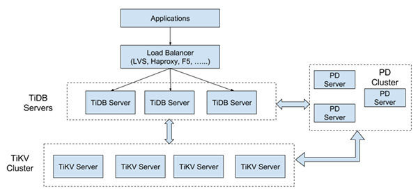
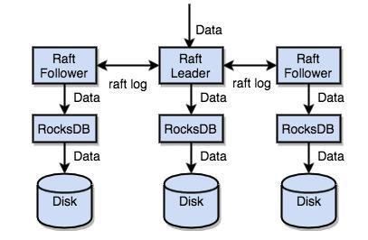
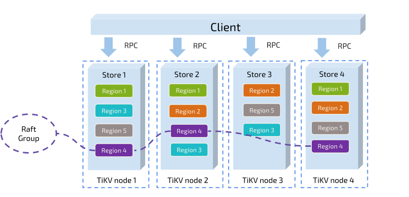

# TiDB相关
### 背景：当前数据库面临的问题
在缩放、一致性、大数据分析、与云基础架构集成等方面均存在诸多问题，现有的数据库解决方案和大数据分析引擎解决方案基本处于割裂的状态，由于Oracle、MySQL数据库并不是面向分布式环境所涉及，因此即使勉强通过分库、分表或中间件的方式，在数据库层面做了分片，从本质上看也只是复制了相同的堆栈，而非针对分布式系统进行存储和计算优化，这正是进行跨业务查询或跨物理机查询和写入十分繁琐的本质原因。NoSQL虽然解决了数据库弹性扩展的难题，但是却放弃了数据的强一致性以及对ACID事务的支持，带来了新的问题。

### TiDB 架构

TiDB 由分布式SQL层(TiDB)，分布式KV存储引擎(TiKV)以及管理整个集群的PD模块组成。无线水平扩展是TiDB的一大特点。

## TiDB设计的思路

### 1、为什么SQL层和存储层分开

- 对运维的友好性(有bug升级方便)
- 成本(存储和计算依赖的资源不一样)
- 更加灵活，可以使用不同的开发语言，对于无状态的计算层，选择Go语言，而对于存储层TiKV，选用Rust，稳定，无垃圾回收，不会造成抖动

### 2、一些特性

- 高度兼容MySQL，无缝迁移 
- 水平弹性扩展，加节点扩容
- 分布式事务，100%支持标准的ACID事务
- 金融级高可用，相比于传统主从（M-S）复制方案，基于Raft的多数选举协议可以提供金融级别的100%数据强一致性，大多数副本不丢失的前提下，故障自动恢复。
- HTAP解决方案（Hybrid Transactional analytical processing）
- 云原生SQL数据库、支持公有云、私有云、混合云，部署，配置，维护简单

核心特性：**水平扩展与高可用、100% OLTP，80%OLAP**

### 3、一致性

TiKV 利用 Raft 来做数据复制，每个数据变更都会落地为一条 Raft 日志，通过 Raft 的日志复制功能，将数据安全可靠地同步到 Group 的多数节点中。通过单机的 RocksDB，我们可以将数据快速地存储在磁盘上；通过 Raft，我们可以将数据复制到多台机器上，以防单机失效。数据的写入是通过 Raft 这一层的接口写入，而不是直接写 RocksDB。通过实现 Raft，我们拥有了一个分布式的 KV，现在再也不用担心某台机器挂掉了。

### 4、Region

对KV系统，数据分散在多台机器两种典型的方案，一是按Key做Hash，根据Hash值选存储节点，另一种是分Range，

连续的Key都保存在一个存储节点。TiKV默认是64M。每个Region是一个左闭右开的区间。。

1、以Region为单位，将数据分散在集群的节点上，尽量保证每个节点服务上的Region数量差不多

2、以Region为单位做Raft的复制和成员管理

TiKV 是以 Region 为单位做数据的复制，也就是一个 Region 的数据会保存多个副本，我们将每一个副本叫做一个 Replica。Replica 之间是通过 Raft 来保持数据的一致（终于提到了 Raft），一个 Region 的多个 Replica 会保存在不同的节点上，构成一个 Raft Group。其中一个 Replica 会作为这个 Group 的 Leader，其他的 Replica 作为 Follower。所有的读和写都是通过 Leader 进行，再由 Leader 复制给 Follower。

## TiDB的应用场景

### 1、MySQL 分片与合并

对于已经在用MySQL的业务，分库、分表、分片、中间件是常用手段，随着分片的增多，跨分片查询是一大难题。TiDB在业务层兼容MySQL的访问协议，PingCAP做了一个数据同步的工具——Syncer，它可以把TiDB作为一个MySQL Slave，将TiDB作为现有数据库的从库接在主MySQL库的后方，在这一层将数据打通，可以直接进行复杂的跨库、跨表、跨业务的实时SQL查询。过去的数据库都是一主多从，有了TiDB以后，可以反过来做到多主一从。

### 2、直接替换MySQL

在一个TiDB的数据库上，所有业务场景不需要做分库分表，所有的分布式工作都由数据库层完成。TiDB兼容MySQL协议，所以可以直接替换MySQL，而且基本做到了开箱即用，完全不用担心传统分库分表方案带来繁重的工作负担和复杂的维护成本，友好的用户界面让常规的技术人员可以高效地进行维护和管理。另外，TiDB具有NoSQL类似的扩容能力，在数据量和访问流量持续增长的情况下能够通过水平扩容提高系统的业务支撑能力，并且响应延迟稳定。

### 3、数据仓库

TiDB本身是一个分布式系统，可作为数据仓库使用。当TiDB的SQL出现瓶颈的时候，可用TiSpark，可以直接用Spark SQL 实时在TiKV上做大数据分析。

### 4、作为其他系统的模块 

TiDB是传统的存储跟计算分离的项目，底层的Key-Value层，可单独作为HBase的Replacement，同时支持跨行事务。TiDB对外提供两个API接口，一个是ACID Transaction的API，用于支持跨行事务；另一个是Raw API，可以做单行的事务，提升了整个的性能，但不提供跨行事务的ACID支持。

**TiDB、TiKV、PD**

TiDB 对每个表分配一个 TableID，每一个索引都会分配一个 IndexID，每一行分配一个 RowID（如果表有整数型的 Primary Key，那么会用 Primary Key 的值当做 RowID），其中 TableID 在整个集群内唯一，IndexID/RowID 在表内唯一，这些 ID 都是 int64 类型

Key-Value存储：

1、这是一个巨大的 Map，也就是存储的是 Key-Value pair

2、这个 Map 中的 Key-Value pair 按照 Key 的二进制顺序有序，也就是我们可以 Seek 到某一个 Key 的位置，然后不断的调用 Next 方法以递增的顺序获取比这个 Key 大的 Key-Value。TiKV把数据保存在RocksDB中，数据落地由RocksDB负责。RocksDB是单机的Key-Value Map。通过优化后的Raft协议，实现高效可靠的本地存储方案。

Raft是一个一致性协议，提供几个重要的功能：

1、Leader选举

2、成员变更

3、日志复制

TiKV利用Raft来做数据复制，每个数据变更都会落地为一条Raft日志，通过Raft复制功能，将数据安全可靠地同步到Group多数节点。通过单机的RocksDB，将数据快速存储在磁盘，通过Raft，数据复制到多台机器，防止单机失效。

**MVCC KEY+版本号**

没有MVCC之前

Key1-->Value

有了MVCC之后：

Key1-Version3 -->Value

Key1-Version2 -->Value 

**定位问题语句**

并不是所有 SLOW_QUERY 的语句都是有问题的。会造成集群整体压力增大的，是那些 process_time 很大的语句。wait_time 很大，但 process_time 很小的语句通常不是问题语句，是因为被问题语句阻塞，在执行队列等待造成的响应时间过长。

**Explain 查看执行计划**

Task 简介

目前 TiDB 的计算任务隶属于两种不同的 task：cop task 和 root task。cop task 是指使用 TiKV 中的 coprocessor 执行的计算任务，root task 是指在 TiDB 中执行的计算任务。

SQL 优化的目标之一是将计算尽可能地下推到 TiKV 中执行。TiKV 中的 coprocessor 能支持大部分 SQL 内建函数（包括聚合函数和标量函数）、SQL LIMIT操作、索引扫描和表扫描。但是，所有的 Join 操作都只能作为 root task 在 TiDB 上执行。

MySQL执行计划返回的是正在执行的查询计划，

TiDB返回的是最后执行的查询计划。