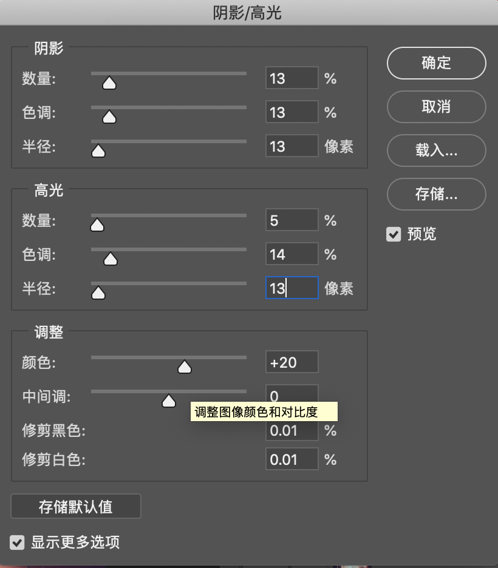

# 摄影

## 光的艺术

光的方向要比光的软硬更能决定一张照片的观感

“知道自己想要什么”是摄影的一个核心。

养成观察光线的习惯，跟别人说话的时候，去看看当时的环境光怎么在人脸上流动；逛街的时候，看看行人怎么在环境光里游走，哪怕你当时并没有打算拍照片。

阳光十六阴天八，多云十一日暮四，乌云压顶五点六，雪天落雨同日暮。

在大晴天的光照环境下，如果你把光圈设为 F16，想得到标准曝光值，只需把快门速度设置为 ISO 的倒数就可以了。比方说，现在阳光灿烂，我在户外拍摄，光圈开在 F16，ISO 125，那么我的标准曝光快门值就是 1/125s，想都不用想就可以直接设置好进行拍摄。如果我突然觉得快门速度不够快，需要提高到 1/500s，那么我直接把 ISO 调到 500 就好。这就是诗里面的“阳光十六”。“多云十一”、“阴天八”、“乌云压顶五点六”和“日暮四”我就不多讲了，这指的都是光圈值 (F11、F8、F5.6、F4)。在相应的光照环境下，同样把快门速度设置成 ISO 的倒数就可以了。

但是，如果我在阳光灿烂的光照环境里想用 F11 的光圈怎么办？很简单，因为光圈从 F16 变成了 F11，增大了一档，所以曝光也就增大了一档，如果想把这一档曝光拉回来，那么快门速度和 ISO 在互为倒数的基础上，要么快门速度增快一档，要么 ISO 减小一档。比如，现在阳光灿烂，我本来应该用“F16，1/500s，500”，但现在我的光圈变成了 F11 了，所以要么我的快门速度变成 1/1000s ，要么我的 ISO 变成 250。这全是我们前面讲过的基础知识，为什么说要多加练习，因为等你足够熟悉这些东西以后，根本就不用掰着手指头算这些参数了，看到一个场景你马上就能直觉性地调整参数。

阳光灿烂 (F16) = 影子黑，影子清晰可见，影子边缘锋利；多云 (F11) = 影子发灰，影子边缘柔和；阴天 (F8) = 影子隐约可见，或者说几乎不可见；雨雪前 (F5.6) = 没有影子；日暮 (F4) = 没有影子，日暮指的是太阳已经落山但天还没黑的时候，不是夕阳。

## 后期

### PS快捷键：

Q 前景背景色交换

H 抓手工具

B 画笔工具

I 吸管工具

C 裁剪

Q 前景色背景色切换

Command+J复制图层 Command+g 编组工具 Option+Del 前景色 Command+Del  背景色 Command+T 矩形自由拉伸

Command Shift Option E 盖印 

Command I 反向蒙版

### PS磨皮

#### 高反差磨皮

1、复制图层，转换成智能对象a，复制一份b，对a进行操作，选择滤镜，cameraw 滤镜，修改文理和清晰度；对b进行操作，滤镜，其他，高反差保留，调出轮廓；

2、a,b合成一组，添加黑蒙版，添加画笔，硬度设置成0，透明度30%，前景色白色，对面部进行涂抹即可。如果有光影，可在a处添加图层，利用吸管和画笔进行消除，最后合成即可。

#### 调脸

1、复制图层，Command+Option+2 选择高光，右下角添加一个纯色，选择白色，混合模式改成柔光。再复制刚才图层，不透明度设为24%。两个柔光叠加在一起，高光会变得非常干净。

2、添加通道混合器，首先选择蓝色通道，-15，50，50，12；然后红色通道，设置成89。然后加亮度对比度，分别设置成5，12。当前调整盖印，得到新图层。

3、复制图层，得到新图层，找到滤镜、模糊、高斯模糊，设置31.7。然后选择高光，添加一个蒙版，模式选择柔光，降低不透明度为50。然后复制刚才图层，反向选择蒙版。选择图像，滤镜 模糊 高斯模糊，值调大一点，比如74。如果不想要这么强烈的对比，也可以把这俩合成一个组，然后降低不透明度。

4、以上盖印，调整，阴影/高光,参数：然后选择高光，添加曲线，微微往下拉，然后再添加曲线，微微上拉。

接着添加照片滤镜，选择青色，浓度17%。

5、再次盖印，组合模式改成线性光。滤镜，其他高反差保留，调节参数使眼睛漏出来。添加黑色蒙版，找到白色画笔，擦眼睛。

### 矫正

滤镜-->镜头矫正  拉直工具可以对图片拉直

