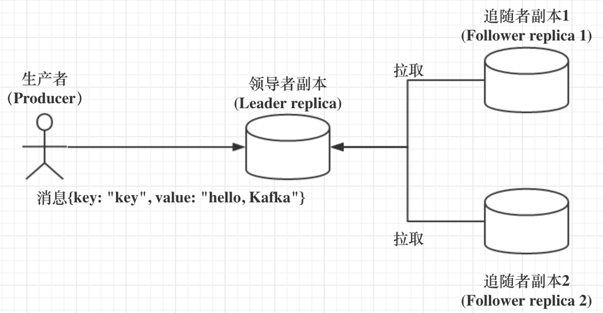
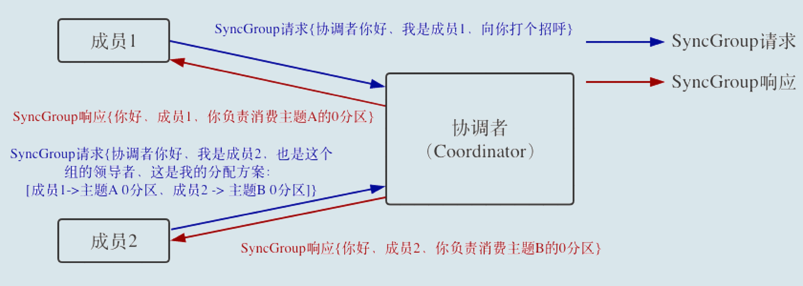

#### Kafka是什么？

Apache Kafka 是一款开源的消息引擎系统，消息引擎系统是一组规范。企业利用这组规范在不同系统之间传递语义准确的消息，实现松散耦合的异步式数据传递。

Kafka的消息编码格式：**纯二进制的字节序列**

消息引擎常见的传输协议，两种：

- **点对点模型** 也叫消息队列模型。A系统发的消息只能被B系统接收，其他任何系统都不能读取A发送的消息。
- **发布/订阅模型** 有一个主题(Topic)的概念，该模型有发送方和接收方，也称Publisher和Subscriber。多对多的关系。

Kafka同时支持这两种消息引擎模型。

Kafka的三层消息架构：

- 第一层是 主题层，每个主题可以配置M个分区，每个分区可以配置N个副本；
- 第二层是分区层，每个分区的N个副本中只能有一个充当领导者角色，对外提供服务；其他N-1个副本是追随者副本，只是提供数据冗余之用；
- 第三层是消息层，分区中包含若干条消息，每条消息的位移从0开始，依次递增。
- 最后，客户端程序只能与分区的领导者副本进行交互。

Kafka使用消息日志(Log)来保存数据，一个日志就是磁盘上一个只能追加写(Append-Only)消息的物理文件。因为只能追加写，所以避免了缓慢的随机I/O操作，改为性能较好的顺序I/O写操作，这也是实现Kafka高吞吐量特性的一个重要手段。如果不听地向一个日志写入消息，最终也会耗尽所有的磁盘空间，因此Kafka必然要定期的删除消息以回收磁盘。通过日志段(Log Segment)机制。Kafka底层，一个日志细分成多个日志段，消息被追加写到最新的日志段中，当写满一个日志段后，Kafka会自动切分出一个新的日志段，并将老的日志段封存起来。Kafka在后台有定时任务会定期地检查老的日志段是否能被删除，从而实现回收磁盘空间的目的。

Kafka的点对点消息模型，指同一条消息只能被下游的一个消费者消费，其他消费者不能染指。Kafka中实现这种P2P模型的方法是引入了消费者组(Consumer Group)。所谓的消费者组，指多个消费者实例共同组成一个组来消费一组主题。主题中的每个分区都只会被组内的一个消费者实例消费，其他消费者实例不能消费它，这样加速了消费端的吞吐量。

 如果producer指定了要发送的目标分区，消息自然是去到那个分区；否则就按照producer端参数partitioner.class指定的分区策略来定；如果你没有指定过partitioner.class，那么默认的规则是：看消息是否有key，如果有则计算key的murmur2哈希值%topic分区数；如果没有key，按照轮询的方式确定分区。

#### 压缩算法

Kafka的消息层次分为两层，消息集合(message set)以及消息(message)。一个消息集合中包含若干条日志项(record item)，而日志项才是封装消息的地方。Kafka底层的消息日志由一些列消息集合日志项组成，通常不会直接操作具体的一条条消息，总是在消息集合这个层面上进行写入操作。

Kafka中，压缩可能发生在两个地方：生产者端和Broker端。生产者端配置props.put("compression.type", "gzip");这样Producer启动后生产的每个消息集合都是经GZIP压缩过的，能很好的节省网络传输带宽以及Kafka Broker端的磁盘占用。一般情况Broker从Producer端接收到消息后原封不动的保存而不会对其进行任何修改，但两种情况除外：

- Broker端指定了和Producer端不同的压缩算法，比如，Producer指定了GZIP压缩算法，Broker指定了Snappy算法。Broker端也有一个参数叫compression.type,参数的默认值是producer，表示会尊重producer端的压缩算法，可一旦指定了不同的type，就会发生预料之外的压缩、解压操作，通常Broker端CPU飙升。
- Broker端发生了消息格式转换。所谓的消息格式转换主要是为了兼容老版本的消费者程序。还记得之前说过的 V1、V2 版本吧？在一个生产环境中，Kafka 集群中同时保存多种版本的消息格式非常常见。为了兼容老版本的格式，Broker 端会对新版本消息执行向老版本格式的转换。这个过程中会涉及消息的解压缩和重新压缩。一般情况下这种消息格式转换对性能是有很大影响的，除了这里的压缩之外，它还让 Kafka 丧失了引以为豪的 Zero Copy 特性。

通常来说解压缩发生在消费者程序中，也就是说 Producer 发送压缩消息到 Broker 后，Broker 照单全收并原样保存起来。当 Consumer 程序请求这部分消息时，Broker 依然原样发送出去，当消息到达 Consumer 端后，由 Consumer 自行解压缩还原成之前的消息。

**Producer 端压缩、Broker 端保持、Consumer 端解压缩。**

Kafka对已提交的消息做有限度的持久化保证。什么是已提交的消息？当 Kafka 的若干个 Broker 成功地接收到一条消息并写入到日志文件后，它们会告诉生产者程序这条消息已成功提交。此时，这条消息在 Kafka 看来就正式变为“已提交”消息了。目前 Kafka Producer 是异步发送消息的，也就是说如果你调用的是 producer.send(msg) 这个 API，那么它通常会立即返回，但此时你不能认为消息发送已成功完成。

这种发送方式有个有趣的名字，叫“fire and forget”，翻译一下就是“发射后不管”。这个术语原本属于导弹制导领域，后来被借鉴到计算机领域中，它的意思是，执行完一个操作后不去管它的结果是否成功。调用 producer.send(msg) 就属于典型的“fire and forget”，因此如果出现消息丢失，我们是无法知晓的。Producer 永远要使用带有回调通知的发送 API，也就是说不要使用 producer.send(msg)，而要使用 producer.send(msg, callback)。不要小瞧这里的 callback（回调），它能准确地告诉你消息是否真的提交成功了。一旦出现消息提交失败的情况，你就可以有针对性地进行处理。

Consumer 程序有个“位移”的概念，表示的是这个 Consumer 当前消费到的 Topic 分区的位置。下面这张图来自于官网，它清晰地展示了 Consumer 端的位移数据。

比如对于 Consumer A 而言，它当前的位移值就是 9；Consumer B 的位移值是 11。这里的“位移”类似于我们看书时使用的书签，它会标记我们当前阅读了多少页，下次翻书的时候我们能直接跳到书签页继续阅读。正确使用书签有两个步骤：第一步是读书，第二步是更新书签页。如果这两步的顺序颠倒了，就可能出现这样的场景：当前的书签页是第 90 页，我先将书签放到第 100 页上，之后开始读书。当阅读到第 95 页时，我临时有事中止了阅读。那么问题来了，当我下次直接跳到书签页阅读时，我就丢失了第 96～99 页的内容，即这些消息就丢失了。同理，Kafka 中 Consumer 端的消息丢失就是这么一回事。要对抗这种消息丢失，办法很简单：<strong>维持先消费消息（阅读），再更新位移（书签）的顺序</strong>即可。这样就能最大限度地保证消息不丢失。

#### 使用总结：

- 不要使用 producer.send(msg)，而要使用 producer.send(msg, callback)。记住，一定要使用带有回调通知的 send 方法。
- 设置 acks = all。acks 是 Producer 的一个参数，代表了你对“已提交”消息的定义。如果设置成 all，则表明所有副本 Broker 都要接收到消息，该消息才算是“已提交”。这是最高等级的“已提交”定义。
- 设置 retries 为一个较大的值。这里的 retries 同样是 Producer 的参数，对应前面提到的 Producer 自动重试。当出现网络的瞬时抖动时，消息发送可能会失败，此时配置了 retries > 0 的 Producer 能够自动重试消息发送，避免消息丢失。
- 设置 unclean.leader.election.enable = false。这是 Broker 端的参数，它控制的是哪些 Broker 有资格竞选分区的 Leader。如果一个 Broker 落后原先的 Leader 太多，那么它一旦成为新的 Leader，必然会造成消息的丢失。故一般都要将该参数设置成 false，即不允许这种情况的发生。
- 设置 replication.factor >= 3。这也是 Broker 端的参数。其实这里想表述的是，最好将消息多保存几份，毕竟目前防止消息丢失的主要机制就是冗余。
- 设置 min.insync.replicas > 1。这依然是 Broker 端参数，控制的是消息至少要被写入到多少个副本才算是“已提交”。设置成大于 1 可以提升消息持久性。在实际环境中千万不要使用默认值 1。
- 确保 replication.factor > min.insync.replicas。如果两者相等，那么只要有一个副本挂机，整个分区就无法正常工作了。我们不仅要改善消息的持久性，防止数据丢失，还要在不降低可用性的基础上完成。推荐设置成 replication.factor = min.insync.replicas + 1。
- 确保消息消费完成再提交。Consumer 端有个参数 enable.auto.commit，最好把它设置成 false，并采用手动提交位移的方式。就像前面说的，这对于单 Consumer 多线程处理的场景而言是至关重要的。

#### 连接管理：

Kafka所有通信是基于TCP的，包括生产者、消费者还是Broker之间的通信。<strong>在创建 KafkaProducer 实例时，生产者应用会在后台创建并启动一个名为 Sender 的线程，该 Sender 线程开始运行时首先会创建与 Broker 的连接</strong>。 bootstrap.servers 参数。它是 Producer 的核心参数之一，指定了这个 Producer 启动时要连接的 Broker 地址。请注意，这里的“启动时”，代表的是 Producer 启动时会发起与这些 Broker 的连接。因此，如果你为这个参数指定了 1000 个 Broker 连接信息，那么很遗憾，你的 Producer 启动时会首先创建与这 1000 个 Broker 的 TCP 连接。在实际使用过程中，并不建议把集群中所有的 Broker 信息都配置到 bootstrap.servers 中，通常你指定 3～4 台就足以了。因为 Producer 一旦连接到集群中的任一台 Broker，就能拿到整个集群的 Broker 信息，故没必要为 bootstrap.servers 指定所有的 Broker。Producer 向某一台 Broker 发送了 METADATA 请求，尝试获取集群的元数据信息——这就是前面提到的 Producer 能够获取集群所有Broker地址的方法。

#### 幂等性

简单来说，幂等性 Producer 和事务型 Producer 都是 Kafka 社区力图为 Kafka 实现精确一次处理语义所提供的工具，只是它们的作用范围是不同的。幂等性 Producer 只能保证单分区、单会话上的消息幂等性；而事务能够保证跨分区、跨会话间的幂等性。从交付语义上来看，自然是事务型 Producer 能做的更多。Kafka中，Producer默认不是幂等的，但可以创建幂等性Producer。 props.put(“enable.idempotence”, ture)保证幂等，enable.idempotence被设置成true后，Producer自动升级成幂等性Producer。底层具体的原理很简单，就是经典的用空间去换时间的优化思路，即在 Broker 端多保存一些字段。当 Producer 发送了具有相同字段值的消息后，Broker 能够自动知晓这些消息已经重复了，于是可以在后台默默地把它们“丢弃”掉。首先，它只能保证单分区上的幂等性，即一个幂等性 Producer 能够保证某个主题的一个分区上不出现重复消息，它无法实现多个分区的幂等性。其次，它只能实现单会话上的幂等性，不能实现跨会话的幂等性。这里的会话，你可以理解为 Producer 进程的一次运行。当你重启了 Producer 进程之后，这种幂等性保证就丧失了。

Kafka 自 0.11 版本开始也提供了对事务的支持，目前主要是在 read committed 隔离级别上做事情。它能保证多条消息原子性地写入到目标分区，同时也能保证 Consumer 只能看到事务成功提交的消息。事务型 Producer 能够保证将消息原子性地写入到多个分区中。这批消息要么全部写入成功，要么全部失败。另外，事务型 Producer 也不惧进程的重启。Producer 重启回来后，Kafka 依然保证它们发送消息的精确一次处理。

设置事务型 Producer 的方法也很简单，满足两个要求即可：

- 和幂等性 Producer 一样，开启 enable.idempotence = true。
- 设置 Producer 端参数 transctional. id。最好为其设置一个有意义的名字。

如：

Producer.initTransaction();

Try  {

​			producer.beginTransaction();

​			producer.send(record1);

​			producer.send(record2);

​			producer.commitTransaction();

}catch(KafkaException e){

​			producer.abortTransaction();

}

和普通 Producer 代码相比，事务型 Producer 的显著特点是调用了一些事务 API，如 initTransaction、beginTransaction、commitTransaction 和 abortTransaction，它们分别对应事务的初始化、事务开始、事务提交以及事务终止。这段代码能够保证 Record1 和 Record2 被当作一个事务统一提交到 Kafka，要么它们全部提交成功，要么全部写入失败。实际上即使写入失败，Kafka 也会把它们写入到底层的日志中，也就是说 Consumer 还是会看到这些消息。因此在 Consumer 端，读取事务型 Producer 发送的消息也是需要一些变更的。修改起来也很简单，设置 isolation.level 参数的值即可。当前这个参数有两个取值：

- read_uncommitted：这是默认值，表明 Consumer 能够读取到 Kafka 写入的任何消息，不论事务型 Producer 提交事务还是终止事务，其写入的消息都可以读取。很显然，如果你用了事务型 Producer，那么对应的 Consumer 就不要使用这个值。
- read_committed：表明 Consumer 只会读取事务型 Producer 成功提交事务写入的消息。当然了，它也能看到非事务型 Producer 写入的所有消息。

#### 消费者组

Consumer Group是Kafka提供的可扩展且具有容错性的消费者机制。理想情况下，Consumer实例的数量等于该Group订阅主题的分区总数。举个简单的例子，假设一个 Consumer Group 订阅了3个主题，分别是A、B、C，它们的分区数依次是1、2、3，那么通常情况下，为该Group设置6个Consumer实例是比较理想的情形，能最大限度的实现高伸缩性。新版本的Consumer Group将位移保存在Broker端的内部主题中。消费者组可以Rebalance，Rebalace是一种协议，规定了一个Consumer Group下的所有Consumer如何达成一致，来分配订阅Topic的每个分区。比如某个Group下有20个Consumer实例，订阅了一个具有100个分区的Topic，通常情况下每个Consumer分配5个分区。触发Rebalance的条件：

- 组成员数发生变更
- 订阅主题数发生变更
- 订阅主题的分区数发生变更

Rebalance 就是让一个 Consumer Group 下所有的 Consumer 实例就如何消费订阅主题的所有分区达成共识的过程。Rebalance过程中，所有Consumer实例共同参与，在协调者组件的帮助下，完成订阅主题分区的分配。在整个过程中，所有实例不能消费消息，对TPS影响很大。所谓协调者，在 Kafka 中对应的术语是 Coordinator，它专门为 Consumer Group 服务，负责为 Group 执行 Rebalance 以及提供位移管理和组成员管理等。Broker启动时，会创建和开启相应的Coordinator组件。也就是说，所有Broker都有各自的Coordinator组件。目前确定Coordinator所在Broker的算法有两步：

1）确定由位移主题的哪个分区来保存该Group数据：partitionId=Math.abs(groupId.hashCode() % offsetsTopicPartitionCount)。

2）找出该分区 Leader 副本所在的 Broker，该 Broker 即为对应的 Coordinator。

#### 避免不必要的Rebalance

1）未能及时发送心跳，导致Consumer被"踢出"Group引发。推荐值：**session.timeout.ms>=3*heartbeat.interval.ms.**

2）Consumer消费时间过长。**max.poll.interval.ms**设置得大一点。

Consumer的位移数据作为一条条普通的Kafka消息，提交到__consumer_offsets中，用__consumer_offsets的主要作用是保存kafka消费者的位移信息。位移主题的Key中保留了3部分内容：**<Group ID,主题名，分区号>**。当Kafka急群众的第一个Consumer程序启动时，Kafka会自动创建位移主题。**如果位移主题是Kafka自动创建的，那么该主题的分区数是50，副本数是3。**

#### 自动提交位移和手动提交位移

Consumer端有个参数叫enable.auto.commit,如果为true，Consumer后台默默的定期提交位移，提交间隔由一个专属的参数auto.commit.interval.ms来控制。自动提交位移时存在的问题，只要Consumer一直启动着，就会无限期的向位移主题写入消息。我们来举个极端一点的例子。假设 Consumer 当前消费到了某个主题的最新一条消息，位移是 100，之后该主题没有任何新消息产生，故 Consumer 无消息可消费了，所以位移永远保持在 100。由于是自动提交位移，位移主题中会不停地写入位移 =100 的消息。显然 Kafka 只需要保留这类消息中的最新一条就可以了，之前的消息都是可以删除的。这就要求 Kafka 必须要有针对位移主题消息特点的消息删除策略，否则这种消息会越来越多，最终撑爆整个磁盘。

Kafka使用**Compact策略**来删除位移主题中的过期消息，避免该主题无限期膨胀。对于同一个Key的两条消息M1和M2，如果M1的发送时间早于M2，那么M1就是过期消息。Compact的过程就是扫描日志的所有消息，剔除过期的消息，把剩下的整理在一起。如图：

图中位移为0、2和3的消息的Key都是K1。Compact之后，分区只需要保存位移为3的消息就行。**Kafka提供了专门的后台线程 Log Cleaner，定期巡检待Compact的主题，看看是否存在可以删除的数据**。

#### Consumer消费位移

记录了要消费的下一条消息的位移，是下一条，而不是目前最新消费消息的位移。**Consumer向Kafka汇报自己位移数据的过程叫提交位移**。因为Consumer能同时消费多个分区的数据，所以位移的提交实际上是在分区粒度上进行的，即**Consumer需要为分配给它的每个分区提交各自的位移数据**。

从用户角度，有手动提交和自动提交，从Consumer端的角度，分为同步提交和异步提交。

自动提交：一旦设置了 enable.auto.commit 为 true，Kafka 会保证在开始调用 poll 方法时，提交上次 poll 返回的所有消息。从顺序上来说，poll 方法的逻辑是先提交上一批消息的位移，再处理下一批消息，因此它能保证不出现消费丢失的情况。但自动提交位移的一个问题在于，<strong>它可能会出现重复消费</strong>。在默认情况下，Consumer 每 5 秒自动提交一次位移。现在，我们假设提交位移之后的 3 秒发生了 Rebalance 操作。在 Rebalance 之后，所有 Consumer 从上一次提交的位移处继续消费，但该位移已经是 3 秒前的位移数据了，故在 Rebalance 发生前 3 秒消费的所有数据都要重新再消费一次。虽然你能够通过减少 auto.commit.interval.ms 的值来提高提交频率，但这么做只能缩小重复消费的时间窗口，不可能完全消除它。这是自动提交机制的一个缺陷。

手动提交：commitSync()，被调用时，Consumer处于阻塞状态，直至远端的Broker返回结果，这个状态才结束，这样会导致系统的瓶颈。如果拉长提交间隔，下次Consumer重启后，会有更多的消息被重新消费。KafkaConsumer#commitAsync()  异步提交。异步提交的问题是出现问题时不会自动重试。因为是异步操作，如果提交失败后自动重试，重试时提交的位移值可能已经"过期"，因此重试没有意义。显然，如果是手动提交，我们需要将 commitSync 和 commitAsync 组合使用才能到达最理想的效果，原因有两个：

- 我们可以利用 commitSync 的自动重试来规避那些瞬时错误，比如网络的瞬时抖动，Broker 端 GC 等。因为这些问题都是短暂的，自动重试通常都会成功，因此，我们不想自己重试，而是希望 Kafka Consumer 帮我们做这件事。
- 我们不希望程序总处于阻塞状态，影响 TPS。

~~~java
   try {
           while(true) {
                        ConsumerRecords<String, String> records = 
                                    consumer.poll(Duration.ofSeconds(1));
                        process(records); // 处理消息
                        commitAysnc(); // 使用异步提交规避阻塞
            }
} catch(Exception e) {
            handle(e); // 处理异常
} finally {
            try {
                        consumer.commitSync(); // 最后一次提交使用同步阻塞式提交
	} finally {
	     consumer.close();
}
}

//分批提交位移
private Map<TopicPartition, OffsetAndMetadata> offsets = new HashMap<>();
int count = 0;
……
while (true) {
            ConsumerRecords<String, String> records = 
	consumer.poll(Duration.ofSeconds(1));
            for (ConsumerRecord<String, String> record: records) {
                        process(record);  // 处理消息
                        offsets.put(new TopicPartition(record.topic(), record.partition()),
                                   new OffsetAndMetadata(record.offset() + 1)；
                       if（count % 100 == 0）
                                    consumer.commitAsync(offsets, null); // 回调处理逻辑是 null
                        count++;
	}
}

~~~

位移提交：

#### CommitFailedException

所谓 CommitFailedException，顾名思义就是 Consumer 客户端在提交位移时出现了错误或异常，而且还是那种不可恢复的严重异常。从源代码方面来说，CommitFailedException 异常通常发生在手动提交位移时，即用户显式调用 KafkaConsumer.commitSync() 方法时。从使用场景来说，有两种典型的场景可能遭遇该异常。

第一种：当消息处理的总时间超过预设的 max.poll.interval.ms 参数值时，Kafka Consumer 端会抛出 CommitFailedException 异常。这是该异常最“正宗”的登场方式。你只需要写一个 Consumer 程序，使用 KafkaConsumer.subscribe 方法随意订阅一个主题，之后设置 Consumer 端参数 max.poll.interval.ms=5 秒，最后在循环调用 KafkaConsumer.poll 方法之间，插入 Thread.sleep(6000) 和手动提交位移，就可以成功复现这个异常了。防止出现这种异常，可以尝试以下操作：

- 缩短单条消息处理的时间，比如，之前下游系统消费一条消息的时间是 100 毫秒，优化之后成功地下降到 50 毫秒，那么此时 Consumer 端的 TPS 就提升了一倍。
- 增加 Consumer 端允许下游系统消费一批消息的最大时长。
- 减少下游系统一次性消费的消息总数。。这取决于 Consumer 端参数 max.poll.records 的值。当前该参数的默认值是 500 条，表明调用一次 KafkaConsumer.poll 方法，最多返回 500 条消息。可以说，该参数规定了单次 poll 方法能够返回的消息总数的上限。如果前两种方法对你都不适用的话，降低此参数值是避免 CommitFailedException 异常最简单的手段。
- 下游系统使用多线程来加速消费

首先，你需要弄清楚你的下游系统消费每条消息的平均延时是多少。比如你的消费逻辑是从 Kafka 获取到消息后写入到下游的 MongoDB 中，假设访问 MongoDB 的平均延时不超过 2 秒，那么你可以认为消息处理需要花费 2 秒的时间。如果按照 max.poll.records 等于 500 来计算，一批消息的总消费时长大约是 1000 秒，因此你的 Consumer 端的 max.poll.interval.ms 参数值就不能低于 1000 秒。如果你使用默认配置，那默认值 5 分钟显然是不够的，你将有很大概率遭遇 CommitFailedException 异常。将 max.poll.interval.ms 增加到 1000 秒以上的做法就属于上面的第 2 种方法。除了调整 max.poll.interval.ms 之外，你还可以选择调整 max.poll.records 值，减少每次 poll 方法返回的消息数。还拿刚才的例子来说，你可以设置 max.poll.records 值为 150，甚至更少，这样每批消息的总消费时长不会超过 300 秒（150*2=300），即 max.poll.interval.ms 的默认值 5 分钟。这种减少 max.poll.records 值的做法就属于上面提到的方法 3。

第二种不太常见的场景

Kafka Java Consumer 端还提供了一个名为 Standalone Consumer 的独立消费者。它没有消费者组的概念，每个消费者实例都是独立工作的，彼此之间毫无联系。不过，你需要注意的是，独立消费者的位移提交机制和消费者组是一样的，因此独立消费者的位移提交也必须遵守之前说的那些规定，比如独立消费者也要指定 group.id 参数才能提交位移。你可能会觉得奇怪，既然是独立消费者，为什么还要指定 group.id 呢？没办法，谁让社区就是这么设计的呢？总之，消费者组和独立消费者在使用之前都要指定 group.id。如果你的应用中同时出现了设置相同 group.id 值的消费者组程序和独立消费者程序，那么当独立消费者程序手动提交位移时，Kafka 就会立即抛出 CommitFailedException 异常，因为 Kafka 无法识别这个具有相同 group.id 的消费者实例，于是就向它返回一个错误，表明它不是消费者组内合法的成员。

#### 多线程开发消费者

1、消费者程序启动多个线程，每个线程维护专属的KafkaConsumer实例，负责完整的消息获取、处理流程，如下图所示：

2、消费者程序使用单或多线程获取消息，同时创建多个消费线程执行消息处理逻辑。获取消息的线程可以是一个，也可是多个，每个线程维护专属的KafkaConsumer实例，处理消息则交由特定的线程池来做。如下图：

优缺点对比：

#### Kafka消费者TCP连接

Kafka网络传输是基于TCP协议的，而不是UDP协议。和生产者不同的是，构建KafkaConsumer实例时不会创建任何TCP连接。当执行完new KafkaConsumer(properties)后并没有socket连接被创建出来。这一点与Java生产者有区别，生产者入口类KafkaProducer在构建实例的时候，会在后台默默启动一个Sender线程，负责Socket连接的创建。**TCP连接是在调用KafkaConsumer.poll方法时创建的**，poll方法内部有3个时机可以创建TCP连接。

1、发起FindCoordinator请求时

消费者端的协调者(Coordinator)会驻留在Broker端的内存中，负责消费者组的成员管理和各个消费者的位移提交管理。当消费者程序首次启动调用Poll方法时，需要向kafka集群发送一个名为FindCoordinator的请求，希望kafka集群告诉它哪个broker是管理它的协调者。理论上消费者可以向任意broker发送请求，但实际上，消费者程序会向集群中当前负载最小的那台broker发请求，如何评估负载呢？看待消费者连接的所有broker中，谁的待发送请求最少。

2、连接协调者时

Broker 处理完上一步发送的 FindCoordinator 请求之后，会返还对应的响应结果（Response），显式地告诉消费者哪个 Broker 是真正的协调者，因此在这一步，消费者知晓了真正的协调者后，会创建连向该 Broker 的 Socket 连接。只有成功连入协调者，协调者才能开启正常的组协调操作，比如加入组、等待组分配方案、心跳请求处理、位移获取、位移提交等。

3、消费数据时

消费者会为每个要消费的分区创建与该分区领导者副本所在 Broker 连接的 TCP。举个例子，假设消费者要消费 5 个分区的数据，这 5 个分区各自的领导者副本分布在 4 台 Broker 上，那么该消费者在消费时会创建与这 4 台 Broker 的 Socket 连接。

消费者程序会创建3类TCP连接：**1、确定协调者和获取集群元数据 2、连接协调者、令其执行组成员管理操作 3、执行实际的消息获取**，当第三类连接成功创建后，消费者程序就会放弃第一类TCP连接。

#### TCP连接的关闭

主动关闭和kafka自动关闭，主动是指**手动调用KafkaConsumer.close()或者执行kill**，kafka自动关闭是由**消费者端参数connection.max.idle.ms**控制的，默认9分钟。

### 消费者组监控进度

1、Kafka自带命令**kafka-consumer-groups 脚本是 Kafka 为我们提供的最直接的监控消费者消费进度的工具**

使用方法：

**$ bin/kafka-consumer-groups.sh --bootstrap-server <Kafka broker 连接信息 > --describe --group <group 名称 >**

当出现Consumer group '' has no active members时，是因为我们运行 kafka-consumer-groups 脚本时没有启动消费者程序。它显式地告诉我们，当前消费者组没有任何 active 成员，即没有启动任何消费者实例。虽然这些列没有值，但 LAG 列依然是有效的，它依然能够正确地计算出此消费者组的 Lag 值。

2、Kafka Java Consumer API 

简单来说，社区提供的 Java Consumer API 分别提供了查询当前分区最新消息位移和消费者组最新消费消息位移两组方法，我们使用它们就能计算出对应的 Lag。

~~~java
public static Map<TopicPartition, Long> lagOf(String groupID, String bootstrapServers) throws TimeoutException {
        Properties props = new Properties();
        props.put(CommonClientConfigs.BOOTSTRAP_SERVERS_CONFIG, bootstrapServers);
        try (AdminClient client = AdminClient.create(props)) {
            ListConsumerGroupOffsetsResult result = client.listConsumerGroupOffsets(groupID);
            try {
                Map<TopicPartition, OffsetAndMetadata> consumedOffsets = result.partitionsToOffsetAndMetadata().get(10, TimeUnit.SECONDS);
                props.put(ConsumerConfig.ENABLE_AUTO_COMMIT_CONFIG, false); // 禁止自动提交位移
                props.put(ConsumerConfig.GROUP_ID_CONFIG, groupID);
                props.put(ConsumerConfig.KEY_DESERIALIZER_CLASS_CONFIG, StringDeserializer.class.getName());
                props.put(ConsumerConfig.VALUE_DESERIALIZER_CLASS_CONFIG, StringDeserializer.class.getName());
                try (final KafkaConsumer<String, String> consumer = new KafkaConsumer<>(props)) {
                    Map<TopicPartition, Long> endOffsets = consumer.endOffsets(consumedOffsets.keySet());
                    return endOffsets.entrySet().stream().collect(Collectors.toMap(entry -> entry.getKey(),
                            entry -> entry.getValue() - consumedOffsets.get(entry.getKey()).offset()));
                }
            } catch (InterruptedException e) {
                Thread.currentThread().interrupt();
                // 处理中断异常
                // ...
                return Collections.emptyMap();
            } catch (ExecutionException e) {
                // 处理 ExecutionException
                // ...
                return Collections.emptyMap();
            } catch (TimeoutException e) {
                throw new TimeoutException("Timed out when getting lag for consumer group " + groupID);
            }
        }
    }

~~~

3、Kafka JMX监控指标

当前，Kafka 消费者提供了一个名为 kafka.consumer:type=consumer-fetch-manager-metrics,client-id=“{client-id}”的 JMX 指标，里面有很多属性。和我们今天所讲内容相关的有两组属性：records-lag-max 和 records-lead-min，它们分别表示此消费者在测试窗口时间内曾经达到的最大的 Lag 值和最小的 Lead 值。这里的 Lead 值是指消费者最新消费消息的位移与分区当前第一条消息位移的差值，Lag 越大的话，Lead 就越小，反之也是同理。**一旦你监测到 Lead 越来越小，甚至是快接近于 0 了，你就一定要小心了，这可能预示着消费者端要丢消息了**

#### kafka副本机制

副本的好处：1、提供数据冗余 2、提供高伸缩性 3、改善数据局部性。但是Apache Kafka智能享受到副本带来的第一个好处，也就是提供数据冗余实现高可用性和高持久性。

kafka有主题的概念，每个主题进一步划分成若干个分区，副本的概念实际是在分区层级下定义的，每个分区配置有若干个副本。**所谓副本（Replica），本质就是一个只能追加写消息的提交日志**。。根据 Kafka 副本机制的定义，同一个分区下的所有副本保存有相同的消息序列，这些副本分散保存在不同的 Broker 上，从而能够对抗部分 Broker 宕机带来的数据不可用。在实际生产环境中，每台 Broker 都可能保存有各个主题下不同分区的不同副本，因此，单个 Broker 上存有成百上千个副本的现象是非常正常的。如图：

如何保证数据的一致性呢？答案是**基于领导者(Leader-based)的副本机制**，如图：

第一，在 Kafka 中，副本分成两类：领导者副本（Leader Replica）和追随者副本（Follower Replica）。每个分区在创建时都要选举一个副本，称为领导者副本，其余的副本自动称为追随者副本。第二，Kafka 的副本机制比其他分布式系统要更严格一些。在 Kafka 中，追随者副本是不对外提供服务的。这就是说，任何一个追随者副本都不能响应消费者和生产者的读写请求。所有的请求都必须由领导者副本来处理，或者说，所有的读写请求都必须发往领导者副本所在的 Broker，由该 Broker 负责处理。追随者副本不处理客户端请求，它唯一的任务就是从领导者副本<strong>异步拉取</strong>消息，并写入到自己的提交日志中，从而实现与领导者副本的同步。第三，当领导者副本挂掉了，或者说领导者副本所在的 Broker 宕机时，Kafka 依托于 ZooKeeper 提供的监控功能能够实时感知到，并立即开启新一轮的领导者选举，从追随者副本中选一个作为新的领导者。老 Leader 副本重启回来后，只能作为追随者副本加入到集群中。**追随者副本是不对外提供服务的**。对于客户端用户而言，Kafka 的追随者副本没有任何作用，它既不能像 MySQL 那样帮助领导者副本“抗读”，也不能实现将某些副本放到离客户端近的地方来改善数据局部性。

为什么这么设计呢？

1、<strong>方便实现“Read-your-writes”</strong>，所谓 Read-your-writes，顾名思义就是，当你使用生产者 API 向 Kafka 成功写入消息后，马上使用消费者 API 去读取刚才生产的消息。

2、**方便实现单调读（Monotonic Reads）**，什么是单调读呢？就是对于一个消费者用户而言，在多次消费消息时，它不会看到某条消息一会儿存在一会儿不存在。

**In-sync Replicas（ISR）**

我们刚刚反复说过，追随者副本不提供服务，只是定期地异步拉取领导者副本中的数据而已。既然是异步的，就存在着不可能与 Leader 实时同步的风险。在探讨如何正确应对这种风险之前，我们必须要精确地知道同步的含义是什么。或者说，Kafka 要明确地告诉我们，追随者副本到底在什么条件下才算与 Leader 同步。基于这个想法，Kafka 引入了 In-sync Replicas，也就是所谓的 ISR 副本集合。ISR 中的副本都是与 Leader 同步的副本，相反，不在 ISR 中的追随者副本就被认为是与 Leader 不同步的。那么，到底什么副本能够进入到 ISR 中呢？我们首先要明确的是，Leader 副本天然就在 ISR 中。也就是说，<strong>ISR 不只是追随者副本集合，它必然包括 Leader 副本。甚至在某些情况下，ISR 只有 Leader 这一个副本</strong>。我们看下图：

图中有 3 个副本：1 个领导者副本和 2 个追随者副本。Leader 副本当前写入了 10 条消息，Follower1 副本同步了其中的 6 条消息，而 Follower2 副本只同步了其中的 3 条消息。现在，请你思考一下，对于这 2 个追随者副本，你觉得哪个追随者副本与 Leader 不同步？事实上，这张图中的 2 个 Follower 副本都有可能与 Leader 不同步，但也都有可能与 Leader 同步。也就是说，Kafka 判断 Follower 是否与 Leader 同步的标准，不是看相差的消息数，而是另有“玄机”。<strong>这个标准就是 Broker 端参数 replica.lag.time.max.ms 参数值</strong>。。这个参数的含义是 Follower 副本能够落后 Leader 副本的最长时间间隔，当前默认值是 10 秒。这就是说，只要一个 Follower 副本落后 Leader 副本的时间不连续超过 10 秒，那么 Kafka 就认为该 Follower 副本与 Leader 是同步的，即使此时 Follower 副本中保存的消息明显少于 Leader 副本中的消息。我们在前面说过，Follower 副本唯一的工作就是不断地从 Leader 副本拉取消息，然后写入到自己的提交日志中。如果这个同步过程的速度持续慢于 Leader 副本的消息写入速度，那么在 replica.lag.time.max.ms 时间后，此 Follower 副本就会被认为是与 Leader 副本不同步的，因此不能再放入 ISR 中。此时，Kafka 会自动收缩 ISR 集合，将该副本“踢出”ISR。值得注意的是，倘若该副本后面慢慢地追上了 Leader 的进度，那么它是能够重新被加回 ISR 的。这也表明，ISR 是一个动态调整的集合，而非静态不变的。

**Unclean 领导者选举（Unclean Leader Election）**

既然 ISR 是可以动态调整的，那么自然就可以出现这样的情形：ISR 为空。因为 Leader 副本天然就在 ISR 中，如果 ISR 为空了，就说明 Leader 副本也“挂掉”了，Kafka 需要重新选举一个新的 Leader。可是 ISR 是空，此时该怎么选举新 Leader 呢？<strong>Kafka 把所有不在 ISR 中的存活副本都称为非同步副本</strong>。通常来说，非同步副本落后 Leader 太多，因此，如果选择这些副本作为新 Leader，就可能出现数据的丢失。毕竟，这些副本中保存的消息远远落后于老 Leader 中的消息。在 Kafka 中，选举这种副本的过程称为 Unclean 领导者选举。<strong>Broker 端参数 unclean.leader.election.enable 控制是否允许 Unclean 领导者选举</strong>。开启 Unclean 领导者选举可能会造成数据丢失，但好处是，它使得分区 Leader 副本一直存在，不至于停止对外提供服务，因此提升了高可用性。反之，禁止 Unclean 领导者选举的好处在于维护了数据的一致性，避免了消息丢失，但牺牲了高可用性。

#### Kafka是如何处理请求的？

**Reactor模式**，Reactor 模式是事件驱动架构的一种实现方式，特别适合应用于处理多个客户端并发向服务器端发送请求的场景。reactor模式架构如图：

从这张图中，我们可以发现，多个客户端会发送请求给到 Reactor。Reactor 有个请求分发线程 Dispatcher，也就是图中的 Acceptor，它会将不同的请求下发到多个工作线程中处理。在这个架构中，Acceptor 线程只是用于请求分发，不涉及具体的逻辑处理，非常得轻量级，因此有很高的吞吐量表现。而这些工作线程可以根据实际业务处理需要任意增减，从而动态调节系统负载能力。kafka类似的图：

显然，这两张图长得差不多。Kafka 的 Broker 端有个 SocketServer 组件，类似于 Reactor 模式中的 Dispatcher，它也有对应的 Acceptor 线程和一个工作线程池，只不过在 Kafka 中，这个工作线程池有个专属的名字，叫网络线程池。Kafka 提供了 Broker 端参数 num.network.threads，用于调整该网络线程池的线程数。其<strong>默认值是 3，表示每台 Broker 启动时会创建 3 个网络线程，专门处理客户端发送的请求</strong>。Acceptor线程采用轮训的方式将入站请求公平地发到所有网络线程中。网络线程接收到请求后，处理流程如图：

网络线程拿到请求后，将请求放入共享请求队列。Broker端还有个IO线程池，负责从该队列取出请求，执行真正的处理逻辑。如果是PRODUCE生产请求，则将消息写入底层的磁盘日志，如果是FETCH请求，从磁盘或者页缓存中读取消息。IO 线程池处中的线程才是执行请求逻辑的线程。Broker 端参数<strong>num.io.threads</strong>控制了这个线程池中的线程数。<strong>目前该参数默认值是 8，表示每台 Broker 启动后自动创建 8 个 IO 线程处理请求</strong>。你可以根据实际硬件条件设置此线程池的个数。IO线程处理完请求后，会将生成的响应发送到网络线程池的响应队列，然后由对应的万那个罗线程将Response返还给客户端。<strong>请求队列是所有网络线程共享的，而响应队列则是每个网络线程专属的</strong>。这么设计的原因就在于，Dispatcher 只是用于请求分发而不负责响应回传，因此只能让每个网络线程自己发送 Response 给客户端，所以这些 Response 也就没必要放在一个公共的地方。

上图中有一个叫 Purgatory 的组件，这是 Kafka 中著名的“炼狱”组件。它是用来<strong>缓存延时请求</strong>（Delayed Request）的。<strong>所谓延时请求，就是那些一时未满足条件不能立刻处理的请求</strong>。比如设置了 acks=all 的 PRODUCE 请求，一旦设置了 acks=all，那么该请求就必须等待 ISR 中所有副本都接收了消息后才能返回，此时处理该请求的 IO 线程就必须等待其他 Broker 的写入结果。当请求不能立刻处理时，它就会暂存在 Purgatory 中。稍后一旦满足了完成条件，IO 线程会继续处理该请求，并将 Response 放入对应网络线程的响应队列中。**Kafka的数据类请求和控制类请求是分离的。**

#### 消费者组重平衡流程

触发的条件：1、组成员数量发生变化 2、订阅主题数发生变化 3、订阅主题的分区数发生变化。**重平衡过程是如何通知到其他消费者的呢？**—消费者端的心跳线程

Kafka Java消费者定期的发送心跳请求到Broker端的协调者，0.10.1.0版本之前，发送心跳是在消费者主线程完成的，就是写代码调用KafkaConsumer.poll方法的那个线程，消息处理的逻辑也在这个线程中完成，这样会存在很大的问题，0.10.1.0之后，引入了单独的心跳线程专门执行心跳请求，来规避消息处理时间过长导致心跳无法及时发送的问题。当协调者决定开启新一轮重平衡后，会将**REBANLANCE_IN_PROGRESS**封装进心跳请求的响应中，发还给消费者实例。**重平衡的通知机制正是通过心跳线程来完成的。**消费者端参数 heartbeat.interval.ms 的真实用途，从字面上看，它就是设置了心跳的间隔时间，但这个参数的真正作用是控制重平衡通知的频率。如果你想要消费者实例更迅速地得到通知，那么就可以给这个参数设置一个非常小的值，这样消费者就能更快地感知到重平衡已经开启了。

#### 消费者组状态机

为了完成真个重平衡流程，Kafka设计了一组包含了五个状态的状态机。分别是：Empty，Dead，PreparingRebalance，CompletingRebalance和Stable。各自状态的含义如图：

状态之间的流转：

一个消费者组最初是Empty状态，当重平衡过程开启后，会被置于PreparingRebalance状态等待成员加入，之后变成CompletingRebalance状态等待分配方案，最后扭转成Stable状态完成重平衡。当有新成员加入或退出时，状态从Stable变成PreparingRebalance，此时，所有成员必须重新申请加入组。当所有成员退出后，状态变为Empty。Kafka定期自动删除过期位移的条件就是，组处于Empty状态。如果消费者组停掉了很长时间(超过7天)，Kafka很可能把该组的位移数据删除了。日志中会输出：Removed ✘✘✘ expired offsets in ✘✘✘ milliseconds.这是Kafka在尝试定期删除过期位移。

在消费者端，重平衡分两个步骤：加入组和等待领导者消费者(Leader Consumer)分配方案，对应的请求是**JoinGroup请求和SyncGroup请求**

组内成员加入组时，会向协调者发送JoinGroup请求。请求中，每个成员都将自己订阅的主题上报，这样协调者就能获取到所有成员的订阅消息。待收集了全部成员的JoinGroup请求后，协调者会选一个担任这个消费者组的领导者，通常是第一个发送JoinGroup请求的成员自动成为领导者。选出领导者后，协调者会把消费者订阅消息封装进JoinGroup请求的响应体中，然后发给领导者，由领导者统一做出分配方案后，进入下一步：发送SyncGroup请求。

在这一步中，领导者向协调者发送SyncGroup请求，将刚做出的分配方案发给协调者。同时，其他成员也会向协调者发送SyncGroup请求，只是请求体中并没有实际内容。这一步的主要目的是让协调者接收分配方案，然后统一以SyncGroup响应的方式分发给所有成员，这样组内成员就知道自己该消费哪些分区了。

JoinGroup请求过程：JoinGroup 请求的主要作用是将组成员订阅信息发送给领导者消费者，待领导者制定好分配方案后，重平衡流程进入到 SyncGroup 请求阶段。

SyncGroup请求处理流程：SyncGroup 请求的主要目的，就是让协调者把领导者制定的分配方案下发给各个组内成员。当所有成员都成功接收到分配方案后，消费者组进入到 Stable 状态，即开始正常的消费工作。

#### Broker端重平衡

1、新成员入组：当组处于Stable状态后，有新成员加入。当协调者收到新的JoinGroup请求后，会通过心跳请求响应的方式通知组内现有的所有成员，强制开启新一轮的重平衡。时序图如下：

2、组成员主动离组：消费者实例所在线程或进程调用close()方法主动通知协调者它要退出。这个场景会有第三类请求：**LeaveGroup请求**。协调者收到LeaveGroup后，依然以心跳响应的方式通知其他成员。时序图如下：

3、组成员崩溃离组：消费者实例出现严重故障，突然宕机导致的离组。因为崩溃离组是被动的，所以协调者通常需要等待一段时间才能感知到，这段时间由消费者端参数session.timeout.ms控制。时序图如下：

4、重平衡时协调者对组内成员提交位移的处理

正常情况，每个组内成员都会定期汇报位移给协调者。当重平衡开启时，协调者会给予成员一段缓冲时间，要求每个成员必须在这段时间内快速地上报自己的位移信息，然后再开启正常的JoinGroup与SyncGroup请求，时序如图。

#### Kafka命令行集合：

查看消费者组消费情况：     bin/kafka-consumer-groups.sh --bootstrap-server localhost:9092 --describe --group test_order_to_es_groupId0

创建topic：bin/kafka-topics.sh --create --bootstrap-server localhost:9092 --replication-factor 1 --partitions 1 --topic test

查看topiclist：bin``/kafka-topics``.sh --list --bootstrap-server localhost:9092

给某个topic发消息：bin``/kafka-console-producer``.sh --broker-list localhost:9092 --topic ``test

开启消费者：bin``/kafka-console-consumer``.sh --bootstrap-server localhost:9092 --topic ``test` `--from-beginning

