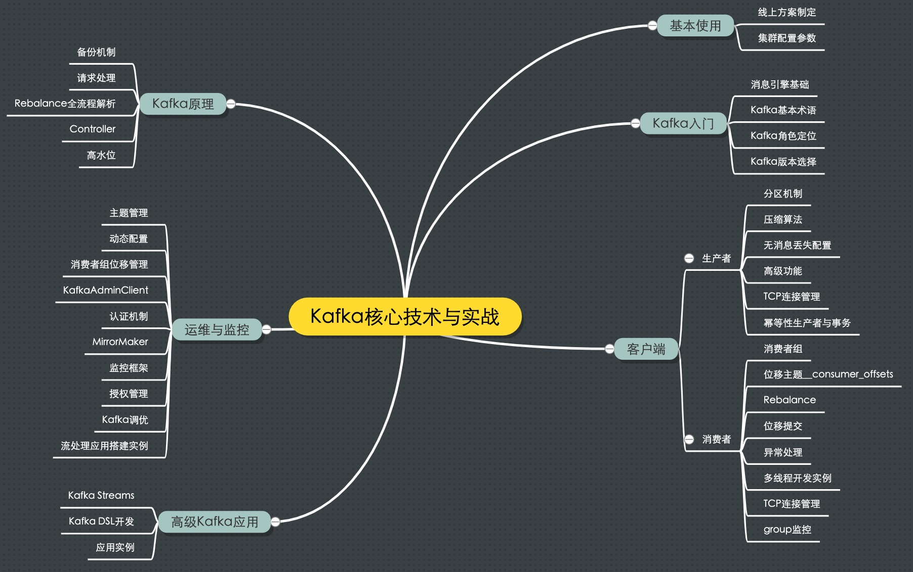

#### Kafka是什么？

Apache Kafka 是一款开源的消息引擎系统，消息引擎系统是一组规范。企业利用这组规范在不同系统之间传递语义准确的消息，实现松散耦合的异步式数据传递。

Kafka的消息编码格式：**纯二进制的字节序列**

消息引擎常见的传输协议，两种：

- **点对点模型** 也叫消息队列模型。A系统发的消息只能被B系统接收，其他任何系统都不能读取A发送的消息。
- **发布/订阅模型** 有一个主题(Topic)的概念，该模型有发送方和接收方，也称Publisher和Subscriber。多对多的关系。

Kafka同时支持这两种消息引擎模型。

Kafka的三层消息架构：

- 第一层是 主题层，每个主题可以配置M个分区，每个分区可以配置N个副本；
- 第二层是分区层，每个分区的N个副本中只能有一个充当领导者角色，对外提供服务；其他N-1个副本是追随者副本，只是提供数据冗余之用；
- 第三层是消息层，分区中包含若干条消息，每条消息的位移从0开始，依次递增。
- 最后，客户端程序只能与分区的领导者副本进行交互。

Kafka使用消息日志(Log)来保存数据，一个日志就是磁盘上一个只能追加写(Append-Only)消息的物理文件。因为只能追加写，所以避免了缓慢的随机I/O操作，改为性能较好的顺序I/O写操作，这也是实现Kafka高吞吐量特性的一个重要手段。如果不听地向一个日志写入消息，最终也会耗尽所有的磁盘空间，因此Kafka必然要定期的删除消息以回收磁盘。通过日志段(Log Segment)机制。Kafka底层，一个日志细分成多个日志段，消息被追加写到最新的日志段中，当写满一个日志段后，Kafka会自动切分出一个新的日志段，并将老的日志段封存起来。Kafka在后台有定时任务会定期地检查老的日志段是否能被删除，从而实现回收磁盘空间的目的。

Kafka的点对点消息模型，指同一条消息只能被下游的一个消费者消费，其他消费者不能染指。Kafka中实现这种P2P模型的方法是引入了消费者组(Consumer Group)。所谓的消费者组，指多个消费者实例共同组成一个组来消费一组主题。主题中的每个分区都只会被组内的一个消费者实例消费，其他消费者实例不能消费它，这样加速了消费端的吞吐量。

 如果producer指定了要发送的目标分区，消息自然是去到那个分区；否则就按照producer端参数partitioner.class指定的分区策略来定；如果你没有指定过partitioner.class，那么默认的规则是：看消息是否有key，如果有则计算key的murmur2哈希值%topic分区数；如果没有key，按照轮询的方式确定分区。

#### 压缩算法

Kafka的消息层次分为两层，消息集合(message set)以及消息(message)。一个消息集合中包含若干条日志项(record item)，而日志项才是封装消息的地方。Kafka底层的消息日志由一些列消息集合日志项组成，通常不会直接操作具体的一条条消息，总是在消息集合这个层面上进行写入操作。

Kafka中，压缩可能发生在两个地方：生产者端和Broker端。生产者端配置props.put("compression.type", "gzip");这样Producer启动后生产的每个消息集合都是经GZIP压缩过的，能很好的节省网络传输带宽以及Kafka Broker端的磁盘占用。一般情况Broker从Producer端接收到消息后原封不动的保存而不会对其进行任何修改，但两种情况除外：

- Broker端指定了和Producer端不同的压缩算法，比如，Producer指定了GZIP压缩算法，Broker指定了Snappy算法。Broker端也有一个参数叫compression.type,参数的默认值是producer，表示会尊重producer端的压缩算法，可一旦指定了不同的type，就会发生预料之外的压缩、解压操作，通常Broker端CPU飙升。
- Broker端发生了消息格式转换。所谓的消息格式转换主要是为了兼容老版本的消费者程序。还记得之前说过的 V1、V2 版本吧？在一个生产环境中，Kafka 集群中同时保存多种版本的消息格式非常常见。为了兼容老版本的格式，Broker 端会对新版本消息执行向老版本格式的转换。这个过程中会涉及消息的解压缩和重新压缩。一般情况下这种消息格式转换对性能是有很大影响的，除了这里的压缩之外，它还让 Kafka 丧失了引以为豪的 Zero Copy 特性。

通常来说解压缩发生在消费者程序中，也就是说 Producer 发送压缩消息到 Broker 后，Broker 照单全收并原样保存起来。当 Consumer 程序请求这部分消息时，Broker 依然原样发送出去，当消息到达 Consumer 端后，由 Consumer 自行解压缩还原成之前的消息。

**Producer 端压缩、Broker 端保持、Consumer 端解压缩。**

Kafka对已提交的消息做有限度的持久化保证。什么是已提交的消息？当 Kafka 的若干个 Broker 成功地接收到一条消息并写入到日志文件后，它们会告诉生产者程序这条消息已成功提交。此时，这条消息在 Kafka 看来就正式变为“已提交”消息了。目前 Kafka Producer 是异步发送消息的，也就是说如果你调用的是 producer.send(msg) 这个 API，那么它通常会立即返回，但此时你不能认为消息发送已成功完成。

这种发送方式有个有趣的名字，叫“fire and forget”，翻译一下就是“发射后不管”。这个术语原本属于导弹制导领域，后来被借鉴到计算机领域中，它的意思是，执行完一个操作后不去管它的结果是否成功。调用 producer.send(msg) 就属于典型的“fire and forget”，因此如果出现消息丢失，我们是无法知晓的。Producer 永远要使用带有回调通知的发送 API，也就是说不要使用 producer.send(msg)，而要使用 producer.send(msg, callback)。不要小瞧这里的 callback（回调），它能准确地告诉你消息是否真的提交成功了。一旦出现消息提交失败的情况，你就可以有针对性地进行处理。

Consumer 程序有个“位移”的概念，表示的是这个 Consumer 当前消费到的 Topic 分区的位置。下面这张图来自于官网，它清晰地展示了 Consumer 端的位移数据。

比如对于 Consumer A 而言，它当前的位移值就是 9；Consumer B 的位移值是 11。这里的“位移”类似于我们看书时使用的书签，它会标记我们当前阅读了多少页，下次翻书的时候我们能直接跳到书签页继续阅读。正确使用书签有两个步骤：第一步是读书，第二步是更新书签页。如果这两步的顺序颠倒了，就可能出现这样的场景：当前的书签页是第 90 页，我先将书签放到第 100 页上，之后开始读书。当阅读到第 95 页时，我临时有事中止了阅读。那么问题来了，当我下次直接跳到书签页阅读时，我就丢失了第 96～99 页的内容，即这些消息就丢失了。同理，Kafka 中 Consumer 端的消息丢失就是这么一回事。要对抗这种消息丢失，办法很简单：<strong>维持先消费消息（阅读），再更新位移（书签）的顺序</strong>即可。这样就能最大限度地保证消息不丢失。

#### 使用总结：

- 不要使用 producer.send(msg)，而要使用 producer.send(msg, callback)。记住，一定要使用带有回调通知的 send 方法。
- 设置 acks = all。acks 是 Producer 的一个参数，代表了你对“已提交”消息的定义。如果设置成 all，则表明所有副本 Broker 都要接收到消息，该消息才算是“已提交”。这是最高等级的“已提交”定义。
- 设置 retries 为一个较大的值。这里的 retries 同样是 Producer 的参数，对应前面提到的 Producer 自动重试。当出现网络的瞬时抖动时，消息发送可能会失败，此时配置了 retries > 0 的 Producer 能够自动重试消息发送，避免消息丢失。
- 设置 unclean.leader.election.enable = false。这是 Broker 端的参数，它控制的是哪些 Broker 有资格竞选分区的 Leader。如果一个 Broker 落后原先的 Leader 太多，那么它一旦成为新的 Leader，必然会造成消息的丢失。故一般都要将该参数设置成 false，即不允许这种情况的发生。
- 设置 replication.factor >= 3。这也是 Broker 端的参数。其实这里想表述的是，最好将消息多保存几份，毕竟目前防止消息丢失的主要机制就是冗余。
- 设置 min.insync.replicas > 1。这依然是 Broker 端参数，控制的是消息至少要被写入到多少个副本才算是“已提交”。设置成大于 1 可以提升消息持久性。在实际环境中千万不要使用默认值 1。
- 确保 replication.factor > min.insync.replicas。如果两者相等，那么只要有一个副本挂机，整个分区就无法正常工作了。我们不仅要改善消息的持久性，防止数据丢失，还要在不降低可用性的基础上完成。推荐设置成 replication.factor = min.insync.replicas + 1。
- 确保消息消费完成再提交。Consumer 端有个参数 enable.auto.commit，最好把它设置成 false，并采用手动提交位移的方式。就像前面说的，这对于单 Consumer 多线程处理的场景而言是至关重要的。

#### 连接管理：

Kafka所有通信是基于TCP的，包括生产者、消费者还是Broker之间的通信。<strong>在创建 KafkaProducer 实例时，生产者应用会在后台创建并启动一个名为 Sender 的线程，该 Sender 线程开始运行时首先会创建与 Broker 的连接</strong>。 bootstrap.servers 参数。它是 Producer 的核心参数之一，指定了这个 Producer 启动时要连接的 Broker 地址。请注意，这里的“启动时”，代表的是 Producer 启动时会发起与这些 Broker 的连接。因此，如果你为这个参数指定了 1000 个 Broker 连接信息，那么很遗憾，你的 Producer 启动时会首先创建与这 1000 个 Broker 的 TCP 连接。在实际使用过程中，并不建议把集群中所有的 Broker 信息都配置到 bootstrap.servers 中，通常你指定 3～4 台就足以了。因为 Producer 一旦连接到集群中的任一台 Broker，就能拿到整个集群的 Broker 信息，故没必要为 bootstrap.servers 指定所有的 Broker。Producer 向某一台 Broker 发送了 METADATA 请求，尝试获取集群的元数据信息——这就是前面提到的 Producer 能够获取集群所有Broker地址的方法。

#### 幂等性

简单来说，幂等性 Producer 和事务型 Producer 都是 Kafka 社区力图为 Kafka 实现精确一次处理语义所提供的工具，只是它们的作用范围是不同的。幂等性 Producer 只能保证单分区、单会话上的消息幂等性；而事务能够保证跨分区、跨会话间的幂等性。从交付语义上来看，自然是事务型 Producer 能做的更多。Kafka中，Producer默认不是幂等的，但可以创建幂等性Producer。 props.put(“enable.idempotence”, ture)保证幂等，enable.idempotence被设置成true后，Producer自动升级成幂等性Producer。底层具体的原理很简单，就是经典的用空间去换时间的优化思路，即在 Broker 端多保存一些字段。当 Producer 发送了具有相同字段值的消息后，Broker 能够自动知晓这些消息已经重复了，于是可以在后台默默地把它们“丢弃”掉。首先，它只能保证单分区上的幂等性，即一个幂等性 Producer 能够保证某个主题的一个分区上不出现重复消息，它无法实现多个分区的幂等性。其次，它只能实现单会话上的幂等性，不能实现跨会话的幂等性。这里的会话，你可以理解为 Producer 进程的一次运行。当你重启了 Producer 进程之后，这种幂等性保证就丧失了。

Kafka 自 0.11 版本开始也提供了对事务的支持，目前主要是在 read committed 隔离级别上做事情。它能保证多条消息原子性地写入到目标分区，同时也能保证 Consumer 只能看到事务成功提交的消息。事务型 Producer 能够保证将消息原子性地写入到多个分区中。这批消息要么全部写入成功，要么全部失败。另外，事务型 Producer 也不惧进程的重启。Producer 重启回来后，Kafka 依然保证它们发送消息的精确一次处理。

设置事务型 Producer 的方法也很简单，满足两个要求即可：

- 和幂等性 Producer 一样，开启 enable.idempotence = true。
- 设置 Producer 端参数 transctional. id。最好为其设置一个有意义的名字。

如：

Producer.initTransaction();

Try  {

​			producer.beginTransaction();

​			producer.send(record1);

​			producer.send(record2);

​			producer.commitTransaction();

}catch(KafkaException e){

​			producer.abortTransaction();

}

和普通 Producer 代码相比，事务型 Producer 的显著特点是调用了一些事务 API，如 initTransaction、beginTransaction、commitTransaction 和 abortTransaction，它们分别对应事务的初始化、事务开始、事务提交以及事务终止。这段代码能够保证 Record1 和 Record2 被当作一个事务统一提交到 Kafka，要么它们全部提交成功，要么全部写入失败。实际上即使写入失败，Kafka 也会把它们写入到底层的日志中，也就是说 Consumer 还是会看到这些消息。因此在 Consumer 端，读取事务型 Producer 发送的消息也是需要一些变更的。修改起来也很简单，设置 isolation.level 参数的值即可。当前这个参数有两个取值：

- read_uncommitted：这是默认值，表明 Consumer 能够读取到 Kafka 写入的任何消息，不论事务型 Producer 提交事务还是终止事务，其写入的消息都可以读取。很显然，如果你用了事务型 Producer，那么对应的 Consumer 就不要使用这个值。
- read_committed：表明 Consumer 只会读取事务型 Producer 成功提交事务写入的消息。当然了，它也能看到非事务型 Producer 写入的所有消息。