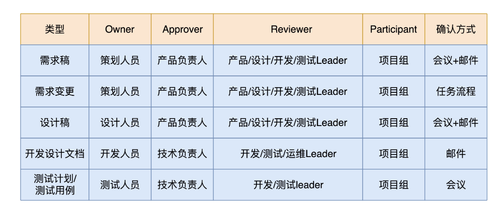

#### 项目管理

开会，不是讨论问题，而是讨论方案，开会不是要有议题，而是要有议案。

这个时候，我惯用的方式是给回三个选择：

a. 我可以加班加点完成，但是我不保证好的质量，有 bug 你得认，而且事后你要给我 1 个月的时间还债。

b. 我可以加班加点，还能保证质量，但我没办法完成这么多需求，能不能减少一些？

c. 我可以保质保量地完成所有的需求，但是，能不能多给我 2 周时间？

**数据驱动落地**

1、缩短反馈周期

2、被动分析（数据按不同的维度、属性 拆解）

3、直击行动（分析数据）

4、融入业务流程

OARP决策：OARP 是 Owner、Approver、Reviewer、Participant 的缩写，分别对应四个关键角色：

- 负责人（Owner）：负责给出方案，组织各方讨论并推进做出最终的决定；
- 批准者 （Approver)：最终批准者；
- 审核者（Reviewer）：负责人和批准者挑选出的审核人。审核者有责任对文档进行讨论分析，并提出反馈意见，负责人必须重视并给予回复；
- 参与者 （Participant）：其他提供意见的人。参与者会收到文档的相关信息，可以对相关问题做出反馈。

流程：

OARP各角色负责的事情：

#### 项目汇报

**紧急报告**，是指在项目发生突发事件，或者提示重要风险状态变化时的实时报告，比如遇到高风险延期、线上重大问题、或者重要客户投诉等，目的是向全组或者主要干系人通报项目的重要变化，以及时协调应对工作，或者第一时间寻求外部支援。一般说来，包含5个基本信息：

- 事件描述；
- 影响后果
- 跟进分析
- 响应措施，包含负责人及时间表
- 所需支持

**常规报告**，例如周报，能比较好的回答 **项目的整体进展状态到底如何？风险可控吗？目标达成有没有问题？**这三个问题。可以使用天气图标，把项目分成几个等级。

可参考的模板：

周报中，最必不可少的就是**整体项目状态评估、风险列表、项目概况及计划变更情况**。

#### 项目总结

STAR模型

S：Situation 项目背景	T：Task 完成的任务	A ：Action 完成任务做了哪些工作，怎么做的		R：Result 自己的贡献

#### 项目复杂度评估

- **要素一：子系统/功能点数量**

一般来说，一个系统越复杂，其按照功能域划分的子系统越多，其最终分解出来的具体功能点越多。子系统和功能点的增加与工作量的增加不是简单的线性增长关系，从只包含一个子系统到包含多个子系统，随着人员投入数量增多和组织的细分，其复杂度会因为组织间沟通和分工协作的难度而大大增加。在这一点来说，可以认为子系统的数量是划分简单项目和复杂项目的一个重要维度。**要素评分：**0--简单（1个子系统），5—中等复杂（2至4个子系统）， 10--复杂（>4个子系统**加权因子：**2 

- **要素二：外围接口数量**

一般的IT系统都不是系统孤岛，是和外围系统紧密相连的。与外围系统的接口数量越多，代表着进行系统间集成的复杂度越高，难度越大。这里的复杂度影响主要来自于几个方面：一个是不同系统架构间形成统一接口协议的复杂度，这需要弥合系统间差异，体现系统间关系的工作；另一个是在完全无关的两个项目组织间协调实施的复杂度，包括设计开发、联调测试等协同工作，这是比项目组内部不同子系统间的协调更为复杂的协同工作。**要素评分：**0--简单（1至5个接口），5--中等（6-10个接口），10—复杂（11-20个接口）**加权因子：**1.5

- **要素三：承载的业务数量**

在当前的IT系统架构中，往往一套体系架构上，运转着多种业务和产品。因此，一套IT系统中承载的业务和产品数量，将直接影响系统开发、配置、测试、联调工作的复杂度。**要素评分：**0--简单（1-5个业务），5—中等复杂（6-10个业务），10—复杂（>10个业务）**加权因子：**1 

- **要素四：业务数据量**

大型企业的IT系统中，很多关键系统是伴随着大量的业务数据存在着的。IT系统处理数据量的大小，直接影响到IT系统的架构设计模式。一个业务处理数据量大的系统，不仅要求从硬件规模和部署上进行复杂深入的考虑，而且在应用架构设计上要充分考虑系统的并行处理、负载均衡等要求。很多在小数据量系统中可以通过人工进行的操作，在大数据量系统中则需要通过开发系统功能来实现，如数据的审核、出错回退、数据同步等。从IT系统的特点来说，可以采用最终用户数（Subscriber）来衡量业务数据量的大小。**要素评分：**0--小型（<1000000的用户），5--中型（1000000至5000000个用户），10—大型（>5000000个用户）**加权因子：**1

- **要素五：技术复杂度**

技术复杂度来自于系统建设中对功能上的复杂技术要求，典型的场景包括最新技术架构、较高的安全要求、套装软件的集成等。目前各种IT系统建设已经从原来的烟囱式的一种业务一套处理程序，向生产线式的多种业务一套处理程序的架构转变。这种模式更多地需要搭建系统架构时，建立统一的数据模型，对业务进行充分的抽象，通过构建基础架构公共组件实现多种业务的支撑。**要素评分：**0-低、5-中、10-高。技术复杂度因素较难量化，只能根据技术要求定性分为低、中、高。**加权因子：**1 

- **要素六：需求的成熟度**

需求的成熟度是影响IT系统建设成本的重要因素。如省BOSS的高复杂度系统，因为需求比较成熟，有完善的规范来指导设计和开发，因此，其实施成本可以通过多省实施来实现架构复制，实现了成本摊平。

而很多新的业务领域，存在着业务模式频繁变化，需求不断变动的特点，此类IT系统建设，不仅要求开发商具有丰富的系统实施经验，还要具有深入的咨询能力，对人员素质要求和系统的灵活性及扩展性都有较高的要求。**要素评分：**0-需求稳定成熟 ，5-需求较新，但相对稳定，10-需求变动频繁**加权因子：**1 

- **要素七：系统的关键程度**

系统的关键程度实际上体现的是对系统的质量要求。这种质量要求体现在系统高可用性要求（如联机交易要求7*24小时的高可用性）、系统处理正确性要求（如计费帐务的正确性处理要求）、系统处理的及时性要求（如实时计费处理的时效性要求）等。系统的关键程度越高，越要在架构设计中考虑冗余处理、正确性验证、并发处理等各种手段，确保系统运行的稳定、准确、高效。**要素评分：**0-非关键系统、5-中等关键系统、10-重要关键系统。**加权因子：**1.5 

- **要素八：数据迁移的复杂程度**

IT系统的建设过程中，除了设计开发之外，更为艰巨的工作是测试和迁移。很多IT系统需要把原有系统中的数据完整地迁移到新系统中，尤其对于数据量大的系统，数据迁移需要开发很多程序和脚本，并通过充分的测试和模拟，才能实现正确和及时的数据迁移。很多原有系统还存在较多的错误数据，这些数据的清理也是一个很大的工作。**要素评分：**0-简单少量迁移，5-中等复杂迁移，10-高度复杂迁移**加权因子：**1

上述8大要素综合作用，将决定项目的复杂程度。复杂程度的高低，将直接体现在两个方面：一个是项目团队的能力，根据项目复杂程度不同，需要搭配不同数量的资深实施人员和普通技能人员；另一个是项目实施的人月数量，是由参与项目的人员所从事项目的时间累计而成。项目复杂度越高，越需要人员的技能水平越高，周期也需要更长，工作量就会越高。

 我们在评估项目复杂度时，对8大要素进行评估，把得出的评分进行加权累计，可以得出一个汇总分数。这个分数从0—100分，其高低可以体现项目的复杂度。我们初步可以采用如下公式：

**0-40分：小型项目**

**41—70分：中型项目**

**71—100分：大型项目**