# How to promote?

## 1、3个原则

### 1.1 主动原则，主动做事

工作要积极主动，这句话你一定听过吧，但你对它的理解真的准确吗？很多人，尤其是刚进入职场的同学，可能会以为“服从命令听指挥”“领导指哪打哪”就是积极主动，结果反而容易养成两个不好的习惯。

第一个不好的习惯是，认为主管肯定会帮你搞定晋升。

你可能非常信任主管，认为自己只要把主管安排的任务做好，晋升就是水到渠成的事情。所以你就算觉得现在分配的任务对自己的成长帮助不大，也不会主动跟主管沟通，而是认为“他这么安排肯定是有道理的”“也许过一段时间他就会给我安排新的任务”。这其实是不对的。

首先，并不是每个主管都会关注组员的成长。主管的做事风格可能有很多种。

有的主管特别关注业务目标是否达成，所以会花很多时间跟产品经理和项目经理沟通交流；

有的主管特别关注团队形象，要求所有对外承诺的事情都一定不能延期、一定不能出问题，所以会特别重视进度、质量和风险等情况的跟进和监控；

有的主管特别关注自己的职位爬升，所以团队成员对他来说，只是一种可利用的资源……

所以，如果你遇到的恰好是不关注组员成长的主管，就不要等着他给你分配任务了。不然你就只能长时间地留在当前的级别，做他手底下的“工具人”。

其次，就算主管关注组员的成长，他的判断也有可能跟你的判断不一致。

比如主管认为你还需要在当前岗位继续锻炼，而你却觉得自己应该尝试新的挑战了。这时候如果你不去找他沟通，他还会继续给你安排熟悉的重复任务。这样你肯定很没意思，工作状态不会太好，工作积极性也不会太高。

所以，如果你觉得自己的岗位没有太多挑战和能力提升空间的时候，就不要等着主管给你分配任务了。不然你身上的潜力就激发不出来，没法以最快的速度晋升。

第二个不好的习惯是，**被动接收信息**。

你可能认为把自己的本职工作做好就够了，其他事情自然有对应岗位的人去负责，因此你很少去主动了解很多工作相关的信息。比如下面这些信息，对于技术人员来说，它们不属于自己岗位职责的范畴，但是在晋升的时候，它们却是评判技术人员综合能力的重要考察内容：

业务功能上线后业务效果如何？

业务效果不好的可能原因是什么？

整体的业务机房的部署结构是什么样的？

这些信息，有的需要找产品运营要数据，有的需要跟业务负责人探讨，还有的需要和另外的团队交流，都需要你主动去找机会才有可能获取的。

主动规划工作任务，主动跟别人了解更多信息，合起来就是我说的**主动做事**。**主动做事的人，比等着别人安排的人更容易晋升**，这就是我总结的第一条原则，**主动原则**。

掌握主动原则之后，我们就知道要具体要怎么做了。

第一，我们要主动找主管沟通工作。

不管主管是什么风格，你都应该**定期或者不定期**地找他沟通关于工作任务的想法和意愿。一方面是听听他对自己的看法，获取指导建议；另一方面，你也可以借此机会了解更多关于团队、业务和部门的信息，有机会的情况下尽量主动承担有挑战性的工作。

不要以为主管会自己把知道的所有信息都一一跟组员分享。很多隐藏信息、非正式信息和小道信息，如果你不主动找他聊天，他不一定跟你讲的。

第二，我们要主动找别人沟通，了解更多信息。

很多人害怕主动找别人要东西，可能有性格方面的原因，但更主要的原因还是动力不足。如果你能够意识到主动沟通带来的价值，很多时候就敢放开手脚干了。这就像一个笑话说的，一个人问：“打一巴掌给 100 块，你干不干？”结果另一个人回答说：“我能让你打到破产。”

怎么获得动力呢？有个方法特别有效，就是从晋升答辩的角度来看。每当你想退缩的时候，就可以问问自己：“如果评委问到这个问题，自己能回答上来吗？”

事实上，晋升答辩的时候评委很可能会对这些问题感兴趣，比如“这个业务上线后效果怎么样？”“没有达到预期，主要原因是什么？”“机房的部署结构是什么样的？”“新加坡机房跟美国机房怎么同步？”……想到这一层，你就会逼着自己去沟通了。

### 1.2 成长原则：不断挖掘成长点

掌握了主动原则之后，你是不是已经壮志满怀，准备好大包大揽地干活儿了呢？先等一下，这里可能还有两个思维陷阱等着你。

第一个陷阱是，**以为事情做得多，自然就能晋升。**

这个陷阱很有迷惑性。不过你仔细想想，一匹马拉磨拉了 10 年，另一匹马则是征战 10 年，这两匹马的经验能一样吗？虽然拉磨的马走的距离可能更长，但如果征战的马见过的场面一定更复杂、更多样。

其实人也是这样。只做自己会做的事情，不断地重复，你只会变成熟练工，而不会成为技术专家。所以，不要把 1 年的工作经验重复 10 年，而要真正积累 10 年的工作经验。

第二个思维陷阱更有迷惑性，那就是**以为事情做得好，自然就能晋升。**

很多人都有一种朴素的想法：“我把老板安排的任务做完，保证效率和质量，拿到好的绩效，晋升肯定没问题。”结果，他们虽然拿到了好的绩效，但晋升却屡屡碰壁。

为什么会出现这种情况呢？因为不同级别的能力要求是有本质的区别的，而不仅仅是熟练度的区别。能够把事情做好，只能说明你已经熟练掌握当前级别所要求的能力，但并不一定意味着你的能力就自动达到下一职级的要求了。

现在，你可能觉得更乱了，怎么多做事、把事情做好反倒不对了呢？其实，多做事、把事情做好，当然是有用的。但它们的作用，主要体现在帮你拿到更好的绩效，更多的奖金和一定程度的工资提升。至于晋升，不光要看功劳和苦劳，更要看成长。

所以，**一边做事一边挖掘成长点、提升自己能力的人，比光顾着做事的人更容易晋升**，这就是我总结的第二条原则，**成长原则**。

现在我们再来看看，基于成长原则，我们做事时正确的做法是什么。

如果现在的工作，你已经可以得心应手地轻松完成了，就应该尝试更高难度、更高复杂度的事情了，而不是一味地刷熟练度，沉迷在自我感觉良好的状态里。

比如你一直做业务开发，已经成为了组里的骨干，不但效率高，而且质量又好。那么你就可以试着完成方案设计、架构设计、架构重构和系统优化等工作。

另外，不管事情做好了还是没做好，你都应该多做复盘总结，找到可以提升优化的点。

对于踩了坑、犯了错的事情，你肯定知道要复盘，毕竟教训的印象是非常深刻的；但是做得顺利的事情，你可能做完就完事了，不会主动去挖掘可以成长的点，这样无形中就失去了很多成长的机会，即使把事情做好了，能力提升也不大。

### 1.3 价值原则：学习为公司产出价值的技能

掌握了成长原则之后，你是不是又像“打了鸡血”一样，准备好好学习，提升几项技能了呢？别着急，我先给你讲一个真实的故事。

有一次，一个老同学问我：“华仔，你是怎么学习编译原理的？”

我觉得有点奇怪，因为他是做 Android App 业务开发的，怎么会想到要学编译原理呢？于是，我们有了下面这段对话。

我问：“你怎么想到学编译原理了？”

他说：“编译原理是所有编程语言的基础，这个算基础的技术能力吧，我觉得肯定要学。”

我又问：“你们什么时候会用到编译原理呢？”

他想了一会，说：“好像没有用到的时候。不过我觉得，多学点技术总没坏事，说不定哪天就用上了。”

我接着问：“那你学了多久了，效果怎么样？”

他叹了口气，说：“学了半年了，但是感觉没学懂，所以来问问你，看看你有什么经验。”

我说：“我也不懂，而且我建议你别学了。编译原理虽然是基础技术，但它跟你现在的工作基本没有什么关系，学习编译原理并不能让你把开发做得更好，或者给你的业务带来新的有用的功能。”

我想你一定能看出来，这位老同学很有上进心，也非常努力。但是很遗憾，编译原理这个技能对他目前的工作其实没什么帮助。换句话说，如果**从晋升角度考虑**，他学习的技能无法为当前的公司创造价值，这六个月的时间其实白白浪费掉了。

为什么我会这么说呢？其实你站在公司的角度来看，就很好理解了。

公司设计职级体系的初衷，是为了衡量不同员工的能力级别，然后根据级别来制定相应的薪酬、福利、管理等制度，同时鼓励员工尽量提升自己的能力，为公司产出更大的价值。

这里面有两个关键点，**能力级别**和**公司价值**，但是大部分人都只关注了能力级别，而忽略了公司价值这个点。

这也是晋升和面试最大的区别之一。面试的时候，面试官主要考察你的能力级别，因为这时候没有办法准确评估你能为公司带来的价值；但是在晋升的时候，不论你把能力吹得多么天花乱坠，如果不能体现在对公司价值的实际产出上，那一切都是废话。

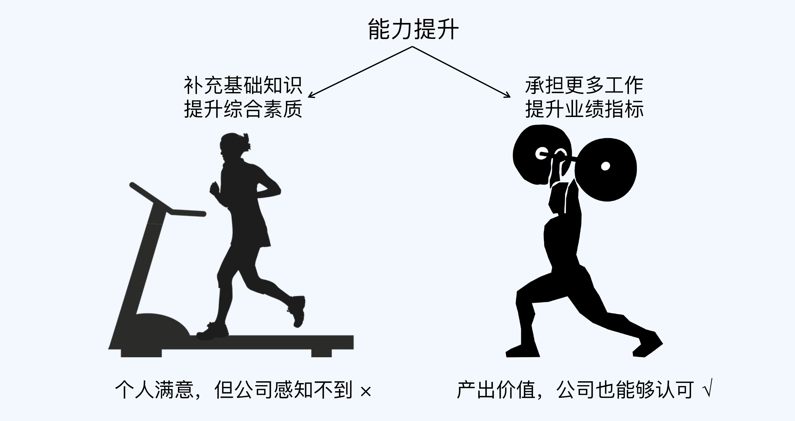

所以，也许你为了晋升，花了很多的时间和精力来提升一些“很重要”“很基础”的能力，但实际上它们可能对你的晋升根本起不到什么作用。学习编译原理，研究 Linux 内核源码，天天刷 LeetCode 题目，关注人工智能发展前沿……这些都是技术人员提升能力的时候经常踩的坑。

当然，我绝对不是说这些技能一定没有用，任何人都不应该学；而是说如果你想晋升，在投入时间和精力学一项技能之前，不妨先思考一下，你学了这个，能为公司带来什么。

**让能力为公司产出价值的人，比空有一身能力的人更容易晋升**。这就是我总结的第三条原则，**价值原则**。

所以，能为公司产出价值的能力，才是值得优先学的能力。现在我们以“人工智能”为例，用价值原则来判断一下，如果你的时间很宝贵，还值不值得学。

如果你是 P5/P6 级别，做 Android App 业务功能开发，那么用不着学人工智能，因为你现在主要工作还是把开发任务做好。

如果你是 P7/P8 级别，是带一个团队做 Android 开发的 Team Leader，或者是负责 App 架构设计的技术专家，可能就有必要学人工智能了，因为你需要规划和思考团队与业务下一步的技术演进方向跟实施步骤。

如果你是 P9 级别，那么不管是什么技术方向，肯定都要了解人工智能，因为这是一个新的技术领域和方向，而新的技术往往会带来业务上质的突破。

价值原则除了告诉我们某项技能值不值得学以外，还能告诉我们要学到什么程度。还是以“人工智能”为例，不同的人来学，学习的方法和深度也是不一样的，一定要避免陷入“学习等于看源码”这个误区。

如果你是做算法的，人工智能应用场景、算法原理、框架源码都需要去学习；

如果你是做 App 开发的，学习的重点可能就是人工智能的原理和应用场景了；

如果你是 P9 级别，学习的重点可能是人工智能的基本原理、行业的发展现状、成功和失败的案例，还有相关的产业链信息。

## 2、别人怎么判断你有没有达到要求？

### 2.1 一些看似客观的常见做法

我曾经说过，在评审阶段正式判断你的能力是否达到晋升要求的是**评委团**。

但是在这之前的提名和预审阶段，判断你能力的人，是你的主管，可能还有 HR、经理和总监等。这些人并不会像评委那样通过将近一个小时的时间来仔细确认你有没有达到晋升要求，而是会结合你的晋升材料，凭主观感觉来判断。

实际上，**主管等人**通过主观感觉来判断你能力的时候，他们的心理压力也很大。因为没有统一的客观标准，就很容易出现**说服力不足**的问题。

对于没有掌握正确判断方法的人来说，为了避免在提名或预审阶段引起争议，他们可能会采取简单粗暴的逻辑，**完全以客观条件为标准**。常见的做法，有下面 3 种。

第 1 种是以**当前级别的年限**为标准。比如同样都是 P6，你在这个级别待了 2 年了，而坐你隔壁的老王已经待了 4 年了，你的主管可能会优先提名老王去晋升。这也是很多人私底下吐槽的“优先保老员工”的现象。

第 2 种是以**工作年限**为标准。它跟第 1 种有点像，区别在于它看的是总的工作年限，而不只是在当前级别的工作时间。这也有一定的合理性，因为一些社招员工虽然来公司时间不长，但是他们之前就已经积累了很多工作经验，跟新人还是不一样的。

第 3 种是以**绩效**为标准。简单地说，就是把绩效跟能力直接挂钩，绩效好就可以去申请晋升。这样做最方便，因为绩效结果是明确的。

你可能对这些做法很熟悉，甚至觉得很有道理，但其实它们都只是**看似客观**而已。

因为年限和绩效这些条件虽然都是确定的、可以量化的，但是它们跟能力并没有直接的正相关关系。在晋升体系完备的大公司，我从来没见过评委最后靠这些条件，来判断申请者的能力有没有达到晋升要求；相反，评委们在最后总结的时候，会特别提醒主管以下两个要点：

**无论什么年限都不是我们判断能力的标准**。花 1 年时间掌握某项技能然后重复 9 年，和 10 年时间不断在提升，两者的能力差距是巨大的。

**绩效不能等同于能力。**绩效好有很多种可能的原因，能力强只是其中之一。更何况，公司已经在工资 / 奖金 / 股票方面对绩效进行了回报。至于晋升，它是对“能力提升”的一种认可，不能拿来作为绩效的回报。换句话说，**绩效关注的是业务结果，晋升关注的是能力提升。**某些人可能在当前级别做事得心应手，可以拿到很好的绩效，但是能力并没有本质的提升。

### 2.2 如何能达到晋升要求呢？

#### 2.2.1 第一条逻辑：提前做下一级别的事

既然如此，在“互联网大厂”，评委们怎么判断你有没有达到晋升的要求呢？其实很简单，他们会审查你做过的事情，看看是不是体现了**下一级别**需要的能力。

这就是我分享的第一条晋升逻辑：**在当前级别做下一级别事情的人，才有机会晋升**。

这条逻辑可能会颠覆你对晋升和工作任务安排的认知。因为按照大部分人的想法，什么级别就做什么事情，只要做好了当前级别的事情，就可以申请晋升，然后到下一级别再去做下一级别的事情。

然而实际情况是，你得提前做下一级别的事情，做好了才能申请晋升。这也就解释了为什么很多 P6 和 P7 做的事情差不多的现象。

所以，如果要判断自己是不是能够申请晋升了，一种简单有效的方式是，**看你做的事情是不是和下一级别的人类似。**想晋升的 P6 就对比 P7，想晋升的 P7 就对比 P8……以此类推。

举个例子，在很多大厂，如果你是 P6 级别的技术人员，想要申请 P7，必须要“带过小项目或者小团队”（3～5 人左右）才有机会。如果你一直只是完成别人安排的项目任务，就算做得很熟练，也很难获得提名；就算主管帮你提名了，答辩的时候也很难通过。

#### 2.2.2 第二条逻辑：做好当前级别的事

学完第一条晋升逻辑，你可能会想到一条晋升的捷径：**晋升通过之后，立刻跟主管要求安排下一个级别的工作**。这样你就可以按照下一级别的要求来提升自己的能力，很快就能迎来下一次晋升。

想的是挺美的，但是很遗憾，现实中这样做是行不通的。原因在于，就算是同一个级别，不同的人能力也还是有差异的。主管不敢把下一个级别的事情直接交给刚晋升的人来做。

所以我们还需要补充第二条晋升逻辑：**只有把当前级别的事情做好了，才有机会晋升**。

你可能会有疑问：我都晋升这个级别了，肯定已经具备这个级别的能力了，把这个级别的事情做好，不是理所当然的吗？

其实，真实的晋升逻辑并不是这样理解的。晋升成功只是意味着你的能力达到了当前级别的**基础**水平，但还不一定有**熟练**和**精通**的程度。如果你还想要晋升到下一个级别，就必须先在当前级别达到精通。

- 如果是**跨越式**职级体系，同级的人其实会被分为几档，例如“P6-/P6/P6+”、“T2C/T2B/T2A”。（也有的公司会分为 ABCD 四档，但 B 和 C 的差异很难确定，所以我不推荐这种方式，这里也不多做介绍了。）

- 如果是**阶梯式**职级体系，同级不同等的人本来就是按照“基础”“熟练”和“精通”来区分的，比如腾讯旧职级体系下的 T2.1/T2.2/T2.3。

虽然这些档次不一定在管理系统中体现出来，但是在 HR 和主管的心里一般都会有这样一个级别的划分的。下图展示了这种划分的方式：

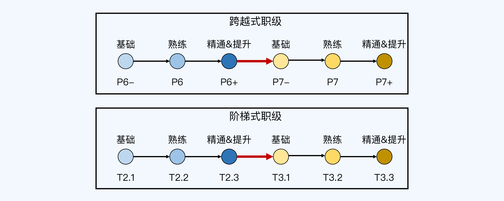

我们可以看到，只有到了精通的程度，你才有机会晋升下一级别。换句话说，只有到了精通的程度，主管才会把下一级别的任务安排给你。这就像游戏王者荣耀一样，在星耀段位内部，还分了星耀 V 到星耀 I 一共 5 个等级，只有星耀 I 的玩家才能去打王者段位的晋级赛。

这也是我把 P6+ 和 T2.3 级别标注为“精通 & 提升”的原因。因为这个级别的人，既要做当前级别的事情（因为达到了精通的程度，做起来效率高），又要去做下一级别的事情（因为达到了精通的程度，要考虑晋升了）。

所以你刚完成晋升之后，不要立刻想着做下一个级别的事，急着晋升到下一级别；而应该先考虑怎么把当前级别的事情做好，把当前级别的能力提升到“精通”的程度。

#### 2.2.3 基础、熟练和精通的区别

刚才我介绍的这两条晋升逻辑，都涉及一个关键的问题：**怎么区分基础、熟练和精通呢？**

这其实是一个世界难题，到目前为止，还没有明确客观的标准可以直接套用。不过呢，我根据自己的经验和理解，总结出了一套相对比较容易操作的标准。我来简单描述下这套标准，你可以看看是不是很好用。

**基础意味着“会做”**。如果你会做某个级别要求的事情，就说明已经具备了基础能力。当然，这里的“会”是指能够**独立自主**地完成，而不是别人想好之后告诉你，你再按照别人的话去做。

**熟练意味着“做好”**。跟基础不同，熟练是指能够把当前级别的事情做好。做好体现在做事熟练，掌握了做事的**最佳实践**，能够保证效率和质量，能够拿到好的结果。

**精通意味着“优化”**。精通是指能够**优化**当前级别的事情，比如采取不同的方式、思维和工具来做同样的事情，并取得突破。

如果要再区分一下“做好”和“优化”，我们可以这么理解：做好只是意味着掌握了别人总结的成熟经验，而优化意味着你自己创造了**新的经验**。

什么算“新的经验”呢？并不是说要“全球首创”，而是说在自己所处的环境中（团队、业务线、公司等）是新的。比如“微服务”架构，别的公司可能早就在用了，但如果把它引入到这家公司的人是你，这就算你的优化成果。

另外还要注意的是，我总结的这套标准，是用来判断在**某个级别**所要求的能力，而不是**单项技能**的水平。

#### 2.2.4 通用的步骤

现在，我们掌握了两条关键的晋升逻辑，知道了主管和评委团是如何判断你有没有达到晋升要求的。再结合第 3 讲的晋升原则，我们就可以推导出适用于各个级别的**通用晋升步骤**了。具体来说，分为以下 4 步：

第 1 步，按照晋升原则的指导，在当前级别拿到好的结果，为公司创造价值，同时把当前级别要求的能力提升到精通程度（比如从 P6- 到 P6+），这样你才有机会成为晋升备选人员。

第 2 步，到了精通程度之后，对照下一级别的要求来提升自己的各种能力（比如到了 P6+ 之后，按照 P7- 的要求来提升自己），为可能的晋升机会做好准备。

第 3 步，主动寻找工作机会，尝试做下一个级别事情（比如提升了 P7 的能力之后，找 P7 级别做的事情来做，争取成为负责人，主导事情的推进和落地），继续拿到好的结果，向主管证明你具备下一级的能力。

第 4 步，拿到工作结果之后申请晋升，向评委介绍你做过的事情，展示相关的能力和结果，证明自己具备了下一级别要求的能力。

## 3、COMD能力模型：怎么把抽象的能力要求具体化

COMD 能力模型：4 种复杂度 +3 个维度为了彻底解决要求不明确的问题，让你更好地理解不同职级的能力差异，我根据自己的思考和担任晋升评委的经验，提炼出了一套兼容性很强又容易理解的能力模型：面向复杂度的多维度能力模型（Complexity-Oriented & Multi-Dimension Capability Model），简称 COMD 能力模型。

COMD 的 CO 是指 Complexity-Oriented，意思是“面向复杂度”（灵感来源于“面向对象”）；MD 是指 Multi-dimension，意思是“多维度”，也就是技术、业务和管理 3 个维度。

COMD 的核心指导思想是，通过事情的复杂度来判断能力的高低，级别越高，所做的事情复杂度也越高。当然，如果只是单纯地用复杂度来判断能力高低，那么它本质上和其他方法也没什么不同，看不懂的地方还是看不懂，不同的人理解还是不同。所以，为了清晰地描述不同能力层级的差异，COMD 能力模型还进一步地明确了复杂度，具体包括规模复杂度、时间复杂度、环境复杂度和创新复杂度 4 种类型。

### 3.1 规模复杂度

规模复杂度是指和规模大小有关的复杂度。规模越大，复杂度越高。原因在于规模越大，节点越多，节点间的关系越复杂，而且节点间的关系复杂度是指数增长的。就像下面的图片所展示的：当节点数只有 3 个时，节点间的关系也只有 3 个；而节点数达到 6 个时，节点间的关系就变成了 15 个，复杂度提升了 5 倍。

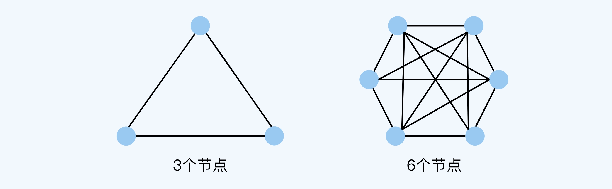

按照这个原理，我们可以对一些常见工作维度的规模复杂度进行比较，具体如下表所示

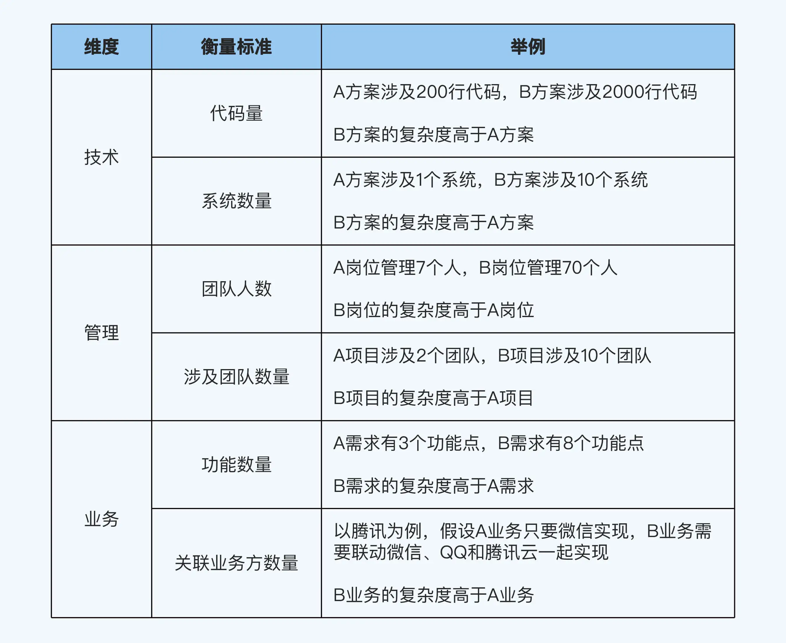

当然，以上对比的前提是，除了规模之外，其他条件都差不多。（对比其他几个复杂度时也是这样）。就像表格中 200 行代码和 2000 行代码对比，前提是代码复杂度是差不多的。因为 200 行核心代码的复杂度，显然比 2000 行拷贝粘贴的代码要高。

### 3.2时间复杂度

时间复杂度是指和时间跨度有关的复杂度。时间跨度越长，复杂度越高。原因在于万事万物都处于不断发展变化当中，时间跨度越长，变化的因素和可能方向越多，越难判断准确。

### 3.3环境复杂度

环境复杂度是指和环境不确定性有关的复杂度。我们很多的判断、决策和行为都依赖于对环境的认知和反应。总的来说，环境不确定性越高，复杂度越高。环境的不确定性具体分为环境的稳定性、环境的透明性和环境的可预见性 3 个方面：环境的稳定性，指环境变化的速度快慢。环境的透明性，指是否能够明确地获取环境相关的信息。环境的可预见性，指是否会发生完全无法预料的黑天鹅事件。环境的稳定性、透明性和可预见性越低，它的不确定性就越高，复杂度也越高。下面这个表格从宏观的角度分析了技术、管理和业务三个维度所面临的环境不确定性。

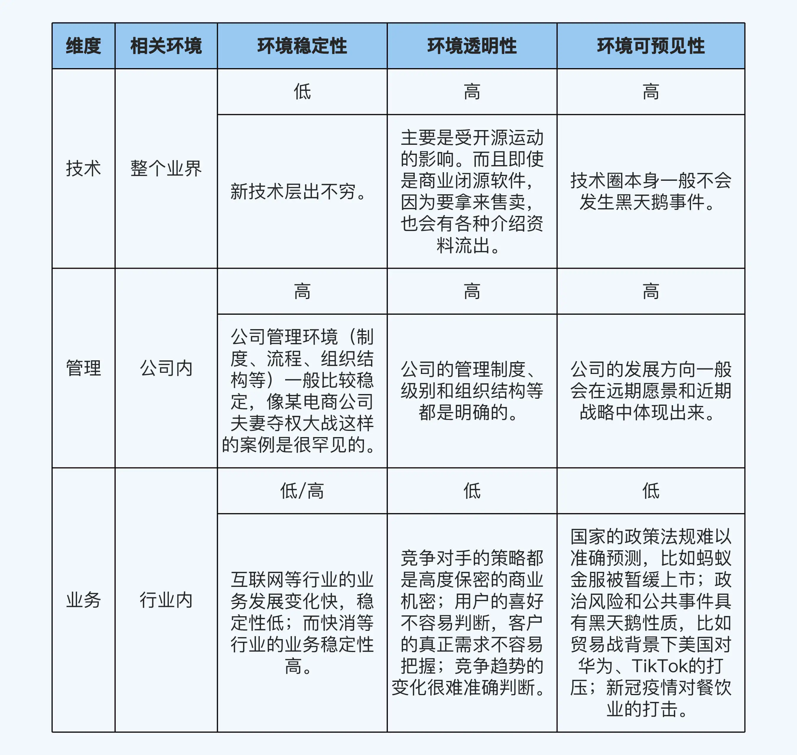

从表格中可以看出，对于互联网行业的业务来说，环境稳定性、透明性和可预见性都比较低，所以它的环境复杂度是最高的。这也是在互联网大厂，大部分 P9/P10 都需要把很多时间和精力投入到业务上的主要原因。

### 3.4创新复杂度

创新复杂度是指和创新程度有关的复杂度。

常见的创新包括理论的创新、思想（或者说方法）的创新和技巧的创新。理论创新的复杂度要高于思想创新，而思想创新的复杂度又高于技巧创新。以高可用技术领域为例：FLP 原理和 CAP 定理属于理论创新。它们奠定了分布式高可用设计的基础和边界，无论是缓存系统、存储系统、批处理系统、流式处理系统还是采用微服务架构的业务系统等，都不能跳出这两个理论的约束和限制。批处理和流处理属于思想创新。对于大数据技术来说，一开始 Google 提出的批处理思路开启了大数据时代，而后来 Storm 开启了流处理这个新的技术领域。实现 Exactly Once 特性属于技巧创新。开源框架 Flink 使用 Chandy-Lamport 算法，实现了流处理 Exactly Once 的特性，能够实现消息精确投递，避免重复消息导致业务出错。

我们可以看到，创新复杂度越高，影响的范围往往也越大。理论创新会奠定整个行业的基础，而思想创新可能开辟一个新的技术领域。另外，创新并不意味着一定要全球首创，只要相比团队当前现状来说有改进就行了；创新也不局限于技术领域，管理和业务一样可以创新。所以，下面这些事情都可以算是创新：开发 Memcache有了 Memcache 后开发 Redis引入设计模式优化代码使用微服务来拆分系统优化项目流程提出一种新的业务模式各领域的部分典型创新案例如下表所示，你可以参考对照。

除了刚才说的这 4 种通用的复杂度之外，在每个领域内部，也会有一些工作的复杂度本身就要比另一些工作高。比方说在软件开发领域，我们一般认为各项工作的复杂度排序是这样的：**从0到1创造系统>架构重构>项目方案设计>编码实现**不过这些认知是领域经验总结形成的共识，并不能通用。所以在使用 COMD 模型的时候，你还是需要结合领域经验综合判断。

### 3.5COMD 与抽象描述的对比

跟 COMD 能力模型的具体拆解比起来，它们只是脱离实际的文字游戏罢了。我就拿这一讲开头提出的“系统思考”和“前瞻判断”来说好了。系统思考比如在某些大厂，“系统思考”的确是写在 P7 级别的能力描述里，但它不是 P7 级别才有的能力特征。实际上，P6 以上的级别都要求“系统思考”，区别只是思考的范围不同，也就是规模复杂度不同而已。以 B2C 电商业务开发为例，在某些大厂，不同级别“系统思考”的范围如下图所示：

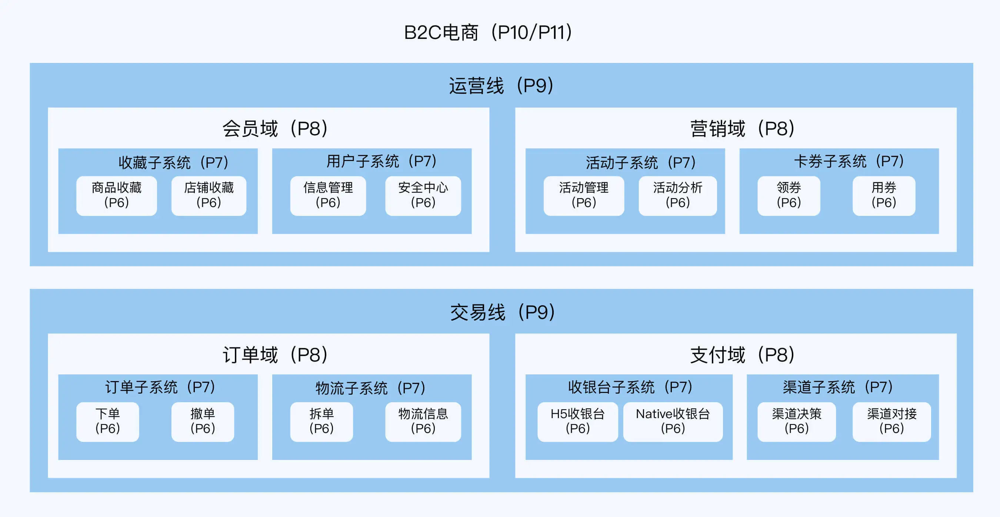

- 对于 P6 来说，系统思考的范围是某个需求，需要考虑需求的合理性、设计的可扩展性和上线后的稳定性等问题。
- 对于 P7 来说，系统思考的范围是单个系统，需要考虑的是单个系统的架构设计、架构重构和技术选型等问题。
- 对于 P8 来说，系统思考的范围是某个领域，需要考虑的是领域的发展趋势、架构演进、团队组织结构等问题。
- 对于 P9 来说，系统思考的范围是多个关联的业务域组成的业务线，需要考虑业务发展趋势、架构演进、团队组织结构等问题。

### 3.6前瞻判断

同样地，在某些大厂，“前瞻判断”虽然写在了 P8 的能力描述里，但其实 P6 以上都有前瞻性的要求，区别只是在于前瞻范围、时间跨度和面临的环境不同而已。这些因素就分别对应了规模复杂度、时间复杂度和环境复杂度。

同样以 B2C 电商业务开发为例，某些大厂 P6～P9 级别的前瞻性要求如下表所示：

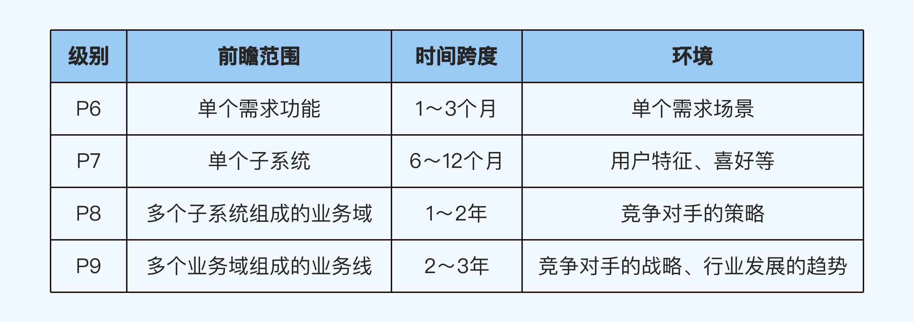

所以说，如果你还在绞尽脑汁地钻研“为什么 P7 才提出系统思考”以及“P8 要求的前瞻判断有什么深意”这样的问题，那就掉到文字陷阱的坑里去了，白白浪费脑细胞。至于怎么从坑里走出来呢？这就需要灵活应用 COMD 能力模型了。

### 3.7如何应用

当你想要了解某个级别的能力要求的时候，不要再对着那些抽象和模糊的词语，不着边际地猜测和想象了。你应该静下心，坐下来填一个“能力矩阵”的表格，把每一项的要求都完整且具体地列出来。比如下面这个“能力矩阵”表格就摘录了 P6 级别的部分要求，可以作为参考。

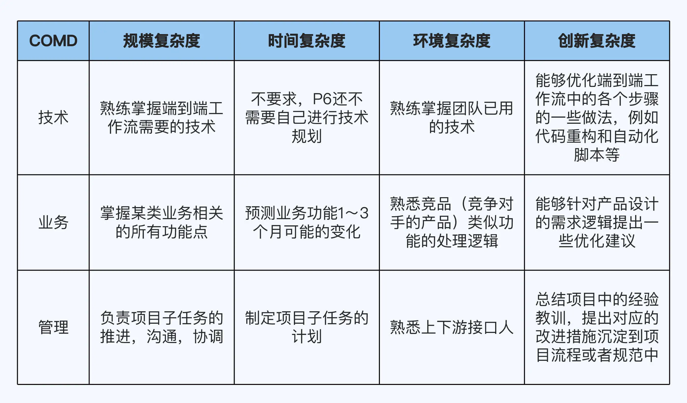

如果表格里有些内容你填不出来，说明你对这个级别的理解还不到位。不过没有关系，我会在课程的第二部分，也就是职级详解中给出每个级别通用的衡量标准。在这个基础上，你可以请教你的主管、HR 和同事等人，来完善和细化表格内容。当你详细地填完了这个表格，你也就对这个级别了解得很清楚了。接下来，你就可以对照表格，针对性地提升自己的能力。

## PPT写作，怎么写才能展现自己真正的实力

上一讲我们学习了晋升 PPT 的标准框架，这个框架里最重要的内容是自述材料，而自述材料总体的**写作指导思想**就是**金字塔原理**。根据金字塔原理，我总结了自述材料的标准模型，这个模型就像金字塔一样，中心明确，层次分明，逻辑清晰，一共包括 3 个层级。

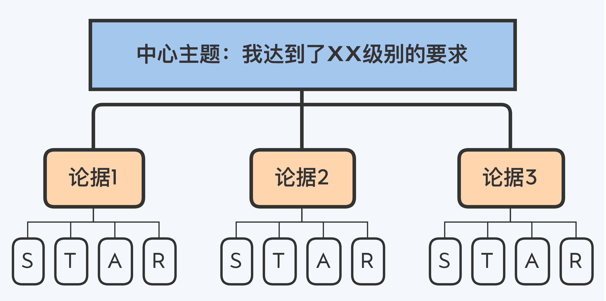

顶部是**中心主题**，自述材料的中心主题很明确，就是向评委证明你的能力达到了目标级别的要求。

中间是**论据**，也就是你用来证明自己的能力确实达到要求的依据，常见的论据包括：你负责或者参与过的项目，你带过的团队，你负责的系统或者业务。

底部是 **STAR**，也就是 Situation（情景）、Task（任务）、Action（行动）和 Result（结果）4 个部分。

接下来，我就基于这个标准模型，谈谈具体的自述材料写作技巧。

### 技巧一：把 PPT 当成提词器

很多人因为没什么演讲经验，担心自己因为紧张而忘记要讲的内容，所以就干脆把要说的话全部贴在 PPT 上。这种做法有两大坏处，一是满屏充斥的信息会把评委逼出“密集恐惧症”，二是会让评委在潜意识里产生“浪费时间”的感觉。

为什么评委会觉得“浪费时间”呢？因为他们看 PPT 的时候其实是在扫读，比你讲话的速度快多了，等他们看完了，你还没念完，这段时间就相当于一个“信息真空期”。他们得不到更多有用的内容，自然就会感到烦闷，有些评委甚至会直接打断你，说“不要再念 PPT 了”。

所以说，评委最不喜欢的就是照着 PPT 念。如果你在晋升答辩的时候踩了这个雷，会非常吃亏！

那么我们该怎么写呢？有效的做法是**把 PPT 当成“提词器”，而不是讲话稿**。换句话说，PPT 上面展示的内容不是给你念的，而是用来**提示**你要讲的内容范围的。

一方面是**提示你自己**，这一页 PPT 应该讲哪几个关键点，至于具体的详细内容，不用放上去，只需要从你的嘴说出来就行了。

另一方面也是**提示评委**，告诉他们你将要讲什么，这样评委就能够快速收集自己头脑中跟这些内容相关的知识、技能和经验，一边听你讲，一边理解并形成初步判断。

### 技巧二：围绕能力要求提炼论据

论据可以分为两类。第一类是**核心论据**，和目标级别的能力要求**强相关**，并且能够让评委眼前一亮，一般需要提炼 3～5 项。

提炼核心论据是有套路的，你可以回顾一下第 5 讲的 COMD 模型，根据目标级别的能力要求去找相关的复杂度高的工作。这些工作往往会有一些共同的特点，比如持续时间长、规模大、不确定性高、有一定挑战性或者创新性等，找起来并不难。

第二类是**辅助论据**，从侧面说明你的能力，起到锦上添花的作用，不用太多，只要 1～3 项就行。

它的价值在于，如果你和另外一位申请者在核心论据上的表现差不多，但是你准备了辅助论据而他没有，或者你的辅助论据更加亮眼，那么评委很可能给你更高的评价。

整理辅助论据也不难，一些常见的辅助论据包括参加业界技术大会（证明自己主动拓宽技术视野）、在业界技术大会上演讲（证明自己有一定的业界影响力）、发表文章、出版书籍、承担一些虚拟组织的组长（比如学习小组和交流小组）以及参与开源项目等。

### 技巧三：用 STAR 方法来描述论据

提炼好论据之后，具体要怎么向评委描述，才显得有理有据呢？

经过摸索和实践，我推荐你使用 **STAR 方法**，也就是 **Situation-Task-Action-Result**。你可能在准备简历和面试的时候用过 STAR 方法，但其实它在晋升答辩的时候也很管用。

STAR 方法的具体介绍如下：

**1. Situation（背景）**

首先是描述事情的背景。注意，不要把项目 Word 文档里的内容直接贴上去，而是应该**提炼 1～3 条关键内容摘要**。

比如某资讯类项目的背景是：

随着行业自媒体的发展，大量质量参差不齐的内容涌现，如何让优质内容快速到达目标用户成为一个很大的挑战。

这么一大段话放到 PPT 上显然是不合适的，最好提炼为：

自媒体内容推荐

不过你在讲的时候，还是应该说“随着……挑战”那段比较长的话。

**2. Task（任务）**

其次是描述你在这件事情里面的角色和负责的任务。

这里要特别注意，不要把整个项目的任务写上去，因为评委关注的是“**你在项目中发挥的作用**”，而不是“**整个项目有多牛逼**”。

我曾经遇到过一个申请晋升的同学，他在介绍项目的时候贴上了系统架构图，然后花了 2～3 分钟时间来讲解架构。

然后评委问了一句：“**这个架构是你设计的吗？**”

他回答说：“不是，我只是参与其中 XX 子系统的开发。”

结果，这部分讲解不但没有加分，反而起到了负面作用，因为评委们认为他对自己的能力和职责认识不清晰。

**3. Action（行动）**

然后是行动，你要讲清楚自己做了什么，展现了哪些能力，这是最关键的部分。你需要注意 3 点：

第一，不要把 Word 文档的内容直接贴到 PPT 上，PPT 只要展示你提炼的 3～5 个核心点就行了，其他内容得靠你自己讲出来。尽量用架构图、流程图、类图和思维导图等形式来展现，然后提炼几个关键内容用文字展现出来，其他详细内容自述的时候讲出来即可，有点像游戏中的那个梗“开局一张图，内容全靠编”，我们不能编内容，而应该是“开局一张图，内容主要靠说”。

第二，PPT 上只要写“**做了什么**”，用不着写“**为什么这么做**”。因为评委肯定会在答辩环节问到这一点，而且跟你进行多次的交流探讨。但是你无法预知评委究竟会怎么问，自述时间又很宝贵，所以不可能提前把背后的思考过程全都写上。

**4. Result（结果）**

最后是讲述事情最终的结果，这是最不容易写好的部分。

大部分人在这个环节犯的错误就是太“虚”，只有定性的描述，没有定量的描述。

正确的做法是 **“虚实结合”**，而且重点在“实”，所有事情的结果都应该围绕**效率、效果、质量和成本**这 4 个维度进行**量化评估**。

### 量化评估的原则

所谓量化评估，就是把要评估的内容转化成可以量化的数据来呈现。

那么，要怎么做这个量化呢？根据我的经验，呈现的数据要遵循以下 3 个原则：

**1. 先有基数后有比例**

比例数值要有基数说明，因为只有把基数和比例结合起来才能完整地评估结果。

比如 A 和 B 两个项目都是“渗透率从 20% 提升到 30%”，其中 A 项目的日活用户是 1000 万，而 B 项目的日活用户只有 10 万，那么从评委的角度看，A 项目的结果和价值明显要优于 B 项目。

**2. 用绝对值而不是相对值**

比例数值要用绝对值而不是相对值，因为相对值很好的原因可能是之前做得太烂。

假设 A 项目是“渗透率提升 200%”，B 项目是“渗透率提升 50%”，单纯看相对值的话，肯定是 A 项目更好，但如果用绝对值来描述，结论可能就不一样了。

比如 A 项目是“渗透率从 2% 提升到 6%”，B 项目是“渗透率从 20% 提升到 30%”，那么从评委的角度看，A 项目的结果和价值就不如 B 项目了。

**3. 将数值转换为“钱”**

在前两个原则的例子中，我们都是单纯地根据量化数据的大小来判断结果，但实际上只做这样的对比是不够的。

就算 A 项目是“渗透率从 2% 提升到 6%”，B 项目是“渗透率从 20% 提升到 30%”，A 项目仍然有可能大大优于 B 项目。为什么呢？因为可能 A 项目的功能重要性远远大于 B 项目，或者 A 项目的渗透率提升难度远远大于 B 项目。

这就引出了我们的第 3 条原则：要将数值转换为“钱”。这里的钱可以是收入、支出、成本和人力等。

比如 A 项目是“渗透率从 2% 提升到 6%，增加广告收入 3000 万”，B 项目效果是“渗透率从 20% 提升到 30%，增加会员收入 30 万”，那么从评委的角度看，A 项目虽然数值低，但业务价值明显更大。

当然，并不是每件事情的最终结果都能够转换为“钱”，所以这条原则只要尽量满足就行了，实在没办法转换的也可以不写。

在下面这个表格中，我举了一些通过量化评估实现虚实结合的例子，供你参考：

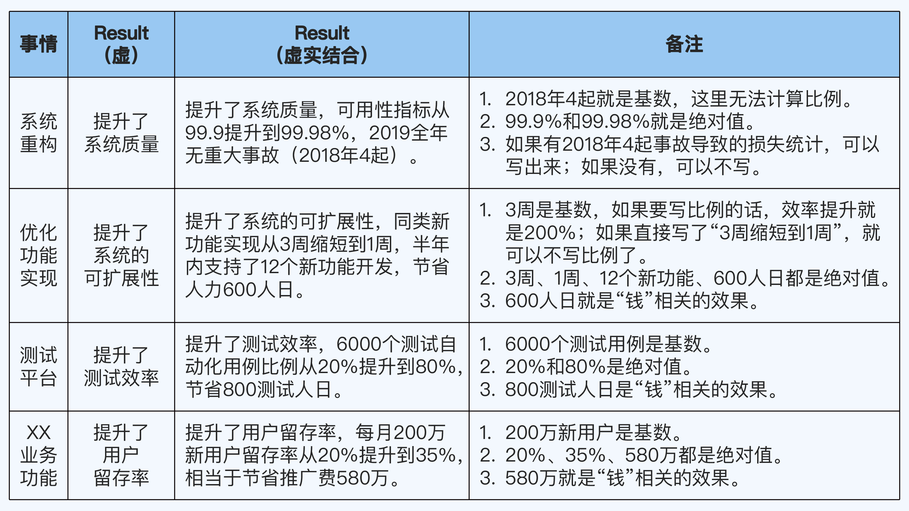

特别提醒一下，之前我一直强调，PPT 只需要写提炼出来的重点和关键词，详细内容要靠你自己讲，但展示结果的 PPT 是个例外，你一定要完整写出来。也就是说，你的 PPT 里不要写这个表格里“Result（虚）”这列的内容，而要写“Result（虚实结合）”这一列的内容。

### 分配页数的方法

我在上一讲提到过，自述材料的总页数是 10～15 页，所以单个论据建议不要超过 3 页，否则内容总量很容易超标。

那么对于一个论据来说，STAR 的 4 个部分，要怎么分配页数呢？一般情况下，你可以把背景、任务和结果放在第 1 页，然后把行动单独放在第 2 页；如果行动**比较复杂**，也可以分成 2 页，这样总页数就是 3 页。

如果某个论据真的**特别牛逼**，3 页确实不够，也一定不要超过 5 页。这 4～5 页 PPT 怎么分配呢？一般是背景和任务放第 1 页，行动放中间的几页，结果放最后的 1 页。

如果**每个行动相对独立**，没有什么关联，那么每个行动和对应的结果放在同一页来讲，这样能更方便地把行动和结果对应起来。

比如论据是 Android App 性能优化，行动 1 是优化内存，行动 2 是优化网络，那么优化内存的方法和结果放在同一页 PPT，优化网络的方法和结果放在另外一页 PPT。

## 常见疑问处理

现在你已经掌握了自述材料的基础写作技巧，但在实际写作的时候，你可能还是会遇到一些特殊情况，让你不知道到底是写还是不写，或者不知道怎么写。

接下来，我就针对 4 个常见的疑问，和你分享一下相应的应对策略。

**第 1 个疑问是，业务背景很庞大，介绍起来很费时间，那还要不要先介绍一下业务背景呢？**

之所以会有这个疑问，是因为如果不介绍背景，一上来就讲具体内容，你担心评委理解不了；如果介绍背景，又要花很多时间，你担心评委可能觉得你啰嗦。

我的建议是，要介绍业务背景，但是要根据不同的级别采取不同的方式来介绍。

如果你要晋升 P8/P9，大概率会遇到跨业务线的评委，介绍背景能让他们对你接下来讲的内容有一个大概的认知。

这时，你可以根据**产业链图**对整个行业的背景做一个概要的介绍，时间控制在 1 分钟以内。

比如，你做的是游戏直播业务，可以借助下面这张图来介绍整个游戏直播行业。

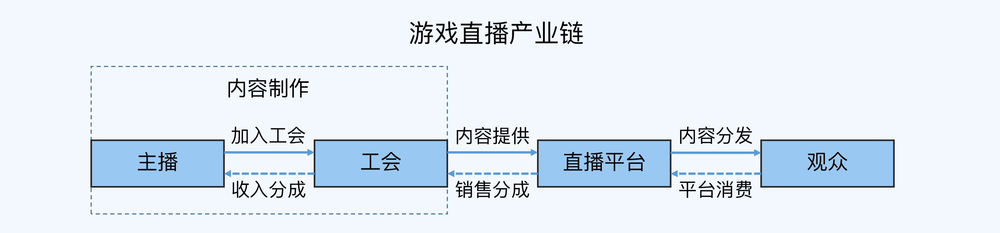

除了晋升 P8/P9 的时候可以用产业链图来介绍**行业背景**外，晋升 P7/P8/P9 的时候都可以用**业务大图**来说明你负责的业务范围，这能让评委（无论是否跨业务线）对你的职责范围和所做事情的复杂度有一个直观的了解。

以支付中台为例，如果你负责的是会员中心，可以用下面张图来统一说明。

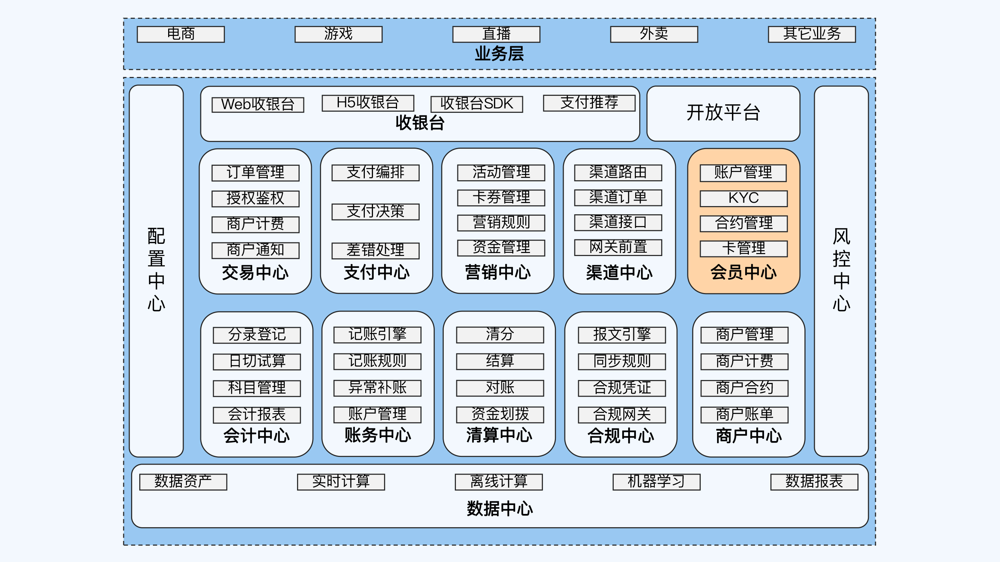

注意，这样的业务架构大图可以在 PPT 里展示，但是在讲解的时候，对于不是自己负责的部分，在整体介绍时简单带过就行了，重点放在自己负责的部分上。还是以这张图为例，我建议按照以下顺序讲解：

先整体介绍支付中台架构，从上往下分别用一句话概括每个大区块的基本作用，包括业务层、收银台、开放平台、13 个 XX 中心等。

点出自己负责的是“会员中心”，然后介绍会员中心的 4 个子项，每个子项最好也分别用一句话概括。

如果有评委问到其他区块，知道多少就讲多少，不知道也可以直接说“暂时没有深入了解”。

**第 2 个疑问是，某个项目的技术难度很高，但是最终的结果不好，可不可以讲呢？**

这里要分情况讨论。毕竟评委也知道，并不是所有项目都一定可以拿到好的结果，最终结果会受很多不确定的因素影响。

如果结果不好的原因是**你不可控的因素**，比如业务调整、市场变化、国家法律政策变化等，那么是可以讲的。讲的时候注意实事求是，不要掩饰也不要回避，分析结果不好的原因，说出自己的思考和总结。

如果结果不好的原因是**你自己导致的**，比如过度设计、错误选型以及采取了虽然先进但是你还掌握不了的技术等，这类项目就不能讲。

事实上，如果真的出现这种情况，你是没有资格申请晋升的，早在前面的提名和预审阶段就应该被刷掉，不太可能走到评审阶段。

**第 3 个疑问是，某个项目的技术难度不高，但最终结果特别好，可不可以讲呢？**

我建议就不要讲了，因为晋升 PPT 自述材料的**中心主题是向评委证明你的能力达到了目标级别的要求，而不是展示绩效。**

比如你做了一个优化项目，把日志存储耗费的机器从 100 台减少为 20 台，结果似乎非常好，但这个优化项目做法其实很简单，就是对日志进行了压缩。评委看到的时候不会认为你的能力有多牛逼，只会觉得以前做得太差了。

**第 4 个疑问是，做了 10 件事情，但是却没有 1 个特别出彩的，可不可以讲呢？**

这时候还是得分情况讨论。

如果你负责的核心工作都是这个样子，那晋升就比较危险了，评委会认为你“只有苦劳，没有功劳”。

如果出现这种问题的不是核心工作，而是辅助类的工作，还可以补救。我建议你从整体上提炼亮点，比如从积极性、主动性和责任担当等方面来展现，同时你需要提炼出一些对别人有借鉴意义的经验或者教训。不过这不能作为核心论据，只能作为辅助论据。

比如你在 P6 阶段带了 5 个新员工，其中有 1 个甚至没有通过试用期转正，但只要不是你的原因，你就可以提炼出“新员工主力导师”这样一个论据，然后展现你带的新员工结果——“4 个转正，1 个不通过”，并且提炼出作为导师的 3 条经验和 2 条教训。其实这样的论据也是能得到评委的认可的，可以作为晋升加分项。

## 小结

这一讲我跟你分享了晋升 PPT 自述材料的写作技巧，指导思想是金字塔原理，核心技巧是 STAR 方法。

现在，我们回顾一下重点内容：

写作技巧主要有三个，一是把 PPT 当成提词器，二是围绕目标级别的能力要求提炼论据，三是用 STAR 方法来描述论据。

和能力要求强相关的核心论据要提炼 3～5 项，侧面说明能力的辅助论据提炼 1～3 项，每项论据一般不超过 3 页，特别牛逼的论据也不要超过 5 页。

STAR 的结果部分要做量化评估，通过数据来呈现，需要遵循的原则有三个，一是先有基数后有比例，二是用绝对值而不是相对值，三是将数值转换为“钱”。

特殊情况灵活处理，牢记一点，自述材料的中心主题是向评委证明你的能力达到了目标级别的要求。

# PPT讲解：怎么讲才能让评委印象深刻？

### 经验一：做一个演讲者，而不是一台复读机

上一讲我分享过一个写 PPT 的技巧，把 PPT 当成提词器，而不是讲话稿。同样的道理，在讲 PPT 的时候，你要做一个演讲者，而不是一台复读机。也就是说，你不要照着 PPT 念，而应该根据 PPT 上的关键词和语句，适当地展开说明。比方说在我们介绍过的咨询类项目的例子中，PPT 上写的只有几个字——“自媒体内容推荐”；而你要讲出来的却是一大段话—— “随着行业自媒体的发展，大量质量参差不齐的内容涌现，如何让优质内容快速到达目标用户成为一个很大的挑战。”

另外还有一个小技巧，讲的时候要结合 PPT 的布局，根据从左向右、从上往下的顺序。因为评委看 PPT 的时候是按照这个顺序来看的，你不要跳着来讲，不然会增加评委理解的负担。

### 经验二：有效页 1～3 分钟，总时间 20～30 分钟

不管是晋升 PPT 还是各种技术会议的演讲 PPT，你都可以根据有效页的数量来估算时间。

什么是有效页呢？它是指去掉封面、所有目录页、Q&A、鸣谢页、封底、广告页、二维码页等过渡类和引导类页面之后，剩余的内容页。一个有效页的讲解时间建议是 1～3 分钟，平均控制在 2 分钟左右。为什么是这个时长呢？因为如果时间再短一些，讲完后评委没什么印象；时间再长一些，讲完后评委只知道你讲了很多，但具体讲了什么就记不住了。我们可以根据这个时间参考值来合并或者拆分 PPT。如果某个有效页的讲解时间不到 1 分钟，可以合并到其他页；如果某个有效页的讲解时间超过 3 分钟，可以拆成 2 页。晋升自述的时间在 20～30 分钟这个范围内，可以适当超时 3～5 分钟。但是超时太多的话，评委可能就会直接打断，或者请提醒你加速，因为评委一天可能要评 5～6 个人，时间安排是很紧凑的。根据这个总时间，我们就知道晋升 PPT 有效页的标准页数是 10～15 页，太多就需要裁剪，太少就需要补充。

### 经验三：自述讲 What，答辩讲 Why

在面评的时候，自述环节的时间是比较短的，答辩环节才是重头戏，评委主要是在答辩环节通过问答的方式来考察申请者的能力。所以，我们不要在自述环节就把内容全部讲完了，一是因为时间不够，二是因为不知道评委到底关注哪部分内容。如果我们讲了一大堆，评委都不感兴趣，反而浪费时间。合理的做法是什么呢？自述环节主要讲 What，也就是事实部分，我们做了什么；答辩环节再根据评委的问题来讲 Why，也就是这样做的原因，一般是你对技术原理的理解、你对业务的思考以及你过去总结的经验教训等。我在上一讲介绍的用来写自述材料的 STAR 方法，讲的就是 What。那么针对这些 What，常见的 Why 有哪些呢？我总结在了下面这个表格里，供你参考。

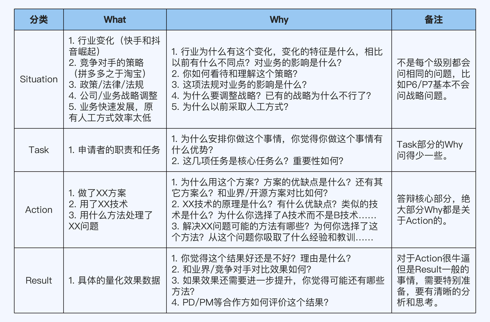

### 经验四：无论多忙都要安排模拟面评

这是最重要的经验，也是效果最好的经验。能够参与晋升评审一般都是优秀的员工，本身肯定也承担着比较重的工作任务。在时间不够的情况下，很多人都选择先完成工作任务本身，而把晋升相关的事情一直拖着。我见过很多申请者，晋升 PPT 一直拖到答辩前两天才匆匆忙忙开始写，写的时候也是东拼西凑，写完就直接拿去用了。其实这样做是非常亏的。除非出了线上的重大事故，否则对于申请人来说，晋升的优先级是最高的，毕竟 2～3 年才参加一次晋升，我们应该做好充分的准备。产品没有经过测试，你肯定不敢直接发布吧？那么晋升 PPT 没有经过测试，你怎么就敢直接拿去讲呢？俗话说得好：“临阵磨枪，不快也光。”无论多忙，我们在参加面评之前都要模拟一下，上战场之前把枪再磨一磨。

具体的方式有两种，第一种是自己试讲，你找一个会议室（实在没有会议室也可以在自己座位上），打开 PPT 演示模式，试着讲几遍。试讲的时候要注意两点，一是要发出声音，不要在心里默念；二是计时，如果试讲的时候发现时间太长，就要调整 PPT 内容或者减少某些内容的讲解时间了。

第二种方式是内部模拟面评，协调部门内的高级别人员扮演评委的角色，对你进行一次模拟面评，流程和正式面评一样，你先在自述环节讲 PPT，然后在答辩环节回答问题。内部模拟面评有三个好处：首先，你可以感受到面评的氛围，提前适应压力，等到了真正进行面评的时候就不会那么紧张了。其次，内部高级别人员曾经参加过晋升，甚至可能担任过评委，知道评委可能会关注哪些点，能够帮助你提前发现遗漏和疏忽的地方。最后，你也可以通过模拟面评发现 PPT 或者讲述内容中的一些错误。另外还有一点需要注意，这毕竟只是模拟面评，内部高级别人员的关注点不一定就和评委的关注点完全一致，不能因为内部模拟面评感觉不错就放松警惕，多做点准备总是没错的。

## 回答评委技巧

## 技巧 1：明确问题类型，回答关键内容

回答评委提问的时候，有两个很常见的错误。

一是**急于回答**，评委提问话音未落，你就赶紧开始回答，以为这样可以体现出自己在这方面了解得很清楚。

但是评委可能不这么看。如果你确实答到点子上还好；但是如果没有，评委会认为你没有抓住重点，对问题相关的内容掌握得不太好。

二是**越多越好**，评委随便问个问题，你都要说好几分钟，甚至非要等到评委打断才能收住。

这么做一方面导致你能回答的问题不多（因为总时间有限），无法充分利用这个环节展现自己的能力；另一方面也会让评委认为你抓不住重点，对工作的理解不够深刻。

正确的做法是，不要急于回答，先明确问题属于哪种**类型**，想想评委的**关注点**是什么，然后整理这方面的**关键内容**，最后再组织语言开口回答。

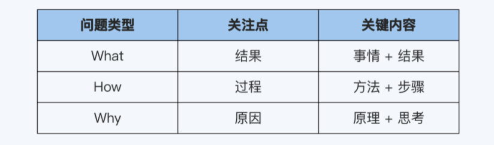

### 1. What 类问题

What 类问题关注的是**结果**，回答的关键内容是“**做了什么事情** + **拿到什么结果**”，其中事情部分最好用 3 句话能够描述清楚，结果部分尽量用数据来描述。

What 类问题问得比较少，因为大部分内容你已经在自述环节讲过了。评委问这类问题，一般是发现了你遗漏的内容，或者对某些细节感兴趣，希望更全面地了解一些信息。比如你在 PPT 里写了某个业务的日活数据，评委可能会进一步问月活和新用户留存等数据。

这类问题，你用几句话就回答清楚就行了，不要展开长篇大论，把时间控制在 30 秒以内。你也不需要为了避免评委问这类问题，就在 PPT 里面把所有的数据都列出来，因为那样会让 PPT 显得没有重点。

### 2.How 类问题

How 类问题关注的是**过程**，回答的关键内容是“**做事情的方法** + **实施的步骤**”，其中方法部分要点出**关键词**，也就是评委提问的引子，而步骤部分要有**逻辑**，常见的时间逻辑、空间逻辑和业务逻辑等都可以。

比如你在晋升 PPT 里写的是“采用微服务重构系统”，并且给出了拆分前后的架构图，然后介绍说：“我们采用微服务的方法将原来耦合的业务系统拆分成 4 个微服务子系统……”

那么评委可能会问：“你们的微服务落地过程，具体是怎么做的？”

在这个例子中，方法部分的关键词就是**微服务**，步骤部分的逻辑则可以是**业务优先级**，按照优先级从低到高的顺序进行拆分，第一步拆分 A 服务，第二步拆分 B 服务，第三步拆分 C 服务，总共拆分成 4 个服务（原有服务 + A + B + C）。

然后，你再补充一下在拆分服务的过程中，你遇到了哪些挑战和困难，分别是怎么应对的，这样就回答得差不多了。

How 类问题比较常见，因为自述环节不会展示太多过程的信息。为了全面了解你的能力，对于一些比较复杂的事情，评委一般都会关注具体的落地步骤，以及落地过程中你具体负责了哪些工作，然后再针对这些工作进行考察。

如果你在 PPT 里已经将步骤列出来了，评委可能就会直接针对具体步骤进行考察。

通常情况下，How 类问题用 1～2 分钟来回答比较合适。

### 3. Why 类问题

Why 类问题关注的是**原因**，回答的关键内容是“**技术****原理 + 思考****过程**”。具体来说，Why 类问题可以再继续细分。

**第一类是技术相关的 Why 类问题**，一般回答相关原理，包括技术理论、技术原则和技术方法论等，比如高可用的 CAP 理论、网络编程的多路复用、浏览器渲染原理等。

举个例子，评委如果问：“为什么 Netty 性能高？”你就需要回答和 Reactor 网络编程模式和零拷贝等原理相关的内容。

这类问题从回答技巧上说，比较简单。因为技术原理都是业界公认的，你能不能回答好，关键在于平时有没有积累，毕竟现场编也编不出来。

**第二类是决策相关的 Why 类问题**，一般回答决策背后的思考，包括分析过程、分析方法、分析框架和决策标准等。

举个例子，你做了一个创新的旅游业务，支持**互助旅游**。什么是互助旅游呢？就是你来我的城市，我带你玩；等到我去你的城市的时候，你再带我玩。在这个业务里，你选择了从大学生群体开始试点。

评委如果问：“为什么你要从大学生群体开始试点呢？”

你就需要从大学生的特点、业务的目标和最终决策的标准等角度来回答这个问题。比如你可以这么说：

“首先，目前中国的在校大学生，包括研究生在内，总共有 XX 万人，这是一个不小的规模，而且他们都有一定的消费能力。

“另外，大学生群体喜欢尝试新事物，学业压力没有高中那么强，有比较多的个人时间来探索世界，而他们的高中同学往往又分散在不同城市上大学，本身就有比较强的探望和旅游需求。

“总的来说，不论是从群体数量和消费能力考虑，还是从潜在需求方面考虑，大学生都满足我们的创新项目在初创期进行快速尝试和验证的要求，所以我们选择了大学生作为我们的业务试点用户。”

以上回答内容仅仅作为示例，可能并不完善。如果你是讲自己真正做的业务的话，只要你平时有这方面的思考和积累，其实是可以回答很多内容的。

这类问题是比较难回答的，因为思考没有统一的标准，同样一件事情要怎么思考，不同公司和团队的要求可能都不一样，有的要求快速尝试和验证，有的要求仔细分析和论证，没有哪种方法是绝对正确的。

但有趣的地方在于，即使我们平时没有积累，现场也能够说上几句，甚至说一大段。这很容易给我们一种错觉，以为自己每个问题都能回答一大串，晋升应该没问题，结果却往往是晋升失败。

为什么呢？很可能是因为评委并不认可我们的思考。那么怎样才能让自己的思考得到评委的认可呢？答案就是，在平时的工作中积累相关的经验，比如：

P5/P6 参加需求评审的时候，除了关注需求要做什么，也可以多听或者多问，为什么要这样设计。

P7/P8 给高级别人员汇报的时候，学习他们的分析框架、重点关注的地方和思考过程。

参加项目或者业务总结会议的时候，看看各方如何评价做得好的和做得不好的，如何分析背后的各种原因。

采用后续课程即将介绍的 “3C 做事法”“4D 总结法”“5W 分析法”等做事方法来提升自己思考的系统性和深度。

你需要注意的是，如果你要突破团队已有的成熟的方法，是需要有特别的思考和充分的准备的，不然就会面临被几个评委轮番轰炸的风险。

**第三类是综合类问题，跟技术和决策都有关系**，你的回答既要包括原理，也要包括思考。

比如评委问：“为什么你们选择 Memcache，而不是 Redis？”

你既需要回答 Memcache 和 Redis 在技术上的核心差异，也需要回答在具体业务选择 Memcache 的原因。

那么你可以这样说：“我们的业务需要做文本和图片内容缓存，数据结构简单，但可能会出现几百 K 大小的缓存对象，在缓存内容比较大的时候，Redis 的单进程模式会存在多连接 IO 操作互相影响的问题，性能不如 Memcache 的多线程模式。”

Why 类问题是答辩环节的核心，可以占到问题总数的 50% ～80%，而且级别越高，占比越高。原因在于，评委需要通过 Why 类的问题来考察到底是你自己达到了某个等级的要求，还是说你只不过是完成了别人安排的任务。

这也是评委需要把你的绩效和能力分开来看的原因。你拿到好的绩效，也不能说明能力一定有提升，可能只是因为你的主管很牛逼，而你主要是服从安排，按照他的要求完成任务；也可能只是因为你的运气比较好，正好碰到上升的业务。

通常情况下，Why 类问题也是用 1～2 分钟来回答比较合适。

就算你能回答的内容很多，也不要一上来就滔滔不绝，而是每次都应该回答几个要点。如果评委有兴趣，就会继续问下去；如果评委认为你已经达到要求了，就不会再问了。

同样以 Netty 为例，如果评委问：“Netty 高性能的原理是什么？”

你可以回答 Reactor 网络编程模式和零拷贝等原理。

评委如果还有兴趣，可能就会继续问：“Reactor 网络编程模式性能为什么高？”

这时候你再回答多路复用和多线程等内容就行了。