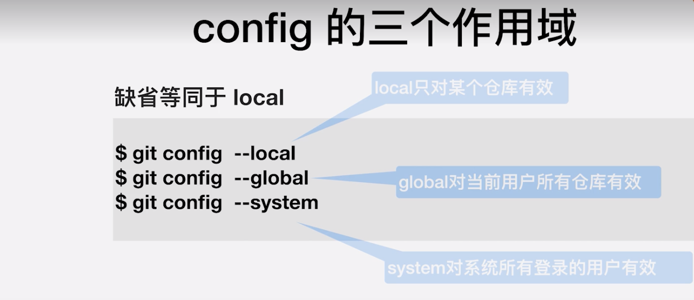
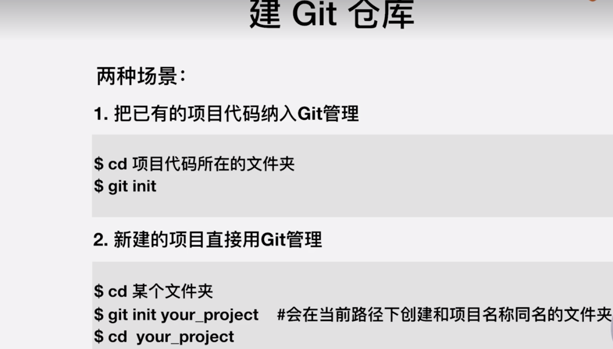
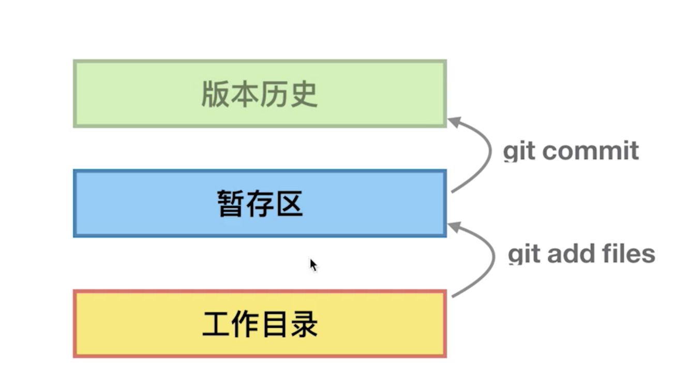
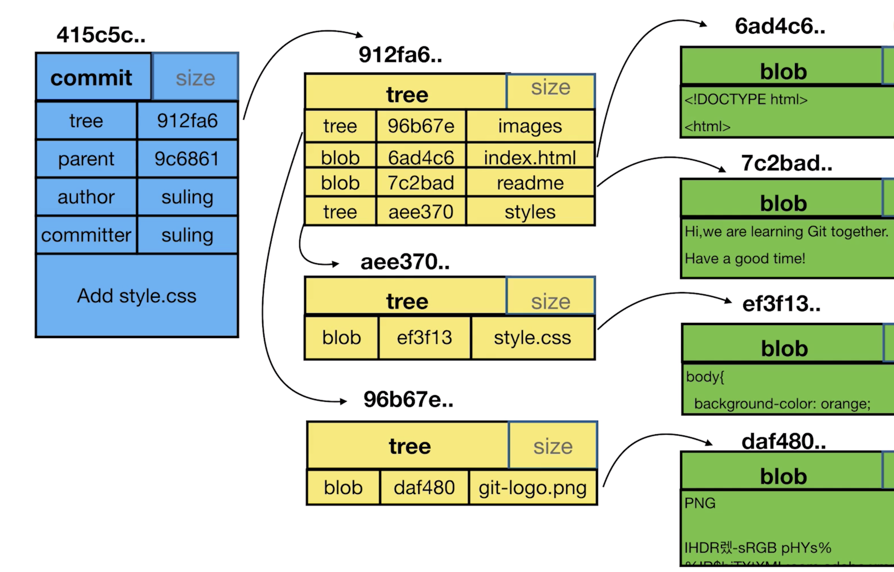
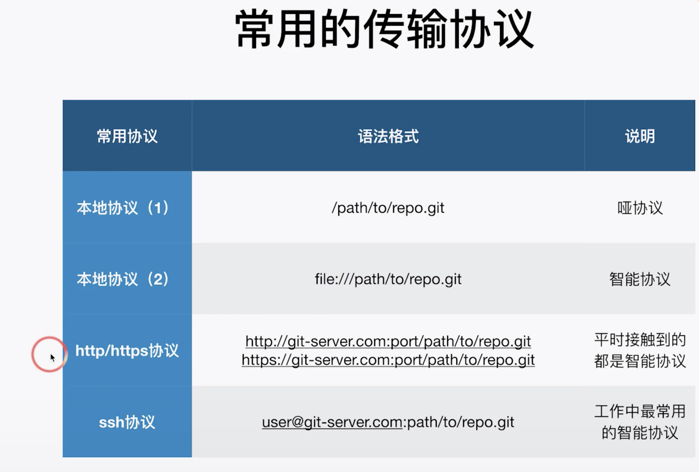
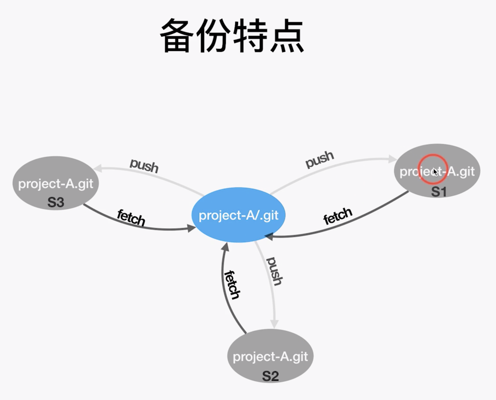

## Git 操作

### Config 配置用户名和邮箱

1. git config --local/global user.name 'DomXiao'
2. git config --local/global user.email 'xiaosywy@163.com'

config的作用域

### 两种方式新建git项目

### 命令

git 有缓冲区的概念，先添加到缓冲区，再提交

1. git mv 命令 给文件重命名  如：git mv readme readme.md，git rm readme git直接删除文件
2. git add -u 对已经添加到缓冲区的文件的更改
3. git log --oneline命令（一行显示commit信息，后边也可以加分支信息 ）  git log -n4 (查看最近4次的修改记录) 
4. git branch -v 查看本地分支版本
5. Git checkout -b 分支名 commitId   基于commit创建新的分支
6. git log --graph  图形化的方式查看log  
7. git cat-file -t xxxxx    Git 提供的接口查看文件类型（commit，blob，tree）  查看具体内容 -p   三种文件之间的关系
8. 当出现HEAD detached 时一定要注意关联到某分支，不然容易出现丢失
9. git checkout -b newBranchName commitId或者分支名  基于commit或者branch创建分支
10. Head 指针以及其父指针 Head^   git diff Head Head^
11. git branch -d 分支名  删除分支 -D强制删除 
12. git commit --amend 修改最近一次提交的commit信息
13. **git rebase -i commitId  基于某个历史的commit修改提交信息、合并commit，通常commitId选择需要变更的父级commitId  push到远程之前**
14. git diff --cached 对比暂存区和Head指向版本之间的差异，也可以指定分支中的文件去比较如：git diff version1 version2  --file1
15. git reset HEAD  如果不加文件名，则是把所有暂存区的文件恢复成跟HEAD指向的一样
16. git checkout --file  将工作区文件重置成暂存区一样
17. git reset --hard --comitId 回到某一个提交的目录
18. git stash 将某些暂时的改动存起来，下次要取出来重新编辑可用  git stash apply命令 apply命令不会删除stash里的记录，如果换pop会删除stash里的记录 

### Git协议

### Git checkout所有远程分支到本地：

~~~shell
git clone xxx
git branch -r | grep -v '\->' | while read remote; do git branch --track "${remote#origin/}" "$remote"; done
git fetch --all
git pull --all
~~~

git rebase 过程中可以使用git --abort/--continue来进行操作，成功之后如何撤销呢？

首先执行git reflog查看本地记录，可知本次rebase之前的id 为：
02a3260 HEAD@{9}: commit: adjust ds5 ir data save file formate

所以执行
git reset --hard 02a3260
即可

bfg工具

~~~shell
 git clone --mirror git://example.com/some-big-repo.git
 ## 根据情况的不同, bfg 可选择根据文件大小删除
java -jar bfg.jar --strip-blobs-bigger-than 100M some-project.git
## 根据情况的不同, bfg 可选择直接根据名字删除
java -jar bfg.jar --delete-files name-of-file  some-project.git
 cd some-big-repo.git
 git reflog expire --expire=now --all && git gc --prune=now --aggressive
 git push
~~~

### GIthub

git上开源项目的组成部分：

- name: 项目名
- description: 项目的简要描述
- 项目的源码
- README.md: 项目的详细情况的介绍

那么除了这些要素之外，项目本身的`star`数和`fork`数，也是评判一个开源项目是否火热的标准，这同时也是一个很重要的搜索标准。另外我们也要注意观察这个项目的最近更新日期，因为项目越活跃，那么它的更新日期也更加频繁。以上要素就是我们在进行搜索的时候要注意的一些关键点。

常规：

1. 直接关键字搜索	假设我们现在要搜索`React`,相信大部分小伙伴都是直接在搜索框里输入：“React”，然后一回车；
2. 按项目名搜           搜索`项目名`里面包含`React`的项目:**in:name React**，也可以加star **in:name React stars:>5000**
3. 还可以附带其他条件  如：**in:name React stars:>5000 forks:>3000**
4. 同理还可以在 description里，readme里 按以上条件搜 **in:readme React stars:>3000 forks:>3000** ，**in:description 微服务 language:python** 同时还可以带上日期：**in:description 微服务 language:python pushed:>2020-01-01**

