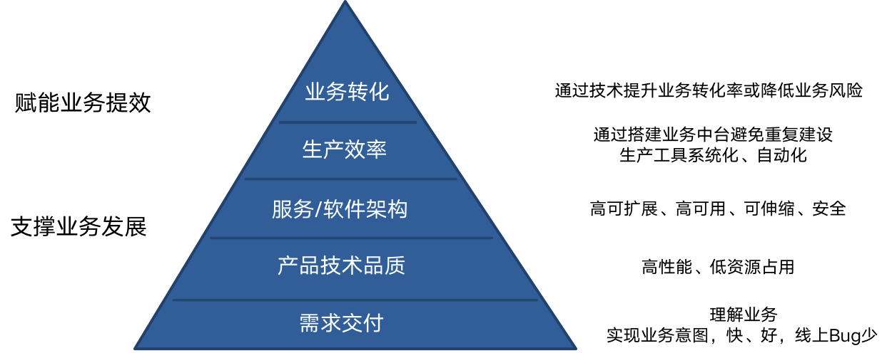

# **1.目标思考**

- 目标：利用技术，帮助业务持续实现战略目标
- 方向、维度与好的标准：

# **2.项目交付**

## **2.1对项目交付的理解**

基于共同的业务目标，共识路径、时机、节奏、资源等可讨论的问题，克服人认知偏差和行动发挥不稳定性、外部变化等不确定性问题，寻求业务目标与技术系统权衡的长线极优解。

- 目标对齐：业务意图是什么（what），为什么必须做这件事（why）；
- 路径、时机、节奏共识：本质上是寻求高ROI实现目标（how、when、why now、how much）；
  - 追求极致 VS ROI：
    - 个人认为，追求极致是关注在文化、态度和执行层，做一件事要打透；
    - ROI则是在具体是做某件事的战略层，基于当前资源、阶段做到某种程度就先停止；
- 资源：
  - 以终为始，反向寻求资源，非有多少资源做多少事；
  - 资源评估：业务建模、技术方案（粗）、人员分工、工作量预估；
- 风险控制：
  - 技术侧：
  - 文档先行，技术评审（精），抓大放小；
  - UT、CR；
- 项目管理侧：
  - 机制
    - owner制；
    - 日常例会，对齐进展、披露风险；
    - 问题上浮机制；
  - 约定及规范
    - 上游给下游提需求，下游给上游提要求
    - 规范：需求文档规范、架构/功能设计文档规范
  - 流程
    - 需求评审、技术评审、CR
  - 工具：利用好项目管理和文档工具，信息透明，防止跟丢；
- 经验
  - 尽量避免串行；
  - 留10%-30%的buffer；新人留多些，老人留少些；
  - 大型项目设milestone；
  - 0->1项目需设置deadline；
- 复盘：
  - 复盘会：
    - 业务复盘（业务效果、路径选择）;
    - 项目复盘（通过批评与自我批评来改进项目管理和增强信任）；
    - 如何改进：避免喊口号（方案可落地，需抓执行，ROI高）；
    - 匿名调研问卷对复盘过程的评价（是否有效、高效）；

## **2.2常见问题与解法**

- 战略问题:易忽略为什么现在要做这件事（whynow）、做到什么程度（howmuch），导致ROI低
- 执行问题
  - 时间紧、人少、工作量大
    - tradeoff：简化实现、技术债先欠、部分不影响本期业务意图的需求移到下版本做
    - 寻求增量：加班、加人
    - 拿来主义：非核心竞争力（通用域、支撑域）的系统用开源方案或采购
  - 需求频繁变更、插入  
    - bycase分析：归因、判断是否需要做
    - 研发团队提升包容度，PM团队提升需求把控能力
    - 下个迭代看是否有改进
- 需求优先级冲突
- 战术层技术决策的问题，AB方案如何选
  - AB方案优缺点、行业选用方案、长短期考虑与替换成本、ROI
- 产品需求的实现方式为技术系统引入了较大风险
- 没定义好问题，且愿意相信合作同事的话，没有去逼对方一把，导致问题被掩盖
- 项目管理问题
  - 上下游衔接出现问题，上游delay
  - 各岗位人员配比不合理
  - 大型项目团队的沟通问题
    - 项目管理工具
    - 分组日会，leader及骨干日会，项目进展简报
  - 某需求谁来做owner跟进

# **3.技术优化与架构演进**

## **3.1产品品质优化**

- 从用户/客户视角去优化
- 评测：端采样；QA评测；主观盲测；
- 度的把握：不影响用户主观体验，不成为用户转化卡点，若是核心指标则与行业领先的竞品对齐

## **3.2技术优化**

- 高性能：性能(RT，TP99，TP90)、吞吐量（QPS、TPS）
- 低资源占用（降成本，峰均值）：CPU、内存
- 度的把握：看阶段与ROI，要求越高投入越大，SLI与SLO如何制定
- 除了技术选型，在应用层，可以考虑：

| 维度     | 子维度                         | 做法                                                         |
| -------- | ------------------------------ | ------------------------------------------------------------ |
| 服务实例 | cache                          | cache，CAP的选择，牺牲C来换性能：缓存与DB、DB之间的数据同步  |
| 计算     | 多线程/协程，数据结构          |                                                              |
| 网络     | protobuf、连接池、异步网络框架 |                                                              |
| 内存服务 | 建数据结构                     |                                                              |
| 数据库   | mysql                          | 读写分离sql优化（索引、主键）慎用锁，读大于写的时候使用乐观锁 分库（连接多、数据库并发大）分表（查询、更新压力大） |

## **3.2架构演进**

### **3.2.1高可用**

- 制定合理的可用性目标：
  - 业务容忍度（服务分级）
  - 成本
  - 当前状况（当前SLI与容量评估）；
- 服务
  - 冗余：负载均衡、主从、分布式集群，多机房（两地三中心）
  - 隔离：隔离部署，set化
  - 流量控制：
    - 无损：应用分层+预热；
    - 有损：限流、降级、熔断；
  - 容错：超时、重试、幂等；
- 存储：CP or AP
- 发布：平滑发布、灰度发布、蓝绿发布

### **3.2.2可扩展**

- 拆分：XYZ，水平拆实例、垂直拆功能、按用户拆数据
- 解耦：
  - 分层与依赖倒置
    - 上层应用不依赖底层实现，而是依赖协议
    - 第三方依赖引入适配层
  - 异步化

### **3.2.3可伸缩**

- 存储的可伸缩

### **3.2.4安全**

- 应用层数据安全：
  - 数据库、日志、数仓，用户数据脱敏；
  - KMS管理密钥；
  - 数据备份；
  - 数据审计；
- 网络安全：采购WAF、防DDoS

### **3.2.6个人理解**

- 架构设计、优化、演进已有成熟方法论和较多可借鉴经验，需与业务诉求/团队阶段相符；
  - 在行业有相似解决方案或团队有相关经验时，可考虑1分需求，10分设计，1分实现；
- 架构演进不是单纯的技术方案：
  - 对leader：需leader判断业务阶段和ROI，并向产品负责人与业务负责人sell自己的观点，而非简单的做交付；
  - 从机制上：
    - 技术与架构优化需求与业务需求需同时纳入排期队列，按对业务的收益/风险排优先级；
    - 做技术需求和架构优化对业务的价值需要被肯定；
  - 演进的过程需对系统有敬畏心，在专业能力满足的前提下，更考验的是思考全面性与责任心；
  - 方法也很关键：
    - 明确ROI，争取更高层面的支持；
    - 跨团队协同，明确分工边界，集思广益，并发挥成员优势；
    - 定义问题，描述现象，列出路径、风险和回滚方案，讨论确认出迁移/灰度策略；

# **4.效率提升与业务赋能**

## **4.1效率提升**

- 沟通效率：
  - 坦诚清晰的文化，避免猜测和博弈；
  - 定义问题/对齐上下文的习惯；
  - 框架式思考和表述
  - 推广MECE；
  - 避免线性思考；
  - 文档化；
  - 守时/遵守规则；
- 协同效率：
  - 信息对齐；
  - 大的流程（上线流程）、机制（owner制，问题上浮机制、事故报告机制、项目复盘、allhands）、规范（需求文档规范、技术文档规范、）需执行到位；
  - 利用好工具（OKR、项目管理工具、wiki/doc等）；
  - leader需承担起与协同团队信任建立的责任；
- 工作效率
  - 工具化、自动化；
  - 沉淀经验，扩大团队公有知识：
  - 重视偶然事件；流程规范避免低级错误，管理到位避免错误重现，顶层设计优秀避免重大事故；
  - 重视wiki建设，定期维护；

## **4.2业务赋能**

- 基于对业务当前的理解，我们做了/用了/知道什么可以提升业务转化率/降低业务风险；

# **5.团队管理与效能提升**

## **5.1效能提升**

- 如何做正确的事情？
  - 寻求更多输入
  - 5W2H
  - 结果导向反推
  - 所做的动作是否对结果有促进，风险是否能hold住
  - 困难不应成为否定的理由

- 如何激励团队？
  - OKR
  - 同步决策过程
  - 授权
  - 以身作则，不双标，把自己放小
  - 与行业对比，避免自嗨
  - 挑战现状：提出正确的问题，why和sowhat
  - 即时纠偏，发现问题后不纠偏意味着默认和纵容，不区分问题大小
  - 收集反馈（复盘会，1on1，问卷调研）
  - 灵魂拷问自己
  - 1on1与allhands，创造沟通的平台