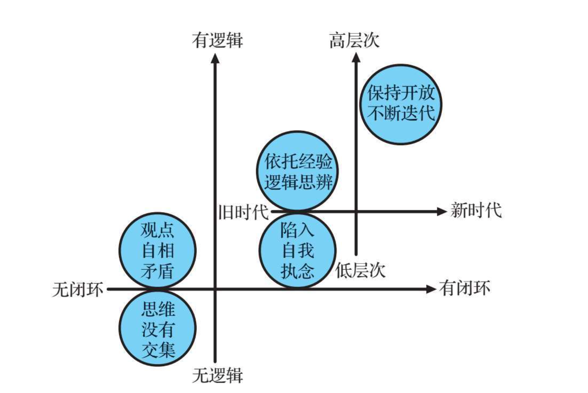

# 进步

## 1、夸奖他人

有网友问：哪些技能，经较短时间的学习，就可以给人的生活带来巨大帮助？

徐强的回答：夸奖他人。让人飘起来笑开花的利器。我研究它花了很长时间，不过站在本人的肩上，大家应该可以更快的掌握了。

======

夸奖切忌空泛。包含3个元素，你的夸奖会听上去真实可信。我将这3个元素，统称为FFC法则。它们是：

Feeling：感受，Fact：事实，Compare：对比

让我们看一个简单的例子：你的服务很赞！这个只有一个F：感受。如果我们这样说：

“你的服务很赞啊。每次杯里的水剩的不多时，你就补上了。其他人通常是等我要求加水，才过来。”

在这句话里，包含了：

感受：你的服务很赞。事实：每次杯里的水剩的不多时，你就补上了。比较：换一个人，通常是等我要求加水，才过来。

怎么样？是不是感觉真实具体了？忽略了这3个元素中的任何一个，往往你的夸奖效果，会大打折扣。

再分享一个案例。

2008年，我参加国际青年成就（JA）的公益活动。我和7、8名来自500强公司的志愿者，到上海外国语大学，给学生做一个公益的求职课程。课程在周日进行，持续5周。我是志愿者团队的组长，需要负责整体的协调工作。在课程结束后，我收到了Lucy（化名），学生志愿者团队的负责人，发来的邮件。

如下是我的回复邮件。

Hi Lucy，看到这封邮件很感动。过去的两年里，我每次做完什么事情，都是很开心的告别。因为我总觉得未来很精彩，很多事情可以尝试，总是急不可待的想向前冲。可是这次我有些沮丧。这次JA是我两年里，第一次想让时间停下来。其实感动不是从收到这封邮件开始的。在国庆节与你第一次讨论CG的时候，我就觉得你很不一样，因为你总是在谈“如何提高课程的质量”，“怎样才能让 同学们有更多的收获”，总是在想着怎么去帮助别人。即便如此，在整个课程中你还是大大超出了我的预期，无论是对工作的热情与承诺，还是才华与创意。谢谢你。能够与你一起共事，是一件非常幸运的事情。

John

让我们来看看，这3个元素：

1） 感受

看到这封邮件很感动。我有些沮丧。能够与你一起共事，是一件非常幸运的事情。

2） 事实

你总是在谈“如何提高课程的质量”，“怎样才能让同学们有更多的收获”，总是在想着怎么去帮助别人。

3）对比

过去的两年里，每次做完什么事情，都是很开心的告别 => 我两年里，第一次想让时间停下来。

国庆节与你第一次讨论CG的时候，我就觉得你很不一样 => 即便如此，在整个课程中你还是大大超出了我的预期。

## 2、为人处事篇

1.夸奖别人：感受-事实-对比，3元素法则。

2.欣赏别人。

3.换位思考：任何问题想想三个角色，你、我、他。

4.Smile。

5.撒娇：过了撒娇显可爱年纪的婚内女性用服软。

5.搭讪：结识新朋友。

6.示弱。

8.分享（故事感受收获食物用品等等）：让你结交更多朋友，也让你和很多朋友的关系更加深入。

9.沟通：尊重别人的想法，给予肯定再陈述自己不同观点；多问开放性问题，不要急于说明自己的观点。

10.培养各种兴趣爱好。

11.学会换位思考，善于察言观色，预判对方举动，心中预演态势，决断自己行动。

## 3、生活习惯篇

1.晨跑：使生活有规律有计划有节奏，改变拖延症。

2.散步，逛街，出游，多去外面走走，哪怕是不知道为什么而走。行万里路比读万卷书有效。

3.每天朗读：提升演讲能力，流利表达。

4.写日记：会增强对文字的敏感度以及反省的能力。

5.阅读（精读/快速阅读）：学习大部分有用技能的基础技能。

6.无氧/有氧运动：释放压力，激活身心。

7.早睡早起，吃早餐，远离垃圾食品。

8.自我反省，自我总结。接受自己的不完美，想办法做得好一点点。不要太刻意，做公交车的时候，排队的时候。

9.记账。

10.快速入睡，十分钟都能睡一觉，马路边上都能睡。

11.深蹲，每天深蹲4组 每组30个。体重会增加，线条会变紧，看起来更瘦精力也更充沛。

## 4、工作学习篇

1.笔记法：一张纸分成——上面大部分左右和底小部3部分，康奈尔笔记法。

2.思维导图：思维导图丛书。

3.工具：Google，知乎，Excel高级技能，Axure RP，MindManager，印象笔记。

4.技术：Python，html5 + CSS，正则表达式。

5.手绘：图是最有效的记录与表达能力。

6.※真正学会使用Ipad进行学习。

7.番茄工作法

8.GTD方法，Getting Things Done。一种将繁重超负荷的工作方式变成无压力高效的时间管理系统。

9.精通一门外语

10.记录+归类整理+总结。

## 5、好书推荐篇

1.《当我谈跑步时，我谈些什么》村上春树。

2.《写给大家的设计书》

3.《如何阅读一本书》

4.《学会提问》批判性思维。

5.《Getting Things Done》原版

《尽管去做：无压工作的艺术》中信版

《搞定！－2分钟轻松管理工作与生活》台湾版

## 6、修炼篇

1.独立思考。

- 搜集尽可能多的信息去支撑你做一个决定；
- 听取建议，但对于建议的权重要有所区分；
- 对比方案，分析其中利弊然后挑选
- 最简单的方式莫过于用张小纸条写下方案的优缺点进行横向对比
- 还有高中政治题答题套路，是什么，为什么，怎么做

2.卡耐基消除忧虑法：穷举后果，最坏打算，努力做好。

3.尝试别在意别人说的话或者做的事情。走自己的路，让别人说去吧。不以物喜不以己悲。

4.每天都问自己，是不是配得上自己想要的生活和自己想爱的人。然后，去努力。

5.调整情绪，任何急躁不安不知所措的时候都能瞬间冷静下来。

6.愤怒时，数十下。

7.精神分析，我是自己看书学的佛洛伊德式精神分析，现在有时候会给周围的朋友开导，分析。

8.心理学。

9.观察思考。

10.逻辑思辨。

11.冥想，静坐。

## 7、底层逻辑

### 1、对错观

三种角色，三种对错观，经济学家（政策制定者）、法学家（评论家）、商人（真实的人生）

1. 谁的成本更低，谁的错
2. 谁的损失更大，谁的错
3. 谁证据确凿，谁的错

例1：坏人A诱骗好人B进入C的没有锁门的工地，B失足摔死 了。请问，这是谁的错?

例2：再看一个例子。一个人走在人行横道上时，一辆卡车冲他疾驰而来，所有人都大声呼喊，叫他让开，他却淡定地说:“他不能撞我。他撞我是违反交通法规的，他负全责。我就不让。”最后，这个行人被卡车撞死了。

### 2、思考问题的底层逻辑

1. 学会区分：事实、观点、立场（什么是立场?立场就是被位置和利益影响的观点）、信仰
2. 防止“注射式洗脑”，一般别人问你“为什么XXXXXX”的时候，需要思考，为什么之后的东西真的是对的吗？你真的认同这个观点吗？一个比较有意思的例子：为什么地球是圆的？可以侧重点在为什么上，也可以侧重点在“圆的”上。对“为什么+观点”这个句式的非理性反应，是人的思维模式中的 重大Bug(漏洞)。这个Bug，常常被狡猾的人利用。

### 3、辩论

**辩论的目的**

辩论的目的，不是说服对方，而是说服观众。从规则设定上来说，对方就是不可被说服的。他可以输，但是不可被说服。所以，不要试图说服对方。对方的表达，只是你的素材，而不是你的打击对象。你的目的，是利用这些素材说服观众。就算说服不了观众，也要影响他们。就算影响不了全部，也要影响一部分。就算影响不了他们的观点，也要影响他们对你的态度。 辩论的目的，甚至不是改变观众的观点，而是改变观众的态度。态度改变了，他们会自己改变观点。没有人会接受你塞给他的观点。就算这个观点是正确的，因为是塞的，他也不愿意要。人们只会在安全、舒适、信任的氛围下，自己取走喜欢的观点。你要给观众营造一个让他们愿意取走你的观点的氛围。

**辩论的关键**

辩论的关键是什么?一场表演性质的辩论，有一个“暗黑的秘密”，就是辩论双方几乎从不会真正地正面辩论，他们只是在不断地表达自己的观点。怎么做到?需要掌握一个技巧:偷换概念。如果觉得很难听，那就换一种说法:重新定义概念。如果还是觉得难听，那就再换一种说法:纠正对方的概念。什么意思?当对方说“人性本善”时，他可能会举一个例子，某人无私地救助一个陌生人，甚至牺牲了自己的生命。这不是经过训练的，不是经过算计的，而是发自本能的，所以人性本善。

你怎么回应?如果你顺着他的思路说下去，这场辩论你就输了。你应该“纠正对方的概念”。这时，你可以快速思考:对方是怎么“定义”善的——发自内 心、本能地帮助个体。但这真的是善吗?这个人可能正在指挥一场关 乎10万人生命的战争。他救了一个人，却牺牲了10万人。正如《三 体》里那个心软的面壁人，因为所谓的“善”，害死了全人类几十亿 人。这不是善，而是披着“善”的外衣的恶。你会发现，对方其实没有和你“辩论”，他只是巧妙地重新定义了“善”，然后表述了在这个定义下为什么你是错的。那么，你应该怎么办?继续重新定义。 你看，一场你来我往的辩论赛，其实双方从来没有真正地辩论过，他们只是通过不断地重新定义一个概念的方式，表达着自己，影响着观众。

### 4、逻辑素养

1. 证有不证无。证明一件事情“有”，很简单，举个例子就行。比如我看到过白 乌鸦、黑天鹅，就证明它们是存在的。可是你要证明“天下乌鸦一般 黑”“天鹅都是白的”，靠举例是不行的。你举10000个例子，都不能 证明没有黑天鹅，只能证明你没见到黑天鹅。
2. 以偏不盖全，简单来说就是不要以偏概全。你每天好好学习，有人叫你去打麻将，你不去，他说:“读书有什么用?那个××，一本书也没读过，不也身家几千万了吗?”你怎么回答?你可以说:“他的财富撒了谎。终身学习，才能大概率成功。我羡慕他，但是他的运气不一定会降临在我身上。”
3. 证有靠举例。证“有”是相对简单的。只要有钢铁般的证据，就能证明一件事存在。比如，这个世界上是有既聪明又勤奋的人的，比如雷军、库克、刘德华。 所以，在网上不要随便说“我相信就有”。你认为“有”，就要举出例子。举不出例子，就是假说。不要用一个假说，强行说服另外一个人必须认可你的观点。
4. 概全靠推理。所谓概全，就是得出一般性结论，只能靠证明，靠推理。比如，所有商品都是用来交换的，封建地租不是用来交换的，由此可以推论出，封建地租不是商品。在网上不要随便说“这难道不是共识吗?所有人都这么认为......”，这么说，并不代表你的结论就是真理。不如利用你的逻辑思维来证明它。

### 5、逻辑闭环5个层次

逻辑思维也有高下之分。生活中，我会接触各式各样的人，有时接触一个人，交谈片刻，顿觉此人深不可测，十分厉害。而接触另一个人，会觉得这人也不错，很优秀，内心也很尊敬他，但是总感觉好像还差那么一点说不清道不明的东西。这种感觉来自什么地方呢?其实，来自一套判断标准，即这个人在谈论问题时，大概在哪个层次上形成了自己的逻辑闭环。

第一层次:思维没有闭环，思考没有逻辑。你说A，他说B，两者 之间的思维永远没有交集。

第二层次:思维没有闭环，思考有逻辑。有符合逻辑推理的一些观点，但观点时常左右徘徊，自相矛盾。这两个层次存在着明显的短板，那更高层次的思维逻辑模式是什么样的?

第三层次：思维有闭环，思考有逻辑，但闭环的层次比较低。虽然思维形成了闭环，但如果这个闭环的层次比较低，就是一件比较可悲的事情。

为什么? 一个人一旦在低层次形成了逻辑闭环，可能就无法前进了。因为所有的问题在他的逻辑闭环之中，都是可以解释的。具体的表现可能是:对不同的观点，喜欢先认同，进而快速转折，反驳。当他问你一件事对不对的时候，你是没法反驳他的，因为他当然是“对”的。但是他的观点很虚无、无法落地，就像是飘在云端看不清地面，也不知道操作细节。在这个层面上进行讨论，无法推动事情的发展，但是他享受于自己逻辑的完整性，一旦如此，也就意味着他的观点无法再落地了，对问题的讨论终究是空谈。过往的经验反倒束缚了眼界和判断，而无法打破自己的逻辑闭环，就无法捅破那层看似很薄的窗户纸，无法上升至新境界。同样是“思维有闭环，思考有逻辑”，层次还可以再提升。

第四层次:思维有闭环，思考有逻辑，且能在更高层次形成逻辑闭环，逻辑闭环十分通透，直达本质。 在这一层次的人举手投足间会流露出一股人格魅力，谈吐间有着逻辑的美，你会拜服于他过去的经验和他的知识结构，希望向他学习。

但是，第四层次的逻辑闭环同样存在问题。他对新事物总是抱有怀疑、排斥的心理，旧时代的结构一旦发生变化，他的闭环可能就会出现漏洞。他不愿承认漏洞，希冀用过往的认知体系来填补这个漏洞。当你用新的逻辑去看这个人的时候，你会发现曾经特别敬仰的一个人在新时代却还在用旧时代的逻辑来解释新世界，这让你觉得十分可惜。因为，沿着旧地图，是找不到新大陆的。

第五层次:思维有闭环，思考有逻辑，且能在高层次形成逻辑闭环，并始终保持不断打碎自己的开放心态。在这一层次的人的思维闭环永远开放，永远没有死环。他的思维是一圈圈螺旋式的，可以无限地往下延伸到深不可测的海底，也可以无限地向宇宙最深处延伸。

### 6、概率思维

如果现在有两个按钮，按下红色按钮，你可以直接拿走100万美 元;按下蓝色按钮，有一半机会，你可以拿到1亿美元，但还有一半机 会，你什么都拿不到。你会选哪一个?

你会按红色按钮，直接拿走100万美元，落袋为安，还是赌一下， 按蓝色按钮?万一拿到1亿美元，人生的“小目标”不就实现了吗?可 是，万一什么都没拿到，怎么办?还不如按红色按钮，虽然得到的比1 亿美元少很多，但至少也有100万美元。

 这就是我之前讲过的“确定效应”。 “二鸟在林，不如一鸟在手”，大部分人不愿意为了看似更大的收益冒风险，他们更喜欢虽然小一点但是确定的收益。“确定效应”就是他们的人生算法。

但是，其实这道选择题，是有正确答案的。如果你学过《5分钟商 学院》第一季的“决策树”，你就会知道，蓝色按钮对应的“期望 值”(为50%×1亿+50%×0=5000万美元)更大，是最理性的选择。 “决策树”，就是你的人生算法。

可是，即便蓝色按钮是最正确、最理性的选择，很多人还是会担 忧:“我还是有一半可能什么都拿不到啊，怎么办?有没有一种办 法，让我能确定地获得比100万美元更大的收益，增加我赢的概率 呢?”当然有。

我在“确定效应”那节课中讲过，你可以去找一个投资人，把这 个项目以低于“期望值”(5000万美元)的价格卖给他，比如2000万 美元，这样，你可以落袋为安，获得确定的2000万美元，而他则获得 了3000万美元的期望利润(5000万美元期望收益减去2000万美元成 本)。这就是基于概率思维的另一种人生算法。 不同的人生算法，导致不同的选择，从而使人们获得完全不同的
人生。

### 7、理解他人

开了很多次私董会之后，我发现一个特别有趣、值得每一个人重视和思考的现象:很多坐在这里寻求别人帮助的人所提出的问题，并不是一个问题，而是一个答案。

举个例子。有一次，一位学员提出了这样一个问题:我怎么才能给我的高管降薪?大家听到这个问题之后，就开始围绕着这个问题提问，比如“你给他降薪他有可能会离开，你希望他离开吗”，试图帮他找到解决这个问题的答案。但是，大家讨论了一会儿，并没有找到可行的方法。这时候，我引导大家去思考一个问题:为什么他会提出给高管降薪这个问题呢?

这位学员解释说，他的公司快上市了，有一次接受访谈，对方问公司的愿景是什么，价值观是什么，战略方向是什么，未来要做什么事情，谁知道他公司的五个高管的回答都不一样。这让他特别恼火。这五个高管都是他花了大价钱从外面请来的，但是业绩做得都不是很好，远远没有达到他的预期。加之，这五个人对公司的愿景、价值观等问题的认识，居然都没有达成一致。所以，他决定给他们降薪，因为他觉得，他们不值现在的价钱。在这种情况下，他才提出了这次私董会上所问的问题。了解了前因后果之后，大家才知道，原来“给高管降薪”其实并不是他的问题，而是他想出来的能解决问题的答案。

我们往下深挖一层，公司业绩不好、高管的认识没有达成一致，才是他真正的问题。而给高管降薪是他认为的能解决这个问题的答案。但是，给高管降薪，真的是解决这个问题的答案吗?如果大家按照他的思路，帮助他解决了如何给高管降薪这个问题，那么也许并不能给他真正的帮助，反而会给他的公司带来更大的麻烦。
  所以，他提出的其实并不是真正的问题，而是一个他试图用来解决真正问题的答案。这种时候，盲目地顺着他的思路去回答他的问题，可能反而会害了他。我们应该做的，是先去理解他为什么会提出这个问题。

我们描述一件事情，有三个角度: What(是什么); Why(为什么); How(怎么办)。

 这是三个非常神奇的词，很多人在表达中容易混淆它们，最后就会变成这样的情况——我觉得我表达得很清楚，但是对方却完全没听
明白。在那位学员的问题“如何给高管降薪”中，给高管降薪，是 What;如何给高管降薪，是How。What，成了Why的答案;而How，成了 What的答案。在理解What和解决How之前，更重要的是，需要首先理解Why。理 解了Why，才能找到他所面临的真正问题。重新定义这个真正的问题之后，再去找到What和How，这个Why才 能被解决。否则，问题可能会越来越严重。如果在描述事情的时候，能把What、Why、How区分清楚，对一个 人来说，就是一个巨大的提升。