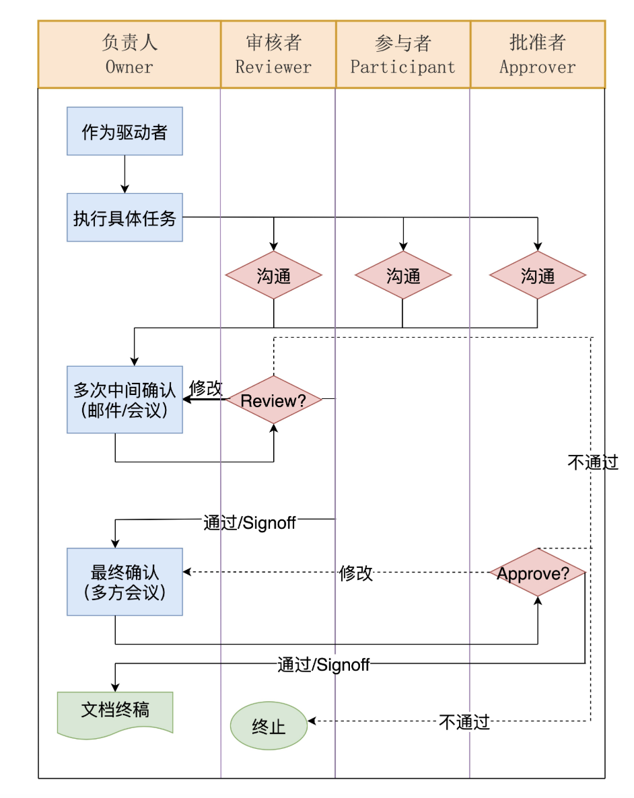
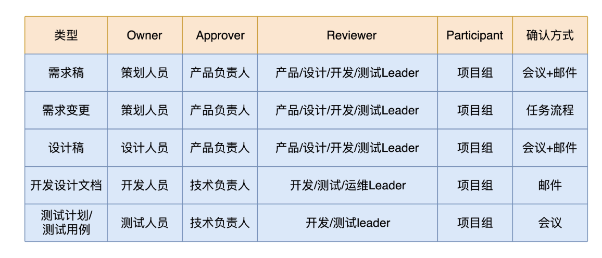

#### 项目管理

OARP决策：OARP 是 Owner、Approver、Reviewer、Participant 的缩写，分别对应四个关键角色：

- 负责人（Owner）：负责给出方案，组织各方讨论并推进做出最终的决定；
- 批准者 （Approver)：最终批准者；
- 审核者（Reviewer）：负责人和批准者挑选出的审核人。审核者有责任对文档进行讨论分析，并提出反馈意见，负责人必须重视并给予回复；
- 参与者 （Participant）：其他提供意见的人。参与者会收到文档的相关信息，可以对相关问题做出反馈。

流程：

OARP各角色负责的事情：

