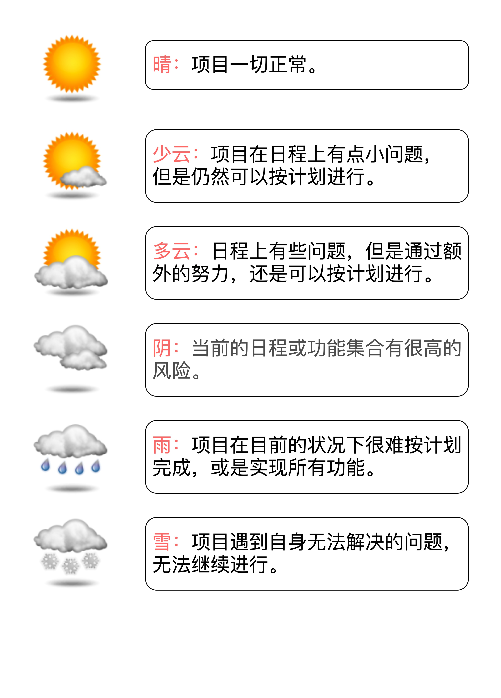
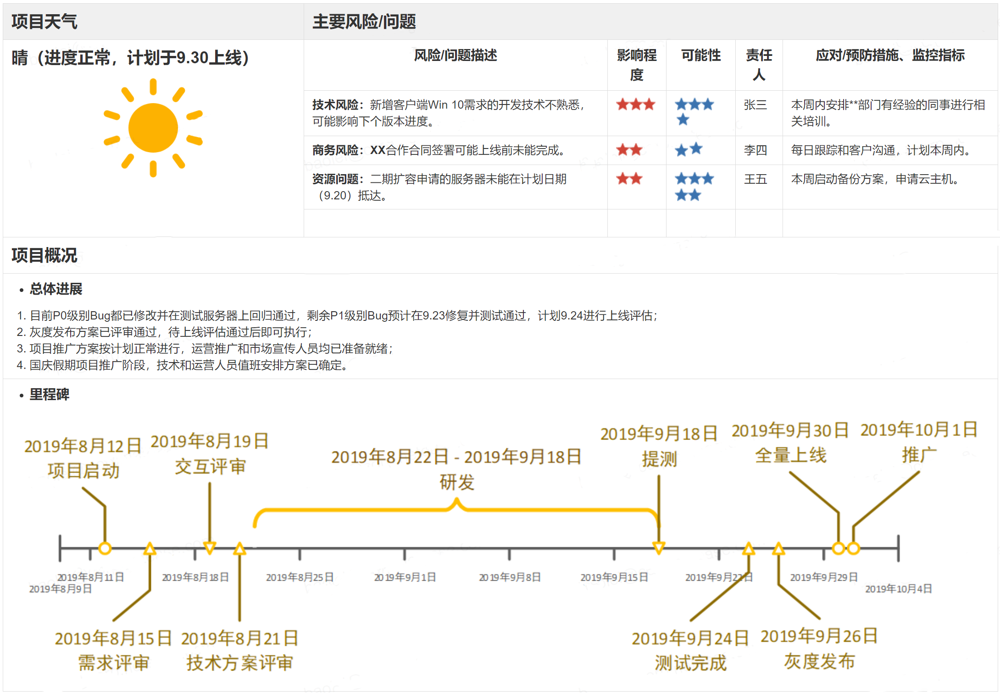

#### 项目管理

开会，不是讨论问题，而是讨论方案，开会不是要有议题，而是要有议案。

这个时候，我惯用的方式是给回三个选择：

a. 我可以加班加点完成，但是我不保证好的质量，有 bug 你得认，而且事后你要给我 1 个月的时间还债。

b. 我可以加班加点，还能保证质量，但我没办法完成这么多需求，能不能减少一些？

c. 我可以保质保量地完成所有的需求，但是，能不能多给我 2 周时间？

**数据驱动落地**

1、缩短反馈周期

2、被动分析（数据按不同的维度、属性 拆解）

3、直击行动（分析数据）

4、融入业务流程

OARP决策：OARP 是 Owner、Approver、Reviewer、Participant 的缩写，分别对应四个关键角色：

- 负责人（Owner）：负责给出方案，组织各方讨论并推进做出最终的决定；
- 批准者 （Approver)：最终批准者；
- 审核者（Reviewer）：负责人和批准者挑选出的审核人。审核者有责任对文档进行讨论分析，并提出反馈意见，负责人必须重视并给予回复；
- 参与者 （Participant）：其他提供意见的人。参与者会收到文档的相关信息，可以对相关问题做出反馈。

流程：

OARP各角色负责的事情：

#### 项目汇报

**紧急报告**，是指在项目发生突发事件，或者提示重要风险状态变化时的实时报告，比如遇到高风险延期、线上重大问题、或者重要客户投诉等，目的是向全组或者主要干系人通报项目的重要变化，以及时协调应对工作，或者第一时间寻求外部支援。一般说来，包含5个基本信息：

- 事件描述；
- 影响后果
- 跟进分析
- 响应措施，包含负责人及时间表
- 所需支持

**常规报告**，例如周报，能比较好的回答 **项目的整体进展状态到底如何？风险可控吗？目标达成有没有问题？**这三个问题。可以使用天气图标，把项目分成几个等级。

可参考的模板：

周报中，最必不可少的就是**整体项目状态评估、风险列表、项目概况及计划变更情况**。

