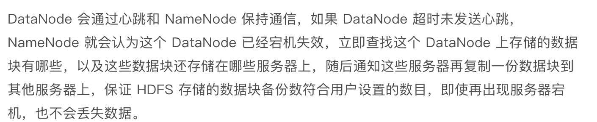

### 大数据相关知识
RAID0  N块磁盘，数据平均拆分成N份，读、写是一块磁盘的N倍，不做数据备份

RAID1  同时写入两块磁盘，可通过数据复制自动修复，可靠性高

RAID10 是RAID0和RAID1 一起，利用率低，有一半用来备份

RAID3  数据拆分成N-1份，并发写入，第N快磁盘记录校验数据，任何磁盘损坏可以修复，第N快磁盘易坏，

不常用
常用RAID5 （N-1)块磁盘存储数据 
RAID6 （N-2）快磁盘存储数据

#### HDFS 的高可用

- 数据存储故障容错
  对于存储在 DataNode 上的数据块，计算并存储校验和，（CheckSum）读取数据时再校验

- 磁盘故障容错
  DataNode检测到磁盘损坏，报告BlockId给NameNode，NameNode检测数据备份，通知DataNode复制数据-

- DataNode故障

  

- NameNode故障
  主要是通过主从热备的方式提供高可用的服务。

#### HDFS如何通过大规模分布式服务器集群实现数据的大容量、高速、可靠存储、访问的？

- 文件数据以数据块的方式切分，数据块可以存储在集群任意 DataNode 服务器上，所以HDFS存储的文件可以非常大，
  一个文件理论上可以占据整个HDFS服务器集群上所有磁盘，实现大容量存储。
- HDFS 访问模式是通过MapReduce程序在计算时读取，MapReduce对输入数据进行分片读取，通常一个分片就是一个数据块,每个数据块分配一个计算进程,这样就可以同时启动很多进程对一个HDFS文件的多个数据块进行并发访问，实现数据的高速访问。
- DataNode存储的数据块会进行复制，使每个数据块在集群里有多个备份，保证了数据的可用性，通过一系列故障容错手段实现HDFS系统中组件的高空用，从而保证数据和整个系统的高可用。

**洞察力源于对事物的抽象能力**
遇到问题的时候，停下来思考一下，现象背后的规律是什么。通过不断的训练，提升洞察力。
大数据领域的一个架构模式，**集中管理，分布存储与计算**。
5-20-2法则
5分钟了解这新知识的特点、应用场景、要解决的问题
20分钟理解它的设计原理、核心思路
2小时看关键的设计细节，做一个Demo

**我们常常意识不到问题的存在，直到有人解决了这些问题。**
移动计算比移动数据更划算这一大数据计算基本原则

Spark有三个主要特征：
**RDD的编程模型更简单、DAG切分的多阶段计算过程更快速、使用内存存储中间结算结果更高效**。

当数据以写操作为主，而读操作集中在最近写入的数据上时，使用LSM树可以极大程度地减少磁盘的访问次数，加快访问速度。

Stackoverflow   OutOfMemory？？

数据库与缓存的一致性
1、更新操作  先淘汰缓存、再操作数据库

