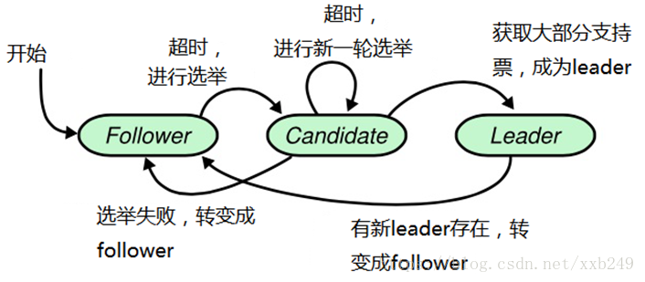

# Raft 协议

状态机：

状态非常少，分别Follower，Candidate，Leader

简要说明：

1）稳定状态，集群只有一个Leader节点，其他都是Follower节点；

2）获取大部分支持票，表示支持票至少是集群节点数/2+1;

3）相同任期Term下，每人只有一票，先发起投票的节点，先把票投给自己。

4）当第一轮选不出Leader时，便令所有的candidate随机sleep（raft论文成为timeout）一段时间，然后马上开始新一轮的选举，这里的随机sleep就起到很关键的因素，第一个从sleep状态恢复过来的candidate会给所有candidate发出投票申请，还没有苏醒的candidate只能投票给苏醒的candidate，有效解决candidate都投票给自己的故障。

## Raft数据一致性策略

Raft协议强烈依赖Leader节点来确保集群数据一致性。Client发送的数据先到达Leader节点，Leader接收到数据后标记uncommitted，随后Leader向Follower复制数据并等待响应，在获得集群中大于N/2个Follower的已成功接收数据完毕的响应后，Leader标记数据状态为Committed，随后向Client发送数据已接收确认，在向Client发出已接收数据后，再向Follower节点发通知表面数据状态为committed。

## 相关概念？

1）Leader Election

- election timeout random 150ms~300ms，the follower becomes candidate after election timeout,and starts a new election term……send vote request to other nodes.

2）Log Replication

Raft是一个一致性协议，提供几个重要的功能：
1、Leader选举
2、成员变更
3、日志复制
